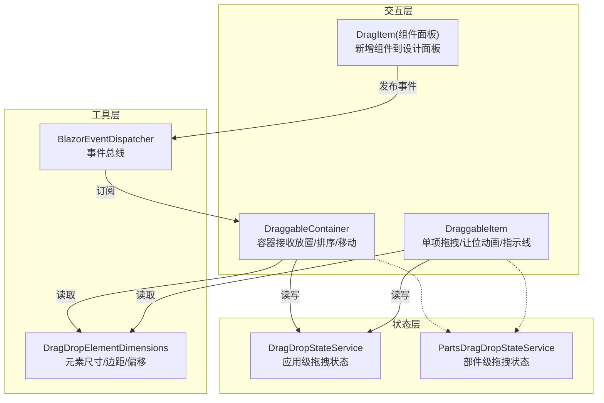
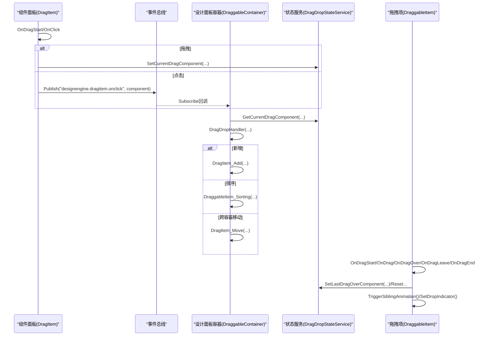
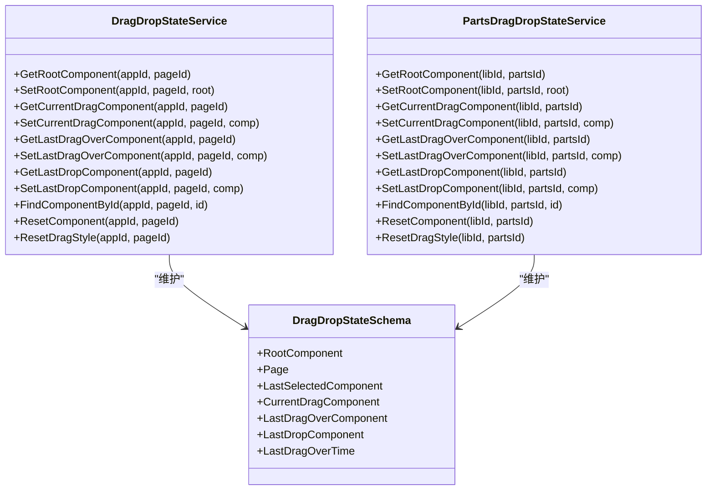
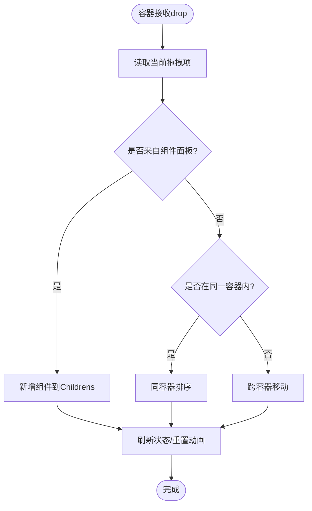
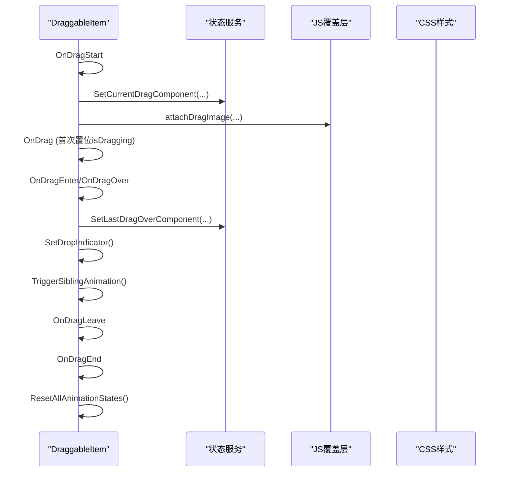
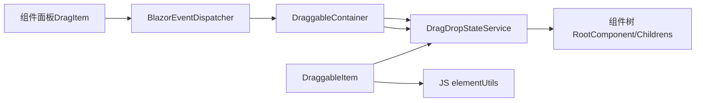

# 拖拽系统

<cite>
**本文引用的文件**
- [DragDropStateService.cs](file://src/LowCode/DesignEngine/H.LowCode.DesignEngine/Services/DragDropStateService.cs)
- [PartsDragDropStateService.cs](file://src/LowCode/DesignEngine/H.LowCode.PartsDesignEngine/Services/PartsDragDropStateService.cs)
- [DragDropElementDimensions.cs](file://src/LowCode/DesignEngine/H.LowCode.DesignEngineBase/Dtos/DragDropElementDimensions.cs)
- [DraggableContainer.razor](file://src/LowCode/DesignEngine/H.LowCode.DesignEngine/DraggableComponents/DraggableContainer.razor)
- [DraggableItem.razor](file://src/LowCode/DesignEngine/H.LowCode.DesignEngine/DraggableComponents/DraggableItem.razor)
- [DragItem.razor（组件面板）](file://src/LowCode/DesignEngine/H.LowCode.DesignEngine/ComponentPanel/DragItem.razor)
- [BlazorEventDispatcher.cs](file://src/Utils/H.Util.Blazor/BlazorEventDispatcher.cs)
</cite>

## 目录
1. [简介](#简介)
2. [项目结构](#项目结构)
3. [核心组件](#核心组件)
4. [架构总览](#架构总览)
5. [详细组件分析](#详细组件分析)
6. [依赖关系分析](#依赖关系分析)
7. [性能考量](#性能考量)
8. [故障排查指南](#故障排查指南)
9. [结论](#结论)
10. [附录](#附录)

## 简介
本文件面向低代码平台的拖拽系统，系统性阐述拖拽状态管理、容器嵌套支持、拖拽项生命周期、动画与视觉反馈、错误处理以及扩展点。目标是帮助开发者理解并扩展拖拽行为与交互逻辑，确保在复杂页面布局中实现稳定、流畅的拖拽体验。

## 项目结构
拖拽系统围绕“状态服务 + 渲染组件 + 事件总线”三层组织：
- 状态服务：集中维护应用/页面维度的拖拽状态，提供查找、重置、样式清理等能力。
- 渲染组件：负责用户交互（开始、移动、进入、离开、结束）、DOM 尺寸计算、让位动画与放置指示。
- 事件总线：跨组件发布/订阅事件，解耦组件面板与画布容器的交互。

图表来源
- [DragDropStateService.cs:1-244](file://src/LowCode/DesignEngine/H.LowCode.DesignEngine/Services/DragDropStateService.cs#L1-L244)
- [PartsDragDropStateService.cs:1-246](file://src/LowCode/DesignEngine/H.LowCode.PartsDesignEngine/Services/PartsDragDropStateService.cs#L1-L246)
- [DraggableContainer.razor:1-278](file://src/LowCode/DesignEngine/H.LowCode.DesignEngine/DraggableComponents/DraggableContainer.razor#L1-L278)
- [DraggableItem.razor:1-473](file://src/LowCode/DesignEngine/H.LowCode.DesignEngine/DraggableComponents/DraggableItem.razor#L1-L473)
- [DragItem.razor（组件面板）:1-44](file://src/LowCode/DesignEngine/H.LowCode.DesignEngine/ComponentPanel/DragItem.razor#L1-L44)
- [BlazorEventDispatcher.cs:1-51](file://src/Utils/H.Util.Blazor/BlazorEventDispatcher.cs#L1-L51)
- [DragDropElementDimensions.cs:1-23](file://src/LowCode/DesignEngine/H.LowCode.DesignEngineBase/Dtos/DragDropElementDimensions.cs#L1-L23)

章节来源
- [DragDropStateService.cs:1-244](file://src/LowCode/DesignEngine/H.LowCode.DesignEngine/Services/DragDropStateService.cs#L1-L244)
- [PartsDragDropStateService.cs:1-246](file://src/LowCode/DesignEngine/H.LowCode.PartsDesignEngine/Services/PartsDragDropStateService.cs#L1-L246)
- [DraggableContainer.razor:1-278](file://src/LowCode/DesignEngine/H.LowCode.DesignEngine/DraggableComponents/DraggableContainer.razor#L1-L278)
- [DraggableItem.razor:1-473](file://src/LowCode/DesignEngine/H.LowCode.DesignEngine/DraggableComponents/DraggableItem.razor#L1-L473)
- [DragItem.razor（组件面板）:1-44](file://src/LowCode/DesignEngine/H.LowCode.DesignEngine/ComponentPanel/DragItem.razor#L1-L44)
- [BlazorEventDispatcher.cs:1-51](file://src/Utils/H.Util.Blazor/BlazorEventDispatcher.cs#L1-L51)
- [DragDropElementDimensions.cs:1-23](file://src/LowCode/DesignEngine/H.LowCode.DesignEngineBase/Dtos/DragDropElementDimensions.cs#L1-L23)

## 核心组件
- 拖拽状态服务
  - 应用级：按 appId-pageId 维度维护根组件、选中项、当前拖拽项、最后悬停/放置项、时间戳等。
  - 部件级：按 libId-partsId 维度维护相同语义的状态，用于部件编辑器场景。
  - 提供递归查找组件、重置选中/拖拽样式、清理动画等方法。
- 拖拽容器与项
  - DraggableContainer：监听 drop、点击空白区域、子项操作（删除/复制），处理新增、排序、跨容器移动。
  - DraggableItem：封装原生 drag 事件，计算尺寸，驱动让位动画与放置指示线，控制跟随鼠标的覆盖层。
- 事件总线
  - BlazorEventDispatcher：以字符串键为通道，实现跨组件的事件发布/订阅，避免强耦合。
- 尺寸数据模型
  - DragDropElementDimensions：承载元素宽高、实际宽高、容器宽、边距、偏移等，支撑网格布局下的让位动画计算。

章节来源
- [DragDropStateService.cs:1-244](file://src/LowCode/DesignEngine/H.LowCode.DesignEngine/Services/DragDropStateService.cs#L1-L244)
- [PartsDragDropStateService.cs:1-246](file://src/LowCode/DesignEngine/H.LowCode.PartsDesignEngine/Services/PartsDragDropStateService.cs#L1-L246)
- [DraggableContainer.razor:1-278](file://src/LowCode/DesignEngine/H.LowCode.DesignEngine/DraggableComponents/DraggableContainer.razor#L1-L278)
- [DraggableItem.razor:1-473](file://src/LowCode/DesignEngine/H.LowCode.DesignEngine/DraggableComponents/DraggableItem.razor#L1-L473)
- [BlazorEventDispatcher.cs:1-51](file://src/Utils/H.Util.Blazor/BlazorEventDispatcher.cs#L1-L51)
- [DragDropElementDimensions.cs:1-23](file://src/LowCode/DesignEngine/H.LowCode.DesignEngineBase/Dtos/DragDropElementDimensions.cs#L1-L23)

## 架构总览
拖拽流程由“组件面板 -> 事件总线 -> 设计面板容器 -> 状态服务 -> DOM 更新”构成闭环。关键路径如下：
- 新增组件：组件面板触发 dragstart/click，设置当前拖拽项或发布事件；容器接收 drop，根据来源判断新增或排序/移动。
- 内部排序：同一容器内拖拽，依据目标位置插入索引，触发兄弟项让位动画。
- 跨容器移动：从旧容器移除后加入新容器，刷新旧容器视图，再在新容器插入。
- 动画与反馈：通过 transform3d 与 will-change 启用 GPU 加速；CSS 类映射显示选择态、放置指示线。

图表来源
- [DragItem.razor（组件面板）:1-44](file://src/LowCode/DesignEngine/H.LowCode.DesignEngine/ComponentPanel/DragItem.razor#L1-L44)
- [BlazorEventDispatcher.cs:1-51](file://src/Utils/H.Util.Blazor/BlazorEventDispatcher.cs#L1-L51)
- [DraggableContainer.razor:1-278](file://src/LowCode/DesignEngine/H.LowCode.DesignEngine/DraggableComponents/DraggableContainer.razor#L1-L278)
- [DragDropStateService.cs:1-244](file://src/LowCode/DesignEngine/H.LowCode.DesignEngine/Services/DragDropStateService.cs#L1-L244)
- [DraggableItem.razor:1-473](file://src/LowCode/DesignEngine/H.LowCode.DesignEngine/DraggableComponents/DraggableItem.razor#L1-L473)

## 详细组件分析

### 拖拽状态管理服务
- 职责
  - 维护每页/每部件的根组件、选中项、当前拖拽项、最后悬停/放置项、时间戳。
  - 提供递归查找组件、重置选中/拖拽样式、清理动画等方法。
- 关键点
  - 使用字典缓存状态，键为 appId-pageId 或 libId-partsId。
  - ResetDragStyle 会清空动画 transform、IsAnimating、选择态与放置指示线，保证状态一致性。
  - FindComponentByIdRecursive 支持任意层级查找，便于跨容器移动时定位旧容器。

图表来源
- [DragDropStateService.cs:1-244](file://src/LowCode/DesignEngine/H.LowCode.DesignEngine/Services/DragDropStateService.cs#L1-L244)
- [PartsDragDropStateService.cs:1-246](file://src/LowCode/DesignEngine/H.LowCode.PartsDesignEngine/Services/PartsDragDropStateService.cs#L1-L246)

章节来源
- [DragDropStateService.cs:1-244](file://src/LowCode/DesignEngine/H.LowCode.DesignEngine/Services/DragDropStateService.cs#L1-L244)
- [PartsDragDropStateService.cs:1-246](file://src/LowCode/DesignEngine/H.LowCode.PartsDesignEngine/Services/PartsDragDropStateService.cs#L1-L246)

### 拖拽容器（DraggableContainer）
- 职责
  - 作为设计面板根容器，接收来自组件面板的新增组件，处理内部排序与跨容器移动。
  - 处理空白区点击，清理选中与动画状态。
  - 提供删除、复制子项的能力。
- 关键流程
  - OnDrop：读取当前拖拽项，判断来源（组件面板新增 vs 设计面板内部拖拽），执行新增/排序/移动。
  - DragItem_Add：设置父级、标记来源、插入顺序（基于目标项索引）。
  - DragItem_Move：从旧容器移除，刷新旧容器，再在新容器插入。
  - DraggableItem_Sorting：同容器内排序，调整 Childrens 顺序。
  - ResetAllAnimationStates：统一清理子项动画与指示线。

图表来源
- [DraggableContainer.razor:1-278](file://src/LowCode/DesignEngine/H.LowCode.DesignEngine/DraggableComponents/DraggableContainer.razor#L1-L278)

章节来源
- [DraggableContainer.razor:1-278](file://src/LowCode/DesignEngine/H.LowCode.DesignEngine/DraggableComponents/DraggableContainer.razor#L1-L278)

### 拖拽项（DraggableItem）
- 职责
  - 封装原生 drag 事件，驱动跟随鼠标的覆盖层（JS），计算尺寸，触发让位动画与放置指示线。
  - 维护 isDragging 标志，避免在 dragstart 阶段修改源节点导致浏览器取消拖拽。
- 关键流程
  - OnDragStart：记录初始坐标，设置当前拖拽项，清理兄弟动画。
  - OnDrag：首次触发时置位 isDragging，后续由 JS 覆盖层平滑跟手。
  - OnDragEnter/OnDragOver：更新最后悬停项，设置放置指示线，触发让位动画。
  - OnDragLeave：清除指示线与效果样式。
  - OnDragEnd：清理所有拖拽相关样式与动画状态。
  - TriggerSiblingAnimation：基于网格列数与尺寸计算兄弟项位移，使用 translate3d 优化性能。
  - SetDropIndicator：仅对当前拖拽项显示放置指示线，其他兄弟隐藏。

图表来源
- [DraggableItem.razor:1-473](file://src/LowCode/DesignEngine/H.LowCode.DesignEngine/DraggableComponents/DraggableItem.razor#L1-L473)
- [DragDropStateService.cs:1-244](file://src/LowCode/DesignEngine/H.LowCode.DesignEngine/Services/DragDropStateService.cs#L1-L244)

章节来源
- [DraggableItem.razor:1-473](file://src/LowCode/DesignEngine/H.LowCode.DesignEngine/DraggableComponents/DraggableItem.razor#L1-L473)

### 组件面板拖拽项（DragItem）
- 职责
  - 将组件克隆并标记来源（IsDroppedFromComponentPanel），通过事件总线通知容器新增，或在拖拽模式下设置当前拖拽项。
- 关键流程
  - OnDragStart：设置当前拖拽项（不发布事件）。
  - OnClick：克隆组件并发布事件，由容器订阅后新增。

章节来源
- [DragItem.razor（组件面板）:1-44](file://src/LowCode/DesignEngine/H.LowCode.DesignEngine/ComponentPanel/DragItem.razor#L1-L44)

### 事件总线（BlazorEventDispatcher）
- 职责
  - 提供全局事件通道，按命名约定（如 designengine.dragitem.onclick）进行订阅与发布。
- 关键点
  - 发布未订阅事件会抛出异常，需确保订阅先于发布。
  - 建议在组件初始化时订阅，销毁时移除，避免内存泄漏。

章节来源
- [BlazorEventDispatcher.cs:1-51](file://src/Utils/H.Util.Blazor/BlazorEventDispatcher.cs#L1-L51)

### 尺寸与边界计算（DragDropElementDimensions）
- 职责
  - 承载元素宽高、实际宽高、容器宽、边距、偏移等，支撑网格布局下的让位动画与边界检测。
- 关键点
  - 通过 JS 获取真实尺寸，避免依赖 CSS 估算误差。
  - 结合 itemsPerRow 计算每行可容纳数量，决定同行或跨行移动距离。

章节来源
- [DragDropElementDimensions.cs:1-23](file://src/LowCode/DesignEngine/H.LowCode.DesignEngineBase/Dtos/DragDropElementDimensions.cs#L1-L23)

## 依赖关系分析
- 组件面板（DragItem）依赖事件总线发布新增事件。
- 容器（DraggableContainer）订阅事件总线，调用状态服务读写拖拽状态，并操作 Childrens 集合。
- 拖拽项（DraggableItem）依赖状态服务维护拖拽与悬停状态，依赖 JS 获取尺寸与覆盖层。
- 状态服务依赖组件树结构（RootComponent/Childrens）进行查找与更新。

图表来源
- [DragItem.razor（组件面板）:1-44](file://src/LowCode/DesignEngine/H.LowCode.DesignEngine/ComponentPanel/DragItem.razor#L1-L44)
- [BlazorEventDispatcher.cs:1-51](file://src/Utils/H.Util.Blazor/BlazorEventDispatcher.cs#L1-L51)
- [DraggableContainer.razor:1-278](file://src/LowCode/DesignEngine/H.LowCode.DesignEngine/DraggableComponents/DraggableContainer.razor#L1-L278)
- [DraggableItem.razor:1-473](file://src/LowCode/DesignEngine/H.LowCode.DesignEngine/DraggableComponents/DraggableItem.razor#L1-L473)
- [DragDropStateService.cs:1-244](file://src/LowCode/DesignEngine/H.LowCode.DesignEngine/Services/DragDropStateService.cs#L1-L244)

章节来源
- [DragItem.razor（组件面板）:1-44](file://src/LowCode/DesignEngine/H.LowCode.DesignEngine/ComponentPanel/DragItem.razor#L1-L44)
- [BlazorEventDispatcher.cs:1-51](file://src/Utils/H.Util.Blazor/BlazorEventDispatcher.cs#L1-L51)
- [DraggableContainer.razor:1-278](file://src/LowCode/DesignEngine/H.LowCode.DesignEngine/DraggableComponents/DraggableContainer.razor#L1-L278)
- [DraggableItem.razor:1-473](file://src/LowCode/DesignEngine/H.LowCode.DesignEngine/DraggableComponents/DraggableItem.razor#L1-L473)
- [DragDropStateService.cs:1-244](file://src/LowCode/DesignEngine/H.LowCode.DesignEngine/Services/DragDropStateService.cs#L1-L244)

## 性能考量
- 动画优化
  - 使用 transform3d 与 will-change 提示浏览器启用 GPU 加速，减少重排重绘。
  - 仅在偏移变化超过阈值时更新 transform，降低频繁渲染开销。
- 拖拽跟随
  - 通过 JS 覆盖层在 requestAnimationFrame 中更新位置，避免 Blazor 逐事件渲染导致的延迟。
- 状态清理
  - 在拖拽结束与点击空白处时统一清理动画与指示线，防止残留样式影响后续交互。
- 尺寸计算
  - 初次渲染后获取一次尺寸，避免重复测量；必要时缓存 itemsPerRow 提升计算效率。

[本节为通用指导，无需引用具体文件]

## 故障排查指南
- 现象：拖拽开始后立刻结束，drag/dragover 不触发
  - 原因：在 dragstart 阶段同步修改源节点样式导致浏览器取消拖拽。
  - 解决：将 isDragging 置位推迟到首个 drag 事件，参考 DraggableItem 的实现。
- 现象：放置指示线不显示或闪烁
  - 原因：未正确设置 LastDragOverComponent 或未清理兄弟项指示线。
  - 解决：确保 OnDragEnter/OnDragOver 更新状态，并在 OnDragLeave/OnDragEnd 清理。
- 现象：跨容器移动后旧容器未刷新
  - 原因：移除后未及时刷新旧容器状态。
  - 解决：在 DragItem_Move 中调用旧容器的 RefreshState，再在新容器插入。
- 现象：事件发布失败
  - 原因：未订阅对应事件名。
  - 解决：确保容器在初始化时订阅事件总线，检查事件命名约定。

章节来源
- [DraggableItem.razor:1-473](file://src/LowCode/DesignEngine/H.LowCode.DesignEngine/DraggableComponents/DraggableItem.razor#L1-L473)
- [DraggableContainer.razor:1-278](file://src/LowCode/DesignEngine/H.LowCode.DesignEngine/DraggableComponents/DraggableContainer.razor#L1-L278)
- [BlazorEventDispatcher.cs:1-51](file://src/Utils/H.Util.Blazor/BlazorEventDispatcher.cs#L1-L51)

## 结论
本拖拽系统通过清晰的状态分层、事件解耦与高性能动画策略，实现了稳定的拖拽体验。开发者可基于现有扩展点（事件总线、状态服务、组件基类）自定义拖拽行为与交互逻辑，满足复杂业务需求。

[本节为总结性内容，无需引用具体文件]

## 附录
- 扩展建议
  - 自定义拖拽行为：在 DraggableItem 的 OnDragOver 中注入额外校验逻辑（如类型限制、容量限制）。
  - 自定义视觉反馈：通过 DesignState.DragEffectStyle 与 CSS 类映射实现主题化效果。
  - 自定义布局算法：重写 TriggerSiblingAnimation 的计算逻辑，适配非网格布局。
  - 多实例隔离：使用 PartsDragDropStateService 隔离部件编辑器的拖拽状态，避免与页面级冲突。

[本节为概念性内容，无需引用具体文件]