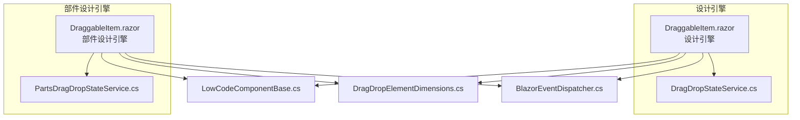
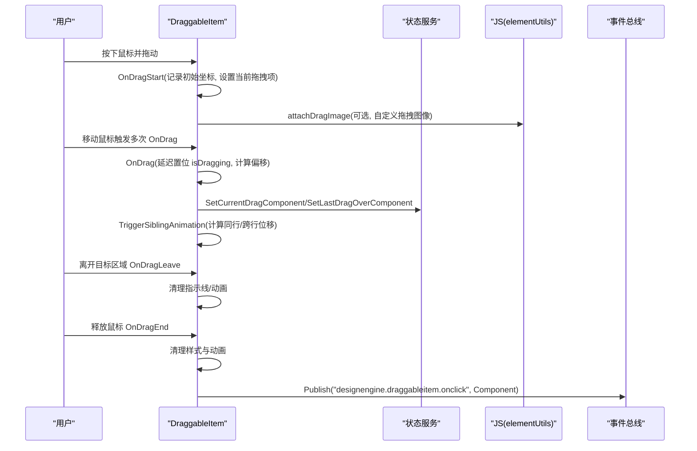
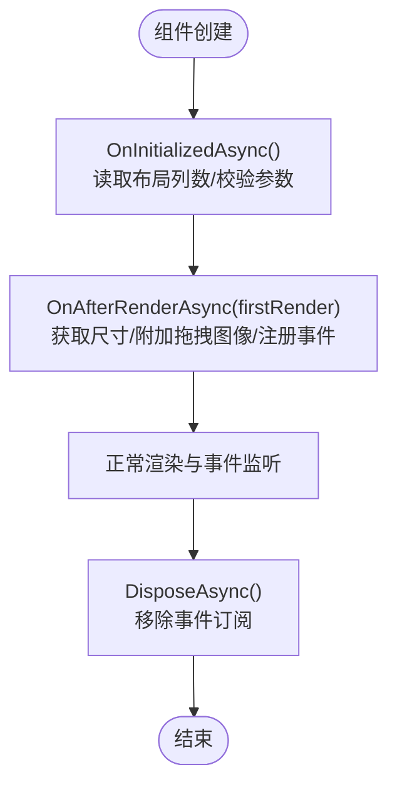
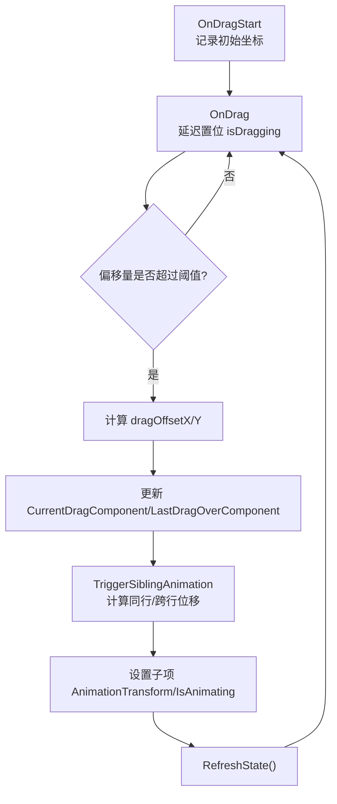
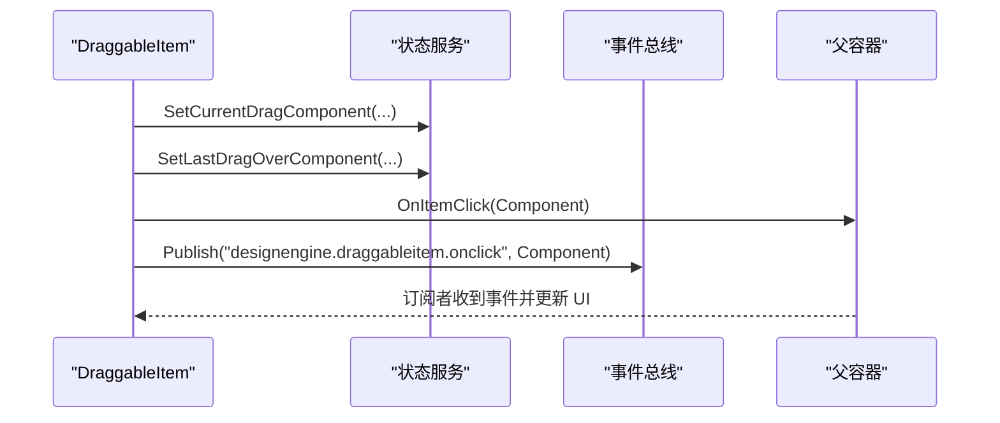
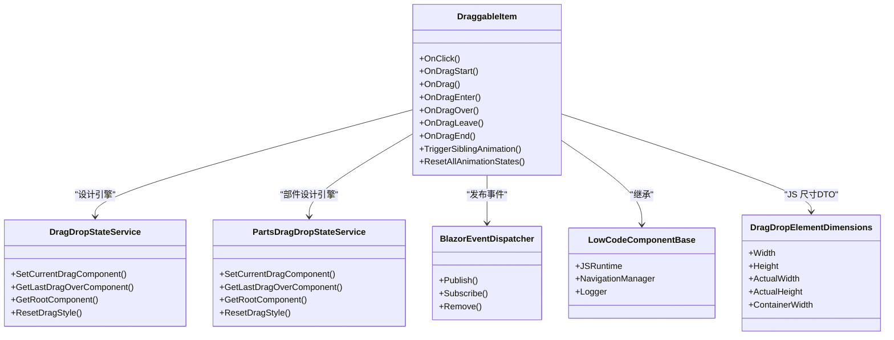

# 拖拽项

<cite>
**本文引用的文件**   
- [DraggableItem.razor（设计引擎）](file://src/LowCode/DesignEngine/H.LowCode.DesignEngine/DraggableComponents/DraggableItem.razor)
- [DraggableItem.razor（部件设计引擎）](file://src/LowCode/DesignEngine/H.LowCode.PartsDesignEngine/DraggableComponents/DraggableItem.razor)
- [DragDropStateService.cs](file://src/LowCode/DesignEngine/H.LowCode.DesignEngine/Services/DragDropStateService.cs)
- [PartsDragDropStateService.cs](file://src/LowCode/DesignEngine/H.LowCode.PartsDesignEngine/Services/PartsDragDropStateService.cs)
- [LowCodeComponentBase.cs](file://src/LowCode/Common/H.LowCode.ComponentBase/LowCodeComponentBase.cs)
- [DragDropElementDimensions.cs](file://src/LowCode/DesignEngine/H.LowCode.DesignEngineBase/Dtos/DragDropElementDimensions.cs)
- [BlazorEventDispatcher.cs](file://src/Utils/H.Util.Blazor/BlazorEventDispatcher.cs)
</cite>

## 目录
1. [简介](#简介)
2. [项目结构](#项目结构)
3. [核心组件](#核心组件)
4. [架构总览](#架构总览)
5. [详细组件分析](#详细组件分析)
6. [依赖关系分析](#依赖关系分析)
7. [性能考量](#性能考量)
8. [故障排查指南](#故障排查指南)
9. [结论](#结论)

## 简介
本文件围绕“拖拽项”组件（DraggableItem）进行系统化文档化，覆盖其生命周期管理、拖拽行为实现、选中态视觉反馈、删除与复制交互、以及与父容器的通信机制。该组件在“设计引擎”和“部件设计引擎”两套环境中分别实现，但核心逻辑一致：通过原生拖拽事件驱动，结合状态服务与事件总线完成跨组件的状态同步与UI更新。

## 项目结构
- DraggableItem 组件位于两个工程下：
  - 设计引擎：H.LowCode.DesignEngine/DraggableComponents/DraggableItem.razor
  - 部件设计引擎：H.LowCode.PartsDesignEngine/DraggableComponents/DraggableItem.razor
- 拖拽状态由各自的状态服务维护：
  - 设计引擎：DragDropStateService.cs
  - 部件设计引擎：PartsDragDropStateService.cs
- 通用基类与工具：
  - LowCodeComponentBase.cs：提供基础注入与能力
  - DragDropElementDimensions.cs：JS 获取元素尺寸的 DTO
  - BlazorEventDispatcher.cs：进程内事件总线

**图表来源** 
- [DraggableItem.razor（设计引擎）:1-473](file://src/LowCode/DesignEngine/H.LowCode.DesignEngine/DraggableComponents/DraggableItem.razor#L1-L473)
- [DraggableItem.razor（部件设计引擎）:1-440](file://src/LowCode/DesignEngine/H.LowCode.PartsDesignEngine/DraggableComponents/DraggableItem.razor#L1-L440)
- [DragDropStateService.cs:1-244](file://src/LowCode/DesignEngine/H.LowCode.DesignEngine/Services/DragDropStateService.cs#L1-L244)
- [PartsDragDropStateService.cs:1-246](file://src/LowCode/DesignEngine/H.LowCode.PartsDesignEngine/Services/PartsDragDropStateService.cs#L1-L246)
- [LowCodeComponentBase.cs:1-73](file://src/LowCode/Common/H.LowCode.ComponentBase/LowCodeComponentBase.cs#L1-L73)
- [DragDropElementDimensions.cs:1-23](file://src/LowCode/DesignEngine/H.LowCode.DesignEngineBase/Dtos/DragDropElementDimensions.cs#L1-L23)
- [BlazorEventDispatcher.cs:1-51](file://src/Utils/H.Util.Blazor/BlazorEventDispatcher.cs#L1-L51)

**章节来源**
- [DraggableItem.razor（设计引擎）:1-473](file://src/LowCode/DesignEngine/H.LowCode.DesignEngine/DraggableComponents/DraggableItem.razor#L1-L473)
- [DraggableItem.razor（部件设计引擎）:1-440](file://src/LowCode/DesignEngine/H.LowCode.PartsDesignEngine/DraggableComponents/DraggableItem.razor#L1-L440)

## 核心组件
- DraggableItem（设计引擎/部件设计引擎）
  - 职责：渲染可拖拽的组件项；处理鼠标/拖拽事件；计算并应用让位动画；暴露删除/复制回调；与父容器通信。
- DragDropStateService / PartsDragDropStateService
  - 职责：按应用/页面或库/部件维度维护拖拽相关状态（当前拖拽项、上次悬停项、根节点等），并提供查找与重置方法。
- LowCodeComponentBase
  - 职责：为组件提供 IJSRuntime、导航、日志等基础能力。
- DragDropElementDimensions
  - 职责：承载 JS 返回的元素尺寸信息，用于计算每行容纳数量与移动距离。
- BlazorEventDispatcher
  - 职责：进程内事件发布/订阅，用于跨组件广播点击等事件。

**章节来源**
- [DraggableItem.razor（设计引擎）:1-473](file://src/LowCode/DesignEngine/H.LowCode.DesignEngine/DraggableComponents/DraggableItem.razor#L1-L473)
- [DraggableItem.razor（部件设计引擎）:1-440](file://src/LowCode/DesignEngine/H.LowCode.PartsDesignEngine/DraggableComponents/DraggableItem.razor#L1-L440)
- [DragDropStateService.cs:1-244](file://src/LowCode/DesignEngine/H.LowCode.DesignEngine/Services/DragDropStateService.cs#L1-L244)
- [PartsDragDropStateService.cs:1-246](file://src/LowCode/DesignEngine/H.LowCode.PartsDesignEngine/Services/PartsDragDropStateService.cs#L1-L246)
- [LowCodeComponentBase.cs:1-73](file://src/LowCode/Common/H.LowCode.ComponentBase/LowCodeComponentBase.cs#L1-L73)
- [DragDropElementDimensions.cs:1-23](file://src/LowCode/DesignEngine/H.LowCode.DesignEngineBase/Dtos/DragDropElementDimensions.cs#L1-L23)
- [BlazorEventDispatcher.cs:1-51](file://src/Utils/H.Util.Blazor/BlazorEventDispatcher.cs#L1-L51)

## 架构总览
DraggableItem 通过原生 dragstart/drag/dragover/dragenter/dragleave/dragend 事件驱动，配合 JS 辅助获取元素尺寸与自定义拖拽图像。状态服务集中维护拖拽上下文，组件间通过事件总线解耦通信。

**图表来源** 
- [DraggableItem.razor（设计引擎）:172-255](file://src/LowCode/DesignEngine/H.LowCode.DesignEngine/DraggableComponents/DraggableItem.razor#L172-L255)
- [DraggableItem.razor（部件设计引擎）:169-241](file://src/LowCode/DesignEngine/H.LowCode.PartsDesignEngine/DraggableComponents/DraggableItem.razor#L169-L241)
- [DragDropStateService.cs:53-77](file://src/LowCode/DesignEngine/H.LowCode.DesignEngine/Services/DragDropStateService.cs#L53-L77)
- [PartsDragDropStateService.cs:54-78](file://src/LowCode/DesignEngine/H.LowCode.PartsDesignEngine/Services/PartsDragDropStateService.cs#L54-L78)
- [BlazorEventDispatcher.cs:38-49](file://src/Utils/H.Util.Blazor/BlazorEventDispatcher.cs#L38-L49)

## 详细组件分析

### 生命周期管理
- 初始化阶段
  - OnInitializedAsync：读取 PageCascading/PartsCascading 布局列数，调用 Init() 校验参数。
  - OnAfterRenderAsync(firstRender)：首次渲染后获取元素尺寸 UpdateDimensions()；调用 JS 附加自定义拖拽图像；注册事件订阅（如页面布局变更）。
- 渲染阶段
  - 根据 DesignState.IsSelected、ShowDropIndicator、IsAnimating 等动态映射 CSS 类与内联样式。
  - 绑定 click、drag*、mouseover/mouseout 事件，阻止冒泡避免干扰。
- 销毁阶段
  - DisposeAsync：移除已订阅的事件，防止内存泄漏。

**图表来源** 
- [DraggableItem.razor（设计引擎）:95-150](file://src/LowCode/DesignEngine/H.LowCode.DesignEngine/DraggableComponents/DraggableItem.razor#L95-L150)
- [DraggableItem.razor（部件设计引擎）:82-133](file://src/LowCode/DesignEngine/H.LowCode.PartsDesignEngine/DraggableComponents/DraggableItem.razor#L82-L133)
- [DraggableItem.razor（设计引擎）:458-471](file://src/LowCode/DesignEngine/H.LowCode.DesignEngine/DraggableComponents/DraggableItem.razor#L458-L471)
- [DraggableItem.razor（部件设计引擎）:425-438](file://src/LowCode/DesignEngine/H.LowCode.PartsDesignEngine/DraggableComponents/DraggableItem.razor#L425-L438)

**章节来源**
- [DraggableItem.razor（设计引擎）:95-150](file://src/LowCode/DesignEngine/H.LowCode.DesignEngine/DraggableComponents/DraggableItem.razor#L95-L150)
- [DraggableItem.razor（部件设计引擎）:82-133](file://src/LowCode/DesignEngine/H.LowCode.PartsDesignEngine/DraggableComponents/DraggableItem.razor#L82-L133)

### 拖拽行为实现
- 鼠标事件监听
  - ondragstart：记录初始 ClientX/Y，设置当前拖拽项，清理兄弟组件残留动画。
  - ondrag：延迟将 isDragging 置为 true，避免在 dragstart 中修改源节点导致原生拖拽被取消。
  - ondragenter/ondragover：更新最后悬停目标，触发让位动画；对同一目标重复进入时避免全量重置。
  - ondragleave：清除拖拽效果样式与指示线。
  - ondragend：清理所有拖拽相关样式与动画状态。
- 起始点计算与移动轨迹跟踪
  - 使用 initialX/initialY 与当前 ClientX/ClientY 计算偏移量，阈值过滤微小抖动。
  - 通过 translate3d 驱动 GPU 加速，配合 will-change 提示浏览器优化。
- 让位动画
  - 基于容器宽度与元素实际宽度计算每行容纳数量，判断同行/跨行移动方向与距离。
  - 对非拖拽项批量设置 AnimationTransform 与 IsAnimating，刷新状态。

**图表来源** 
- [DraggableItem.razor（设计引擎）:172-255](file://src/LowCode/DesignEngine/H.LowCode.DesignEngine/DraggableComponents/DraggableItem.razor#L172-L255)
- [DraggableItem.razor（部件设计引擎）:169-241](file://src/LowCode/DesignEngine/H.LowCode.PartsDesignEngine/DraggableComponents/DraggableItem.razor#L169-L241)
- [DragDropElementDimensions.cs:1-23](file://src/LowCode/DesignEngine/H.LowCode.DesignEngineBase/Dtos/DragDropElementDimensions.cs#L1-L23)

**章节来源**
- [DraggableItem.razor（设计引擎）:172-255](file://src/LowCode/DesignEngine/H.LowCode.DesignEngine/DraggableComponents/DraggableItem.razor#L172-L255)
- [DraggableItem.razor（部件设计引擎）:169-241](file://src/LowCode/DesignEngine/H.LowCode.PartsDesignEngine/DraggableComponents/DraggableItem.razor#L169-L241)

### 选中状态的视觉反馈
- 边框高亮
  - 未选中时 hover 显示虚线 outline（部件设计引擎版本），选中态由 CSS 类 draggableitem-selected 控制。
- 阴影与透明度
  - 拖拽过程中设置 z-index、position、opacity、pointer-events 等内联样式，提升层级与交互体验。
- 尺寸指示器与放置指示
  - ShowDropIndicator 控制放置指示线；容器宽度与元素尺寸用于计算行列布局与移动距离。

**章节来源**
- [DraggableItem.razor（设计引擎）:7-28](file://src/LowCode/DesignEngine/H.LowCode.DesignEngine/DraggableComponents/DraggableItem.razor#L7-L28)
- [DraggableItem.razor（部件设计引擎）:9-30](file://src/LowCode/DesignEngine/H.LowCode.PartsDesignEngine/DraggableComponents/DraggableItem.razor#L9-L30)

### 删除与复制操作的交互逻辑
- 删除
  - 点击删除按钮触发 OnDelete，调用 OnItemDelete 回调，由父组件执行删除逻辑。
- 复制
  - 点击复制按钮触发 OnCopy，调用 OnItemCopy 回调，由父组件执行复制逻辑。
- 确认机制
  - 组件层不内置确认弹窗，建议在父组件回调中实现二次确认或业务校验。

**章节来源**
- [DraggableItem.razor（设计引擎）:291-299](file://src/LowCode/DesignEngine/H.LowCode.DesignEngine/DraggableComponents/DraggableItem.razor#L291-L299)
- [DraggableItem.razor（部件设计引擎）:283-291](file://src/LowCode/DesignEngine/H.LowCode.PartsDesignEngine/DraggableComponents/DraggableItem.razor#L283-L291)

### 与父容器的通信机制
- 事件冒泡与阻止
  - 各事件均添加 stopPropagation，避免冒泡到父容器造成误触。
- 状态同步
  - 通过状态服务读写 CurrentDragComponent、LastDragOverComponent、RootComponent 等，保证多组件状态一致。
- 刷新触发
  - 每次修改 DesignState 后调用 RefreshState() 触发 Blazor 增量渲染。
- 事件总线
  - 点击后通过 BlazorEventDispatcher.Publish 广播统一事件，供其他模块订阅响应。

**图表来源** 
- [DraggableItem.razor（设计引擎）:158-170](file://src/LowCode/DesignEngine/H.LowCode.DesignEngine/DraggableComponents/DraggableItem.razor#L158-L170)
- [DragDropStateService.cs:53-77](file://src/LowCode/DesignEngine/H.LowCode.DesignEngine/Services/DragDropStateService.cs#L53-L77)
- [BlazorEventDispatcher.cs:38-49](file://src/Utils/H.Util.Blazor/BlazorEventDispatcher.cs#L38-L49)

**章节来源**
- [DraggableItem.razor（设计引擎）:158-170](file://src/LowCode/DesignEngine/H.LowCode.DesignEngine/DraggableComponents/DraggableItem.razor#L158-L170)
- [DragDropStateService.cs:53-77](file://src/LowCode/DesignEngine/H.LowCode.DesignEngine/Services/DragDropStateService.cs#L53-L77)
- [BlazorEventDispatcher.cs:38-49](file://src/Utils/H.Util.Blazor/BlazorEventDispatcher.cs#L38-L49)

## 依赖关系分析
- DraggableItem 依赖：
  - 状态服务：读写拖拽上下文与根节点
  - JSRuntime：获取元素尺寸与附加拖拽图像
  - 事件总线：发布点击事件
  - 基类：注入 IJSRuntime、导航、日志等
- 状态服务内部：
  - 以 appId-pageId 或 libId-partsId 为键维护状态字典
  - 提供查找与重置方法，确保状态一致性

**图表来源** 
- [DraggableItem.razor（设计引擎）:1-473](file://src/LowCode/DesignEngine/H.LowCode.DesignEngine/DraggableComponents/DraggableItem.razor#L1-L473)
- [DraggableItem.razor（部件设计引擎）:1-440](file://src/LowCode/DesignEngine/H.LowCode.PartsDesignEngine/DraggableComponents/DraggableItem.razor#L1-L440)
- [DragDropStateService.cs:1-244](file://src/LowCode/DesignEngine/H.LowCode.DesignEngine/Services/DragDropStateService.cs#L1-L244)
- [PartsDragDropStateService.cs:1-246](file://src/LowCode/DesignEngine/H.LowCode.PartsDesignEngine/Services/PartsDragDropStateService.cs#L1-L246)
- [LowCodeComponentBase.cs:1-73](file://src/LowCode/Common/H.LowCode.ComponentBase/LowCodeComponentBase.cs#L1-L73)
- [DragDropElementDimensions.cs:1-23](file://src/LowCode/DesignEngine/H.LowCode.DesignEngineBase/Dtos/DragDropElementDimensions.cs#L1-L23)
- [BlazorEventDispatcher.cs:1-51](file://src/Utils/H.Util.Blazor/BlazorEventDispatcher.cs#L1-L51)

**章节来源**
- [DragDropStateService.cs:1-244](file://src/LowCode/DesignEngine/H.LowCode.DesignEngine/Services/DragDropStateService.cs#L1-L244)
- [PartsDragDropStateService.cs:1-246](file://src/LowCode/DesignEngine/H.LowCode.PartsDesignEngine/Services/PartsDragDropStateService.cs#L1-L246)

## 性能考量
- 使用 translate3d 与 will-change 启用 GPU 加速，减少重排重绘。
- 仅在偏移变化超过阈值时更新动画，降低频繁渲染开销。
- 延迟在首个 drag 事件中置位 isDragging，避免在 dragstart 中修改源节点导致原生拖拽中断。
- 通过 RefreshState() 精准触发 Blazor 增量渲染，避免全量重建。

[本节为通用指导，无需引用具体文件]

## 故障排查指南
- 拖拽被立即取消
  - 检查是否在 dragstart 中直接修改源节点样式；应延迟至首个 drag 事件再置位 isDragging。
- 让位动画异常
  - 确认 dimensions 是否正确获取；检查 ContainerWidth 与 ActualWidth 计算每行数量。
- 状态不同步
  - 核对状态服务中的 CurrentDragComponent/LastDragOverComponent 是否一致；必要时调用 ResetDragStyle 清理。
- 事件未触发
  - 检查 stopPropagation 是否误用；确认事件总线订阅名称与发布名称一致。

**章节来源**
- [DraggableItem.razor（设计引擎）:172-255](file://src/LowCode/DesignEngine/H.LowCode.DesignEngine/DraggableComponents/DraggableItem.razor#L172-L255)
- [DragDropStateService.cs:169-205](file://src/LowCode/DesignEngine/H.LowCode.DesignEngine/Services/DragDropStateService.cs#L169-L205)
- [BlazorEventDispatcher.cs:38-49](file://src/Utils/H.Util.Blazor/BlazorEventDispatcher.cs#L38-L49)

## 结论
DraggableItem 组件通过严谨的生命周期管理、高效的拖拽事件处理与状态服务协作，实现了流畅的拖拽与让位动画体验。借助事件总线与精确的刷新策略，组件在复杂布局下仍保持良好性能与可维护性。建议在上层业务中完善删除/复制的确认流程，并结合主题样式定制选中态与拖拽视觉效果。