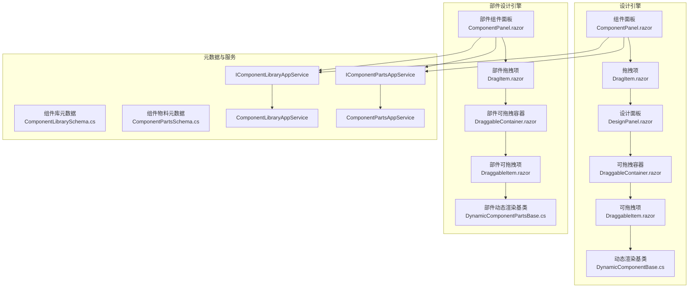
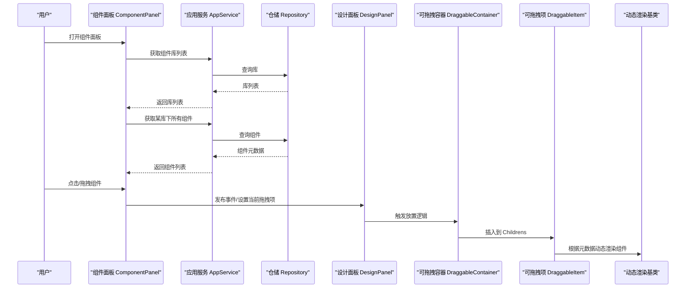
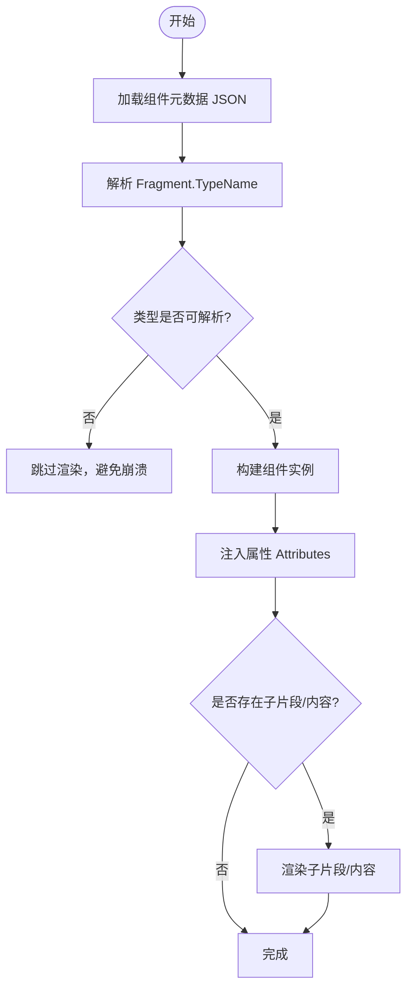
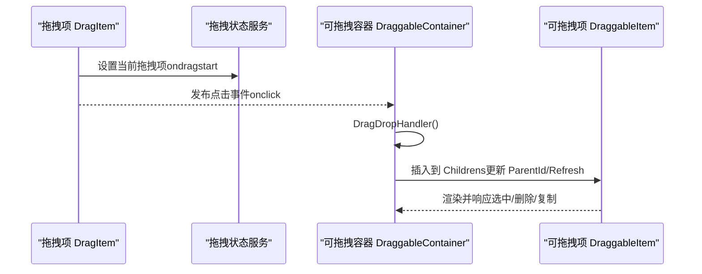
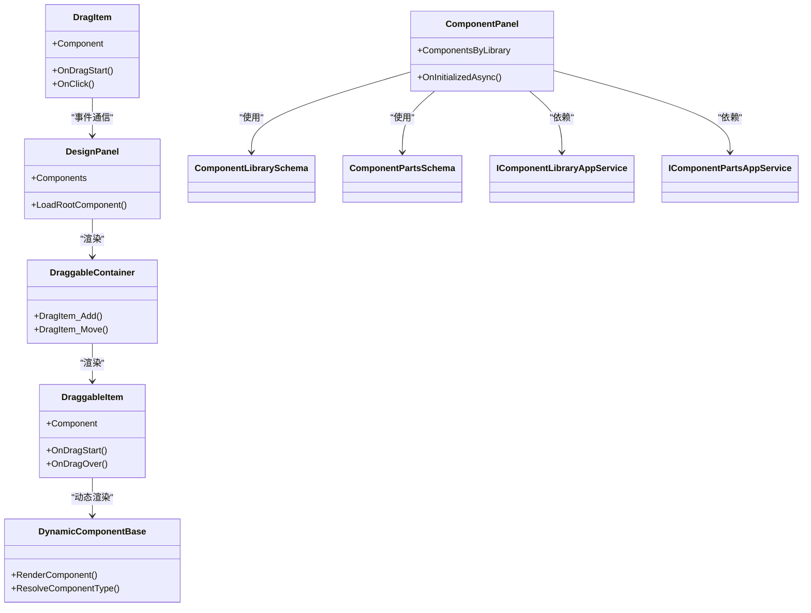

# 组件面板

<cite>
**本文引用的文件**   
- [ComponentPanel.razor](file://src/LowCode/DesignEngine/H.LowCode.DesignEngine/ComponentPanel/ComponentPanel.razor)
- [DragItem.razor（设计引擎）](file://src/LowCode/DesignEngine/H.LowCode.DesignEngine/ComponentPanel/DragItem.razor)
- [ComponentPanel.razor（部件设计引擎）](file://src/LowCode/DesignEngine/H.LowCode.PartsDesignEngine/ComponentPanel/ComponentPanel.razor)
- [DragItem.razor（部件设计引擎）](file://src/LowCode/DesignEngine/H.LowCode.PartsDesignEngine/ComponentPanel/DragItem.razor)
- [DraggableContainer.razor（设计引擎）](file://src/LowCode/DesignEngine/H.LowCode.DesignEngine/DraggableComponents/DraggableContainer.razor)
- [DraggableContainer.razor（部件设计引擎）](file://src/LowCode/DesignEngine/H.LowCode.PartsDesignEngine/DraggableComponents/DraggableContainer.razor)
- [DraggableItem.razor（设计引擎）](file://src/LowCode/DesignEngine/H.LowCode.DesignEngine/DraggableComponents/DraggableItem.razor)
- [DraggableItem.razor（部件设计引擎）](file://src/LowCode/DesignEngine/H.LowCode.PartsDesignEngine/DraggableComponents/DraggableItem.razor)
- [DesignPanel.razor](file://src/LowCode/DesignEngine/H.LowCode.DesignEngine/DesignPanel/DesignPanel.razor)
- [DynamicComponentBase.cs](file://src/LowCode/DesignEngine/H.LowCode.DesignEngine/Services/DynamicComponentBase.cs)
- [DynamicComponentPartsBase.cs](file://src/LowCode/DesignEngine/H.LowCode.PartsDesignEngine/Services/DynamicComponentPartsBase.cs)
- [ComponentLibrarySchema.cs](file://src/LowCode/Common/H.LowCode.MetaSchema.DesignEngine/ComponentLibrarySchema.cs)
- [ComponentPartsSchema.cs](file://src/LowCode/Common/H.LowCode.MetaSchema.DesignEngine/ComponentPartsSchema.cs)
- [IComponentLibraryAppService.cs](file://src/LowCode/DesignEngine/H.LowCode.DesignEngine.Application.Contracts/PartsAppServices/IComponentLibraryAppService.cs)
- [IComponentPartsAppService.cs](file://src/LowCode/DesignEngine/H.LowCode.DesignEngine.Application.Contracts/PartsAppServices/IComponentPartsAppService.cs)
- [ComponentLibraryAppService.cs](file://src/LowCode/DesignEngine/H.LowCode.DesignEngine.Application/PartsAppServices/ComponentLibraryAppService.cs)
- [ComponentPartsAppService.cs](file://src/LowCode/DesignEngine/H.LowCode.DesignEngine.Application/PartsAppServices/ComponentPartsAppService.cs)
- [DragDropElementDimensions.cs](file://src/LowCode/DesignEngine/H.LowCode.DesignEngineBase/Dtos/DragDropElementDimensions.cs)
- [flex.json（示例：容器组件元数据）](file://src/LowCode/meta/parts/componentParts/antdesign/flex.json)
- [select.json（示例：表单组件元数据）](file://src/LowCode/meta/parts/componentParts/antdesign/select.json)
- [datepicker.json（示例：表单组件元数据）](file://src/LowCode/meta/parts/componentParts/antdesign/datepicker.json)
- [cascader.json（示例：表单组件元数据）](file://src/LowCode/meta/parts/componentParts/antdesign/cascader.json)
- [userselect.json（示例：组合组件元数据）](file://src/LowCode/meta/parts/componentParts/common/userselect.json)
- [page_survey_editor.json（示例：页面片段引用 DraggableContainer）](file://src/LowCode/meta/apps/survey/page/page_survey_editor.json)
</cite>

## 目录
1. [简介](#简介)
2. [项目结构](#项目结构)
3. [核心组件](#核心组件)
4. [架构总览](#架构总览)
5. [详细组件分析](#详细组件分析)
6. [依赖关系分析](#依赖关系分析)
7. [性能考量](#性能考量)
8. [故障排查指南](#故障排查指南)
9. [结论](#结论)
10. [附录](#附录)

## 简介
本文件面向“组件面板”的完整设计与实现，覆盖以下主题：
- 组件分类与组织方式（基础、表单、布局等）
- 组件注册机制与动态加载原理（元数据定义、图标显示、预览图生成）
- 拖拽项的实现（事件处理、实例化、属性初始化）
- 自定义组件注册与组件库扩展方法
- 搜索、过滤、收藏等实用功能的配置指南

## 项目结构
组件面板位于 LowCode 设计引擎中，分为“页面设计引擎”和“部件设计引擎”两套 UI，但共享相同的元数据模型与服务接口。

图表来源
- [ComponentPanel.razor:1-125](file://src/LowCode/DesignEngine/H.LowCode.DesignEngine/ComponentPanel/ComponentPanel.razor#L1-L125)
- [DragItem.razor（设计引擎）:1-44](file://src/LowCode/DesignEngine/H.LowCode.DesignEngine/ComponentPanel/DragItem.razor#L1-L44)
- [DesignPanel.razor:1-50](file://src/LowCode/DesignEngine/H.LowCode.DesignEngine/DesignPanel/DesignPanel.razor#L1-L50)
- [DraggableContainer.razor（设计引擎）:170-201](file://src/LowCode/DesignEngine/H.LowCode.DesignEngine/DraggableComponents/DraggableContainer.razor#L170-L201)
- [DraggableItem.razor（设计引擎）:1-26](file://src/LowCode/DesignEngine/H.LowCode.DesignEngine/DraggableComponents/DraggableItem.razor#L1-L26)
- [DynamicComponentBase.cs:32-66](file://src/LowCode/DesignEngine/H.LowCode.DesignEngine/Services/DynamicComponentBase.cs#L32-L66)
- [ComponentPanel.razor（部件设计引擎）:1-80](file://src/LowCode/DesignEngine/H.LowCode.PartsDesignEngine/ComponentPanel/ComponentPanel.razor#L1-L80)
- [DragItem.razor（部件设计引擎）:1-47](file://src/LowCode/DesignEngine/H.LowCode.PartsDesignEngine/ComponentPanel/DragItem.razor#L1-L47)
- [DraggableContainer.razor（部件设计引擎）:171-202](file://src/LowCode/DesignEngine/H.LowCode.PartsDesignEngine/DraggableComponents/DraggableContainer.razor#L171-L202)
- [DraggableItem.razor（部件设计引擎）:1-62](file://src/LowCode/DesignEngine/H.LowCode.PartsDesignEngine/DraggableComponents/DraggableItem.razor#L1-L62)
- [DynamicComponentPartsBase.cs:32-66](file://src/LowCode/DesignEngine/H.LowCode.PartsDesignEngine/Services/DynamicComponentPartsBase.cs#L32-L66)
- [ComponentLibrarySchema.cs:1-36](file://src/LowCode/Common/H.LowCode.MetaSchema.DesignEngine/ComponentLibrarySchema.cs#L1-L36)
- [ComponentPartsSchema.cs:1-230](file://src/LowCode/Common/H.LowCode.MetaSchema.DesignEngine/ComponentPartsSchema.cs#L1-L230)
- [IComponentLibraryAppService.cs:1-21](file://src/LowCode/DesignEngine/H.LowCode.DesignEngine.Application.Contracts/PartsAppServices/IComponentLibraryAppService.cs#L1-L21)
- [IComponentPartsAppService.cs:1-19](file://src/LowCode/DesignEngine/H.LowCode.DesignEngine.Application.Contracts/PartsAppServices/IComponentPartsAppService.cs#L1-L19)
- [ComponentLibraryAppService.cs:1-34](file://src/LowCode/DesignEngine/H.LowCode.DesignEngine.Application/PartsAppServices/ComponentLibraryAppService.cs#L1-L34)
- [ComponentPartsAppService.cs:1-40](file://src/LowCode/DesignEngine/H.LowCode.DesignEngine.Application/PartsAppServices/ComponentPartsAppService.cs#L1-L40)

章节来源
- [ComponentPanel.razor:1-125](file://src/LowCode/DesignEngine/H.LowCode.DesignEngine/ComponentPanel/ComponentPanel.razor#L1-L125)
- [ComponentPanel.razor（部件设计引擎）:1-80](file://src/LowCode/DesignEngine/H.LowCode.PartsDesignEngine/ComponentPanel/ComponentPanel.razor#L1-L80)

## 核心组件
- 组件面板（ComponentPanel）：负责展示组件库列表、按库分组展示组件、支持切换库与筛选已发布原子组件。
- 拖拽项（DragItem）：封装原生拖拽事件，区分点击添加与拖拽开始两种模式，维护当前拖拽上下文。
- 设计面板（DesignPanel）：承载根容器与拖拽树，提供放置区域与选中状态管理。
- 可拖拽容器（DraggableContainer）：接收来自组件面板的拖拽或点击插入，维护父子关系与插入顺序。
- 可拖拽项（DraggableItem）：渲染具体组件并处理选中、删除、复制、拖拽动画与跨容器移动。
- 动态渲染基类（DynamicComponentBase / DynamicComponentPartsBase）：根据元数据动态解析类型、注入属性、子片段与数据源。

章节来源
- [ComponentPanel.razor:1-125](file://src/LowCode/DesignEngine/H.LowCode.DesignEngine/ComponentPanel/ComponentPanel.razor#L1-L125)
- [DragItem.razor（设计引擎）:1-44](file://src/LowCode/DesignEngine/H.LowCode.DesignEngine/ComponentPanel/DragItem.razor#L1-L44)
- [DesignPanel.razor:1-50](file://src/LowCode/DesignEngine/H.LowCode.DesignEngine/DesignPanel/DesignPanel.razor#L1-L50)
- [DraggableContainer.razor（设计引擎）:170-201](file://src/LowCode/DesignEngine/H.LowCode.DesignEngine/DraggableComponents/DraggableContainer.razor#L170-L201)
- [DraggableItem.razor（设计引擎）:1-26](file://src/LowCode/DesignEngine/H.LowCode.DesignEngine/DraggableComponents/DraggableItem.razor#L1-L26)
- [DynamicComponentBase.cs:32-66](file://src/LowCode/DesignEngine/H.LowCode.DesignEngine/Services/DynamicComponentBase.cs#L32-L66)
- [ComponentPanel.razor（部件设计引擎）:1-80](file://src/LowCode/DesignEngine/H.LowCode.PartsDesignEngine/ComponentPanel/ComponentPanel.razor#L1-L80)
- [DragItem.razor（部件设计引擎）:1-47](file://src/LowCode/DesignEngine/H.LowCode.PartsDesignEngine/ComponentPanel/DragItem.razor#L1-L47)
- [DraggableContainer.razor（部件设计引擎）:171-202](file://src/LowCode/DesignEngine/H.LowCode.PartsDesignEngine/DraggableComponents/DraggableContainer.razor#L171-L202)
- [DraggableItem.razor（部件设计引擎）:1-62](file://src/LowCode/DesignEngine/H.LowCode.PartsDesignEngine/DraggableComponents/DraggableItem.razor#L1-L62)
- [DynamicComponentPartsBase.cs:32-66](file://src/LowCode/DesignEngine/H.LowCode.PartsDesignEngine/Services/DynamicComponentPartsBase.cs#L32-L66)

## 架构总览
组件面板通过应用服务获取组件库与组件物料元数据，在 UI 中以网格形式展示；用户通过点击或拖拽将组件添加到设计面板的设计树中。设计面板使用可拖拽容器与项进行树形管理与交互。动态渲染基类根据元数据中的类型名与属性定义，动态构建 Blazor 组件实例。

图表来源
- [ComponentPanel.razor:102-123](file://src/LowCode/DesignEngine/H.LowCode.DesignEngine/ComponentPanel/ComponentPanel.razor#L102-L123)
- [IComponentLibraryAppService.cs:1-21](file://src/LowCode/DesignEngine/H.LowCode.DesignEngine.Application.Contracts/PartsAppServices/IComponentLibraryAppService.cs#L1-L21)
- [IComponentPartsAppService.cs:1-19](file://src/LowCode/DesignEngine/H.LowCode.DesignEngine.Application.Contracts/PartsAppServices/IComponentPartsAppService.cs#L1-L19)
- [ComponentLibraryAppService.cs:15-34](file://src/LowCode/DesignEngine/H.LowCode.DesignEngine.Application/PartsAppServices/ComponentLibraryAppService.cs#L15-L34)
- [ComponentPartsAppService.cs:16-40](file://src/LowCode/DesignEngine/H.LowCode.DesignEngine.Application/PartsAppServices/ComponentPartsAppService.cs#L16-L40)
- [DesignPanel.razor:24-49](file://src/LowCode/DesignEngine/H.LowCode.DesignEngine/DesignPanel/DesignPanel.razor#L24-L49)
- [DraggableContainer.razor（设计引擎）:170-201](file://src/LowCode/DesignEngine/H.LowCode.DesignEngine/DraggableComponents/DraggableContainer.razor#L170-L201)
- [DynamicComponentBase.cs:32-66](file://src/LowCode/DesignEngine/H.LowCode.DesignEngine/Services/DynamicComponentBase.cs#L32-L66)

## 详细组件分析

### 组件分类与组织方式
- 组件库（ComponentLibrarySchema）：以 libid/libname 标识一个组件库，包含发布状态、描述与支持平台等元信息。
- 组件物料（ComponentPartsSchema）：描述单个组件的 partsId、类型（原子/组合）、Fragment（dt 指定运行时类型）、属性定义组、事件与样式定义、排序与版本等。
- 分类逻辑：
  - 基础组件：如选择器、级联选择、日期选择器等，通常用于输入与展示。
  - 表单组件：具备数据绑定与校验能力，属性定义中包含常用表单相关选项。
  - 布局组件：如 Flex 容器，标记为 container，内部支持嵌套子组件。
  - 组合组件：由多个原子组件拼装而成，常用于业务场景复用。

章节来源
- [ComponentLibrarySchema.cs:1-36](file://src/LowCode/Common/H.LowCode.MetaSchema.DesignEngine/ComponentLibrarySchema.cs#L1-L36)
- [ComponentPartsSchema.cs:1-230](file://src/LowCode/Common/H.LowCode.MetaSchema.DesignEngine/ComponentPartsSchema.cs#L1-L230)
- [select.json:1-1](file://src/LowCode/meta/parts/componentParts/antdesign/select.json#L1-L1)
- [datepicker.json:1-1](file://src/LowCode/meta/parts/componentParts/antdesign/datepicker.json#L1-L1)
- [cascader.json:1-1](file://src/LowCode/meta/parts/componentParts/antdesign/cascader.json#L1-L1)
- [flex.json:1-1](file://src/LowCode/meta/parts/componentParts/antdesign/flex.json#L1-L1)
- [userselect.json:1-1](file://src/LowCode/meta/parts/componentParts/common/userselect.json#L1-L1)

### 组件注册机制与动态加载原理
- 元数据驱动：组件通过 JSON 元数据声明 dt（类型名）、attrs（属性）、childs（子片段）、content（内容占位符）等。
- 动态解析：DynamicComponentBase 根据 TypeName 解析类型，构造组件实例并注入属性与子片段。
- 容器识别：当 content 为 $(DraggableContainer) 时，动态渲染基类会创建 DraggableContainer 作为子容器，支持嵌套拖拽。
- 预览图与图标：UI 层通过 Label 与样式控制展示；预览图可由组件元数据扩展字段或外部资源路径提供（当前实现以 Label 为主）。

图表来源
- [DynamicComponentBase.cs:32-66](file://src/LowCode/DesignEngine/H.LowCode.DesignEngine/Services/DynamicComponentBase.cs#L32-L66)
- [DynamicComponentPartsBase.cs:32-66](file://src/LowCode/DesignEngine/H.LowCode.PartsDesignEngine/Services/DynamicComponentPartsBase.cs#L32-L66)
- [flex.json:1-1](file://src/LowCode/meta/parts/componentParts/antdesign/flex.json#L1-L1)
- [page_survey_editor.json:111-139](file://src/LowCode/meta/apps/survey/page/page_survey_editor.json#L111-L139)

章节来源
- [DynamicComponentBase.cs:32-66](file://src/LowCode/DesignEngine/H.LowCode.DesignEngine/Services/DynamicComponentBase.cs#L32-L66)
- [DynamicComponentPartsBase.cs:32-66](file://src/LowCode/DesignEngine/H.LowCode.PartsDesignEngine/Services/DynamicComponentPartsBase.cs#L32-L66)
- [ComponentPartsSchema.cs:1-230](file://src/LowCode/Common/H.LowCode.MetaSchema.DesignEngine/ComponentPartsSchema.cs#L1-L230)

### 拖拽项的实现
- 拖拽事件处理：DragItem 监听 ondragstart 与 onclick，分别设置当前拖拽项与发布事件通知设计面板。
- 组件实例化：DraggableContainer 接收事件后调用 DragDropHandler，更新 Childrens 并设置 ParentId、刷新回调等。
- 属性初始化：DraggableItem 根据 Component.Style 计算宽度、高度、动画与选中态样式，确保视觉反馈一致。
- 跨容器移动：DraggableContainer 支持在不同容器间移动组件，保持插入顺序与选中状态同步。

图表来源
- [DragItem.razor（设计引擎）:1-44](file://src/LowCode/DesignEngine/H.LowCode.DesignEngine/ComponentPanel/DragItem.razor#L1-L44)
- [DragItem.razor（部件设计引擎）:1-47](file://src/LowCode/DesignEngine/H.LowCode.PartsDesignEngine/ComponentPanel/DragItem.razor#L1-L47)
- [DraggableContainer.razor（设计引擎）:170-201](file://src/LowCode/DesignEngine/H.LowCode.DesignEngine/DraggableComponents/DraggableContainer.razor#L170-L201)
- [DraggableContainer.razor（部件设计引擎）:171-202](file://src/LowCode/DesignEngine/H.LowCode.PartsDesignEngine/DraggableComponents/DraggableContainer.razor#L171-L202)
- [DraggableItem.razor（设计引擎）:1-26](file://src/LowCode/DesignEngine/H.LowCode.DesignEngine/DraggableComponents/DraggableItem.razor#L1-L26)
- [DraggableItem.razor（部件设计引擎）:1-62](file://src/LowCode/DesignEngine/H.LowCode.PartsDesignEngine/DraggableComponents/DraggableItem.razor#L1-L62)

章节来源
- [DragItem.razor（设计引擎）:1-44](file://src/LowCode/DesignEngine/H.LowCode.DesignEngine/ComponentPanel/DragItem.razor#L1-L44)
- [DragItem.razor（部件设计引擎）:1-47](file://src/LowCode/DesignEngine/H.LowCode.PartsDesignEngine/ComponentPanel/DragItem.razor#L1-L47)
- [DraggableContainer.razor（设计引擎）:170-201](file://src/LowCode/DesignEngine/H.LowCode.DesignEngine/DraggableComponents/DraggableContainer.razor#L170-L201)
- [DraggableContainer.razor（部件设计引擎）:171-202](file://src/LowCode/DesignEngine/H.LowCode.PartsDesignEngine/DraggableComponents/DraggableContainer.razor#L171-L202)
- [DraggableItem.razor（设计引擎）:1-26](file://src/LowCode/DesignEngine/H.LowCode.DesignEngine/DraggableComponents/DraggableItem.razor#L1-L26)
- [DraggableItem.razor（部件设计引擎）:1-62](file://src/LowCode/DesignEngine/H.LowCode.PartsDesignEngine/DraggableComponents/DraggableItem.razor#L1-L62)

### 自定义组件的注册方法与组件库扩展
- 新增组件库：通过 IComponentLibraryAppService 保存库元数据（libid、libname、pub、desc、platform）。
- 新增组件物料：通过 IComponentPartsAppService 保存组件元数据（partsId、ct、frag、attrdefgroups、order、pub 等）。
- 扩展机制：
  - 在 meta/parts/componentParts/{libraryId}/ 目录下新增 JSON 文件，声明 dt、attrs、stydefs 等。
  - 在组件面板中按库分组展示，仅显示已发布且类型为原子的组件（可按需调整过滤策略）。
  - 若组件为容器，需在元数据中标记 container=true，并在 content 中使用 $(DraggableContainer)。

章节来源
- [ComponentLibrarySchema.cs:1-36](file://src/LowCode/Common/H.LowCode.MetaSchema.DesignEngine/ComponentLibrarySchema.cs#L1-L36)
- [ComponentPartsSchema.cs:1-230](file://src/LowCode/Common/H.LowCode.MetaSchema.DesignEngine/ComponentPartsSchema.cs#L1-L230)
- [IComponentLibraryAppService.cs:1-21](file://src/LowCode/DesignEngine/H.LowCode.DesignEngine.Application.Contracts/PartsAppServices/IComponentLibraryAppService.cs#L1-L21)
- [IComponentPartsAppService.cs:1-19](file://src/LowCode/DesignEngine/H.LowCode.DesignEngine.Application.Contracts/PartsAppServices/IComponentPartsAppService.cs#L1-L19)
- [ComponentLibraryAppService.cs:15-34](file://src/LowCode/DesignEngine/H.LowCode.DesignEngine.Application/PartsAppServices/ComponentLibraryAppService.cs#L15-L34)
- [ComponentPartsAppService.cs:16-40](file://src/LowCode/DesignEngine/H.LowCode.DesignEngine.Application/PartsAppServices/ComponentPartsAppService.cs#L16-L40)
- [flex.json:1-1](file://src/LowCode/meta/parts/componentParts/antdesign/flex.json#L1-L1)

### 搜索、过滤、收藏等实用功能配置指南
- 搜索：在部件设计引擎的组件库管理器中提供搜索框，基于文本匹配过滤组件名称与标签。
- 过滤：组件面板默认仅显示已发布且类型为原子的组件；可在加载逻辑中增加更多过滤条件（如 platform、order 范围）。
- 收藏：可通过持久化状态（PersistentState）记录用户收藏的组件 ID 集合，并在组件面板中优先展示收藏项。
- 预览图：建议在组件元数据中扩展 previewUrl 字段，并在组件面板中读取并展示缩略图。

章节来源
- [ComponentPanel.razor（部件设计引擎）:62-78](file://src/LowCode/DesignEngine/H.LowCode.PartsDesignEngine/ComponentPanel/ComponentPanel.razor#L62-L78)
- [ComponentPanel.razor（设计引擎）:95-123](file://src/LowCode/DesignEngine/H.LowCode.DesignEngine/ComponentPanel/ComponentPanel.razor#L95-L123)

## 依赖关系分析
组件面板依赖应用服务与仓储接口获取元数据；设计面板与拖拽组件依赖状态服务与事件分发器协调交互；动态渲染基类依赖类型解析与属性注入。

图表来源
- [ComponentPanel.razor:1-125](file://src/LowCode/DesignEngine/H.LowCode.DesignEngine/ComponentPanel/ComponentPanel.razor#L1-L125)
- [DragItem.razor（设计引擎）:1-44](file://src/LowCode/DesignEngine/H.LowCode.DesignEngine/ComponentPanel/DragItem.razor#L1-L44)
- [DesignPanel.razor:1-50](file://src/LowCode/DesignEngine/H.LowCode.DesignEngine/DesignPanel/DesignPanel.razor#L1-L50)
- [DraggableContainer.razor（设计引擎）:170-201](file://src/LowCode/DesignEngine/H.LowCode.DesignEngine/DraggableComponents/DraggableContainer.razor#L170-L201)
- [DraggableItem.razor（设计引擎）:1-26](file://src/LowCode/DesignEngine/H.LowCode.DesignEngine/DraggableComponents/DraggableItem.razor#L1-L26)
- [DynamicComponentBase.cs:32-66](file://src/LowCode/DesignEngine/H.LowCode.DesignEngine/Services/DynamicComponentBase.cs#L32-L66)
- [ComponentLibrarySchema.cs:1-36](file://src/LowCode/Common/H.LowCode.MetaSchema.DesignEngine/ComponentLibrarySchema.cs#L1-L36)
- [ComponentPartsSchema.cs:1-230](file://src/LowCode/Common/H.LowCode.MetaSchema.DesignEngine/ComponentPartsSchema.cs#L1-L230)
- [IComponentLibraryAppService.cs:1-21](file://src/LowCode/DesignEngine/H.LowCode.DesignEngine.Application.Contracts/PartsAppServices/IComponentLibraryAppService.cs#L1-L21)
- [IComponentPartsAppService.cs:1-19](file://src/LowCode/DesignEngine/H.LowCode.DesignEngine.Application.Contracts/PartsAppServices/IComponentPartsAppService.cs#L1-L19)

章节来源
- [ComponentPanel.razor:1-125](file://src/LowCode/DesignEngine/H.LowCode.DesignEngine/ComponentPanel/ComponentPanel.razor#L1-L125)
- [ComponentPanel.razor（部件设计引擎）:1-80](file://src/LowCode/DesignEngine/H.LowCode.PartsDesignEngine/ComponentPanel/ComponentPanel.razor#L1-L80)
- [DynamicComponentBase.cs:32-66](file://src/LowCode/DesignEngine/H.LowCode.DesignEngine/Services/DynamicComponentBase.cs#L32-L66)
- [DynamicComponentPartsBase.cs:32-66](file://src/LowCode/DesignEngine/H.LowCode.PartsDesignEngine/Services/DynamicComponentPartsBase.cs#L32-L66)

## 性能考量
- 懒加载与分页：组件库与组件列表较大时，建议分页加载并按库缓存结果。
- 事件去抖：拖拽过程中频繁触发 ondragover，应限制重绘频率，减少 StateHasChanged 调用。
- 深度克隆优化：DeepClone 递归拷贝子节点时注意内存占用，必要时引入对象池或增量更新。
- 类型解析缓存：ResolveComponentType 的结果可缓存，避免重复反射开销。

[本节为通用指导，不直接分析具体文件]

## 故障排查指南
- 类型解析失败：检查元数据中的 dt 是否正确指向有效类型，确保程序集已加载。
- 拖拽无响应：确认 DragItem 的 ondragstart 与 onclick 事件绑定正确，且 DraggableContainer 订阅了相应事件。
- 插入顺序异常：检查 DragItem_Add 中 dragOverComponent 的索引计算逻辑，确保插入位置符合预期。
- 样式错乱：核对 DraggableItem 的样式计算（宽度、高度、动画），以及 CSS 类名是否与模板一致。

章节来源
- [DynamicComponentBase.cs:32-66](file://src/LowCode/DesignEngine/H.LowCode.DesignEngine/Services/DynamicComponentBase.cs#L32-L66)
- [DraggableContainer.razor（设计引擎）:170-201](file://src/LowCode/DesignEngine/H.LowCode.DesignEngine/DraggableComponents/DraggableContainer.razor#L170-L201)
- [DraggableItem.razor（设计引擎）:1-26](file://src/LowCode/DesignEngine/H.LowCode.DesignEngine/DraggableComponents/DraggableItem.razor#L1-L26)

## 结论
组件面板以元数据为核心，结合动态渲染与拖拽交互，实现了灵活的组件组织与可视化搭建。通过清晰的分类与注册机制，开发者可以便捷地扩展组件库与自定义组件。后续可进一步增强搜索、过滤与收藏体验，提升设计效率。

[本节为总结性内容，不直接分析具体文件]

## 附录
- 拖拽尺寸与边距模型：DragDropElementDimensions 与 DragDropElementMargin 用于描述拖拽元素的尺寸与边距，便于精确布局与对齐。

章节来源
- [DragDropElementDimensions.cs:1-23](file://src/LowCode/DesignEngine/H.LowCode.DesignEngineBase/Dtos/DragDropElementDimensions.cs#L1-L23)