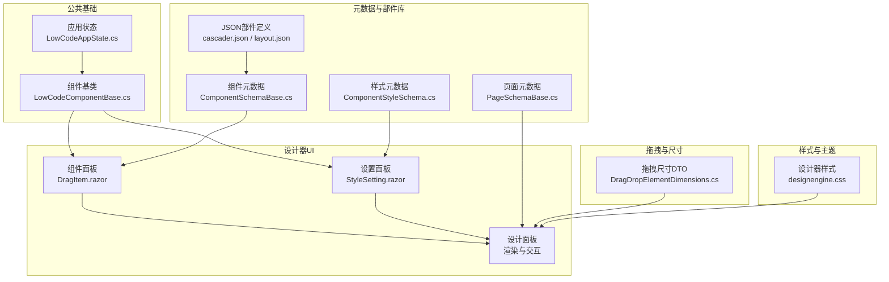
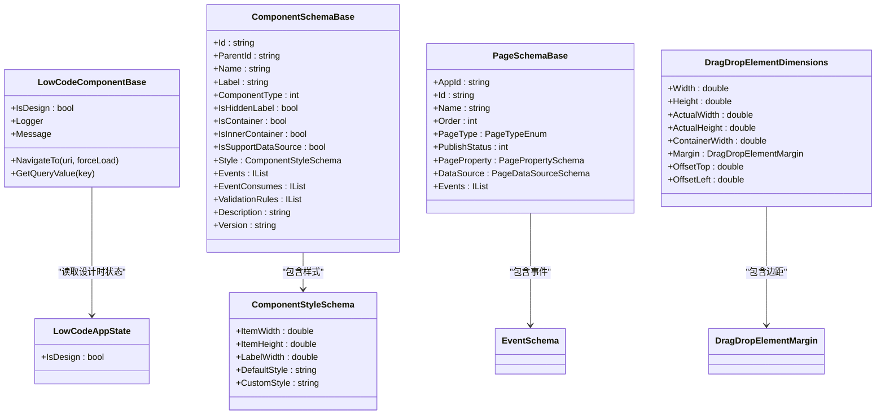
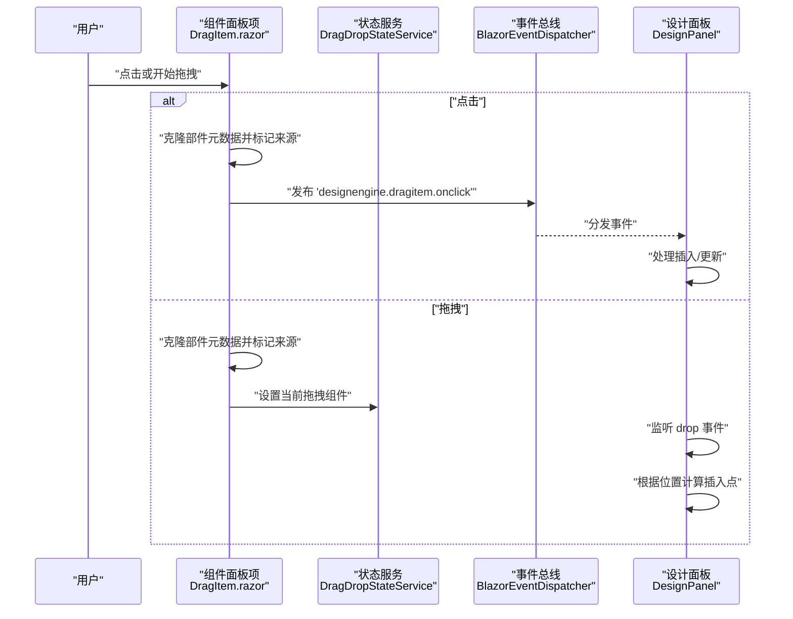
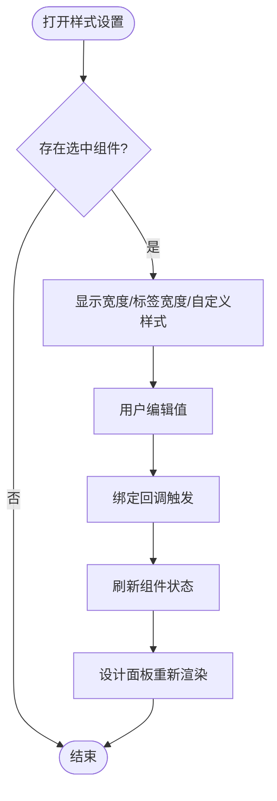
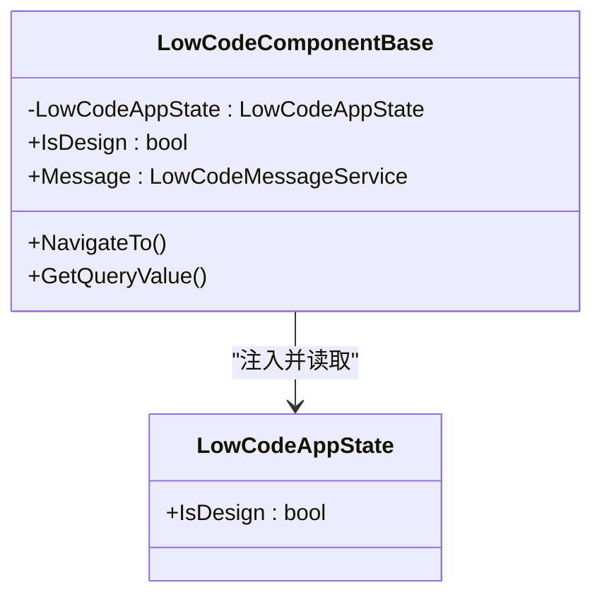
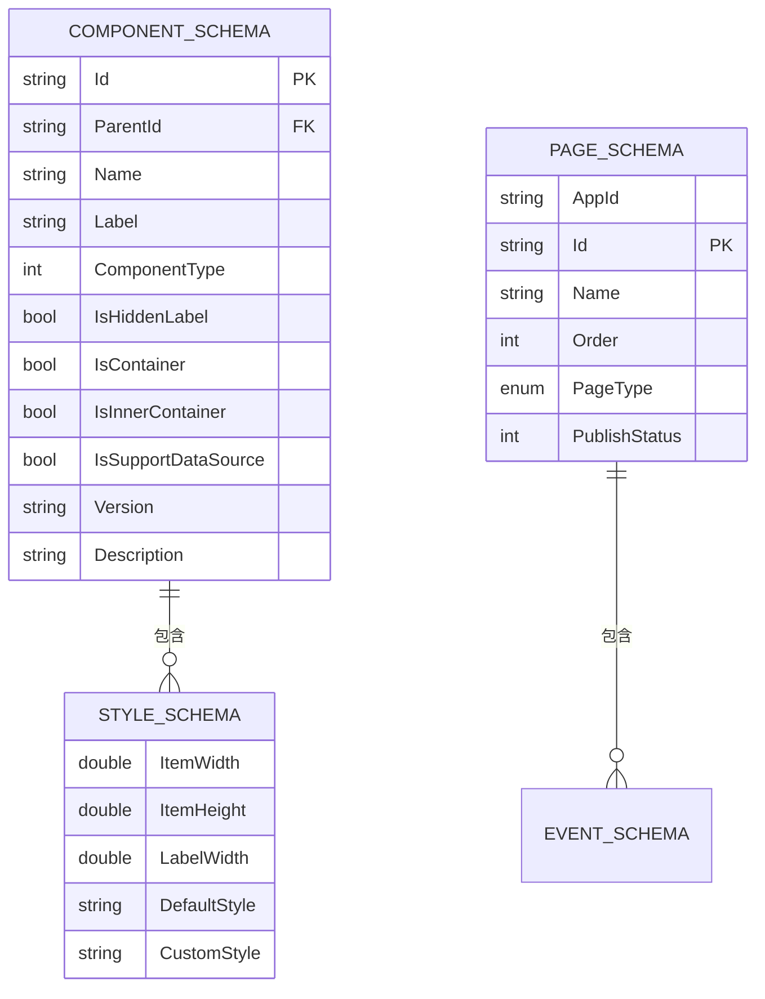
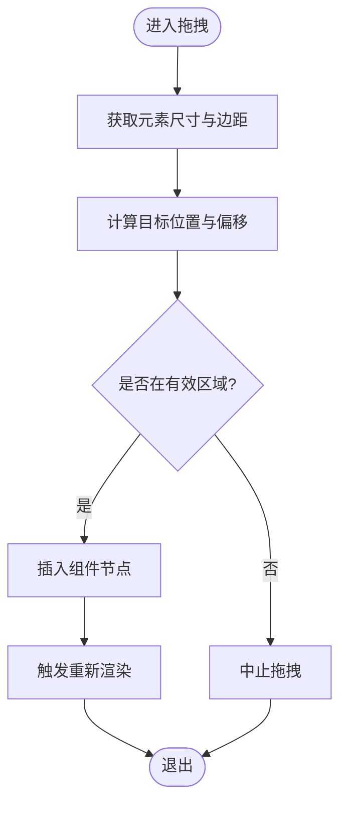
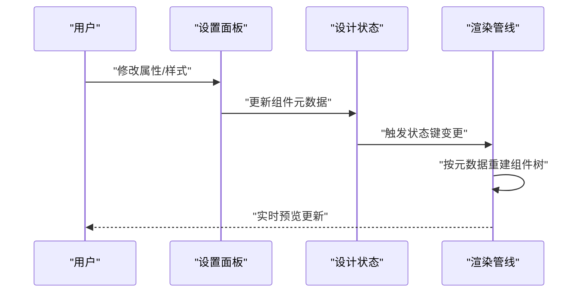
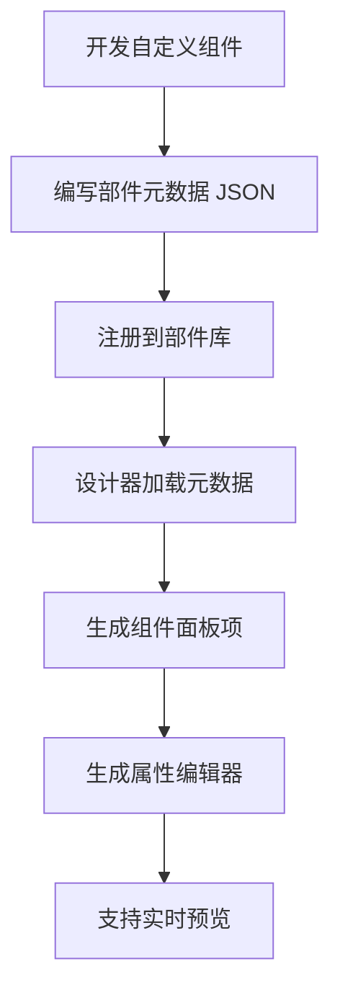
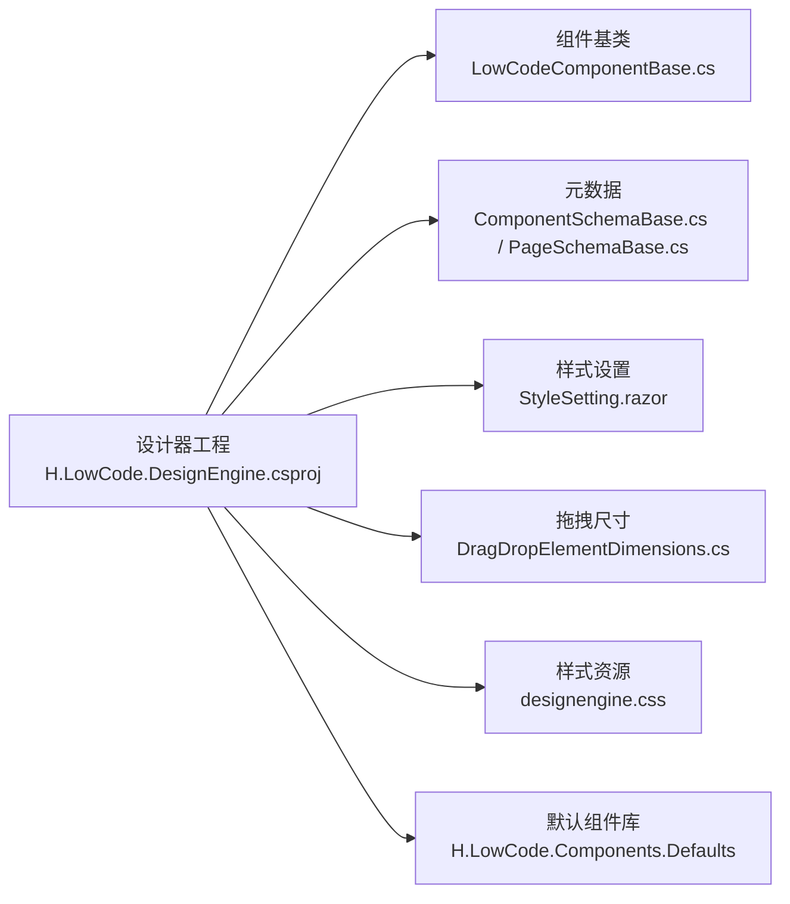

# 设计引擎

<cite>
**本文引用的文件**   
- [H.LowCode.DesignEngine.csproj](file://src/LowCode/DesignEngine/H.LowCode.DesignEngine/H.LowCode.DesignEngine.csproj)
- [DragItem.razor（页面设计器）](file://src/LowCode/DesignEngine/H.LowCode.DesignEngine/ComponentPanel/DragItem.razor)
- [DragItem.razor（部件设计器）](file://src/LowCode/DesignEngine/H.LowCode.PartsDesignEngine/ComponentPanel/DragItem.razor)
- [StyleSetting.razor（页面设计器样式设置）](file://src/LowCode/DesignEngine/H.LowCode.DesignEngine/SettingPanel/StyleSetting.razor)
- [StyleSetting.razor（部件设计器样式设置）](file://src/LowCode/DesignEngine/H.LowCode.PartsDesignEngine/SettingPanel/StyleSetting.razor)
- [LowCodeComponentBase.cs](file://src/LowCode/Common/H.LowCode.ComponentBase/LowCodeComponentBase.cs)
- [LowCodeAppState.cs](file://src/LowCode/Common/H.LowCode.ComponentBase/LowCodeAppState.cs)
- [MetaSchemaBase.cs](file://src/LowCode/Common/H.LowCode.MetaSchema/MetaSchemaBase.cs)
- [PageSchemaBase.cs](file://src/LowCode/Common/H.LowCode.MetaSchema/PageSchemaBase.cs)
- [ComponentSchemaBase.cs](file://src/LowCode/Common/H.LowCode.MetaSchema/ComponentSchemaBase.cs)
- [StateHasChangeSchema.cs](file://src/LowCode/Common/H.LowCode.MetaSchema/StateHasChangeSchema.cs)
- [ComponentStyleSchema.cs](file://src/LowCode/Common/H.LowCode.MetaSchema/PropertySchemas/ComponentStyleSchema.cs)
- [DragDropElementDimensions.cs](file://src/LowCode/DesignEngine/H.LowCode.DesignEngineBase/Dtos/DragDropElementDimensions.cs)
- [designengine.css](file://src/LowCode/DesignEngine/H.LowCode.DesignEngine/wwwroot/designengine.css)
- [cascader.json（部件元数据示例）](file://src/LowCode/meta/parts/componentParts/default/cascader.json)
- [layout.json（布局部件元数据示例）](file://src/LowCode/meta/parts/componentParts/default/layout.json)
</cite>

## 目录
1. [简介](#简介)
2. [项目结构](#项目结构)
3. [核心组件](#核心组件)
4. [架构总览](#架构总览)
5. [详细组件分析](#详细组件分析)
6. [依赖关系分析](#依赖关系分析)
7. [性能考量](#性能考量)
8. [故障排查指南](#故障排查指南)
9. [结论](#结论)
10. [附录](#附录)

## 简介
本文件为低代码设计引擎的详细技术文档，聚焦可视化设计器的核心能力与实现：拖拽布局、属性配置面板、组件面板、实时预览、设计状态管理、撤销重做机制、版本控制、扩展点与自定义组件集成、以及主题定制。文档面向不同技术背景的读者，提供从概览到代码级细节的渐进式说明，并辅以图示帮助理解。

## 项目结构
设计引擎位于 LowCode 子域下，采用模块化分层组织：
- 设计器 UI 层：组件面板、设计面板、设置面板、页面/部件设计器页面
- 公共基础：组件基类、应用状态、通用元模型（Schema）
- 元数据与部件库：以 JSON 描述组件类型、属性定义、事件、样式等
- 拖拽与尺寸：拖放元素尺寸与边距 DTO
- 样式与主题：CSS 资源与默认主题样式

图表来源 
- [H.LowCode.DesignEngine.csproj:1-22](file://src/LowCode/DesignEngine/H.LowCode.DesignEngine/H.LowCode.DesignEngine.csproj#L1-L22)
- [DragItem.razor（页面设计器）:1-44](file://src/LowCode/DesignEngine/H.LowCode.DesignEngine/ComponentPanel/DragItem.razor#L1-L44)
- [StyleSetting.razor（页面设计器样式设置）:1-31](file://src/LowCode/DesignEngine/H.LowCode.DesignEngine/SettingPanel/StyleSetting.razor#L1-L31)
- [LowCodeComponentBase.cs:1-73](file://src/LowCode/Common/H.LowCode.ComponentBase/LowCodeComponentBase.cs#L1-L73)
- [LowCodeAppState.cs:1-21](file://src/LowCode/Common/H.LowCode.ComponentBase/LowCodeAppState.cs#L1-L21)
- [ComponentSchemaBase.cs:1-104](file://src/LowCode/Common/H.LowCode.MetaSchema/ComponentSchemaBase.cs#L1-L104)
- [PageSchemaBase.cs:1-40](file://src/LowCode/Common/H.LowCode.MetaSchema/PageSchemaBase.cs#L1-L40)
- [ComponentStyleSchema.cs:1-40](file://src/LowCode/Common/H.LowCode.MetaSchema/PropertySchemas/ComponentStyleSchema.cs#L1-L40)
- [DragDropElementDimensions.cs:1-23](file://src/LowCode/DesignEngine/H.LowCode.DesignEngineBase/Dtos/DragDropElementDimensions.cs#L1-L23)
- [designengine.css:295-470](file://src/LowCode/DesignEngine/H.LowCode.DesignEngine/wwwroot/designengine.css#L295-L470)
- [cascader.json（部件元数据示例）:1-1](file://src/LowCode/meta/parts/componentParts/default/cascader.json#L1-L1)
- [layout.json（布局部件元数据示例）:1-1](file://src/LowCode/meta/parts/componentParts/default/layout.json#L1-L1)

章节来源
- [H.LowCode.DesignEngine.csproj:1-22](file://src/LowCode/DesignEngine/H.LowCode.DesignEngine/H.LowCode.DesignEngine.csproj#L1-L22)

## 核心组件
- 组件基类与消息服务：提供日志、导航、JS 调用、设计模式判断等通用能力
- 应用状态：标识是否处于设计时，驱动组件渲染差异
- 元数据 Schema：统一描述组件、页面、样式的结构与行为
- 拖拽与尺寸：标准化拖放过程中的元素尺寸与边距信息
- 样式设置面板：通过滑块与文本框编辑组件样式，触发刷新

章节来源
- [LowCodeComponentBase.cs:1-73](file://src/LowCode/Common/H.LowCode.ComponentBase/LowCodeComponentBase.cs#L1-L73)
- [LowCodeAppState.cs:1-21](file://src/LowCode/Common/H.LowCode.ComponentBase/LowCodeAppState.cs#L1-L21)
- [ComponentSchemaBase.cs:1-104](file://src/LowCode/Common/H.LowCode.MetaSchema/ComponentSchemaBase.cs#L1-L104)
- [PageSchemaBase.cs:1-40](file://src/LowCode/Common/H.LowCode.MetaSchema/PageSchemaBase.cs#L1-L40)
- [ComponentStyleSchema.cs:1-40](file://src/LowCode/Common/H.LowCode.MetaSchema/PropertySchemas/ComponentStyleSchema.cs#L1-L40)
- [DragDropElementDimensions.cs:1-23](file://src/LowCode/DesignEngine/H.LowCode.DesignEngineBase/Dtos/DragDropElementDimensions.cs#L1-L23)

## 架构总览
设计引擎采用“元数据驱动 + 组件化”的架构：
- 组件面板暴露可拖拽的组件项（基于 JSON 元数据）
- 设计面板承载页面/部件树与可视化渲染
- 设置面板绑定选中组件的属性与样式
- 基类与应用状态贯穿设计时/运行时的差异化逻辑
- 拖拽尺寸 DTO 支撑布局计算与对齐

图表来源 
- [LowCodeComponentBase.cs:1-73](file://src/LowCode/Common/H.LowCode.ComponentBase/LowCodeComponentBase.cs#L1-L73)
- [LowCodeAppState.cs:1-21](file://src/LowCode/Common/H.LowCode.ComponentBase/LowCodeAppState.cs#L1-L21)
- [ComponentSchemaBase.cs:1-104](file://src/LowCode/Common/H.LowCode.MetaSchema/ComponentSchemaBase.cs#L1-L104)
- [PageSchemaBase.cs:1-40](file://src/LowCode/Common/H.LowCode.MetaSchema/PageSchemaBase.cs#L1-L40)
- [ComponentStyleSchema.cs:1-40](file://src/LowCode/Common/H.LowCode.MetaSchema/PropertySchemas/ComponentStyleSchema.cs#L1-L40)
- [DragDropElementDimensions.cs:1-23](file://src/LowCode/DesignEngine/H.LowCode.DesignEngineBase/Dtos/DragDropElementDimensions.cs#L1-L23)

## 详细组件分析

### 组件面板与拖拽流程
- 组件面板项支持两种操作：点击直接添加、拖拽后放置
- 点击路径：克隆部件元数据 -> 标记来源 -> 发布事件 -> 订阅者处理插入
- 拖拽路径：克隆部件元数据 -> 标记来源 -> 设置当前拖拽项 -> 设计面板接收 drop 事件并插入
- 事件总线用于跨组件通信，避免线程上下文问题

图表来源 
- [DragItem.razor（页面设计器）:1-44](file://src/LowCode/DesignEngine/H.LowCode.DesignEngine/ComponentPanel/DragItem.razor#L1-L44)
- [DragItem.razor（部件设计器）:1-47](file://src/LowCode/DesignEngine/H.LowCode.PartsDesignEngine/ComponentPanel/DragItem.razor#L1-L47)

章节来源
- [DragItem.razor（页面设计器）:1-44](file://src/LowCode/DesignEngine/H.LowCode.DesignEngine/ComponentPanel/DragItem.razor#L1-L44)
- [DragItem.razor（部件设计器）:1-47](file://src/LowCode/DesignEngine/H.LowCode.PartsDesignEngine/ComponentPanel/DragItem.razor#L1-L47)

### 属性配置面板与样式编辑
- 样式设置面板提供宽度、标签宽度、自定义样式输入
- 变更触发组件状态刷新，确保设计面板即时反馈
- 支持条件显示（如隐藏标题或非容器组件）

图表来源 
- [StyleSetting.razor（页面设计器样式设置）:1-31](file://src/LowCode/DesignEngine/H.LowCode.DesignEngine/SettingPanel/StyleSetting.razor#L1-L31)
- [StyleSetting.razor（部件设计器样式设置）:1-31](file://src/LowCode/DesignEngine/H.LowCode.PartsDesignEngine/SettingPanel/StyleSetting.razor#L1-L31)

章节来源
- [StyleSetting.razor（页面设计器样式设置）:1-31](file://src/LowCode/DesignEngine/H.LowCode.DesignEngine/SettingPanel/StyleSetting.razor#L1-L31)
- [StyleSetting.razor（部件设计器样式设置）:1-31](file://src/LowCode/DesignEngine/H.LowCode.PartsDesignEngine/SettingPanel/StyleSetting.razor#L1-L31)

### 设计状态管理与设计时/运行态切换
- 组件基类注入应用状态，提供 IsDesign 标志
- 组件可根据 IsDesign 决定渲染分支（例如设计时高亮、边框、占位符）
- 消息服务封装 JS 调用，简化提示与错误展示

图表来源 
- [LowCodeComponentBase.cs:1-73](file://src/LowCode/Common/H.LowCode.ComponentBase/LowCodeComponentBase.cs#L1-L73)
- [LowCodeAppState.cs:1-21](file://src/LowCode/Common/H.LowCode.ComponentBase/LowCodeAppState.cs#L1-L21)

章节来源
- [LowCodeComponentBase.cs:1-73](file://src/LowCode/Common/H.LowCode.ComponentBase/LowCodeComponentBase.cs#L1-L73)
- [LowCodeAppState.cs:1-21](file://src/LowCode/Common/H.LowCode.ComponentBase/LowCodeAppState.cs#L1-L21)

### 元数据驱动与版本控制
- 组件与页面均继承自元数据基类，具备创建/修改时间、作者等审计字段
- 组件元数据包含 ID、父节点、名称、标签、类型、容器标记、样式、事件、校验规则、版本等
- 页面元数据包含应用ID、排序、页面类型、发布状态、数据源、事件等
- 版本字段便于后续升级与兼容性处理

图表来源 
- [ComponentSchemaBase.cs:1-104](file://src/LowCode/Common/H.LowCode.MetaSchema/ComponentSchemaBase.cs#L1-L104)
- [PageSchemaBase.cs:1-40](file://src/LowCode/Common/H.LowCode.MetaSchema/PageSchemaBase.cs#L1-L40)
- [ComponentStyleSchema.cs:1-40](file://src/LowCode/Common/H.LowCode.MetaSchema/PropertySchemas/ComponentStyleSchema.cs#L1-L40)
- [MetaSchemaBase.cs:1-20](file://src/LowCode/Common/H.LowCode.MetaSchema/MetaSchemaBase.cs#L1-L20)

章节来源
- [ComponentSchemaBase.cs:1-104](file://src/LowCode/Common/H.LowCode.MetaSchema/ComponentSchemaBase.cs#L1-L104)
- [PageSchemaBase.cs:1-40](file://src/LowCode/Common/H.LowCode.MetaSchema/PageSchemaBase.cs#L1-L40)
- [MetaSchemaBase.cs:1-20](file://src/LowCode/Common/H.LowCode.MetaSchema/MetaSchemaBase.cs#L1-L20)

### 拖拽布局与尺寸计算
- 拖拽过程中使用统一的尺寸与边距 DTO，便于在不同容器中计算落点与对齐
- 设计面板根据容器宽度、偏移量、实际宽高进行布局决策

图表来源 
- [DragDropElementDimensions.cs:1-23](file://src/LowCode/DesignEngine/H.LowCode.DesignEngineBase/Dtos/DragDropElementDimensions.cs#L1-L23)

章节来源
- [DragDropElementDimensions.cs:1-23](file://src/LowCode/DesignEngine/H.LowCode.DesignEngineBase/Dtos/DragDropElementDimensions.cs#L1-L23)

### 实时预览与渲染管线
- 设计面板在选中组件变化时，依据元数据动态渲染组件实例
- 样式与属性变更后，通过状态键变更触发局部刷新
- 事件消费与事件定义支持组件间通信

章节来源
- [StateHasChangeSchema.cs:1-17](file://src/LowCode/Common/H.LowCode.MetaSchema/StateHasChangeSchema.cs#L1-L17)
- [ComponentSchemaBase.cs:1-104](file://src/LowCode/Common/H.LowCode.MetaSchema/ComponentSchemaBase.cs#L1-L104)

### 扩展点与自定义组件集成
- 通过 JSON 部件定义声明组件类型、属性组、事件、样式定义等
- 设计器解析元数据，生成组件面板项与属性编辑器
- 新增自定义组件需遵循元数据结构约定，并在运行时注册对应组件类型

章节来源
- [cascader.json（部件元数据示例）:1-1](file://src/LowCode/meta/parts/componentParts/default/cascader.json#L1-L1)
- [layout.json（布局部件元数据示例）:1-1](file://src/LowCode/meta/parts/componentParts/default/layout.json#L1-L1)

### 主题与样式定制
- 设计器样式集中在 CSS 文件中，覆盖组件面板、设置面板、按钮、开关等
- 可通过覆盖 CSS 变量或样式类实现主题定制
- 组件样式支持默认样式与自定义样式叠加

章节来源
- [designengine.css:295-470](file://src/LowCode/DesignEngine/H.LowCode.DesignEngine/wwwroot/designengine.css#L295-L470)
- [ComponentStyleSchema.cs:1-40](file://src/LowCode/Common/H.LowCode.MetaSchema/PropertySchemas/ComponentStyleSchema.cs#L1-L40)

## 依赖关系分析
- 设计器工程引用了组件基类、元数据、默认组件库、应用抽屉等模块
- 组件面板与设计面板依赖事件总线与状态服务
- 样式设置面板依赖组件元数据的样式字段

图表来源 
- [H.LowCode.DesignEngine.csproj:1-22](file://src/LowCode/DesignEngine/H.LowCode.DesignEngine/H.LowCode.DesignEngine.csproj#L1-L22)
- [LowCodeComponentBase.cs:1-73](file://src/LowCode/Common/H.LowCode.ComponentBase/LowCodeComponentBase.cs#L1-L73)
- [ComponentSchemaBase.cs:1-104](file://src/LowCode/Common/H.LowCode.MetaSchema/ComponentSchemaBase.cs#L1-L104)
- [PageSchemaBase.cs:1-40](file://src/LowCode/Common/H.LowCode.MetaSchema/PageSchemaBase.cs#L1-L40)
- [StyleSetting.razor（页面设计器样式设置）:1-31](file://src/LowCode/DesignEngine/H.LowCode.DesignEngine/SettingPanel/StyleSetting.razor#L1-L31)
- [DragDropElementDimensions.cs:1-23](file://src/LowCode/DesignEngine/H.LowCode.DesignEngineBase/Dtos/DragDropElementDimensions.cs#L1-L23)
- [designengine.css:295-470](file://src/LowCode/DesignEngine/H.LowCode.DesignEngine/wwwroot/designengine.css#L295-L470)

章节来源
- [H.LowCode.DesignEngine.csproj:1-22](file://src/LowCode/DesignEngine/H.LowCode.DesignEngine/H.LowCode.DesignEngine.csproj#L1-L22)

## 性能考量
- 使用状态键变更触发局部刷新，避免全量重渲染
- 拖拽过程中尽量延迟计算，仅在 drop 时执行复杂布局逻辑
- 事件总线发布/订阅应限制频率，避免频繁更新导致卡顿
- 样式编辑建议防抖，减少不必要的渲染

[本节为通用指导，不直接分析具体文件]

## 故障排查指南
- 设计模式判断异常：检查应用状态注入与 IsDesign 值是否正确
- 拖拽无效：确认事件总线是否在线程上下文中发布；检查拖拽尺寸与容器边界
- 样式不生效：核对组件样式字段与自定义样式优先级；检查 CSS 覆盖
- 组件未渲染：验证元数据中的类型与运行时组件注册是否一致

章节来源
- [LowCodeComponentBase.cs:1-73](file://src/LowCode/Common/H.LowCode.ComponentBase/LowCodeComponentBase.cs#L1-L73)
- [DragItem.razor（页面设计器）:1-44](file://src/LowCode/DesignEngine/H.LowCode.DesignEngine/ComponentPanel/DragItem.razor#L1-L44)
- [designengine.css:295-470](file://src/LowCode/DesignEngine/H.LowCode.DesignEngine/wwwroot/designengine.css#L295-L470)

## 结论
该设计引擎通过元数据驱动与组件化架构，实现了可视化的拖拽布局、属性配置、实时预览与主题定制。其清晰的职责划分与可扩展的扩展点，使得自定义组件与主题接入简便高效。建议在后续迭代中完善撤销重做与版本控制的持久化策略，提升协作与回滚能力。

[本节为总结性内容，不直接分析具体文件]

## 附录
- 工作流参考：从页面创建到组件配置的完整过程
  - 新建页面：初始化页面元数据（ID、名称、类型、排序）
  - 选择组件：从组件面板拖拽或点击添加
  - 配置属性：在设置面板调整样式与属性
  - 实时预览：设计面板即时反映变更
  - 保存与发布：将元数据持久化，设置发布状态

[本节为概念性流程，不直接分析具体文件]