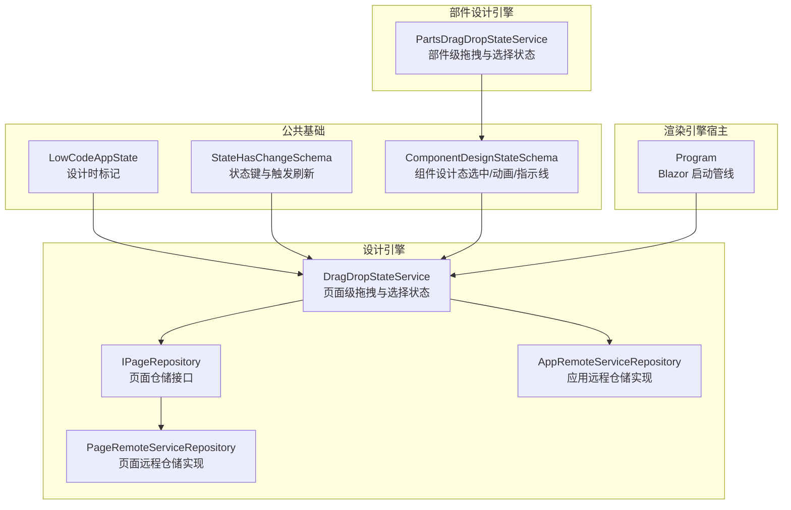
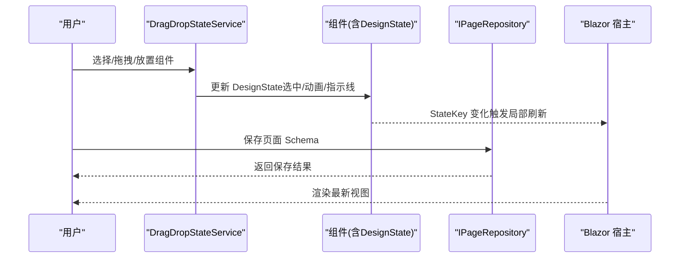
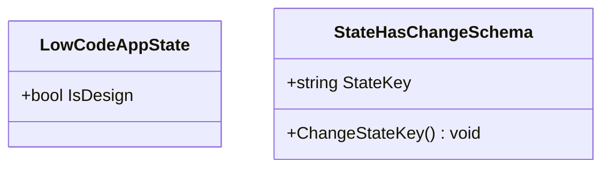
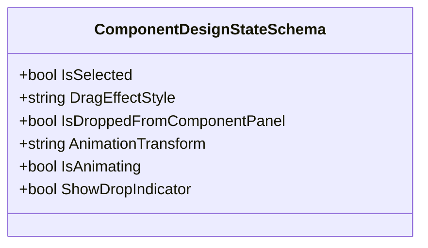
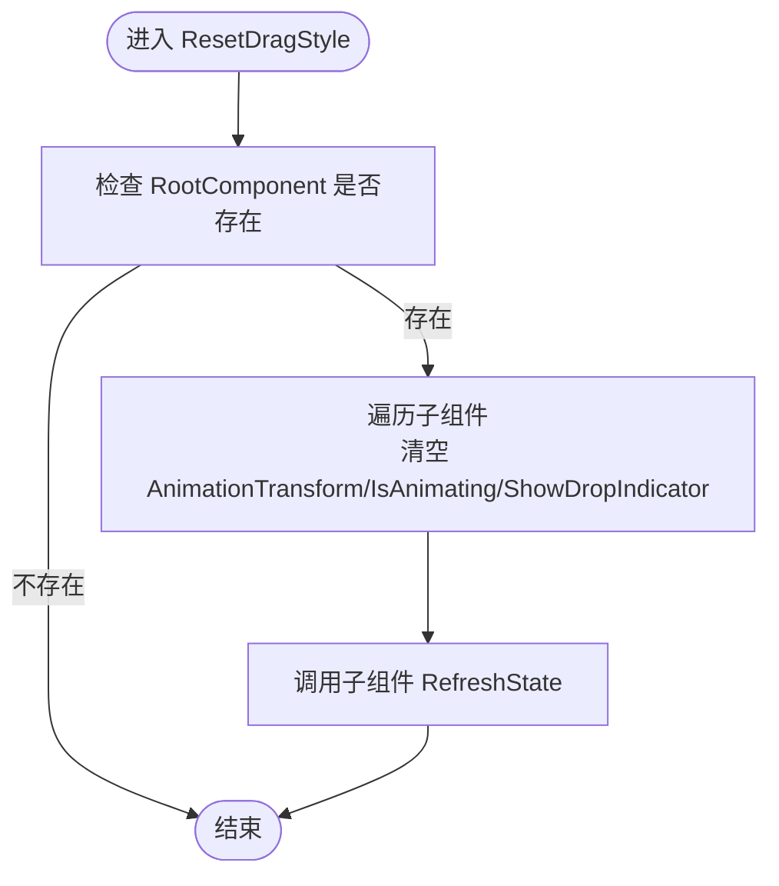
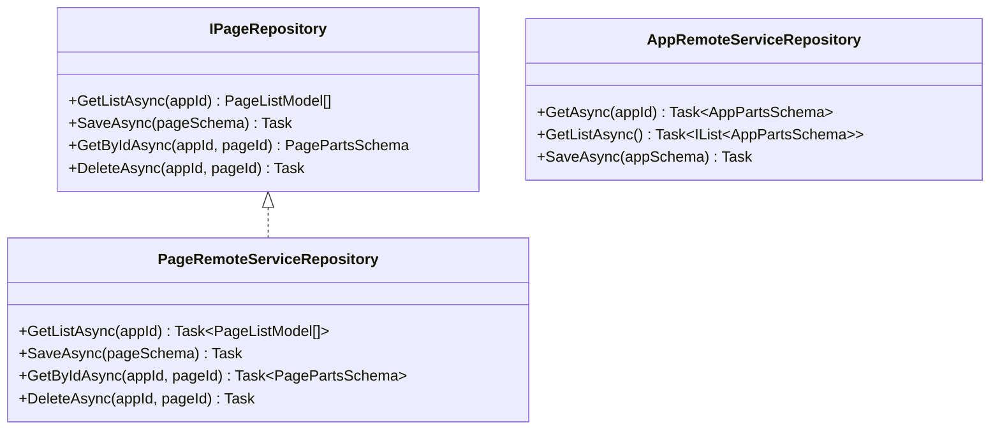
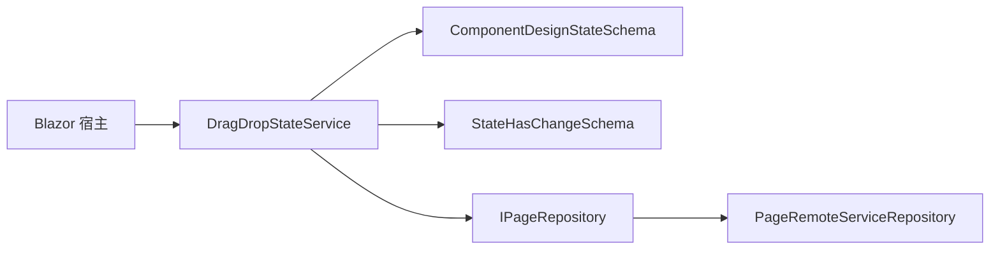

# 设计状态管理

<cite>
**本文引用的文件**   
- [LowCodeAppState.cs](file://src/LowCode/Common/H.LowCode.ComponentBase/LowCodeAppState.cs)
- [ComponentDesignStateSchema.cs](file://src/LowCode/Common/H.LowCode.MetaSchema.DesignEngine/PropertySchemas/ComponentDesignStateSchema.cs)
- [DragDropStateService.cs](file://src/LowCode/DesignEngine/H.LowCode.DesignEngine/Services/DragDropStateService.cs)
- [PartsDragDropStateService.cs](file://src/LowCode/DesignEngine/H.LowCode.PartsDesignEngine/Services/PartsDragDropStateService.cs)
- [StateHasChangeSchema.cs](file://src/LowCode/Common/H.LowCode.MetaSchema/StateHasChangeSchema.cs)
- [IPageRepository.cs](file://src/LowCode/DesignEngine/H.LowCode.DesignEngine.Domain/MetaRepositories/IPageRepository.cs)
- [PageRemoteServiceRepository.cs](file://src/LowCode/DesignEngine/H.LowCode.DesignEngine.Repository.RemoteService/Repositories/PageRemoteServiceRepository.cs)
- [AppRemoteServiceRepository.cs](file://src/LowCode/DesignEngine/H.LowCode.DesignEngine.Repository.RemoteService/Repositories/AppRemoteServiceRepository.cs)
- [Program.cs（渲染引擎宿主）](file://src/Host/RenderEngine/H.LowCode.RenderEngine.Host/Program.cs)
</cite>

## 目录
1. [简介](#简介)
2. [项目结构](#项目结构)
3. [核心组件](#核心组件)
4. [架构总览](#架构总览)
5. [详细组件分析](#详细组件分析)
6. [依赖关系分析](#依赖关系分析)
7. [性能考量](#性能考量)
8. [故障排查指南](#故障排查指南)
9. [结论](#结论)
10. [附录](#附录)

## 简介
本文件面向低代码平台的设计器与部件设计器，系统化阐述“设计状态管理”的存储结构、变更监听机制、撤销重做原理、持久化策略以及扩展接口。重点覆盖：
- 页面元数据与组件树结构的内存模型
- 属性值集合的管理方式
- 响应式更新与性能优化
- 撤销/重做的历史栈、快照与差异计算思路
- 本地存储与云端同步方案
- 自定义状态处理器扩展指南

## 项目结构
围绕设计状态的核心代码主要分布在以下模块：
- 公共基础：组件基类与状态键、设计时应用上下文
- 设计引擎：拖拽与选择状态服务、页面与应用的远程仓储接口
- 部件设计引擎：部件级拖拽状态服务
- 渲染引擎宿主：Blazor 运行时与静态资源加载配置

图表来源 
- [LowCodeAppState.cs:1-21](file://src/LowCode/Common/H.LowCode.ComponentBase/LowCodeAppState.cs#L1-L21)
- [StateHasChangeSchema.cs:1-17](file://src/LowCode/Common/H.LowCode.MetaSchema/StateHasChangeSchema.cs#L1-L17)
- [ComponentDesignStateSchema.cs:1-41](file://src/LowCode/Common/H.LowCode.MetaSchema.DesignEngine/PropertySchemas/ComponentDesignStateSchema.cs#L1-L41)
- [DragDropStateService.cs:1-244](file://src/LowCode/DesignEngine/H.LowCode.DesignEngine/Services/DragDropStateService.cs#L1-L244)
- [PartsDragDropStateService.cs:154-190](file://src/LowCode/DesignEngine/H.LowCode.PartsDesignEngine/Services/PartsDragDropStateService.cs#L154-L190)
- [IPageRepository.cs:1-15](file://src/LowCode/DesignEngine/H.LowCode.DesignEngine.Domain/MetaRepositories/IPageRepository.cs#L1-L15)
- [PageRemoteServiceRepository.cs:1-43](file://src/LowCode/DesignEngine/H.LowCode.DesignEngine.Repository.RemoteService/Repositories/PageRemoteServiceRepository.cs#L1-L43)
- [AppRemoteServiceRepository.cs:1-31](file://src/LowCode/DesignEngine/H.LowCode.DesignEngine.Repository.RemoteService/Repositories/AppRemoteServiceRepository.cs#L1-L31)
- [Program.cs（渲染引擎宿主）:44-79](file://src/Host/RenderEngine/H.LowCode.RenderEngine.Host/Program.cs#L44-L79)

章节来源
- [LowCodeAppState.cs:1-21](file://src/LowCode/Common/H.LowCode.ComponentBase/LowCodeAppState.cs#L1-L21)
- [StateHasChangeSchema.cs:1-17](file://src/LowCode/Common/H.LowCode.MetaSchema/StateHasChangeSchema.cs#L1-L17)
- [ComponentDesignStateSchema.cs:1-41](file://src/LowCode/Common/H.LowCode.MetaSchema.DesignEngine/PropertySchemas/ComponentDesignStateSchema.cs#L1-L41)
- [DragDropStateService.cs:1-244](file://src/LowCode/DesignEngine/H.LowCode.DesignEngine/Services/DragDropStateService.cs#L1-L244)
- [PartsDragDropStateService.cs:154-190](file://src/LowCode/DesignEngine/H.LowCode.PartsDesignEngine/Services/PartsDragDropStateService.cs#L154-L190)
- [IPageRepository.cs:1-15](file://src/LowCode/DesignEngine/H.LowCode.DesignEngine.Domain/MetaRepositories/IPageRepository.cs#L1-L15)
- [PageRemoteServiceRepository.cs:1-43](file://src/LowCode/DesignEngine/H.LowCode.DesignEngine.Repository.RemoteService/Repositories/PageRemoteServiceRepository.cs#L1-L43)
- [AppRemoteServiceRepository.cs:1-31](file://src/LowCode/DesignEngine/H.LowCode.DesignEngine.Repository.RemoteService/Repositories/AppRemoteServiceRepository.cs#L1-L31)
- [Program.cs（渲染引擎宿主）:44-79](file://src/Host/RenderEngine/H.LowCode.RenderEngine.Host/Program.cs#L44-L79)

## 核心组件
- LowCodeAppState：标识当前是否处于设计时环境，用于控制 UI 行为与状态处理分支。
- StateHasChangeSchema：为可观察对象提供唯一 StateKey，便于在 Blazor 中通过 key 变化触发局部刷新。
- ComponentDesignStateSchema：记录组件在设计时的瞬时状态（选中、拖拽效果样式、让位动画、放置指示线等），不持久化。
- DragDropStateService：维护页面级的设计状态（根组件、页元数据、最后选中/拖拽目标/落点、时间戳），并提供查找与重置能力。
- PartsDragDropStateService：维护部件库级别的相同语义的状态，服务于部件设计器。
- IPageRepository / PageRemoteServiceRepository / AppRemoteServiceRepository：定义并实现页面与应用数据的持久化接口（当前远程实现未完全实现）。

章节来源
- [LowCodeAppState.cs:1-21](file://src/LowCode/Common/H.LowCode.ComponentBase/LowCodeAppState.cs#L1-L21)
- [StateHasChangeSchema.cs:1-17](file://src/LowCode/Common/H.LowCode.MetaSchema/StateHasChangeSchema.cs#L1-L17)
- [ComponentDesignStateSchema.cs:1-41](file://src/LowCode/Common/H.LowCode.MetaSchema.DesignEngine/PropertySchemas/ComponentDesignStateSchema.cs#L1-L41)
- [DragDropStateService.cs:1-244](file://src/LowCode/DesignEngine/H.LowCode.DesignEngine/Services/DragDropStateService.cs#L1-L244)
- [PartsDragDropStateService.cs:154-190](file://src/LowCode/DesignEngine/H.LowCode.PartsDesignEngine/Services/PartsDragDropStateService.cs#L154-L190)
- [IPageRepository.cs:1-15](file://src/LowCode/DesignEngine/H.LowCode.DesignEngine.Domain/MetaRepositories/IPageRepository.cs#L1-L15)
- [PageRemoteServiceRepository.cs:1-43](file://src/LowCode/DesignEngine/H.LowCode.DesignEngine.Repository.RemoteService/Repositories/PageRemoteServiceRepository.cs#L1-L43)
- [AppRemoteServiceRepository.cs:1-31](file://src/LowCode/DesignEngine/H.LowCode.DesignEngine.Repository.RemoteService/Repositories/AppRemoteServiceRepository.cs#L1-L31)

## 架构总览
设计状态管理的整体流程如下：
- 设计器初始化时，根据 appId/pageId 建立或获取页面级状态（DragDropStateSchema），包含根组件树与页元数据。
- 用户交互（选择、拖拽、放置）通过 DragDropStateService 修改状态，并驱动组件 DesignState 的动画与指示线。
- 组件通过 StateHasChangeSchema 的 StateKey 变化通知 Blazor 进行最小化重渲染。
- 保存操作通过 IPageRepository 将页面 Schema 持久化到后端；应用级信息通过 AppRemoteServiceRepository 存取。
- 渲染引擎宿主负责 Blazor 运行管线与静态资源缓存策略，确保设计态与运行态隔离。

图表来源 
- [DragDropStateService.cs:1-244](file://src/LowCode/DesignEngine/H.LowCode.DesignEngine/Services/DragDropStateService.cs#L1-L244)
- [ComponentDesignStateSchema.cs:1-41](file://src/LowCode/Common/H.LowCode.MetaSchema.DesignEngine/PropertySchemas/ComponentDesignStateSchema.cs#L1-L41)
- [StateHasChangeSchema.cs:1-17](file://src/LowCode/Common/H.LowCode.MetaSchema/StateHasChangeSchema.cs#L1-L17)
- [IPageRepository.cs:1-15](file://src/LowCode/DesignEngine/H.LowCode.DesignEngine.Domain/MetaRepositories/IPageRepository.cs#L1-L15)
- [Program.cs（渲染引擎宿主）:44-79](file://src/Host/RenderEngine/H.LowCode.RenderEngine.Host/Program.cs#L44-L79)

## 详细组件分析

### 设计时应用上下文与状态键
- LowCodeAppState：提供 IsDesign 标志，区分设计时与运行时的状态处理逻辑。
- StateHasChangeSchema：为每个可观察对象生成唯一 StateKey，调用 ChangeStateKey 以触发 Blazor 的 key 差异化渲染。

图表来源 
- [LowCodeAppState.cs:1-21](file://src/LowCode/Common/H.LowCode.ComponentBase/LowCodeAppState.cs#L1-L21)
- [StateHasChangeSchema.cs:1-17](file://src/LowCode/Common/H.LowCode.MetaSchema/StateHasChangeSchema.cs#L1-L17)

章节来源
- [LowCodeAppState.cs:1-21](file://src/LowCode/Common/H.LowCode.ComponentBase/LowCodeAppState.cs#L1-L21)
- [StateHasChangeSchema.cs:1-17](file://src/LowCode/Common/H.LowCode.MetaSchema/StateHasChangeSchema.cs#L1-L17)

### 组件设计状态（DesignState）
- ComponentDesignStateSchema：记录选中、拖拽效果样式、动画变换、动画进行中、放置指示线等，全部标记为不序列化，仅用于设计期 UI 表现。
- 组件通过 RefreshState 方法配合 StateKey 变化完成局部刷新。

图表来源 
- [ComponentDesignStateSchema.cs:1-41](file://src/LowCode/Common/H.LowCode.MetaSchema.DesignEngine/PropertySchemas/ComponentDesignStateSchema.cs#L1-L41)

章节来源
- [ComponentDesignStateSchema.cs:1-41](file://src/LowCode/Common/H.LowCode.MetaSchema.DesignEngine/PropertySchemas/ComponentDesignStateSchema.cs#L1-L41)

### 页面级拖拽与选择状态服务
- DragDropStateService：维护 appId-pageId 维度的状态字典，包含根组件、页元数据、最后选中/拖拽目标/落点、时间戳。
- 提供按 ID 递归查找组件、重置选择与拖拽样式、清理动画等方法。
- ResetDragStyle 会遍历根组件子节点，统一清理动画与指示线，并调用 RefreshState 触发刷新。

图表来源 
- [DragDropStateService.cs:169-205](file://src/LowCode/DesignEngine/H.LowCode.DesignEngine/Services/DragDropStateService.cs#L169-L205)

章节来源
- [DragDropStateService.cs:1-244](file://src/LowCode/DesignEngine/H.LowCode.DesignEngine/Services/DragDropStateService.cs#L1-L244)

### 部件级拖拽与选择状态服务
- PartsDragDropStateService：与页面级服务语义一致，但作用于部件库维度（libId-partsId），用于部件设计器的拖拽与选择状态管理。
- 同样提供 ResetComponent 与 ResetDragStyle 等方法，保证部件设计器中的交互一致性。

章节来源
- [PartsDragDropStateService.cs:154-190](file://src/LowCode/DesignEngine/H.LowCode.PartsDesignEngine/Services/PartsDragDropStateService.cs#L154-L190)

### 页面与应用持久化接口
- IPageRepository：定义页面列表、获取、保存、删除等操作。
- PageRemoteServiceRepository：远程仓储实现（当前未实现具体逻辑）。
- AppRemoteServiceRepository：应用远程仓储实现（当前未实现具体逻辑）。

图表来源 
- [IPageRepository.cs:1-15](file://src/LowCode/DesignEngine/H.LowCode.DesignEngine.Domain/MetaRepositories/IPageRepository.cs#L1-L15)
- [PageRemoteServiceRepository.cs:1-43](file://src/LowCode/DesignEngine/H.LowCode.DesignEngine.Repository.RemoteService/Repositories/PageRemoteServiceRepository.cs#L1-L43)
- [AppRemoteServiceRepository.cs:1-31](file://src/LowCode/DesignEngine/H.LowCode.DesignEngine.Repository.RemoteService/Repositories/AppRemoteServiceRepository.cs#L1-L31)

章节来源
- [IPageRepository.cs:1-15](file://src/LowCode/DesignEngine/H.LowCode.DesignEngine.Domain/MetaRepositories/IPageRepository.cs#L1-L15)
- [PageRemoteServiceRepository.cs:1-43](file://src/LowCode/DesignEngine/H.LowCode.DesignEngine.Repository.RemoteService/Repositories/PageRemoteServiceRepository.cs#L1-L43)
- [AppRemoteServiceRepository.cs:1-31](file://src/LowCode/DesignEngine/H.LowCode.DesignEngine.Repository.RemoteService/Repositories/AppRemoteServiceRepository.cs#L1-L31)

## 依赖关系分析
- 设计态服务依赖组件的 DesignState 与 StateKey 机制，以实现最小化刷新与动画控制。
- 持久化层通过仓储接口抽象，便于替换为本地文件或远程服务实现。
- 宿主程序通过 Blazor 管线加载静态资源与中间件，确保设计态与运行态正确隔离。

图表来源 
- [DragDropStateService.cs:1-244](file://src/LowCode/DesignEngine/H.LowCode.DesignEngine/Services/DragDropStateService.cs#L1-L244)
- [ComponentDesignStateSchema.cs:1-41](file://src/LowCode/Common/H.LowCode.MetaSchema.DesignEngine/PropertySchemas/ComponentDesignStateSchema.cs#L1-L41)
- [StateHasChangeSchema.cs:1-17](file://src/LowCode/Common/H.LowCode.MetaSchema/StateHasChangeSchema.cs#L1-L17)
- [IPageRepository.cs:1-15](file://src/LowCode/DesignEngine/H.LowCode.DesignEngine.Domain/MetaRepositories/IPageRepository.cs#L1-L15)
- [PageRemoteServiceRepository.cs:1-43](file://src/LowCode/DesignEngine/H.LowCode.DesignEngine.Repository.RemoteService/Repositories/PageRemoteServiceRepository.cs#L1-L43)
- [Program.cs（渲染引擎宿主）:44-79](file://src/Host/RenderEngine/H.LowCode.RenderEngine.Host/Program.cs#L44-L79)

章节来源
- [DragDropStateService.cs:1-244](file://src/LowCode/DesignEngine/H.LowCode.DesignEngine/Services/DragDropStateService.cs#L1-L244)
- [ComponentDesignStateSchema.cs:1-41](file://src/LowCode/Common/H.LowCode.MetaSchema.DesignEngine/PropertySchemas/ComponentDesignStateSchema.cs#L1-L41)
- [StateHasChangeSchema.cs:1-17](file://src/LowCode/Common/H.LowCode.MetaSchema/StateHasChangeSchema.cs#L1-L17)
- [IPageRepository.cs:1-15](file://src/LowCode/DesignEngine/H.LowCode.DesignEngine.Domain/MetaRepositories/IPageRepository.cs#L1-L15)
- [PageRemoteServiceRepository.cs:1-43](file://src/LowCode/DesignEngine/H.LowCode.DesignEngine.Repository.RemoteService/Repositories/PageRemoteServiceRepository.cs#L1-L43)
- [Program.cs（渲染引擎宿主）:44-79](file://src/Host/RenderEngine/H.LowCode.RenderEngine.Host/Program.cs#L44-L79)

## 性能考量
- 局部刷新：通过 StateHasChangeSchema 的 StateKey 变化，避免全量重渲染，降低 UI 开销。
- 动画与指示线：仅在拖拽过程中更新 DesignState，并在结束时统一清理，减少频繁 DOM 操作。
- 状态作用域：以 appId-pageId 作为状态键，避免跨页面状态污染，提升并发访问稳定性。
- 批量清理：ResetDragStyle 对子组件进行批量清理并调用 RefreshState，确保动画与指示线一致复位。

[本节为通用性能建议，不直接分析具体文件]

## 故障排查指南
- 拖拽样式未清除：检查 ResetDragStyle 是否被调用，确认 LastSelectedComponent/LastDragOverComponent/CurrentDragComponent 的 DesignState 字段已清空。
- 组件未刷新：确认组件是否继承 StateHasChangeSchema，并在状态变更后调用 ChangeStateKey 或 RefreshState。
- 保存失败：检查 IPageRepository.SaveAsync 的实现是否正确，远程仓储实现是否已完善。
- 设计态与运行态混淆：确认 LowCodeAppState.IsDesign 标志是否正确设置，避免运行时代码误入设计态分支。

章节来源
- [DragDropStateService.cs:169-205](file://src/LowCode/DesignEngine/H.LowCode.DesignEngine/Services/DragDropStateService.cs#L169-L205)
- [StateHasChangeSchema.cs:1-17](file://src/LowCode/Common/H.LowCode.MetaSchema/StateHasChangeSchema.cs#L1-L17)
- [PageRemoteServiceRepository.cs:1-43](file://src/LowCode/DesignEngine/H.LowCode.DesignEngine.Repository.RemoteService/Repositories/PageRemoteServiceRepository.cs#L1-L43)
- [LowCodeAppState.cs:1-21](file://src/LowCode/Common/H.LowCode.ComponentBase/LowCodeAppState.cs#L1-L21)

## 结论
该设计状态管理体系以轻量化的内存状态为核心，结合 Blazor 的 key 差异化刷新机制，实现了高效的设计器交互体验。通过仓储接口抽象，便于后续接入本地或云端持久化。未来可在现有基础上增强撤销/重做、版本控制与增量同步能力，进一步提升开发效率与协作体验。

[本节为总结性内容，不直接分析具体文件]

## 附录

### 状态存储结构说明
- 页面元数据：由 PagePartsSchema 承载，通过 DragDropStateService.SetPage 与 GetPage 读写。
- 组件树结构：根组件与子组件通过 ComponentPartsSchema 组织，DragDropStateService 提供递归查找。
- 属性值集合：组件属性由属性定义组（attrdefgroups）描述，实际值随组件实例动态绑定。

章节来源
- [DragDropStateService.cs:1-244](file://src/LowCode/DesignEngine/H.LowCode.DesignEngine/Services/DragDropStateService.cs#L1-L244)

### 响应式更新与性能优化
- 使用 StateHasChangeSchema 的 StateKey 变化触发最小化重渲染。
- 仅在必要时机更新 DesignState，避免不必要的刷新。
- 批量清理动画与指示线，减少重复计算与 DOM 操作。

章节来源
- [StateHasChangeSchema.cs:1-17](file://src/LowCode/Common/H.LowCode.MetaSchema/StateHasChangeSchema.cs#L1-L17)
- [DragDropStateService.cs:169-205](file://src/LowCode/DesignEngine/H.LowCode.DesignEngine/Services/DragDropStateService.cs#L169-L205)

### 撤销/重做实现原理（建议）
- 操作历史栈：维护一个操作队列，每次用户交互产生一个不可变的操作对象（如插入、移动、删除、属性变更）。
- 状态快照：在关键节点（如保存前）生成页面 Schema 的深拷贝快照，支持快速回滚。
- 差异计算：比较前后快照的差异，生成最小化补丁，提高撤销/重做的效率。
- 合并策略：对连续同类操作进行合并，减少历史栈长度。

[本节为概念性指导，不直接分析具体文件]

### 状态持久化策略（建议）
- 本地存储：利用浏览器 localStorage/sessionStorage 缓存临时设计态，提升用户体验。
- 云端同步：通过 IPageRepository 与 AppRemoteServiceRepository 将页面与应用 Schema 同步至服务端。
- 版本控制：为每次保存生成版本号与时间戳，支持对比与回滚。

[本节为概念性指导，不直接分析具体文件]

### 扩展接口与自定义状态处理器（建议）
- 新增状态类型：在 ComponentDesignStateSchema 中扩展字段，并在 DragDropStateService 中增加读写方法。
- 自定义刷新：在组件中实现基于 StateKey 的刷新逻辑，确保状态变更后触发 UI 更新。
- 仓储扩展：实现新的 Repository 以支持不同存储后端（如 JSON 文件、数据库、云存储）。

[本节为概念性指导，不直接分析具体文件]