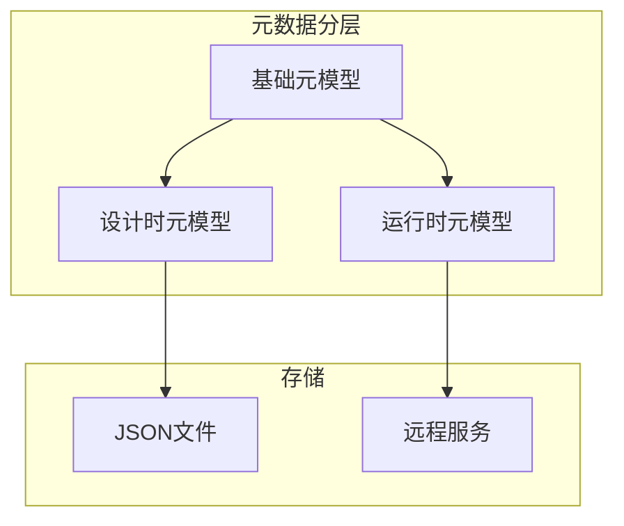
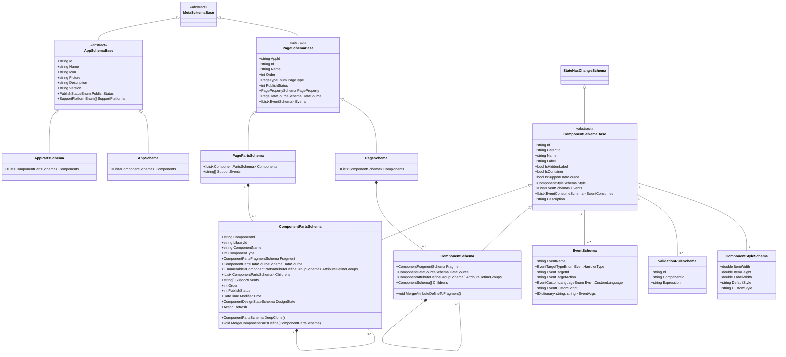

# 元数据架构

<cite>
**本文档引用的文件**  
- [AppSchemaBase.cs](file://src/Common/H.LowCode.MetaSchema/AppSchemaBase.cs)
- [PageSchemaBase.cs](file://src/Common/H.LowCode.MetaSchema/PageSchemaBase.cs)
- [ComponentSchemaBase.cs](file://src/Common/H.LowCode.MetaSchema/ComponentSchemaBase.cs)
- [EventSchema.cs](file://src/Common/H.LowCode.MetaSchema/PropertySchemas/EventSchema.cs)
- [ComponentAttributeDefineSchemaBase.cs](file://src/Common/H.LowCode.MetaSchema/PropertySchemas/ComponentAttributeDefineSchemaBase.cs)
- [ComponentStyleSchema.cs](file://src/Common/H.LowCode.MetaSchema/PropertySchemas/ComponentStyleSchema.cs)
- [ValidationRuleSchema.cs](file://src/Common/H.LowCode.MetaSchema/PropertySchemas/ValidationRuleSchema.cs)
- [AppPartsSchema.cs](file://src/Common/H.LowCode.MetaSchema.DesignEngine/AppPartsSchema.cs)
- [PagePartsSchema.cs](file://src/Common/H.LowCode.MetaSchema.DesignEngine/PagePartsSchema.cs)
- [ComponentPartsSchema.cs](file://src/Common/H.LowCode.MetaSchema.DesignEngine/ComponentPartsSchema.cs)
- [AppSchema.cs](file://src/Common/H.LowCode.MetaSchema.RenderEngine/AppSchema.cs)
- [PageSchema.cs](file://src/Common/H.LowCode.MetaSchema.RenderEngine/PageSchema.cs)
- [ComponentSchema.cs](file://src/Common/H.LowCode.MetaSchema.RenderEngine/ComponentSchema.cs)
- [PublishStatusEnum.cs](file://src/Common/H.LowCode.MetaSchema/Enums/PublishStatusEnum.cs)
- [SupportPlatformEnum.cs](file://src/Common/H.LowCode.MetaSchema/Enums/SupportPlatformEnum.cs)
- [PageTypeEnum.cs](file://src/Common/H.LowCode.MetaSchema/Enums/PageTypeEnum.cs)
</cite>

## 目录
1. [元数据架构概述](#元数据架构概述)
2. [应用元数据结构](#应用元数据结构)
3. [页面元数据结构](#页面元数据结构)
4. [组件元数据结构](#组件元数据结构)
5. [设计时与运行时元数据对比](#设计时与运行时元数据对比)
6. [核心元模型UML类图](#核心元模型uml类图)

## 元数据架构概述

本系统采用分层元数据架构，将元数据划分为基础模型、设计时模型和运行时模型三个层次。基础模型定义了应用、页面和组件的通用结构，设计时模型扩展了拖拽、状态管理等可视化编辑所需的信息，运行时模型则专注于渲染性能和数据绑定。元数据通过JSON序列化存储于`meta`目录下，支持文件存储和远程服务两种持久化方式。

**元数据架构分层**
- **基础元模型**：定义通用字段和继承关系
- **设计时元模型**：包含拖拽状态、组件物料信息
- **运行时元模型**：优化渲染性能，合并属性定义



**图示来源**
- [AppSchemaBase.cs](file://src/Common/H.LowCode.MetaSchema/AppSchemaBase.cs)
- [AppPartsSchema.cs](file://src/Common/H.LowCode.MetaSchema.DesignEngine/AppPartsSchema.cs)
- [AppSchema.cs](file://src/Common/H.LowCode.MetaSchema.RenderEngine/AppSchema.cs)

## 应用元数据结构

应用元数据（AppSchema）定义了低代码应用的基本信息、发布状态和支持平台。所有应用元数据均继承自`AppSchemaBase`抽象类，该类定义了应用的核心属性。

### 基础字段
- **Id**：应用唯一标识符
- **Name**：应用名称（JSON属性名：n）
- **Icon**：应用图标
- **Picture**：应用封面图（JSON属性名：pic）
- **Description**：应用描述（JSON属性名：desc）
- **Version**：版本号（JSON属性名：v）
- **PublishStatus**：发布状态（JSON属性名：pub）
- **SupportPlatforms**：支持平台数组（JSON属性名：platform）

### 发布状态枚举
```csharp
public enum PublishStatusEnum
{
    Development,    // 开发中
    Approving,      // 审核中
    Published       // 已发布
}
```

### 支持平台枚举
```csharp
public enum SupportPlatformEnum
{
    [Display(Name = "Web")]
    Web,
    [Display(Name = "App")]
    Mobile,
    [Display(Name = "小程序")]
    WXMiniApp
}
```

**示例JSON**
```json
{
  "id": "caseapp",
  "n": "案例应用",
  "pic": "/images/caseapp.jpg",
  "desc": "低代码开发示例应用",
  "v": "1.0.0",
  "pub": 2,
  "platform": [0, 1]
}
```

**中文说明**
- `pub`值为2表示"已发布"
- `platform`中0代表Web，1代表App

**本节来源**
- [AppSchemaBase.cs](file://src/Common/H.LowCode.MetaSchema/AppSchemaBase.cs#L4-L27)
- [PublishStatusEnum.cs](file://src/Common/H.LowCode.MetaSchema/Enums/PublishStatusEnum.cs)
- [SupportPlatformEnum.cs](file://src/Common/H.LowCode.MetaSchema/Enums/SupportPlatformEnum.cs)

## 页面元数据结构

页面元数据（PageSchema）定义了页面的布局、组件列表、数据源引用和事件处理逻辑。页面元数据继承自`PageSchemaBase`类，并在设计时和运行时有不同的扩展。

### 基础字段
- **AppId**：所属应用ID（JSON属性名：aid）
- **Id**：页面唯一ID（JSON属性名：id）
- **Name**：页面名称（JSON属性名：n）
- **Order**：排序序号（JSON属性名：order）
- **PageType**：页面类型（JSON属性名：pt）
- **PublishStatus**：发布状态（JSON属性名：pub）
- **PageProperty**：页面属性（JSON属性名：pageprop）
- **DataSource**：数据源配置（JSON属性名：ds）
- **Events**：事件列表（JSON属性名：evs）

### 页面类型枚举
```csharp
public enum PageTypeEnum
{
    [Display(Name = "普通")]
    Normal = 0,
    [Display(Name = "表单")]
    Form = 1,
    [Display(Name = "列表")]
    Table = 2,
    [Display(Name = "报表")]
    Report = 5
}
```

### 设计时扩展字段
- **Components**：组件列表（JSON属性名：comps）
- **SupportEvents**：支持的事件数组（JSON属性名：sptevs）

### 运行时扩展字段
- **Components**：运行时组件列表（JSON属性名：comps）

**示例JSON**
```json
{
  "aid": "caseapp",
  "id": "0lgu6xpop",
  "n": "用户管理",
  "order": 1,
  "pt": 2,
  "pub": 2,
  "pageprop": {
    "layout": "default"
  },
  "ds": {
    "type": "sql",
    "query": "SELECT * FROM users"
  },
  "evs": [
    {
      "en": "OnLoad",
      "eht": 1,
      "etid": "grid1",
      "eta": "Refresh"
    }
  ],
  "comps": []
}
```

**本节来源**
- [PageSchemaBase.cs](file://src/Common/H.LowCode.MetaSchema/PageSchemaBase.cs#L5-L39)
- [PageTypeEnum.cs](file://src/Common/H.LowCode.MetaSchema/Enums/PageTypeEnum.cs)
- [PagePartsSchema.cs](file://src/Common/H.LowCode.MetaSchema.DesignEngine/PagePartsSchema.cs)
- [PageSchema.cs](file://src/Common/H.LowCode.MetaSchema.RenderEngine/PageSchema.cs)

## 组件元数据结构

组件元数据（ComponentSchema）是元数据架构中最复杂的部分，包含属性定义、样式配置、事件绑定和验证规则。

### 基础字段
- **Id**：组件实例ID（JSON属性名：id）
- **ParentId**：父组件ID（JSON属性名：pid）
- **Name**：组件名称（JSON属性名：n）
- **Label**：标签文本（JSON属性名：lb）
- **IsHiddenLabel**：是否隐藏标题（JSON属性名：hlb）
- **IsContainer**：是否为容器组件（JSON属性名：container）
- **IsSupportDataSource**：是否支持数据源（JSON属性名：sptds）
- **Style**：样式配置（JSON属性名：stl）
- **Events**：事件列表（JSON属性名：evs）
- **EventConsumes**：事件消费列表（JSON属性名：evcs）
- **Description**：描述（JSON属性名：desc）

### 属性定义
组件属性定义继承自`ComponentAttributeDefineSchemaBase`，包含：
- **AttributeName**：属性名称（JSON属性名：attrn）
- **AttributeClrType**：CLR类型（JSON属性名：attrt）
- **AttributeValue**：属性值（JSON属性名：attrv）

### 样式配置
`ComponentStyleSchema`定义了组件的布局样式：
- **ItemWidth**：组件宽度（4-24栅格，JSON属性名：itemw）
- **ItemHeight**：组件高度（单位：px，JSON属性名：itemh）
- **LabelWidth**：标签宽度（默认180px，JSON属性名：labelw）
- **DefaultStyle**：默认样式（JSON属性名：dfstl）
- **CustomStyle**：自定义样式（JSON属性名：ctstl）

### 事件绑定
`EventSchema`定义了事件处理逻辑：
- **EventName**：事件名称（JSON属性名：en）
- **EventHandlerType**：事件处理器类型（JSON属性名：eht）
- **EventTargetId**：事件目标ID（JSON属性名：etid）
- **EventTargetAction**：事件目标动作（JSON属性名：eta）
- **EventCustomLanguage**：自定义脚本语言（JSON属性名：ecl）
- **EventCustomScript**：自定义脚本内容（JSON属性名：ecs）
- **EventArgs**：事件参数字典

### 验证规则
`ValidationRuleSchema`定义了表单验证规则：
- **Id**：规则ID
- **ComponentId**：关联组件ID
- **Expression**：验证表达式

**示例JSON**
```json
{
  "id": "comp1",
  "pid": "root",
  "n": "用户名输入框",
  "lb": "用户名",
  "hlb": false,
  "container": false,
  "sptds": true,
  "stl": {
    "itemw": 12,
    "itemh": 40,
    "labelw": 100
  },
  "evs": [
    {
      "en": "OnChange",
      "eht": 2,
      "ecl": 0,
      "ecs": "console.log('value changed')"
    }
  ],
  "desc": "用户登录名输入"
}
```

**本节来源**
- [ComponentSchemaBase.cs](file://src/Common/H.LowCode.MetaSchema/ComponentSchemaBase.cs#L5-L77)
- [ComponentAttributeDefineSchemaBase.cs](file://src/Common/H.LowCode.MetaSchema/PropertySchemas/ComponentAttributeDefineSchemaBase.cs#L9-L29)
- [ComponentStyleSchema.cs](file://src/Common/H.LowCode.MetaSchema/PropertySchemas/ComponentStyleSchema.cs#L5-L38)
- [EventSchema.cs](file://src/Common/H.LowCode.MetaSchema/PropertySchemas/EventSchema.cs#L5-L45)
- [ValidationRuleSchema.cs](file://src/Common/H.LowCode.MetaSchema/PropertySchemas/ValidationRuleSchema.cs#L8-L15)

## 设计时与运行时元数据对比

系统采用分离的设计时和运行时元数据架构，以满足可视化编辑和高效渲染的不同需求。

### 设计时元数据（MetaSchema.DesignEngine）

设计时元数据位于`H.LowCode.MetaSchema.DesignEngine`命名空间，主要用于可视化设计器。

#### AppPartsSchema
继承自`AppSchemaBase`，无额外字段，主要用于类型区分。

#### PagePartsSchema
在`PageSchemaBase`基础上扩展：
- **Components**：`IList<ComponentPartsSchema>`类型组件列表
- **SupportEvents**：支持的事件数组（JSON属性名：sptevs）

#### ComponentPartsSchema
在`ComponentSchemaBase`基础上扩展了丰富的设计时信息：
- **ComponentId**：组件物料ID（JSON属性名：compid）
- **LibraryId**：组件库ID（JSON属性名：libid）
- **ComponentName**：组件物料名称（JSON属性名：cn）
- **ComponentType**：组件类型（1-原子组件，2-组合组件，JSON属性名：ct）
- **Fragment**：组件渲染片段（JSON属性名：frag）
- **DataSource**：组件数据源（JSON属性名：ds）
- **AttributeDefineGroups**：属性定义分组（JSON属性名：attrdefgroups）
- **Childrens**：子组件列表（JSON属性名：childs）
- **SupportEvents**：支持的事件（JSON属性名：sptevs）
- **Order**：排序序号（JSON属性名：order）
- **PublishStatus**：发布状态（JSON属性名：pub）
- **ModifiedTime**：修改时间（JSON属性名：mt）
- **DesignState**：设计状态（非持久化，JsonIgnore）
- **Refresh**：刷新委托（非持久化，JsonIgnore）

### 运行时元数据（MetaSchema.RenderEngine）

运行时元数据位于`H.LowCode.MetaSchema.RenderEngine`命名空间，专为高效渲染优化。

#### AppSchema
继承自`AppSchemaBase`，无额外字段。

#### PageSchema
在`PageSchemaBase`基础上扩展：
- **Components**：`IList<ComponentSchema>`类型组件列表

#### ComponentSchema
在`ComponentSchemaBase`基础上扩展：
- **Fragment**：组件渲染片段（JSON属性名：frag）
- **DataSource**：组件数据源（JSON属性名：ds）
- **AttributeDefineGroups**：属性定义分组（JSON属性名：attrdefgroups）
- **Childrens**：子组件数组（JSON属性名：childs）
- **MergeAttributeDefineToFragment**：将属性定义合并到渲染片段的方法

### 关键差异对比

| 特性 | 设计时元数据 | 运行时元数据 |
|------|-------------|-------------|
| **组件列表类型** | `IList<ComponentPartsSchema>` | `IList<ComponentSchema>` |
| **属性定义分组** | `IEnumerable<ComponentPartsAttributeDefineGroupSchema>` | `ComponentAttributeDefineGroupSchema[]` |
| **子组件类型** | `IList<ComponentPartsSchema>` | `ComponentSchema[]` |
| **非持久化字段** | DesignState, Refresh | 无 |
| **主要用途** | 可视化编辑、拖拽操作 | 高效渲染、数据绑定 |

**本节来源**
- [AppPartsSchema.cs](file://src/Common/H.LowCode.MetaSchema.DesignEngine/AppPartsSchema.cs)
- [PagePartsSchema.cs](file://src/Common/H.LowCode.MetaSchema.DesignEngine/PagePartsSchema.cs)
- [ComponentPartsSchema.cs](file://src/Common/H.LowCode.MetaSchema.DesignEngine/ComponentPartsSchema.cs)
- [AppSchema.cs](file://src/Common/H.LowCode.MetaSchema.RenderEngine/AppSchema.cs)
- [PageSchema.cs](file://src/Common/H.LowCode.MetaSchema.RenderEngine/PageSchema.cs)
- [ComponentSchema.cs](file://src/Common/H.LowCode.MetaSchema.RenderEngine/ComponentSchema.cs)

## 核心元模型UML类图



**图示来源**
- [AppSchemaBase.cs](file://src/Common/H.LowCode.MetaSchema/AppSchemaBase.cs)
- [PageSchemaBase.cs](file://src/Common/H.LowCode.MetaSchema/PageSchemaBase.cs)
- [ComponentSchemaBase.cs](file://src/Common/H.LowCode.MetaSchema/ComponentSchemaBase.cs)
- [ComponentPartsSchema.cs](file://src/Common/H.LowCode.MetaSchema.DesignEngine/ComponentPartsSchema.cs)
- [ComponentSchema.cs](file://src/Common/H.LowCode.MetaSchema.RenderEngine/ComponentSchema.cs)
- [EventSchema.cs](file://src/Common/H.LowCode.MetaSchema/PropertySchemas/EventSchema.cs)
- [ComponentStyleSchema.cs](file://src/Common/H.LowCode.MetaSchema/PropertySchemas/ComponentStyleSchema.cs)
- [ValidationRuleSchema.cs](file://src/Common/H.LowCode.MetaSchema/PropertySchemas/ValidationRuleSchema.cs)