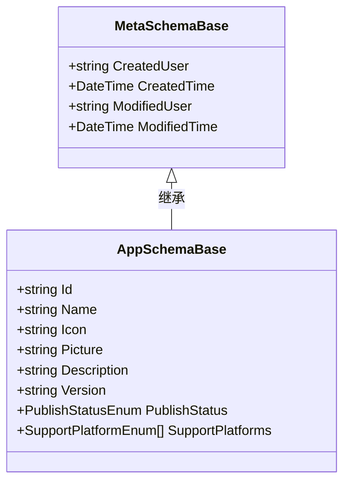
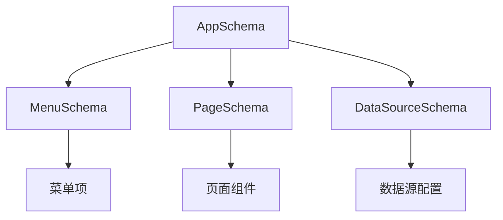

# 应用元数据结构

<cite>
**本文档引用的文件**  
- [AppSchemaBase.cs](file://src\Common\H.LowCode.MetaSchema\AppSchemaBase.cs#L4-L27)
- [MetaSchemaBase.cs](file://src\Common\H.LowCode.MetaSchema\MetaSchemaBase.cs#L5-L18)
- [PublishStatusEnum.cs](file://src\Common\H.LowCode.MetaSchema\Enums\PublishStatusEnum.cs#L5-L10)
- [SupportPlatformEnum.cs](file://src\Common\H.LowCode.MetaSchema\Enums\SupportPlatformEnum.cs#L5-L14)
- [caseapp.json](file://meta\apps\caseapp\caseapp.json)
- [testapp.json](file://meta\apps\testapp\testapp.json)
</cite>

## 目录

1. [引言](#引言)  
2. [应用元数据结构设计](#应用元数据结构设计)  
3. [核心字段详解](#核心字段详解)  
4. [枚举类型定义](#枚举类型定义)  
5. [元数据序列化实例](#元数据序列化实例)  
6. [元数据关联与使用机制](#元数据关联与使用机制)  
7. [JSON Schema 定义](#json-schema-定义)  
8. [扩展机制与自定义字段](#扩展机制与自定义字段)

## 引言

应用元数据（AppSchema）是低代码平台中用于描述一个应用基本属性和配置的核心数据结构。它不仅定义了应用的标识、名称、描述等基本信息，还包含了发布状态、支持平台等关键控制属性。本文档将深入分析 `AppSchemaBase` 类的设计与实现，结合实际 JSON 实例，说明其在设计引擎与渲染引擎中的流转机制，并提供完整的 JSON Schema 以支持扩展。

## 应用元数据结构设计

应用元数据结构基于面向对象的继承模型构建，核心类为 `AppSchemaBase`，继承自 `MetaSchemaBase`，后者进一步继承自 `StateHasChangeSchema`。该设计实现了元数据的通用属性（如创建/修改时间）与业务属性的分离，增强了可维护性与可扩展性。



**图示来源**  
- [AppSchemaBase.cs](file://src\Common\H.LowCode.MetaSchema\AppSchemaBase.cs#L4-L27)
- [MetaSchemaBase.cs](file://src\Common\H.LowCode.MetaSchema\MetaSchemaBase.cs#L5-L18)

**本节来源**  
- [AppSchemaBase.cs](file://src\Common\H.LowCode.MetaSchema\AppSchemaBase.cs#L4-L27)
- [MetaSchemaBase.cs](file://src\Common\H.LowCode.MetaSchema\MetaSchemaBase.cs#L5-L18)

## 核心字段详解

`AppSchemaBase` 类定义了应用元数据的核心字段，各字段用途及约束如下：

- **Id**: 应用唯一标识符，用于系统内引用，不可为空。
- **Name (n)**: 应用名称，JSON 序列化时使用简写 `"n"`，提升传输效率。
- **Icon**: 应用图标路径或标识。
- **Picture (pic)**: 应用封面图，序列化为 `"pic"`。
- **Description (desc)**: 应用描述信息，序列化为 `"desc"`。
- **Version (v)**: 应用版本号，序列化为 `"v"`。
- **PublishStatus (pub)**: 发布状态，枚举类型 `PublishStatusEnum`，序列化为 `"pub"`。
- **SupportPlatforms (platform)**: 支持平台数组，枚举类型 `SupportPlatformEnum[]`，默认值为 `[0]`（即 Web 平台），序列化为 `"platform"`。

所有字段均通过 `[JsonPropertyName]` 特性进行序列化别名映射，确保 JSON 输出紧凑且语义清晰。

**本节来源**  
- [AppSchemaBase.cs](file://src\Common\H.LowCode.MetaSchema\AppSchemaBase.cs#L4-L27)

## 枚举类型定义

### 发布状态（PublishStatusEnum）

定义应用的生命周期状态：

```csharp
public enum PublishStatusEnum
{
    Development,   // 开发中
    Approving,     // 审核中
    Published      // 已发布
}
```

该枚举用于控制应用的可见性与访问权限，是发布流程的核心状态机。

### 支持平台（SupportPlatformEnum）

定义应用支持的运行平台：

```csharp
public enum SupportPlatformEnum
{
    [Display(Name = "Web")]
    Web,
    [Display(Name = "App")]
    Mobile,
    [Display(Name = "小程序")]
    WXMiniApp
}
```

通过 `[Display]` 特性提供中文友好名称，支持多端适配。数组形式允许一个应用同时发布到多个平台。

**本节来源**  
- [PublishStatusEnum.cs](file://src\Common\H.LowCode.MetaSchema\Enums\PublishStatusEnum.cs#L5-L10)
- [SupportPlatformEnum.cs](file://src\Common\H.LowCode.MetaSchema\Enums\SupportPlatformEnum.cs#L5-L14)

## 元数据序列化实例

在 `meta/apps` 目录下，每个应用对应一个 JSON 文件，存储其元数据。以下是两个实例：

### 用例系统（caseapp.json）

```json
{
  "id": "caseapp",
  "n": "用例系统",
  "desc": "展示典型页面案例 (参考 amis 示例)",
  "platform": [0, 2],
  "mt": "2025-05-29T16:49:31.1628431Z"
}
```

- `platform: [0, 2]` 表示支持 Web 和 小程序。
- `mt` 字段来自 `MetaSchemaBase`，表示最后修改时间。

### 测试系统（testapp.json）

```json
{
  "id": "testapp",
  "n": "测试系统",
  "desc": "测试组件、页面不同设计场景",
  "platform": [0],
  "mt": "2025-05-29T16:43:23.7831823Z"
}
```

- `platform: [0]` 表示仅支持 Web 平台。

这些 JSON 文件由设计引擎在用户操作时写入，渲染引擎在加载应用时读取，实现元数据的持久化与共享。

**本节来源**  
- [caseapp.json](file://meta\apps\caseapp\caseapp.json)
- [testapp.json](file://meta\apps\testapp\testapp.json)

## 元数据关联与使用机制

应用元数据作为整个应用的根节点，与其他元数据对象建立关联：



- **设计引擎**：通过 `AppFileRepository` 等组件将 `AppSchemaBase` 实例序列化为 JSON 并写入文件系统。
- **渲染引擎**：通过 `AppSchema` 类（位于 `H.LowCode.MetaSchema.RenderEngine`）反序列化 JSON，构建运行时应用模型。
- **关联关系**：应用元数据通过 `Id` 作为外键，与 `menu/*.json` 和 `page/*.json` 文件关联，形成完整的应用结构树。

该机制实现了元数据的解耦与模块化管理，支持独立开发与部署。

**图示来源**  
- [AppSchemaBase.cs](file://src\Common\H.LowCode.MetaSchema\AppSchemaBase.cs#L4-L27)
- [MenuSchema.cs](file://src\Common\H.LowCode.MetaSchema\MenuSchema.cs)
- [PageSchemaBase.cs](file://src\Common\H.LowCode.MetaSchema\PageSchemaBase.cs)

**本节来源**  
- [AppSchemaBase.cs](file://src\Common\H.LowCode.MetaSchema\AppSchemaBase.cs#L4-L27)

## JSON Schema 定义

以下是应用元数据的 JSON Schema 定义，可用于校验与生成：

```json
{
  "$schema": "https://json-schema.org/draft/2020-12/schema",
  "title": "应用元数据",
  "type": "object",
  "properties": {
    "id": { "type": "string" },
    "n": { "type": "string" },
    "desc": { "type": "string" },
    "v": { "type": "string" },
    "pub": { "type": "integer", "enum": [0, 1, 2] },
    "platform": {
      "type": "array",
      "items": { "type": "integer", "enum": [0, 1, 2] },
      "default": [0]
    },
    "mt": { "type": "string", "format": "date-time" }
  },
  "required": ["id", "n"]
}
```

## 扩展机制与自定义字段

平台支持通过以下方式扩展应用元数据：

1. **继承扩展**：创建 `AppSchemaBase` 的子类，添加自定义属性。
2. **配置文件扩展**：在 JSON 文件中直接添加新字段（如 `"customField": "value"`），反序列化时保留。
3. **API 扩展**：通过 `MetaOption` 配置元数据结构，动态注入字段。

例如，添加“开发者团队”字段：

```json
{
  "id": "testapp",
  "n": "测试系统",
  "team": "前端团队"
}
```

系统在反序列化时将保留 `team` 字段，可在渲染引擎中通过动态属性访问。

**本节来源**  
- [AppSchemaBase.cs](file://src\Common\H.LowCode.MetaSchema\AppSchemaBase.cs#L4-L27)
- [MetaOption.cs](file://src\Common\H.LowCode.Configuration\Options\MetaOption.cs)