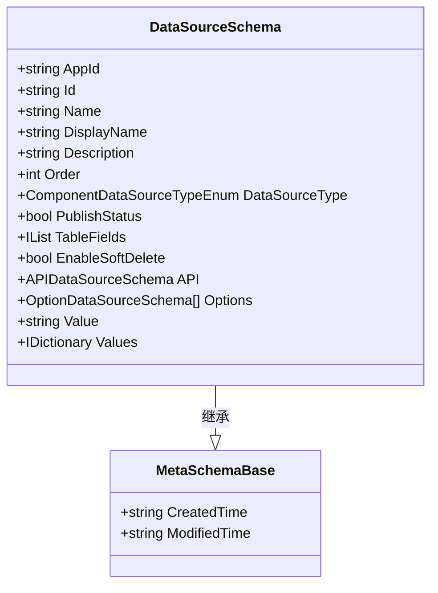
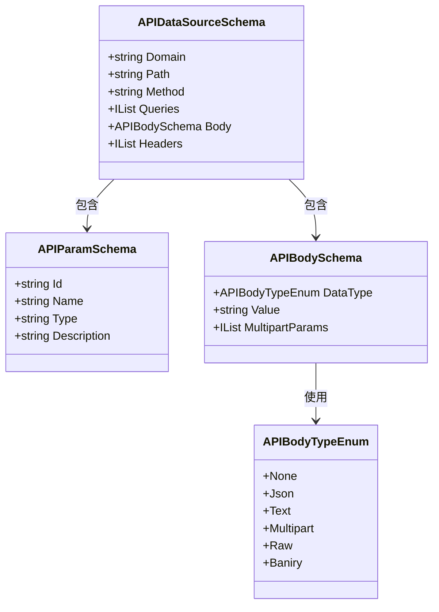
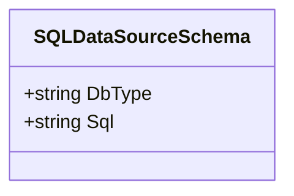
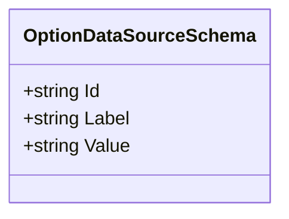
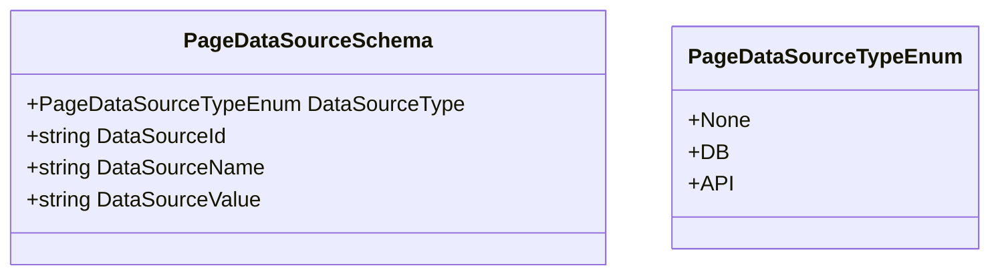
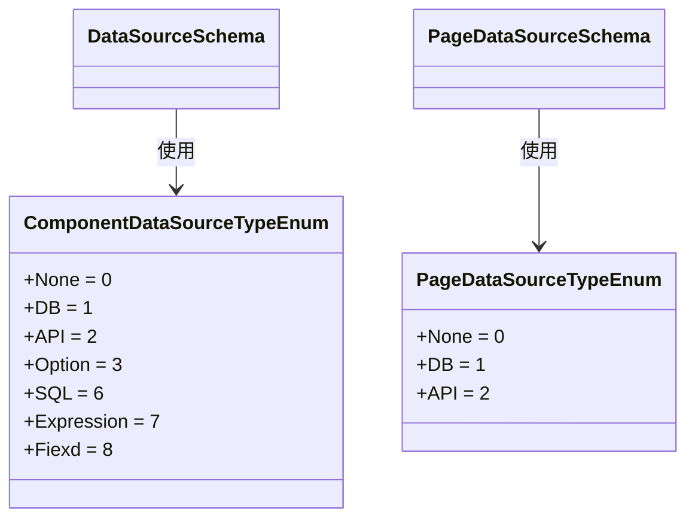
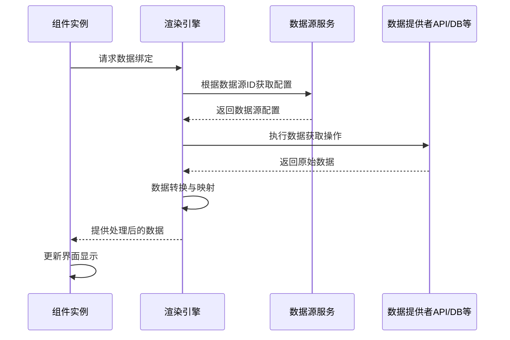

# 数据源元数据结构

<cite>
**本文档引用的文件**  
- [APIDataSourceSchema.cs](file://src/Common/H.LowCode.MetaSchema/DataSourceSchemas/APIDataSourceSchema.cs)
- [SQLDataSourceSchema.cs](file://src/Common/H.LowCode.MetaSchema/DataSourceSchemas/SQLDataSourceSchema.cs)
- [OptionDataSourceSchema.cs](file://src/Common/H.LowCode.MetaSchema/DataSourceSchemas/OptionDataSourceSchema.cs)
- [PageDataSourceSchema.cs](file://src/Common/H.LowCode.MetaSchema/DataSourceSchemas/PageDataSourceSchema.cs)
- [DataSourceSchema.cs](file://src/Common/H.LowCode.MetaSchema/DataSourceSchema.cs)
- [ComponentDataSourceTypeEnum.cs](file://src/Common/H.LowCode.MetaSchema/Enums/ComponentDataSourceTypeEnum.cs)
- [PageDataSourceTypeEnum.cs](file://src/Common/H.LowCode.MetaSchema/Enums/PageDataSourceTypeEnum.cs)
- [iumn5yg5t.json](file://meta/apps/caseapp/datasource/iumn5yg5t.json)
- [qgzhc7w3z.json](file://meta/apps/caseapp/datasource/qgzhc7w3z.json)
- [rsdjkqjz.json](file://meta/apps/caseapp/datasource/rsdjkqjz.json)
- [s4sd6rvm.json](file://meta/apps/caseapp/datasource/s4sd6rvm.json)
</cite>

## 目录
1. [引言](#引言)
2. [数据源基类结构](#数据源基类结构)
3. [API接口数据源](#api接口数据源)
4. [数据库查询数据源](#数据库查询数据源)
5. [静态选项数据源](#静态选项数据源)
6. [页面间传参数据源](#页面间传参数据源)
7. [数据源类型枚举](#数据源类型枚举)
8. [实际数据源配置示例](#实际数据源配置示例)
9. [数据源在组件属性绑定中的作用](#数据源在组件属性绑定中的作用)

## 引言
本文档系统性地描述了低代码平台中各类数据源元数据的结构与使用场景。通过分析代码定义和实际配置文件，详细解析了API接口数据源、数据库查询数据源、静态选项数据源和页面间传参数据源的字段定义与配置方式。同时说明了数据源基类提供的通用属性，以及数据源在组件属性绑定中的作用机制和运行时解析流程。

## 数据源基类结构

`DataSourceSchema` 类是所有数据源类型的基类，继承自 `MetaSchemaBase`，定义了数据源的通用属性。这些属性为所有类型的数据源提供了统一的结构框架。



**图示来源**  
- [DataSourceSchema.cs](file://src/Common/H.LowCode.MetaSchema/DataSourceSchema.cs#L10-L69)

**本节来源**  
- [DataSourceSchema.cs](file://src/Common/H.LowCode.MetaSchema/DataSourceSchema.cs#L10-L69)

### 通用属性说明
- **AppId**: 应用ID，标识数据源所属的应用
- **Id**: 数据源唯一标识符，由系统生成
- **Name**: 数据源名称，用于内部引用
- **DisplayName**: 数据源显示名称，用于界面展示
- **Description**: 描述信息
- **Order**: 排序序号
- **DataSourceType**: 数据源类型，通过 `ComponentDataSourceTypeEnum` 枚举定义
- **PublishStatus**: 发布状态，标识数据源是否已发布

### 特定类型字段
基类通过条件编译区域（#region）组织不同类型数据源的特定字段：
- **Table类型**: 包含 `TableFields` 字段列表和 `EnableSoftDelete` 软删除标志
- **API类型**: 包含 `API` 属性，指向 `APIDataSourceSchema` 对象
- **Option类型**: 包含 `Options` 选项数组、`Value` 默认值和 `Values` 字典值

## API接口数据源

`APIDataSourceSchema` 类定义了API接口数据源的结构，用于配置对外部API的调用。



**图示来源**  
- [APIDataSourceSchema.cs](file://src/Common/H.LowCode.MetaSchema/DataSourceSchemas/APIDataSourceSchema.cs#L10-L64)

**本节来源**  
- [APIDataSourceSchema.cs](file://src/Common/H.LowCode.MetaSchema/DataSourceSchemas/APIDataSourceSchema.cs#L10-L64)

### 字段定义
- **Domain**: API域名
- **Path**: 请求路径
- **Method**: HTTP方法（GET、POST等）
- **Queries**: 查询参数列表，每个参数包含ID、名称、类型和描述
- **Body**: 请求体配置，包含数据类型、值和多部分参数
- **Headers**: 请求头列表

### 请求体类型
`APIBodyTypeEnum` 枚举定义了请求体的数据类型：
- **None**: 无请求体
- **Json**: JSON格式
- **Text**: 纯文本
- **Multipart**: 多部分表单
- **Raw**: 原始数据
- **Baniry**: 二进制数据

## 数据库查询数据源

`SQLDataSourceSchema` 类定义了数据库查询数据源的结构，用于配置直接的SQL查询。



**图示来源**  
- [SQLDataSourceSchema.cs](file://src/Common/H.LowCode.MetaSchema/DataSourceSchemas/SQLDataSourceSchema.cs#L10-L28)

**本节来源**  
- [SQLDataSourceSchema.cs](file://src/Common/H.LowCode.MetaSchema/DataSourceSchemas/SQLDataSourceSchema.cs#L10-L28)

### 字段定义
- **DbType**: 数据库类型，标识目标数据库的种类
- **Sql**: SQL查询语句，包含完整的查询逻辑

该数据源类型允许用户直接编写SQL语句来获取数据，适用于复杂的查询场景或需要直接操作数据库的情况。

## 静态选项数据源

`OptionDataSourceSchema` 类定义了静态选项数据源的结构，用于配置下拉框、单选按钮等组件的选项列表。



**图示来源**  
- [OptionDataSourceSchema.cs](file://src/Common/H.LowCode.MetaSchema/DataSourceSchemas/OptionDataSourceSchema.cs#L10-L31)

**本节来源**  
- [OptionDataSourceSchema.cs](file://src/Common/H.LowCode.MetaSchema/DataSourceSchemas/OptionDataSourceSchema.cs#L10-L31)

### 字段定义
- **Id**: 选项唯一标识符，由系统自动生成
- **Label**: 显示标签，用户界面中可见的文本
- **Value**: 实际值，组件绑定和数据处理时使用的值

静态选项数据源通常用于配置具有固定选项的组件，如状态选择、类型选择等，提供了一种简单的方式来定义预设值列表。

## 页面间传参数据源

`PageDataSourceSchema` 类定义了页面间传参数据源的结构，用于处理页面导航时的参数传递。



**图示来源**  
- [PageDataSourceSchema.cs](file://src/Common/H.LowCode.MetaSchema/DataSourceSchemas/PageDataSourceSchema.cs#L10-L32)
- [PageDataSourceTypeEnum.cs](file://src/Common/H.LowCode.MetaSchema/Enums/PageDataSourceTypeEnum.cs#L10-L27)

**本节来源**  
- [PageDataSourceSchema.cs](file://src/Common/H.LowCode.MetaSchema/DataSourceSchemas/PageDataSourceSchema.cs#L10-L32)
- [PageDataSourceTypeEnum.cs](file://src/Common/H.LowCode.MetaSchema/Enums/PageDataSourceTypeEnum.cs#L10-L27)

### 字段定义
- **DataSourceType**: 传参数据源类型，通过 `PageDataSourceTypeEnum` 枚举定义
- **DataSourceId**: 数据源ID，标识参数来源
- **DataSourceName**: 数据源名称
- **DataSourceValue**: 参数值表达式或直接值

页面间传参数据源在页面跳转时起着关键作用，允许将当前页面的数据作为参数传递给目标页面，实现页面间的数据流动和状态传递。

## 数据源类型枚举

系统定义了两个主要的枚举类型来管理数据源的分类：`ComponentDataSourceTypeEnum` 和 `PageDataSourceTypeEnum`。



**图示来源**  
- [ComponentDataSourceTypeEnum.cs](file://src/Common/H.LowCode.MetaSchema/Enums/ComponentDataSourceTypeEnum.cs#L10-L20)
- [PageDataSourceTypeEnum.cs](file://src/Common/H.LowCode.MetaSchema/Enums/PageDataSourceTypeEnum.cs#L10-L17)

**本节来源**  
- [ComponentDataSourceTypeEnum.cs](file://src/Common/H.LowCode.MetaSchema/Enums/ComponentDataSourceTypeEnum.cs#L10-L20)
- [PageDataSourceTypeEnum.cs](file://src/Common/H.LowCode.MetaSchema/Enums/PageDataSourceTypeEnum.cs#L10-L17)

### 组件数据源类型
`ComponentDataSourceTypeEnum` 定义了组件可以使用的数据源类型：
- **None**: 无数据源
- **DB**: 数据库表数据源
- **API**: API接口数据源
- **Option**: 静态选项数据源
- **SQL**: SQL查询数据源
- **Expression**: 表达式数据源
- **Fiexd**: 固定值数据源

### 页面数据源类型
`PageDataSourceTypeEnum` 定义了页面间传参可用的数据源类型：
- **None**: 无传参
- **DB**: 数据库数据
- **API**: API接口数据

这两个枚举类型为系统提供了类型安全的机制，确保数据源的正确使用和配置。

## 实际数据源配置示例

通过分析 `meta/apps/caseapp/datasource/` 目录下的实际JSON配置文件，我们可以看到数据源元数据在运行时的具体表现形式。

### API数据源配置示例
```json
{
    "aid": "caseapp",
    "id": "iumn5yg5t",
    "n": "测试 API",
    "disn": "测试 API",
    "order": 0,
    "type": 2,
    "pub": false,
    "fields": [],
    "api": {
        "p": "/test/save",
        "mth": "POST",
        "prs": [],
        "hds": []
    },
    "ops": [],
    "createdTime": "0001-01-01T00:00:00",
    "modifiedTime": "2024-10-04T03:53:44.4086661Z"
}
```

**本节来源**  
- [iumn5yg5t.json](file://meta/apps/caseapp/datasource/iumn5yg5t.json)

### 数据库表数据源配置示例
```json
{
    "aid": "caseapp",
    "id": "qgzhc7w3z",
    "n": "tb_test1",
    "disn": "测试表1",
    "desc": "xxx",
    "type": 1,
    "fields": [
        {
            "id": "9080f5b9-b155-4aa2-82d9-dc7a20192c06",
            "n": "f_id",
            "disn": "主键",
            "type": "varchar",
            "pk": true
        },
        {
            "id": "b4c09312-7267-45fc-94c1-15f893d0f5ea",
            "n": "f_field1",
            "disn": "字段1",
            "type": "varchar",
            "nul": true
        }
    ],
    "ops": [],
    "modifiedTime": "2025-03-23T10:17:51.3553924Z"
}
```

**本节来源**  
- [qgzhc7w3z.json](file://meta/apps/caseapp/datasource/qgzhc7w3z.json)

### 配置分析
从实际配置文件可以看出：
1. JSON中的字段名与C#类中的 `JsonPropertyName` 属性对应
2. `type` 字段的值对应枚举的整数值（1表示DB，2表示API）
3. 不同类型的数据源只包含其相关的配置字段
4. 系统自动生成的字段如 `createdTime` 和 `modifiedTime` 用于跟踪数据源的生命周期

这些配置文件在运行时被反序列化为相应的C#对象，供渲染引擎使用。

## 数据源在组件属性绑定中的作用

数据源在低代码平台中扮演着连接数据与界面的关键角色，其运行时解析流程如下：



**图示来源**  
- [DataSourceSchema.cs](file://src/Common/H.LowCode.MetaSchema/DataSourceSchema.cs#L10-L69)
- [APIDataSourceSchema.cs](file://src/Common/H.LowCode.MetaSchema/DataSourceSchemas/APIDataSourceSchema.cs#L10-L64)
- [SQLDataSourceSchema.cs](file://src/Common/H.LowCode.MetaSchema/DataSourceSchemas/SQLDataSourceSchema.cs#L10-L28)

**本节来源**  
- [DataSourceSchema.cs](file://src/Common/H.LowCode.MetaSchema/DataSourceSchema.cs#L10-L69)
- [APIDataSourceSchema.cs](file://src/Common/H.LowCode.MetaSchema/DataSourceSchemas/APIDataSourceSchema.cs#L10-L64)
- [SQLDataSourceSchema.cs](file://src/Common/H.LowCode.MetaSchema/DataSourceSchemas/SQLDataSourceSchema.cs#L10-L28)

### 作用机制
1. **配置阶段**: 设计器中配置组件的数据源引用，选择特定的数据源实例
2. **解析阶段**: 运行时根据数据源类型和配置，确定数据获取方式
3. **执行阶段**: 调用相应的数据提供者（API客户端、数据库连接等）获取数据
4. **转换阶段**: 将原始数据转换为组件所需的格式，可能包括字段映射、数据类型转换等
5. **绑定阶段**: 将处理后的数据绑定到组件属性，触发界面更新

### 缓存策略
虽然在当前代码分析中未明确看到缓存配置字段，但系统可能在服务层实现缓存机制：
- 对于API数据源，可能根据请求参数缓存响应结果
- 对于数据库查询，可能缓存查询结果以提高性能
- 静态选项数据源通常会被长期缓存，因为其数据不经常变化

数据源机制为低代码平台提供了灵活的数据集成能力，使得非技术人员也能轻松配置复杂的数据交互逻辑。