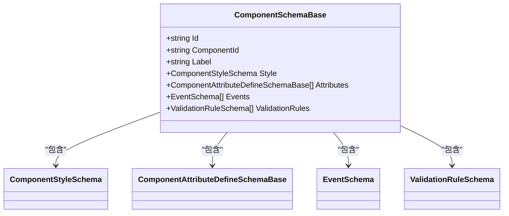

# 组件元数据结构

<cite>
**本文档引用文件**  
- [ComponentAttributeDefineSchemaBase.cs](file://src/Common/H.LowCode.MetaSchema/PropertySchemas/ComponentAttributeDefineSchemaBase.cs)
- [ComponentStyleSchema.cs](file://src/Common/H.LowCode.MetaSchema/PropertySchemas/ComponentStyleSchema.cs)
- [EventSchema.cs](file://src/Common/H.LowCode.MetaSchema/PropertySchemas/EventSchema.cs)
- [ValidationRuleSchema.cs](file://src/Common/H.LowCode.MetaSchema/PropertySchemas/ValidationRuleSchema.cs)
- [ComponentFragmentSchemaBase.cs](file://src/Common/H.LowCode.MetaSchema/PropertySchemas/ComponentFragmentSchemaBase.cs)
- [ComponentValueTypeEnum.cs](file://src/Common/H.LowCode.MetaSchema/Enums/ComponentValueTypeEnum.cs)
- [52391a70.json](file://meta/parts/componentParts/antdesign/52391a70.json)
- [5icgyefr.json](file://meta/parts/componentParts/antdesign/5icgyefr.json)
- [6d997568.json](file://meta/parts/componentParts/antdesign/6d997568.json)
- [7bab5a19.json](file://meta/parts/componentParts/antdesign/7bab5a19.json)
- [antdesign.json](file://meta/parts/componentParts/antdesign/antdesign.json)
</cite>

## 目录
1. [引言](#引言)  
2. [组件元数据整体结构](#组件元数据整体结构)  
3. [组件属性定义](#组件属性定义)  
4. [组件样式配置](#组件样式配置)  
5. [事件绑定机制](#事件绑定机制)  
6. [验证规则配置](#验证规则配置)  
7. [组件片段结构](#组件片段结构)  
8. [实际应用示例](#实际应用示例)  
9. [高级功能实现](#高级功能实现)  
10. [总结](#总结)

## 引言

本文档旨在全面解析低代码平台中组件元数据（ComponentSchema）的组成结构与配置机制。通过分析核心代码与实际JSON定义文件，深入探讨组件ID、类型、属性、样式、事件和验证规则的设计原理，并展示如何通过元数据实现动态表单、条件渲染等高级功能。

## 组件元数据整体结构

组件元数据以 `ComponentSchemaBase` 为核心基类，定义了组件的基本结构，包括组件ID、类型、标签、样式、属性定义、事件绑定等。该结构支持通过元数据驱动的方式动态生成UI组件，实现可视化配置。



**图示来源**  
- [ComponentSchemaBase.cs](file://src/Common/H.LowCode.MetaSchema/ComponentSchemaBase.cs)

**中文来源**  
- [ComponentSchemaBase.cs](file://src/Common/H.LowCode.MetaSchema/ComponentSchemaBase.cs)

## 组件属性定义

组件属性通过 `ComponentAttributeDefineSchemaBase` 类进行定义，包含属性名称、CLR类型和属性值三个核心字段。

### 属性结构说明

- **AttributeName (attrn)**：组件属性名称，必须与实际组件中的属性名一致。
- **AttributeClrType (attrt)**：属性值的CLR类型，如 `System.String`、`System.Boolean`。
- **AttributeValue (attrv)**：属性的实际值，支持多种数据类型。

```csharp
public abstract class ComponentAttributeDefineSchemaBase
{
    [JsonPropertyName("attrn")]
    public string AttributeName { get; set; }

    [JsonPropertyName("attrt")]
    public string AttributeClrType { get; set; }

    [JsonPropertyName("attrv")]
    public object AttributeValue { get; set; }
}
```

### 属性分组与默认值

在antdesign组件库中，属性可按功能分组（`attrdefgroups`），并设置默认值（`dftval`）。例如，Input组件的“基础属性”组包含禁用、最大长度、提示文本等。

```json
"attrdefgroups": [
  {
    "gn": "基础属性",
    "attrdefs": [
      {
        "disn": "是否禁用",
        "dftval": false,
        "attrn": "Disabled",
        "attrt": "System.Boolean"
      },
      {
        "disn": "最大长度",
        "dftval": 0,
        "attrn": "MaxLength",
        "attrt": "System.Int32"
      }
    ]
  }
]
```

**中文来源**  
- [ComponentAttributeDefineSchemaBase.cs](file://src/Common/H.LowCode.MetaSchema/PropertySchemas/ComponentAttributeDefineSchemaBase.cs)
- [52391a70.json](file://meta/parts/componentParts/antdesign/52391a70.json)

## 组件样式配置

组件样式由 `ComponentStyleSchema` 类定义，控制组件在页面中的布局与外观。

### 样式字段说明

- **ItemWidth (itemw)**：组件宽度，取值4-24，对应24列栅格系统。
- **ItemHeight (itemh)**：组件高度，单位为像素。
- **LabelWidth (labelw)**：标签宽度，默认180px。
- **DefaultStyle (dfstl)**：默认CSS样式。
- **CustomStyle (ctstl)**：自定义CSS样式。

```csharp
public class ComponentStyleSchema
{
    [JsonPropertyName("itemw")]
    public double ItemWidth { get; set; } = 4;

    [JsonPropertyName("itemh")]
    public double ItemHeight { get; set; } = 85;

    [JsonPropertyName("labelw")]
    public double LabelWidth { get; set; } = 180;

    [JsonPropertyName("dfstl")]
    public string DefaultStyle { get; set; }

    [JsonPropertyName("ctstl")]
    public string CustomStyle { get; set; }
}
```

例如，Layout组件设置 `itemw: 24` 表示占满整行宽度。

**中文来源**  
- [ComponentStyleSchema.cs](file://src/Common/H.LowCode.MetaSchema/PropertySchemas/ComponentStyleSchema.cs)
- [6d997568.json](file://meta/parts/componentParts/antdesign/6d997568.json)

## 事件绑定机制

事件通过 `EventSchema` 类进行配置，支持标准事件和自定义脚本两种模式。

### 事件结构说明

- **EventName (en)**：触发的事件名称，如 `OnClick`。
- **EventHandlerType (eht)**：事件处理器类型，枚举 `EventTargetTypeEnum`。
- **EventTargetId (etid)**：目标组件或页面ID。
- **EventTargetAction (eta)**：目标动作，如跳转、刷新。
- **EventCustomScript (ecs)**：自定义脚本内容。

```csharp
public class EventSchema
{
    [JsonPropertyName("en")]
    public string EventName { get; set; }

    [JsonPropertyName("eht")]
    public EventTargetTypeEnum EventHandlerType { get; set; }

    [JsonPropertyName("etid")]
    public string EventTargetId { get; set; }

    [JsonPropertyName("eta")]
    public string EventTargetAction { get; set; }

    [JsonPropertyName("ecs")]
    public string EventCustomScript { get; set; }

    public IDictionary<string, string> EventArgs { get; set; }
}
```

DatePicker组件支持 `OnClick` 和 `OnExpand` 事件。

**中文来源**  
- [EventSchema.cs](file://src/Common/H.LowCode.MetaSchema/PropertySchemas/EventSchema.cs)
- [7bab5a19.json](file://meta/parts/componentParts/antdesign/7bab5a19.json)

## 验证规则配置

验证规则通过 `ValidationRuleSchema` 类定义，用于表单组件的数据校验。

### 验证规则字段

- **Id**：规则唯一标识。
- **ComponentId**：关联的组件ID。
- **Expression**：验证表达式，如正则或逻辑条件。

```csharp
public class ValidationRuleSchema
{
    public string Id { get; set; }
    public string ComponentId { get; set; }
    public string Expression { get; set; }
}
```

该结构支持动态构建验证逻辑，适用于复杂表单场景。

**中文来源**  
- [ValidationRuleSchema.cs](file://src/Common/H.LowCode.MetaSchema/PropertySchemas/ValidationRuleSchema.cs)

## 组件片段结构

复杂组件通过 `ComponentFragmentSchemaBase` 定义其内部结构片段，支持嵌套子组件。

### 片段字段说明

- **TypeName (t)**：组件类型名。
- **ValueType (valt)**：值类型，如 `System.String`。
- **Attributes (attrs)**：片段属性数组。
- **Content (content)**：内容模板，如 `$(DropItemContainer)` 表示可拖拽区域。

```csharp
public abstract class ComponentFragmentSchemaBase
{
    [JsonPropertyName("t")]
    public virtual string TypeName { get; set; }

    [JsonPropertyName("valt")]
    public string ValueType { get; set; }

    [JsonPropertyName("attrs")]
    public ComponentAttributeFragmentSchema[] Attributes { get; set; }

    [JsonPropertyName("content")]
    public string Content { get; set; }
}
```

Layout组件包含 `Sider` 和 `Content` 两个子片段，构成左右布局。

```json
"frag": {
  "childs": [
    {
      "dt": "AntDesign.Sider, AntDesign",
      "attrs": [ ... ],
      "content": "$(DropItemContainer)"
    },
    {
      "dt": "AntDesign.Content, AntDesign",
      "attrs": [ ... ],
      "content": "$(DropItemContainer)"
    }
  ]
}
```

**中文来源**  
- [ComponentFragmentSchemaBase.cs](file://src/Common/H.LowCode.MetaSchema/PropertySchemas/ComponentFragmentSchemaBase.cs)
- [6d997568.json](file://meta/parts/componentParts/antdesign/6d997568.json)

## 实际应用示例

### Input组件配置解析

```json
{
  "cn": "Input",
  "lb": "输入框-A",
  "stl": { "itemh": 85, "labelw": 180 },
  "attrdefgroups": [
    {
      "gn": "基础属性",
      "attrdefs": [
        { "disn": "是否禁用", "dftval": false, "attrn": "Disabled" },
        { "disn": "最大长度", "dftval": 0, "attrn": "MaxLength" }
      ]
    }
  ]
}
```

此配置定义了一个输入框组件，包含基础属性分组，支持禁用状态和长度限制。

### TextArea组件简化配置

```json
{
  "cn": "TextArea",
  "lb": "文本框-A",
  "stl": { "itemh": 85, "labelw": 180 }
}
```

该组件无额外属性定义，使用默认行为。

**中文来源**  
- [52391a70.json](file://meta/parts/componentParts/antdesign/52391a70.json)
- [5icgyefr.json](file://meta/parts/componentParts/antdesign/5icgyefr.json)

## 高级功能实现

### 动态表单生成

通过读取组件元数据中的 `Attributes` 和 `ValidationRules`，可动态生成表单字段及其校验逻辑。例如，遍历所有属性定义，根据 `ComponentValueTypeEnum` 渲染对应输入控件。

### 条件渲染

结合事件绑定与状态管理，可实现条件渲染。例如，当某组件的 `Visible` 属性绑定到另一组件的值变化事件时，可动态显示/隐藏该组件。

### 数据类型支持

`ComponentValueTypeEnum` 枚举定义了丰富的数据类型，支持字符串、数字、布尔、日期、数组、树形结构等，满足多样化数据处理需求。

```csharp
public enum ComponentValueTypeEnum
{
    String = 1,
    Integer = 6,
    Boolean = 13,
    Date = 18,
    Array = 25,
    Tree = 42
}
```

**中文来源**  
- [ComponentValueTypeEnum.cs](file://src/Common/H.LowCode.MetaSchema/Enums/ComponentValueTypeEnum.cs)

## 总结

组件元数据结构是低代码平台的核心，通过标准化的JSON Schema定义组件的行为与外观。`ComponentSchemaBase` 及其相关类提供了灵活的扩展机制，支持属性、样式、事件、验证等多维度配置。结合antdesign组件库的实际定义，展示了如何通过元数据驱动UI生成，实现高效、可维护的可视化开发体验。