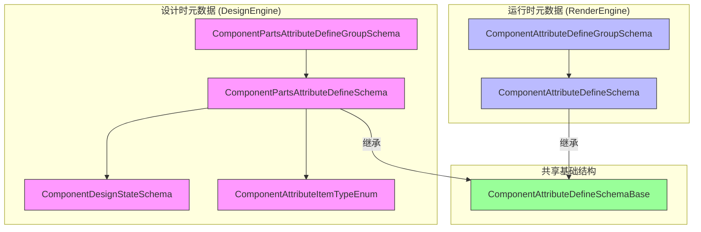
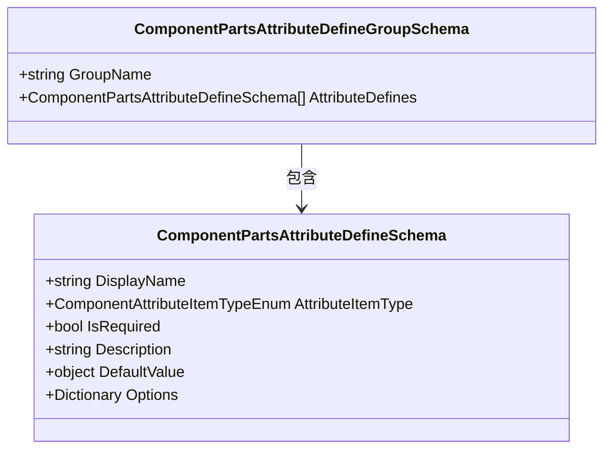
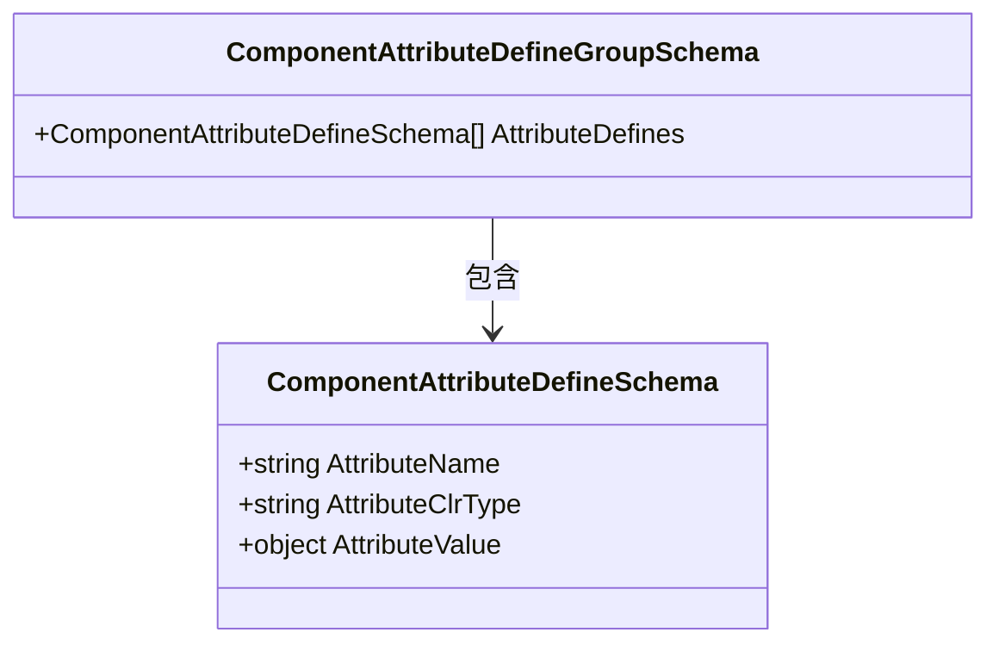
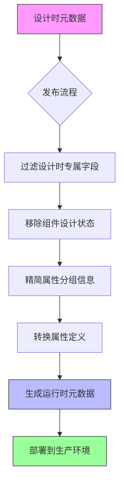

# 设计时与运行时元数据对比

<cite>
**本文档引用文件**   
- [ComponentPartsAttributeDefineSchema.cs](file://src/Common/H.LowCode.MetaSchema.DesignEngine/PropertySchemas/ComponentPartsAttributeDefineSchema.cs)
- [ComponentAttributeDefineSchema.cs](file://src/Common/H.LowCode.MetaSchema.RenderEngine/PropertySchemas/ComponentAttributeDefineSchema.cs)
- [ComponentAttributeDefineSchemaBase.cs](file://src/Common/H.LowCode.MetaSchema/PropertySchemas/ComponentAttributeDefineSchemaBase.cs)
- [ComponentDesignStateSchema.cs](file://src/Common/H.LowCode.MetaSchema.DesignEngine/PropertySchemas/ComponentDesignStateSchema.cs)
- [ComponentPartsAttributeDefineGroupSchema.cs](file://src/Common/H.LowCode.MetaSchema.DesignEngine/PropertySchemas/ComponentPartsAttributeDefineGroupSchema.cs)
- [ComponentAttributeDefineGroupSchema.cs](file://src/Common/H.LowCode.MetaSchema.RenderEngine/PropertySchemas/ComponentAttributeDefineGroupSchema.cs)
- [ComponentAttributeItemTypeEnum.cs](file://src/Common/H.LowCode.MetaSchema.DesignEngine/Enums/ComponentAttributeItemTypeEnum.cs)
- [52391a70.json](file://meta/parts/componentParts/antdesign/52391a70.json)
- [antdesign.json](file://meta/parts/componentParts/antdesign/antdesign.json)
- [MetaSchemaBase.cs](file://src/Common/H.LowCode.MetaSchema/MetaSchemaBase.cs)
- [DataSourceSchema.cs](file://src/Common/H.LowCode.MetaSchema/DataSourceSchema.cs)
</cite>

## 目录
1. [引言](#引言)
2. [设计时与运行时元数据架构概览](#设计时与运行时元数据架构概览)
3. [组件属性定义模式对比分析](#组件属性定义模式对比分析)
4. [属性分组信息的转换机制](#属性分组信息的转换机制)
5. [组件设计状态模式的作用分析](#组件设计状态模式的作用分析)
6. [antdesign组件元数据转换实例](#antdesign组件元数据转换实例)
7. [元数据转换流程与性能优势](#元数据转换流程与性能优势)
8. [结论](#结论)

## 引言
本文档深入分析低代码平台中设计时元数据（DesignEngine.MetaSchema）与运行时元数据（RenderEngine.MetaSchema）的差异与转换机制。重点探讨从可视化设计环境到生产运行环境的元数据精简过程，特别是组件属性定义、属性分组和设计状态等关键元数据的处理方式。通过对比分析相关类结构和实际元数据文件，揭示这种分离架构在性能优化和维护性方面的优势。

## 设计时与运行时元数据架构概览



**图示来源**
- [ComponentPartsAttributeDefineSchema.cs](file://src/Common/H.LowCode.MetaSchema.DesignEngine/PropertySchemas/ComponentPartsAttributeDefineSchema.cs)
- [ComponentAttributeDefineSchema.cs](file://src/Common/H.LowCode.MetaSchema.RenderEngine/PropertySchemas/ComponentAttributeDefineSchema.cs)
- [ComponentAttributeDefineSchemaBase.cs](file://src/Common/H.LowCode.MetaSchema/PropertySchemas/ComponentAttributeDefineSchemaBase.cs)
- [ComponentPartsAttributeDefineGroupSchema.cs](file://src/Common/H.LowCode.MetaSchema.DesignEngine/PropertySchemas/ComponentPartsAttributeDefineGroupSchema.cs)
- [ComponentAttributeDefineGroupSchema.cs](file://src/Common/H.LowCode.MetaSchema.RenderEngine/PropertySchemas/ComponentAttributeDefineGroupSchema.cs)

## 组件属性定义模式对比分析

设计时组件属性定义（ComponentPartsAttributeDefineSchema）与运行时组件属性定义（ComponentAttributeDefineSchema）均继承自同一个基类 ComponentAttributeDefineSchemaBase，但具有显著差异。

### 基础结构分析

```mermaid
classDiagram
class ComponentAttributeDefineSchemaBase {
+string AttributeName
+string AttributeClrType
+object AttributeValue
}
class ComponentPartsAttributeDefineSchema {
+string DisplayName
+ComponentAttributeItemTypeEnum AttributeItemType
+bool IsRequired
+string Description
+object DefaultValue
+Dictionary<string, object> Options
+string StringValue
+int IntValue
+bool BoolValue
}
class ComponentAttributeDefineSchema {
}
ComponentPartsAttributeDefineSchema --|> ComponentAttributeDefineSchemaBase : 继承
ComponentAttributeDefineSchema --|> ComponentAttributeDefineSchemaBase : 继承
note right of ComponentPartsAttributeDefineSchema
设计时专属字段：
- DisplayName : 属性显示名称
- AttributeItemType : 属性控件类型
- IsRequired : 是否必填
- Description : 描述信息
- DefaultValue : 默认值
- Options : 选项配置
- StringValue/IntValue/BoolValue : 类型安全的值访问器
end
note right of ComponentAttributeDefineSchema
运行时仅保留基础属性：
- AttributeName : 属性名称
- AttributeClrType : CLR类型
- AttributeValue : 属性值
end
```

**图示来源**
- [ComponentAttributeDefineSchemaBase.cs](file://src/Common/H.LowCode.MetaSchema/PropertySchemas/ComponentAttributeDefineSchemaBase.cs#L9-L29)
- [ComponentPartsAttributeDefineSchema.cs](file://src/Common/H.LowCode.MetaSchema.DesignEngine/PropertySchemas/ComponentPartsAttributeDefineSchema.cs#L11-L75)
- [ComponentAttributeDefineSchema.cs](file://src/Common/H.LowCode.MetaSchema.RenderEngine/PropertySchemas/ComponentAttributeDefineSchema.cs#L9-L12)

### 设计时专属字段说明

设计时元数据包含多个专为可视化编辑器设计的字段：

- **DisplayName**: 属性的显示名称，用于在属性面板中展示
- **AttributeItemType**: 属性控件类型，决定属性编辑器的渲染方式
- **IsRequired**: 标识属性是否为必填项
- **Description**: 属性描述信息，提供使用指导
- **DefaultValue**: 属性默认值，用于新组件实例化
- **Options**: 属性选项配置，用于下拉框、单选框等控件
- **StringValue/IntValue/BoolValue**: 类型安全的值访问器，简化属性值操作

这些字段在运行时环境中均被过滤，仅保留最基础的属性定义信息。

**中文标签结构**
- :DisplayName: 显示名称
- :AttributeItemType: 属性项目类型
- :IsRequired: 是否必填
- :Description: 描述
- :DefaultValue: 默认值
- :Options: 选项
- :StringValue: 字符串值
- :IntValue: 整数值
- :BoolValue: 布尔值

## 属性分组信息的转换机制

设计时和运行时对属性分组的处理方式也存在明显差异。

### 设计时属性分组



**图示来源**
- [ComponentPartsAttributeDefineGroupSchema.cs](file://src/Common/H.LowCode.MetaSchema.DesignEngine/PropertySchemas/ComponentPartsAttributeDefineGroupSchema.cs#L9-L18)

设计时属性分组（ComponentPartsAttributeDefineGroupSchema）包含：
- **GroupName**: 分组名称，如"基础属性"、"样式设置"等
- **AttributeDefines**: 设计时属性定义数组，包含完整的属性元数据

### 运行时属性分组



**图示来源**
- [ComponentAttributeDefineGroupSchema.cs](file://src/Common/H.LowCode.MetaSchema.RenderEngine/PropertySchemas/ComponentAttributeDefineGroupSchema.cs#L9-L15)

运行时属性分组（ComponentAttributeDefineGroupSchema）仅包含：
- **AttributeDefines**: 运行时属性定义数组，仅保留基础属性信息

转换过程中，分组名称（GroupName）被完全移除，因为运行时组件不需要知道属性的分组信息。

## 组件设计状态模式的作用分析

```mermaid
classDiagram
class ComponentDesignStateSchema {
+bool IsSelected
+string DragEffectStyle
+bool IsDroppedFromComponentPanel
+string AnimationTransform
+bool IsAnimating
}
note right of ComponentDesignStateSchema
设计状态模式用于记录
可视化编辑器中的临时状态，
不需要持久化存储。
end
```

**图示来源**
- [ComponentDesignStateSchema.cs](file://src/Common/H.LowCode.MetaSchema.DesignEngine/PropertySchemas/ComponentDesignStateSchema.cs#L9-L34)

### 设计状态模式字段说明

组件设计状态模式（ComponentDesignStateSchema）包含以下字段：

- **IsSelected**: 标识组件是否被选中，用于高亮显示
- **DragEffectStyle**: 拖拽效果样式，用于视觉反馈
- **IsDroppedFromComponentPanel**: 标识是否从组件面板拖拽而来
- **AnimationTransform**: 动画变换样式，用于平滑让位动画
- **IsAnimating**: 标识是否正在进行让位动画

这些状态信息仅在设计时有效，用于支持拖拽、选择、动画等交互功能。运行时组件不需要这些信息，因此在发布过程中被完全移除。

**中文标签结构**
- :IsSelected: 是否选中
- :DragEffectStyle: 拖拽效果样式
- :IsDroppedFromComponentPanel: 是否从组件面板拖拽而来
- :AnimationTransform: 动画变换样式
- :IsAnimating: 是否正在动画

## antdesign组件元数据转换实例

以 antdesign 组件库中的 Input 组件为例，分析从设计时到运行时的元数据转换过程。

### 设计时元数据结构

```json
{
    "cn": "Input",
    "ct": 1,
    "frag": {
        "dt": "AntDesign.Input`1[System.String], AntDesign",
        "valt": "System.String",
        "attrs": [
            {
                "attrn": "TValue",
                "attrt": "System.String"
            }
        ]
    },
    "attrdefgroups": [
        {
            "gn": "基础属性",
            "attrdefs": [
                {
                    "disn": "是否禁用",
                    "pt": 6,
                    "desc": "",
                    "dftval": false,
                    "attrn": "Disabled",
                    "attrt": "System.Boolean",
                    "attrv": false
                },
                {
                    "pt": 2,
                    "disn": "最大长度",
                    "desc": "字段输入的最大长度,为0时表示不限制长度",
                    "dftval": 0,
                    "attrn": "MaxLength",
                    "attrt": "System.Int32",
                    "attrv": 0
                },
                {
                    "pt": 1,
                    "disn": "输入提示",
                    "desc": "组件输入时的 Placeholder 提示",
                    "dftval": "",
                    "attrn": "Placeholder",
                    "attrt": "System.String",
                    "attrv": ""
                }
            ]
        }
    ],
    "childs": [],
    "sptds": false,
    "order": 10,
    "pub": 1,
    "mt": "2025-02-24T15:36:15.8037414Z",
    "id": "cj8ac3m42",
    "libid": "antdesign",
    "partsId": "52391a70",
    "lb": "输入框-A",
    "container": false,
    "stl": {
        "itemh": 85,
        "labelw": 180,
        "display": "inline",
        "pos": "static"
    }
}
```

**文件来源**
- [52391a70.json](file://meta/parts/componentParts/antdesign/52391a70.json)

### 转换过程分析

在发布过程中，设计时元数据被转换为运行时元数据：

1. **属性定义转换**:
   - 移除 `disn` (显示名称)
   - 移除 `pt` (属性项目类型)
   - 移除 `desc` (描述)
   - 移除 `dftval` (默认值)
   - 保留 `attrn` (属性名称)、`attrt` (属性类型)、`attrv` (属性值)

2. **属性分组转换**:
   - 移除 `gn` (分组名称)
   - 将 `attrdefs` 中的设计时属性转换为运行时属性

3. **其他设计时信息移除**:
   - 移除组件设计状态相关信息
   - 移除拖拽、动画等交互状态

### 转换后运行时元数据结构

```json
{
    "frag": {
        "dt": "AntDesign.Input`1[System.String], AntDesign",
        "valt": "System.String",
        "attrs": [
            {
                "attrn": "TValue",
                "attrt": "System.String"
            }
        ]
    },
    "attrdefgroups": [
        {
            "attrdefs": [
                {
                    "attrn": "Disabled",
                    "attrt": "System.Boolean",
                    "attrv": false
                },
                {
                    "attrn": "MaxLength",
                    "attrt": "System.Int32",
                    "attrv": 0
                },
                {
                    "attrn": "Placeholder",
                    "attrt": "System.String",
                    "attrv": ""
                }
            ]
        }
    ],
    "pub": true,
    "id": "cj8ac3m42",
    "libid": "antdesign",
    "partsId": "52391a70"
}
```

## 元数据转换流程与性能优势



**图示来源**
- [ComponentPartsAttributeDefineSchema.cs](file://src/Common/H.LowCode.MetaSchema.DesignEngine/PropertySchemas/ComponentPartsAttributeDefineSchema.cs)
- [ComponentAttributeDefineSchema.cs](file://src/Common/H.LowCode.MetaSchema.RenderEngine/PropertySchemas/ComponentAttributeDefineSchema.cs)

### 转换机制实现

元数据转换通过以下机制实现：

1. **继承关系**: 设计时和运行时属性定义共享同一个基类，确保基础结构一致性
2. **字段过滤**: 发布过程中仅序列化运行时需要的字段
3. **类型映射**: 设计时属性数组转换为运行时属性数组
4. **JSON序列化控制**: 使用 `JsonIgnore` 属性标记设计时专属字段

### 性能与维护性优势

这种分离架构带来以下优势：

- **性能优化**: 运行时元数据体积显著减小，减少网络传输和内存占用
- **安全性**: 移除设计时敏感信息，降低安全风险
- **维护性**: 设计时和运行时关注点分离，便于独立演进
- **加载速度**: 精简的元数据结构提升页面加载速度
- **可扩展性**: 设计时可以添加丰富的元数据而不影响运行时性能

## 结论

本文档深入分析了低代码平台中设计时与运行时元数据的差异与转换机制。通过对比 ComponentPartsAttributeDefineSchema 和 ComponentAttributeDefineSchema，揭示了从设计态到运行态的元数据精简过程。设计时元数据包含丰富的可视化编辑所需信息，如属性显示名称、控件类型、分组信息和设计状态等。这些信息在发布过程中被过滤，仅保留运行时必需的基础属性定义。

这种分离架构实现了关注点分离，既保证了可视化编辑器的丰富功能，又确保了运行时环境的高性能和轻量化。antdesign 组件的元数据转换实例进一步验证了这一机制的有效性。未来可以进一步优化转换流程，支持更复杂的元数据映射规则，同时保持运行时元数据的简洁性。