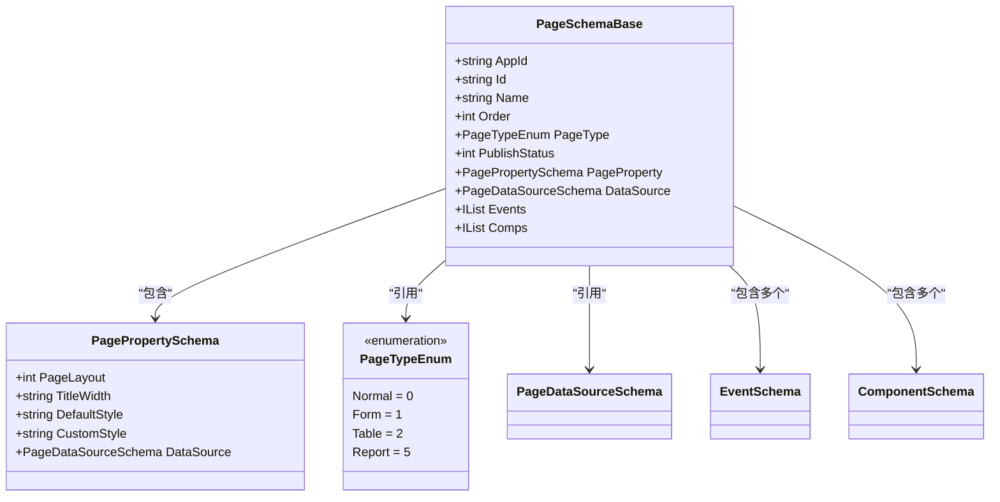
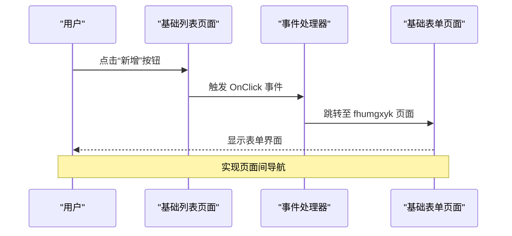
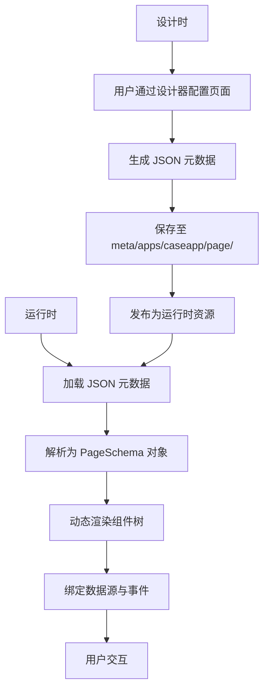

# 页面元数据结构

<cite>
**本文档中引用的文件**  
- [PageSchemaBase.cs](file://src\Common\H.LowCode.MetaSchema\PageSchemaBase.cs)
- [PagePropertySchema.cs](file://src\Common\H.LowCode.MetaSchema\PropertySchemas\PagePropertySchema.cs)
- [PageTypeEnum.cs](file://src\Common\H.LowCode.MetaSchema\Enums\PageTypeEnum.cs)
- [fhumgxyk.json](file://meta\apps\caseapp\page\fhumgxyk.json)
- [g0qcqxzd.json](file://meta\apps\caseapp\page\g0qcqxzd.json)
- [2qceiqni.json](file://meta\apps\caseapp\page\2qceiqni.json)
- [4tnfvebp1.json](file://meta\apps\caseapp\page\4tnfvebp1.json)
</cite>

## 目录
1. [引言](#引言)  
2. [页面元数据核心结构](#页面元数据核心结构)  
3. [页面类型与布局配置](#页面类型与布局配置)  
4. [页面属性定义](#页面属性定义)  
5. [组件列表与数据源引用](#组件列表与数据源引用)  
6. [事件处理逻辑](#事件处理逻辑)  
7. [实例分析：页面元数据结构嵌套](#实例分析：页面元数据结构嵌套)  
8. [生命周期管理与动态渲染](#生命周期管理与动态渲染)

## 引言

页面元数据（PageSchema）是低代码平台中用于描述页面结构、行为和外观的核心数据模型。通过元数据驱动的方式，系统能够在设计时和运行时动态构建用户界面，实现高度灵活的页面配置。本文将深入解析 `PageSchemaBase` 类的设计与实现，结合 `PagePropertySchema` 分析页面级属性的定义方式，并以 `meta/apps/caseapp/page` 目录下的 JSON 文件为例，展示页面元数据的实际结构与嵌套关系。

## 页面元数据核心结构

`PageSchemaBase` 是所有页面元数据的基类，定义了页面的基本属性和结构。该类继承自 `MetaSchemaBase`，并包含多个关键字段，用于描述页面的身份、类型、布局、组件、数据源和事件等信息。



**图示来源**  
- [PageSchemaBase.cs](file://src\Common\H.LowCode.MetaSchema\PageSchemaBase.cs#L5-L39)
- [PagePropertySchema.cs](file://src\Common\H.LowCode.MetaSchema\PropertySchemas\PagePropertySchema.cs#L5-L36)

**本节来源**  
- [PageSchemaBase.cs](file://src\Common\H.LowCode.MetaSchema\PageSchemaBase.cs#L5-L39)

## 页面类型与布局配置

### 页面类型（PageTypeEnum）

页面类型通过 `PageTypeEnum` 枚举定义，支持以下几种类型：

- **普通页面（Normal）**: 值为 0，适用于通用内容展示。
- **表单页面（Form）**: 值为 1，用于数据录入和编辑。
- **列表页面（Table）**: 值为 2，用于数据展示和操作。
- **报表页面（Report）**: 值为 5，用于数据分析和可视化。

该枚举通过 `[Display(Name = "...")]` 特性提供中文名称，便于在用户界面中显示。

### 布局配置

页面布局由 `PagePropertySchema` 中的 `PageLayout` 字段控制，表示页面的列数布局：

- **1列布局**: 单列，适合简洁内容。
- **2列布局**: 双列，常见于表单和列表。
- **3列布局**: 三列，适用于复杂表单或分栏布局。
- **4列布局**: 四列，用于高度复杂的布局需求。

例如，在 `fhumgxyk.json` 中，`"pageprop":{"playout":3}` 表示该页面采用三列布局。

**本节来源**  
- [PageTypeEnum.cs](file://src\Common\H.LowCode.MetaSchema\Enums\PageTypeEnum.cs#L9-L19)
- [PagePropertySchema.cs](file://src\Common\H.LowCode.MetaSchema\PropertySchemas\PagePropertySchema.cs#L5-L36)

## 页面属性定义

`PagePropertySchema` 类定义了页面级别的属性，包括布局、样式、标题宽度和数据源等。这些属性决定了页面的整体外观和行为。

### 核心字段说明

- **PageLayout**: 页面布局列数，影响组件的排列方式。
- **TitleWidth**: 标题区域的宽度，控制标签与输入框的比例。
- **DefaultStyle**: 默认样式，应用于整个页面的基础样式。
- **CustomStyle**: 自定义样式，允许用户添加额外的 CSS 规则。
- **DataSource**: 页面级数据源，可被多个组件共享。

例如，在 `2qceiqni.json`（主从表单）中，`"pageprop":{"playout":2,"ds":{}}` 表示该页面为双列布局，并配置了数据源。

**本节来源**  
- [PagePropertySchema.cs](file://src\Common\H.LowCode.MetaSchema\PropertySchemas\PagePropertySchema.cs#L5-L36)

## 组件列表与数据源引用

### 组件列表（comps）

`comps` 字段是一个组件对象数组，描述了页面上所有可视组件的配置。每个组件包含以下信息：

- **compid**: 组件唯一标识。
- **libid**: 所属组件库（如 antdesign）。
- **cn**: 组件名称（如 Input、Table）。
- **attrdefgroups**: 属性定义组，包含组件的可配置属性。
- **stl**: 样式信息，如高度、标签宽度等。
- **ds**: 数据源配置，用于绑定数据。

例如，在 `g0qcqxzd.json`（基础列表）中，`comps` 包含一个表格组件，其数据源配置了列定义和按钮事件。

### 数据源引用

数据源通过 `ds` 字段配置，支持多种类型：

- **API 数据源**: 调用后端接口获取数据。
- **SQL 数据源**: 直接执行 SQL 查询。
- **静态数据源**: 固定选项列表（如下拉框选项）。

在 `fhumgxyk.json` 中，`"ds":{"dst":1,"dsv":"tb_test1"}` 表示该页面的数据源类型为数据库表，表名为 `tb_test1`。

**本节来源**  
- [fhumgxyk.json](file://meta\apps\caseapp\page\fhumgxyk.json)
- [g0qcqxzd.json](file://meta\apps\caseapp\page\g0qcqxzd.json)

## 事件处理逻辑

事件处理通过 `Events` 字段定义，是一个 `EventSchema` 对象的列表。每个事件包含以下信息：

- **en**: 事件名称（如 OnClick、OnLoad）。
- **eht**: 事件处理类型（如跳转、提交）。
- **etid**: 目标页面或组件 ID。
- **eta**: 附加参数。

例如，在 `g0qcqxzd.json` 中，表格的“新增”按钮配置了 `OnClick` 事件，指向另一个表单页面，实现页面跳转。



**图示来源**  
- [g0qcqxzd.json](file://meta\apps\caseapp\page\g0qcqxzd.json)
- [fhumgxyk.json](file://meta\apps\caseapp\page\fhumgxyk.json)

**本节来源**  
- [PageSchemaBase.cs](file://src\Common\H.LowCode.MetaSchema\PageSchemaBase.cs#L26-L29)

## 实例分析：页面元数据结构嵌套

以 `fhumgxyk.json`（基础表单）为例，其元数据结构如下：

```json
{
  "aid": "caseapp",
  "id": "fhumgxyk",
  "n": "基础表单",
  "pt": 1,
  "pageprop": {
    "playout": 3
  },
  "ds": {
    "dst": 1,
    "dsv": "tb_test1"
  },
  "comps": [
    {
      "compid": "52391a70",
      "cn": "Input",
      "n": "f_field1",
      "lb": "输入框1",
      "stl": { "itemh": 85, "labelw": 180 }
    },
    {
      "compid": "evuqdwzl",
      "cn": "Radio",
      "n": "f_field6",
      "lb": "单选框3",
      "ds": { "fxopds": [ { "l": "选项1", "v": "op1" } ] }
    }
  ]
}
```

该结构展示了：

- 页面属于 `caseapp` 应用。
- 页面类型为表单（`pt:1`）。
- 采用三列布局（`playout:3`）。
- 数据源绑定到 `tb_test1` 表。
- 包含多个组件，如输入框、单选框等，每个组件都有独立的属性和数据源配置。

**本节来源**  
- [fhumgxyk.json](file://meta\apps\caseapp\page\fhumgxyk.json)

## 生命周期管理与动态渲染

页面元数据在设计时和运行时具有不同的生命周期管理方式：

### 设计时

- 元数据通过可视化设计器编辑，保存为 JSON 文件。
- 支持版本控制和发布状态管理（`PublishStatus`）。
- 可通过 `PageAppService` 等服务进行增删改查。

### 运行时

- 系统加载 JSON 元数据，解析为 `PageSchema` 对象。
- 根据 `PageType` 和 `PageProperty` 动态渲染页面布局。
- 组件根据 `comps` 数组实例化，并绑定数据源和事件。
- 通过 `MetaAppService` 提供运行时元数据查询接口。

这种元数据驱动的架构实现了“配置即代码”的理念，使非技术人员也能快速构建复杂页面。



**图示来源**  
- [PageSchemaBase.cs](file://src\Common\H.LowCode.MetaSchema\PageSchemaBase.cs)
- [fhumgxyk.json](file://meta\apps\caseapp\page\fhumgxyk.json)

**本节来源**  
- [PageSchemaBase.cs](file://src\Common\H.LowCode.MetaSchema\PageSchemaBase.cs)
- [PageAppService.cs](file://src\DesignEngine\H.LowCode.DesignEngine.Application\AppServices\PageAppService.cs)
- [MetaAppService.cs](file://src\RenderEngine\H.LowCode.RenderEngine.Application\RenderAppServices\MetaAppService.cs)