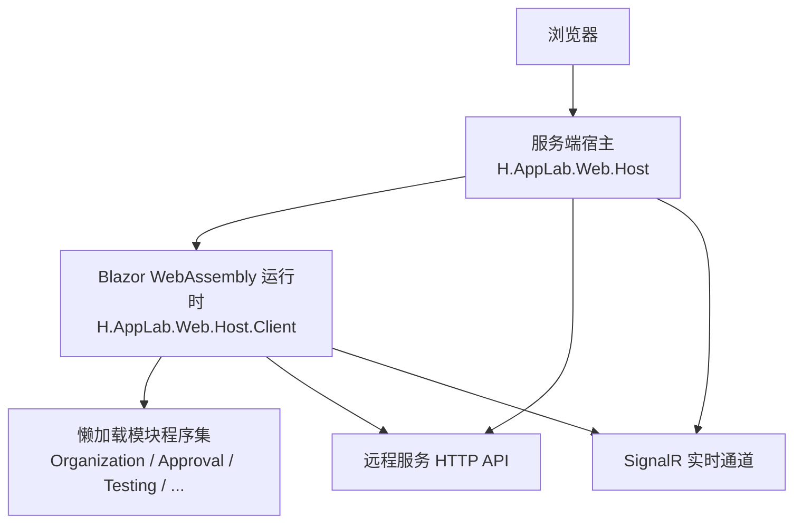
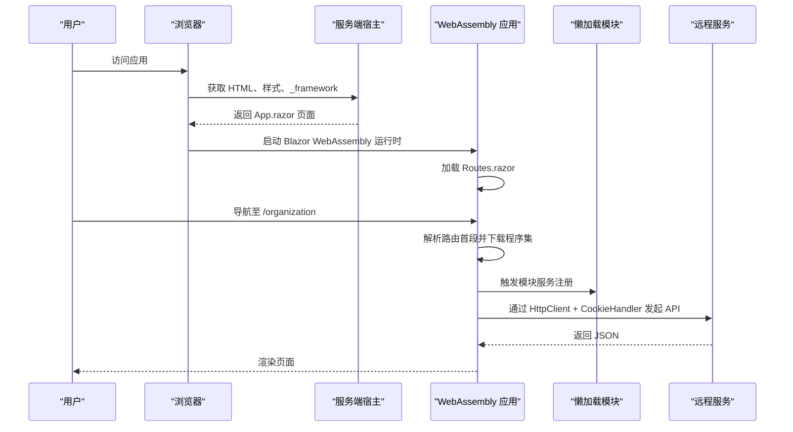
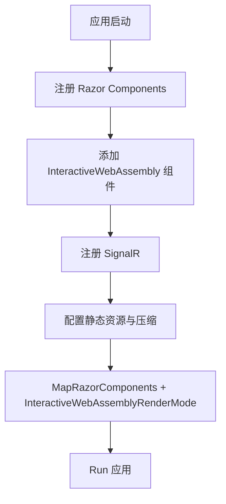
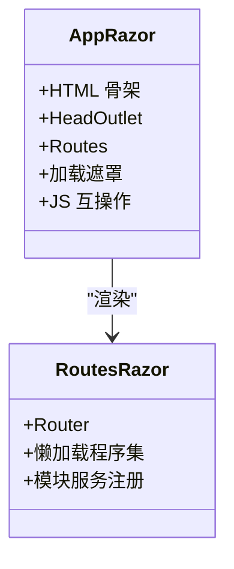
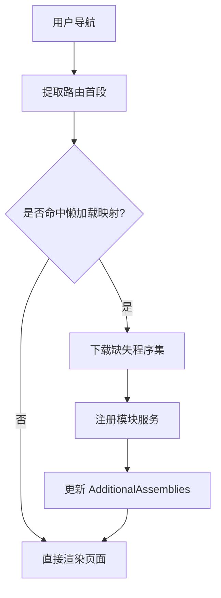
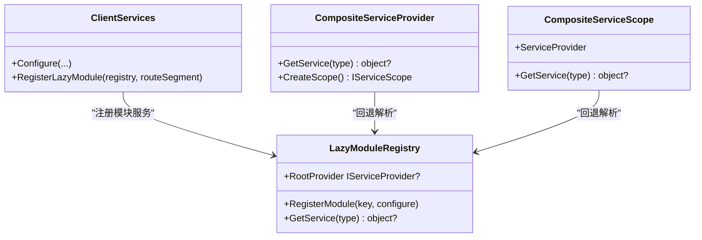
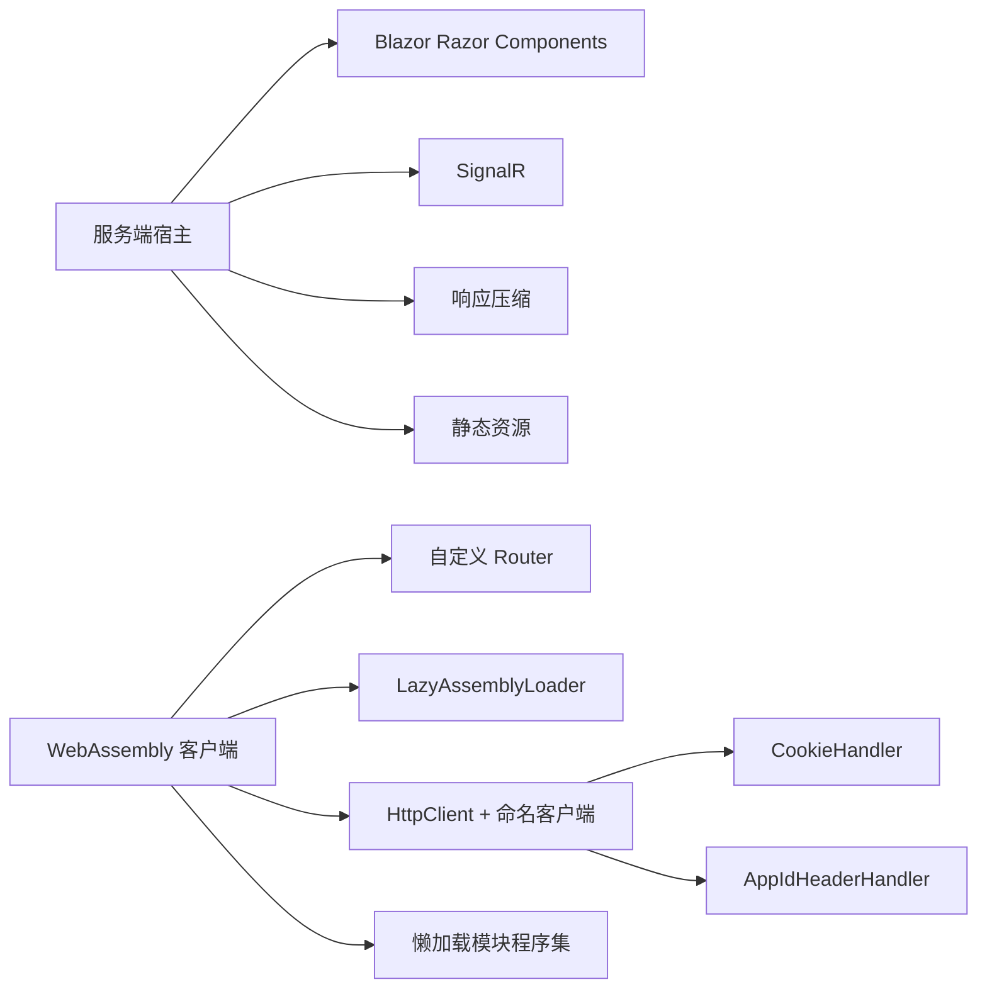

# Blazor 混合渲染模式

<cite>
**本文引用的文件**   
- [Program.cs](file://src/Host/H.AppLab.Web.Host/H.AppLab.Web.Host/Program.cs)
- [App.razor](file://src/Host/H.AppLab.Web.Host/H.AppLab.Web.Host/Components/App.razor)
- [Routes.razor](file://src/Host/H.AppLab.Web.Host/H.AppLab.Web.Host.Client/Routes.razor)
- [Program.cs](file://src/Host/H.AppLab.Web.Host/H.AppLab.Web.Host.Client/Program.cs)
- [ClientServices.cs](file://src/Host/H.AppLab.Web.Host/H.AppLab.Web.Host.Client/ClientServices.cs)
- [LazyModuleServices.cs](file://src/Host/H.AppLab.Web.Host/H.AppLab.Web.Host.Client/LazyModuleServices.cs)
- [CookieHandler.cs](file://src/Host/H.AppLab.Web.Host/H.AppLab.Web.Host.Client/CookieHandler.cs)
- [AppIdHeaderHandler.cs](file://src/Host/H.AppLab.Web.Host/H.AppLab.Web.Host.Client/AppIdHeaderHandler.cs)
- [appsettings.json](file://src/Host/H.AppLab.Web.Host/H.AppLab.Web.Host.Client/wwwroot/appsettings.json)
</cite>

## 目录
1. [引言](#引言)
2. [项目结构](#项目结构)
3. [核心组件](#核心组件)
4. [架构总览](#架构总览)
5. [详细组件分析](#详细组件分析)
6. [依赖关系分析](#依赖关系分析)
7. [性能与用户体验](#性能与用户体验)
8. [故障排查指南](#故障排查指南)
9. [结论](#结论)

## 引言
本文面向 AppLab 的 Blazor Web App，解释其采用的“服务器端 + WebAssembly”混合渲染策略：服务端负责启动应用、提供 SignalR 实时通信能力并分发路由；WebAssembly 客户端负责实际页面交互、懒加载业务模块、调用远程服务。文档重点说明：
- 哪些部分在服务端运行、哪些在浏览器中运行；
- 如何配置混合渲染、如何通过路由把不同功能划分到不同程序集；
- 状态管理如何在跨渲染模式和模块之间协作；
- 两种模式的差异、数据传递和事件冒泡注意事项；
- 首屏加载、交互响应性和网络依赖对体验的影响；
- 选择渲染模式的最佳实践。

## 项目结构
AppLab 的 Web 前端由两个关键部分组成：
- 服务端宿主：注册 Razor Components、SignalR、压缩、静态资源等中间件，并以 `InteractiveWebAssemblyRenderMode` 启用 WebAssembly 渲染。
- 客户端 WebAssembly 应用：使用自定义 Router 实现按路由首段懒加载程序集，并通过组合式 DI 容器解析延迟注册的模块服务。

**图表来源**
- [Program.cs:1-113](file://src/Host/H.AppLab.Web.Host/H.AppLab.Web.Host/Program.cs#L1-L113)
- [Routes.razor:1-145](file://src/Host/H.AppLab.Web.Host/H.AppLab.Web.Host.Client/Routes.razor#L1-L145)

**章节来源**
- [Program.cs:1-113](file://src/Host/H.AppLab.Web.Host/H.AppLab.Web.Host/Program.cs#L1-L113)
- [Routes.razor:1-145](file://src/Host/H.AppLab.Web.Host/H.AppLab.Web.Host.Client/Routes.razor#L1-L145)

## 核心组件
- 服务端入口 Program：注册 Blazor Web App、SignalR、响应压缩、静态资源、认证授权、路由映射，并以 WebAssembly 渲染模式挂载 Razor 组件。
- 根布局 App.razor：定义 HTML 骨架、加载遮罩、JS 互操作初始化，以及以 `InteractiveWebAssemblyRenderMode(prerender: false)` 渲染 Routes。
- 客户端路由 Routes.razor：基于 `LazyAssemblyLoader` 按路由首段动态下载程序集，并在导航后注册模块服务。
- 客户端服务 ClientServices：集中维护远程服务名称、HttpClient 命名客户端、Cookie 与 appid 请求头处理、模块懒加载服务注册表。
- 组合式 DI LazyModuleRegistry：为每个懒加载模块构建独立子容器，并由 CompositeServiceProvider 回退解析。
- CookieHandler：让 WASM 发出的 fetch 请求携带 Cookie。
- AppIdHeaderHandler：从当前路由解析低代码应用 Id，并附加到请求头。
- 客户端配置 appsettings.json：声明各远程服务的 BaseUrl。

**章节来源**
- [Program.cs:1-113](file://src/Host/H.AppLab.Web.Host/H.AppLab.Web.Host/Program.cs#L1-L113)
- [App.razor:1-77](file://src/Host/H.AppLab.Web.Host/H.AppLab.Web.Host/Components/App.razor#L1-L77)
- [Routes.razor:1-145](file://src/Host/H.AppLab.Web.Host/H.AppLab.Web.Host.Client/Routes.razor#L1-L145)
- [ClientServices.cs:1-193](file://src/Host/H.AppLab.Web.Host/H.AppLab.Web.Host.Client/ClientServices.cs#L1-L193)
- [LazyModuleServices.cs:1-141](file://src/Host/H.AppLab.Web.Host/H.AppLab.Web.Host.Client/LazyModuleServices.cs#L1-L141)
- [CookieHandler.cs:1-16](file://src/Host/H.AppLab.Web.Host/H.AppLab.Web.Host.Client/CookieHandler.cs#L1-L16)
- [AppIdHeaderHandler.cs:1-50](file://src/Host/H.AppLab.Web.Host/H.AppLab.Web.Host.Client/AppIdHeaderHandler.cs#L1-L50)
- [appsettings.json:1-52](file://src/Host/H.AppLab.Web.Host/H.AppLab.Web.Host.Client/wwwroot/appsettings.json#L1-L52)

## 架构总览
AppLab 采用 Blazor Web App 的 Server + WebAssembly 混合渲染：
- 服务端不再承担 UI 交互，而是负责应用引导、SignalR 实时通道、静态资源与 API 网关。
- 所有用户界面均以 `InteractiveWebAssemblyRenderMode` 在浏览器中运行，因此页面逻辑、组件生命周期、DOM 更新都在 WebAssembly 中进行。
- 通过自定义 Router 将大型业务拆分为多个可懒加载的程序集，按需下载，降低初始包体。

**图表来源**
- [App.razor:1-77](file://src/Host/H.AppLab.Web.Host/H.AppLab.Web.Host/Components/App.razor#L1-L77)
- [Routes.razor:1-145](file://src/Host/H.AppLab.Web.Host/H.AppLab.Web.Host.Client/Routes.razor#L1-L145)
- [ClientServices.cs:1-193](file://src/Host/H.AppLab.Web.Host/H.AppLab.Web.Host.Client/ClientServices.cs#L1-L193)
- [CookieHandler.cs:1-16](file://src/Host/H.AppLab.Web.Host/H.AppLab.Web.Host.Client/CookieHandler.cs#L1-L16)

**章节来源**
- [Program.cs:1-113](file://src/Host/H.AppLab.Web.Host/H.AppLab.Web.Host/Program.cs#L1-L113)
- [App.razor:1-77](file://src/Host/H.AppLab.Web.Host/H.AppLab.Web.Host/Components/App.razor#L1-L77)
- [Routes.razor:1-145](file://src/Host/H.AppLab.Web.Host/H.AppLab.Web.Host.Client/Routes.razor#L1-L145)

## 详细组件分析

### 服务端渲染配置与 SignalR
服务端通过 `AddRazorComponents().AddInteractiveWebAssemblyComponents()` 启用 Blazor Web App，并通过 `MapRazorComponents<App>().AddInteractiveWebAssemblyRenderMode()` 指定所有 Razor 组件默认使用 WebAssembly 渲染。同时注册 SignalR，允许后续模块或后台任务通过实时通道推送消息。

**图表来源**
- [Program.cs:1-113](file://src/Host/H.AppLab.Web.Host/H.AppLab.Web.Host/Program.cs#L1-L113)

**章节来源**
- [Program.cs:1-113](file://src/Host/H.AppLab.Web.Host/H.AppLab.Web.Host/Program.cs#L1-L113)

### 根布局与 WebAssembly 渲染入口
根布局 App.razor 明确设置 `HeadOutlet` 与 `Routes` 均使用 `InteractiveWebAssemblyRenderMode(prerender: false)`，表示不预渲染，直接进入 WebAssembly 执行。页面包含一个加载遮罩，并在首次渲染后通过 JS 移除。

**图表来源**
- [App.razor:1-77](file://src/Host/H.AppLab.Web.Host/H.AppLab.Web.Host/Components/App.razor#L1-L77)
- [Routes.razor:1-145](file://src/Host/H.AppLab.Web.Host/H.AppLab.Web.Host.Client/Routes.razor#L1-L145)

**章节来源**
- [App.razor:1-77](file://src/Host/H.AppLab.Web.Host/H.AppLab.Web.Host/Components/App.razor#L1-L77)

### 路由分发与程序集懒加载
Routes.razor 实现了一个基于路由首段的程序集懒加载机制：
- 当用户导航到 `/organization`、`/approval`、`/devhome`、`/designengine`、`/app` 等路径时，Router 会先匹配首段，再从 `LazyAssemblies` 表中取出对应程序集列表。
- 通过 `LazyAssemblyLoader.LoadAssembliesAsync` 异步下载未加载的程序集。
- 程序集加载完成后，调用 `ClientServices.RegisterLazyModule` 注册该模块的 HttpClient 代理和服务。
- 已加载程序集会缓存到 `_loadedAssemblies`，避免重复下载。

**图表来源**
- [Routes.razor:1-145](file://src/Host/H.AppLab.Web.Host/H.AppLab.Web.Host.Client/Routes.razor#L1-L145)
- [ClientServices.cs:1-193](file://src/Host/H.AppLab.Web.Host/H.AppLab.Web.Host.Client/ClientServices.cs#L1-L193)

**章节来源**
- [Routes.razor:1-145](file://src/Host/H.AppLab.Web.Host/H.AppLab.Web.Host.Client/Routes.razor#L1-L145)
- [ClientServices.cs:1-193](file://src/Host/H.AppLab.Web.Host/H.AppLab.Web.Host.Client/ClientServices.cs#L1-L193)

### 状态管理与跨模块 DI
由于 ABP 模块系统构建后不可追加注册服务，客户端采用组合式容器：
- `LazyModuleRegistry` 为每个懒加载模块创建独立子容器，并按 key 去重。
- `CompositeServiceProvider` 优先从内部容器解析，解析失败再回退到模块子容器。
- `CompositeServiceScope` 保证作用域内解析同样具备回退能力。
- `ClientServices.RegisterLazyModule` 在路由导航后调用，把模块所需的 HttpClient 代理、共享状态（如测试选中项目）注入到对应模块容器。

**图表来源**
- [LazyModuleServices.cs:1-141](file://src/Host/H.AppLab.Web.Host/H.AppLab.Web.Host.Client/LazyModuleServices.cs#L1-L141)
- [ClientServices.cs:1-193](file://src/Host/H.AppLab.Web.Host/H.AppLab.Web.Host.Client/ClientServices.cs#L1-L193)

**章节来源**
- [LazyModuleServices.cs:1-141](file://src/Host/H.AppLab.Web.Host/H.AppLab.Web.Host.Client/LazyModuleServices.cs#L1-L141)
- [ClientServices.cs:1-193](file://src/Host/H.AppLab.Web.Host/H.AppLab.Web.Host.Client/ClientServices.cs#L1-L193)

### 跨渲染模式的数据传递与事件冒泡
虽然 AppLab 当前将所有页面设置为 WebAssembly 渲染，但理解 Server + WebAssembly 差异仍很重要：
- 若某个组件需要 SignalR 实时通信且希望保留服务器端上下文，应放在服务端渲染组件中，或使用交互式服务器模式；这样可直接利用服务器端的 HubContext、数据库连接和权限上下文。
- 若组件需要离线能力、本地计算或减少网络往返，则应放在 WebAssembly 组件中，并通过 HttpClient 调用远程服务。
- 数据传递建议：
  - 父组件向子组件传递参数时使用 `[Parameter]`，避免在跨渲染边界直接持有复杂对象引用。
  - 子组件向父组件回调时使用 `[Parameter] public EventCallback<T> OnEvent { get; set; }`，确保事件在正确渲染模式下被调度。
  - 跨模块共享状态应通过 DI 注册单例或作用域服务，而不是依赖全局静态变量。
- 当前项目中，跨渲染模式差异主要体现在：
  - 服务端负责 SignalR、认证、多租户、API 路由；
  - WebAssembly 负责 UI 渲染、懒加载、HTTP 调用。

**章节来源**
- [Program.cs:1-113](file://src/Host/H.AppLab.Web.Host/H.AppLab.Web.Host/Program.cs#L1-L113)
- [App.razor:1-77](file://src/Host/H.AppLab.Web.Host/H.AppLab.Web.Host/Components/App.razor#L1-L77)
- [Routes.razor:1-145](file://src/Host/H.AppLab.Web.Host/H.AppLab.Web.Host.Client/Routes.razor#L1-L145)

### 实际代码示例路径
以下示例路径可用于参考如何在 Razor 组件中处理两种渲染模式差异、如何处理跨渲染模式的数据传递和事件冒泡：
- 服务端配置 WebAssembly 渲染模式：[Program.cs:1-113](file://src/Host/H.AppLab.Web.Host/H.AppLab.Web.Host/Program.cs#L1-L113)
- 根布局中强制 WebAssembly 渲染：[App.razor:1-77](file://src/Host/H.AppLab.Web.Host/H.AppLab.Web.Host/Components/App.razor#L1-L77)
- 路由首段懒加载程序集与模块服务注册：[Routes.razor:1-145](file://src/Host/H.AppLab.Web.Host/H.AppLab.Web.Host.Client/Routes.razor#L1-L145)
- 客户端 HttpClient 代理与模块服务注册表：[ClientServices.cs:1-193](file://src/Host/H.AppLab.Web.Host/H.AppLab.Web.Host.Client/ClientServices.cs#L1-L193)
- 组合式 DI 与模块子容器：[LazyModuleServices.cs:1-141](file://src/Host/H.AppLab.Web.Host/H.AppLab.Web.Host.Client/LazyModuleServices.cs#L1-L141)
- 携带 Cookie 的请求处理器：[CookieHandler.cs:1-16](file://src/Host/H.AppLab.Web.Host/H.AppLab.Web.Host.Client/CookieHandler.cs#L1-L16)
- 从路由解析 appid 的请求处理器：[AppIdHeaderHandler.cs:1-50](file://src/Host/H.AppLab.Web.Host/H.AppLab.Web.Host.Client/AppIdHeaderHandler.cs#L1-L50)
- 远程服务地址配置：[appsettings.json:1-52](file://src/Host/H.AppLab.Web.Host/H.AppLab.Web.Host.Client/wwwroot/appsettings.json#L1-L52)

## 依赖关系分析
- 服务端依赖：
  - ASP.NET Core WebApplication；
  - Blazor Razor Components；
  - SignalR；
  - ResponseCompression；
  - Hangfire Dashboard；
  - ABP 应用模块。
- 客户端依赖：
  - Blazor WebAssembly Hosting；
  - LazyAssemblyLoader；
  - HttpClient 命名客户端；
  - CookieHandler、AppIdHeaderHandler；
  - 各业务模块的 Application.Contracts。

**图表来源**
- [Program.cs:1-113](file://src/Host/H.AppLab.Web.Host/H.AppLab.Web.Host/Program.cs#L1-L113)
- [Routes.razor:1-145](file://src/Host/H.AppLab.Web.Host/H.AppLab.Web.Host.Client/Routes.razor#L1-L145)
- [ClientServices.cs:1-193](file://src/Host/H.AppLab.Web.Host/H.AppLab.Web.Host.Client/ClientServices.cs#L1-L193)
- [CookieHandler.cs:1-16](file://src/Host/H.AppLab.Web.Host/H.AppLab.Web.Host.Client/CookieHandler.cs#L1-L16)
- [AppIdHeaderHandler.cs:1-50](file://src/Host/H.AppLab.Web.Host/H.AppLab.Web.Host.Client/AppIdHeaderHandler.cs#L1-L50)

**章节来源**
- [Program.cs:1-113](file://src/Host/H.AppLab.Web.Host/H.AppLab.Web.Host/Program.cs#L1-L113)
- [Routes.razor:1-145](file://src/Host/H.AppLab.Web.Host/H.AppLab.Web.Host.Client/Routes.razor#L1-L145)
- [ClientServices.cs:1-193](file://src/Host/H.AppLab.Web.Host/H.AppLab.Web.Host.Client/ClientServices.cs#L1-L193)

## 性能与用户体验
- 首屏加载时间：
  - 当前根布局使用 `InteractiveWebAssemblyRenderMode(prerender: false)`，意味着浏览器需要先下载 Blazor WebAssembly 运行时和基础程序集，再渲染页面。
  - 通过响应压缩（Brotli 和 Gzip）和静态资源指纹化缓存，可降低 WASM 传输体积并提升长期缓存命中率。
- 交互响应性：
  - WebAssembly 渲染使 UI 逻辑在浏览器执行，减少服务器往返，适合高频交互场景。
  - 懒加载程序集可将大模块拆分，避免一次性下载全部代码。
- 网络依赖：
  - 首次访问需要下载 _framework 和模块程序集；
  - 页面交互依赖远程 API，需通过 CookieHandler 携带认证信息；
  - 若需要实时通知或协同编辑，可使用 SignalR。
- 最佳实践建议：
  - 对需要实时通信、服务端权限和数据库访问的功能，优先考虑服务端渲染或交互式服务器模式；
  - 对需要离线能力、本地计算、高交互响应的功能，优先使用 WebAssembly；
  - 使用路由首段作为懒加载边界，把低频模块放到独立程序集；
  - 对共享状态使用 DI 单例或服务层，避免全局静态变量；
  - 对频繁变化的 UI，尽量在 WebAssembly 中处理，减少 SignalR 或 HTTP 调用频率；
  - 对长耗时任务（如批量测试），注意 HttpClient 超时配置，避免中途取消。

[本节为通用性能指导，不直接分析具体源码文件]

## 故障排查指南
- 页面一直显示“加载中...”：
  - 检查是否正确配置 `InteractiveWebAssemblyRenderMode(prerender: false)`；
  - 确认 `_framework/blazor.web.js` 能正常加载；
  - 检查 WASM 程序集是否被正确压缩和缓存。
- 模块程序集无法加载：
  - 检查 Routes.razor 中的 `LazyAssemblies` 映射是否包含目标程序集；
  - 确认模块程序集已发布到远端并可被 LazyAssemblyLoader 访问。
- API 请求缺少 Cookie：
  - 确认已注册 `CookieHandler` 并添加到 HttpClient 管道；
  - 检查服务端是否启用认证和 Cookie。
- 低代码应用数据源未按应用加载：
  - 确认 `AppIdHeaderHandler` 能从路由中解析 appid；
  - 检查服务端是否读取 appid 请求头并加载对应模型。
- 模块服务解析失败：
  - 确认 `ClientServices.RegisterLazyModule` 已在路由导航后调用；
  - 检查 `LazyModuleRegistry` 是否已初始化 RootProvider；
  - 确认模块所需依赖已通过 `CompositeServiceProvider` 回退解析。

**章节来源**
- [App.razor:1-77](file://src/Host/H.AppLab.Web.Host/H.AppLab.Web.Host/Components/App.razor#L1-L77)
- [Routes.razor:1-145](file://src/Host/H.AppLab.Web.Host/H.AppLab.Web.Host.Client/Routes.razor#L1-L145)
- [ClientServices.cs:1-193](file://src/Host/H.AppLab.Web.Host/H.AppLab.Web.Host.Client/ClientServices.cs#L1-L193)
- [LazyModuleServices.cs:1-141](file://src/Host/H.AppLab.Web.Host/H.AppLab.Web.Host.Client/LazyModuleServices.cs#L1-L141)
- [CookieHandler.cs:1-16](file://src/Host/H.AppLab.Web.Host/H.AppLab.Web.Host.Client/CookieHandler.cs#L1-L16)
- [AppIdHeaderHandler.cs:1-50](file://src/Host/H.AppLab.Web.Host/H.AppLab.Web.Host.Client/AppIdHeaderHandler.cs#L1-L50)

## 结论
AppLab 的 Blazor 混合渲染模式以服务端的 SignalR 和 API 为基础，将用户界面交给 WebAssembly 执行，并通过自定义 Router 实现程序集级懒加载。这种设计在保证实时通信能力的同时，提升了交互响应性，并通过模块化分包优化了首屏加载体验。开发者应根据功能特性选择合适的渲染模式：实时与敏感逻辑放服务端，交互与计算放 WebAssembly；通过 DI 管理状态，通过 HttpClient 和 SignalR 完成跨渲染模式通信。

[本节为总结性内容，不直接分析具体源码文件]