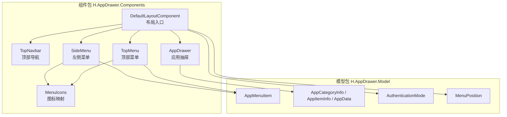
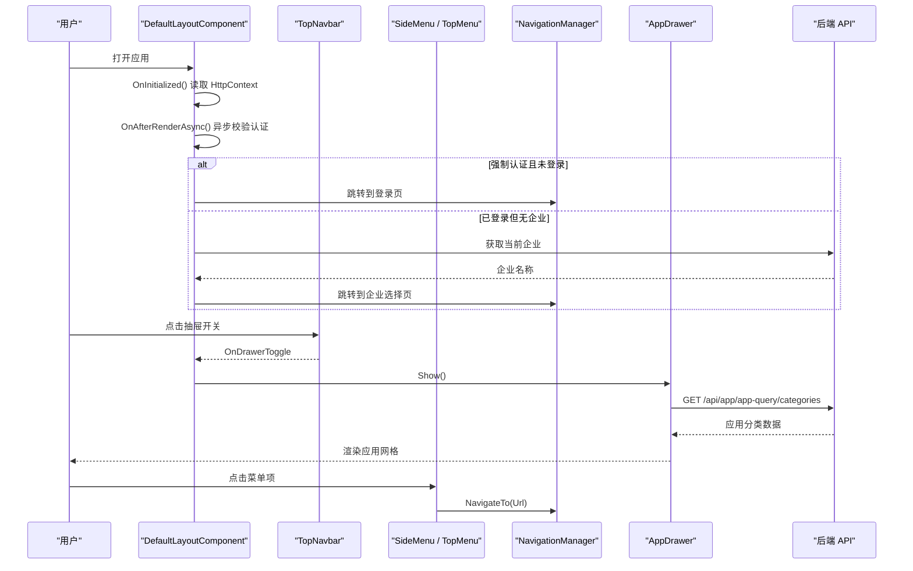
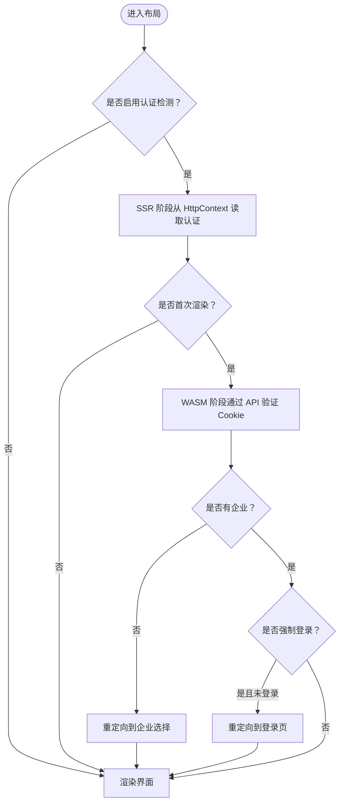
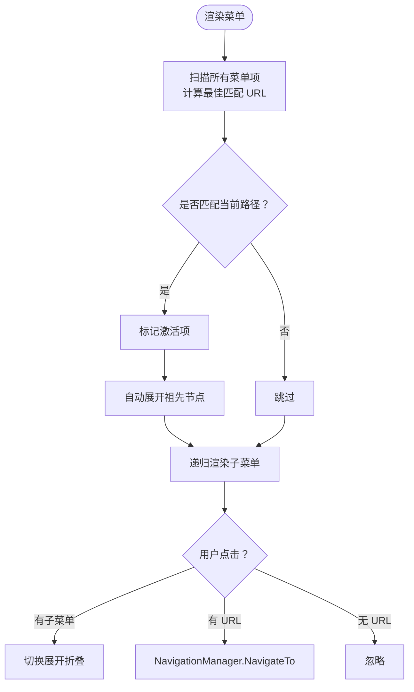
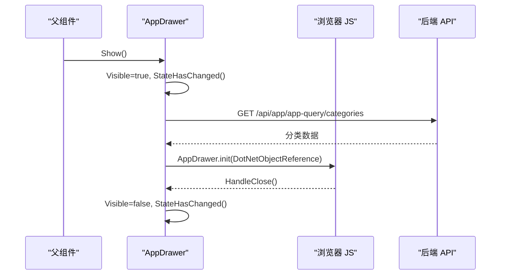
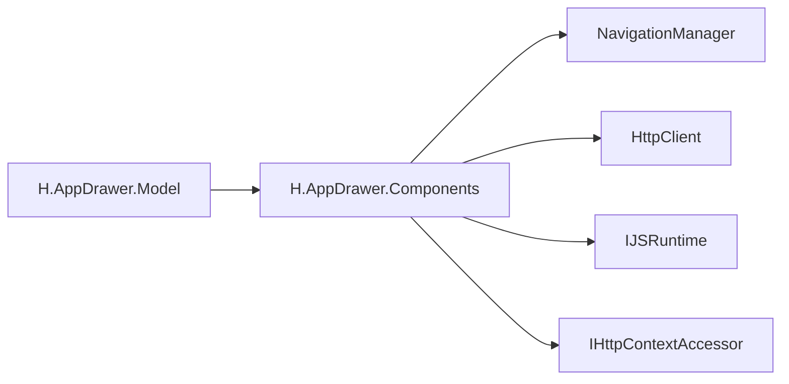

# UI 组件开发规范

<cite>
**本文引用的文件**   
- [AppDrawer.razor](file://src/Components/AppDrawer/H.AppDrawer.Components/Components/AppDrawer.razor)
- [SideMenu.razor](file://src/Components/AppDrawer/H.AppDrawer.Components/Components/SideMenu.razor)
- [TopMenu.razor](file://src/Components/AppDrawer/H.AppDrawer.Components/Components/TopMenu.razor)
- [TopNavbar.razor](file://src/Components/AppDrawer/H.AppDrawer.Components/Components/TopNavbar.razor)
- [DefaultLayoutComponent.razor](file://src/Components/AppDrawer/H.AppDrawer.Components/Components/DefaultLayoutComponent.razor)
- [MenuIcons.cs](file://src/Components/AppDrawer/H.AppDrawer.Components/Components/MenuIcons.cs)
- [AppMenuItem.cs](file://src/Components/AppDrawer/H.AppDrawer.Model/AppMenuItem.cs)
- [AppData.cs](file://src/Components/AppDrawer/H.AppDrawer.Model/AppData.cs)
- [AppDrawerModels.cs](file://src/Components/AppDrawer/H.AppDrawer.Model/AppDrawerModels.cs)
- [AuthenticationMode.cs](file://src/Components/AppDrawer/H.AppDrawer.Model/AuthenticationMode.cs)
- [MenuPosition.cs](file://src/Components/AppDrawer/H.AppDrawer.Model/MenuPosition.cs)
- [AppDrawer.css](file://src/Components/AppDrawer/H.AppDrawer.Components/wwwroot/css/AppDrawer.css)
- [_Imports.razor](file://src/Components/AppDrawer/H.AppDrawer.Components/_Imports.razor)
</cite>

## 目录
1. [引言](#引言)
2. [项目结构](#项目结构)
3. [核心组件总览](#核心组件总览)
4. [架构与数据流](#架构与数据流)
5. [组件详细分析](#组件详细分析)
6. [依赖关系分析](#依赖关系分析)
7. [性能与可维护性建议](#性能与可维护性建议)
8. [测试策略](#测试策略)
9. [响应式设计与主题定制](#响应式设计与主题定制)
10. [无障碍与可访问性指南](#无障碍与可访问性指南)
11. [API 文档模板与命名约定](#api-文档模板与命名约定)
12. [结论](#结论)

## 引言
本规范以 AppLab 的 AppDrawer 组件库为基准，总结 Blazor 组件在 AppLab 中的开发模式，包括属性设计、事件处理、样式隔离、主题变量、生命周期管理、状态同步、父子通信、认证集成、菜单渲染、抽屉面板切换等。目标是让新增或扩展 UI 组件时，能够遵循统一的结构、命名和交互契约，降低协作成本并提升可测试性与可维护性。

## 项目结构
AppDrawer 由一个模型项目和一组 Blazor 组件组成：
- 模型层提供菜单项、应用分类、认证模式、菜单位置等共享数据结构。
- 组件层提供布局容器、顶部导航栏、侧边菜单、顶部菜单和应用抽屉。
- 静态资源通过 `wwwroot` 暴露 CSS；JS 桥接通过 `IJSRuntime` 调用原生 JS API。

**图表来源**
- [DefaultLayoutComponent.razor:1-120](file://src/Components/AppDrawer/H.AppDrawer.Components/Components/DefaultLayoutComponent.razor#L1-L120)
- [TopNavbar.razor:1-120](file://src/Components/AppDrawer/H.AppDrawer.Components/Components/TopNavbar.razor#L1-L120)
- [SideMenu.razor:1-120](file://src/Components/AppDrawer/H.AppDrawer.Components/Components/SideMenu.razor#L1-L120)
- [TopMenu.razor:1-95](file://src/Components/AppDrawer/H.AppDrawer.Components/Components/TopMenu.razor#L1-L95)
- [AppDrawer.razor:1-120](file://src/Components/AppDrawer/H.AppDrawer.Components/Components/AppDrawer.razor#L1-L120)
- [MenuIcons.cs:1-54](file://src/Components/AppDrawer/H.AppDrawer.Components/Components/MenuIcons.cs#L1-L54)
- [AppMenuItem.cs:1-21](file://src/Components/AppDrawer/H.AppDrawer.Model/AppMenuItem.cs#L1-L21)
- [AppDrawerModels.cs:1-73](file://src/Components/AppDrawer/H.AppDrawer.Model/AppDrawerModels.cs#L1-L73)
- [AppData.cs:1-9](file://src/Components/AppDrawer/H.AppDrawer.Model/AppData.cs#L1-L9)
- [AuthenticationMode.cs:1-22](file://src/Components/AppDrawer/H.AppDrawer.Model/AuthenticationMode.cs#L1-L22)
- [MenuPosition.cs:1-17](file://src/Components/AppDrawer/H.AppDrawer.Model/MenuPosition.cs#L1-L17)

**章节来源**
- [_Imports.razor:1-9](file://src/Components/AppDrawer/H.AppDrawer.Components/_Imports.razor#L1-L9)

## 核心组件总览
- `DefaultLayoutComponent`：应用布局入口，负责菜单位置选择、认证流程、用户信息初始化、企业选择跳转以及组合顶部导航、侧边菜单、内容区域和抽屉。
- `TopNavbar`：顶部导航栏，展示应用名、Logo、中间插槽（通常是顶部菜单）、登录态和用户下拉菜单。
- `SideMenu`：递归渲染嵌套菜单，根据当前路由高亮激活项，支持展开折叠。
- `TopMenu`：扁平顶部菜单，按路径匹配高亮，点击后使用客户端导航。
- `AppDrawer`：应用抽屉，加载后端应用分类数据，渲染网格应用列表，并与 JS 交互完成关闭逻辑。
- `MenuIcons`：统一图标映射，把字符串键转为内联 SVG，保证风格一致且跟随主题色。

**章节来源**
- [DefaultLayoutComponent.razor:1-120](file://src/Components/AppDrawer/H.AppDrawer.Components/Components/DefaultLayoutComponent.razor#L1-L120)
- [TopNavbar.razor:1-120](file://src/Components/AppDrawer/H.AppDrawer.Components/Components/TopNavbar.razor#L1-L120)
- [SideMenu.razor:1-120](file://src/Components/AppDrawer/H.AppDrawer.Components/Components/SideMenu.razor#L1-L120)
- [TopMenu.razor:1-95](file://src/Components/AppDrawer/H.AppDrawer.Components/Components/TopMenu.razor#L1-L95)
- [AppDrawer.razor:1-120](file://src/Components/AppDrawer/H.AppDrawer.Components/Components/AppDrawer.razor#L1-L120)
- [MenuIcons.cs:1-54](file://src/Components/AppDrawer/H.AppDrawer.Components/Components/MenuIcons.cs#L1-L54)

## 架构与数据流
AppDrawer 采用“布局驱动 + 子组件组合”的模式：
- 布局组件持有认证状态、用户名、企业名称、菜单配置和抽屉引用。
- 顶部导航与菜单组件只消费父级传入的数据，并通过事件回调向上汇报操作。
- 抽屉组件独立加载应用分类数据，通过 JSInterop 与页面脚本协作。

**图表来源**
- [DefaultLayoutComponent.razor:120-240](file://src/Components/AppDrawer/H.AppDrawer.Components/Components/DefaultLayoutComponent.razor#L120-L240)
- [TopNavbar.razor:120-202](file://src/Components/AppDrawer/H.AppDrawer.Components/Components/TopNavbar.razor#L120-L202)
- [AppDrawer.razor:120-200](file://src/Components/AppDrawer/H.AppDrawer.Components/Components/AppDrawer.razor#L120-L200)
- [TopMenu.razor:60-95](file://src/Components/AppDrawer/H.AppDrawer.Components/Components/TopMenu.razor#L60-L95)

**章节来源**
- [DefaultLayoutComponent.razor:1-302](file://src/Components/AppDrawer/H.AppDrawer.Components/Components/DefaultLayoutComponent.razor#L1-L302)
- [AppDrawer.razor:1-200](file://src/Components/AppDrawer/H.AppDrawer.Components/Components/AppDrawer.razor#L1-L200)

## 组件详细分析

### 布局组件 DefaultLayoutComponent
职责：
- 接收菜单数据、菜单位置、登录地址、认证模式等参数。
- 在服务端预渲染阶段快速判断认证状态并填充用户名和企业信息。
- 在首次渲染完成后检查 WASM 环境下的认证状态，必要时重定向到登录页或企业选择页。
- 组合 `TopNavbar`、`SideMenu`/`TopMenu`、内容区与 `AppDrawer`。

关键实现要点：
- 使用 `[Parameter]` 暴露外部可配置属性。
- 通过 `HttpContextAccessor` 在 SSR 阶段快速获取认证信息。
- 使用 `HttpClient` 调用 `/api/app/enterprise/current-enterprise` 获取企业信息。
- 根据 `AuthenticationMode` 控制访问控制逻辑。
- 通过 `@ref` 获取 `AppDrawer` 引用以调用 `Show()`、`Hide()`、`Toggle()`。

**图表来源**
- [DefaultLayoutComponent.razor:120-240](file://src/Components/AppDrawer/H.AppDrawer.Components/Components/DefaultLayoutComponent.razor#L120-L240)

**章节来源**
- [DefaultLayoutComponent.razor:1-302](file://src/Components/AppDrawer/H.AppDrawer.Components/Components/DefaultLayoutComponent.razor#L1-L302)

### 顶部导航 TopNavbar
职责：
- 显示应用名称、Logo、中间插槽内容。
- 暴露 `OnDrawerToggle` 事件供父级切换抽屉。
- 在未登录时显示登录按钮，登录后显示用户头像、个人信息、退出登录和组织切换入口。

关键实现要点：
- 使用 `[Parameter]` 暴露用户名、登录地址、个人资料地址、企业名称等。
- 使用 `EventCallback` 传递登录、退出、个人设置等操作。
- 通过 `NavigationManager` 执行登录跳转，并附带 `returnUrl`。
- 使用本地状态控制下拉菜单显示。

**章节来源**
- [TopNavbar.razor:1-202](file://src/Components/AppDrawer/H.AppDrawer.Components/Components/TopNavbar.razor#L1-L202)

### 侧边菜单 SideMenu
职责：
- 递归渲染 `AppMenuItem` 树。
- 根据当前路由计算最佳匹配 URL，高亮激活菜单。
- 自动展开激活分支的祖先节点，并允许用户手动展开折叠。

关键实现要点：
- 订阅 `NavigationManager.LocationChanged`，在路由变化时刷新激活状态。
- 使用 `NormalizePath` 与 `IsMatch` 做路径标准化和前缀匹配。
- 使用 `_expandedKeys` 跟踪展开状态，避免覆盖用户手动折叠。
- 对无 URL 的子菜单只做展开折叠，对有 URL 的叶子菜单触发导航。

**图表来源**
- [SideMenu.razor:60-213](file://src/Components/AppDrawer/H.AppDrawer.Components/Components/SideMenu.razor#L60-L213)

**章节来源**
- [SideMenu.razor:1-213](file://src/Components/AppDrawer/H.AppDrawer.Components/Components/SideMenu.razor#L1-L213)

### 顶部菜单 TopMenu
职责：
- 渲染扁平菜单项，按当前路径高亮最精确匹配项。
- 点击后使用客户端导航。

关键实现要点：
- 通过 `CurrentPath` 获取相对路径，去除查询和哈希。
- 使用 `PathMatches` 进行相等或前缀匹配。
- 当多个菜单项同时命中时，仅高亮匹配段最长的一项，避免父级路由吞掉子级高亮。

**章节来源**
- [TopMenu.razor:1-95](file://src/Components/AppDrawer/H.AppDrawer.Components/Components/TopMenu.razor#L1-L95)

### 应用抽屉 AppDrawer
职责：
- 加载后端应用分类数据并渲染网格。
- 暴露 `Show()`、`Hide()`、`Toggle()` 方法给父组件控制。
- 通过 JSInterop 绑定页面脚本，处理遮罩点击关闭等交互。

关键实现要点：
- 使用 `HttpClient.GetFromJsonAsync` 拉取 `/api/app/app-query/categories`。
- 在 `OnAfterRenderAsync` 中创建 `DotNetObjectReference` 并调用 `AppDrawer.init`。
- 使用 `[JSInvokable]` 暴露 C# 方法给 JS 调用。
- 区分应用图标是 Emoji 还是图片 URL，分别渲染。

**图表来源**
- [AppDrawer.razor:1-200](file://src/Components/AppDrawer/H.AppDrawer.Components/Components/AppDrawer.razor#L1-L200)

**章节来源**
- [AppDrawer.razor:1-200](file://src/Components/AppDrawer/H.AppDrawer.Components/Components/AppDrawer.razor#L1-L200)

### 图标工具 MenuIcons
职责：
- 将菜单图标名称映射为内联 SVG。
- 对未知图标回退到默认文档图标，对非 ASCII 文本保留原样。

关键实现要点：
- 使用 switch 表达式映射常见图标。
- 返回 `MarkupString`，避免转义。
- 统一尺寸和描边颜色，使图标跟随主题色。

**章节来源**
- [MenuIcons.cs:1-54](file://src/Components/AppDrawer/H.AppDrawer.Components/Components/MenuIcons.cs#L1-L54)

## 依赖关系分析
- 组件间耦合度较低：布局组件聚合其他组件，其他组件之间通过参数和事件通信。
- 模型层被多个组件复用，避免重复定义数据结构。
- 路由相关逻辑集中在 `SideMenu` 和 `TopMenu`，通过 `NavigationManager` 与 Blazor Router 解耦。
- 认证逻辑集中在 `DefaultLayoutComponent`，对外只暴露认证模式和登录地址。

**图表来源**
- [DefaultLayoutComponent.razor:1-120](file://src/Components/AppDrawer/H.AppDrawer.Components/Components/DefaultLayoutComponent.razor#L1-L120)
- [AppDrawer.razor:1-60](file://src/Components/AppDrawer/H.AppDrawer.Components/Components/AppDrawer.razor#L1-L60)

**章节来源**
- [DefaultLayoutComponent.razor:1-120](file://src/Components/AppDrawer/H.AppDrawer.Components/Components/DefaultLayoutComponent.razor#L1-L120)
- [AppDrawer.razor:1-60](file://src/Components/AppDrawer/H.AppDrawer.Components/Components/AppDrawer.razor#L1-L60)

## 性能与可维护性建议
- 避免在循环中重复解析路径：`SideMenu` 已缓存 `_bestMatchUrl`，应继续推广类似缓存策略。
- 减少不必要的 `StateHasChanged`：仅在状态真正变化时调用，避免频繁重渲染。
- 谨慎使用 `Task.Delay`：当前 `TopMenu` 导航前存在短延迟，建议移除或改为明确的用户体验优化点。
- 抽象公共导航与路径匹配逻辑：可将 `NormalizePath`、`PathMatches` 抽取为工具类，提高复用率。
- 将认证与企业信息查询封装为服务：便于单元测试和替换模拟实现。

[本节为通用建议，不直接分析具体代码文件]

## 测试策略

### 单元测试
- 针对纯逻辑方法编写单元测试，例如路径匹配、菜单激活判断、图标映射结果。
- 使用 `NavigationManager` 的模拟实现或 Blazor Testing 工具提供的测试上下文。
- 对 `MenuIcons.GetSvg` 的输入输出建立断言表，覆盖已知图标、未知图标和非 ASCII 文本。

推荐测试用例：
- 路径匹配：相等匹配、前缀匹配、大小写不敏感。
- 图标映射：home、dashboard、appstore、question-circle、未知图标、Emoji。
- 认证模式：Required 未登录跳转、Optional 允许匿名、None 不检测。

### 集成测试
- 验证 `DefaultLayoutComponent` 在 SSR 和 WASM 两种场景下的认证流程。
- 验证 `AppDrawer` 能正确拉取分类数据并渲染空状态、加载中状态和正常列表。
- 验证 `TopNavbar` 的登录跳转携带正确的 `returnUrl`。

### UI 自动化测试
- 使用 Playwright 或 Selenium 验证抽屉打开、关闭、遮罩点击关闭。
- 验证菜单点击后路由变化和高亮状态。
- 验证不同屏幕宽度下抽屉宽度和应用网格列数表现合理。

[本节为通用测试方法论，不直接分析具体代码文件]

## 响应式设计与主题定制
- 抽屉宽度固定为 450px，建议在移动端通过媒体查询调整为全屏或半屏抽屉。
- 应用网格使用两列布局，可在小屏设备降级为一列。
- 主题色、边框色、背景色大量使用 CSS 变量，如 `--h-primary`、`--h-text`、`--h-border-light`，便于主题替换。
- 动画使用 CSS `@keyframes`，保持轻量且易于调整。

建议改进：
- 在 `AppDrawer.css` 中添加响应式规则，适配手机和平板。
- 提供可配置的 CSS 变量，例如 `--drawer-width`、`--grid-columns`。
- 为深色主题提供变量值集合，确保对比度符合无障碍标准。

**章节来源**
- [AppDrawer.css:1-231](file://src/Components/AppDrawer/H.AppDrawer.Components/wwwroot/css/AppDrawer.css#L1-L231)

## 无障碍与可访问性指南
- 为按钮添加语义化标签：关闭抽屉按钮应明确描述关闭动作。
- 为图片提供替代文本：应用图标若使用图片时应设置 `alt`。
- 键盘导航：抽屉应支持 Escape 关闭，菜单项应支持回车和空格激活。
- 焦点管理：打开抽屉时将焦点移入抽屉，关闭时恢复焦点。
- 色彩对比度：主题变量需满足 WCAG AA 对比度要求。
- ARIA 属性：为交互元素添加 `aria-expanded`、`aria-current`、`role="navigation"` 等。

[本节为通用无障碍建议，不直接分析具体代码文件]

## API 文档模板与命名约定

### 组件 API 文档模板
每个组件应提供如下字段：
- 组件名称与用途
- 必需参数与可选参数
- 参数类型、默认值、说明
- 事件回调与回调参数
- 生命周期钩子
- 样式钩子与 CSS 变量
- 示例用法与注意事项

### 命名约定
- 组件类名使用 PascalCase，文件名与组件名一致。
- 公共参数使用 `[Parameter]`，私有状态使用局部字段。
- 事件回调使用 `EventCallback` 或 `Func<Task>`，命名以动词开头，如 `OnLogout`、`OnDrawerToggle`。
- 枚举使用名词+模式/位置后缀，如 `AuthenticationMode`、`MenuPosition`。
- 模型字段使用清晰语义，避免缩写歧义。

**章节来源**
- [AuthenticationMode.cs:1-22](file://src/Components/AppDrawer/H.AppDrawer.Model/AuthenticationMode.cs#L1-L22)
- [MenuPosition.cs:1-17](file://src/Components/AppDrawer/H.AppDrawer.Model/MenuPosition.cs#L1-L17)
- [AppMenuItem.cs:1-21](file://src/Components/AppDrawer/H.AppDrawer.Model/AppMenuItem.cs#L1-L21)
- [AppDrawerModels.cs:1-73](file://src/Components/AppDrawer/H.AppDrawer.Model/AppDrawerModels.cs#L1-L73)

## 结论
AppDrawer 组件库展示了 AppLab 中 Blazor 组件的典型开发模式：以布局组件为入口，组合导航、菜单与抽屉，通过参数与事件进行父子通信，借助服务端预渲染与异步认证检查平衡首屏性能与安全性。遵循本规范，可以在保持现有架构稳定性的同时，安全扩展新组件、提升可测试性与可访问性，并统一主题与响应式行为。