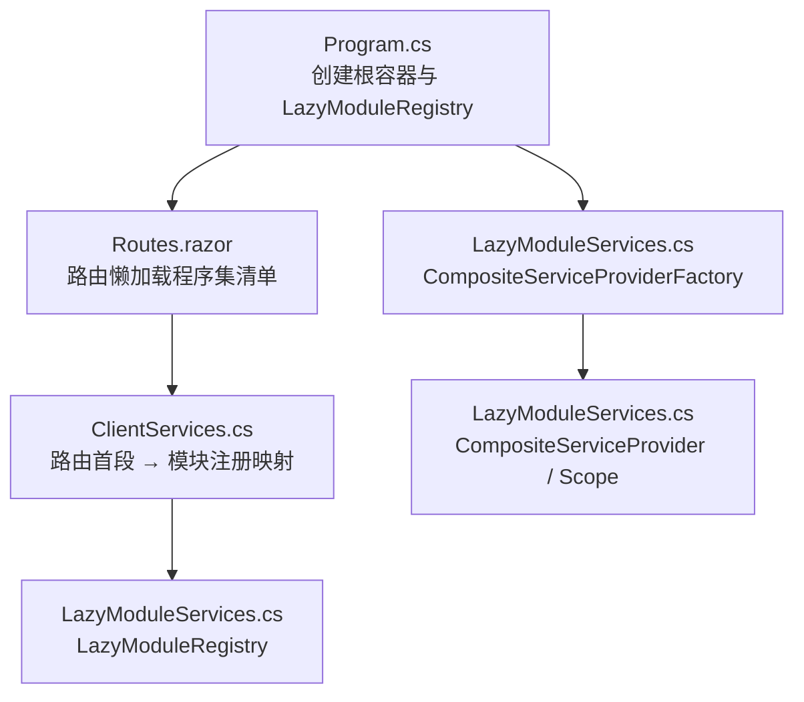
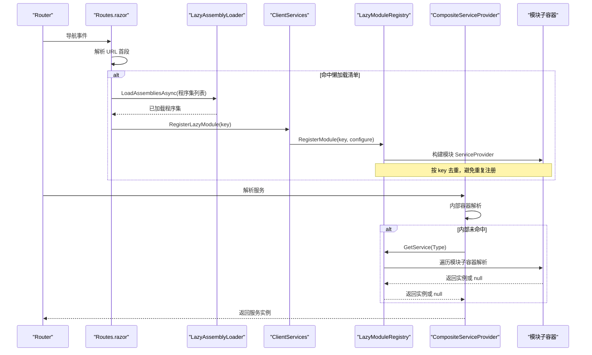
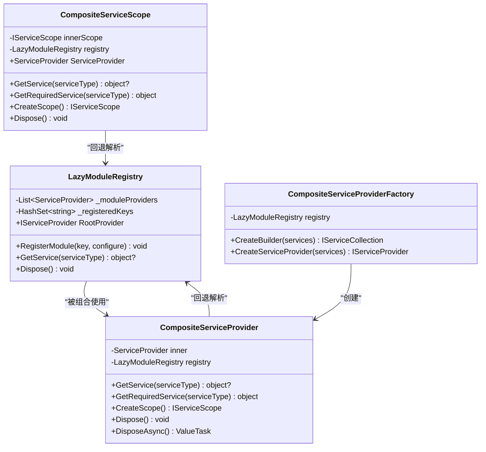
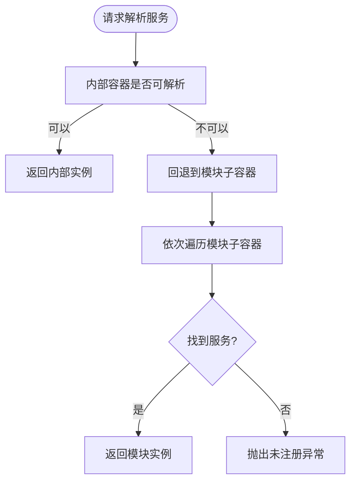
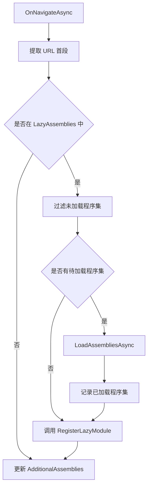
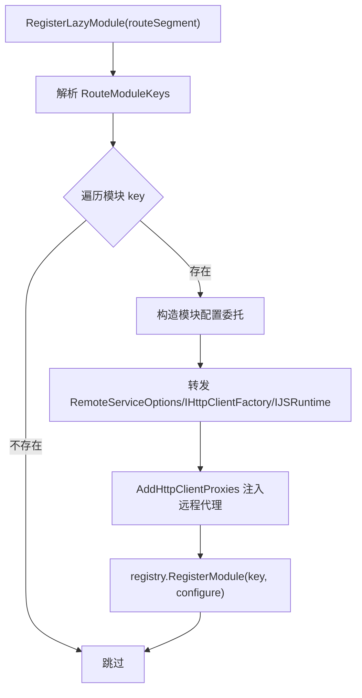
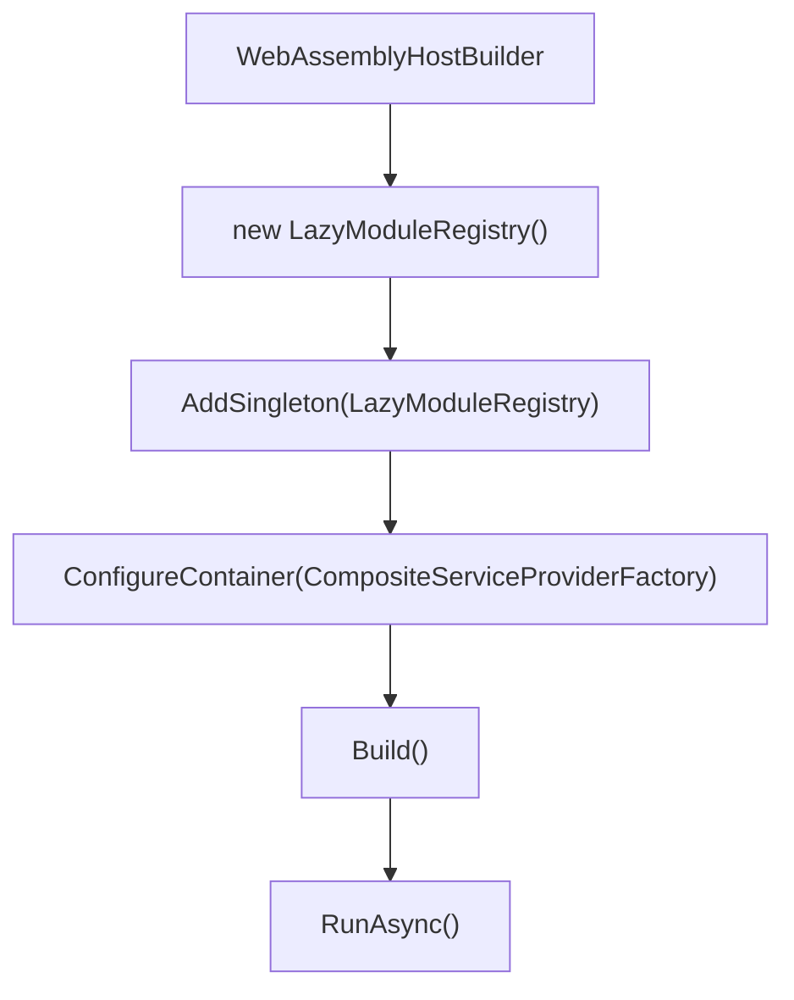
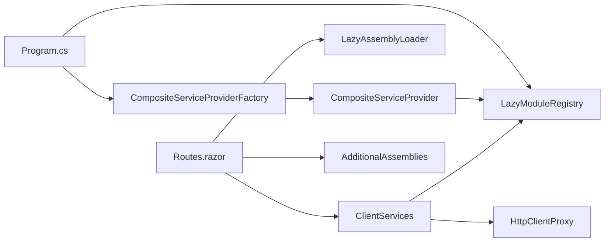
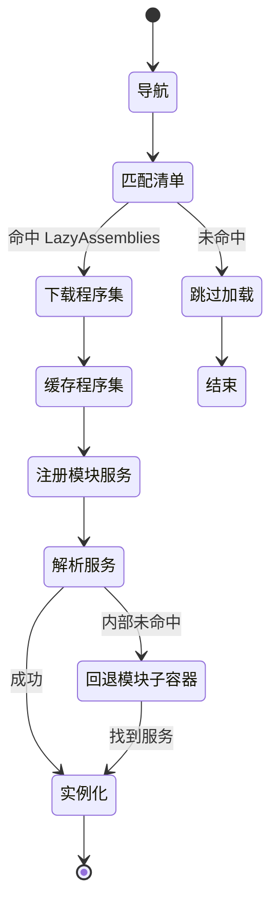

# WebAssembly 懒加载机制

<cite>
**本文引用的文件**
- [LazyModuleServices.cs](file://src/Host/H.AppLab.Web.Host/H.AppLab.Web.Host.Client/LazyModuleServices.cs)
- [Program.cs](file://src/Host/H.AppLab.Web.Host/H.AppLab.Web.Host.Client/Program.cs)
- [Routes.razor](file://src/Host/H.AppLab.Web.Host/H.AppLab.Web.Host.Client/Routes.razor)
- [ClientServices.cs](file://src/Host/H.AppLab.Web.Host/H.AppLab.Web.Host.Client/ClientServices.cs)
- [CookieHandler.cs](file://src/Host/H.AppLab.Web.Host/H.AppLab.Web.Host.Client/CookieHandler.cs)
</cite>

## 目录
1. [引言](#引言)
2. [项目结构](#项目结构)
3. [核心组件](#核心组件)
4. [架构总览](#架构总览)
5. [详细组件分析](#详细组件分析)
6. [依赖关系分析](#依赖关系分析)
7. [性能与模块划分](#性能与模块划分)
8. [生命周期：从导航到实例化](#生命周期从导航到实例化)
9. [调试与故障排查](#调试与故障排查)
10. [结论](#结论)

## 引言
本技术文档聚焦 AppLab Blazor WebAssembly 客户端的懒加载机制。其目标是在应用启动时仅加载首页所需代码，将业务功能按路由首段拆分为独立程序集，在用户首次访问相关页面时才按需下载并注册服务。

该机制围绕以下关键点展开：
- `LazyModuleRegistry`：维护模块子容器、实现按 key 去重的延迟服务注册，以及跨模块服务解析回退。
- `CompositeServiceProvider` / `CompositeServiceScope`：组合 ABP 内置容器与模块子容器，使运行时新增的服务对后续解析可见。
- `Routes.razor`：根据 URL 首段匹配要懒加载的程序集清单，调用 `AssemblyLoader` 下载并在完成后触发模块服务注册。
- `ClientServices`：集中声明“路由首段 → 模块注册 key → 延迟服务配置”的映射，负责把远程服务代理等模块服务注入到对应模块子容器。

通过这种设计，AppLab 能够显著降低初始包体大小和启动时间，同时保持多模块服务的统一发现与解析体验。

## 项目结构
WebAssembly 懒加载能力集中在 `H.AppLab.Web.Host.Client` 项目中，关键文件如下：

**图示来源**
- [Program.cs:1-13](file://src/Host/H.AppLab.Web.Host/H.AppLab.Web.Host.Client/Program.cs#L1-L13)
- [Routes.razor:1-145](file://src/Host/H.AppLab.Web.Host/H.AppLab.Web.Host.Client/Routes.razor#L1-L145)
- [ClientServices.cs:1-193](file://src/Host/H.AppLab.Web.Host/H.AppLab.Web.Host.Client/ClientServices.cs#L1-L193)
- [LazyModuleServices.cs:1-141](file://src/Host/H.AppLab.Web.Host/H.AppLab.Web.Host.Client/LazyModuleServices.cs#L1-L141)

**章节来源**
- [Program.cs:1-13](file://src/Host/H.AppLab.Web.Host/H.AppLab.Web.Host.Client/Program.cs#L1-L13)
- [Routes.razor:1-145](file://src/Host/H.AppLab.Web.Host/H.AppLab.Web.Host.Client/Routes.razor#L1-L145)
- [ClientServices.cs:1-193](file://src/Host/H.AppLab.Web.Host/H.AppLab.Web.Host.Client/ClientServices.cs#L1-L193)
- [LazyModuleServices.cs:1-141](file://src/Host/H.AppLab.Web.Host/H.AppLab.Web.Host.Client/LazyModuleServices.cs#L1-L141)

## 核心组件
- `LazyModuleRegistry`：模块服务注册表。每个模块构建独立的 `ServiceProvider`；提供按类型解析的查找逻辑；支持 `Dispose` 释放所有模块子容器。
- `CompositeServiceProvider`：包装 ABP 内置容器，优先内部解析，未命中时回退到 `LazyModuleRegistry`。
- `CompositeServiceScope`：包装作用域，保证作用域内解析同样具备回退能力。
- `CompositeServiceProviderFactory`：替换默认容器工厂，构建组合式提供者，并将自身暴露为 `RootProvider`，供模块注册转发基础服务。
- `ClientServices.RegisterLazyModule`：把“路由首段 → 模块 key → 服务配置”映射落地到 `LazyModuleRegistry`。
- `Routes.razor`：维护“路由首段 → 程序集名称数组”的懒加载清单，驱动下载与额外程序集缓存。

**章节来源**
- [LazyModuleServices.cs:1-141](file://src/Host/H.AppLab.Web.Host/H.AppLab.Web.Host.Client/LazyModuleServices.cs#L1-L141)
- [ClientServices.cs:1-193](file://src/Host/H.AppLab.Web.Host/H.AppLab.Web.Host.Client/ClientServices.cs#L1-L193)
- [Routes.razor:1-145](file://src/Host/H.AppLab.Web.Host/H.AppLab.Web.Host.Client/Routes.razor#L1-L145)

## 架构总览
下图展示懒加载的核心交互：路由导航触发程序集下载，下载完成后执行模块服务注册，随后通过组合式服务提供者完成最终服务解析。

**图示来源**
- [Routes.razor:1-145](file://src/Host/H.AppLab.Web.Host/H.AppLab.Web.Host.Client/Routes.razor#L1-L145)
- [ClientServices.cs:1-193](file://src/Host/H.AppLab.Web.Host/H.AppLab.Web.Host.Client/ClientServices.cs#L1-L193)
- [LazyModuleServices.cs:1-141](file://src/Host/H.AppLab.Web.Host/H.AppLab.Web.Host.Client/LazyModuleServices.cs#L1-L141)

## 详细组件分析

### LazyModuleRegistry：模块程序集服务注册表
`LazyModuleRegistry` 是懒加载机制的服务中心。它维护一个模块子容器列表和一个已注册 key 集合，确保同一模块不会重复注册。

主要职责：
- `RegisterModule(key, configure)`：为指定 key 构建新的 `ServiceCollection`，调用传入的配置委托，再构建独立 `ServiceProvider`。
- `GetService(Type)`：依次查询各模块子容器，找到第一个匹配的服务实例。
- `RootProvider`：保存组合式根提供者，用于模块注册时转发基础服务。
- `Dispose()`：释放所有模块子容器，清理内存。

需要注意的实现约束：
- 若 `RootProvider` 尚未初始化就尝试注册模块，会抛出异常。这是为了避免在容器构建前使用尚未就绪的组合式根。
- 模块子容器彼此隔离，后加载模块不会影响已有单例状态，有利于版本演进和多模块共存。

**图示来源**
- [LazyModuleServices.cs:1-141](file://src/Host/H.AppLab.Web.Host/H.AppLab.Web.Host.Client/LazyModuleServices.cs#L1-L141)

**章节来源**
- [LazyModuleServices.cs:1-141](file://src/Host/H.AppLab.Web.Host/H.AppLab.Web.Host.Client/LazyModuleServices.cs#L1-L141)

### CompositeServiceProvider 与 CompositeServiceScope：组合式解析
ABP 的内置容器在构建完成后不再允许追加服务注册。因此，懒加载模块不能直接往根容器注册服务，而是注册到各自模块子容器，再通过组合式提供者进行回退解析。

`CompositeServiceProvider` 的行为：
- 优先从内部 ABP 容器解析服务。
- 如果解析失败，则转交给 `LazyModuleRegistry` 按顺序查找模块子容器。
- 拦截 `IServiceScopeFactory`，返回组合式作用域，以保证作用域内的解析也能回退到模块子容器。

`CompositeServiceScope` 的行为：
- 包装内部作用域，对外暴露组合式解析能力。
- 继续传递作用域工厂，确保嵌套作用域仍能回退到模块子容器。
- 当内部作用域找不到服务时，同样交由 `LazyModuleRegistry` 处理。

**图示来源**
- [LazyModuleServices.cs:1-141](file://src/Host/H.AppLab.Web.Host/H.AppLab.Web.Host.Client/LazyModuleServices.cs#L1-L141)

**章节来源**
- [LazyModuleServices.cs:1-141](file://src/Host/H.AppLab.Web.Host/H.AppLab.Web.Host.Client/LazyModuleServices.cs#L1-L141)

### Routes.razor：路由驱动的懒加载清单
`Routes.razor` 是懒加载的入口点。它维护两个关键映射：
- `LazyAssemblies`：路由首段到需要懒加载的程序集数组。
- `EagerAssemblies`：启动时立即加载的程序集。

导航流程：
1. 从当前 URL 提取首段路径。
2. 在 `LazyAssemblies` 中查找对应程序集列表。
3. 过滤尚未加载的程序集，调用 `AssemblyLoader.LoadAssembliesAsync` 下载。
4. 将已加载程序集加入 `_loadedAssemblies` 缓存。
5. 调用 `ClientServices.RegisterLazyModule` 完成模块服务注册。
6. 更新 `_additionalAssemblies`，让后续路由解析能识别新加载的程序集。

值得注意的设计细节：
- 懒加载清单基于“精确路由首段”，例如 `organization`、`approval`、`workbench`、`system`、`devhome` 等，避免 `/system` 误匹配 `/systemmanagement` 这类更长路径。
- `devhome`、`designengine`、`app` 等低代码相关路由会一次性加载大量 LowCode 基础程序集，因为它们共享渲染引擎和设计器依赖。

**图示来源**
- [Routes.razor:1-145](file://src/Host/H.AppLab.Web.Host/H.AppLab.Web.Host.Client/Routes.razor#L1-L145)

**章节来源**
- [Routes.razor:1-145](file://src/Host/H.AppLab.Web.Host/H.AppLab.Web.Host.Client/Routes.razor#L1-L145)

### ClientServices：模块注册映射与远程代理注入
`ClientServices` 承担两件事：
1. 启动时注册基础 HTTP 客户端、全局 Toast 服务、远端服务代理配置。
2. 定义“路由首段 → 模块注册 key → 延迟服务配置”的映射，并在懒加载程序集下载完成后执行。

关键设计点：
- `RouteModuleKeys`：多个路由可共享同一个模块注册 key。例如 `devhome`、`designengine`、`app` 都共享 `lowcode-render` 和 `lowcode-design`。
- `LazyModuleRegistrations`：每个模块的延迟配置只会在对应 key 首次注册时执行，且 lambda 中的 `typeof` 引用不会触发启动时下载。
- `RegisterLazyModule(routeSegment)`：将路由首段映射到一个或多个模块 key，然后调用 `LazyModuleRegistry.RegisterModule`。
- 模块子容器需要的基础服务，如 `RemoteServiceOptions`、`IHttpClientFactory`、`IJSRuntime`，由注册委托显式从根提供者转发，确保模块内代理工厂能正确解析。

**图示来源**
- [ClientServices.cs:1-193](file://src/Host/H.AppLab.Web.Host/H.AppLab.Web.Host.Client/ClientServices.cs#L1-L193)

**章节来源**
- [ClientServices.cs:1-193](file://src/Host/H.AppLab.Web.Host/H.AppLab.Web.Host.Client/ClientServices.cs#L1-L193)

### Program.cs：组合式容器装配
`Program.cs` 负责创建 `LazyModuleRegistry` 并将其作为单例注入；然后通过 `CompositeServiceProviderFactory` 替换默认容器工厂，使整个应用使用组合式服务提供者。

**图示来源**
- [Program.cs:1-13](file://src/Host/H.AppLab.Web.Host/H.AppLab.Web.Host.Client/Program.cs#L1-L13)

**章节来源**
- [Program.cs:1-13](file://src/Host/H.AppLab.Web.Host/H.AppLab.Web.Host.Client/Program.cs#L1-L13)

## 依赖关系分析
懒加载机制的依赖关系如下：

**图示来源**
- [Program.cs:1-13](file://src/Host/H.AppLab.Web.Host/H.AppLab.Web.Host.Client/Program.cs#L1-L13)
- [Routes.razor:1-145](file://src/Host/H.AppLab.Web.Host/H.AppLab.Web.Host.Client/Routes.razor#L1-L145)
- [ClientServices.cs:1-193](file://src/Host/H.AppLab.Web.Host/H.AppLab.Web.Host.Client/ClientServices.cs#L1-L193)
- [LazyModuleServices.cs:1-141](file://src/Host/H.AppLab.Web.Host/H.AppLab.Web.Host.Client/LazyModuleServices.cs#L1-L141)

### 耦合性与内聚性
- `LazyModuleRegistry` 与 `CompositeServiceProvider` 紧密耦合，但职责清晰：前者管理模块子容器，后者负责组合解析。
- `Routes.razor` 与 `ClientServices` 解耦：前者关注程序集清单，后者关注服务映射。
- `ClientServices` 与具体模块的耦合通过反射代理注册（`AddHttpClientProxies`）实现，避免在启动阶段引入业务程序集。

### 外部依赖
- `Microsoft.AspNetCore.Components.WebAssembly.Services.LazyAssemblyLoader`：负责按需下载程序集。
- `H.Abp.HttpClientProxy`：根据 Contracts 程序集生成 HttpClient 代理。
- `CookieHandler`：为 WASM 发出的 HTTP 请求携带 Cookie 凭据。

**章节来源**
- [LazyModuleServices.cs:1-141](file://src/Host/H.AppLab.Web.Host/H.AppLab.Web.Host.Client/LazyModuleServices.cs#L1-L141)
- [ClientServices.cs:1-193](file://src/Host/H.AppLab.Web.Host/H.AppLab.Web.Host.Client/ClientServices.cs#L1-L193)
- [Routes.razor:1-145](file://src/Host/H.AppLab.Web.Host/H.AppLab.Web.Host.Client/Routes.razor#L1-L145)
- [CookieHandler.cs:1-16](file://src/Host/H.AppLab.Web.Host/H.AppLab.Web.Host.Client/CookieHandler.cs#L1-L16)

## 性能与模块划分
### 对启动性能的影响
- 初始包体更小：只有 Portal 及相关基础程序集在启动时加载。
- 首屏更快：无需等待业务模块程序集下载和 IL 解析。
- 按需加载：用户真正进入某个业务页面时，才触发相应程序集下载和服务注册。

### 模块划分建议
- 以“路由首段”为边界划分模块，例如 `organization`、`approval`、`testing`、`notification`、`order`、`setting`、`supply-chain`、`background-task`、`file`、`account`、`workbench`、`system`。
- 对于低代码相关场景，`devhome`、`designengine`、`app` 属于大型共享依赖组，应视为一个整体懒加载单元，避免多次重复加载 RenderEngine 和 DesignEngine 基础链。
- 公共基础库放在 `EagerAssemblies` 中，确保启动即可用；业务模块只加载最小必要程序集。

### 优化方向
- 控制单个模块程序集体积，避免某一大模块成为瓶颈。
- 合并高度耦合的 Contracts 与服务代理，减少跨模块引用导致的隐式依赖。
- 谨慎使用全局单例，避免模块间共享可变状态引发并发问题。

[本节为通用性能指导，不直接分析具体代码文件]

## 生命周期：从导航到实例化
完整的懒加载生命周期如下：

1. **导航触发**  
   `Routes.razor` 捕获 `OnNavigateAsync`，提取 URL 首段。

2. **程序集清单匹配**  
   根据 `LazyAssemblies` 判断是否需要懒加载程序集。

3. **按需下载程序集**  
   调用 `LazyAssemblyLoader.LoadAssembliesAsync`，下载尚未缓存的程序集。

4. **缓存已加载程序集**  
   将已加载程序集写入 `_loadedAssemblies`，避免重复下载。

5. **延迟注册模块服务**  
   调用 `ClientServices.RegisterLazyModule`，将模块 key 对应的服务配置提交给 `LazyModuleRegistry`。

6. **构建模块子容器**  
   `LazyModuleRegistry.RegisterModule` 构建独立 `ServiceProvider`，并通过 `RootProvider` 转发基础服务。

7. **服务解析**  
   后续任意解析请求由 `CompositeServiceProvider` 先查内部容器，再回退到模块子容器。

8. **实例化最终服务**  
   依赖图解析完成后，框架返回目标服务实例。

**图示来源**
- [Routes.razor:1-145](file://src/Host/H.AppLab.Web.Host/H.AppLab.Web.Host.Client/Routes.razor#L1-L145)
- [ClientServices.cs:1-193](file://src/Host/H.AppLab.Web.Host/H.AppLab.Web.Host.Client/ClientServices.cs#L1-L193)
- [LazyModuleServices.cs:1-141](file://src/Host/H.AppLab.Web.Host/H.AppLab.Web.Host.Client/LazyModuleServices.cs#L1-L141)

**章节来源**
- [Routes.razor:1-145](file://src/Host/H.AppLab.Web.Host/H.AppLab.Web.Host.Client/Routes.razor#L1-L145)
- [ClientServices.cs:1-193](file://src/Host/H.AppLab.Web.Host/H.AppLab.Web.Host.Client/ClientServices.cs#L1-L193)
- [LazyModuleServices.cs:1-141](file://src/Host/H.AppLab.Web.Host/H.AppLab.Web.Host.Client/LazyModuleServices.cs#L1-L141)

## 调试与故障排查

### 常见问题与定位方法

#### 1. 模块服务解析不到
**现象**：页面注入的服务为空，或抛出“未注册服务”异常。  
**可能原因**：
- 路由首段未在 `LazyAssemblies` 中配置。
- 模块 key 未在 `LazyModuleRegistrations` 中注册。
- 模块子容器没有转发必要的基础服务，导致代理工厂无法解析。
- 模块程序集未成功加载。

**排查步骤**：
1. 检查浏览器网络面板，确认对应 `.dll` 是否被下载。
2. 确认 `Routes.razor` 中 `LazyAssemblies` 包含该路由首段。
3. 确认 `ClientServices` 中 `LazyModuleRegistrations` 包含对应模块 key。
4. 确认 `ClientServices.RegisterLazyModule` 在程序集加载后被调用。
5. 检查模块配置委托是否正确转发 `RemoteServiceOptions`、`IHttpClientFactory`、`IJSRuntime`。

**章节来源**
- [Routes.razor:1-145](file://src/Host/H.AppLab.Web.Host/H.AppLab.Web.Host.Client/Routes.razor#L1-L145)
- [ClientServices.cs:1-193](file://src/Host/H.AppLab.Web.Host/H.AppLab.Web.Host.Client/ClientServices.cs#L1-L193)
- [LazyModuleServices.cs:1-141](file://src/Host/H.AppLab.Web.Host/H.AppLab.Web.Host.Client/LazyModuleServices.cs#L1-L141)

#### 2. 重复下载程序集
**现象**：同一程序集被多次请求。  
**可能原因**：
- 同一模块 key 被多次触发注册。
- 路由变化导致多次调用懒加载逻辑。

**缓解方式**：
- `LazyModuleRegistry` 已通过 `_registeredKeys` 去重。
- `Routes.razor` 通过 `_loadedAssemblies` 缓存已加载程序集。

**章节来源**
- [LazyModuleServices.cs:1-141](file://src/Host/H.AppLab.Web.Host/H.AppLab.Web.Host.Client/LazyModuleServices.cs#L1-L141)
- [Routes.razor:1-145](file://src/Host/H.AppLab.Web.Host/H.AppLab.Web.Host.Client/Routes.razor#L1-L145)

#### 3. 后端 API 请求缺少认证 Cookie
**现象**：模块加载成功，但调用远端 API 时鉴权失败。  
**原因**：WASM 默认 fetch 请求不带凭据。  
**解决**：确认 `CookieHandler` 已添加到 HttpClient 消息处理器链。

**章节来源**
- [CookieHandler.cs:1-16](file://src/Host/H.AppLab.Web.Host/H.AppLab.Web.Host.Client/CookieHandler.cs#L1-L16)
- [ClientServices.cs:1-193](file://src/Host/H.AppLab.Web.Host/H.AppLab.Web.Host.Client/ClientServices.cs#L1-L193)

#### 4. 模块子容器无法访问根容器的基础服务
**现象**：模块内代理工厂或某些服务解析失败。  
**原因**：模块配置委托未转发 `RemoteServiceOptions`、`IHttpClientFactory`、`IJSRuntime`。  
**解决**：在 `ClientServices.RegisterLazyModule` 生成的配置委托中显式转发这些基础服务。

**章节来源**
- [ClientServices.cs:1-193](file://src/Host/H.AppLab.Web.Host/H.AppLab.Web.Host.Client/ClientServices.cs#L1-L193)
- [LazyModuleServices.cs:1-141](file://src/Host/H.AppLab.Web.Host/H.AppLab.Web.Host.Client/LazyModuleServices.cs#L1-L141)

#### 5. 重试与失败处理
当前仓库中没有内置统一的懒加载重试策略。建议在 `Routes.razor` 的 `OnNavigateAsync` 中封装重试逻辑：
- 捕获 `LoadAssembliesAsync` 异常。
- 设置最大重试次数和退避间隔。
- 在失败时向用户显示友好提示，并可尝试重新触发导航。
- 记录错误日志，便于线上排查。

由于该行为属于扩展建议而非现有实现，此处不提供具体代码片段。

[本节部分内容为通用故障排查建议，不直接分析具体代码文件]

## 结论
AppLab 的 WebAssembly 懒加载机制通过 `LazyModuleRegistry`、`CompositeServiceProvider`、`Routes.razor` 和 `ClientServices` 的配合，实现了“路由驱动、程序集按需下载、模块服务延迟注册、组合式解析回退”的完整闭环。

其优势在于：
- 显著降低初始包体，提升首屏加载速度。
- 通过模块子容器隔离服务生命周期，避免污染根容器。
- 以路由首段为边界组织模块，便于团队按领域拆分职责。
- 借助 `HttpClientProxy` 与 `CookieHandler`，保持 WASM 客户端与后端服务的统一集成体验。

在实际工程中，建议重点把控：
- 模块边界与依赖清晰度。
- 公共基础程序集与业务模块程序集的合理划分。
- 懒加载失败时的用户体验与可观测性。
- 对 `RootProvider` 基础服务转发的严格校验，避免模块内部解析断裂。

[本节为总结性内容，不直接分析具体代码文件]