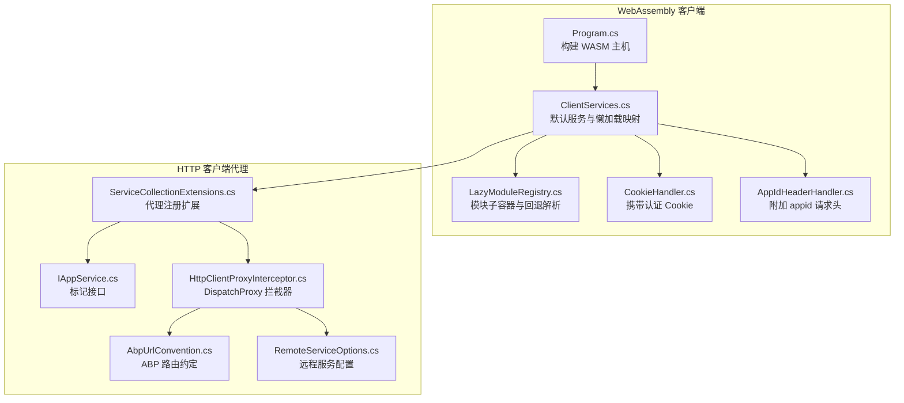
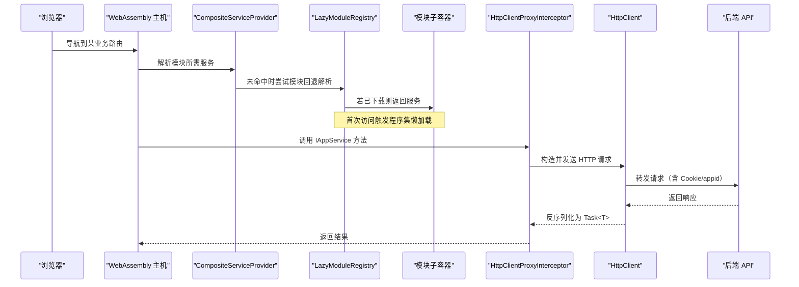
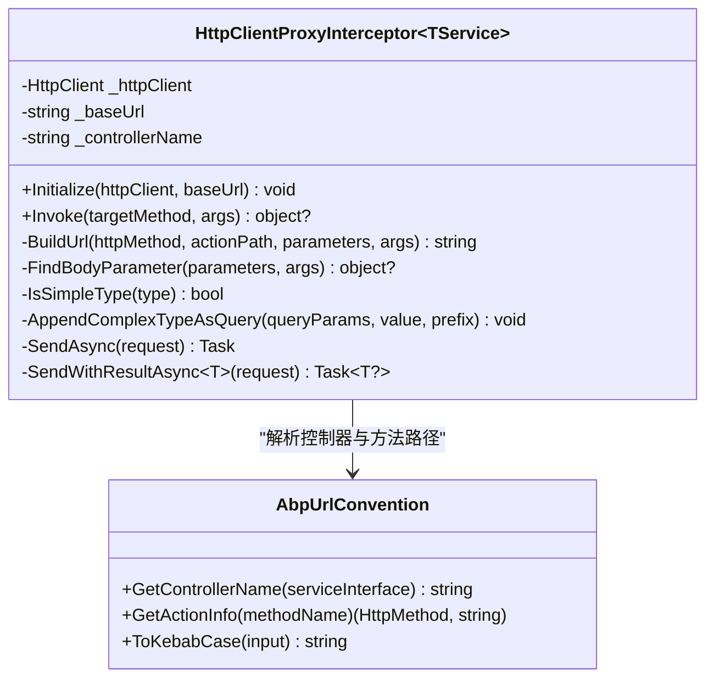
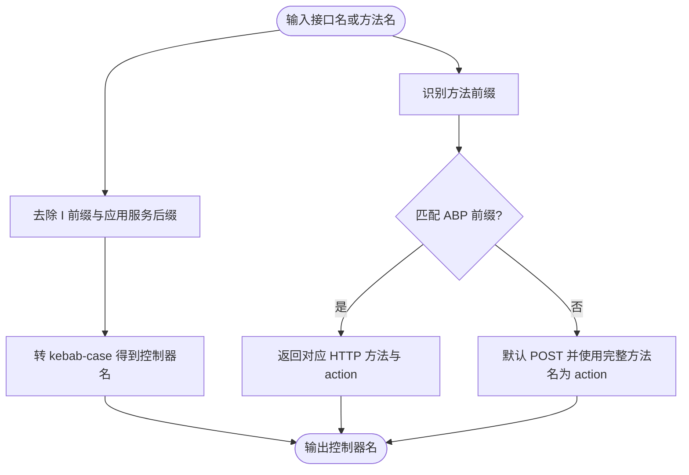
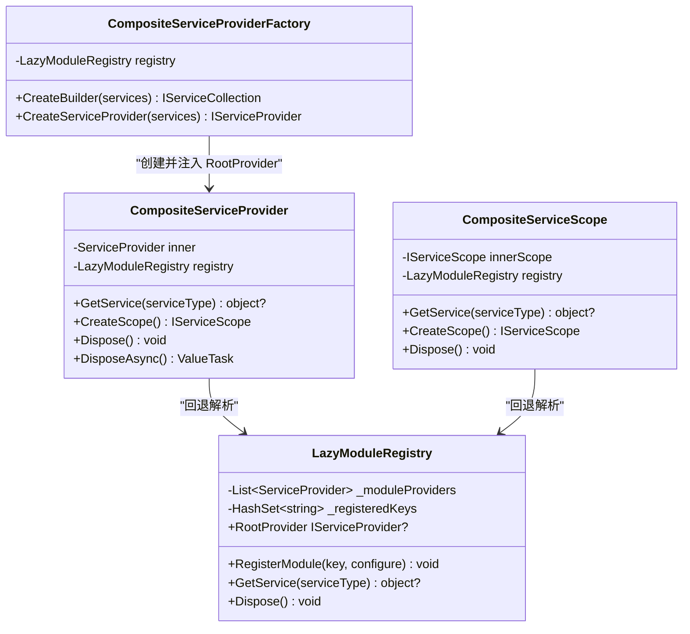
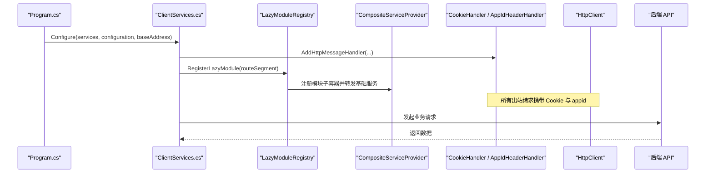
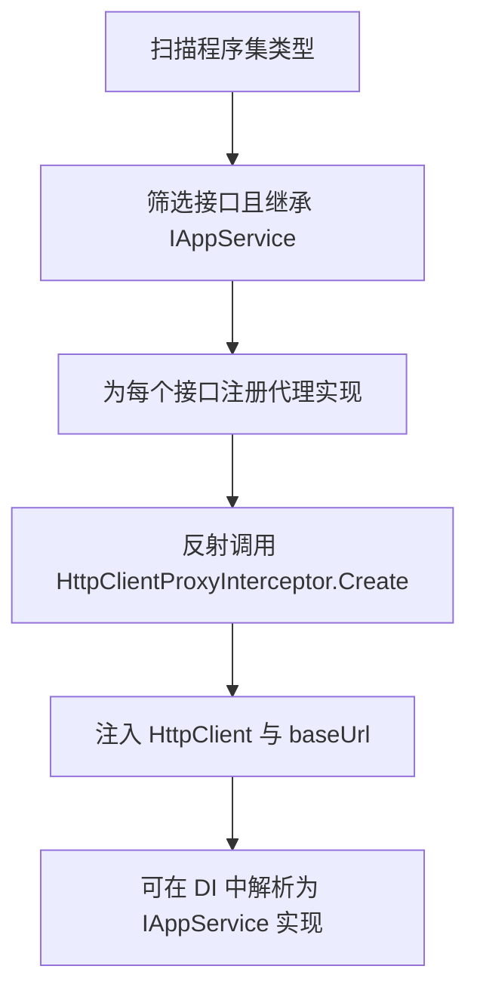
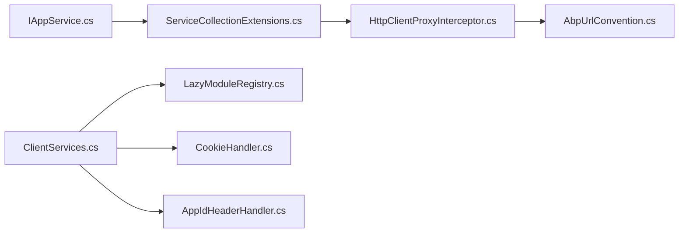

# 前端开发

<cite>
**本文引用的文件**
- [HttpClientProxyInterceptor.cs](file://src/Utils/H.Abp.HttpClientProxy/HttpClientProxyInterceptor.cs)
- [AbpUrlConvention.cs](file://src/Utils/H.Abp.HttpClientProxy/AbpUrlConvention.cs)
- [ServiceCollectionExtensions.cs](file://src/Utils/H.Abp.HttpClientProxy/ServiceCollectionExtensions.cs)
- [RemoteServiceOptions.cs](file://src/Utils/H.Abp.HttpClientProxy/RemoteServiceOptions.cs)
- [IAppService.cs](file://src/Utils/H.Abp.Application.Contracts/IAppService.cs)
- [ICrudAppService.cs](file://src/Utils/H.Abp.Application.Contracts/ICrudAppService.cs)
- [LazyModuleServices.cs](file://src/Host/H.AppLab.Web.Host/H.AppLab.Web.Host.Client/LazyModuleServices.cs)
- [ClientServices.cs](file://src/Host/H.AppLab.Web.Host/H.AppLab.Web.Host.Client/ClientServices.cs)
- [Program.cs](file://src/Host/H.AppLab.Web.Host/H.AppLab.Web.Host.Client/Program.cs)
- [CookieHandler.cs](file://src/Host/H.AppLab.Web.Host/H.AppLab.Web.Host.Client/CookieHandler.cs)
- [AppIdHeaderHandler.cs](file://src/Host/H.AppLab.Web.Host/H.AppLab.Web.Host.Client/AppIdHeaderHandler.cs)
</cite>

## 目录
1. [引言](#引言)
2. [项目结构](#项目结构)
3. [核心组件](#核心组件)
4. [架构总览](#架构总览)
5. [详细组件分析](#详细组件分析)
6. [依赖关系分析](#依赖关系分析)
7. [性能与加载策略](#性能与加载策略)
8. [故障排查指南](#故障排查指南)
9. [结论](#结论)
10. [附录：开发规范与示例](#附录开发规范与示例)

## 引言
本文面向 AppLab 前端开发者，聚焦 Blazor Web App 在该项目中的混合渲染模式（Server + WebAssembly）实现、动态 HTTP 代理机制、WebAssembly 懒加载模块注册方案，以及共享 UI 组件的使用方式。文档同时给出前端组件开发规范、命名约定、测试策略和实际调用后端服务的参考路径。

## 项目结构
本仓库采用多领域微服务 + 模块化前端组织方式：
- Utils 层提供通用基础设施，包括 ABP 风格的 HttpClient 代理、应用契约接口等。
- Host 层包含 Web 宿主客户端，负责启动 WebAssembly 应用、组合依赖注入容器、配置 HTTP 客户端处理器，并管理各业务模块的懒加载。
- Services 层按领域划分多个后端服务；每个服务通常包含 Application、Application.Contracts、EntityFrameworkCore、Web 等项目。
- Components 层提供跨模块复用的 Blazor 组件，例如 AppDrawer。

**图表来源**
- [Program.cs:1-13](file://src/Host/H.AppLab.Web.Host/H.AppLab.Web.Host.Client/Program.cs#L1-L13)
- [ClientServices.cs:1-193](file://src/Host/H.AppLab.Web.Host/H.AppLab.Web.Host.Client/ClientServices.cs#L1-L193)
- [LazyModuleServices.cs:1-141](file://src/Host/H.AppLab.Web.Host/H.AppLab.Web.Host.Client/LazyModuleServices.cs#L1-L141)
- [CookieHandler.cs:1-16](file://src/Host/H.AppLab.Web.Host/H.AppLab.Web.Host.Client/CookieHandler.cs#L1-L16)
- [AppIdHeaderHandler.cs:1-50](file://src/Host/H.AppLab.Web.Host/H.AppLab.Web.Host.Client/AppIdHeaderHandler.cs#L1-L50)
- [HttpClientProxyInterceptor.cs:1-234](file://src/Utils/H.Abp.HttpClientProxy/HttpClientProxyInterceptor.cs#L1-L234)
- [AbpUrlConvention.cs:1-86](file://src/Utils/H.Abp.HttpClientProxy/AbpUrlConvention.cs#L1-L86)
- [ServiceCollectionExtensions.cs:1-63](file://src/Utils/H.Abp.HttpClientProxy/ServiceCollectionExtensions.cs#L1-L63)
- [RemoteServiceOptions.cs:1-33](file://src/Utils/H.Abp.HttpClientProxy/RemoteServiceOptions.cs#L1-L33)

**章节来源**
- [Program.cs:1-13](file://src/Host/H.AppLab.Web.Host/H.AppLab.Web.Host.Client/Program.cs#L1-L13)
- [ClientServices.cs:1-193](file://src/Host/H.AppLab.Web.Host/H.AppLab.Web.Host.Client/ClientServices.cs#L1-L193)

## 核心组件
本节概述 AppLab 前端关键基础设施：
- ABP 风格 HTTP 客户端代理：通过 DispatchProxy 将 IAppService 接口调用转换为 HTTP 请求，自动处理动词前缀、路径参数、查询参数与 JSON Body。
- URL 约定解析：将接口名和方法名转换为 ABP 服务端一致的 kebab-case 路由。
- 依赖注入组合：LazyModuleRegistry 与 CompositeServiceProvider 支持 WebAssembly 运行时按需下载程序集并注册模块服务。
- HTTP 中间件：CookieHandler 保证认证 Cookie 发送；AppIdHeaderHandler 根据路由附加 appid 请求头。

**章节来源**
- [HttpClientProxyInterceptor.cs:1-234](file://src/Utils/H.Abp.HttpClientProxy/HttpClientProxyInterceptor.cs#L1-L234)
- [AbpUrlConvention.cs:1-86](file://src/Utils/H.Abp.HttpClientProxy/AbpUrlConvention.cs#L1-L86)
- [LazyModuleServices.cs:1-141](file://src/Host/H.AppLab.Web.Host/H.AppLab.Web.Host.Client/LazyModuleServices.cs#L1-L141)
- [CookieHandler.cs:1-16](file://src/Host/H.AppLab.Web.Host/H.AppLab.Web.Host.Client/CookieHandler.cs#L1-L16)
- [AppIdHeaderHandler.cs:1-50](file://src/Host/H.AppLab.Web.Host/H.AppLab.Web.Host.Client/AppIdHeaderHandler.cs#L1-L50)

## 架构总览
AppLab 的前端以 Blazor WebAssembly 为主运行环境，结合服务端渲染能力形成混合渲染。WebAssembly 侧不直接耦合具体业务，而是通过“命名 HttpClient + 代理工厂”的方式，按路由触发懒加载模块的程序集下载与服务注册，再通过组合式 ServiceProvider 在模块子容器中解析服务。

**图表来源**
- [Program.cs:1-13](file://src/Host/H.AppLab.Web.Host/H.AppLab.Web.Host.Client/Program.cs#L1-L13)
- [ClientServices.cs:1-193](file://src/Host/H.AppLab.Web.Host/H.AppLab.Web.Host.Client/ClientServices.cs#L1-L193)
- [LazyModuleServices.cs:1-141](file://src/Host/H.AppLab.Web.Host/H.AppLab.Web.Host.Client/LazyModuleServices.cs#L1-L141)
- [HttpClientProxyInterceptor.cs:1-234](file://src/Utils/H.Abp.HttpClientProxy/HttpClientProxyInterceptor.cs#L1-L234)

## 详细组件分析

### 动态 HTTP 代理：HttpClientProxyInterceptor
该组件基于 System.Net.DispatchProxy 实现，拦截对 IAppService 接口的调用，并将方法签名转换为 HTTP 请求。其职责包括：
- 初始化：接收 HttpClient 与 baseUrl，并通过 AbpUrlConvention 生成控制器名称。
- Invoke 拦截：解析目标方法，获取 HTTP 方法与 action 路径，构造 HttpRequestMessage。
- 参数处理：
  - id 参数作为路径段插入在控制器之后、action 之前。
  - 以 Id 结尾的参数且仅有一个时，追加在 action 之后。
  - GET/DELETE 的复杂类型展开为查询参数；POST/PUT 的复杂类型放入 JSON Body。
- 返回值处理：支持 Task 与 Task<T>；T 通过反射动态调用泛型 SendWithResultAsync。

**图表来源**
- [HttpClientProxyInterceptor.cs:1-234](file://src/Utils/H.Abp.HttpClientProxy/HttpClientProxyInterceptor.cs#L1-L234)
- [AbpUrlConvention.cs:1-86](file://src/Utils/H.Abp.HttpClientProxy/AbpUrlConvention.cs#L1-L86)

**章节来源**
- [HttpClientProxyInterceptor.cs:1-234](file://src/Utils/H.Abp.HttpClientProxy/HttpClientProxyInterceptor.cs#L1-L234)

### URL 约定解析：AbpUrlConvention
该工具类保持与 ABP 服务端一致的路由约定：
- GetControllerName：去掉 I 前缀与应用服务后缀，转为 kebab-case。
- GetActionInfo：识别 GetList/GetAll/Get/Put/Update/Delete/Remove/Create/Add/Insert/Post/Patch 等前缀，返回 HTTP 方法与 kebab-case action。
- ToKebabCase：PascalCase → camelCase → kebab-case，确保与 ABP StringExtensions.ToKebabCase 行为一致。

**图表来源**
- [AbpUrlConvention.cs:1-86](file://src/Utils/H.Abp.HttpClientProxy/AbpUrlConvention.cs#L1-L86)

**章节来源**
- [AbpUrlConvention.cs:1-86](file://src/Utils/H.Abp.HttpClientProxy/AbpUrlConvention.cs#L1-L86)

### WebAssembly 懒加载：LazyModuleRegistry 与 CompositeServiceProvider
- LazyModuleRegistry：维护多个模块子容器，按 key 去重注册；提供 GetService 从各子容器顺序解析，未命中返回 null。
- CompositeServiceProvider：包装内部 MEDI 根容器，优先内部解析，失败时回退到 LazyModuleRegistry；同时封装 IServiceScopeFactory，使作用域内解析也具备回退能力。
- CompositeServiceScope：在作用域内同样提供回退逻辑，避免作用域内解析丢失模块服务。
- CompositeServiceProviderFactory：构建根容器后将自身设置为 RootProvider，供模块子容器转发基础服务。

**图表来源**
- [LazyModuleServices.cs:1-141](file://src/Host/H.AppLab.Web.Host/H.AppLab.Web.Host.Client/LazyModuleServices.cs#L1-L141)

**章节来源**
- [LazyModuleServices.cs:1-141](file://src/Host/H.AppLab.Web.Host/H.AppLab.Web.Host.Client/LazyModuleServices.cs#L1-L141)

### 客户端服务注册与 HTTP 中间件
- ClientServices.Configure：
  - 加载 RemoteServices 配置。
  - 注册默认 HttpClient（BaseAddress 为宿主地址）。
  - 注册全局 HToastService。
  - 为每个命名 HttpClient 添加 CookieHandler 与 AppIdHeaderHandler。
  - 针对 TestingRemoteServiceName 设置无限超时，避免长时间测试用例被取消。
  - 定义 RouteModuleKeys 将路由首段映射到模块注册 key。
  - 定义 LazyModuleRegistrations 字典，保存各模块的延迟注册委托。
  - RegisterLazyModule：根据路由首段获取模块 key，调用 LazyModuleRegistry.RegisterModule 完成服务注册。
- CookieHandler：使用 SetBrowserRequestCredentials(BrowserRequestCredentials.Include) 让 fetch 请求携带认证 Cookie。
- AppIdHeaderHandler：从 NavigationManager 解析 /app/{appId}/... 或 /designer/{appId}/...，并在请求头中添加 appid。

**图表来源**
- [Program.cs:1-13](file://src/Host/H.AppLab.Web.Host/H.AppLab.Web.Host.Client/Program.cs#L1-L13)
- [ClientServices.cs:1-193](file://src/Host/H.AppLab.Web.Host/H.AppLab.Web.Host.Client/ClientServices.cs#L1-L193)
- [LazyModuleServices.cs:1-141](file://src/Host/H.AppLab.Web.Host/H.AppLab.Web.Host.Client/LazyModuleServices.cs#L1-L141)
- [CookieHandler.cs:1-16](file://src/Host/H.AppLab.Web.Host/H.AppLab.Web.Host.Client/CookieHandler.cs#L1-L16)
- [AppIdHeaderHandler.cs:1-50](file://src/Host/H.AppLab.Web.Host/H.AppLab.Web.Host.Client/AppIdHeaderHandler.cs#L1-L50)

**章节来源**
- [ClientServices.cs:1-193](file://src/Host/H.AppLab.Web.Host/H.AppLab.Web.Host.Client/ClientServices.cs#L1-L193)
- [CookieHandler.cs:1-16](file://src/Host/H.AppLab.Web.Host/H.AppLab.Web.Host.Client/CookieHandler.cs#L1-L16)
- [AppIdHeaderHandler.cs:1-50](file://src/Host/H.AppLab.Web.Host/H.AppLab.Web.Host.Client/AppIdHeaderHandler.cs#L1-L50)

### 应用契约与代理注册
- IAppService：标记接口，用于标识可通过 HTTP 代理远程调用的服务接口。
- ICrudAppService：CRUD 应用服务接口，提供 Get/GetList/Create/Update/Delete 的标准方法，返回 BaseOutput 包装的结果。
- ServiceCollectionExtensions.AddHttpClientProxies：扫描程序集中所有继承 IAppService 的接口，为每个接口注册代理实现；代理实例通过反射调用 HttpClientProxyInterceptor.Create，注入 HttpClient 与 baseUrl。

**图表来源**
- [ServiceCollectionExtensions.cs:1-63](file://src/Utils/H.Abp.HttpClientProxy/ServiceCollectionExtensions.cs#L1-L63)
- [IAppService.cs:1-8](file://src/Utils/H.Abp.Application.Contracts/IAppService.cs#L1-L8)
- [ICrudAppService.cs:1-15](file://src/Utils/H.Abp.Application.Contracts/ICrudAppService.cs#L1-L15)

**章节来源**
- [ServiceCollectionExtensions.cs:1-63](file://src/Utils/H.Abp.HttpClientProxy/ServiceCollectionExtensions.cs#L1-L63)
- [IAppService.cs:1-8](file://src/Utils/H.Abp.Application.Contracts/IAppService.cs#L1-L8)
- [ICrudAppService.cs:1-15](file://src/Utils/H.Abp.Application.Contracts/ICrudAppService.cs#L1-L15)

## 依赖关系分析
- 低耦合：IAppService 仅作为标记接口，真正行为由 HttpClientProxyInterceptor 实现，降低业务代码对网络细节的耦合。
- 约定驱动：AbpUrlConvention 统一前后端路由约定，减少手动拼接 URL 的错误概率。
- 可组合性：CompositeServiceProvider 允许在运行时扩展服务提供者，LazyModuleRegistry 使得模块程序集按需加载成为可能。
- HTTP 中间件解耦：CookieHandler 与 AppIdHeaderHandler 分别处理认证与上下文信息，不影响业务逻辑。

**图表来源**
- [IAppService.cs:1-8](file://src/Utils/H.Abp.Application.Contracts/IAppService.cs#L1-L8)
- [ServiceCollectionExtensions.cs:1-63](file://src/Utils/H.Abp.HttpClientProxy/ServiceCollectionExtensions.cs#L1-L63)
- [HttpClientProxyInterceptor.cs:1-234](file://src/Utils/H.Abp.HttpClientProxy/HttpClientProxyInterceptor.cs#L1-L234)
- [AbpUrlConvention.cs:1-86](file://src/Utils/H.Abp.HttpClientProxy/AbpUrlConvention.cs#L1-L86)
- [ClientServices.cs:1-193](file://src/Host/H.AppLab.Web.Host/H.AppLab.Web.Host.Client/ClientServices.cs#L1-L193)
- [LazyModuleServices.cs:1-141](file://src/Host/H.AppLab.Web.Host/H.AppLab.Web.Host.Client/LazyModuleServices.cs#L1-L141)
- [CookieHandler.cs:1-16](file://src/Host/H.AppLab.Web.Host/H.AppLab.Web.Host.Client/CookieHandler.cs#L1-L16)
- [AppIdHeaderHandler.cs:1-50](file://src/Host/H.AppLab.Web.Host/H.AppLab.Web.Host.Client/AppIdHeaderHandler.cs#L1-L50)

**章节来源**
- [ClientServices.cs:1-193](file://src/Host/H.AppLab.Web.Host/H.AppLab.Web.Host.Client/ClientServices.cs#L1-L193)
- [LazyModuleServices.cs:1-141](file://src/Host/H.AppLab.Web.Host/H.AppLab.Web.Host.Client/LazyModuleServices.cs#L1-L141)

## 性能与加载策略
- 初始启动体积优化：仅在首页注册最小必要服务，其余业务模块通过 LazyModuleRegistry 在路由导航时按需加载。
- 模块子容器隔离：每个模块拥有独立子容器，后续模块加载不影响已有单例状态，避免重复初始化与内存泄漏。
- HTTP 超时调整：TestingRemoteServiceName 使用无限超时，避免长时间测试任务被默认超时中断。
- 缓存与复用：HttpClient 通过命名客户端与 DelegatingHandler 复用连接与凭据；JSON 序列化选项使用驼峰命名并忽略大小写，提升兼容性。

[本节为一般性指导，不直接分析具体文件]

## 故障排查指南
- 认证 Cookie 未携带：确认已在命名 HttpClient 上注册 CookieHandler，并确保浏览器允许 Cookie；检查服务端是否启用 Cookie 认证。
- appid 请求头缺失：确认当前路由形如 /app/{appId}/... 或 /designer/{appId}/...，且 AppIdHeaderHandler 能正确解析；检查 NavigationManager.Uri 是否正确。
- 路由不匹配：确认 IAppService 的方法命名符合 ABP 前缀约定（GetList/Get/Put/Delete/Create 等），否则会被默认为 POST 并使用完整方法名作为 action。
- 路径参数异常：确保 id 参数为简单类型且在正确位置；若有多个以 Id 结尾的参数，需显式区分或使用其他命名以避免歧义。
- 懒加载模块未解析：确认 LazyModuleRegistry.RootProvider 已初始化；检查 RegisterLazyModule 是否被调用且 routeSegment 与 RouteModuleKeys 映射一致。
- 测试任务被取消：确认 TestingRemoteServiceName 的 HttpClient 已设置为无限超时；检查后端是否及时返回结果。

**章节来源**
- [CookieHandler.cs:1-16](file://src/Host/H.AppLab.Web.Host/H.AppLab.Web.Host.Client/CookieHandler.cs#L1-L16)
- [AppIdHeaderHandler.cs:1-50](file://src/Host/H.AppLab.Web.Host/H.AppLab.Web.Host.Client/AppIdHeaderHandler.cs#L1-L50)
- [AbpUrlConvention.cs:1-86](file://src/Utils/H.Abp.HttpClientProxy/AbpUrlConvention.cs#L1-L86)
- [HttpClientProxyInterceptor.cs:1-234](file://src/Utils/H.Abp.HttpClientProxy/HttpClientProxyInterceptor.cs#L1-L234)
- [ClientServices.cs:1-193](file://src/Host/H.AppLab.Web.Host/H.AppLab.Web.Host.Client/ClientServices.cs#L1-L193)
- [LazyModuleServices.cs:1-141](file://src/Host/H.AppLab.Web.Host/H.AppLab.Web.Host.Client/LazyModuleServices.cs#L1-L141)

## 结论
AppLab 前端通过 ABP 风格的 HTTP 客户端代理与统一的 URL 约定，实现了强类型的接口调用与简洁的网络抽象；借助 LazyModuleRegistry 与 CompositeServiceProvider，WebAssembly 应用能够在运行时按需加载模块并组合服务提供者；CookieHandler 与 AppIdHeaderHandler 将认证与上下文信息透明地注入到每个出站请求。整体架构兼顾了可扩展性与性能，适合大型前端工程的分模块协作。

[本节为总结性内容，不直接分析具体文件]

## 附录：开发规范与示例

### 前端组件开发规范
- 命名约定：
  - 组件类名使用 PascalCase，文件名与组件名保持一致。
  - IAppService 接口遵循 ABP 命名：以 AppService 或 ApplicationService 结尾；方法使用 GetList/Get/Put/Delete/Create 等前缀。
  - 路由首段应明确表达模块语义，便于 LazyModuleRegistry 映射。
- 代码风格：
  - 异步操作使用 async/await，避免阻塞 UI 线程。
  - 错误处理使用 try/catch 捕获网络异常，并结合 HToastService 提示用户。
  - 复杂类型参数尽量拆分为小对象，便于查询参数展开与 JSON Body 序列化。
- 测试策略：
  - 单元测试覆盖 AbpUrlConvention 的 ToKebabCase 与 GetActionInfo 行为。
  - 集成测试验证 HttpClientProxyInterceptor 生成的 URL 与 Body 是否符合后端预期。
  - 针对 TestingRemoteServiceName 的任务执行，增加超时与取消场景的回归测试。

[本节为一般性指导，不直接分析具体文件]

### 调用后端服务与异步处理示例路径
- 注册远程服务与代理：
  - 参见 [ServiceCollectionExtensions.cs:1-63](file://src/Utils/H.Abp.HttpClientProxy/ServiceCollectionExtensions.cs#L1-L63)。
- 配置命名 HttpClient 与中间件：
  - 参见 [ClientServices.cs:1-193](file://src/Host/H.AppLab.Web.Host/H.AppLab.Web.Host.Client/ClientServices.cs#L1-L193)。
- 懒加载模块注册：
  - 参见 [ClientServices.cs:1-193](file://src/Host/H.AppLab.Web.Host/H.AppLab.Web.Host.Client/ClientServices.cs#L1-L193) 与 [LazyModuleServices.cs:1-141](file://src/Host/H.AppLab.Web.Host/H.AppLab.Web.Host.Client/LazyModuleServices.cs#L1-L141)。
- 调用 IAppService 接口：
  - 在 Blazor 组件中注入已注册的 IAppService 实现，调用 Get/List/Create/Update/Delete 等方法，返回值为 BaseOutput 包装的 Task。
  - 参见 [ICrudAppService.cs:1-15](file://src/Utils/H.Abp.Application.Contracts/ICrudAppService.cs#L1-L15)。

**章节来源**
- [ServiceCollectionExtensions.cs:1-63](file://src/Utils/H.Abp.HttpClientProxy/ServiceCollectionExtensions.cs#L1-L63)
- [ClientServices.cs:1-193](file://src/Host/H.AppLab.Web.Host/H.AppLab.Web.Host.Client/ClientServices.cs#L1-L193)
- [LazyModuleServices.cs:1-141](file://src/Host/H.AppLab.Web.Host/H.AppLab.Web.Host.Client/LazyModuleServices.cs#L1-L141)
- [ICrudAppService.cs:1-15](file://src/Utils/H.Abp.Application.Contracts/ICrudAppService.cs#L1-L15)