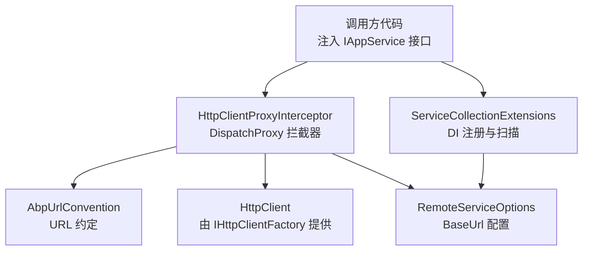
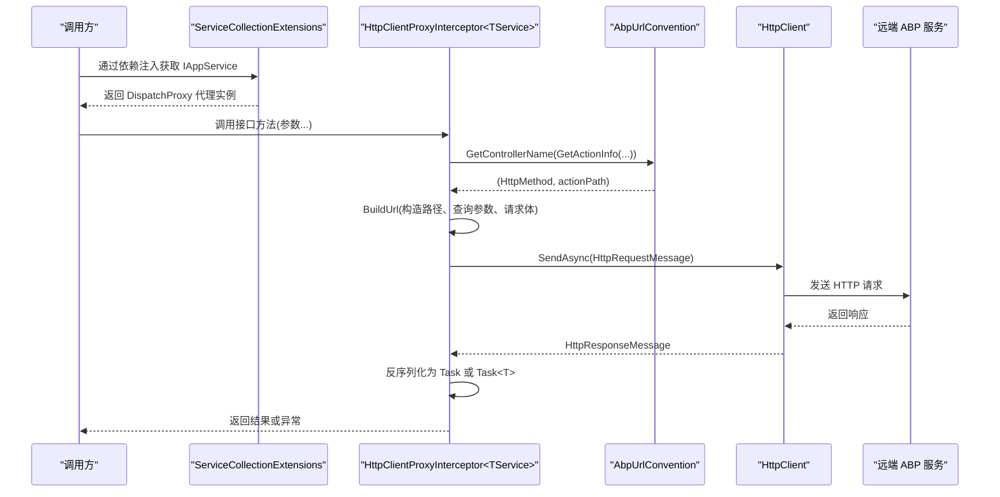
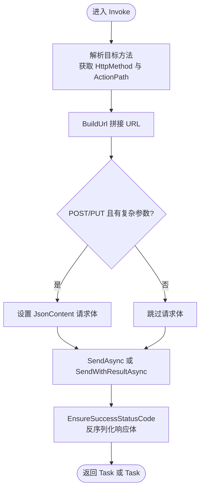
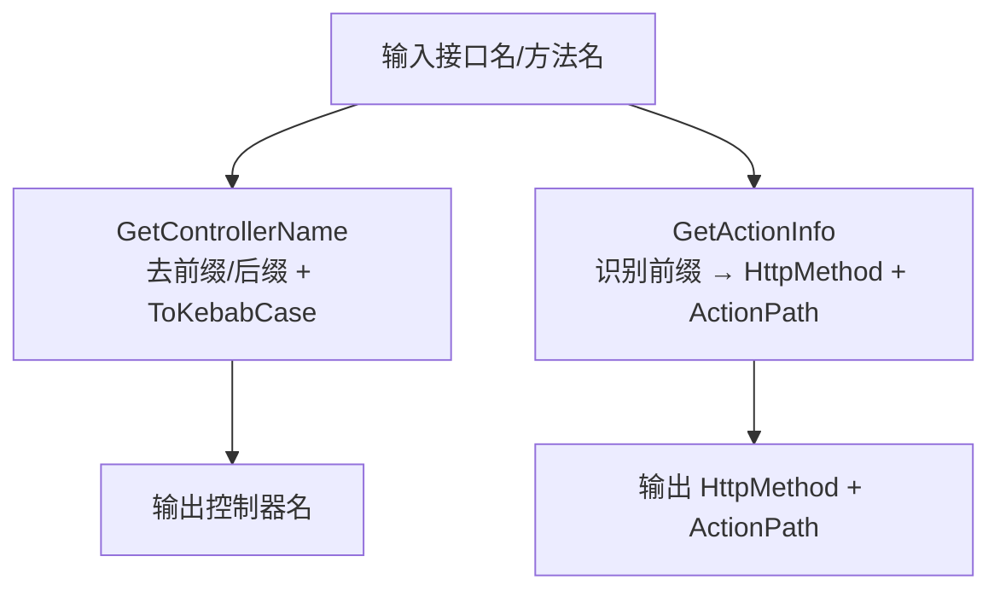
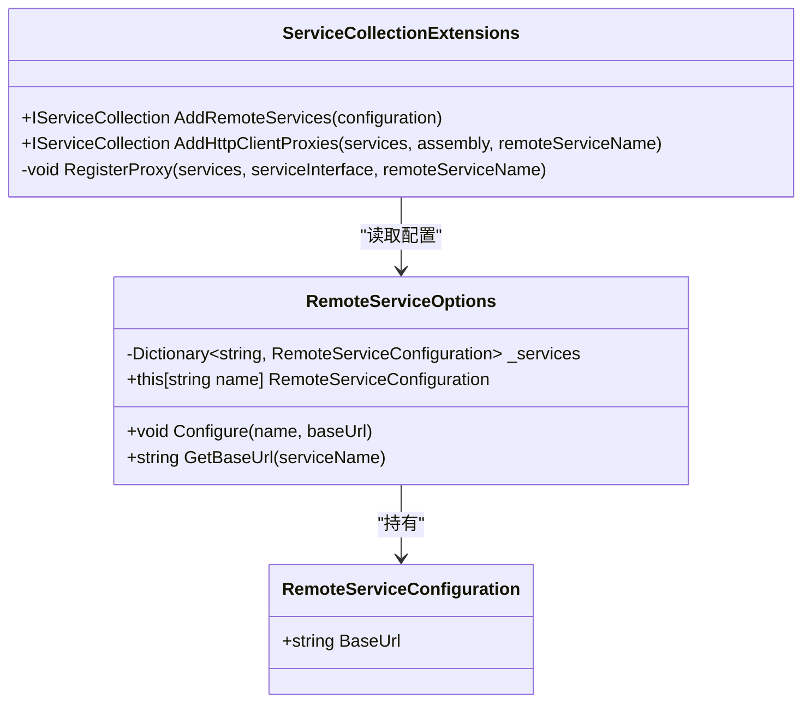
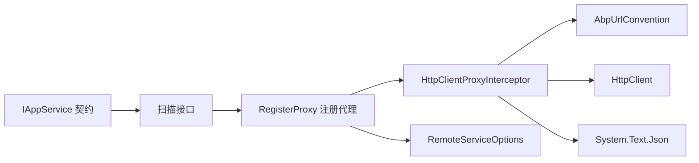

# 动态 HTTP 代理机制

<cite>
**本文引用的文件**
- [HttpClientProxyInterceptor.cs](file://src/Utils/H.Abp.HttpClientProxy/HttpClientProxyInterceptor.cs)
- [AbpUrlConvention.cs](file://src/Utils/H.Abp.HttpClientProxy/AbpUrlConvention.cs)
- [RemoteServiceOptions.cs](file://src/Utils/H.Abp.HttpClientProxy/RemoteServiceOptions.cs)
- [ServiceCollectionExtensions.cs](file://src/Utils/H.Abp.HttpClientProxy/ServiceCollectionExtensions.cs)
- [IAppService.cs](file://src/Utils/H.Abp.Application.Contracts/IAppService.cs)
- [ICrudAppService.cs](file://src/Utils/H.Abp.Application.Contracts/ICrudAppService.cs)
</cite>

## 目录
1. [引言](#引言)
2. [项目结构](#项目结构)
3. [核心组件](#核心组件)
4. [架构总览](#架构总览)
5. [详细组件分析](#详细组件分析)
6. [依赖关系分析](#依赖关系分析)
7. [性能与连接池](#性能与连接池)
8. [使用示例与最佳实践](#使用示例与最佳实践)
9. [故障排查指南](#故障排查指南)
10. [结论](#结论)

## 引言
本技术文档面向 AppLab 中的“动态 HTTP 代理机制”，重点解释客户端如何通过 `HttpClientProxyInterceptor<TService>` 拦截对 `IAppService` 接口方法的调用，并将其自动转换为 HTTP 请求。同时说明 `AbpUrlConvention` 如何将接口名与方法名映射为 ABP 风格的 RESTful URL，包括 kebab-case 转换、HTTP 动词映射、参数位置约定，以及复杂参数的序列化策略。最后给出配置、异步调用、错误处理、性能优化和连接池管理等实践建议。

## 项目结构
该能力集中在以下两个项目中：
- `H.Abp.Application.Contracts`：定义应用服务契约（如 `IAppService`、`ICrudAppService`）。
- `H.Abp.HttpClientProxy`：实现基于 `System.Reflection.DispatchProxy` 的动态 HTTP 代理、ABP URL 约定、远程服务选项与 DI 扩展。

**图示来源**
- [HttpClientProxyInterceptor.cs:1-234](file://src/Utils/H.Abp.HttpClientProxy/HttpClientProxyInterceptor.cs#L1-L234)
- [AbpUrlConvention.cs:1-86](file://src/Utils/H.Abp.HttpClientProxy/AbpUrlConvention.cs#L1-L86)
- [RemoteServiceOptions.cs:1-33](file://src/Utils/H.Abp.HttpClientProxy/RemoteServiceOptions.cs#L1-L33)
- [ServiceCollectionExtensions.cs:1-63](file://src/Utils/H.Abp.HttpClientProxy/ServiceCollectionExtensions.cs#L1-L63)

**章节来源**
- [HttpClientProxyInterceptor.cs:1-234](file://src/Utils/H.Abp.HttpClientProxy/HttpClientProxyInterceptor.cs#L1-L234)
- [AbpUrlConvention.cs:1-86](file://src/Utils/H.Abp.HttpClientProxy/AbpUrlConvention.cs#L1-L86)
- [RemoteServiceOptions.cs:1-33](file://src/Utils/H.Abp.HttpClientProxy/RemoteServiceOptions.cs#L1-L33)
- [ServiceCollectionExtensions.cs:1-63](file://src/Utils/H.Abp.HttpClientProxy/ServiceCollectionExtensions.cs#L1-L63)
- [IAppService.cs:1-8](file://src/Utils/H.Abp.Application.Contracts/IAppService.cs#L1-L8)
- [ICrudAppService.cs:1-15](file://src/Utils/H.Abp.Application.Contracts/ICrudAppService.cs#L1-L15)

## 核心组件
- `HttpClientProxyInterceptor<TService>`：基于 `DispatchProxy` 的代理拦截器，负责将接口方法调用转换为 HTTP 请求与响应解析。
- `AbpUrlConvention`：将接口名与方法名转换为 ABP 风格 URL 的工具类，包含控制器名生成、动作路径推导、kebab-case 转换等。
- `RemoteServiceOptions` / `RemoteServiceConfiguration`：从配置读取远程服务的 BaseUrl。
- `ServiceCollectionExtensions`：提供 DI 扩展，扫描程序集中所有继承 `IAppService` 的接口并注册代理实例。
- `IAppService` / `ICrudAppService`：标记与应用服务契约，供扫描与代理生成使用。

**章节来源**
- [HttpClientProxyInterceptor.cs:1-234](file://src/Utils/H.Abp.HttpClientProxy/HttpClientProxyInterceptor.cs#L1-L234)
- [AbpUrlConvention.cs:1-86](file://src/Utils/H.Abp.HttpClientProxy/AbpUrlConvention.cs#L1-L86)
- [RemoteServiceOptions.cs:1-33](file://src/Utils/H.Abp.HttpClientProxy/RemoteServiceOptions.cs#L1-L33)
- [ServiceCollectionExtensions.cs:1-63](file://src/Utils/H.Abp.HttpClientProxy/ServiceCollectionExtensions.cs#L1-L63)
- [IAppService.cs:1-8](file://src/Utils/H.Abp.Application.Contracts/IAppService.cs#L1-L8)
- [ICrudAppService.cs:1-15](file://src/Utils/H.Abp.Application.Contracts/ICrudAppService.cs#L1-L15)

## 架构总览
下图展示了从调用方到远端服务的完整链路：

**图示来源**
- [ServiceCollectionExtensions.cs:1-63](file://src/Utils/H.Abp.HttpClientProxy/ServiceCollectionExtensions.cs#L1-L63)
- [HttpClientProxyInterceptor.cs:1-234](file://src/Utils/H.Abp.HttpClientProxy/HttpClientProxyInterceptor.cs#L1-L234)
- [AbpUrlConvention.cs:1-86](file://src/Utils/H.Abp.HttpClientProxy/AbpUrlConvention.cs#L1-L86)

## 详细组件分析

### 组件一：HttpClientProxyInterceptor<TService>
职责概述
- 通过 `DispatchProxy` 拦截 `TService` 接口的方法调用。
- 根据方法签名与参数生成 HTTP 方法与 URL。
- 将复杂类型参数放入 POST/PUT 的请求体；简单类型作为查询参数。
- 将 `Task` 或 `Task<T>` 返回值映射为异步结果，并对空响应与纯文本响应做兼容处理。
- 使用统一的 `JsonSerializerOptions`（驼峰命名、大小写不敏感）进行 JSON 序列化与反序列化。

关键流程
- `Invoke`：解析方法信息，调用 `AbpUrlConvention.GetActionInfo` 得到 HTTP 方法与动作路径，然后构建 URL 与请求体，最终分发到 `SendAsync` 或 `SendWithResultAsync`。
- `BuildUrl`：拼接 `/api/app/{controller}`，按 ABP 约定处理 `id` 与以 `Id` 结尾的参数作为路径段，其余简单参数转为查询参数，GET/DELETE 时把复杂对象展开为扁平查询参数。
- `FindBodyParameter`：在 POST/PUT 时选择第一个非简单类型参数作为请求体。
- `IsSimpleType` / `ToCamelCase` / `FormatValue`：判断简单类型、名称小驼峰转换、值格式化（DateTime/DateTimeOffset/bool 等）。
- `SendAsync` / `SendWithResultAsync<T>`：执行 HTTP 请求，确保成功状态码，并将响应体反序列化为所需类型。

**图示来源**
- [HttpClientProxyInterceptor.cs:1-234](file://src/Utils/H.Abp.HttpClientProxy/HttpClientProxyInterceptor.cs#L1-L234)

设计要点
- 仅支持 `Task` 与 `Task<T>` 返回值，其他返回类型会抛出异常。
- 对空响应体返回默认值；对纯文本响应且目标类型为 `string` 的情况直接返回原文。
- JSON 序列化使用驼峰命名，属性名匹配时忽略大小写，提高与后端 JSON 约定的兼容性。

**章节来源**
- [HttpClientProxyInterceptor.cs:1-234](file://src/Utils/H.Abp.HttpClientProxy/HttpClientProxyInterceptor.cs#L1-L234)

### 组件二：AbpUrlConvention
职责概述
- 从接口类型推导控制器名：去除前缀 `I` 与后缀 `AppService`/`ApplicationService`，再转 kebab-case。
- 从方法名推导 HTTP 动词与动作路径：识别 ABP 前缀（GetList、Create、Update 等），无匹配则默认 POST。
- 提供 kebab-case 转换工具，与 ABP 服务端路由保持一致。

规则摘要
- 控制器名映射：`IPageAppService` → `page`，`IAppApplicationService` → `app-application`。
- 方法前缀映射：
  - GET：GetList、GetAll、Get
  - PUT：Put、Update
  - DELETE：Delete、Remove
  - POST：Create、Add、Insert、Post
  - PATCH：Patch
- kebab-case：先 camelCase 再拆分，例如 `GetById` → `get-by-id`。

**图示来源**
- [AbpUrlConvention.cs:1-86](file://src/Utils/H.Abp.HttpClientProxy/AbpUrlConvention.cs#L1-L86)

**章节来源**
- [AbpUrlConvention.cs:1-86](file://src/Utils/H.Abp.HttpClientProxy/AbpUrlConvention.cs#L1-L86)

### 组件三：RemoteServiceOptions 与 ServiceCollectionExtensions
职责概述
- `RemoteServiceOptions`：维护一个字典，存储各远程服务名称对应的 `BaseUrl`。
- `ServiceCollectionExtensions`：
  - `AddRemoteServices`：从 `IConfiguration` 的 `RemoteServices` 节点加载配置。
  - `AddHttpClientProxies`：扫描指定程序集中所有继承 `IAppService` 的接口，注册为 DI 的代理实现。
  - 每个代理实例通过 `IHttpClientFactory.CreateClient(remoteServiceName)` 获取 `HttpClient`，并使用反射调用 `HttpClientProxyInterceptor<TService>.Create` 完成初始化。

**图示来源**
- [RemoteServiceOptions.cs:1-33](file://src/Utils/H.Abp.HttpClientProxy/RemoteServiceOptions.cs#L1-L33)
- [ServiceCollectionExtensions.cs:1-63](file://src/Utils/H.Abp.HttpClientProxy/ServiceCollectionExtensions.cs#L1-L63)

**章节来源**
- [RemoteServiceOptions.cs:1-33](file://src/Utils/H.Abp.HttpClientProxy/RemoteServiceOptions.cs#L1-L33)
- [ServiceCollectionExtensions.cs:1-63](file://src/Utils/H.Abp.HttpClientProxy/ServiceCollectionExtensions.cs#L1-L63)

### 组件四：IAppService 与 ICrudAppService
- `IAppService`：标记接口，用于扫描可代理的服务接口。
- `ICrudAppService<TEntityDto, TKey, TGetListInput, TCreateInput, TUpdateInput>`：与 ABP 风格一致的 CRUD 接口，便于自动生成常用增删改查 API。

这些契约定义了调用方的统一抽象，具体实现位于远端 ABP 服务中，客户端仅依赖契约并通过动态代理访问。

**章节来源**
- [IAppService.cs:1-8](file://src/Utils/H.Abp.Application.Contracts/IAppService.cs#L1-L8)
- [ICrudAppService.cs:1-15](file://src/Utils/H.Abp.Application.Contracts/ICrudAppService.cs#L1-L15)

## 依赖关系分析
- `HttpClientProxyInterceptor<TService>` 依赖：
  - `AbpUrlConvention`：URL 约定。
  - `HttpClient`：网络请求。
  - `System.Text.Json`：JSON 序列化与反序列化。
  - `System.Web.HttpUtility`：URL 编码。
- `ServiceCollectionExtensions` 依赖：
  - `Microsoft.Extensions.Configuration`：读取配置。
  - `Microsoft.Extensions.DependencyInjection`：DI 注册。
  - `IAppService`：扫描契约。
- `RemoteServiceOptions` 被 `ServiceCollectionExtensions` 与代理创建过程使用。

**图示来源**
- [ServiceCollectionExtensions.cs:1-63](file://src/Utils/H.Abp.HttpClientProxy/ServiceCollectionExtensions.cs#L1-L63)
- [HttpClientProxyInterceptor.cs:1-234](file://src/Utils/H.Abp.HttpClientProxy/HttpClientProxyInterceptor.cs#L1-L234)
- [AbpUrlConvention.cs:1-86](file://src/Utils/H.Abp.HttpClientProxy/AbpUrlConvention.cs#L1-L86)

**章节来源**
- [ServiceCollectionExtensions.cs:1-63](file://src/Utils/H.Abp.HttpClientProxy/ServiceCollectionExtensions.cs#L1-L63)
- [HttpClientProxyInterceptor.cs:1-234](file://src/Utils/H.Abp.HttpClientProxy/HttpClientProxyInterceptor.cs#L1-L234)
- [AbpUrlConvention.cs:1-86](file://src/Utils/H.Abp.HttpClientProxy/AbpUrlConvention.cs#L1-L86)

## 性能与连接池
- `HttpClient` 生命周期：
  - 代理通过 `IHttpClientFactory.CreateClient(remoteServiceName)` 获取 `HttpClient`，这通常意味着受工厂管理的连接复用与 DNS 刷新，避免 socket 耗尽问题。
  - 建议在宿主应用启动时正确注册 `HttpClient` 并命名为 `remoteServiceName`，以便代理能按名称创建客户端。
- 超时与重试：
  - 当前代理未内置超时或重试逻辑。应在 `HttpClient` 配置中设置 `Timeout`，并结合 Polly 等库添加重试策略。
- 并发与线程安全：
  - `HttpClient` 实例由工厂管理，适合多线程并发调用。
  - 代理本身无状态，每次调用都会构造新的 `HttpRequestMessage`，开销较低。
- JSON 序列化性能：
  - 使用共享的 `JsonSerializerOptions`（驼峰命名、忽略大小写），减少重复创建选项对象的成本。
- 资源释放：
  - 代理内部不持有需手动释放的资源；`HttpClient` 的生命周期由 `IHttpClientFactory` 管理。

[本节为通用指导，不涉及具体文件分析]

## 使用示例与最佳实践

### 定义 IAppService 接口
- 创建一个继承自 `IAppService` 的接口，例如 `IPageAppService`。
- 方法命名遵循 ABP 前缀规范（GetList、Get、Create、Update、Delete 等），以便 `AbpUrlConvention` 正确映射为 HTTP 方法与路径。
- 对于需要路径段的参数，优先使用名为 `id` 的参数，或使用以 `Id` 结尾的参数（当存在 action 路径时）。

参考契约定义：
- [IAppService.cs:1-8](file://src/Utils/H.Abp.Application.Contracts/IAppService.cs#L1-L8)
- [ICrudAppService.cs:1-15](file://src/Utils/H.Abp.Application.Contracts/ICrudAppService.cs#L1-L15)

### 注入代理实例
- 在宿主应用启动时：
  - 调用 `AddRemoteServices(configuration)` 从 `RemoteServices` 配置节点读取 BaseUrl。
  - 调用 `AddHttpClientProxies(assembly, remoteServiceName)` 扫描接口并注册代理。
  - 配置 `HttpClient`（命名客户端），以便 `IHttpClientFactory` 按名称创建。
- 在业务层或服务层中直接注入 `IAppService` 的实现（实际为代理），像调用本地方法一样调用远端 API。

参考注册逻辑：
- [ServiceCollectionExtensions.cs:1-63](file://src/Utils/H.Abp.HttpClientProxy/ServiceCollectionExtensions.cs#L1-L63)
- [RemoteServiceOptions.cs:1-33](file://src/Utils/H.Abp.HttpClientProxy/RemoteServiceOptions.cs#L1-L33)

### 处理异步调用
- 所有代理方法返回 `Task` 或 `Task<T>`，调用方应使用 `await` 获取结果。
- 若远端返回空响应体，代理会根据返回类型返回默认值；对 `string` 且内容为纯文本的情况直接返回原文。

参考响应处理：
- [HttpClientProxyInterceptor.cs:201-234](file://src/Utils/H.Abp.HttpClientProxy/HttpClientProxyInterceptor.cs#L201-L234)

### 错误处理
- 当远端返回非成功状态码时，代理会抛出异常（`EnsureSuccessStatusCode`）。
- 建议在调用处捕获异常并进行日志记录、重试或降级处理。
- 注意区分业务错误与网络错误：前者可能仍返回 2xx 但包含业务错误码，需在业务层处理。

参考异常触发点：
- [HttpClientProxyInterceptor.cs:201-234](file://src/Utils/H.Abp.HttpClientProxy/HttpClientProxyInterceptor.cs#L201-L234)

### URL 与参数约定示例说明
- 控制器名：
  - `IPageAppService` → `/api/app/page`
- 方法前缀与 HTTP 动词：
  - `GetListAsync` → GET
  - `GetAsync(id)` → GET
  - `CreateAsync(input)` → POST，请求体为 input
  - `UpdateAsync(id, input)` → PUT，请求体为 input
  - `DeleteAsync(id)` → DELETE
- 路径参数：
  - 名为 `id` 的简单类型参数插入到 controller 之后、action 之前。
  - 若存在 action 路径，则恰好一个以 `Id` 结尾的简单类型参数插入到 action 之后。
- 查询参数：
  - 剩余简单类型参数作为查询参数，键名使用小驼峰。
  - GET/DELETE 时，复杂类型参数会被展开为扁平的 `propName=value` 形式查询参数。

参考 URL 构建逻辑：
- [HttpClientProxyInterceptor.cs:1-200](file://src/Utils/H.Abp.HttpClientProxy/HttpClientProxyInterceptor.cs#L1-L200)
- [AbpUrlConvention.cs:1-86](file://src/Utils/H.Abp.HttpClientProxy/AbpUrlConvention.cs#L1-L86)

## 故障排查指南
常见问题与定位步骤
- 无法找到远程服务 BaseUrl：
  - 检查配置文件 `RemoteServices` 节点是否包含对应服务名与 `BaseUrl`。
  - 确认 `AddRemoteServices` 已在应用启动时调用。
  - 参考：[RemoteServiceOptions.cs:1-33](file://src/Utils/H.Abp.HttpClientProxy/RemoteServiceOptions.cs#L1-L33)、[ServiceCollectionExtensions.cs:1-63](file://src/Utils/H.Abp.HttpClientProxy/ServiceCollectionExtensions.cs#L1-L63)
- 接口未被扫描注册：
  - 确认接口继承 `IAppService`，且传入的程序集确实包含该接口。
  - 确认 `AddHttpClientProxies` 使用的程序集参数正确。
  - 参考：[ServiceCollectionExtensions.cs:1-63](file://src/Utils/H.Abp.HttpClientProxy/ServiceCollectionExtensions.cs#L1-L63)
- URL 不匹配或路由错误：
  - 检查接口名与方法名是否符合 ABP 约定（前缀、后缀、大小写）。
  - 检查参数名是否为 `id` 或以 `Id` 结尾（简单类型）。
  - 参考：[AbpUrlConvention.cs:1-86](file://src/Utils/H.Abp.HttpClientProxy/AbpUrlConvention.cs#L1-L86)、[HttpClientProxyInterceptor.cs:1-200](file://src/Utils/H.Abp.HttpClientProxy/HttpClientProxyInterceptor.cs#L1-L200)
- 请求体为空或字段丢失：
  - 确认 POST/PUT 时传入的是复杂类型参数，并且不是简单类型。
  - 检查 JSON 序列化选项（驼峰命名、忽略大小写）是否与后端一致。
  - 参考：[HttpClientProxyInterceptor.cs:1-200](file://src/Utils/H.Abp.HttpClientProxy/HttpClientProxyInterceptor.cs#L1-L200)
- 响应反序列化失败：
  - 检查返回类型与方法签名是否一致。
  - 若后端返回纯文本字符串，请确保方法返回类型为 `string`。
  - 参考：[HttpClientProxyInterceptor.cs:201-234](file://src/Utils/H.Abp.HttpClientProxy/HttpClientProxyInterceptor.cs#L201-L234)

**章节来源**
- [RemoteServiceOptions.cs:1-33](file://src/Utils/H.Abp.HttpClientProxy/RemoteServiceOptions.cs#L1-L33)
- [ServiceCollectionExtensions.cs:1-63](file://src/Utils/H.Abp.HttpClientProxy/ServiceCollectionExtensions.cs#L1-L63)
- [AbpUrlConvention.cs:1-86](file://src/Utils/H.Abp.HttpClientProxy/AbpUrlConvention.cs#L1-L86)
- [HttpClientProxyInterceptor.cs:1-234](file://src/Utils/H.Abp.HttpClientProxy/HttpClientProxyInterceptor.cs#L1-L234)

## 结论
AppLab 的动态 HTTP 代理机制通过 `HttpClientProxyInterceptor<TService>` 与 `AbpUrlConvention` 实现了“接口即 API”的开发体验：开发者只需定义符合 ABP 约定的 `IAppService` 接口，即可在运行时获得自动生成的 HTTP 客户端代理。该方案简化了跨服务调用的样板代码，提升了开发效率与一致性。在生产环境中，应结合 `IHttpClientFactory`、超时与重试策略、日志与监控来保障稳定性与性能。

[本节为总结性内容，不涉及具体文件分析]