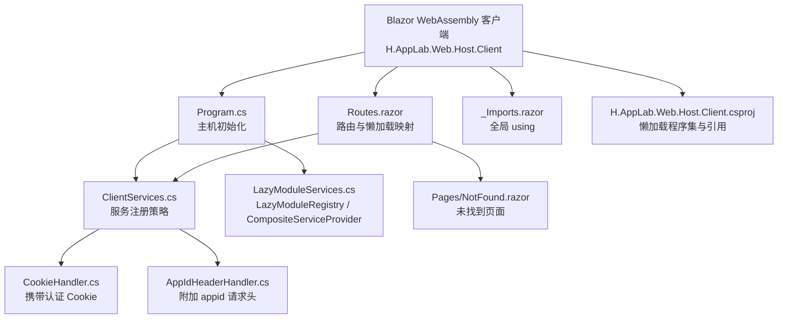
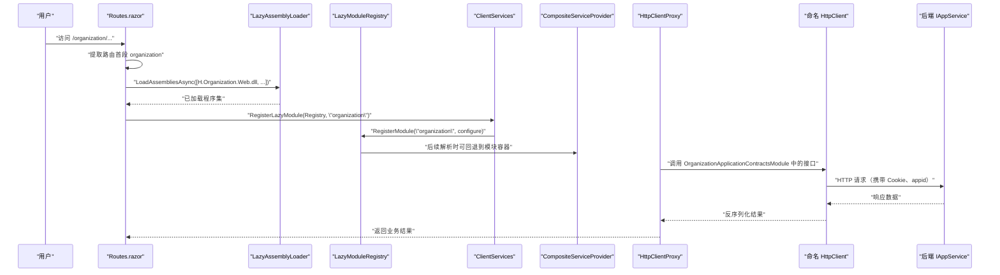
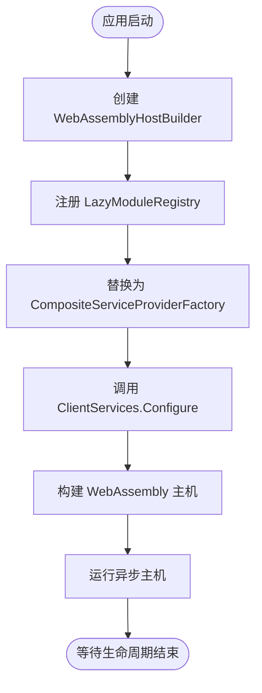
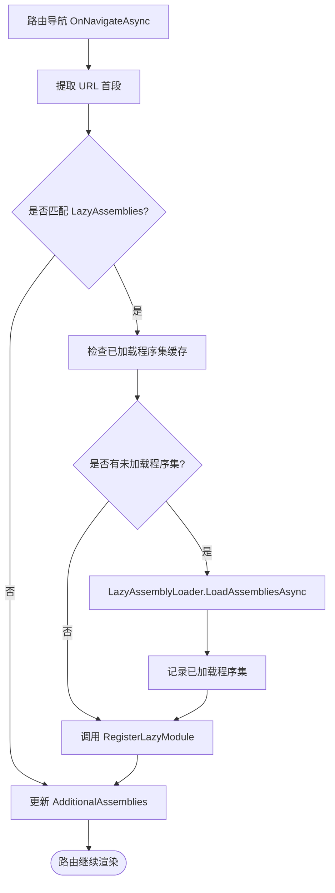
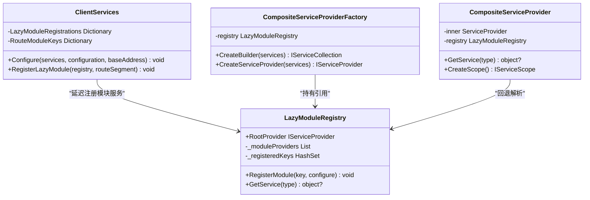
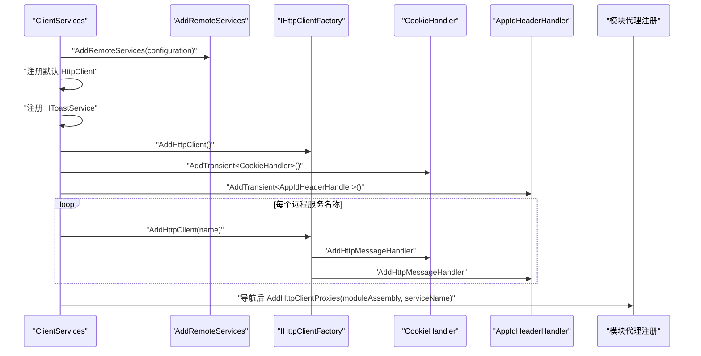
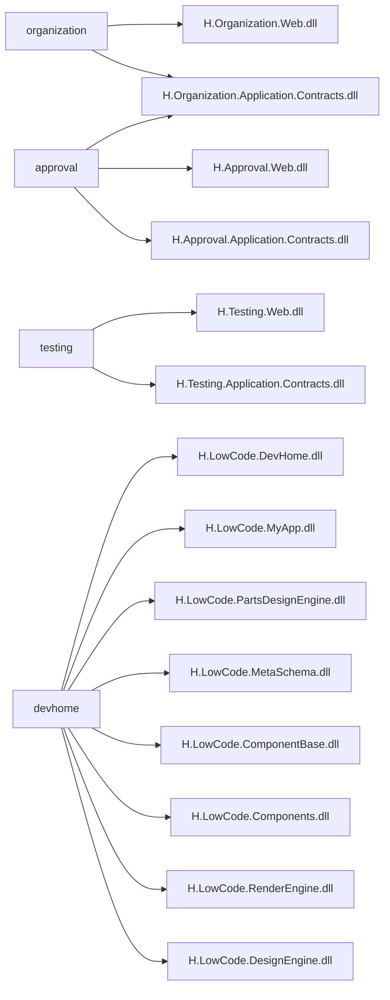
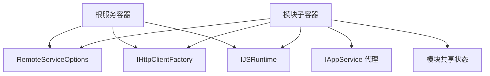

# Blazor WebAssembly 客户端

<cite>
**本文引用的文件**   
- [README.md](file://README.md)
- [Program.cs](file://src/Host/H.AppLab.Web.Host/H.AppLab.Web.Host.Client/Program.cs)
- [Routes.razor](file://src/Host/H.AppLab.Web.Host/H.AppLab.Web.Host.Client/Routes.razor)
- [ClientServices.cs](file://src/Host/H.AppLab.Web.Host/H.AppLab.Web.Host.Client/ClientServices.cs)
- [LazyModuleServices.cs](file://src/Host/H.AppLab.Web.Host/H.AppLab.Web.Host.Client/LazyModuleServices.cs)
- [CookieHandler.cs](file://src/Host/H.AppLab.Web.Host/H.AppLab.Web.Host.Client/CookieHandler.cs)
- [AppIdHeaderHandler.cs](file://src/Host/H.AppLab.Web.Host/H.AppLab.Web.Host.Client/AppIdHeaderHandler.cs)
- [_Imports.razor](file://src/Host/H.AppLab.Web.Host/H.AppLab.Web.Host.Client/_Imports.razor)
- [NotFound.razor](file://src/Host/H.AppLab.Web.Host/H.AppLab.Web.Host.Client/Pages/NotFound.razor)
- [H.AppLab.Web.Host.Client.csproj](file://src/Host/H.AppLab.Web.Host/H.AppLab.Web.Host.Client/H.AppLab.Web.Host.Client.csproj)
</cite>

## 目录

1. [引言](#引言)
2. [项目结构](#项目结构)
3. [核心组件](#核心组件)
4. [架构总览](#架构总览)
5. [详细组件分析](#详细组件分析)
6. [依赖关系分析](#依赖关系分析)
7. [性能与体积优化](#性能与体积优化)
8. [前端开发最佳实践](#前端开发最佳实践)
9. [故障排查指南](#故障排查指南)
10. [结论](#结论)

## 引言

H.AppLab 是一个基于 .NET 与 Blazor 的模块化应用平台。其前端采用 Blazor WebAssembly 模式，并与服务端以 ABP 风格的 `IAppService` 契约进行远程调用。整体设计强调“首页轻量、模块按需加载”，通过路由懒加载、程序集映射、命名 HttpClient 和自定义服务容器组合机制，实现大型多业务模块在浏览器端的高效启动与扩展。

根据项目说明，宿主使用 Blazor Web App 模式（Server + WebAssembly Client），前端通过 `H.Abp.HttpClientProxy` 将接口方法转换为 HTTP 请求；同时，WebAssembly 侧通过自研的组合式依赖注入容器支持懒加载模块的服务延迟注册。Release 模式启用 AOT 编译与裁剪，进一步减少初始下载体积。

**章节来源**
- [README.md:1-73](file://README.md#L1-L73)

## 项目结构

H.AppLab 的 Blazor WebAssembly 客户端位于 `src/Host/H.AppLab.Web.Host/H.AppLab.Web.Host.Client`，它是一个独立的 Blazor WebAssembly 项目，负责：

- 初始化 WebAssembly 主机与组合式服务容器
- 配置全局 HttpClient、认证 Cookie 处理器与应用标识头处理器
- 定义路由与懒加载程序集映射
- 按路由首段延迟注册各业务模块的代理服务和共享状态
- 引用 Portal、Account、Organization、DesignEngine、RenderEngine 等模块作为运行时可加载单元

**图示来源**
- [Program.cs:1-13](file://src/Host/H.AppLab.Web.Host/H.AppLab.Web.Host.Client/Program.cs#L1-L13)
- [Routes.razor:1-145](file://src/Host/H.AppLab.Web.Host/H.AppLab.Web.Host.Client/Routes.razor#L1-L145)
- [ClientServices.cs:1-193](file://src/Host/H.AppLab.Web.Host/H.AppLab.Web.Host.Client/ClientServices.cs#L1-L193)
- [LazyModuleServices.cs:1-141](file://src/Host/H.AppLab.Web.Host/H.AppLab.Web.Host.Client/LazyModuleServices.cs#L1-L141)
- [CookieHandler.cs:1-16](file://src/Host/H.AppLab.Web.Host/H.AppLab.Web.Host.Client/CookieHandler.cs#L1-L16)
- [AppIdHeaderHandler.cs:1-50](file://src/Host/H.AppLab.Web.Host/H.AppLab.Web.Host.Client/AppIdHeaderHandler.cs#L1-L50)
- [_Imports.razor:1-17](file://src/Host/H.AppLab.Web.Host/H.AppLab.Web.Host.Client/_Imports.razor#L1-L17)
- [NotFound.razor:1-6](file://src/Host/H.AppLab.Web.Host/H.AppLab.Web.Host.Client/Pages/NotFound.razor#L1-L6)
- [H.AppLab.Web.Host.Client.csproj:1-147](file://src/Host/H.AppLab.Web.Host/H.AppLab.Web.Host.Client/H.AppLab.Web.Host.Client.csproj#L1-L147)

**章节来源**
- [H.AppLab.Web.Host.Client.csproj:1-147](file://src/Host/H.AppLab.Web.Host/H.AppLab.Web.Host.Client/H.AppLab.Web.Host.Client.csproj#L1-L147)

## 核心组件

| 组件 | 职责 | 关键行为 |
|---|---|---|
| `Program.cs` | WebAssembly 主机入口 | 创建默认 `WebAssemblyHostBuilder`，注册 `LazyModuleRegistry`，替换服务提供者为 `CompositeServiceProviderFactory`，调用 `ClientServices.Configure` |
| `Routes.razor` | 路由与懒加载控制 | 维护路由首段到程序集名称的映射，使用 `LazyAssemblyLoader` 按需加载程序集，更新 `AdditionalAssemblies`，触发模块服务延迟注册 |
| `ClientServices.cs` | 客户端服务注册中心 | 配置远程服务、HttpClient、Cookie 处理、命名客户端、模块懒加载服务注册表 |
| `LazyModuleServices.cs` | 懒加载模块容器 | 管理模块子容器、提供根容器回退解析、封装作用域解析逻辑 |
| `CookieHandler.cs` | 认证凭据处理器 | 设置浏览器请求凭据，使 fetch 请求携带 Cookie |
| `AppIdHeaderHandler.cs` | 应用标识头处理器 | 从当前路由解析 `appid`，附加到 HTTP 请求头 |
| `_Imports.razor` | 全局命名空间导入 | 导入路由、JSInterop、Portal、Account、Organization、DesignEngine、Util.Blazor 等命名空间 |
| `NotFound.razor` | 未匹配路由页面 | 展示“页面不存在”并引导返回首页 |

**章节来源**
- [Program.cs:1-13](file://src/Host/H.AppLab.Web.Host/H.AppLab.Web.Host.Client/Program.cs#L1-L13)
- [Routes.razor:1-145](file://src/Host/H.AppLab.Web.Host/H.AppLab.Web.Host.Client/Routes.razor#L1-L145)
- [ClientServices.cs:1-193](file://src/Host/H.AppLab.Web.Host/H.AppLab.Web.Host.Client/ClientServices.cs#L1-L193)
- [LazyModuleServices.cs:1-141](file://src/Host/H.AppLab.Web.Host/H.AppLab.Web.Host.Client/LazyModuleServices.cs#L1-L141)
- [CookieHandler.cs:1-16](file://src/Host/H.AppLab.Web.Host/H.AppLab.Web.Host.Client/CookieHandler.cs#L1-L16)
- [AppIdHeaderHandler.cs:1-50](file://src/Host/H.AppLab.Web.Host/H.AppLab.Web.Host.Client/AppIdHeaderHandler.cs#L1-L50)
- [_Imports.razor:1-17](file://src/Host/H.AppLab.Web.Host/H.AppLab.Web.Host.Client/_Imports.razor#L1-L17)
- [NotFound.razor:1-6](file://src/Host/H.AppLab.Web.Host/H.AppLab.Web.Host.Client/Pages/NotFound.razor#L1-L6)

## 架构总览

H.AppLab 的 Blazor WebAssembly 客户端采用“启动时最小化 + 导航时动态扩展”的架构：

1. **启动阶段**：仅加载 Portal、AppDrawer 及少量基础契约和工具库，构建主服务容器。
2. **路由阶段**：根据 URL 首段匹配懒加载程序集，使用 `LazyAssemblyLoader` 下载对应 `.dll`。
3. **服务注册阶段**：程序集加载完成后，按模块 key 向 `LazyModuleRegistry` 注册代理服务和共享状态。
4. **服务解析阶段**：通过 `CompositeServiceProvider` 优先从主容器解析，失败后回退到模块子容器。
5. **HTTP 调用阶段**：通过 `H.Abp.HttpClientProxy` 将 `IAppService` 接口调用转换为 HTTP 请求，由命名 HttpClient 统一处理 Cookie、应用标识头和远程服务地址。

**图示来源**
- [Routes.razor:24-145](file://src/Host/H.AppLab.Web.Host/H.AppLab.Web.Host.Client/Routes.razor#L24-L145)
- [ClientServices.cs:120-193](file://src/Host/H.AppLab.Web.Host/H.AppLab.Web.Host.Client/ClientServices.cs#L120-L193)
- [LazyModuleServices.cs:12-141](file://src/Host/H.AppLab.Web.Host/H.AppLab.Web.Host.Client/LazyModuleServices.cs#L12-L141)
- [CookieHandler.cs:1-16](file://src/Host/H.AppLab.Web.Host/H.AppLab.Web.Host.Client/CookieHandler.cs#L1-L16)
- [AppIdHeaderHandler.cs:1-50](file://src/Host/H.AppLab.Web.Host/H.AppLab.Web.Host.Client/AppIdHeaderHandler.cs#L1-L50)

**章节来源**
- [README.md:1-73](file://README.md#L1-L73)
- [Program.cs:1-13](file://src/Host/H.AppLab.Web.Host/H.AppLab.Web.Host.Client/Program.cs#L1-L13)

## 详细组件分析

### 应用程序启动流程

`Program.cs` 是 Blazor WebAssembly 应用的入口，它完成以下工作：

- 创建默认的 `WebAssemblyHostBuilder`
- 实例化 `LazyModuleRegistry` 并注册为单例
- 使用 `CompositeServiceProviderFactory` 替换默认服务提供者工厂，使后续服务解析具备模块容器回退能力
- 调用 `ClientServices.Configure` 完成 HttpClient、远程服务和全局服务的注册
- 构建并运行 WebAssembly 主机

该流程的关键在于：**主容器不是最终唯一的服务源**。所有懒加载模块的服务都进入独立子容器，再由 `CompositeServiceProvider` 统一解析。

**图示来源**
- [Program.cs:1-13](file://src/Host/H.AppLab.Web.Host/H.AppLab.Web.Host.Client/Program.cs#L1-L13)
- [LazyModuleServices.cs:120-141](file://src/Host/H.AppLab.Web.Host/H.AppLab.Web.Host.Client/LazyModuleServices.cs#L120-L141)

**章节来源**
- [Program.cs:1-13](file://src/Host/H.AppLab.Web.Host/H.AppLab.Web.Host.Client/Program.cs#L1-L13)

### 路由懒加载与程序集映射

`Routes.razor` 实现了完整的 Blazor WebAssembly 懒加载控制逻辑：

- 维护一个静态字典，将 URL 首段映射到一组需要加载的程序集名称
- 区分立即加载的程序集和懒加载程序集
- 使用 `LazyAssemblyLoader.LoadAssembliesAsync` 按需下载尚未缓存的程序集
- 将已加载程序集加入 `AdditionalAssemblies`，使 Blazor 路由能识别新模块中的组件
- 在程序集就绪后调用 `ClientServices.RegisterLazyModule`，确保页面渲染前模块服务可用

路由映射具有以下特点：

| 路由首段 | 主要模块 | 特殊依赖 |
|---|---|---|
| `organization` | Organization.Web | Organization.Application.Contracts |
| `approval` | Approval.Web | Approval.Application.Contracts、Organization.Application.Contracts |
| `testing` | Testing.Web | Testing.Application.Contracts、测试执行事件通知器、项目选择状态 |
| `notification` | Notification.Web | Notification.Application.Contracts |
| `order` | Order.Web | Order.Application.Contracts |
| `setting` | Setting.Web | Setting.Application.Contracts |
| `supply-chain` | SupplyChain.Web | SupplyChain.Application.Contracts |
| `background-task` | BackgroundTask.Web | BackgroundTask.Application.Contracts |
| `file` | File.Web | File.Application.Contracts、Markdig |
| `account` | Account.Web | Account.Application.Contracts |
| `ai` | AI.Web | AI.Application.Contracts |
| `system` | SystemPortal.Web | SystemPortal.Application.Contracts、Enterprise.Application.Contracts |
| `devhome` | LowCode.DevHome、MyApp、PartsDesignEngine | LowCode 设计与渲染完整链 |
| `designengine` | LowCode.DesignEngine | LowCode 设计与渲染完整链 |
| `app` | RenderEngine 应用运行态 | LowCode 渲染链 |

**图示来源**
- [Routes.razor:24-145](file://src/Host/H.AppLab.Web.Host/H.AppLab.Web.Host.Client/Routes.razor#L24-L145)
- [ClientServices.cs:160-193](file://src/Host/H.AppLab.Web.Host/H.AppLab.Web.Host.Client/ClientServices.cs#L160-L193)

**章节来源**
- [Routes.razor:1-145](file://src/Host/H.AppLab.Web.Host/H.AppLab.Web.Host.Client/Routes.razor#L1-L145)

### LazyAssemblyLoader 的使用方式

`LazyAssemblyLoader` 是 Blazor WebAssembly 提供的标准懒加载能力。在本项目中，它被用于：

1. 根据路由首段确定需要加载的程序集数组
2. 过滤已经缓存的程序集，避免重复下载
3. 等待所有目标程序集加载完成
4. 将加载到的程序集对象加入 `_loadedAssemblies`
5. 将已加载程序集合并到 `AdditionalAssemblies`，使路由系统能够发现新模块中的组件

需要注意：

- 程序集缓存键使用程序集名称加 `.dll`，因此同一程序集不会重复加载
- 如果某个模块的程序集未在 `BlazorWebAssemblyLazyLoad` 中声明，则无法被 `LazyAssemblyLoader` 正确加载
- 某些第三方库如 `Markdig`、`Sqids`、`H.Util.Ids` 只在特定模块中使用，也通过懒加载降低初始体积

**章节来源**
- [Routes.razor:24-145](file://src/Host/H.AppLab.Web.Host/H.AppLab.Web.Host.Client/Routes.razor#L24-L145)
- [H.AppLab.Web.Host.Client.csproj:16-147](file://src/Host/H.AppLab.Web.Host/H.AppLab.Web.Host.Client/H.AppLab.Web.Host.Client.csproj#L16-L147)

### 模块依赖解析与服务延迟注册

`ClientServices` 不仅负责启动时的服务注册，还维护一套“路由首段 → 模块服务注册委托”的映射表。每个模块的注册委托在程序集加载后才执行，从而避免启动时加载大量类型。

模块注册的关键规则：

- 某些路由共享同一个模块 key，例如 `devhome`、`designengine`、`app` 共享 `lowcode-render` 或 `lowcode-design`
- `RouteModuleKeys` 将多个路由映射到相同模块注册 key
- `LazyModuleRegistrations` 中的 lambda 仅在模块首次加载时执行
- 模块注册会转发根容器的 `RemoteServiceOptions`、`IHttpClientFactory`、`IJSRuntime`，保证代理工厂和服务能在模块子容器中解析

**图示来源**
- [ClientServices.cs:1-193](file://src/Host/H.AppLab.Web.Host/H.AppLab.Web.Host.Client/ClientServices.cs#L1-L193)
- [LazyModuleServices.cs:12-141](file://src/Host/H.AppLab.Web.Host/H.AppLab.Web.Host.Client/LazyModuleServices.cs#L12-L141)

**章节来源**
- [ClientServices.cs:1-193](file://src/Host/H.AppLab.Web.Host/H.AppLab.Web.Host.Client/ClientServices.cs#L1-L193)
- [LazyModuleServices.cs:1-141](file://src/Host/H.AppLab.Web.Host/H.AppLab.Web.Host.Client/LazyModuleServices.cs#L1-L141)

### ClientServices 的服务注册策略

`ClientServices` 是客户端服务容器的核心协调者。它的职责包括：

#### 远程服务配置

通过 `AddRemoteServices(configuration)` 加载远程服务配置，使 `H.Abp.HttpClientProxy` 知道如何把 `IAppService` 接口调用映射到 HTTP 地址。

#### HttpClient 配置

- 注册一个默认 `HttpClient`，BaseAddress 指向宿主地址
- 注册全局 `HToastService`
- 注册 `CookieHandler` 和 `AppIdHeaderHandler`

#### 命名客户端管理

为每个业务模块注册命名 HttpClient，并挂载两个消息处理器：

- `CookieHandler`：携带认证 Cookie
- `AppIdHeaderHandler`：附加 `appid` 请求头

其中 `TestingRemoteServiceName` 的超时被设置为无限，以支持长时间运行的 UI 测试用例。

#### 模块服务容器的动态扩展

`RegisterLazyModule` 根据路由首段计算模块 key，然后调用 `LazyModuleRegistry.RegisterModule`。模块内部会：

1. 转发根容器的基础服务
2. 调用 `AddHttpClientProxies` 扫描模块程序集中的 `IAppService` 接口并注册代理
3. 注册模块级共享状态，例如测试项目的当前选择状态、LowCode 应用状态、RenderEngineBase 服务等

**图示来源**
- [ClientServices.cs:30-118](file://src/Host/H.AppLab.Web.Host/H.AppLab.Web.Host.Client/ClientServices.cs#L30-L118)

**章节来源**
- [ClientServices.cs:1-193](file://src/Host/H.AppLab.Web.Host/H.AppLab.Web.Host.Client/ClientServices.cs#L1-L193)

### Cookie 与认证处理

`CookieHandler` 继承自 `DelegatingHandler`，在发送请求前调用 `SetBrowserRequestCredentials(BrowserRequestCredentials.Include)`。这使 Blazor WebAssembly 的底层 fetch 请求携带 Cookie，从而与后端认证会话保持一致。

适用场景：

- 账号登录后的 Cookie 认证
- 跨模块调用时保持认证上下文
- 所有命名 HttpClient 自动生效

注意事项：

- 如果后端未正确设置 Cookie，或跨域策略限制 Cookie 携带，会导致认证失败
- 该处理器对所有使用该 HttpClient 的请求生效，不应随意移除

**章节来源**
- [CookieHandler.cs:1-16](file://src/Host/H.AppLab.Web.Host/H.AppLab.Web.Host.Client/CookieHandler.cs#L1-L16)
- [ClientServices.cs:70-118](file://src/Host/H.AppLab.Web.Host/H.AppLab.Web.Host.Client/ClientServices.cs#L70-L118)

### 应用标识头处理

`AppIdHeaderHandler` 从当前路由中提取低代码应用标识。当路径以 `/app/{appId}` 或 `/designer/{appId}` 开头时，会在请求头中添加 `appid`。服务端可据此动态加载对应应用的实体模型和数据源。

解析规则：

- 取绝对 URI 的路径段
- 要求至少有两个路径段
- 首段必须是 `app` 或 `designer`
- 第二个路径段作为 `appid`
- 解析失败时不附加请求头，避免影响其他路由

**章节来源**
- [AppIdHeaderHandler.cs:1-50](file://src/Host/H.AppLab.Web.Host/H.AppLab.Web.Host.Client/AppIdHeaderHandler.cs#L1-L50)
- [ClientServices.cs:70-118](file://src/Host/H.AppLab.Web.Host/H.AppLab.Web.Host.Client/ClientServices.cs#L70-L118)

### 模块运行时组织模式

从 `_Imports.razor` 可以看出，启动时需要暴露给全局命名空间的模块包括：

- Portal
- Account
- Organization
- Approval
- Testing
- AppDrawer
- LowCode DesignEngine
- Util.Blazor

这些模块在编译期可见，但它们的 Web 层程序集仍可通过 `BlazorWebAssemblyLazyLoad` 控制是否懒加载。真正决定运行时是否加载的是 `Routes.razor` 中的 `EagerAssemblies` 和 `LazyAssemblies`。

当前立即加载的唯一显式程序集来自 Portal 的 `_Imports`，其余模块大多通过路由触发加载。

**章节来源**
- [_Imports.razor:1-17](file://src/Host/H.AppLab.Web.Host/H.AppLab.Web.Host.Client/_Imports.razor#L1-L17)
- [Routes.razor:100-112](file://src/Host/H.AppLab.Web.Host/H.AppLab.Web.Host.Client/Routes.razor#L100-L112)
- [H.AppLab.Web.Host.Client.csproj:100-147](file://src/Host/H.AppLab.Web.Host/H.AppLab.Web.Host.Client/H.AppLab.Web.Host.Client.csproj#L100-L147)

## 依赖关系分析

### 程序集依赖层次

H.AppLab 的 Blazor WebAssembly 客户端程序集依赖可以分为三层：

| 层级 | 示例 | 说明 |
|---|---|---|
| 基础层 | Portal、AppDrawer、Util.Blazor | 启动或全局常用功能 |
| 业务模块层 | Account、Organization、Approval、Testing、Notification、Order、Setting、SupplyChain、BackgroundTask、File、SystemPortal、AI | 按路由懒加载 |
| LowCode 层 | DevHome、DesignEngine、RenderEngine、MetaSchema、ComponentBase | 设计器与应用运行态所需 |

### 路由与模块映射

**图示来源**
- [Routes.razor:24-99](file://src/Host/H.AppLab.Web.Host/H.AppLab.Web.Host.Client/Routes.razor#L24-L99)
- [H.AppLab.Web.Host.Client.csproj:16-99](file://src/Host/H.AppLab.Web.Host/H.AppLab.Web.Host.Client/H.AppLab.Web.Host.Client.csproj#L16-L99)

**章节来源**
- [Routes.razor:24-145](file://src/Host/H.AppLab.Web.Host/H.AppLab.Web.Host.Client/Routes.razor#L24-L145)
- [H.AppLab.Web.Host.Client.csproj:16-147](file://src/Host/H.AppLab.Web.Host/H.AppLab.Web.Host.Client/H.AppLab.Web.Host.Client.csproj#L16-L147)

### 服务依赖关系

**图示来源**
- [ClientServices.cs:160-193](file://src/Host/H.AppLab.Web.Host/H.AppLab.Web.Host.Client/ClientServices.cs#L160-L193)
- [LazyModuleServices.cs:12-119](file://src/Host/H.AppLab.Web.Host/H.AppLab.Web.Host.Client/LazyModuleServices.cs#L12-L119)

**章节来源**
- [ClientServices.cs:120-193](file://src/Host/H.AppLab.Web.Host/H.AppLab.Web.Host.Client/ClientServices.cs#L120-L193)
- [LazyModuleServices.cs:12-119](file://src/Host/H.AppLab.Web.Host/H.AppLab.Web.Host.Client/LazyModuleServices.cs#L12-L119)

## 性能与体积优化

本项目在 WebAssembly 启动性能和包体积方面做了多项优化：

| 优化项 | 实现位置 | 效果 |
|---|---|---|
| 懒加载程序集 | `H.AppLab.Web.Host.Client.csproj` 中的 `BlazorWebAssemblyLazyLoad` | 非首页模块不在启动时下载 |
| 路由级程序集加载 | `Routes.razor` | 只有访问对应路由时才加载相关程序集 |
| Release 模式启用 AOT | `RunAOTCompilation=true` | 减少解释执行开销，提升启动速度 |
| 裁剪根程序集 | `TrimmerRootAssembly Include="H.LowCode.Components"` | 防止裁剪器移除仅通过字符串反射使用的组件类型 |
| 调试符号懒加载 | 每个 `.pdb` 也加入 `BlazorWebAssemblyLazyLoad` | Development 模式下调试符号按需下载 |
| 命名 HttpClient 复用 | `AddHttpClient(name)` | 避免每次请求新建连接 |
| Cookie 与请求头处理器 | `CookieHandler`、`AppIdHeaderHandler` | 减少重复逻辑，集中处理网络请求副作用 |

建议：

- 新增模块时，务必在 csproj 中声明 `BlazorWebAssemblyLazyLoad`
- 在 `Routes.razor` 的 `LazyAssemblies` 中补充路由映射
- 在 `ClientServices` 中补充模块服务注册委托
- 对大型第三方库，尽量放在懒加载模块中
- 对必须启动即用的模块，谨慎加入立即加载程序集

**章节来源**
- [H.AppLab.Web.Host.Client.csproj:1-147](file://src/Host/H.AppLab.Web.Host/H.AppLab.Web.Host.Client/H.AppLab.Web.Host.Client.csproj#L1-L147)
- [Routes.razor:24-145](file://src/Host/H.AppLab.Web.Host/H.AppLab.Web.Host.Client/Routes.razor#L24-L145)
- [ClientServices.cs:120-193](file://src/Host/H.AppLab.Web.Host/H.AppLab.Web.Host.Client/ClientServices.cs#L120-L193)

## 前端开发最佳实践

### 组件组织模式

推荐按“模块 + 功能”组织组件：

- 每个业务模块保留自己的 Web 项目和 `Application.Contracts`
- 公共 UI 组件放入 `Components/AppDrawer` 或 `Utils/H.Util.Blazor`
- 模块内页面按领域划分，避免把所有页面放在根目录
- 模块间通过 `IAppService` 通信，而不是直接耦合页面逻辑

### 状态管理策略

当前项目没有引入全局状态管理框架，而是通过依赖注入管理模块级共享状态：

- 测试模块使用 `CurrentProjectSelection` 保存当前选中项目
- LowCode 模块使用 `LowCodeAppState` 表示设计时宿主状态
- 页面级状态优先使用组件局部状态
- 跨页面共享状态应注册为 Scoped 或 Singleton，并在模块延迟注册中初始化

建议：

- 小型状态使用组件局部状态
- 跨组件状态使用依赖注入
- 跨模块状态通过事件或共享服务解耦
- 避免在启动阶段初始化重型状态

### 性能优化技巧

- 将大型 UI 库和业务模块声明为懒加载程序集
- 避免在 `EagerAssemblies` 中加入不必要的模块
- 避免在 `ClientServices.Configure` 中引用未启动模块的类型
- 合理使用 `Scoped` 和 `Singleton`，避免无意义的全局对象
- 对频繁渲染的列表使用虚拟滚动或分页
- 对图片、富文本等资源使用懒加载或 CDN

### 调试方法

- Debug 模式会额外加载 `.pdb`，便于断点调试
- 若某模块路由无法加载，首先检查：
  - csproj 中是否声明 `BlazorWebAssemblyLazyLoad`
  - `Routes.razor` 中是否配置路由映射
  - `ClientServices` 中是否注册模块服务
  - 模块程序集是否成功被 `LazyAssemblyLoader` 加载
- 若代理调用失败，检查：
  - 远程服务名称是否与配置一致
  - Cookie 是否正确携带
  - 后端是否返回预期 JSON 结构
  - `RemoteServiceOptions` 的基础地址是否正确

**章节来源**
- [ClientServices.cs:120-193](file://src/Host/H.AppLab.Web.Host/H.AppLab.Web.Host.Client/ClientServices.cs#L120-L193)
- [Routes.razor:24-145](file://src/Host/H.AppLab.Web.Host/H.AppLab.Web.Host.Client/Routes.razor#L24-L145)
- [H.AppLab.Web.Host.Client.csproj:1-147](file://src/Host/H.AppLab.Web.Host/H.AppLab.Web.Host.Client/H.AppLab.Web.Host.Client.csproj#L1-L147)

## 故障排查指南

### 路由能打开但页面为空

可能原因：

- 路由首段未匹配 `LazyAssemblies`
- 目标程序集未加入 `BlazorWebAssemblyLazyLoad`
- 程序集加载后未更新 `AdditionalAssemblies`
- 模块服务未注册，导致组件依赖解析失败

排查步骤：

1. 确认 URL 首段是否在 `Routes.razor` 的 `LazyAssemblies` 中
2. 确认 csproj 中包含对应 `.dll` 的懒加载声明
3. 在浏览器开发者工具中查看是否发生了程序集下载
4. 检查模块服务是否在 `ClientServices.LazyModuleRegistrations` 中注册

**章节来源**
- [Routes.razor:24-145](file://src/Host/H.AppLab.Web.Host/H.AppLab.Web.Host.Client/Routes.razor#L24-L145)
- [H.AppLab.Web.Host.Client.csproj:16-147](file://src/Host/H.AppLab.Web.Host/H.AppLab.Web.Host.Client/H.AppLab.Web.Host.Client.csproj#L16-L147)

### API 调用失败或认证失效

可能原因：

- Cookie 未携带
- 后端跨域未允许凭据
- 远程服务名称配置错误
- HttpClient 超时过早取消

排查步骤：

1. 检查 Network 面板中请求是否携带 Cookie
2. 确认 `CookieHandler` 已挂载到命名 HttpClient
3. 检查后端 CORS 是否允许凭证请求
4. 对长时间运行的任务，确认是否使用了 `TestingRemoteServiceName` 的无限超时
5. 检查 `RemoteServiceOptions` 的基础地址

**章节来源**
- [CookieHandler.cs:1-16](file://src/Host/H.AppLab.Web.Host/H.AppLab.Web.Host.Client/CookieHandler.cs#L1-L16)
- [ClientServices.cs:70-118](file://src/Host/H.AppLab.Web.Host/H.AppLab.Web.Host.Client/ClientServices.cs#L70-L118)

### 模块服务解析失败

可能原因：

- 模块程序集尚未加载
- 模块服务未通过 `RegisterLazyModule` 注册
- 模块服务依赖了根容器才有的服务，但未转发
- `LazyModuleRegistry.RootProvider` 尚未初始化

排查步骤：

1. 确认路由导航触发了 `OnNavigateAsync`
2. 确认 `ClientServices.RegisterLazyModule` 已执行
3. 确认模块注册委托中已转发 `RemoteServiceOptions`、`IHttpClientFactory`、`IJSRuntime`
4. 确认 `CompositeServiceProvider` 能回退到模块子容器

**章节来源**
- [LazyModuleServices.cs:12-119](file://src/Host/H.AppLab.Web.Host/H.AppLab.Web.Host.Client/LazyModuleServices.cs#L12-L119)
- [ClientServices.cs:160-193](file://src/Host/H.AppLab.Web.Host/H.AppLab.Web.Host.Client/ClientServices.cs#L160-L193)

### 未找到路由

未匹配的路由会显示 `Pages/NotFound.razor`，内容为“页面不存在”，并提供返回首页链接。

建议：

- 对无效模块路径返回友好的 404 提示
- 在后台管理系统中限制无效路由跳转
- 结合权限控制，未授权路由也应给出明确反馈

**章节来源**
- [NotFound.razor:1-6](file://src/Host/H.AppLab.Web.Host/H.AppLab.Web.Host.Client/Pages/NotFound.razor#L1-L6)

## 结论

H.AppLab 的 Blazor WebAssembly 客户端通过“路由驱动的程序集懒加载 + 组合式服务容器 + 命名 HttpClient + 动态代理”的方式，实现了大型多模块前端系统的可伸缩架构。其核心优势在于：

- 启动体积小，首页快速可用
- 模块可按路由独立扩展，不影响已有模块
- 服务注册延迟到程序集加载之后，避免启动时类型膨胀
- HttpClient 统一处理认证和应用标识，简化业务调用
- 通过 csproj 和路由配置双控程序集加载，兼顾灵活性与可控性

对于新模块接入，推荐遵循以下流程：

1. 创建业务模块的 Web 项目和 Application.Contracts
2. 在 csproj 中将模块程序集和契约程序集声明为懒加载
3. 在 `Routes.razor` 中补充路由首段到程序集的映射
4. 在 `ClientServices` 中注册模块的代理服务和共享状态
5. 在模块内部通过 `IAppService` 调用后端服务，保持前后端契约一致

这种设计既适合单体部署，也适合逐步演进为更细粒度的前端微应用架构。