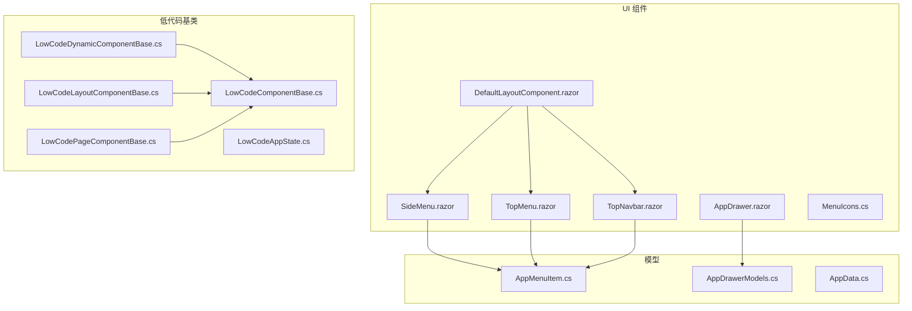
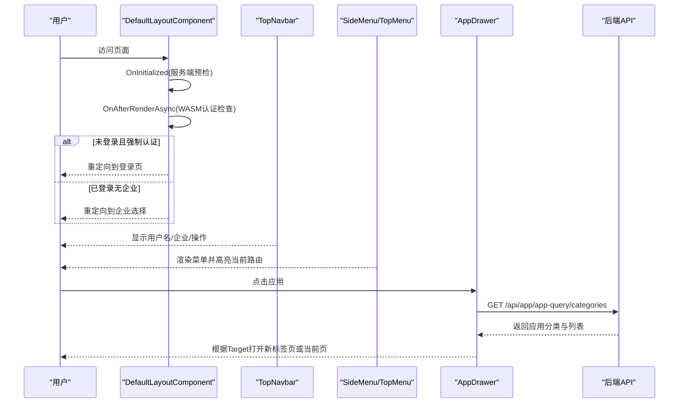
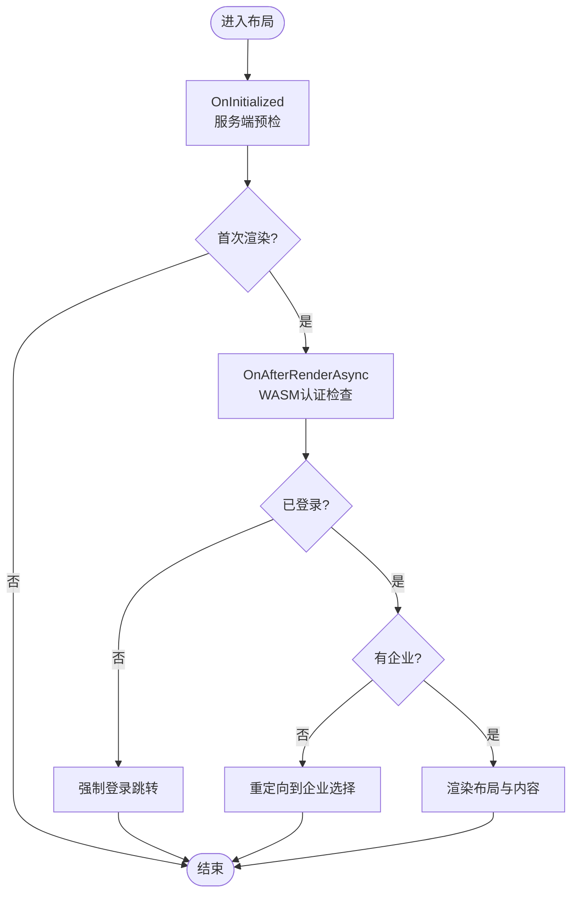
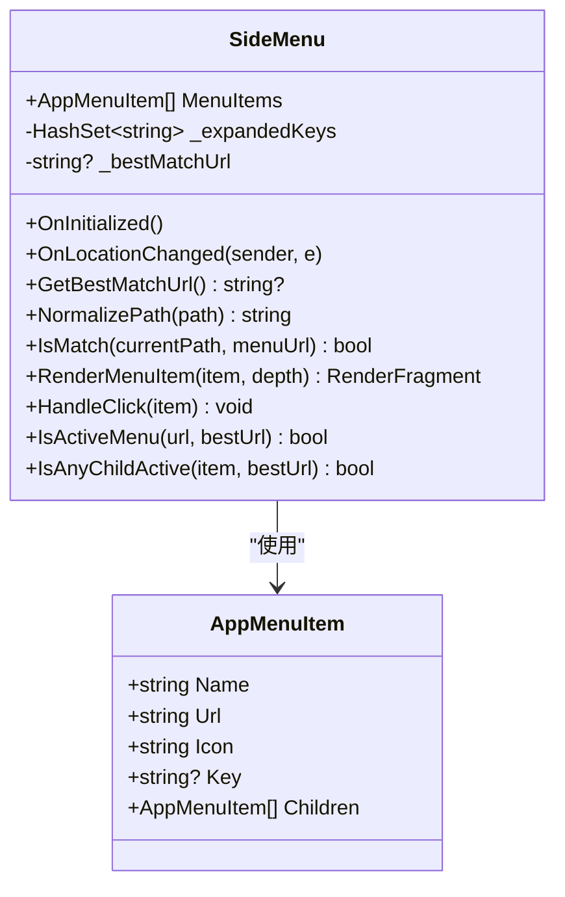
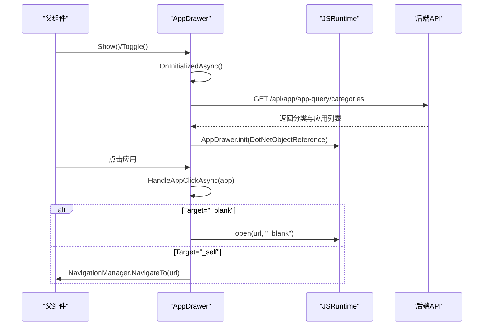
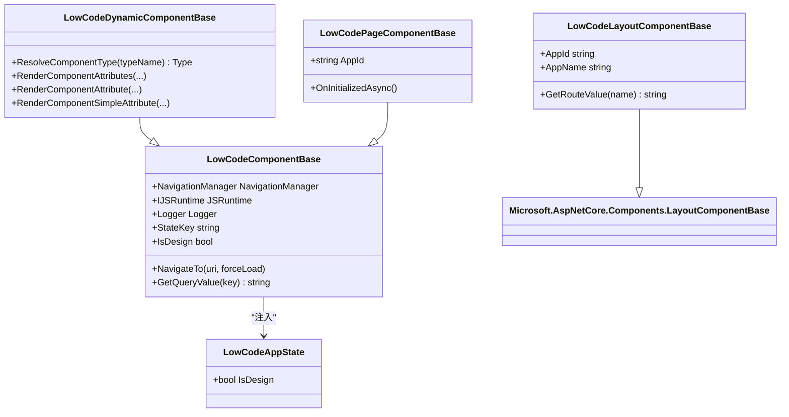
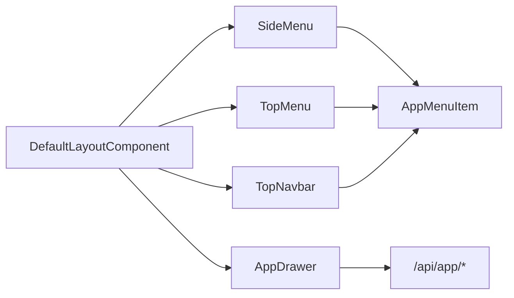

# Blazor组件架构

<cite>
**本文引用的文件**   
- [README.md](file://README.md)
- [AppDrawer.razor](file://src/Components/AppDrawer/H.AppDrawer.Components/Components/AppDrawer.razor)
- [DefaultLayoutComponent.razor](file://src/Components/AppDrawer/H.AppDrawer.Components/Components/DefaultLayoutComponent.razor)
- [SideMenu.razor](file://src/Components/AppDrawer/H.AppDrawer.Components/Components/SideMenu.razor)
- [TopNavbar.razor](file://src/Components/AppDrawer/H.AppDrawer.Components/Components/TopNavbar.razor)
- [TopMenu.razor](file://src/Components/AppDrawer/H.AppDrawer.Components/Components/TopMenu.razor)
- [MenuIcons.cs](file://src/Components/AppDrawer/H.AppDrawer.Components/Components/MenuIcons.cs)
- [AppMenuItem.cs](file://src/Components/AppDrawer/H.AppDrawer.Model/AppMenuItem.cs)
- [AppDrawerModels.cs](file://src/Components/AppDrawer/H.AppDrawer.Model/AppDrawerModels.cs)
- [AppData.cs](file://src/Components/AppDrawer/H.AppDrawer.Model/AppData.cs)
- [_Imports.razor](file://src/Components/AppDrawer/H.AppDrawer.Components/_Imports.razor)
- [LowCodeComponentBase.cs](file://src/LowCode/Common/H.LowCode.ComponentBase/LowCodeComponentBase.cs)
- [LowCodeDynamicComponentBase.cs](file://src/LowCode/Common/H.LowCode.ComponentBase/LowCodeDynamicComponentBase.cs)
- [LowCodeAppState.cs](file://src/LowCode/Common/H.LowCode.ComponentBase/LowCodeAppState.cs)
- [LowCodeLayoutComponentBase.cs](file://src/LowCode/Common/H.LowCode.ComponentBase/LowCodeLayoutComponentBase.cs)
- [LowCodePageComponentBase.cs](file://src/LowCode/Common/H.LowCode.ComponentBase/LowCodePageComponentBase.cs)
</cite>

## 目录
1. [简介](#简介)
2. [项目结构](#项目结构)
3. [核心组件](#核心组件)
4. [架构总览](#架构总览)
5. [详细组件分析](#详细组件分析)
6. [依赖关系分析](#依赖关系分析)
7. [性能考量](#性能考量)
8. [故障排查指南](#故障排查指南)
9. [结论](#结论)
10. [附录](#附录)

## 简介
本文件面向 AppLab 的 Blazor 组件架构，重点阐述基于 ABP 框架的 Blazor 组件设计模式与实现细节。文档覆盖：
- 组件分层结构与生命周期管理
- 参数传递机制与事件处理
- 应用抽屉（AppDrawer）的核心实现：SideMenu、TopNavbar、DefaultLayout 等关键组件
- 低代码组件基类 LowCodeComponentBase 的设计原理：动态组件加载、属性绑定、事件处理
- 组件间通信与状态共享策略
- 自定义组件开发最佳实践与扩展指南

## 项目结构
AppLab 采用模块化架构，Blazor Web App（Server + WebAssembly Client）作为宿主模式。与 UI 布局相关的关键模块位于 Components/AppDrawer；低代码能力集中在 LowCode/Common 下的组件基类与元数据 Schema。

图表来源
- [AppDrawer.razor:1-252](file://src/Components/AppDrawer/H.AppDrawer.Components/Components/AppDrawer.razor#L1-L252)
- [DefaultLayoutComponent.razor:1-270](file://src/Components/AppDrawer/H.AppDrawer.Components/Components/DefaultLayoutComponent.razor#L1-L270)
- [SideMenu.razor:1-172](file://src/Components/AppDrawer/H.AppDrawer.Components/Components/SideMenu.razor#L1-L172)
- [TopNavbar.razor:1-203](file://src/Components/AppDrawer/H.AppDrawer.Components/Components/TopNavbar.razor#L1-L203)
- [TopMenu.razor:1-69](file://src/Components/AppDrawer/H.AppDrawer.Components/Components/TopMenu.razor#L1-L69)
- [MenuIcons.cs:1-49](file://src/Components/AppDrawer/H.AppDrawer.Components/Components/MenuIcons.cs#L1-L49)
- [AppMenuItem.cs:1-22](file://src/Components/AppDrawer/H.AppDrawer.Model/AppMenuItem.cs#L1-L22)
- [AppDrawerModels.cs:1-74](file://src/Components/AppDrawer/H.AppDrawer.Model/AppDrawerModels.cs#L1-L74)
- [AppData.cs:1-10](file://src/Components/AppDrawer/H.AppDrawer.Model/AppData.cs#L1-L10)
- [LowCodeComponentBase.cs:1-73](file://src/LowCode/Common/H.LowCode.ComponentBase/LowCodeComponentBase.cs#L1-L73)
- [LowCodeDynamicComponentBase.cs:1-187](file://src/LowCode/Common/H.LowCode.ComponentBase/LowCodeDynamicComponentBase.cs#L1-L187)
- [LowCodeAppState.cs:1-21](file://src/LowCode/Common/H.LowCode.ComponentBase/LowCodeAppState.cs#L1-L21)
- [LowCodeLayoutComponentBase.cs:1-66](file://src/LowCode/Common/H.LowCode.ComponentBase/LowCodeLayoutComponentBase.cs#L1-L66)
- [LowCodePageComponentBase.cs:1-22](file://src/LowCode/Common/H.LowCode.ComponentBase/LowCodePageComponentBase.cs#L1-L22)

章节来源
- [README.md:1-74](file://README.md#L1-L74)

## 核心组件
- DefaultLayoutComponent：统一布局容器，组合 TopNavbar、SideMenu/TopMenu、内容区与 AppDrawer，负责认证检查与企业信息获取、路由跳转控制。
- TopNavbar：顶部导航栏，展示应用名、Logo、用户信息与下拉菜单，支持登录/退出、企业切换。
- SideMenu：左侧菜单，递归渲染多级菜单，按当前路由高亮并支持展开/折叠。
- TopMenu：顶部横向菜单，按路由前缀匹配激活项。
- AppDrawer：应用抽屉面板，通过 API 拉取应用分类与应用列表，支持新标签页或当前页打开。
- MenuIcons：统一 SVG 图标生成器，保证侧边与顶部菜单图标风格一致。
- 模型：AppMenuItem、AppCategoryInfo、AppItemInfo、AppData 用于描述菜单与应用数据。

章节来源
- [DefaultLayoutComponent.razor:1-270](file://src/Components/AppDrawer/H.AppDrawer.Components/Components/DefaultLayoutComponent.razor#L1-L270)
- [TopNavbar.razor:1-203](file://src/Components/AppDrawer/H.AppDrawer.Components/Components/TopNavbar.razor#L1-L203)
- [SideMenu.razor:1-172](file://src/Components/AppDrawer/H.AppDrawer.Components/Components/SideMenu.razor#L1-L172)
- [TopMenu.razor:1-69](file://src/Components/AppDrawer/H.AppDrawer.Components/Components/TopMenu.razor#L1-L69)
- [AppDrawer.razor:1-252](file://src/Components/AppDrawer/H.AppDrawer.Components/Components/AppDrawer.razor#L1-L252)
- [MenuIcons.cs:1-49](file://src/Components/AppDrawer/H.AppDrawer.Components/Components/MenuIcons.cs#L1-L49)
- [AppMenuItem.cs:1-22](file://src/Components/AppDrawer/H.AppDrawer.Model/AppMenuItem.cs#L1-L22)
- [AppDrawerModels.cs:1-74](file://src/Components/AppDrawer/H.AppDrawer.Model/AppDrawerModels.cs#L1-L74)
- [AppData.cs:1-10](file://src/Components/AppDrawer/H.AppDrawer.Model/AppData.cs#L1-L10)

## 架构总览
下图展示了布局组件之间的组合关系与数据流向，以及与服务端 API 的交互点。

图表来源
- [DefaultLayoutComponent.razor:106-177](file://src/Components/AppDrawer/H.AppDrawer.Components/Components/DefaultLayoutComponent.razor#L106-L177)
- [TopNavbar.razor:112-203](file://src/Components/AppDrawer/H.AppDrawer.Components/Components/TopNavbar.razor#L112-L203)
- [SideMenu.razor:43-171](file://src/Components/AppDrawer/H.AppDrawer.Components/Components/SideMenu.razor#L43-L171)
- [TopMenu.razor:28-69](file://src/Components/AppDrawer/H.AppDrawer.Components/Components/TopMenu.razor#L28-L69)
- [AppDrawer.razor:120-252](file://src/Components/AppDrawer/H.AppDrawer.Components/Components/AppDrawer.razor#L120-L252)

## 详细组件分析

### DefaultLayoutComponent 默认布局
- 职责：组合 TopNavbar、SideMenu/TopMenu、内容区与 AppDrawer；在服务端预渲染时快速判断认证状态，在 WASM 环境下通过 API 校验 Cookie 并获取用户与企业信息；根据认证模式进行路由拦截与跳转。
- 关键点：
  - OnInitialized 中通过 HttpContext 快速判定是否已登录，避免阻塞首次渲染。
  - OnAfterRenderAsync 中调用 /api/app/account/current-user 与 /api/app/enterprise/current-enterprise 获取用户与企业信息。
  - 根据 AuthMode 决定强制登录或未选择企业时的重定向逻辑。
  - 提供 ToggleAppDrawer 与 HandleLogout 回调，驱动抽屉与退出流程。

图表来源
- [DefaultLayoutComponent.razor:106-177](file://src/Components/AppDrawer/H.AppDrawer.Components/Components/DefaultLayoutComponent.razor#L106-L177)

章节来源
- [DefaultLayoutComponent.razor:1-270](file://src/Components/AppDrawer/H.AppDrawer.Components/Components/DefaultLayoutComponent.razor#L1-L270)

### TopNavbar 顶部导航
- 职责：展示应用名称、Logo、用户头像与下拉菜单；支持登录、个人资料、退出登录与企业切换。
- 关键点：
  - 通过参数 UserName、IsLoggedIn、LoginUrl、ProfileUrl、EnterpriseName 接收外部状态。
  - 使用 NavigationManager 进行路由跳转，支持 returnUrl 回跳。
  - 下拉菜单包含个人设置、退出登录与企业切换入口。

章节来源
- [TopNavbar.razor:1-203](file://src/Components/AppDrawer/H.AppDrawer.Components/Components/TopNavbar.razor#L1-L203)

### SideMenu 侧边菜单
- 职责：递归渲染多级菜单，根据当前路由计算最佳匹配项并高亮；支持子菜单展开/折叠。
- 关键点：
  - 订阅 NavigationManager.LocationChanged 以响应路由变化。
  - NormalizePath 与 IsMatch 确保路径比较忽略查询参数与前导斜杠。
  - GetBestMatchUrl 使用最长前缀匹配确定激活项。

图表来源
- [SideMenu.razor:1-172](file://src/Components/AppDrawer/H.AppDrawer.Components/Components/SideMenu.razor#L1-L172)
- [AppMenuItem.cs:1-22](file://src/Components/AppDrawer/H.AppDrawer.Model/AppMenuItem.cs#L1-L22)

章节来源
- [SideMenu.razor:1-172](file://src/Components/AppDrawer/H.AppDrawer.Components/Components/SideMenu.razor#L1-L172)
- [AppMenuItem.cs:1-22](file://src/Components/AppDrawer/H.AppDrawer.Model/AppMenuItem.cs#L1-L22)

### TopMenu 顶部菜单
- 职责：渲染顶部横向菜单，按路由前缀匹配激活项。
- 关键点：
  - IsActiveMenu 使用 ToBaseRelativePath 与 TrimStart('/') 进行标准化比较。
  - NavigateToMenuItem 触发导航。

章节来源
- [TopMenu.razor:1-69](file://src/Components/AppDrawer/H.AppDrawer.Components/Components/TopMenu.razor#L1-L69)

### AppDrawer 应用抽屉
- 职责：展示应用分类与列表，支持点击后根据 Target 打开新标签页或当前页；提供 JS 互操作与 DotNetObjectReference 事件回调。
- 关键点：
  - OnInitializedAsync 加载应用分类数据（/api/app/app-query/categories）。
  - OnAfterRenderAsync 初始化 JS 脚本并绑定事件。
  - HandleAppClickAsync 根据 app.Target 决定 open 或 NavigationManager.NavigateTo。
  - 暴露 Show/Hide/Toggle 方法供父组件控制。

图表来源
- [AppDrawer.razor:120-252](file://src/Components/AppDrawer/H.AppDrawer.Components/Components/AppDrawer.razor#L120-L252)

章节来源
- [AppDrawer.razor:1-252](file://src/Components/AppDrawer/H.AppDrawer.Components/Components/AppDrawer.razor#L1-L252)
- [AppDrawerModels.cs:1-74](file://src/Components/AppDrawer/H.AppDrawer.Model/AppDrawerModels.cs#L1-L74)
- [AppData.cs:1-10](file://src/Components/AppDrawer/H.AppDrawer.Model/AppData.cs#L1-L10)

### MenuIcons 图标统一
- 职责：将字符串图标映射为内联 SVG，保持风格一致；未匹配时回退为原始文本或默认图标。

章节来源
- [MenuIcons.cs:1-49](file://src/Components/AppDrawer/H.AppDrawer.Components/Components/MenuIcons.cs#L1-L49)

### 低代码组件基类体系
- LowCodeComponentBase：提供日志、消息服务、导航、查询参数解析、设计态标识等通用能力。
- LowCodeDynamicComponentBase：实现动态组件类型解析（含旧版 AntDesign 到 Hc 的兼容映射）、属性渲染（简单属性、RenderFragment、EventCallback）与值绑定支持。
- LowCodeLayoutComponentBase：布局组件基类，提供 AppId/AppName 解析与路由值读取。
- LowCodePageComponentBase：页面组件基类，封装 AppId 参数与初始化流程。
- LowCodeAppState：全局设计态标志，供组件判断是否处于设计器环境。

图表来源
- [LowCodeComponentBase.cs:1-73](file://src/LowCode/Common/H.LowCode.ComponentBase/LowCodeComponentBase.cs#L1-L73)
- [LowCodeDynamicComponentBase.cs:1-187](file://src/LowCode/Common/H.LowCode.ComponentBase/LowCodeDynamicComponentBase.cs#L1-L187)
- [LowCodeLayoutComponentBase.cs:1-66](file://src/LowCode/Common/H.LowCode.ComponentBase/LowCodeLayoutComponentBase.cs#L1-L66)
- [LowCodePageComponentBase.cs:1-22](file://src/LowCode/Common/H.LowCode.ComponentBase/LowCodePageComponentBase.cs#L1-L22)
- [LowCodeAppState.cs:1-21](file://src/LowCode/Common/H.LowCode.ComponentBase/LowCodeAppState.cs#L1-L21)

章节来源
- [LowCodeComponentBase.cs:1-73](file://src/LowCode/Common/H.LowCode.ComponentBase/LowCodeComponentBase.cs#L1-L73)
- [LowCodeDynamicComponentBase.cs:1-187](file://src/LowCode/Common/H.LowCode.ComponentBase/LowCodeDynamicComponentBase.cs#L1-L187)
- [LowCodeLayoutComponentBase.cs:1-66](file://src/LowCode/Common/H.LowCode.ComponentBase/LowCodeLayoutComponentBase.cs#L1-L66)
- [LowCodePageComponentBase.cs:1-22](file://src/LowCode/Common/H.LowCode.ComponentBase/LowCodePageComponentBase.cs#L1-L22)
- [LowCodeAppState.cs:1-21](file://src/LowCode/Common/H.LowCode.ComponentBase/LowCodeAppState.cs#L1-L21)

## 依赖关系分析
- 组件耦合与内聚：
  - DefaultLayoutComponent 聚合 TopNavbar、SideMenu/TopMenu、AppDrawer，内聚布局与认证流程。
  - SideMenu/TopMenu 仅依赖 AppMenuItem 与 NavigationManager，内聚度高。
  - AppDrawer 依赖 HttpClient 与 JSRuntime，解耦于具体业务。
- 外部依赖：
  - ABP 路由约定用于 API 调用（如 /api/app/app-query/categories）。
  - Blazor 路由与生命周期（OnInitialized、OnAfterRenderAsync）贯穿组件。
- 潜在循环依赖：未发现直接循环引用；组件间通过参数与事件回调通信。

图表来源
- [DefaultLayoutComponent.razor:1-270](file://src/Components/AppDrawer/H.AppDrawer.Components/Components/DefaultLayoutComponent.razor#L1-L270)
- [SideMenu.razor:1-172](file://src/Components/AppDrawer/H.AppDrawer.Components/Components/SideMenu.razor#L1-L172)
- [TopMenu.razor:1-69](file://src/Components/AppDrawer/H.AppDrawer.Components/Components/TopMenu.razor#L1-L69)
- [TopNavbar.razor:1-203](file://src/Components/AppDrawer/H.AppDrawer.Components/Components/TopNavbar.razor#L1-L203)
- [AppDrawer.razor:1-252](file://src/Components/AppDrawer/H.AppDrawer.Components/Components/AppDrawer.razor#L1-L252)

章节来源
- [README.md:1-74](file://README.md#L1-L74)

## 性能考量
- 首屏渲染优化：
  - DefaultLayoutComponent 在服务端预渲染阶段通过 HttpContext 快速判断认证状态，避免阻塞 WASM 渲染。
  - 认证检查延迟至 OnAfterRenderAsync，减少白屏时间。
- 网络请求：
  - AppDrawer 仅在可见时初始化 JS 并绑定事件，按需加载应用分类数据。
- 资源体积：
  - README 指出 Release 启用 AOT 与裁剪，首页仅加载必要程序集，其余按需懒加载。

章节来源
- [README.md:58-74](file://README.md#L58-L74)
- [DefaultLayoutComponent.razor:106-177](file://src/Components/AppDrawer/H.AppDrawer.Components/Components/DefaultLayoutComponent.razor#L106-L177)
- [AppDrawer.razor:160-173](file://src/Components/AppDrawer/H.AppDrawer.Components/Components/AppDrawer.razor#L160-L173)

## 故障排查指南
- 认证失败或用户信息为空：
  - 检查 /api/app/account/current-user 与 /api/app/enterprise/current-enterprise 的返回格式与状态码。
  - 确认 Cookie 是否正确携带与跨域配置。
- 菜单高亮异常：
  - 检查 NormalizePath 与 IsMatch 的路径规范化逻辑，确保去除查询参数与前导斜杠。
  - 确认路由变化事件订阅与 StateHasChanged 调用。
- 应用抽屉无法打开或跳转错误：
  - 检查 AppDrawer.js 是否加载成功与 DotNetObjectReference 是否正确创建。
  - 验证 app.Url 与 app.Target 的值是否符合预期。
- 动态组件属性绑定问题：
  - 检查 ComponentAttributeFragmentSchema 中的 AttributeClrType 与 AttributeValue 是否正确转换为目标类型。
  - EventCallback 的方法名需与组件实例方法签名一致。

章节来源
- [DefaultLayoutComponent.razor:179-252](file://src/Components/AppDrawer/H.AppDrawer.Components/Components/DefaultLayoutComponent.razor#L179-L252)
- [SideMenu.razor:62-100](file://src/Components/AppDrawer/H.AppDrawer.Components/Components/SideMenu.razor#L62-L100)
- [AppDrawer.razor:126-158](file://src/Components/AppDrawer/H.AppDrawer.Components/Components/AppDrawer.razor#L126-L158)
- [LowCodeDynamicComponentBase.cs:100-176](file://src/LowCode/Common/H.LowCode.ComponentBase/LowCodeDynamicComponentBase.cs#L100-L176)

## 结论
AppLab 的 Blazor 组件架构以 DefaultLayout 为核心，结合 TopNavbar、SideMenu/TopMenu 与 AppDrawer 形成统一的布局与导航体验。低代码基类体系提供了强大的动态组件渲染与属性绑定能力，配合 ABP 路由约定与 Blazor 生命周期，实现了高性能、可扩展的前端架构。遵循本文的最佳实践与扩展指南，可高效构建与维护复杂的企业级应用。

## 附录
- 自定义组件开发最佳实践：
  - 继承 LowCodeComponentBase 或 LowCodeLayoutComponentBase，复用导航、日志与查询参数解析能力。
  - 使用 [Parameter] 声明输入属性，使用 EventCallback 定义事件回调。
  - 在 OnAfterRenderAsync 中进行异步初始化与 JS 互操作，避免阻塞首次渲染。
  - 对复杂属性使用 ConvertToRealType 进行类型转换，确保类型安全。
- 扩展指南：
  - 新增菜单项：在 AppMenuItem 中定义 Name、Url、Icon 与 Children。
  - 新增应用：在后端提供 /api/app/app-query/categories 接口，返回 AppCategoryInfo 与 AppItemInfo。
  - 主题与样式：通过 CSS 变量与统一图标库（MenuIcons）保持一致性。

章节来源
- [LowCodeComponentBase.cs:1-73](file://src/LowCode/Common/H.LowCode.ComponentBase/LowCodeComponentBase.cs#L1-L73)
- [LowCodeDynamicComponentBase.cs:1-187](file://src/LowCode/Common/H.LowCode.ComponentBase/LowCodeDynamicComponentBase.cs#L1-L187)
- [AppMenuItem.cs:1-22](file://src/Components/AppDrawer/H.AppDrawer.Model/AppMenuItem.cs#L1-L22)
- [AppDrawerModels.cs:1-74](file://src/Components/AppDrawer/H.AppDrawer.Model/AppDrawerModels.cs#L1-L74)