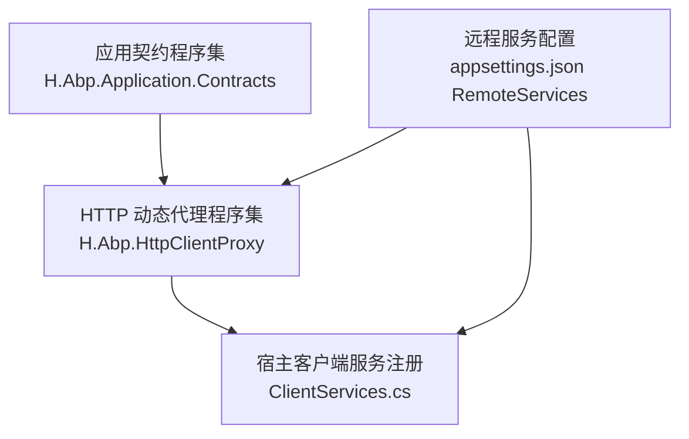
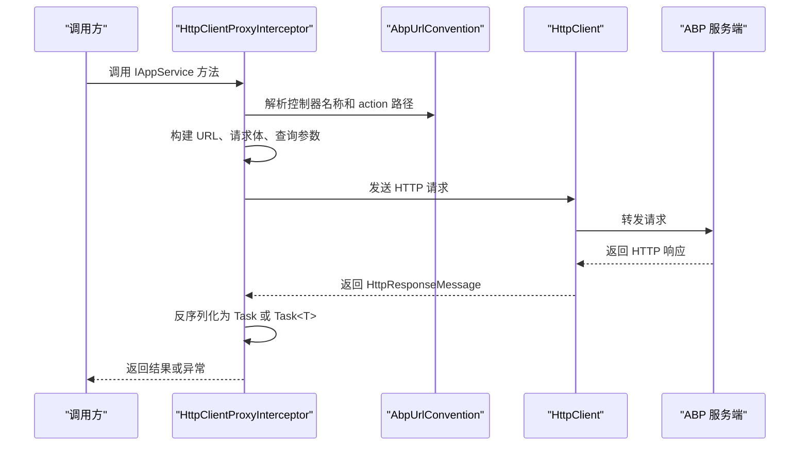
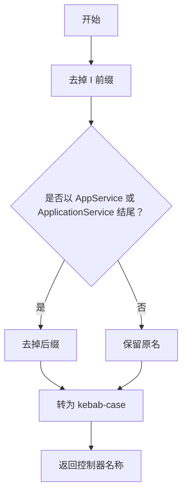
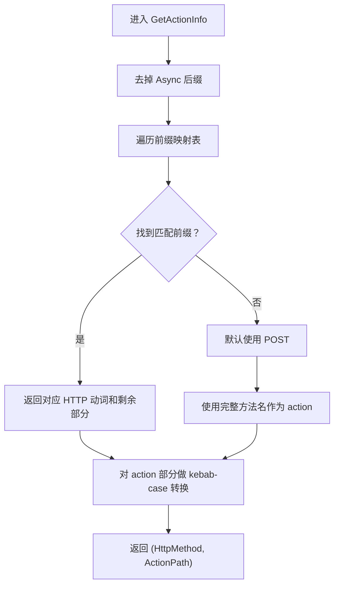
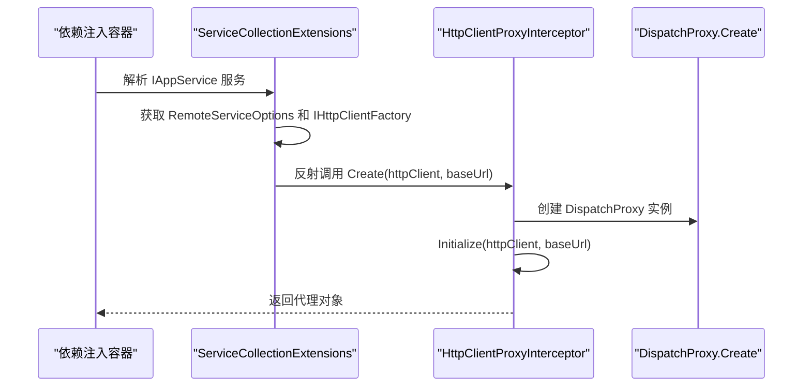
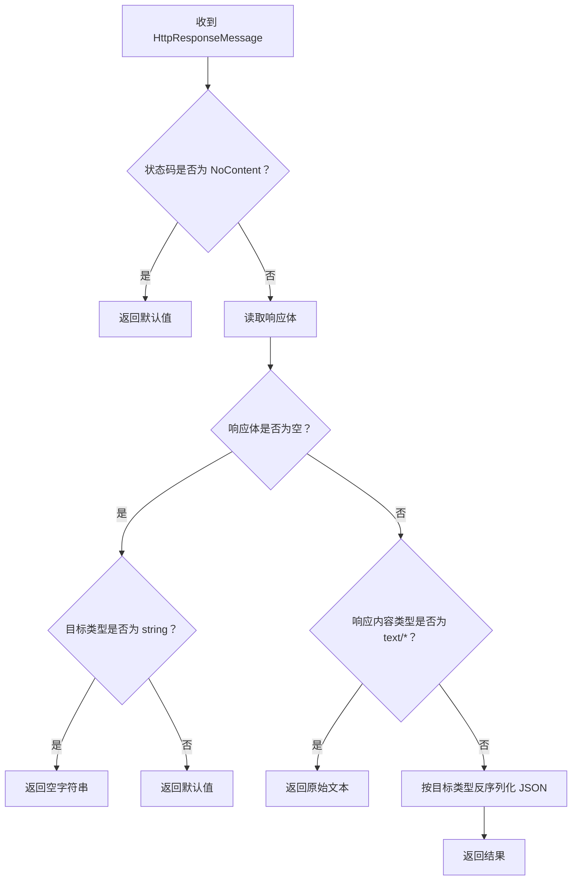
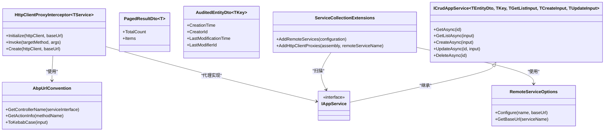
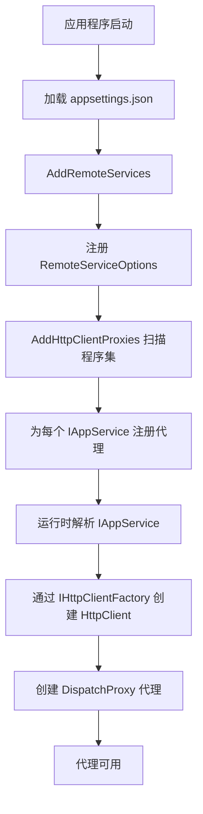
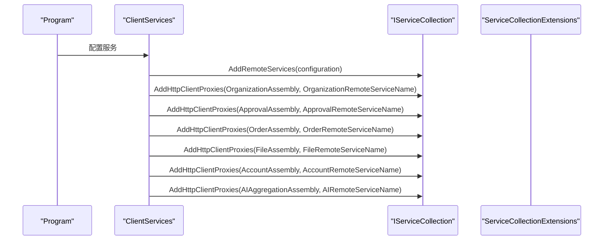

# HTTP 动态代理

<cite>
**本文引用的文件**   
- [AbpUrlConvention.cs](file://src/Utils/H.Abp.HttpClientProxy/AbpUrlConvention.cs)
- [HttpClientProxyInterceptor.cs](file://src/Utils/H.Abp.HttpClientProxy/HttpClientProxyInterceptor.cs)
- [ServiceCollectionExtensions.cs](file://src/Utils/H.Abp.HttpClientProxy/ServiceCollectionExtensions.cs)
- [RemoteServiceOptions.cs](file://src/Utils/H.Abp.HttpClientProxy/RemoteServiceOptions.cs)
- [IAppService.cs](file://src/Utils/H.Abp.Application.Contracts/IAppService.cs)
- [ICrudAppService.cs](file://src/Utils/H.Abp.Application.Contracts/ICrudAppService.cs)
- [PagedResultDto.cs](file://src/Utils/H.Abp.Application.Contracts/PagedResultDto.cs)
- [AuditedEntityDto.cs](file://src/Utils/H.Abp.Application.Contracts/AuditedEntityDto.cs)
- [README.md](file://README.md)
- [H.AppLab.Web.Host.Client ClientServices.cs](file://src/Host/H.AppLab.Web.Host/H.AppLab.Web.Host.Client/ClientServices.cs)
</cite>

## 目录

1. [引言](#引言)
2. [项目结构](#项目结构)
3. [核心组件](#核心组件)
4. [架构总览](#架构总览)
5. [详细组件分析](#详细组件分析)
6. [依赖关系分析](#依赖关系分析)
7. [性能与行为特性](#性能与行为特性)
8. [接口契约设计规范](#接口契约设计规范)
9. [服务注册与配置流程](#服务注册与配置流程)
10. [实际 API 调用示例](#实际-api-调用示例)
11. [故障排除指南](#故障排除指南)
12. [结论](#结论)

## 引言

本技术文档聚焦 H.AppLab 中的 HTTP 动态代理子系统。该子系统位于 `H.Abp.HttpClientProxy`，基于 .NET 的 `DispatchProxy` 实现运行时代理，将业务层定义的 `IAppService` 接口方法自动转换为 ABP 风格 HTTP 请求。其设计目标是：

- 让前端或客户端仅依赖契约程序集中的接口定义，无需手写 `HttpClient` 调用。
- 通过约定优于配置的方式，把接口名和方法名映射为 HTTP 动词、路径段和查询参数。
- 提供统一的远程服务地址管理、JSON 序列化策略、异步返回类型处理和错误响应处理。
- 与服务端 ABP 应用服务保持路由和命名约定一致，使同一套接口在进程内和服务间通信时语义统一。

项目 README 明确指出：前端基于 `IAppService` 动态调用 HTTP，使用 `DispatchProxy` 拦截接口方法，按 ABP 路由约定转换请求，并通过 `AddHttpClientProxies` 批量注册代理；远程服务地址由配置节点统一管理。

**章节来源**
- [README.md:1-73](file://README.md#L1-L73)

## 项目结构

HTTP 动态代理相关代码集中在两个程序集：

| 程序集 | 职责 | 关键文件 |
|---|---|---|
| `H.Abp.Application.Contracts` | 定义可被代理的应用服务契约和通用 DTO | `IAppService.cs`、`ICrudAppService.cs`、`PagedResultDto.cs`、`AuditedEntityDto.cs` |
| `H.Abp.HttpClientProxy` | 实现 URL 约定、动态代理、服务注册和远程服务配置 | `AbpUrlConvention.cs`、`HttpClientProxyInterceptor.cs`、`ServiceCollectionExtensions.cs`、`RemoteServiceOptions.cs` |



**图表来源**
- [IAppService.cs:1-8](file://src/Utils/H.Abp.Application.Contracts/IAppService.cs#L1-L8)
- [AbpUrlConvention.cs:1-86](file://src/Utils/H.Abp.HttpClientProxy/AbpUrlConvention.cs#L1-L86)
- [HttpClientProxyInterceptor.cs:1-234](file://src/Utils/H.Abp.HttpClientProxy/HttpClientProxyInterceptor.cs#L1-L234)
- [ServiceCollectionExtensions.cs:1-63](file://src/Utils/H.Abp.HttpClientProxy/ServiceCollectionExtensions.cs#L1-L63)
- [H.AppLab.Web.Host.Client ClientServices.cs:52-165](file://src/Host/H.AppLab.Web.Host/H.AppLab.Web.Host.Client/ClientServices.cs#L52-L165)

**章节来源**
- [README.md:1-73](file://README.md#L1-L73)
- [IAppService.cs:1-8](file://src/Utils/H.Abp.Application.Contracts/IAppService.cs#L1-L8)
- [AbpUrlConvention.cs:1-86](file://src/Utils/H.Abp.HttpClientProxy/AbpUrlConvention.cs#L1-L86)
- [HttpClientProxyInterceptor.cs:1-234](file://src/Utils/H.Abp.HttpClientProxy/HttpClientProxyInterceptor.cs#L1-L234)
- [ServiceCollectionExtensions.cs:1-63](file://src/Utils/H.Abp.HttpClientProxy/ServiceCollectionExtensions.cs#L1-L63)
- [H.AppLab.Web.Host.Client ClientServices.cs:52-165](file://src/Host/H.AppLab.Web.Host/H.AppLab.Web.Host.Client/ClientServices.cs#L52-L165)

## 核心组件

HTTP 动态代理系统由四个核心部分组成：

| 组件 | 类型 | 主要职责 |
|---|---|---|
| `IAppService` | 标记接口 | 标识可通过 HTTP 代理调用的应用服务接口 |
| `AbpUrlConvention` | 静态工具类 | 将接口名和方法名转换为 ABP 风格的控制器名称、HTTP 动词和 action 路径 |
| `HttpClientProxyInterceptor<TService>` | `DispatchProxy` 拦截器 | 拦截接口方法调用，构造 HTTP 请求并解析响应 |
| `ServiceCollectionExtensions` | DI 扩展 | 扫描程序集、注册代理实例、加载远程服务配置 |
| `RemoteServiceOptions` | 配置容器 | 维护多个远程服务的 `BaseUrl` |

其中，`ICrudAppService<TEntityDto, TKey, TGetListInput, TCreateInput, TUpdateInput>` 是典型的可代理接口模式，定义了 `GetAsync`、`GetListAsync`、`CreateAsync`、`UpdateAsync`、`DeleteAsync` 等方法，配合 `BaseOutput<T>` 和 `PagedResultDto<T>` 构成标准 CRUD 契约。

**章节来源**
- [IAppService.cs:1-8](file://src/Utils/H.Abp.Application.Contracts/IAppService.cs#L1-L8)
- [ICrudAppService.cs:1-15](file://src/Utils/H.Abp.Application.Contracts/ICrudAppService.cs#L1-L15)
- [PagedResultDto.cs:1-19](file://src/Utils/H.Abp.Application.Contracts/PagedResultDto.cs#L1-L19)
- [AuditedEntityDto.cs:1-9](file://src/Utils/H.Abp.Application.Contracts/AuditedEntityDto.cs#L1-L9)
- [AbpUrlConvention.cs:1-86](file://src/Utils/H.Abp.HttpClientProxy/AbpUrlConvention.cs#L1-L86)
- [HttpClientProxyInterceptor.cs:1-234](file://src/Utils/H.Abp.HttpClientProxy/HttpClientProxyInterceptor.cs#L1-L234)
- [ServiceCollectionExtensions.cs:1-63](file://src/Utils/H.Abp.HttpClientProxy/ServiceCollectionExtensions.cs#L1-L63)
- [RemoteServiceOptions.cs:1-33](file://src/Utils/H.Abp.HttpClientProxy/RemoteServiceOptions.cs#L1-L33)

## 架构总览

从调用方到远端 ABP 应用的完整数据流如下：



**图表来源**
- [HttpClientProxyInterceptor.cs:23-63](file://src/Utils/H.Abp.HttpClientProxy/HttpClientProxyInterceptor.cs#L23-L63)
- [HttpClientProxyInterceptor.cs:64-199](file://src/Utils/H.Abp.HttpClientProxy/HttpClientProxyInterceptor.cs#L64-L199)
- [HttpClientProxyInterceptor.cs:201-234](file://src/Utils/H.Abp.HttpClientProxy/HttpClientProxyInterceptor.cs#L201-L234)
- [AbpUrlConvention.cs:12-86](file://src/Utils/H.Abp.HttpClientProxy/AbpUrlConvention.cs#L12-L86)

该架构的关键特点是：

1. **接口即契约**：调用方只引用 `IAppService` 及其派生接口。
2. **运行时代理**：不生成源代码，而是在运行时通过 `DispatchProxy` 创建代理对象。
3. **约定驱动**：URL、HTTP 动词、路径参数和查询参数都由接口签名决定。
4. **配置分离**：远程服务地址不在接口中硬编码，而是通过 `RemoteServices` 配置项注入。

**章节来源**
- [HttpClientProxyInterceptor.cs:1-234](file://src/Utils/H.Abp.HttpClientProxy/HttpClientProxyInterceptor.cs#L1-L234)
- [AbpUrlConvention.cs:1-86](file://src/Utils/H.Abp.HttpClientProxy/AbpUrlConvention.cs#L1-L86)
- [ServiceCollectionExtensions.cs:1-63](file://src/Utils/H.Abp.HttpClientProxy/ServiceCollectionExtensions.cs#L1-L63)

## 详细组件分析

### `AbpUrlConvention`：ABP URL 约定转换器

`AbpUrlConvention` 负责三类转换：

| 转换目标 | 输入 | 输出 | 规则 |
|---|---|---|---|
| 控制器名称 | 接口类型 | kebab-case 字符串 | 去掉 `I` 前缀，去掉 `AppService` 或 `ApplicationService` 后缀，再转为连字符风格 |
| HTTP 动词和 action | 方法名 | `(HttpMethod, string)` | 匹配 ABP 前缀如 `Get`、`Create`、`Update`、`Delete` 等，未匹配则默认 POST |
| 路径片段 | PascalCase 字符串 | kebab-case 字符串 | 先转 camelCase，再在大写字母前插入连字符，最后全部小写 |

#### 控制器名称解析

控制器名称来自接口类型名。例如：

- `IPageAppService` → `page`
- `IAppApplicationService` → `app-application`

规则是：

1. 如果首字母是 `I` 且第二个字母大写，则去掉 `I`。
2. 如果以 `ApplicationService` 结尾，去掉该后缀。
3. 否则如果以 `AppService` 结尾，去掉该后缀。
4. 最终用 kebab-case 规则转换。

#### HTTP 动词映射

方法名前缀决定 HTTP 动词：

| 前缀 | HTTP 动词 |
|---|---|
| `GetList` | GET |
| `GetAll` | GET |
| `Get` | GET |
| `Put` | PUT |
| `Update` | PUT |
| `Delete` | DELETE |
| `Remove` | DELETE |
| `Create` | POST |
| `Add` | POST |
| `Insert` | POST |
| `Post` | POST |
| `Patch` | PATCH |

若没有匹配前缀，则默认使用 POST，并将完整方法名转为 kebab-case 作为 action 路径。

#### kebab-case 转换

kebab-case 转换遵循以下规则：

1. 将第一个字符转为小写。
2. 在小写字母或数字与大写字母之间插入连字符。
3. 将结果整体转为小写。

注意：正则表达式会将连续大写字母按“前一个小写字母或数字 + 剩余大写字母”切分，因此像 `LLM` 这类缩写可能产生非直觉的分割行为。这是当前实现与 ABP 服务端保持一致的策略，但在自定义接口命名时应尽量避免歧义。



**图表来源**
- [AbpUrlConvention.cs:12-33](file://src/Utils/H.Abp.HttpClientProxy/AbpUrlConvention.cs#L12-L33)

#### 方法动作解析流程



**图表来源**
- [AbpUrlConvention.cs:35-62](file://src/Utils/H.Abp.HttpClientProxy/AbpUrlConvention.cs#L35-L62)

**章节来源**
- [AbpUrlConvention.cs:1-86](file://src/Utils/H.Abp.HttpClientProxy/AbpUrlConvention.cs#L1-L86)

### `HttpClientProxyInterceptor<TService>`：DispatchProxy 动态代理

`HttpClientProxyInterceptor<TService>` 是系统的核心运行时组件。它继承 `DispatchProxy`，并在每个接口方法调用时执行以下逻辑：

1. 获取目标方法信息。
2. 使用 `AbpUrlConvention.GetActionInfo` 解析 HTTP 动词和 action 路径。
3. 根据参数列表构建完整 URL。
4. 判断是否需要设置请求体。
5. 根据返回类型选择同步式包装或异步结果处理。
6. 通过 `HttpClient.SendAsync` 发起请求。
7. 校验状态码并反序列化响应体。

#### 初始化过程

代理对象通过静态工厂方法 `Create(HttpClient httpClient, string baseUrl)` 创建：



**图表来源**
- [ServiceCollectionExtensions.cs:43-63](file://src/Utils/H.Abp.HttpClientProxy/ServiceCollectionExtensions.cs#L43-L63)
- [HttpClientProxyInterceptor.cs:225-234](file://src/Utils/H.Abp.HttpClientProxy/HttpClientProxyInterceptor.cs#L225-L234)

#### URL 构建规则

URL 基础路径为：

`{baseUrl}/api/app/{controller}`

路径段追加顺序如下：

1. 查找名为 `id` 的简单类型参数，将其作为路径段插入 controller 之后。
2. 如果有 action 路径，追加 `/action-path`。
3. 查找恰好一个以 `Id` 结尾的非 `id` 简单类型参数，追加为第二个路径段。
4. 剩余简单类型参数放入查询字符串。
5. GET 或 DELETE 请求中的复杂类型参数会展开为查询参数。
6. POST 或 PUT 请求中的复杂类型参数作为 JSON 请求体。

#### 参数分类规则

| 参数特征 | 处理方式 |
|---|---|
| 名为 `id` 的简单类型参数 | 路径参数 |
| 唯一以 `Id` 结尾的非 `id` 简单类型参数 | 第二个路径参数 |
| 其他简单类型参数 | 查询参数 |
| 复杂类型参数 | POST/PUT 时作为请求体；GET/DELETE 时展开为查询属性 |
| 值为 null 的参数 | 跳过 |

#### 值格式化规则

| 类型 | 序列化格式 |
|---|---|
| `DateTime` | ISO 8601 长格式 `"O"` |
| `DateTimeOffset` | ISO 8601 长格式 `"O"` |
| `bool` | `"true"` 或 `"false"` |
| 其他类型 | 调用 `ToString()` |

#### 响应处理规则

| 响应情况 | 处理方式 |
|---|---|
| 返回类型为 `Task` | 直接发送请求并检查状态码 |
| 返回类型为 `Task<T>` | 读取响应体并按类型反序列化 |
| 状态码为 `NoContent` | 返回默认值 |
| 响应体为空字符串 | 返回类型默认值，字符串类型返回空字符串 |
| 响应类型为纯文本且目标类型为 `string` | 直接返回原文 |
| 其他 JSON 响应 | 使用驼峰命名策略反序列化 |



**图表来源**
- [HttpClientProxyInterceptor.cs:201-224](file://src/Utils/H.Abp.HttpClientProxy/HttpClientProxyInterceptor.cs#L201-L224)

**章节来源**
- [HttpClientProxyInterceptor.cs:1-234](file://src/Utils/H.Abp.HttpClientProxy/HttpClientProxyInterceptor.cs#L1-L234)

### `ServiceCollectionExtensions`：服务注册与扫描

`ServiceCollectionExtensions` 提供两个关键扩展方法：

| 方法 | 作用 |
|---|---|
| `AddRemoteServices(IConfiguration)` | 从配置节 `RemoteServices` 加载远程服务基础地址 |
| `AddHttpClientProxies(Assembly, string)` | 扫描程序集中所有实现 `IAppService` 的接口，并为每个接口注册代理实现 |

#### 远程服务配置加载

`AddRemoteServices` 会：

1. 创建 `RemoteServiceOptions`。
2. 读取 `configuration.GetSection("RemoteServices")`。
3. 遍历子配置项。
4. 若存在 `BaseUrl`，则调用 `options.Configure(name, baseUrl)`。
5. 将 `RemoteServiceOptions` 作为单例注册。

#### 代理扫描与注册

`AddHttpClientProxies` 会：

1. 获取传入程序集的所有类型。
2. 筛选出满足以下条件的类型：
   - 是接口。
   - 不是泛型接口。
   - 实现了 `IAppService`。
   - 不是 `IAppService` 本身。
3. 对每个符合条件的接口调用 `RegisterProxy`。

`RegisterProxy` 使用 `AddScoped` 注册代理实例，每次解析时：

1. 从容器中获取 `RemoteServiceOptions`。
2. 通过 `IHttpClientFactory` 创建命名 `HttpClient`。
3. 从 `RemoteServiceOptions` 获取该远程服务的 `BaseUrl`。
4. 通过反射调用 `HttpClientProxyInterceptor<TService>.Create(httpClient, baseUrl)` 创建代理。

这种设计的优点是：

- 每个代理实例绑定到同一个 `HttpClient` 和同一个 `BaseUrl`。
- 支持多个远程服务共享同一个 `HttpClient` 命名实例。
- 支持按程序集维度注册不同服务的代理。

**章节来源**
- [ServiceCollectionExtensions.cs:1-63](file://src/Utils/H.Abp.HttpClientProxy/ServiceCollectionExtensions.cs#L1-L63)

### `RemoteServiceOptions`：远程服务配置

`RemoteServiceOptions` 维护一个字典，键为远程服务名称，值为 `RemoteServiceConfiguration`，包含 `BaseUrl`。

| 成员 | 行为 |
|---|---|
| `this[string name]` | 按名称访问或创建配置 |
| `Configure(string name, string baseUrl)` | 配置某个远程服务的基础地址，并去除末尾斜杠 |
| `GetBaseUrl(string serviceName)` | 获取某个远程服务的基础地址，不存在时返回空字符串 |

该配置通常来自 `appsettings.json` 的 `RemoteServices` 节点，例如：

```json
{
  "RemoteServices": {
    "AccountRemoteServiceName": {
      "BaseUrl": "https://account-service.example.com"
    },
    "OrganizationRemoteServiceName": {
      "BaseUrl": "https://organization-service.example.com"
    }
  }
}
```

**章节来源**
- [RemoteServiceOptions.cs:1-33](file://src/Utils/H.Abp.HttpClientProxy/RemoteServiceOptions.cs#L1-L33)

## 依赖关系分析



**图表来源**
- [IAppService.cs:1-8](file://src/Utils/H.Abp.Application.Contracts/IAppService.cs#L1-L8)
- [ICrudAppService.cs:1-15](file://src/Utils/H.Abp.Application.Contracts/ICrudAppService.cs#L1-L15)
- [PagedResultDto.cs:1-19](file://src/Utils/H.Abp.Application.Contracts/PagedResultDto.cs#L1-L19)
- [AuditedEntityDto.cs:1-9](file://src/Utils/H.Abp.Application.Contracts/AuditedEntityDto.cs#L1-L9)
- [AbpUrlConvention.cs:1-86](file://src/Utils/H.Abp.HttpClientProxy/AbpUrlConvention.cs#L1-L86)
- [HttpClientProxyInterceptor.cs:1-234](file://src/Utils/H.Abp.HttpClientProxy/HttpClientProxyInterceptor.cs#L1-L234)
- [ServiceCollectionExtensions.cs:1-63](file://src/Utils/H.Abp.HttpClientProxy/ServiceCollectionExtensions.cs#L1-L63)
- [RemoteServiceOptions.cs:1-33](file://src/Utils/H.Abp.HttpClientProxy/RemoteServiceOptions.cs#L1-L33)

### 耦合与内聚性

- `AbpUrlConvention` 是纯静态工具类，无外部状态，内聚性高、耦合度低。
- `HttpClientProxyInterceptor<TService>` 依赖 `HttpClient`、`JsonSerializer`、`AbpUrlConvention`，职责明确但承担较多协议转换逻辑。
- `ServiceCollectionExtensions` 依赖 `RemoteServiceOptions`、`IHttpClientFactory` 和反射机制，承担基础设施装配职责。
- `RemoteServiceOptions` 与配置系统解耦，只暴露基础 API。

### 潜在风险点

1. **反射开销**：每次解析代理时会反射调用 `Create` 方法，属于一次性成本，通常可接受。
2. **正则表达式缓存**：`GeneratedRegex` 在现代 .NET 中具备缓存能力，但仍应避免在热路径中频繁重复构造复杂正则。
3. **复杂类型展开查询参数**：当前实现仅递归一层属性，深层嵌套对象不会被完全展开，这在 GET 请求中可能导致后端无法正确解析。
4. **认证令牌注入**：当前代理实现未内置认证中间件，需依赖 `HttpClient` 外层配置或自定义 `DelegatingHandler`。
5. **重试机制**：当前代理未实现指数退避重试，需结合 Polly 或其他重试策略扩展。

**章节来源**
- [HttpClientProxyInterceptor.cs:1-234](file://src/Utils/H.Abp.HttpClientProxy/HttpClientProxyInterceptor.cs#L1-L234)
- [ServiceCollectionExtensions.cs:1-63](file://src/Utils/H.Abp.HttpClientProxy/ServiceCollectionExtensions.cs#L1-L63)
- [AbpUrlConvention.cs:1-86](file://src/Utils/H.Abp.HttpClientProxy/AbpUrlConvention.cs#L1-L86)

## 性能与行为特性

### 时间复杂度

| 操作 | 时间复杂度 | 说明 |
|---|---|---|
| 控制器名称解析 | O(n) | n 为接口名长度 |
| action 解析 | O(k) | k 为前缀映射表大小，固定常量 |
| kebab-case 转换 | O(n) | n 为字符串长度 |
| URL 构建 | O(p) | p 为参数数量 |
| 复杂类型展开查询参数 | O(m) | m 为公开属性数量 |
| JSON 序列化/反序列化 | O(s) | s 为对象大小 |

### 空间复杂度

- 代理实例持有 `HttpClient` 引用和基础 URL，内存占用较小。
- JSON 序列化选项为静态字段，全局复用。
- 查询参数列表在单次请求后释放。

### 异步模型

代理仅支持以下返回类型：

- `Task`
- `Task<T>`

不支持：

- 同步返回值
- `ValueTask`
- 协程或非标准异步模式

### 并发行为

- `HttpClient` 通常由 `IHttpClientFactory` 管理生命周期，建议复用而非频繁创建。
- `HttpClientProxyInterceptor` 本身不是线程安全对象，应通过依赖注入容器解析实例，避免共享实例。

### 可扩展点

当前实现未提供显式的拦截管道，但可在以下位置扩展：

- 在 `HttpClient` 外层添加 `DelegatingHandler` 实现认证、日志、重试。
- 在 `AddHttpClientProxies` 之前注册自定义 `HttpClient`。
- 替换 `RemoteServiceOptions` 的实现以支持动态配置源。

**章节来源**
- [HttpClientProxyInterceptor.cs:1-234](file://src/Utils/H.Abp.HttpClientProxy/HttpClientProxyInterceptor.cs#L1-L234)
- [ServiceCollectionExtensions.cs:1-63](file://src/Utils/H.Abp.HttpClientProxy/ServiceCollectionExtensions.cs#L1-L63)

## 接口契约设计规范

### 命名约定

#### 接口命名

建议使用 ABP 风格的服务接口命名：

- 以 `I` 开头。
- 以 `AppService` 或 `ApplicationService` 结尾。
- 使用清晰的业务领域词，如 `OrderAppService`、`UserManagementAppService`。

避免：

- 以动词开头的接口名。
- 过度抽象的接口名，如 `IService`、`IManager`。
- 与现有 ABP 约定冲突的名称。

#### 方法命名

方法名应体现 HTTP 语义：

| 意图 | 推荐前缀 | HTTP 动词 |
|---|---|---|
| 获取单个资源 | `GetXxx` | GET |
| 获取列表 | `GetListXxx` | GET |
| 获取全部 | `GetAllXxx` | GET |
| 创建资源 | `CreateXxx`、`AddXxx`、`InsertXxx` | POST |
| 更新资源 | `UpdateXxx`、`PutXxx` | PUT |
| 删除资源 | `DeleteXxx`、`RemoveXxx` | DELETE |
| 部分更新 | `PatchXxx` | PATCH |

#### 参数命名

- 主键参数命名为 `id`。
- 附加路径参数以 `XxxId` 命名。
- 查询对象使用 DTO，避免过多散落的简单参数。
- 分页查询推荐使用 `PagedAndSortedResultRequestDto` 风格输入对象。

### 参数验证

当前代理不会在服务端之外进行强类型参数校验，建议：

- 在服务端对输入 DTO 使用验证特性。
- 对必填字段使用不可为空类型或 `[Required]`。
- 对枚举参数使用枚举类型而非字符串。
- 对日期时间使用 `DateTime` 或 `DateTimeOffset`，以便统一序列化。

### 返回类型定义

推荐返回类型：

| 场景 | 返回类型 |
|---|---|
| 普通业务结果 | `Task<BaseOutput<T>>` |
| 分页结果 | `Task<BaseOutput<PagedResultDto<T>>>` |
| 无返回 | `Task` |
| 字符串响应 | `Task<string>` |
| 成功但无内容 | `Task` 或 `Task<bool>` |

`PagedResultDto<T>` 已提供与 ABP 兼容的 `TotalCount` 和 `Items` 结构，适合前端分页展示。

### 异常处理最佳实践

当前代理会对非成功状态码抛出异常，因此建议：

- 服务端对 400、404、500 等状态码返回结构化错误。
- 前端捕获代理抛出的网络或 HTTP 异常。
- 不要依赖代理自动重试，应在更外层实现重试策略。
- 对幂等请求谨慎启用重试。

**章节来源**
- [ICrudAppService.cs:1-15](file://src/Utils/H.Abp.Application.Contracts/ICrudAppService.cs#L1-L15)
- [PagedResultDto.cs:1-19](file://src/Utils/H.Abp.Application.Contracts/PagedResultDto.cs#L1-L19)
- [HttpClientProxyInterceptor.cs:64-199](file://src/Utils/H.Abp.HttpClientProxy/HttpClientProxyInterceptor.cs#L64-L199)
- [HttpClientProxyInterceptor.cs:201-234](file://src/Utils/H.Abp.HttpClientProxy/HttpClientProxyInterceptor.cs#L201-L234)

## 服务注册与配置流程

### 总体流程



**图表来源**
- [ServiceCollectionExtensions.cs:14-63](file://src/Utils/H.Abp.HttpClientProxy/ServiceCollectionExtensions.cs#L14-L63)
- [H.AppLab.Web.Host.Client ClientServices.cs:52-165](file://src/Host/H.AppLab.Web.Host/H.AppLab.Web.Host.Client/ClientServices.cs#L52-L165)

### 典型宿主客户端注册方式

在 `H.AppLab.Web.Host.Client` 的 `ClientServices.cs` 中，典型注册流程包括：

1. 调用 `AddRemoteServices(configuration)` 加载远程服务配置。
2. 多次调用 `AddHttpClientProxies`，每个业务模块传入其契约程序集和对应的远程服务名称。
3. 各模块通过 `IAppService` 接口被依赖注入容器解析。



**图表来源**
- [H.AppLab.Web.Host.Client ClientServices.cs:52-165](file://src/Host/H.AppLab.Web.Host/H.AppLab.Web.Host.Client/ClientServices.cs#L52-L165)

### 认证令牌注入

当前代理实现不包含认证令牌注入逻辑。常见做法是：

1. 在 `HttpClient` 外层注册自定义 `DelegatingHandler`。
2. 在 handler 中从身份上下文或 token store 读取令牌。
3. 将令牌写入 `Authorization` 请求头。
4. 将配置好的 `HttpClient` 注册为命名客户端，供 `AddHttpClientProxies` 使用。

由于代理通过 `IHttpClientFactory.CreateClient(remoteServiceName)` 获取 `HttpClient`，因此认证逻辑应放在 `HttpClient` 层面，而不是代理内部。

### 重试机制

当前代理未内置重试。推荐方案：

1. 使用 Polly 对 `HttpClient` 配置重试策略。
2. 对幂等 GET 请求启用有限次重试。
3. 对写操作禁用自动重试，除非有明确的幂等保障。
4. 对超时、连接失败等瞬态错误启用指数退避。

### 中间件管道

该动态代理运行在客户端侧，不涉及服务端中间件管道。服务端的 ABP 应用服务仍由服务端中间件处理 HTTP 路由、授权、验证和模型绑定。

**章节来源**
- [ServiceCollectionExtensions.cs:14-63](file://src/Utils/H.Abp.HttpClientProxy/ServiceCollectionExtensions.cs#L14-L63)
- [H.AppLab.Web.Host.Client ClientServices.cs:52-165](file://src/Host/H.AppLab.Web.Host/H.AppLab.Web.Host.Client/ClientServices.cs#L52-L165)

## 实际 API 调用示例

以下示例描述接口定义如何映射到 HTTP 请求，不展示具体代码内容。

### 示例一：获取用户详情

假设存在接口方法：

`Task<BaseOutput<UserDto>> GetUserAsync(Guid id)`

映射结果：

| 项目 | 值 |
|---|---|
| HTTP 动词 | GET |
| 路径 | `/api/app/user/get-user` |
| 路径参数 | `id` |
| 请求体 | 无 |
| 查询参数 | 无 |
| 响应类型 | `BaseOutput<UserDto>` |

### 示例二：分页查询订单

假设存在接口方法：

`Task<BaseOutput<PagedResultDto<OrderDto>>> GetOrderListAsync(GetOrderListInput input)`

映射结果：

| 项目 | 值 |
|---|---|
| HTTP 动词 | GET |
| 路径 | `/api/app/order/get-order-list` |
| 路径参数 | 无 |
| 请求体 | 无 |
| 查询参数 | `input` 的属性展开为查询参数 |
| 响应类型 | `BaseOutput<PagedResultDto<OrderDto>>` |

### 示例三：创建用户

假设存在接口方法：

`Task<BaseOutput<UserDto>> CreateUserAsync(CreateUserInput input)`

映射结果：

| 项目 | 值 |
|---|---|
| HTTP 动词 | POST |
| 路径 | `/api/app/user/create-user` |
| 路径参数 | 无 |
| 请求体 | `CreateUserInput` 的 JSON |
| 查询参数 | 无 |
| 响应类型 | `BaseOutput<UserDto>` |

### 示例四：更新用户

假设存在接口方法：

`Task<BaseOutput<UserDto>> UpdateUserAsync(Guid id, UpdateUserInput input)`

映射结果：

| 项目 | 值 |
|---|---|
| HTTP 动词 | PUT |
| 路径 | `/api/app/user/update/{id}` |
| 路径参数 | `id` |
| 请求体 | `UpdateUserInput` 的 JSON |
| 查询参数 | 无 |
| 响应类型 | `BaseOutput<UserDto>` |

### 示例五：删除用户

假设存在接口方法：

`Task DeleteUserAsync(Guid id)`

映射结果：

| 项目 | 值 |
|---|---|
| HTTP 动词 | DELETE |
| 路径 | `/api/app/user/delete/{id}` |
| 路径参数 | `id` |
| 请求体 | 无 |
| 查询参数 | 无 |
| 响应类型 | `Task` |

**章节来源**
- [AbpUrlConvention.cs:35-62](file://src/Utils/H.Abp.HttpClientProxy/AbpUrlConvention.cs#L35-L62)
- [HttpClientProxyInterceptor.cs:64-199](file://src/Utils/H.Abp.HttpClientProxy/HttpClientProxyInterceptor.cs#L64-L199)
- [ICrudAppService.cs:1-15](file://src/Utils/H.Abp.Application.Contracts/ICrudAppService.cs#L1-L15)

## 故障排除指南

### 问题一：URL 不符合预期

**现象**：生成的 URL 路径与方法名不一致。

**可能原因**：

- 接口名或服务名不符合 ABP 约定。
- 方法名前缀不在支持的映射表中。
- kebab-case 转换与后端路由不一致。

**排查步骤**：

1. 确认接口以 `I` 开头并以 `AppService` 或 `ApplicationService` 结尾。
2. 确认方法名使用 `Get`、`Create`、`Update`、`Delete` 等前缀。
3. 检查方法名是否存在歧义缩写。
4. 对比后端 ABP 控制器路由定义。

**章节来源**
- [AbpUrlConvention.cs:12-86](file://src/Utils/H.Abp.HttpClientProxy/AbpUrlConvention.cs#L12-L86)

### 问题二：POST 请求没有请求体

**现象**：服务端接收不到复杂参数。

**可能原因**：

- 参数类型被识别为简单类型。
- 参数值为 `null`。
- 使用了 GET 或 DELETE 请求，复杂参数会被展开为查询参数而不是请求体。

**排查步骤**：

1. 确认参数类型不是基本类型、字符串、枚举或 Guid。
2. 确认参数不为 `null`。
3. 确认方法是 POST 或 PUT。
4. 如果是 GET/DELETE，检查后端是否支持从查询参数接收对象属性。

**章节来源**
- [HttpClientProxyInterceptor.cs:83-114](file://src/Utils/H.Abp.HttpClientProxy/HttpClientProxyInterceptor.cs#L83-L114)
- [HttpClientProxyInterceptor.cs:146-170](file://src/Utils/H.Abp.HttpClientProxy/HttpClientProxyInterceptor.cs#L146-L170)

### 问题三：日期时间格式不正确

**现象**：服务端无法解析客户端传来的日期时间。

**可能原因**：

- 后端期望的日期时间格式与代理使用的 ISO 8601 `"O"` 格式不一致。
- 客户端或服务端时区处理不一致。

**排查步骤**：

1. 确认参数类型为 `DateTime` 或 `DateTimeOffset`。
2. 检查服务端是否支持 ISO 8601 长格式。
3. 如需自定义格式，应扩展代理或在前端先行格式化。

**章节来源**
- [HttpClientProxyInterceptor.cs:116-145](file://src/Utils/H.Abp.HttpClientProxy/HttpClientProxyInterceptor.cs#L116-L145)

### 问题四：远程服务地址为空

**现象**：代理无法发起请求，或 URL 缺少基础地址。

**可能原因**：

- `RemoteServices` 配置缺失。
- 配置的远程服务名称与 `AddHttpClientProxies` 传入的名称不一致。
- `BaseUrl` 为空。

**排查步骤**：

1. 检查 `appsettings.json` 中是否存在 `RemoteServices`。
2. 确认远程服务名称与代码中一致。
3. 确认 `BaseUrl` 不为空且不含多余路径。
4. 检查 `RemoteServiceOptions.GetBaseUrl` 返回值。

**章节来源**
- [ServiceCollectionExtensions.cs:14-32](file://src/Utils/H.Abp.HttpClientProxy/ServiceCollectionExtensions.cs#L14-L32)
- [RemoteServiceOptions.cs:14-33](file://src/Utils/H.Abp.HttpClientProxy/RemoteServiceOptions.cs#L14-L33)

### 问题五：响应反序列化失败

**现象**：调用成功但返回结果为空或抛出反序列化异常。

**可能原因**：

- 服务端返回非 JSON 内容。
- 响应体为空字符串。
- 目标类型与服务端返回结构不一致。
- JSON 属性命名策略与后端不一致。

**排查步骤**：

1. 检查响应状态码是否为 200。
2. 检查响应内容类型是否为 JSON。
3. 检查目标类型是否与返回结构匹配。
4. 确认代理使用驼峰命名策略，与后端一致。

**章节来源**
- [HttpClientProxyInterceptor.cs:201-224](file://src/Utils/H.Abp.HttpClientProxy/HttpClientProxyInterceptor.cs#L201-L224)

### 问题六：未启用重试导致瞬时失败

**现象**：网络抖动或服务端短暂不可用时请求失败。

**可能原因**：

- 代理未内置重试。
- `HttpClient` 未配置重试策略。
- 对非幂等请求启用了重试。

**排查步骤**：

1. 区分瞬态错误和业务错误。
2. 为幂等请求配置有限重试。
3. 避免对 POST/PUT/DELETE 盲目重试。
4. 结合日志观察失败原因。

**章节来源**
- [HttpClientProxyInterceptor.cs:199-200](file://src/Utils/H.Abp.HttpClientProxy/HttpClientProxyInterceptor.cs#L199-L200)

## 结论

H.AppLab 的 HTTP 动态代理系统通过 `DispatchProxy` 将 `IAppService` 接口方法自动转换为 ABP 风格 HTTP 请求，实现了契约驱动、约定优先的远程服务调用模式。其核心价值在于：

- 减少样板代码：业务层只需定义接口，无需手写 HTTP 调用。
- 统一约定：URL、HTTP 动词、路径参数和查询参数由接口签名决定。
- 可配置远程地址：通过 `RemoteServices` 配置管理多服务基础地址。
- 支持异步返回：仅支持 `Task` 和 `Task<T>`，简化客户端异步编程模型。
- 与 ABP 生态对齐：控制器名称、方法前缀和分页结构尽量与 ABP 服务端保持一致。

在实际使用中，建议：

1. 严格遵循接口和方法命名约定。
2. 使用 DTO 组织复杂参数。
3. 在外层 `HttpClient` 配置认证、日志和重试。
4. 对 GET 请求的复杂对象谨慎使用查询参数展开。
5. 通过单元测试验证接口到 URL 的映射是否符合后端路由。

该子系统在当前仓库中承担了 WebAssembly 客户端与服务端 ABP 应用之间的桥梁作用，是 H.AppLab 模块化架构中客户端与服务端契约一致性的重要保障。