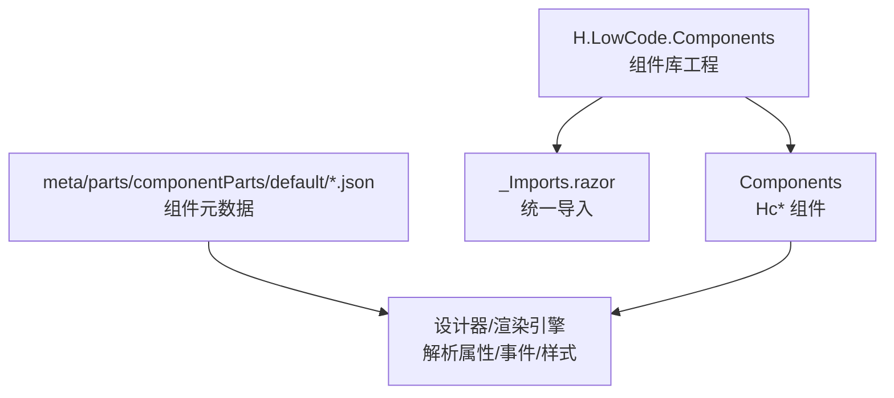
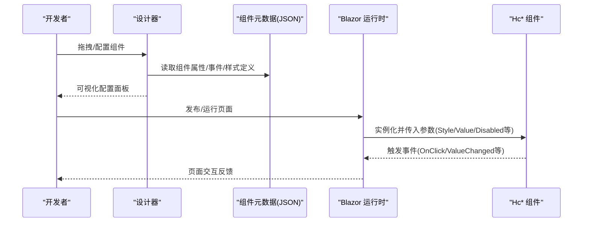
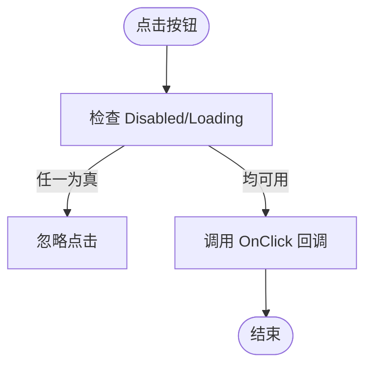
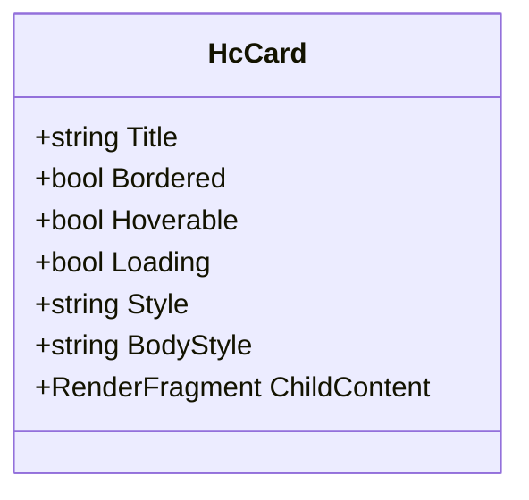
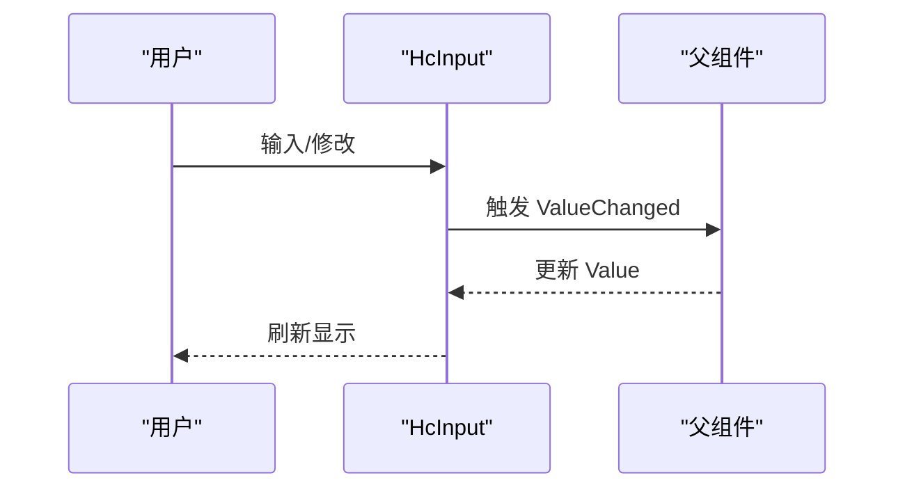
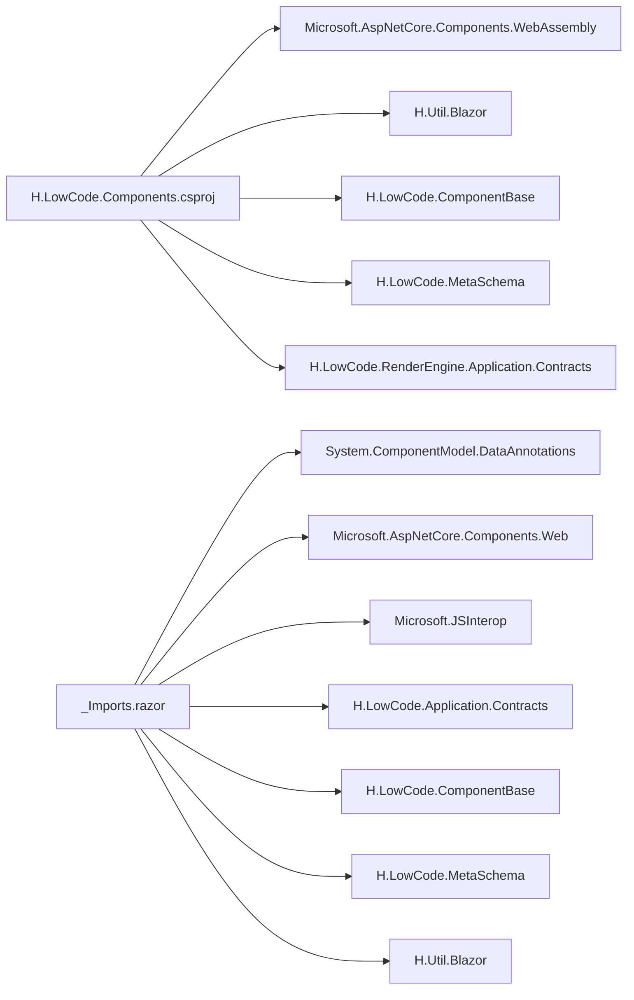

# UI组件库

<cite>
**本文引用的文件**
- [H.LowCode.Components.csproj](file://src/LowCode/Common/H.LowCode.Components/H.LowCode.Components.csproj)
- [_Imports.razor](file://src/LowCode/Common/H.LowCode.Components/_Imports.razor)
- [HcButton.razor](file://src/LowCode/Common/H.LowCode.Components/Components/HcButton.razor)
- [HcCard.razor](file://src/LowCode/Common/H.LowCode.Components/Components/HcCard.razor)
- [HcTag.razor](file://src/LowCode/Common/H.LowCode.Components/Components/HcTag.razor)
- [HcInput.razor](file://src/LowCode/Common/H.LowCode.Components/Components/HcInput.razor)
- [HcSelect.razor](file://src/LowCode/Common/H.LowCode.Components/Components/HcSelect.razor)
- [HcDatePicker.razor](file://src/LowCode/Common/H.LowCode.Components/Components/HcDatePicker.razor)
- [HcTable.razor](file://src/LowCode/Common/H.LowCode.Components/Components/HcTable.razor)
- [HcList.razor](file://src/LowCode/Common/H.LowCode.Components/Components/HcList.razor)
- [HcTree.razor](file://src/LowCode/Common/H.LowCode.Components/Components/HcTree.razor)
- [HcLayout.razor](file://src/LowCode/Common/H.LowCode.Components/Components/HcLayout.razor)
- [HcRow.razor](file://src/LowCode/Common/H.LowCode.Components/Components/HcRow.razor)
- [HcCol.razor](file://src/LowCode/Common/H.LowCode.Components/Components/HcCol.razor)
- [card.json](file://src/LowCode/meta/parts/componentParts/default/card.json)
- [datepicker.json](file://src/LowCode/meta/parts/componentParts/default/datepicker.json)
- [tree.json](file://src/LowCode/meta/parts/componentParts/default/tree.json)
</cite>

## 目录
1. [简介](#简介)
2. [项目结构](#项目结构)
3. [核心组件](#核心组件)
4. [架构总览](#架构总览)
5. [详细组件分析](#详细组件分析)
6. [依赖关系分析](#依赖关系分析)
7. [性能考虑](#性能考虑)
8. [故障排查指南](#故障排查指南)
9. [结论](#结论)
10. [附录](#附录)

## 简介
本文件为 AppLab 的默认 UI 组件库文档，覆盖基础、表单、数据展示与布局四大类组件。内容包含：
- 组件属性配置、事件处理与样式定制方法
- 使用示例与最佳实践
- 自定义组件开发规范与集成方式
- 响应式设计与可访问性支持建议
- 性能优化建议与常见问题解决方案

该组件库基于 Blazor 实现，位于 H.LowCode.Components 项目中，并通过 meta/schema 定义在低代码设计器中暴露属性与行为。

## 项目结构
- 组件库工程：H.LowCode.Components（Razor 组件集合）
- 公共导入：_Imports.razor 统一引入命名空间与常用类型
- 组件清单：Components 目录下按功能分类存放各 Hc* 组件
- 元数据定义：meta/parts/componentParts/default/*.json 描述组件属性、事件与样式等元信息，供设计器渲染与配置

图表来源
- [H.LowCode.Components.csproj:1-16](file://src/LowCode/Common/H.LowCode.Components/H.LowCode.Components.csproj#L1-L16)
- [_Imports.razor:1-10](file://src/LowCode/Common/H.LowCode.Components/_Imports.razor#L1-L10)

章节来源
- [H.LowCode.Components.csproj:1-16](file://src/LowCode/Common/H.LowCode.Components/H.LowCode.Components.csproj#L1-L16)
- [_Imports.razor:1-10](file://src/LowCode/Common/H.LowCode.Components/_Imports.razor#L1-L10)

## 核心组件
本节概述四类核心组件及其典型用法要点。

- 基础组件
  - HcButton：按钮，支持类型、禁用、加载态、点击事件与内联子内容
  - HcCard：卡片容器，支持标题、边框、悬浮阴影、加载占位与内容区样式
  - HcTag：标签，支持颜色主题与文本/子内容

- 表单组件
  - HcInput：输入框，支持占位符、禁用、只读、最大长度、清空、双向绑定
  - HcSelect：选择器，支持禁用、清空、搜索开关、模式、边框、下拉展开与选中值
  - HcDatePicker：日期选择器，支持禁用、清空、占位、格式与选择器类型

- 数据展示组件
  - HcTable：表格（当前为占位实现）
  - HcList：列表（当前为占位实现）
  - HcTree：树（当前为占位实现，含多选、图标、拖拽等属性预留）

- 布局组件
  - HcLayout：布局容器
  - HcRow：行容器
  - HcCol：列容器

章节来源
- [HcButton.razor:1-29](file://src/LowCode/Common/H.LowCode.Components/Components/HcButton.razor#L1-L29)
- [HcCard.razor:1-30](file://src/LowCode/Common/H.LowCode.Components/Components/HcCard.razor#L1-L30)
- [HcTag.razor:1-11](file://src/LowCode/Common/H.LowCode.Components/Components/HcTag.razor#L1-L11)
- [HcInput.razor:1-54](file://src/LowCode/Common/H.LowCode.Components/Components/HcInput.razor#L1-L54)
- [HcSelect.razor:1-62](file://src/LowCode/Common/H.LowCode.Components/Components/HcSelect.razor#L1-L62)
- [HcDatePicker.razor:1-200](file://src/LowCode/Common/H.LowCode.Components/Components/HcDatePicker.razor#L1-L200)
- [HcTable.razor:1-8](file://src/LowCode/Common/H.LowCode.Components/Components/HcTable.razor#L1-L8)
- [HcList.razor:1-8](file://src/LowCode/Common/H.LowCode.Components/Components/HcList.razor#L1-L8)
- [HcTree.razor:1-15](file://src/LowCode/Common/H.LowCode.Components/Components/HcTree.razor#L1-L15)
- [HcLayout.razor:1-11](file://src/LowCode/Common/H.LowCode.Components/Components/HcLayout.razor#L1-L11)
- [HcRow.razor:1-11](file://src/LowCode/Common/H.LowCode.Components/Components/HcRow.razor#L1-L11)
- [HcCol.razor:1-11](file://src/LowCode/Common/H.LowCode.Components/Components/HcCol.razor#L1-L11)

## 架构总览
组件库通过 Razor 组件提供 UI 能力，并通过 JSON 元数据向设计器暴露属性、事件与样式。渲染时由设计器或运行时根据元数据生成页面并绑定参数。

图表来源
- [card.json:1-1](file://src/LowCode/meta/parts/componentParts/default/card.json#L1-L1)
- [datepicker.json:1-1](file://src/LowCode/meta/parts/componentParts/default/datepicker.json#L1-L1)
- [tree.json:1-1](file://src/LowCode/meta/parts/componentParts/default/tree.json#L1-L1)

## 详细组件分析

### 基础组件

#### HcButton（按钮）
- 属性
  - Text：按钮文本
  - Type：按钮类型（如 default）
  - Disabled：是否禁用
  - Loading：是否加载中
  - Style：自定义样式
  - ChildContent：子内容插槽
- 事件
  - OnClick：鼠标点击回调（受 Disabled/Loading 保护）
- 样式定制
  - 通过 Type 映射到不同样式类；可通过 Style 覆盖
- 使用示例与最佳实践
  - 异步操作时设置 Loading，避免重复提交
  - 组合复杂内容时使用 ChildContent

图表来源
- [HcButton.razor:1-29](file://src/LowCode/Common/H.LowCode.Components/Components/HcButton.razor#L1-L29)

章节来源
- [HcButton.razor:1-29](file://src/LowCode/Common/H.LowCode.Components/Components/HcButton.razor#L1-L29)

#### HcCard（卡片）
- 属性
  - Title：标题
  - Bordered：是否显示边框
  - Hoverable：是否悬浮阴影
  - Loading：是否显示加载状态
  - Style/BodyStyle：外层与内容区样式
  - ChildContent：内容插槽
- 样式定制
  - 通过 Bordered/Hoverable 切换样式类；BodyStyle 控制内容区样式
- 使用示例与最佳实践
  - 长内容建议使用滚动容器包裹
  - Loading 状态下隐藏真实内容，避免闪烁

图表来源
- [HcCard.razor:1-30](file://src/LowCode/Common/H.LowCode.Components/Components/HcCard.razor#L1-L30)

章节来源
- [HcCard.razor:1-30](file://src/LowCode/Common/H.LowCode.Components/Components/HcCard.razor#L1-L30)

#### HcTag（标签）
- 属性
  - Text：标签文本
  - Color：颜色主题
  - Style：自定义样式
  - ChildContent：子内容插槽
- 样式定制
  - 通过 Color 映射样式类；Style 覆盖
- 使用示例与最佳实践
  - 用于状态、分类、筛选等场景

章节来源
- [HcTag.razor:1-11](file://src/LowCode/Common/H.LowCode.Components/Components/HcTag.razor#L1-L11)

### 表单组件

#### HcInput（输入框）
- 属性
  - Placeholder：占位提示
  - Disabled：禁用
  - MaxLength：最大长度
  - ReadOnly：只读
  - AllowClear：允许清空
  - Value/ValueChanged：双向绑定
  - Style：自定义样式
- 事件
  - OnInput/OnChange：输入变化回调
- 使用示例与最佳实践
  - 结合 Validation 进行校验
  - 大文本输入注意防抖与分页加载

图表来源
- [HcInput.razor:1-54](file://src/LowCode/Common/H.LowCode.Components/Components/HcInput.razor#L1-L54)

章节来源
- [HcInput.razor:1-54](file://src/LowCode/Common/H.LowCode.Components/Components/HcInput.razor#L1-L54)

#### HcSelect（选择器）
- 属性
  - Placeholder：占位提示
  - Disabled：禁用
  - AllowClear：允许清空
  - ShowSearch：是否显示搜索
  - Mode：模式（如 single）
  - Bordered：是否带边框
  - Value/ValueChanged：选中值双向绑定
  - ChildContent：选项插槽
  - Style：自定义样式
- 事件
  - ToggleOpen/ClearSelection：内部交互
- 使用示例与最佳实践
  - 大数据量建议虚拟滚动或远程搜索
  - 使用 ChildContent 承载 HcSelectOption 等选项组件

章节来源
- [HcSelect.razor:1-62](file://src/LowCode/Common/H.LowCode.Components/Components/HcSelect.razor#L1-L62)

#### HcDatePicker（日期选择器）
- 属性（依据元数据）
  - Disabled：禁用
  - AllowClear：允许清空
  - Placeholder：占位提示
  - Format：日期格式字符串
  - Picker：选择器类型（date|month|year|week）
- 使用示例与最佳实践
  - 格式化输出需与后端约定一致
  - 多语言环境注意本地化

章节来源
- [HcDatePicker.razor:1-200](file://src/LowCode/Common/H.LowCode.Components/Components/HcDatePicker.razor#L1-L200)
- [datepicker.json:1-1](file://src/LowCode/meta/parts/componentParts/default/datepicker.json#L1-L1)

### 数据展示组件

#### HcTable（表格）
- 当前为占位实现，后续可扩展列定义、排序、筛选、分页等功能
- 建议接口
  - DataSource：数据源
  - Columns：列定义
  - RowKey：行键
  - Events：行点击、选择等事件

章节来源
- [HcTable.razor:1-8](file://src/LowCode/Common/H.LowCode.Components/Components/HcTable.razor#L1-L8)

#### HcList（列表）
- 当前为占位实现，后续可扩展项渲染、虚拟滚动、骨架屏等

章节来源
- [HcList.razor:1-8](file://src/LowCode/Common/H.LowCode.Components/Components/HcList.razor#L1-L8)

#### HcTree（树）
- 属性（预留）
  - Disabled：禁用
  - ShowIcon：显示图标
  - Checkable：节点可选
  - Multiple：多选
  - DefaultExpandAll：默认全部展开
  - Draggable：可拖拽
  - BlockNode：块级节点
  - Style：自定义样式
- 使用示例与最佳实践
  - 大数据量建议懒加载与虚拟化
  - 拖拽需配合数据层同步

章节来源
- [HcTree.razor:1-15](file://src/LowCode/Common/H.LowCode.Components/Components/HcTree.razor#L1-L15)
- [tree.json:1-1](file://src/LowCode/meta/parts/componentParts/default/tree.json#L1-L1)

### 布局组件

#### HcLayout（布局容器）
- 属性
  - Style：容器样式（默认高度 100%）
  - ChildContent：子内容插槽

章节来源
- [HcLayout.razor:1-11](file://src/LowCode/Common/H.LowCode.Components/Components/HcLayout.razor#L1-L11)

#### HcRow（行）与 HcCol（列）
- 属性
  - Style：容器样式（默认高度 100%，列默认宽度 33.33%）
  - ChildContent：子内容插槽
- 使用示例与最佳实践
  - 结合栅格系统实现响应式布局
  - 移动端优先，逐步增强桌面端体验

章节来源
- [HcRow.razor:1-11](file://src/LowCode/Common/H.LowCode.Components/Components/HcRow.razor#L1-L11)
- [HcCol.razor:1-11](file://src/LowCode/Common/H.LowCode.Components/Components/HcCol.razor#L1-L11)

## 依赖关系分析
- 组件库工程引用了 Blazor WebAssembly、Util.Blazor、ComponentBase、MetaSchema 与 RenderEngine.Application.Contracts 等模块
- _Imports.razor 统一导入常用命名空间，简化组件内引用
- 元数据 JSON 定义了组件的属性、事件与样式，供设计器与渲染引擎解析

图表来源
- [H.LowCode.Components.csproj:1-16](file://src/LowCode/Common/H.LowCode.Components/H.LowCode.Components.csproj#L1-L16)
- [_Imports.razor:1-10](file://src/LowCode/Common/H.LowCode.Components/_Imports.razor#L1-L10)

章节来源
- [H.LowCode.Components.csproj:1-16](file://src/LowCode/Common/H.LowCode.Components/H.LowCode.Components.csproj#L1-L16)
- [_Imports.razor:1-10](file://src/LowCode/Common/H.LowCode.Components/_Imports.razor#L1-L10)

## 性能考虑
- 减少不必要的重渲染
  - 合理使用 StateHasChange 与条件渲染
  - 对大数据列表采用虚拟滚动或分页
- 事件节流与防抖
  - 输入类组件（如 HcInput）在高频率输入场景下做防抖
- 资源按需加载
  - 将重型组件（如 HcTable/HcTree）延迟加载
- CSS 与样式
  - 避免过度嵌套与复杂选择器
  - 复用样式类，减少重复计算

[本节为通用指导，不直接分析具体文件]

## 故障排查指南
- 组件无响应
  - 检查 Disabled/Loading 状态是否阻止事件
  - 确认 OnClick/ValueChanged 是否正确绑定
- 样式未生效
  - 检查 Style 与组件内置样式类的优先级
  - 确认 CSS 作用域与命名冲突
- 表单值未更新
  - 确保 Value/ValueChanged 成对出现且类型匹配
  - 检查外部状态变更是否触发组件重新渲染
- 元数据不一致
  - 核对 JSON 中的 attrn/attrt/dftval 与组件 Parameter 名称、类型、默认值一致

章节来源
- [HcButton.razor:1-29](file://src/LowCode/Common/H.LowCode.Components/Components/HcButton.razor#L1-L29)
- [HcInput.razor:1-54](file://src/LowCode/Common/H.LowCode.Components/Components/HcInput.razor#L1-L54)
- [HcSelect.razor:1-62](file://src/LowCode/Common/H.LowCode.Components/Components/HcSelect.razor#L1-L62)
- [HcCard.razor:1-30](file://src/LowCode/Common/H.LowCode.Components/Components/HcCard.razor#L1-L30)

## 结论
AppLab 默认 UI 组件库以 Blazor 为基础，提供了覆盖基础、表单、数据展示与布局的常用组件，并通过元数据驱动设计器与渲染引擎。当前部分组件仍为占位实现，后续可按需扩展。遵循本文档的使用规范与最佳实践，可在保证一致性与可维护性的同时提升用户体验与性能。

[本节为总结性内容，不直接分析具体文件]

## 附录

### 自定义组件开发规范
- 命名与组织
  - 组件文件以 Hc*.razor 命名，置于 Components 目录
  - 公共导入统一在 _Imports.razor 中声明
- 参数与事件
  - 使用 [Parameter] 声明属性，命名清晰、类型明确
  - 事件使用 EventCallback<T>，并在必要时进行空检查
- 样式与主题
  - 优先使用样式类，其次通过 Style 覆盖
  - 保持与现有组件一致的类名风格
- 元数据定义
  - 在 meta/parts/componentParts/default/*.json 中声明属性组、默认值、类型与说明
  - 确保 attrn 与组件 Parameter 名称一致，attrt 与 .NET 类型一致

章节来源
- [_Imports.razor:1-10](file://src/LowCode/Common/H.LowCode.Components/_Imports.razor#L1-L10)
- [card.json:1-1](file://src/LowCode/meta/parts/componentParts/default/card.json#L1-L1)
- [datepicker.json:1-1](file://src/LowCode/meta/parts/componentParts/default/datepicker.json#L1-L1)
- [tree.json:1-1](file://src/LowCode/meta/parts/componentParts/default/tree.json#L1-L1)

### 响应式设计与可访问性建议
- 响应式
  - 使用相对单位与媒体查询适配不同屏幕
  - 栅格布局（Row/Col）在不同断点下调整列数与间距
- 可访问性
  - 为交互元素提供语义化标签与 aria-* 属性
  - 确保键盘导航与焦点可见性
  - 表单控件关联 label，并提供错误提示

[本节为通用指导，不直接分析具体文件]