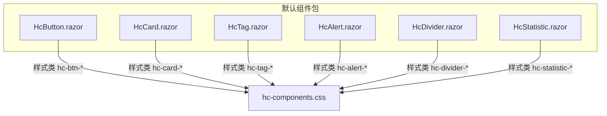
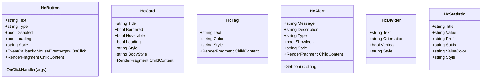
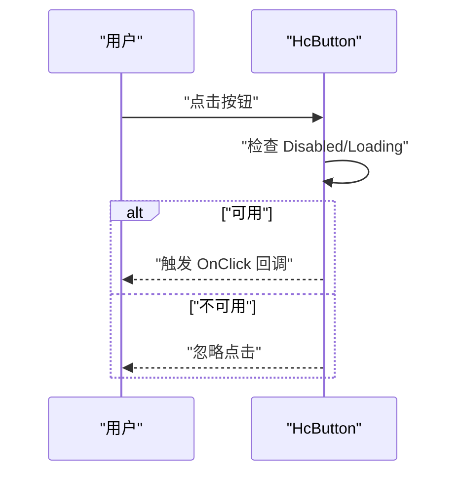
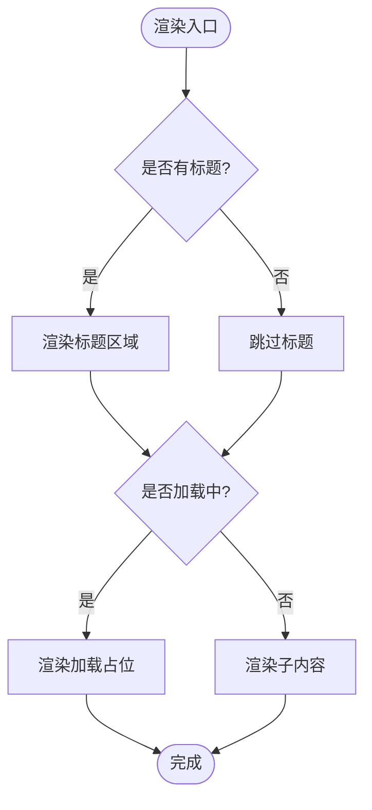
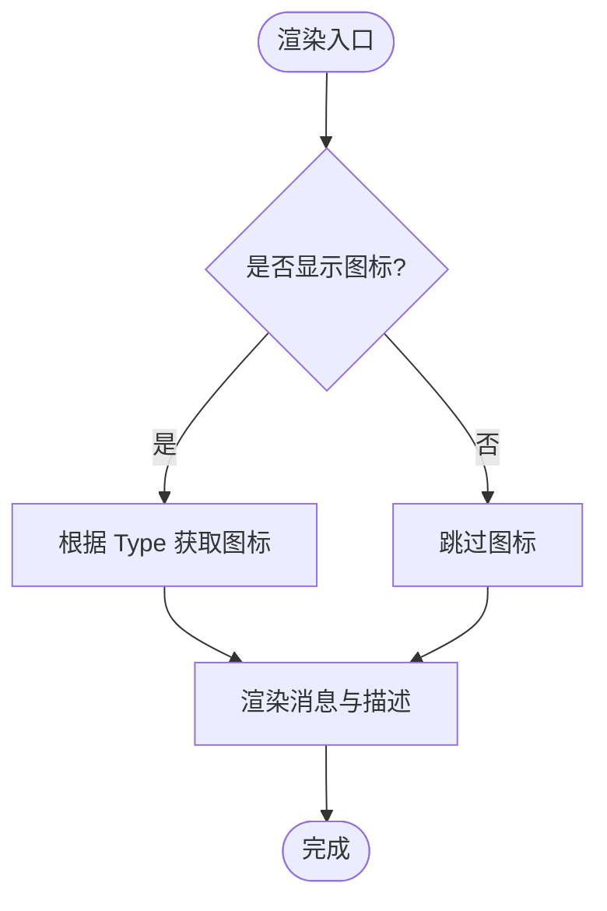
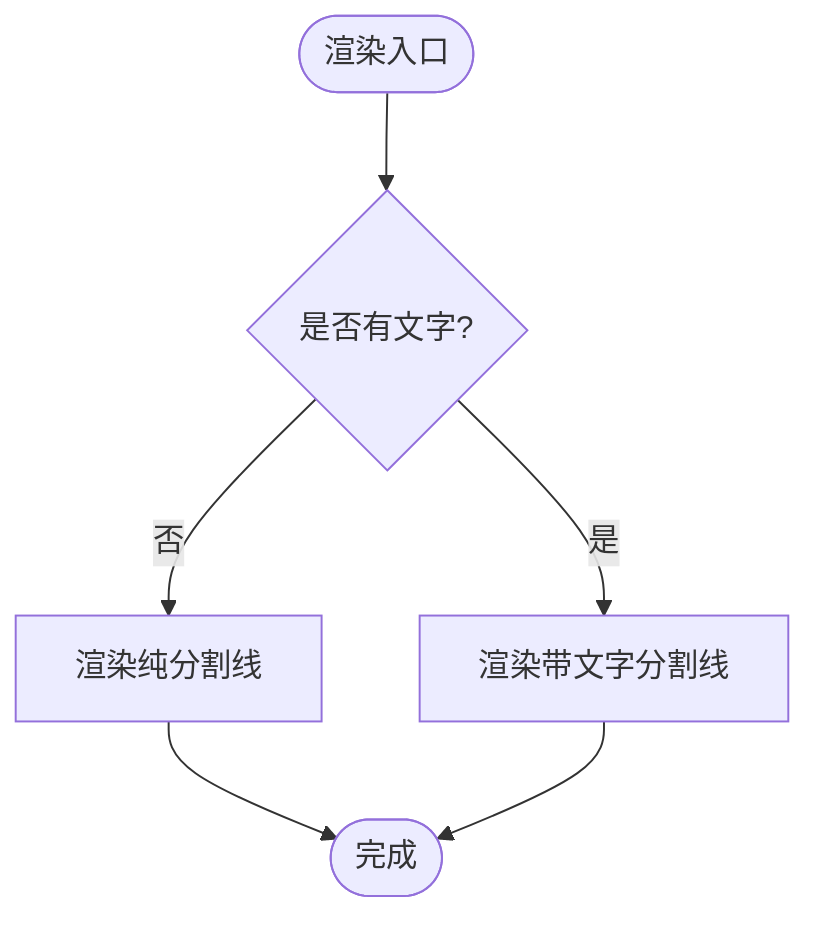
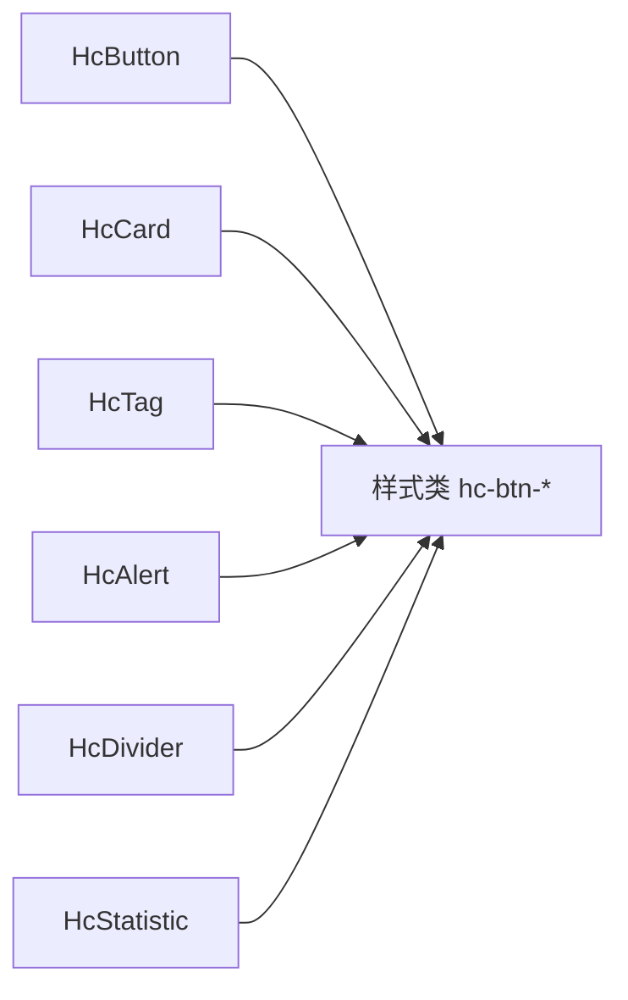

# 基础组件

<cite>
**本文引用的文件**   
- [HcButton.razor](file://src/LowCode/Common/H.LowCode.Components/Components/HcButton.razor)
- [HcCard.razor](file://src/LowCode/Common/H.LowCode.Components/Components/HcCard.razor)
- [HcTag.razor](file://src/LowCode/Common/H.LowCode.Components/Components/HcTag.razor)
- [HcAlert.razor](file://src/LowCode/Common/H.LowCode.Components/Components/HcAlert.razor)
- [HcDivider.razor](file://src/LowCode/Common/H.LowCode.Components/Components/HcDivider.razor)
- [HcStatistic.razor](file://src/LowCode/Common/H.LowCode.Components/Components/HcStatistic.razor)
</cite>

## 目录
1. [简介](#简介)
2. [项目结构](#项目结构)
3. [核心组件](#核心组件)
4. [架构总览](#架构总览)
5. [组件详细分析](#组件详细分析)
6. [依赖关系分析](#依赖关系分析)
7. [性能考虑](#性能考虑)
8. [故障排查指南](#故障排查指南)
9. [结论](#结论)
10. [附录](#附录)

## 简介
本章节为 AppLab 的基础 UI 组件文档，聚焦以下六个基础组件：HcButton、HcCard、HcTag、HcAlert、HcDivider、HcStatistic。内容涵盖功能特性、属性配置、事件处理、样式定制、主题支持与响应式行为说明，并提供丰富的使用场景示例与最佳实践建议，帮助开发者快速上手并高效集成。

## 项目结构
这些基础组件统一位于低代码通用默认组件包中，采用 Blazor 组件形式实现，通过 CSS 类名驱动样式与主题。各组件均暴露参数（Parameter）与可选的子内容片段（ChildContent），便于组合与扩展。

图表来源
- [HcButton.razor:1-29](file://src/LowCode/Common/H.LowCode.Components/Components/HcButton.razor#L1-L29)
- [HcCard.razor:1-31](file://src/LowCode/Common/H.LowCode.Components/Components/HcCard.razor#L1-L31)
- [HcTag.razor:1-11](file://src/LowCode/Common/H.LowCode.Components/Components/HcTag.razor#L1-L11)
- [HcAlert.razor:1-37](file://src/LowCode/Common/H.LowCode.Components/Components/HcAlert.razor#L1-L37)
- [HcDivider.razor:1-20](file://src/LowCode/Common/H.LowCode.Components/Components/HcDivider.razor#L1-L20)
- [HcStatistic.razor:1-29](file://src/LowCode/Common/H.LowCode.Components/Components/HcStatistic.razor#L1-L29)

章节来源
- [HcButton.razor:1-29](file://src/LowCode/Common/H.LowCode.Components/Components/HcButton.razor#L1-L29)
- [HcCard.razor:1-31](file://src/LowCode/Common/H.LowCode.Components/Components/HcCard.razor#L1-L31)
- [HcTag.razor:1-11](file://src/LowCode/Common/H.LowCode.Components/Components/HcTag.razor#L1-L11)
- [HcAlert.razor:1-37](file://src/LowCode/Common/H.LowCode.Components/Components/HcAlert.razor#L1-L37)
- [HcDivider.razor:1-20](file://src/LowCode/Common/H.LowCode.Components/Components/HcDivider.razor#L1-L20)
- [HcStatistic.razor:1-29](file://src/LowCode/Common/H.LowCode.Components/Components/HcStatistic.razor#L1-L29)

## 核心组件
本节对每个基础组件进行概览性介绍，包括用途、关键属性、事件与渲染逻辑要点。

- HcButton：按钮组件，支持类型、禁用、加载状态与点击事件；可通过 Style 自定义内联样式。
- HcCard：卡片容器，支持标题、边框、悬停、加载占位与子内容渲染。
- HcTag：标签组件，支持颜色与文本展示，可承载子内容。
- HcAlert：提示告警，支持消息、描述、图标开关与多种类型。
- HcDivider：分割线，支持水平/垂直与带文字模式。
- HcStatistic：统计项，支持标题、值、前后缀与数值颜色。

章节来源
- [HcButton.razor:1-29](file://src/LowCode/Common/H.LowCode.Components/Components/HcButton.razor#L1-L29)
- [HcCard.razor:1-31](file://src/LowCode/Common/H.LowCode.Components/Components/HcCard.razor#L1-L31)
- [HcTag.razor:1-11](file://src/LowCode/Common/H.LowCode.Components/Components/HcTag.razor#L1-L11)
- [HcAlert.razor:1-37](file://src/LowCode/Common/H.LowCode.Components/Components/HcAlert.razor#L1-L37)
- [HcDivider.razor:1-20](file://src/LowCode/Common/H.LowCode.Components/Components/HcDivider.razor#L1-L20)
- [HcStatistic.razor:1-29](file://src/LowCode/Common/H.LowCode.Components/Components/HcStatistic.razor#L1-L29)

## 架构总览
所有基础组件遵循统一的“参数驱动 + 样式类”的轻量实现模式：
- 参数层：通过 Parameter 暴露配置项，如 Text、Type、Disabled、Loading、Style 等。
- 渲染层：根据参数动态生成 HTML 结构与样式类名（如 hc-btn-@Type）。
- 交互层：封装事件回调（如 OnClick），并在内部做状态守卫（如 Disabled/Loading）。
- 样式层：由统一的 CSS 类名控制外观，便于主题化与覆盖。

图表来源
- [HcButton.razor:12-28](file://src/LowCode/Common/H.LowCode.Components/Components/HcButton.razor#L12-L28)
- [HcCard.razor:22-30](file://src/LowCode/Common/H.LowCode.Components/Components/HcCard.razor#L22-L30)
- [HcTag.razor:5-10](file://src/LowCode/Common/H.LowCode.Components/Components/HcTag.razor#L5-L10)
- [HcAlert.razor:21-36](file://src/LowCode/Common/H.LowCode.Components/Components/HcAlert.razor#L21-L36)
- [HcDivider.razor:14-19](file://src/LowCode/Common/H.LowCode.Components/Components/HcDivider.razor#L14-L19)
- [HcStatistic.razor:21-28](file://src/LowCode/Common/H.LowCode.Components/Components/HcStatistic.razor#L21-L28)

## 组件详细分析

### HcButton 按钮
- 功能特性
  - 支持多种类型（Type）、禁用（Disabled）、加载（Loading）状态。
  - 提供点击事件回调（OnClick），在禁用或加载中自动拦截。
  - 支持内联样式（Style）与子内容（ChildContent）。
- 属性配置
  - Text：按钮文本。
  - Type：按钮类型，影响样式类名（如 hc-btn-default）。
  - Disabled：是否禁用。
  - Loading：是否显示加载态。
  - Style：内联样式。
  - OnClick：鼠标事件回调。
  - ChildContent：允许插入额外内容。
- 事件处理
  - 内部方法 OnClickHandler 在 Disabled 或 Loading 时阻止事件冒泡。
- 样式与主题
  - 通过类名 hc-btn 与 hc-btn-@Type 控制外观。
  - 可通过覆盖 hc-btn-* 类名实现主题定制。
- 响应式行为
  - 组件本身不内置响应式断点，可通过外层布局或媒体查询控制宽度与排版。
- 可访问性
  - 原生 button 元素具备键盘可达性与语义；建议在需要时添加 aria-* 属性（如 aria-disabled）。
- 使用示例（路径引用）
  - 基本用法：[HcButton.razor:1-29](file://src/LowCode/Common/H.LowCode.Components/Components/HcButton.razor#L1-L29)
  - 禁用与加载态：[HcButton.razor:15-17](file://src/LowCode/Common/H.LowCode.Components/Components/HcButton.razor#L15-L17)
  - 点击事件绑定：[HcButton.razor:18-27](file://src/LowCode/Common/H.LowCode.Components/Components/HcButton.razor#L18-L27)

图表来源
- [HcButton.razor:21-27](file://src/LowCode/Common/H.LowCode.Components/Components/HcButton.razor#L21-L27)

章节来源
- [HcButton.razor:1-29](file://src/LowCode/Common/H.LowCode.Components/Components/HcButton.razor#L1-L29)

### HcCard 卡片
- 功能特性
  - 支持标题（Title）、边框（Bordered）、悬停（Hoverable）、加载占位（Loading）。
  - 支持独立 body 样式（BodyStyle）与整体样式（Style）。
- 属性配置
  - Title：卡片标题。
  - Bordered：是否显示边框。
  - Hoverable：是否启用悬停效果。
  - Loading：是否显示加载占位。
  - Style：容器样式。
  - BodyStyle：内容区域样式。
  - ChildContent：内容插槽。
- 样式与主题
  - 通过类名 hc-card、hc-card-bordered、hc-card-hoverable 控制外观。
  - 可通过覆盖这些类名实现主题定制。
- 响应式行为
  - 组件自身无响应式逻辑，建议使用栅格或媒体查询控制布局。
- 可访问性
  - 作为容器，建议为标题使用合适的语义标签（如 h2/h3）以提升可读性。
- 使用示例（路径引用）
  - 基本用法：[HcCard.razor:1-31](file://src/LowCode/Common/H.LowCode.Components/Components/HcCard.razor#L1-L31)
  - 加载占位：[HcCard.razor:11-18](file://src/LowCode/Common/H.LowCode.Components/Components/HcCard.razor#L11-L18)

图表来源
- [HcCard.razor:4-19](file://src/LowCode/Common/H.LowCode.Components/Components/HcCard.razor#L4-L19)

章节来源
- [HcCard.razor:1-31](file://src/LowCode/Common/H.LowCode.Components/Components/HcCard.razor#L1-L31)

### HcTag 标签
- 功能特性
  - 支持文本（Text）与颜色（Color），可承载子内容。
- 属性配置
  - Text：标签文本。
  - Color：颜色类型，影响样式类名（如 hc-tag-default）。
  - Style：内联样式。
  - ChildContent：子内容插槽。
- 样式与主题
  - 通过类名 hc-tag 与 hc-tag-@Color 控制外观。
  - 可通过覆盖 hc-tag-* 类名实现主题定制。
- 响应式行为
  - 组件本身无响应式逻辑，建议在外层使用 flex/grid 控制换行与间距。
- 可访问性
  - 作为信息标签，必要时可添加 role="status" 或 aria-label。
- 使用示例（路径引用）
  - 基本用法：[HcTag.razor:1-11](file://src/LowCode/Common/H.LowCode.Components/Components/HcTag.razor#L1-L11)

章节来源
- [HcTag.razor:1-11](file://src/LowCode/Common/H.LowCode.Components/Components/HcTag.razor#L1-L11)

### HcAlert 提示告警
- 功能特性
  - 支持消息（Message）、描述（Description）、图标开关（ShowIcon）与类型（Type）。
  - 根据类型动态选择图标。
- 属性配置
  - Message：主消息。
  - Description：详细描述。
  - Type：类型（如 success、warning、error、info）。
  - ShowIcon：是否显示图标。
  - Style：内联样式。
  - ChildContent：子内容插槽。
- 样式与主题
  - 通过类名 hc-alert 与 hc-alert-@Type 控制外观。
  - 可通过覆盖 hc-alert-* 类名实现主题定制。
- 响应式行为
  - 组件本身无响应式逻辑，建议在外层使用布局控制。
- 可访问性
  - 建议设置 role="alert" 或 aria-live="polite" 提升可访问性。
- 使用示例（路径引用）
  - 基本用法：[HcAlert.razor:1-37](file://src/LowCode/Common/H.LowCode.Components/Components/HcAlert.razor#L1-L37)
  - 图标选择逻辑：[HcAlert.razor:29-35](file://src/LowCode/Common/H.LowCode.Components/Components/HcAlert.razor#L29-L35)

图表来源
- [HcAlert.razor:4-18](file://src/LowCode/Common/H.LowCode.Components/Components/HcAlert.razor#L4-L18)
- [HcAlert.razor:29-35](file://src/LowCode/Common/H.LowCode.Components/Components/HcAlert.razor#L29-L35)

章节来源
- [HcAlert.razor:1-37](file://src/LowCode/Common/H.LowCode.Components/Components/HcAlert.razor#L1-L37)

### HcDivider 分割线
- 功能特性
  - 支持水平/垂直分割线，支持带文字模式。
- 属性配置
  - Text：分割线文字（为空则仅显示线条）。
  - Orientation：文字方向（left/right/center）。
  - Vertical：是否垂直分割线。
  - Style：内联样式。
- 样式与主题
  - 通过类名 hc-divider、hc-divider-horizontal、hc-divider-vertical、hc-divider-with-text 控制外观。
  - 可通过覆盖这些类名实现主题定制。
- 响应式行为
  - 组件本身无响应式逻辑，建议在外层使用布局控制。
- 可访问性
  - 分割线属于装饰性元素，无需特殊可访问性标记。
- 使用示例（路径引用）
  - 基本用法：[HcDivider.razor:1-20](file://src/LowCode/Common/H.LowCode.Components/Components/HcDivider.razor#L1-L20)

图表来源
- [HcDivider.razor:3-12](file://src/LowCode/Common/H.LowCode.Components/Components/HcDivider.razor#L3-L12)

章节来源
- [HcDivider.razor:1-20](file://src/LowCode/Common/H.LowCode.Components/Components/HcDivider.razor#L1-L20)

### HcStatistic 统计项
- 功能特性
  - 支持标题（Title）、值（Value）、前缀（Prefix）、后缀（Suffix）与数值颜色（ValueColor）。
- 属性配置
  - Title：统计项标题。
  - Value：统计值。
  - Prefix：前缀文本。
  - Suffix：后缀文本。
  - ValueColor：数值颜色。
  - Style：内联样式。
- 样式与主题
  - 通过类名 hc-statistic、hc-statistic-title、hc-statistic-content、hc-statistic-prefix、hc-statistic-value、hc-statistic-suffix 控制外观。
  - 可通过覆盖这些类名实现主题定制。
- 响应式行为
  - 组件本身无响应式逻辑，建议在外层使用布局控制。
- 可访问性
  - 建议为数值区域添加适当的语义（如 aria-label）以增强可读性。
- 使用示例（路径引用）
  - 基本用法：[HcStatistic.razor:1-29](file://src/LowCode/Common/H.LowCode.Components/Components/HcStatistic.razor#L1-L29)

章节来源
- [HcStatistic.razor:1-29](file://src/LowCode/Common/H.LowCode.Components/Components/HcStatistic.razor#L1-L29)

## 依赖关系分析
- 组件间耦合度极低，均为独立 UI 单元，无直接相互依赖。
- 样式依赖统一的 CSS 类名约定，便于集中管理与主题替换。
- 事件与状态均在组件内部处理，对外仅暴露参数与回调，降低外部耦合。

图表来源
- [HcButton.razor:3](file://src/LowCode/Common/H.LowCode.Components/Components/HcButton.razor#L3)
- [HcCard.razor:3](file://src/LowCode/Common/H.LowCode.Components/Components/HcCard.razor#L3)
- [HcTag.razor:3](file://src/LowCode/Common/H.LowCode.Components/Components/HcTag.razor#L3)
- [HcAlert.razor:3](file://src/LowCode/Common/H.LowCode.Components/Components/HcAlert.razor#L3)
- [HcDivider.razor:5](file://src/LowCode/Common/H.LowCode.Components/Components/HcDivider.razor#L5)
- [HcStatistic.razor:3](file://src/LowCode/Common/H.LowCode.Components/Components/HcStatistic.razor#L3)

章节来源
- [HcButton.razor:1-29](file://src/LowCode/Common/H.LowCode.Components/Components/HcButton.razor#L1-L29)
- [HcCard.razor:1-31](file://src/LowCode/Common/H.LowCode.Components/Components/HcCard.razor#L1-L31)
- [HcTag.razor:1-11](file://src/LowCode/Common/H.LowCode.Components/Components/HcTag.razor#L1-L11)
- [HcAlert.razor:1-37](file://src/LowCode/Common/H.LowCode.Components/Components/HcAlert.razor#L1-L37)
- [HcDivider.razor:1-20](file://src/LowCode/Common/H.LowCode.Components/Components/HcDivider.razor#L1-L20)
- [HcStatistic.razor:1-29](file://src/LowCode/Common/H.LowCode.Components/Components/HcStatistic.razor#L1-L29)

## 性能考虑
- 避免不必要的重渲染：仅在参数变化时更新，减少频繁的状态切换。
- 合理使用 Loading 状态：在异步操作期间显示加载占位，避免阻塞用户交互。
- 样式覆盖策略：优先通过 CSS 变量或主题类覆盖，避免大量内联样式导致样式冲突。
- 子内容优化：ChildContent 仅在需要时渲染，避免复杂计算放在模板中。

## 故障排查指南
- 按钮点击无效
  - 检查 Disabled 与 Loading 状态是否被错误设置为 true。
  - 确认 OnClick 回调是否正确绑定。
- 卡片加载占位不显示
  - 检查 Loading 参数是否为 true。
  - 确认 BodyStyle 未遮挡加载区域。
- 标签颜色不生效
  - 检查 Color 参数是否与样式类名匹配。
  - 确认样式文件已正确引入且未被覆盖。
- 告警图标不显示
  - 检查 ShowIcon 是否为 true。
  - 确认 Type 参数值是否在支持的范围内。
- 分割线方向不正确
  - 检查 Vertical 参数与 Orientation 参数是否设置正确。
- 统计项数值颜色不生效
  - 检查 ValueColor 参数是否传入有效颜色值。

章节来源
- [HcButton.razor:21-27](file://src/LowCode/Common/H.LowCode.Components/Components/HcButton.razor#L21-L27)
- [HcCard.razor:11-18](file://src/LowCode/Common/H.LowCode.Components/Components/HcCard.razor#L11-L18)
- [HcTag.razor:3](file://src/LowCode/Common/H.LowCode.Components/Components/HcTag.razor#L3)
- [HcAlert.razor:4-18](file://src/LowCode/Common/H.LowCode.Components/Components/HcAlert.razor#L4-L18)
- [HcDivider.razor:3-12](file://src/LowCode/Common/H.LowCode.Components/Components/HcDivider.razor#L3-L12)
- [HcStatistic.razor:13](file://src/LowCode/Common/H.LowCode.Components/Components/HcStatistic.razor#L13)

## 结论
AppLab 的基础组件以简洁的参数驱动与样式类命名为核心，提供了开箱即用的 UI 能力。通过统一的样式约定与可扩展的子内容插槽，开发者可以灵活定制外观与行为。建议在实际项目中结合主题系统与布局方案，最大化发挥组件的可复用性与可维护性。

## 附录
- 主题定制建议
  - 通过覆盖 hc-btn-*、hc-card-*、hc-tag-*、hc-alert-*、hc-divider-*、hc-statistic-* 类名实现全局主题。
  - 推荐使用 CSS 变量管理颜色与尺寸，便于多主题切换。
- 可访问性最佳实践
  - 为交互元素添加必要的 aria-* 属性（如 aria-disabled、aria-label）。
  - 为提示信息区域设置合适的 role 与 aria-live 策略。
- 响应式布局建议
  - 使用栅格系统或 Flex/Grid 控制组件在不同屏幕尺寸下的表现。
  - 避免在组件内部硬编码固定宽度，尽量交由外层布局控制。