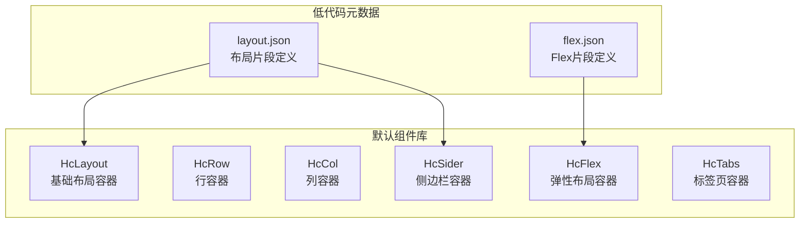
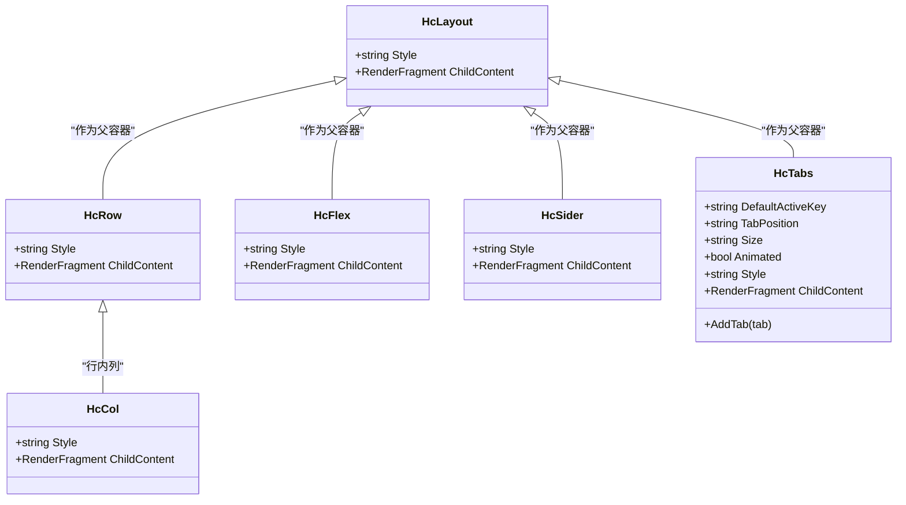
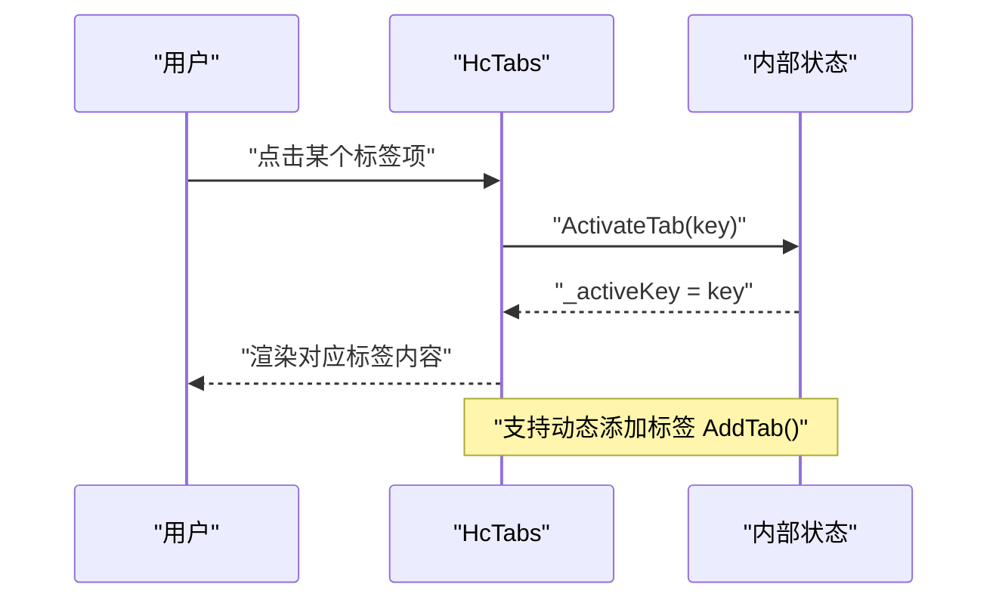
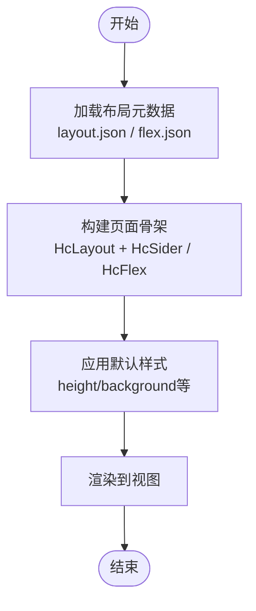
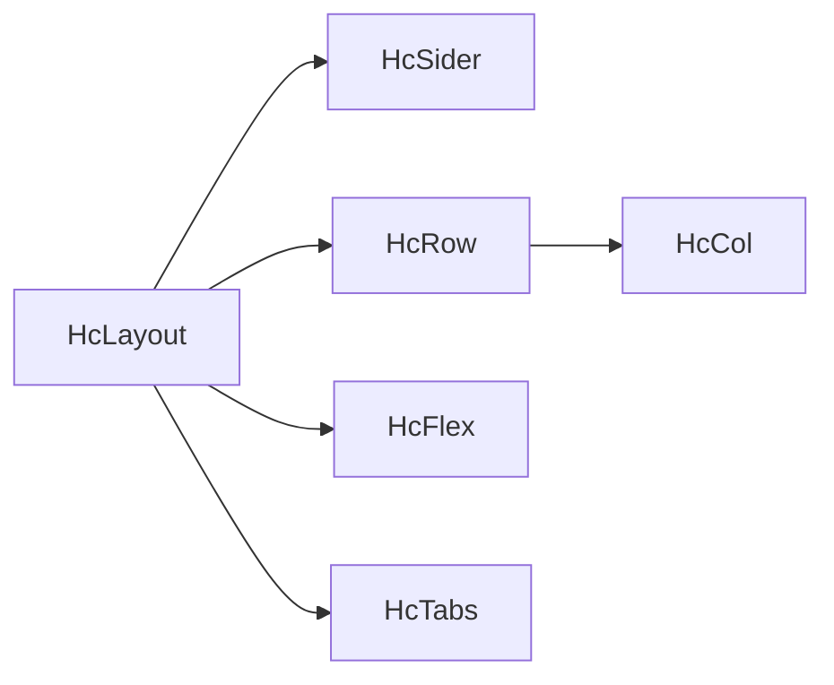

# 布局组件

<cite>
**本文引用的文件**   
- [HcLayout.razor](file://src/LowCode/Common/H.LowCode.Components.Defaults/Components/HcLayout.razor)
- [HcRow.razor](file://src/LowCode/Common/H.LowCode.Components.Defaults/Components/HcRow.razor)
- [HcCol.razor](file://src/LowCode/Common/H.LowCode.Components.Defaults/Components/HcCol.razor)
- [HcFlex.razor](file://src/LowCode/Common/H.LowCode.Components.Defaults/Components/HcFlex.razor)
- [HcSider.razor](file://src/LowCode/Common/H.LowCode.Components.Defaults/Components/HcSider.razor)
- [HcTabs.razor](file://src/LowCode/Common/H.LowCode.Components.Defaults/Components/HcTabs.razor)
- [layout.json](file://src/LowCode/meta/parts/componentParts/antdesign/layout.json)
- [flex.json](file://src/LowCode/meta/parts/componentParts/antdesign/flex.json)
</cite>

## 目录
1. [简介](#简介)
2. [项目结构](#项目结构)
3. [核心组件](#核心组件)
4. [架构总览](#架构总览)
5. [详细组件分析](#详细组件分析)
6. [依赖关系分析](#依赖关系分析)
7. [性能与优化](#性能与优化)
8. [故障排查指南](#故障排查指南)
9. [结论](#结论)
10. [附录](#附录)

## 简介
本章节面向AppLab的布局组件体系，系统性阐述HcLayout、HcRow、HcCol、HcFlex、HcSider、HcTabs等组件的设计理念、使用方式与最佳实践。文档覆盖栅格响应式布局原理（断点与自适应策略）、Flexbox弹性布局的应用场景与对齐机制、侧边栏折叠与嵌套导航交互模式、标签页的多页面管理与动态路由集成思路，并提供后台管理系统与移动端适配的复杂布局示例及SEO与可访问性建议。

## 项目结构
布局相关组件集中在低代码默认组件库中，采用Blazor Razor组件形式实现，提供简洁的参数化容器能力，便于在低代码设计器中拖拽组合。

图表来源 
- [HcLayout.razor:1-11](file://src/LowCode/Common/H.LowCode.Components.Defaults/Components/HcLayout.razor#L1-L11)
- [HcRow.razor:1-11](file://src/LowCode/Common/H.LowCode.Components.Defaults/Components/HcRow.razor#L1-L11)
- [HcCol.razor:1-11](file://src/LowCode/Common/H.LowCode.Components.Defaults/Components/HcCol.razor#L1-L11)
- [HcFlex.razor:1-11](file://src/LowCode/Common/H.LowCode.Components.Defaults/Components/HcFlex.razor#L1-L11)
- [HcSider.razor:1-11](file://src/LowCode/Common/H.LowCode.Components.Defaults/Components/HcSider.razor#L1-L11)
- [HcTabs.razor:1-59](file://src/LowCode/Common/H.LowCode.Components.Defaults/Components/HcTabs.razor#L1-L59)
- [layout.json:1-1](file://src/LowCode/meta/parts/componentParts/antdesign/layout.json#L1-L1)
- [flex.json:1-1](file://src/LowCode/meta/parts/componentParts/antdesign/flex.json#L1-L1)

章节来源
- [HcLayout.razor:1-11](file://src/LowCode/Common/H.LowCode.Components.Defaults/Components/HcLayout.razor#L1-L11)
- [HcRow.razor:1-11](file://src/LowCode/Common/H.LowCode.Components.Defaults/Components/HcRow.razor#L1-L11)
- [HcCol.razor:1-11](file://src/LowCode/Common/H.LowCode.Components.Defaults/Components/HcCol.razor#L1-L11)
- [HcFlex.razor:1-11](file://src/LowCode/Common/H.LowCode.Components.Defaults/Components/HcFlex.razor#L1-L11)
- [HcSider.razor:1-11](file://src/LowCode/Common/H.LowCode.Components.Defaults/Components/HcSider.razor#L1-L11)
- [HcTabs.razor:1-59](file://src/LowCode/Common/H.LowCode.Components.Defaults/Components/HcTabs.razor#L1-L59)
- [layout.json:1-1](file://src/LowCode/meta/parts/componentParts/antdesign/layout.json#L1-L1)
- [flex.json:1-1](file://src/LowCode/meta/parts/componentParts/antdesign/flex.json#L1-L1)

## 核心组件
- HcLayout：通用布局容器，承载子内容，支持通过Style控制整体样式（如高度）。
- HcRow：行容器，用于组织横向排列的子元素。
- HcCol：列容器，默认宽度比例，适合与行配合构建栅格布局。
- HcFlex：弹性布局容器，基于Flexbox，便于灵活分配空间与对齐。
- HcSider：侧边栏容器，常用于后台管理系统的左侧导航区域。
- HcTabs：标签页容器，支持多标签切换、动画与位置配置，具备动态添加标签的能力。

章节来源
- [HcLayout.razor:1-11](file://src/LowCode/Common/H.LowCode.Components.Defaults/Components/HcLayout.razor#L1-L11)
- [HcRow.razor:1-11](file://src/LowCode/Common/H.LowCode.Components.Defaults/Components/HcRow.razor#L1-L11)
- [HcCol.razor:1-11](file://src/LowCode/Common/H.LowCode.Components.Defaults/Components/HcCol.razor#L1-L11)
- [HcFlex.razor:1-11](file://src/LowCode/Common/H.LowCode.Components.Defaults/Components/HcFlex.razor#L1-L11)
- [HcSider.razor:1-11](file://src/LowCode/Common/H.LowCode.Components.Defaults/Components/HcSider.razor#L1-L11)
- [HcTabs.razor:1-59](file://src/LowCode/Common/H.LowCode.Components.Defaults/Components/HcTabs.razor#L1-L59)

## 架构总览
布局组件以“容器+子内容”的模式组织，通过参数Style注入样式，ChildContent承载子组件或内容。低代码元数据（JSON）定义了常用布局片段的初始结构与默认样式，便于在设计器中快速搭建页面骨架。

图表来源 
- [HcLayout.razor:1-11](file://src/LowCode/Common/H.LowCode.Components.Defaults/Components/HcLayout.razor#L1-L11)
- [HcRow.razor:1-11](file://src/LowCode/Common/H.LowCode.Components.Defaults/Components/HcRow.razor#L1-L11)
- [HcCol.razor:1-11](file://src/LowCode/Common/H.LowCode.Components.Defaults/Components/HcCol.razor#L1-L11)
- [HcFlex.razor:1-11](file://src/LowCode/Common/H.LowCode.Components.Defaults/Components/HcFlex.razor#L1-L11)
- [HcSider.razor:1-11](file://src/LowCode/Common/H.LowCode.Components.Defaults/Components/HcSider.razor#L1-L11)
- [HcTabs.razor:1-59](file://src/LowCode/Common/H.LowCode.Components.Defaults/Components/HcTabs.razor#L1-L59)

## 详细组件分析

### HcLayout 基础布局容器
- 设计理念：最小化的布局容器，提供统一的类名与样式注入点，便于上层组件组合。
- 关键参数：Style（默认高度100%），ChildContent（子内容）。
- 使用建议：作为页面根容器或区块容器，结合其他布局组件共同构建页面骨架。

章节来源
- [HcLayout.razor:1-11](file://src/LowCode/Common/H.LowCode.Components.Defaults/Components/HcLayout.razor#L1-L11)

### HcRow 行容器
- 设计理念：为横向排列的子元素提供容器，便于与列组件协作。
- 关键参数：Style（默认高度100%），ChildContent。
- 使用建议：与HcCol配合，形成栅格布局的基础行。

章节来源
- [HcRow.razor:1-11](file://src/LowCode/Common/H.LowCode.Components.Defaults/Components/HcRow.razor#L1-L11)

### HcCol 列容器
- 设计理念：列容器，默认宽度比例，适合与行组成栅格。
- 关键参数：Style（默认宽度约33.33%，高度100%），ChildContent。
- 使用建议：根据业务需求调整宽度比例，实现不同屏幕下的自适应布局。

章节来源
- [HcCol.razor:1-11](file://src/LowCode/Common/H.LowCode.Components.Defaults/Components/HcCol.razor#L1-L11)

### HcFlex 弹性布局容器
- 设计理念：基于Flexbox的弹性容器，适用于需要灵活伸缩与对齐的场景。
- 关键参数：Style（默认高度100%），ChildContent。
- 使用建议：通过CSS Flex属性（如justify-content、align-items、flex-direction）在Style中配置，实现复杂的弹性布局。

章节来源
- [HcFlex.razor:1-11](file://src/LowCode/Common/H.LowCode.Components.Defaults/Components/HcFlex.razor#L1-L11)

### HcSider 侧边栏容器
- 设计理念：侧边栏专用容器，默认背景色与高度，适合放置导航菜单。
- 关键参数：Style（默认背景与高度），ChildContent。
- 使用建议：与主内容区并列，支持折叠展开逻辑（由上层业务组件控制）。

章节来源
- [HcSider.razor:1-11](file://src/LowCode/Common/H.LowCode.Components.Defaults/Components/HcSider.razor#L1-L11)

### HcTabs 标签页容器
- 设计理念：提供多标签页管理能力，支持激活态切换、动画与位置配置，并可通过API动态添加标签。
- 关键参数：DefaultActiveKey（默认激活键）、TabPosition（位置）、Size（尺寸）、Animated（是否动画）、Style、ChildContent。
- 内部状态：_activeKey（当前激活标签键）、_tabs（标签列表）。
- 方法：AddTab(TabItem) 动态添加标签；ActivateTab(key) 切换激活标签。
- 数据结构：TabItem包含Key与Label。

图表来源 
- [HcTabs.razor:1-59](file://src/LowCode/Common/H.LowCode.Components.Defaults/Components/HcTabs.razor#L1-L59)

章节来源
- [HcTabs.razor:1-59](file://src/LowCode/Common/H.LowCode.Components.Defaults/Components/HcTabs.razor#L1-L59)

### 低代码片段与布局组合
- layout.json：定义了一个包含HcLayout与HcSider的布局片段，设置默认样式与容器行为，便于在设计器中快速生成后台布局骨架。
- flex.json：定义了一个HcFlex片段，设置默认高度样式，用于快速插入弹性布局区域。

图表来源 
- [layout.json:1-1](file://src/LowCode/meta/parts/componentParts/antdesign/layout.json#L1-L1)
- [flex.json:1-1](file://src/LowCode/meta/parts/componentParts/antdesign/flex.json#L1-L1)

章节来源
- [layout.json:1-1](file://src/LowCode/meta/parts/componentParts/antdesign/layout.json#L1-L1)
- [flex.json:1-1](file://src/LowCode/meta/parts/componentParts/antdesign/flex.json#L1-L1)

## 依赖关系分析
布局组件之间是松耦合的容器关系，主要通过ChildContent组合，不引入强依赖。样式通过Style参数注入，避免组件间硬编码耦合。

图表来源 
- [HcLayout.razor:1-11](file://src/LowCode/Common/H.LowCode.Components.Defaults/Components/HcLayout.razor#L1-L11)
- [HcRow.razor:1-11](file://src/LowCode/Common/H.LowCode.Components.Defaults/Components/HcRow.razor#L1-L11)
- [HcCol.razor:1-11](file://src/LowCode/Common/H.LowCode.Components.Defaults/Components/HcCol.razor#L1-L11)
- [HcFlex.razor:1-11](file://src/LowCode/Common/H.LowCode.Components.Defaults/Components/HcFlex.razor#L1-L11)
- [HcSider.razor:1-11](file://src/LowCode/Common/H.LowCode.Components.Defaults/Components/HcSider.razor#L1-L11)
- [HcTabs.razor:1-59](file://src/LowCode/Common/H.LowCode.Components.Defaults/Components/HcTabs.razor#L1-L59)

章节来源
- [HcLayout.razor:1-11](file://src/LowCode/Common/H.LowCode.Components.Defaults/Components/HcLayout.razor#L1-L11)
- [HcRow.razor:1-11](file://src/LowCode/Common/H.LowCode.Components.Defaults/Components/HcRow.razor#L1-L11)
- [HcCol.razor:1-11](file://src/LowCode/Common/H.LowCode.Components.Defaults/Components/HcCol.razor#L1-L11)
- [HcFlex.razor:1-11](file://src/LowCode/Common/H.LowCode.Components.Defaults/Components/HcFlex.razor#L1-L11)
- [HcSider.razor:1-11](file://src/LowCode/Common/H.LowCode.Components.Defaults/Components/HcSider.razor#L1-L11)
- [HcTabs.razor:1-59](file://src/LowCode/Common/H.LowCode.Components.Defaults/Components/HcTabs.razor#L1-L59)

## 性能与优化
- 减少不必要的重渲染：在HcTabs中，仅在激活键变化或新增标签时触发更新，避免全量刷新。
- 样式注入优化：尽量将样式集中管理，避免在每个组件上重复声明相同样式。
- 懒加载与按需渲染：对于标签页内容，可采用懒加载策略，只在激活时渲染，降低首屏压力。
- 响应式断点与媒体查询：在样式层使用媒体查询实现断点适配，避免在组件逻辑中处理屏幕尺寸判断。
- SEO友好性：确保布局容器输出语义化HTML（如aside、div等），并为关键内容提供合理的标题层级与描述。
- 可访问性：为交互元素（如标签项）提供键盘可达性与ARIA属性，提升无障碍体验。

[本节为通用指导，不直接分析具体文件]

## 故障排查指南
- 标签页未显示或无法切换：检查DefaultActiveKey是否与某个标签的Key一致；确认AddTab是否正确调用且传入有效Key与Label。
- 样式未生效：确认Style参数是否正确传递；检查浏览器开发者工具中类名与样式优先级。
- 布局错位：检查行与列的宽度比例是否合理；确认父容器高度是否设置正确。
- 侧边栏遮挡内容：检查HcSider与主内容区的布局顺序与宽度计算；必要时使用Flexbox的对齐与伸缩属性进行调整。

章节来源
- [HcTabs.razor:1-59](file://src/LowCode/Common/H.LowCode.Components.Defaults/Components/HcTabs.razor#L1-L59)
- [HcLayout.razor:1-11](file://src/LowCode/Common/H.LowCode.Components.Defaults/Components/HcLayout.razor#L1-L11)
- [HcRow.razor:1-11](file://src/LowCode/Common/H.LowCode.Components.Defaults/Components/HcRow.razor#L1-L11)
- [HcCol.razor:1-11](file://src/LowCode/Common/H.LowCode.Components.Defaults/Components/HcCol.razor#L1-L11)
- [HcFlex.razor:1-11](file://src/LowCode/Common/H.LowCode.Components.Defaults/Components/HcFlex.razor#L1-L11)
- [HcSider.razor:1-11](file://src/LowCode/Common/H.LowCode.Components.Defaults/Components/HcSider.razor#L1-L11)

## 结论
AppLab的布局组件以简洁的容器模型为基础，结合低代码元数据，能够快速构建后台管理系统与移动端适配的页面骨架。通过HcLayout、HcRow、HcCol、HcFlex、HcSider、HcTabs的组合，可以实现灵活的栅格与弹性布局，并支持标签页的动态管理与交互。遵循性能优化、SEO与可访问性最佳实践，可进一步提升用户体验与系统稳定性。

[本节为总结性内容，不直接分析具体文件]

## 附录
- 复杂页面布局示例（后台管理系统）：
  - 使用HcLayout作为根容器，内部包含HcSider（左侧导航）与主内容区。
  - 主内容区可使用HcRow与HcCol构建栅格，或使用HcFlex进行弹性布局。
  - 在内容区嵌入HcTabs管理多个页面或模块，结合动态路由实现页面切换。
- 移动端适配策略：
  - 通过媒体查询调整HcCol的宽度比例，在小屏幕上堆叠显示。
  - 侧边栏在移动端可折叠为抽屉或底部导航，提升操作便捷性。
- 动态路由集成思路：
  - 将每个标签页映射到一个路由路径，切换标签时更新URL与页面内容。
  - 使用HcTabs的AddTab方法动态注册新标签，并在激活时加载对应路由组件。

[本节为概念性说明，不直接分析具体文件]