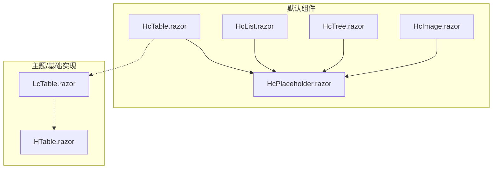
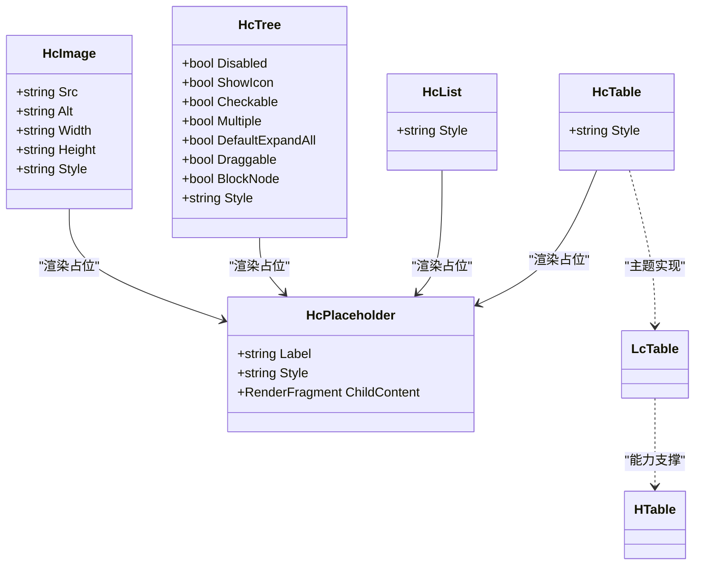
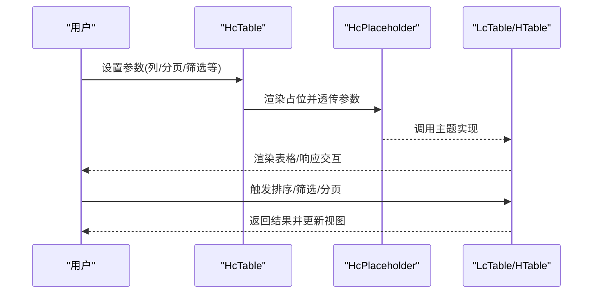
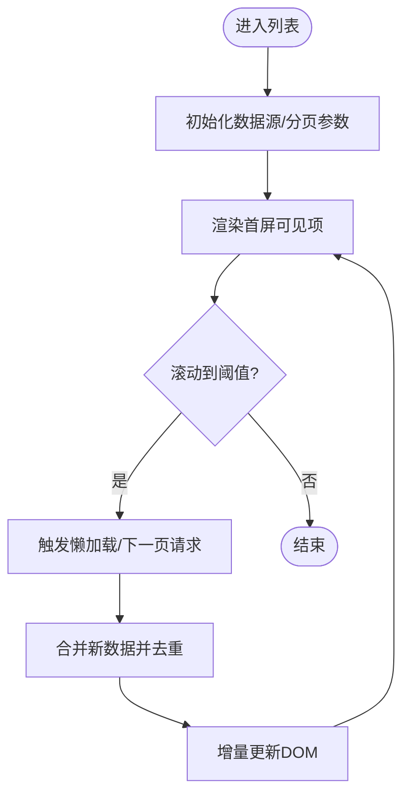
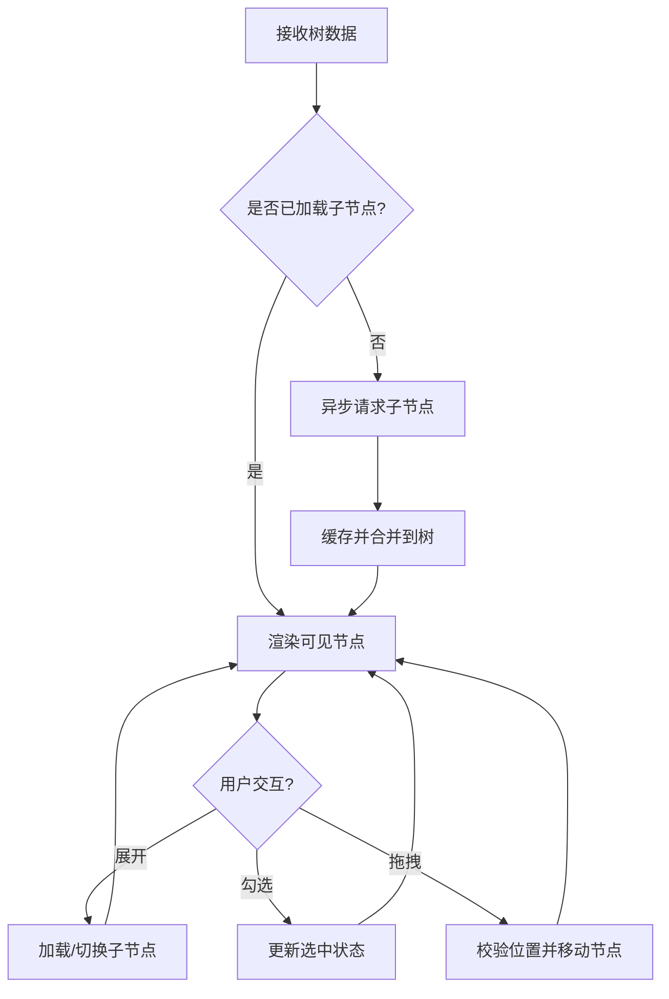
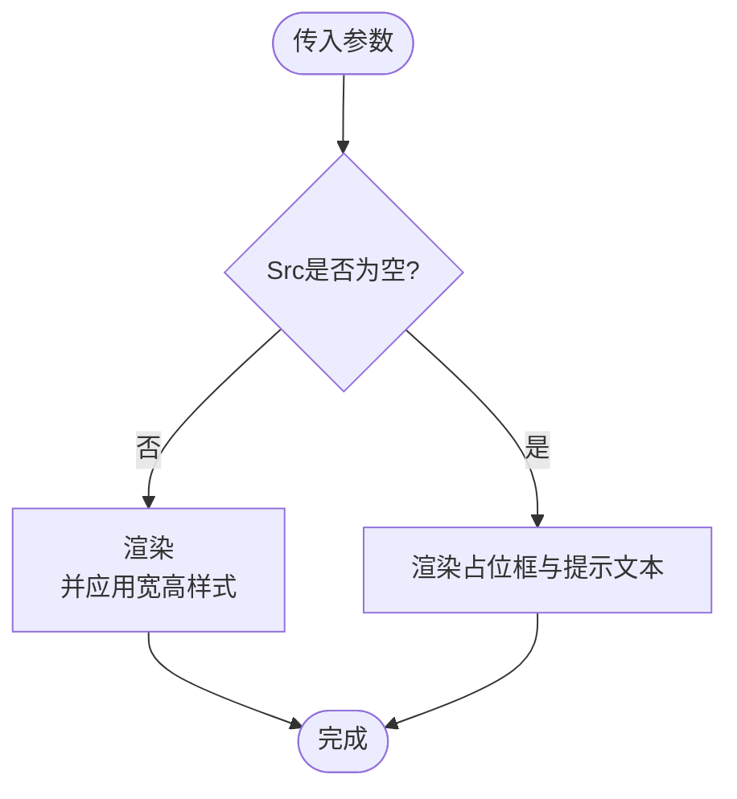
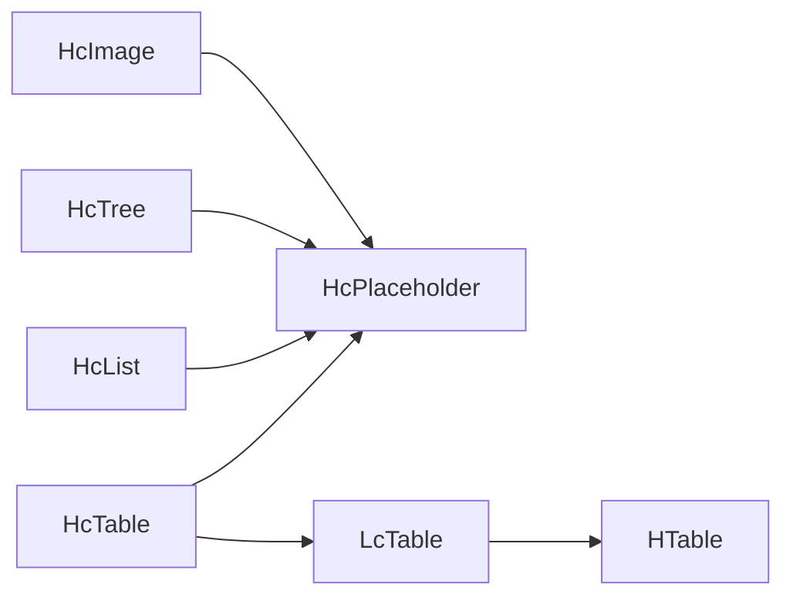

# 数据展示组件

<cite>
**本文引用的文件**   
- [HcTable.razor](file://src/LowCode/Common/H.LowCode.Components/Components/HcTable.razor)
- [HcList.razor](file://src/LowCode/Common/H.LowCode.Components/Components/HcList.razor)
- [HcTree.razor](file://src/LowCode/Common/H.LowCode.Components/Components/HcTree.razor)
- [HcImage.razor](file://src/LowCode/Common/H.LowCode.Components/Components/HcImage.razor)
- [HcPlaceholder.razor](file://src/LowCode/Common/H.LowCode.Components/Components/HcPlaceholder.razor)
- [_Imports.razor](file://src/LowCode/Common/H.LowCode.Components/_Imports.razor)
- [LcTable.razor](file://src/LowCode/Common/H.LowCode.Components/Components/LcTable.razor)
- [HTable.razor](file://src/Utils/H.Util.Blazor/Components/HTable.razor)
</cite>

## 目录
1. [简介](#简介)
2. [项目结构](#项目结构)
3. [核心组件](#核心组件)
4. [架构总览](#架构总览)
5. [详细组件分析](#详细组件分析)
6. [依赖关系分析](#依赖关系分析)
7. [性能考量](#性能考量)
8. [故障排查指南](#故障排查指南)
9. [结论](#结论)
10. [附录](#附录)

## 简介
本文件面向AppLab的数据展示组件，聚焦HcTable、HcList、HcTree、HcImage等组件的核心功能与高级特性。文档将说明表格的列定义、排序筛选、分页处理、虚拟滚动；树形组件的数据结构要求、节点操作、异步加载；列表组件的渲染优化、懒加载、无限滚动；并提供复杂数据展示场景的实现示例（大数据量表格、多级树形结构、图片画廊）。同时覆盖数据更新机制、事件处理、用户交互设计、可访问性与国际化配置建议。

## 项目结构
- 默认组件位于 LowCode 公共组件库中，采用占位符模式快速集成主题实现。
- Hc* 系列为“外壳”组件，内部通过占位符组件统一渲染，便于在AntBlazor等主题下提供具体实现。
- 实际表格能力由 LcTable 与 HUtil 中的 HTable 承载，HcTable 作为门面暴露参数。

图表来源
- [HcTable.razor:1-8](file://src/LowCode/Common/H.LowCode.Components/Components/HcTable.razor#L1-L8)
- [HcList.razor:1-8](file://src/LowCode/Common/H.LowCode.Components/Components/HcList.razor#L1-L8)
- [HcTree.razor:1-15](file://src/LowCode/Common/H.LowCode.Components/Components/HcTree.razor#L1-L15)
- [HcImage.razor:1-23](file://src/LowCode/Common/H.LowCode.Components/Components/HcImage.razor#L1-L23)
- [HcPlaceholder.razor:1-16](file://src/LowCode/Common/H.LowCode.Components/Components/HcPlaceholder.razor#L1-L16)
- [LcTable.razor](file://src/LowCode/Common/H.LowCode.Components/Components/LcTable.razor)
- [HTable.razor](file://src/Utils/H.Util.Blazor/Components/HTable.razor)

章节来源
- [HcTable.razor:1-8](file://src/LowCode/Common/H.LowCode.Components/Components/HcTable.razor#L1-L8)
- [HcList.razor:1-8](file://src/LowCode/Common/H.LowCode.Components/Components/HcList.razor#L1-L8)
- [HcTree.razor:1-15](file://src/LowCode/Common/H.LowCode.Components/Components/HcTree.razor#L1-L15)
- [HcImage.razor:1-23](file://src/LowCode/Common/H.LowCode.Components/Components/HcImage.razor#L1-L23)
- [HcPlaceholder.razor:1-16](file://src/LowCode/Common/H.LowCode.Components/Components/HcPlaceholder.razor#L1-L16)
- [_Imports.razor:1-10](file://src/LowCode/Common/H.LowCode.Components/_Imports.razor#L1-L10)

## 核心组件
- HcTable：表格门面组件，暴露样式参数并通过占位符渲染。
- HcList：列表门面组件，暴露样式参数并通过占位符渲染。
- HcTree：树形门面组件，暴露禁用、图标、勾选、多选、展开、拖拽、块级节点等开关，以及样式。
- HcImage：图片组件，支持Src、Alt、宽高与样式，无图时显示占位。
- HcPlaceholder：通用占位容器，用于在开发或主题未实现时显示标签与图标。

章节来源
- [HcTable.razor:1-8](file://src/LowCode/Common/H.LowCode.Components/Components/HcTable.razor#L1-L8)
- [HcList.razor:1-8](file://src/LowCode/Common/H.LowCode.Components/Components/HcList.razor#L1-L8)
- [HcTree.razor:1-15](file://src/LowCode/Common/H.LowCode.Components/Components/HcTree.razor#L1-L15)
- [HcImage.razor:1-23](file://src/LowCode/Common/H.LowCode.Components/Components/HcImage.razor#L1-L23)
- [HcPlaceholder.razor:1-16](file://src/LowCode/Common/H.LowCode.Components/Components/HcPlaceholder.razor#L1-L16)

## 架构总览
- 门面层：Hc* 组件仅负责参数透传与占位渲染，保持API稳定。
- 实现层：LcTable/HTable 等承载真实表格能力（列定义、排序、筛选、分页、虚拟滚动等）。
- 主题适配：通过占位符与导入聚合，使同一套Hc* API在不同主题下获得一致体验。

图表来源
- [HcTable.razor:1-8](file://src/LowCode/Common/H.LowCode.Components/Components/HcTable.razor#L1-L8)
- [HcList.razor:1-8](file://src/LowCode/Common/H.LowCode.Components/Components/HcList.razor#L1-L8)
- [HcTree.razor:1-15](file://src/LowCode/Common/H.LowCode.Components/Components/HcTree.razor#L1-L15)
- [HcImage.razor:1-23](file://src/LowCode/Common/H.LowCode.Components/Components/HcImage.razor#L1-L23)
- [HcPlaceholder.razor:1-16](file://src/LowCode/Common/H.LowCode.Components/Components/HcPlaceholder.razor#L1-L16)
- [LcTable.razor](file://src/LowCode/Common/H.LowCode.Components/Components/LcTable.razor)
- [HTable.razor](file://src/Utils/H.Util.Blazor/Components/HTable.razor)

## 详细组件分析

### HcTable 表格组件
- 角色定位：门面组件，对外暴露Style等参数，内部通过占位符渲染，具体能力由主题实现（如LcTable）与底层HTable提供。
- 典型能力（由实现层提供）：
  - 列定义：字段映射、标题、宽度、对齐、格式化、插槽/模板。
  - 排序与筛选：列级排序开关、多列排序、服务端/客户端筛选。
  - 分页：页大小、当前页、总数、跳转、远程分页。
  - 虚拟滚动：长列表按需渲染，提升大数据量下的性能。
  - 选择与行操作：单选/多选、行点击、右键菜单、固定列/行。
  - 数据绑定与更新：双向绑定、增量更新、局部刷新。
  - 事件：行点击、排序变化、筛选变化、分页变化、选中变化等。
  - 可访问性：键盘导航、ARIA属性、焦点管理。
  - 国际化：列标题、提示文案、分页文案本地化。

图表来源
- [HcTable.razor:1-8](file://src/LowCode/Common/H.LowCode.Components/Components/HcTable.razor#L1-L8)
- [HcPlaceholder.razor:1-16](file://src/LowCode/Common/H.LowCode.Components/Components/HcPlaceholder.razor#L1-L16)
- [LcTable.razor](file://src/LowCode/Common/H.LowCode.Components/Components/LcTable.razor)
- [HTable.razor](file://src/Utils/H.Util.Blazor/Components/HTable.razor)

章节来源
- [HcTable.razor:1-8](file://src/LowCode/Common/H.LowCode.Components/Components/HcTable.razor#L1-L8)

### HcList 列表组件
- 角色定位：门面组件，通过占位符渲染，适合展示一维数据集合。
- 典型能力（由实现层提供）：
  - 渲染优化：虚拟化、项缓存、差异更新。
  - 懒加载与无限滚动：可视区域边界检测，按需加载下一页。
  - 分组与分隔：按字段分组、自定义分隔符。
  - 选择与交互：单选/多选、拖拽排序、点击展开详情。
  - 事件：选中变化、滚动到底、项点击等。
  - 可访问性：列表语义、键盘导航、屏幕阅读器友好。
  - 国际化：项文本、空状态、加载文案本地化。

章节来源
- [HcList.razor:1-8](file://src/LowCode/Common/H.LowCode.Components/Components/HcList.razor#L1-L8)

### HcTree 树形组件
- 角色定位：门面组件，暴露丰富的树形交互开关。
- 数据结构要求：
  - 节点对象需包含唯一标识、父节点引用或层级路径、子节点集合。
  - 支持扁平数组+parentId映射或嵌套结构。
- 节点操作：
  - 展开/折叠、勾选、多选、拖拽排序、搜索过滤。
  - 异步加载：懒加载子节点、按需展开。
- 性能优化：
  - 虚拟滚动、节点缓存、只渲染可见分支。
- 事件与交互：
  - 节点点击、勾选变化、拖拽完成、展开变化。
- 可访问性与国际化：
  - ARIA树结构、键盘上下/回车操作、本地化展开/勾选文案。

章节来源
- [HcTree.razor:1-15](file://src/LowCode/Common/H.LowCode.Components/Components/HcTree.razor#L1-L15)

### HcImage 图片组件
- 功能要点：
  - 支持Src、Alt、Width、Height与Style。
  - 无图时显示占位内容，保证布局稳定。
- 使用建议：
  - 合理设置宽高避免抖动。
  - 结合懒加载与CDN加速。
  - 为无障碍提供有意义的Alt文本。

章节来源
- [HcImage.razor:1-23](file://src/LowCode/Common/H.LowCode.Components/Components/HcImage.razor#L1-L23)

### HcPlaceholder 占位组件
- 作用：统一开发期/主题未实现时的占位展示，包含图标与标签。
- 扩展点：支持ChildContent注入自定义内容，便于调试与定制。

章节来源
- [HcPlaceholder.razor:1-16](file://src/LowCode/Common/H.LowCode.Components/Components/HcPlaceholder.razor#L1-L16)

## 依赖关系分析
- 组件间耦合：
  - Hc* 与 HcPlaceholder 低耦合，便于替换主题实现。
  - LcTable 依赖 HTable 提供表格核心能力。
- 外部依赖：
  - Blazor运行时、JS互操作（可能用于滚动监听/虚拟滚动）。
  - 主题样式与资源（CSS/JS）。
- 潜在循环依赖：
  - 通过占位符与导入聚合避免直接循环引用。

图表来源
- [HcTable.razor:1-8](file://src/LowCode/Common/H.LowCode.Components/Components/HcTable.razor#L1-L8)
- [HcList.razor:1-8](file://src/LowCode/Common/H.LowCode.Components/Components/HcList.razor#L1-L8)
- [HcTree.razor:1-15](file://src/LowCode/Common/H.LowCode.Components/Components/HcTree.razor#L1-L15)
- [HcImage.razor:1-23](file://src/LowCode/Common/H.LowCode.Components/Components/HcImage.razor#L1-L23)
- [HcPlaceholder.razor:1-16](file://src/LowCode/Common/H.LowCode.Components/Components/HcPlaceholder.razor#L1-L16)
- [LcTable.razor](file://src/LowCode/Common/H.LowCode.Components/Components/LcTable.razor)
- [HTable.razor](file://src/Utils/H.Util.Blazor/Components/HTable.razor)

章节来源
- [_Imports.razor:1-10](file://src/LowCode/Common/H.LowCode.Components/_Imports.razor#L1-L10)

## 性能考量
- 表格：
  - 启用虚拟滚动，限制渲染行数。
  - 服务端分页与筛选，减少数据传输。
  - 列宽自适应与固定列，降低重排开销。
  - 行选择与高亮使用增量更新。
- 列表：
  - 可视区懒加载与无限滚动，避免一次性渲染大量项。
  - 项缓存与键值稳定，减少重复渲染。
  - 图片延迟加载与缩略图策略。
- 树：
  - 按需加载子节点，缓存已展开分支。
  - 大树的虚拟渲染与只渲染可见节点。
- 通用：
  - 防抖/节流搜索与筛选。
  - 使用Web Worker进行重型计算（如排序/过滤）。
  - 资源分包与按需加载。

## 故障排查指南
- 组件显示为占位：
  - 检查主题是否注册了具体实现（如LcTable），确认命名空间与导入。
- 图片不显示：
  - 检查Src是否正确、跨域策略、CDN可用性；确认Alt与宽高设置。
- 树节点无法展开：
  - 检查数据结构是否符合要求（唯一ID、父子关系），确认异步加载逻辑。
- 列表卡顿：
  - 开启虚拟化与懒加载，减少每帧渲染数量，避免同步阻塞。
- 事件未触发：
  - 确认事件绑定与作用域，检查参数传递与类型匹配。

章节来源
- [HcPlaceholder.razor:1-16](file://src/LowCode/Common/H.LowCode.Components/Components/HcPlaceholder.razor#L1-L16)
- [HcImage.razor:1-23](file://src/LowCode/Common/H.LowCode.Components/Components/HcImage.razor#L1-L23)
- [HcTree.razor:1-15](file://src/LowCode/Common/H.LowCode.Components/Components/HcTree.razor#L1-L15)

## 结论
Hc* 系列数据展示组件以门面+占位符的模式，实现了与主题解耦的统一API。表格、列表、树与图片组件在门面层保持稳定，能力由主题与基础组件实现。通过虚拟化、懒加载、服务端分页与筛选等手段，可在大数据量场景下获得良好性能。建议在项目中优先使用Hc*门面，结合主题实现与HTable/LcTable能力，构建高性能、可访问、国际化的数据展示界面。

## 附录
- 复杂场景示例思路：
  - 大数据量表格：服务端分页+列筛选+虚拟滚动+固定列。
  - 多级树形结构：扁平数据+parentId映射+异步懒加载+搜索过滤。
  - 图片画廊：网格布局+懒加载+缩略图+轻预览。
- 数据更新机制：
  - 单向数据流为主，必要时使用双向绑定；局部更新优先于全量刷新。
- 事件处理与交互：
  - 明确事件冒泡与阻止；对高频事件做防抖/节流。
- 可访问性：
  - 使用语义化标签、ARIA属性、键盘导航与焦点管理。
- 国际化：
  - 文案集中管理，组件内读取本地化资源，支持动态切换语言。