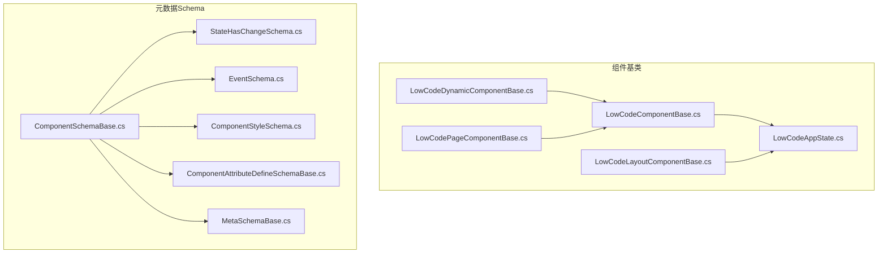
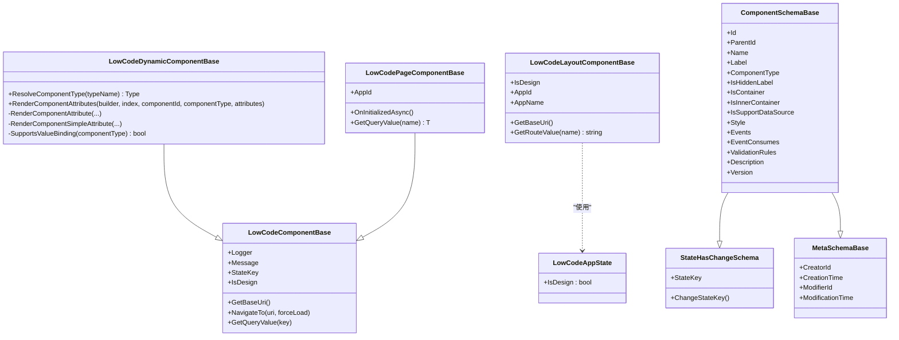
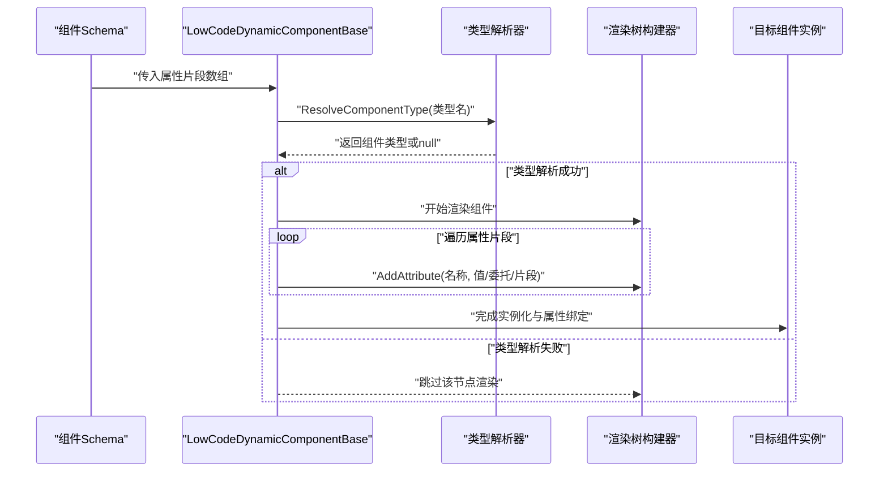
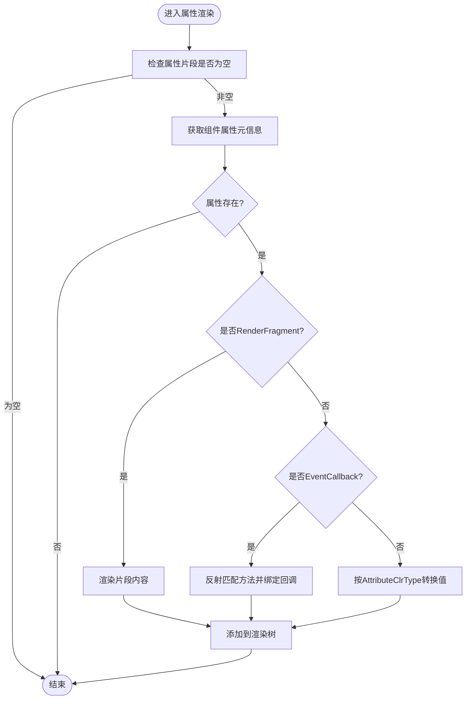
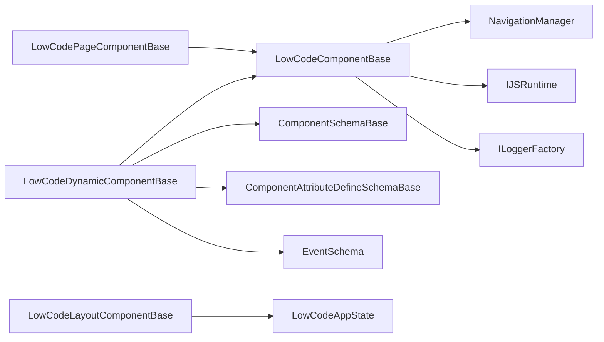

# 自定义组件开发

<cite>
**本文引用的文件**   
- [LowCodeComponentBase.cs](file://src/LowCode/Common/H.LowCode.ComponentBase/LowCodeComponentBase.cs)
- [LowCodeDynamicComponentBase.cs](file://src/LowCode/Common/H.LowCode.ComponentBase/LowCodeDynamicComponentBase.cs)
- [LowCodeLayoutComponentBase.cs](file://src/LowCode/Common/H.LowCode.ComponentBase/LowCodeLayoutComponentBase.cs)
- [LowCodePageComponentBase.cs](file://src/LowCode/Common/H.LowCode.ComponentBase/LowCodePageComponentBase.cs)
- [LowCodeAppState.cs](file://src/LowCode/Common/H.LowCode.ComponentBase/LowCodeAppState.cs)
- [ComponentSchemaBase.cs](file://src/LowCode/Common/H.LowCode.MetaSchema/ComponentSchemaBase.cs)
- [MetaSchemaBase.cs](file://src/LowCode/Common/H.LowCode.MetaSchema/MetaSchemaBase.cs)
- [ComponentAttributeDefineSchemaBase.cs](file://src/LowCode/Common/H.LowCode.MetaSchema/PropertySchemas/ComponentAttributeDefineSchemaBase.cs)
- [EventSchema.cs](file://src/LowCode/Common/H.LowCode.MetaSchema/PropertySchemas/EventSchema.cs)
- [ComponentStyleSchema.cs](file://src/LowCode/Common/H.LowCode.MetaSchema/PropertySchemas/ComponentStyleSchema.cs)
- [StateHasChangeSchema.cs](file://src/LowCode/Common/H.LowCode.MetaSchema/StateHasChangeSchema.cs)
</cite>

## 目录
1. [简介](#简介)
2. [项目结构](#项目结构)
3. [核心组件](#核心组件)
4. [架构总览](#架构总览)
5. [详细组件分析](#详细组件分析)
6. [依赖关系分析](#依赖关系分析)
7. [性能考虑](#性能考虑)
8. [故障排查指南](#故障排查指南)
9. [结论](#结论)
10. [附录](#附录)

## 简介
本指南面向AppLab低代码平台的自定义组件开发者，系统讲解如何基于LowCodeComponentBase与LowCodeDynamicComponentBase构建可配置、可运行、可扩展的组件。内容覆盖：
- 基类继承与生命周期管理
- 属性绑定与事件处理机制
- 动态组件创建与运行时加载
- 组件元数据定义、Schema配置与属性编辑器生成
- 从简单展示组件到复杂交互组件的完整示例路径
- 测试策略、调试技巧与性能优化
- 发布、版本管理与依赖注入配置
- 组件库组织、命名规范与文档生成最佳实践

## 项目结构
围绕低代码组件体系的核心位于Common层，包含组件基类、元数据Schema与默认组件集合等模块。下图展示了与自定义组件开发密切相关的目录与文件关系。

图表来源
- [LowCodeComponentBase.cs:1-73](file://src/LowCode/Common/H.LowCode.ComponentBase/LowCodeComponentBase.cs#L1-L73)
- [LowCodeDynamicComponentBase.cs:1-187](file://src/LowCode/Common/H.LowCode.ComponentBase/LowCodeDynamicComponentBase.cs#L1-L187)
- [LowCodeLayoutComponentBase.cs:1-66](file://src/LowCode/Common/H.LowCode.ComponentBase/LowCodeLayoutComponentBase.cs#L1-L66)
- [LowCodePageComponentBase.cs:1-22](file://src/LowCode/Common/H.LowCode.ComponentBase/LowCodePageComponentBase.cs#L1-L22)
- [LowCodeAppState.cs:1-21](file://src/LowCode/Common/H.LowCode.ComponentBase/LowCodeAppState.cs#L1-L21)
- [ComponentSchemaBase.cs:1-104](file://src/LowCode/Common/H.LowCode.MetaSchema/ComponentSchemaBase.cs#L1-L104)
- [MetaSchemaBase.cs:1-20](file://src/LowCode/Common/H.LowCode.MetaSchema/MetaSchemaBase.cs#L1-L20)
- [ComponentAttributeDefineSchemaBase.cs:1-26](file://src/LowCode/Common/H.LowCode.MetaSchema/PropertySchemas/ComponentAttributeDefineSchemaBase.cs#L1-L26)
- [EventSchema.cs:1-67](file://src/LowCode/Common/H.LowCode.MetaSchema/PropertySchemas/EventSchema.cs#L1-L67)
- [ComponentStyleSchema.cs:1-40](file://src/LowCode/Common/H.LowCode.MetaSchema/PropertySchemas/ComponentStyleSchema.cs#L1-L40)
- [StateHasChangeSchema.cs:1-17](file://src/LowCode/Common/H.LowCode.MetaSchema/StateHasChangeSchema.cs#L1-L17)

章节来源
- [LowCodeComponentBase.cs:1-73](file://src/LowCode/Common/H.LowCode.ComponentBase/LowCodeComponentBase.cs#L1-L73)
- [LowCodeDynamicComponentBase.cs:1-187](file://src/LowCode/Common/H.LowCode.ComponentBase/LowCodeDynamicComponentBase.cs#L1-L187)
- [ComponentSchemaBase.cs:1-104](file://src/LowCode/Common/H.LowCode.MetaSchema/ComponentSchemaBase.cs#L1-L104)

## 核心组件
本节聚焦自定义组件开发的关键基类与状态管理对象，说明其职责、关键能力与使用要点。

- LowCodeComponentBase
  - 提供通用注入（导航、JS运行时、日志工厂）、消息提示服务、查询参数解析、基础URI获取与跳转方法。
  - 暴露IsDesign标识用于区分设计时/运行时代码分支。
  - 为派生组件提供统一的日志记录器与便捷工具方法。

- LowCodeDynamicComponentBase
  - 实现“按类型名动态创建并渲染组件”的能力，支持旧版AntDesign类型名到Hc组件的兼容映射。
  - 负责将Schema中的属性片段转换为Blazor属性，包括RenderFragment、EventCallback与简单类型的值转换。
  - 提供ResolveComponentType用于安全解析组件类型，失败返回null以避免崩溃。

- LowCodeLayoutComponentBase
  - 面向布局组件，提供路由参数读取、应用ID/名称获取、设计模式判断等。

- LowCodePageComponentBase
  - 面向页面级组件，提供AppId参数与初始化钩子扩展点。

- LowCodeAppState
  - 全局状态对象，标记当前是否处于设计模式，供组件在渲染或交互时进行差异化处理。

章节来源
- [LowCodeComponentBase.cs:1-73](file://src/LowCode/Common/H.LowCode.ComponentBase/LowCodeComponentBase.cs#L1-L73)
- [LowCodeDynamicComponentBase.cs:1-187](file://src/LowCode/Common/H.LowCode.ComponentBase/LowCodeDynamicComponentBase.cs#L1-L187)
- [LowCodeLayoutComponentBase.cs:1-66](file://src/LowCode/Common/H.LowCode.ComponentBase/LowCodeLayoutComponentBase.cs#L1-L66)
- [LowCodePageComponentBase.cs:1-22](file://src/LowCode/Common/H.LowCode.ComponentBase/LowCodePageComponentBase.cs#L1-L22)
- [LowCodeAppState.cs:1-21](file://src/LowCode/Common/H.LowCode.ComponentBase/LowCodeAppState.cs#L1-L21)

## 架构总览
下图展示了自定义组件从Schema到运行时渲染的整体流程，以及各基类之间的协作关系。

图表来源
- [LowCodeComponentBase.cs:1-73](file://src/LowCode/Common/H.LowCode.ComponentBase/LowCodeComponentBase.cs#L1-L73)
- [LowCodeDynamicComponentBase.cs:1-187](file://src/LowCode/Common/H.LowCode.ComponentBase/LowCodeDynamicComponentBase.cs#L1-L187)
- [LowCodeLayoutComponentBase.cs:1-66](file://src/LowCode/Common/H.LowCode.ComponentBase/LowCodeLayoutComponentBase.cs#L1-L66)
- [LowCodePageComponentBase.cs:1-22](file://src/LowCode/Common/H.LowCode.ComponentBase/LowCodePageComponentBase.cs#L1-L22)
- [LowCodeAppState.cs:1-21](file://src/LowCode/Common/H.LowCode.ComponentBase/LowCodeAppState.cs#L1-L21)
- [ComponentSchemaBase.cs:1-104](file://src/LowCode/Common/H.LowCode.MetaSchema/ComponentSchemaBase.cs#L1-L104)
- [MetaSchemaBase.cs:1-20](file://src/LowCode/Common/H.LowCode.MetaSchema/MetaSchemaBase.cs#L1-L20)
- [StateHasChangeSchema.cs:1-17](file://src/LowCode/Common/H.LowCode.MetaSchema/StateHasChangeSchema.cs#L1-L17)

## 详细组件分析

### LowCodeComponentBase 基类
- 职责
  - 统一注入NavigationManager、IJSRuntime、ILoggerFactory。
  - 提供消息提示服务（通过JS调用alert封装）。
  - 提供导航、查询参数解析、基础URI获取等常用方法。
  - 暴露IsDesign标识，便于在设计/运行模式间切换行为。
- 使用建议
  - 自定义组件优先继承该基类以复用通用能力。
  - 通过StateKey配合ShouldRender实现细粒度更新控制。
  - 使用Message服务进行用户反馈，避免直接调用JS。

章节来源
- [LowCodeComponentBase.cs:1-73](file://src/LowCode/Common/H.LowCode.ComponentBase/LowCodeComponentBase.cs#L1-L73)

### LowCodeDynamicComponentBase 动态组件基类
- 职责
  - 根据字符串类型名解析组件类型，支持旧版AntDesign到Hc组件的兼容映射。
  - 将Schema中的属性片段（名称、CLR类型、值）转换为Blazor属性，支持：
    - RenderFragment（如ChildContent）
    - EventCallback（通过反射匹配方法名）
    - 简单类型（按目标CLR类型进行值转换）
- 关键点
  - ResolveComponentType：安全解析类型，失败返回null，调用方应跳过渲染节点。
  - RenderComponentAttributes：遍历属性片段并逐个渲染。
  - SupportsValueBinding：检测组件是否支持Value/ValueChanged双向绑定模式。
- 使用建议
  - 在渲染树中通过AddAttribute添加属性，确保index自增正确。
  - 对事件回调，确保组件中存在同名方法且签名匹配EventCallback。
  - 对复杂类型，确保AttributeClrType准确，以便ConvertToRealType正确转换。

章节来源
- [LowCodeDynamicComponentBase.cs:1-187](file://src/LowCode/Common/H.LowCode.ComponentBase/LowCodeDynamicComponentBase.cs#L1-L187)

### 布局与页面基类
- LowCodeLayoutComponentBase
  - 提供路由参数读取（如AppId）、应用信息获取、设计模式判断。
  - 适用于需要访问路由上下文或应用级信息的布局组件。
- LowCodePageComponentBase
  - 提供AppId参数与初始化钩子扩展点，适合页面级组件。

章节来源
- [LowCodeLayoutComponentBase.cs:1-66](file://src/LowCode/Common/H.LowCode.ComponentBase/LowCodeLayoutComponentBase.cs#L1-L66)
- [LowCodePageComponentBase.cs:1-22](file://src/LowCode/Common/H.LowCode.ComponentBase/LowCodePageComponentBase.cs#L1-L22)

### 组件元数据与Schema
- ComponentSchemaBase
  - 定义组件实例Id、父Id、名称、标签、类型、容器标志、样式、事件、校验规则、描述与版本等。
  - 继承StateHasChangeSchema与MetaSchemaBase，具备状态键与审计字段。
- MetaSchemaBase
  - 提供创建者、创建时间、修改者、修改时间等审计字段。
- StateHasChangeSchema
  - 提供StateKey与ChangeStateKey方法，用于触发局部刷新。
- 属性与事件Schema
  - ComponentAttributeDefineSchemaBase：属性名、CLR类型、值。
  - EventSchema：事件名、目标类型、目标Id/动作、自定义脚本、数据操作类型、参数映射等。
  - ComponentStyleSchema：宽度、高度、标签宽度、默认/自定义样式。

章节来源
- [ComponentSchemaBase.cs:1-104](file://src/LowCode/Common/H.LowCode.MetaSchema/ComponentSchemaBase.cs#L1-L104)
- [MetaSchemaBase.cs:1-20](file://src/LowCode/Common/H.LowCode.MetaSchema/MetaSchemaBase.cs#L1-L20)
- [StateHasChangeSchema.cs:1-17](file://src/LowCode/Common/H.LowCode.MetaSchema/StateHasChangeSchema.cs#L1-L17)
- [ComponentAttributeDefineSchemaBase.cs:1-26](file://src/LowCode/Common/H.LowCode.MetaSchema/PropertySchemas/ComponentAttributeDefineSchemaBase.cs#L1-L26)
- [EventSchema.cs:1-67](file://src/LowCode/Common/H.LowCode.MetaSchema/PropertySchemas/EventSchema.cs#L1-L67)
- [ComponentStyleSchema.cs:1-40](file://src/LowCode/Common/H.LowCode.MetaSchema/PropertySchemas/ComponentStyleSchema.cs#L1-L40)

### 动态组件渲染时序图
下图展示从Schema到组件渲染的关键步骤，包括类型解析、属性绑定与事件回调注册。

图表来源
- [LowCodeDynamicComponentBase.cs:57-77](file://src/LowCode/Common/H.LowCode.ComponentBase/LowCodeDynamicComponentBase.cs#L57-L77)
- [LowCodeDynamicComponentBase.cs:87-142](file://src/LowCode/Common/H.LowCode.ComponentBase/LowCodeDynamicComponentBase.cs#L87-L142)

### 属性值转换流程图
下图展示简单属性的值转换流程，强调类型匹配与转换逻辑。

图表来源
- [LowCodeDynamicComponentBase.cs:100-176](file://src/LowCode/Common/H.LowCode.ComponentBase/LowCodeDynamicComponentBase.cs#L100-L176)

## 依赖关系分析
- 组件基类依赖
  - LowCodeComponentBase依赖注入NavigationManager、IJSRuntime、ILoggerFactory。
  - LowCodeDynamicComponentBase依赖MetaSchema中的属性片段与事件Schema。
  - Layout/Page基类依赖LowCodeAppState与NavigationManager。
- Schema依赖
  - ComponentSchemaBase依赖StateHasChangeSchema与MetaSchemaBase。
  - 事件Schema与样式Schema独立定义，便于扩展与组合。
- 外部依赖
  - Blazor框架（ComponentBase、RenderTreeBuilder、EventCallback）。
  - JS互操作（IJSRuntime）用于消息提示。

图表来源
- [LowCodeComponentBase.cs:1-73](file://src/LowCode/Common/H.LowCode.ComponentBase/LowCodeComponentBase.cs#L1-L73)
- [LowCodeDynamicComponentBase.cs:1-187](file://src/LowCode/Common/H.LowCode.ComponentBase/LowCodeDynamicComponentBase.cs#L1-L187)
- [LowCodeLayoutComponentBase.cs:1-66](file://src/LowCode/Common/H.LowCode.ComponentBase/LowCodeLayoutComponentBase.cs#L1-L66)
- [LowCodePageComponentBase.cs:1-22](file://src/LowCode/Common/H.LowCode.ComponentBase/LowCodePageComponentBase.cs#L1-L22)
- [ComponentSchemaBase.cs:1-104](file://src/LowCode/Common/H.LowCode.MetaSchema/ComponentSchemaBase.cs#L1-L104)
- [ComponentAttributeDefineSchemaBase.cs:1-26](file://src/LowCode/Common/H.LowCode.MetaSchema/PropertySchemas/ComponentAttributeDefineSchemaBase.cs#L1-L26)
- [EventSchema.cs:1-67](file://src/LowCode/Common/H.LowCode.MetaSchema/PropertySchemas/EventSchema.cs#L1-L67)
- [LowCodeAppState.cs:1-21](file://src/LowCode/Common/H.LowCode.ComponentBase/LowCodeAppState.cs#L1-L21)

章节来源
- [LowCodeComponentBase.cs:1-73](file://src/LowCode/Common/H.LowCode.ComponentBase/LowCodeComponentBase.cs#L1-L73)
- [LowCodeDynamicComponentBase.cs:1-187](file://src/LowCode/Common/H.LowCode.ComponentBase/LowCodeDynamicComponentBase.cs#L1-L187)
- [ComponentSchemaBase.cs:1-104](file://src/LowCode/Common/H.LowCode.MetaSchema/ComponentSchemaBase.cs#L1-L104)

## 性能考虑
- 渲染优化
  - 使用StateKey与ShouldRender减少不必要的重渲染。
  - 仅在必要时重建RenderFragment，避免重复分配。
- 类型解析
  - 缓存已解析的类型结果，避免重复反射与字符串解析。
- 事件绑定
  - 尽量使用静态委托或缓存委托实例，减少每次渲染的委托创建开销。
- 属性转换
  - 对频繁使用的类型转换，考虑预编译表达式或缓存转换结果。
- 设计模式
  - 在设计模式下减少重型计算与网络请求，提升编辑器响应速度。

[本节为通用指导，不直接分析具体文件]

## 故障排查指南
- 类型解析失败
  - 现象：动态组件未渲染或抛出异常。
  - 排查：确认类型名格式、程序集引用、兼容映射表是否包含旧类型。
  - 参考：类型解析与兼容映射逻辑。
- 属性绑定无效
  - 现象：组件属性未生效或值未更新。
  - 排查：检查AttributeClrType是否与组件属性类型一致；确认属性名拼写正确。
  - 参考：属性渲染与值转换逻辑。
- 事件回调未触发
  - 现象：点击或交互无响应。
  - 排查：确认组件中存在同名方法且签名匹配EventCallback；检查事件片段是否正确传递。
  - 参考：事件回调绑定逻辑。
- 设计模式异常
  - 现象：设计时行为与预期不符。
  - 排查：检查IsDesign分支逻辑；确认LowCodeAppState注入正确。
  - 参考：设计模式标识与状态对象。

章节来源
- [LowCodeDynamicComponentBase.cs:57-77](file://src/LowCode/Common/H.LowCode.ComponentBase/LowCodeDynamicComponentBase.cs#L57-L77)
- [LowCodeDynamicComponentBase.cs:100-176](file://src/LowCode/Common/H.LowCode.ComponentBase/LowCodeDynamicComponentBase.cs#L100-L176)
- [LowCodeAppState.cs:1-21](file://src/LowCode/Common/H.LowCode.ComponentBase/LowCodeAppState.cs#L1-L21)

## 结论
通过LowCodeComponentBase与LowCodeDynamicComponentBase，AppLab提供了强大的自定义组件开发基础。结合完善的Schema体系，开发者可以高效构建可配置、可运行、易维护的低代码组件。遵循本文的架构与实践建议，能够显著提升组件质量与开发效率。

[本节为总结性内容，不直接分析具体文件]

## 附录

### 自定义组件开发示例路径
- 简单展示组件
  - 继承LowCodeComponentBase，定义必要属性与样式Schema，使用RenderFragment输出内容。
  - 参考：组件基类与样式Schema。
- 交互式组件
  - 继承LowCodeDynamicComponentBase，定义事件Schema与方法回调，实现用户交互。
  - 参考：事件Schema与动态组件渲染。
- 容器组件
  - 设置IsContainer为true，支持子组件嵌套与布局控制。
  - 参考：组件Schema容器标志。

章节来源
- [ComponentSchemaBase.cs:1-104](file://src/LowCode/Common/H.LowCode.MetaSchema/ComponentSchemaBase.cs#L1-L104)
- [ComponentStyleSchema.cs:1-40](file://src/LowCode/Common/H.LowCode.MetaSchema/PropertySchemas/ComponentStyleSchema.cs#L1-L40)
- [EventSchema.cs:1-67](file://src/LowCode/Common/H.LowCode.MetaSchema/PropertySchemas/EventSchema.cs#L1-L67)
- [LowCodeDynamicComponentBase.cs:1-187](file://src/LowCode/Common/H.LowCode.ComponentBase/LowCodeDynamicComponentBase.cs#L1-L187)

### 组件测试策略
- 单元测试
  - 针对属性转换、事件绑定、类型解析等核心逻辑编写测试用例。
  - 模拟LowCodeAppState与IJSRuntime环境。
- 集成测试
  - 验证Schema到组件的端到端渲染流程。
  - 覆盖设计模式与运行模式差异。
- 回归测试
  - 回归验证。

[本节为通用指导，不直接分析具体文件]

### 调试技巧
- 启用详细日志
  - 使用基类提供的Logger记录关键步骤与异常。
- 浏览器控制台
  - 通过Message服务输出提示信息，辅助定位问题。
- 断点调试
  - 在属性渲染与事件回调处设置断点，检查值与委托绑定。

章节来源
- [LowCodeComponentBase.cs:1-73](file://src/LowCode/Common/H.LowCode.ComponentBase/LowCodeComponentBase.cs#L1-L73)

### 性能优化方法
- 延迟加载
  - 对重型组件按需加载，减少初始渲染负担。
- 缓存策略
  - 缓存类型解析结果与转换结果，避免重复计算。
- 最小化重渲染
  - 合理使用StateKey与ShouldRender，精准控制更新范围。

[本节为通用指导，不直接分析具体文件]

### 发布与版本管理
- 版本字段
  - 使用ComponentSchemaBase.Version字段管理组件版本。
- 依赖声明
  - 明确组件对外部程序集的依赖，确保运行时可用。
- 兼容性
  - 维护旧类型映射表，确保历史页面正常渲染。

章节来源
- [ComponentSchemaBase.cs:1-104](file://src/LowCode/Common/H.LowCode.MetaSchema/ComponentSchemaBase.cs#L1-L104)
- [LowCodeDynamicComponentBase.cs:21-51](file://src/LowCode/Common/H.LowCode.ComponentBase/LowCodeDynamicComponentBase.cs#L21-L51)

### 组件库组织与命名规范
- 目录结构
  - 按功能域划分组件库，每个库包含组件、样式与资源文件。
- 命名规范
  - 组件类名采用PascalCase，属性名与事件名保持一致语义。
- 文档生成
  - 基于Schema自动生成API文档与属性编辑器界面。

[本节为通用指导，不直接分析具体文件]