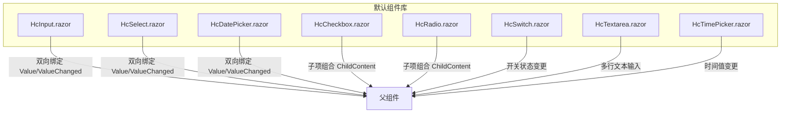
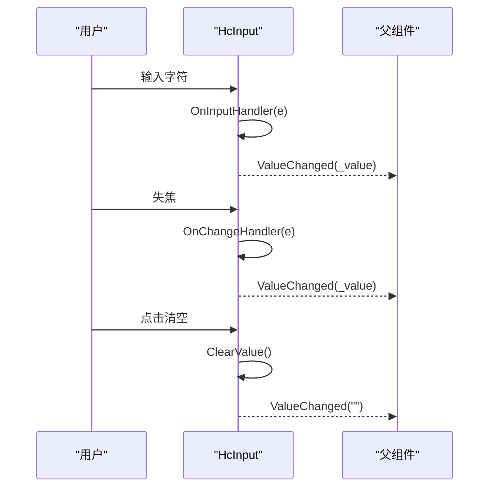
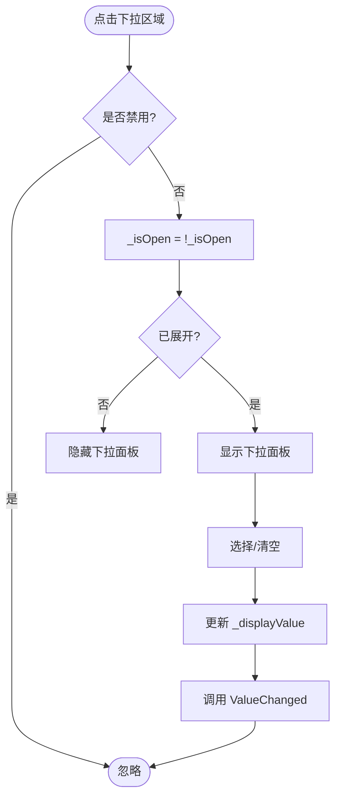
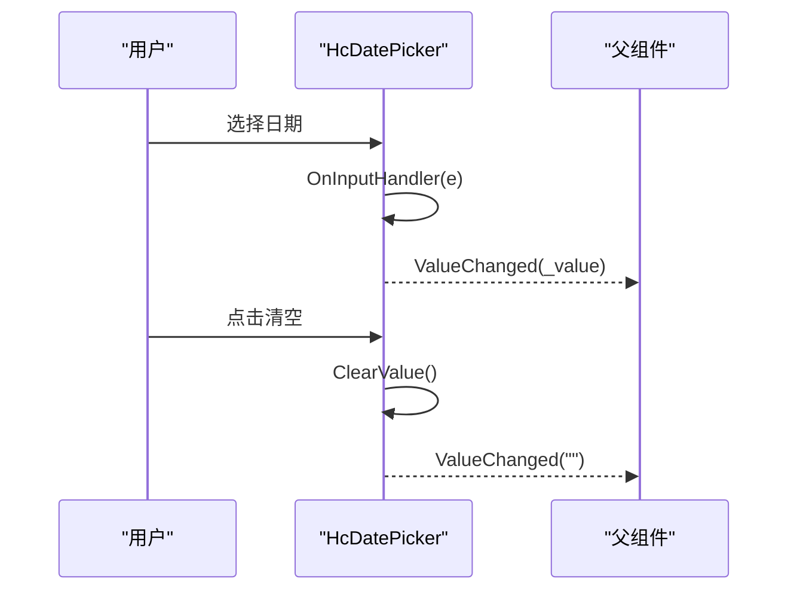
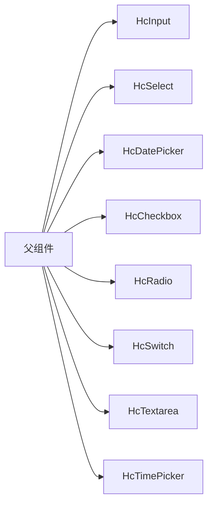

# 表单组件

<cite>
**本文引用的文件**
- [HcInput.razor](file://src/LowCode/Common/H.LowCode.Components.Defaults/Components/HcInput.razor)
- [HcSelect.razor](file://src/LowCode/Common/H.LowCode.Components.Defaults/Components/HcSelect.razor)
- [HcDatePicker.razor](file://src/LowCode/Common/H.LowCode.Components.Defaults/Components/HcDatePicker.razor)
- [HcCheckbox.razor](file://src/LowCode/Common/H.LowCode.Components.Defaults/Components/HcCheckbox.razor)
- [HcRadio.razor](file://src/LowCode/Common/H.LowCode.Components.Defaults/Components/HcRadio.razor)
- [HcSwitch.razor](file://src/LowCode/Common/H.LowCode.Components.Defaults/Components/HcSwitch.razor)
- [HcTextarea.razor](file://src/LowCode/Common/H.LowCode.Components.Defaults/Components/HcTextarea.razor)
- [HcTimePicker.razor](file://src/LowCode/Common/H.LowCode.Components.Defaults/Components/HcTimePicker.razor)
</cite>

## 目录
1. [简介](#简介)
2. [项目结构](#项目结构)
3. [核心组件](#核心组件)
4. [架构总览](#架构总览)
5. [详细组件分析](#详细组件分析)
6. [依赖关系分析](#依赖关系分析)
7. [性能考虑](#性能考虑)
8. [故障排查指南](#故障排查指南)
9. [结论](#结论)
10. [附录](#附录)

## 简介
本文件为 AppLab 的表单组件提供全面文档，覆盖 HcInput、HcSelect、HcDatePicker、HcCheckbox、HcRadio、HcSwitch、HcTextarea、HcTimePicker 等组件的功能特性与使用方式。内容涵盖：
- 数据绑定机制（Value/ValueChanged）
- 表单验证规则配置与自定义验证器实现思路
- 样式定制、主题适配与响应式布局建议
- 常见场景的完整表单构建示例（单行输入、下拉选择、日期时间选择、复选框组等）
- 表单提交处理、错误提示与用户交互优化
- 性能优化与可访问性最佳实践

## 项目结构
表单组件统一位于默认组件库中，采用 Blazor 组件组织方式，每个组件一个 .razor 文件，参数通过 [Parameter] 暴露，事件通过 EventCallback 通知父组件。

图表来源
- [HcInput.razor](file://src/LowCode/Common/H.LowCode.Components.Defaults/Components/HcInput.razor)
- [HcSelect.razor](file://src/LowCode/Common/H.LowCode.Components.Defaults/Components/HcSelect.razor)
- [HcDatePicker.razor](file://src/LowCode/Common/H.LowCode.Components.Defaults/Components/HcDatePicker.razor)
- [HcCheckbox.razor](file://src/LowCode/Common/H.LowCode.Components.Defaults/Components/HcCheckbox.razor)
- [HcRadio.razor](file://src/LowCode/Common/H.LowCode.Components.Defaults/Components/HcRadio.razor)
- [HcSwitch.razor](file://src/LowCode/Common/H.LowCode.Components.Defaults/Components/HcSwitch.razor)
- [HcTextarea.razor](file://src/LowCode/Common/H.LowCode.Components.Defaults/Components/HcTextarea.razor)
- [HcTimePicker.razor](file://src/LowCode/Common/H.LowCode.Components.Defaults/Components/HcTimePicker.razor)

章节来源
- [HcInput.razor](file://src/LowCode/Common/H.LowCode.Components.Defaults/Components/HcInput.razor)
- [HcSelect.razor](file://src/LowCode/Common/H.LowCode.Components.Defaults/Components/HcSelect.razor)
- [HcDatePicker.razor](file://src/LowCode/Common/H.LowCode.Components.Defaults/Components/HcDatePicker.razor)
- [HcCheckbox.razor](file://src/LowCode/Common/H.LowCode.Components.Defaults/Components/HcCheckbox.razor)
- [HcRadio.razor](file://src/LowCode/Common/H.LowCode.Components.Defaults/Components/HcRadio.razor)
- [HcSwitch.razor](file://src/LowCode/Common/H.LowCode.Components.Defaults/Components/HcSwitch.razor)
- [HcTextarea.razor](file://src/LowCode/Common/H.LowCode.Components.Defaults/Components/HcTextarea.razor)
- [HcTimePicker.razor](file://src/LowCode/Common/H.LowCode.Components.Defaults/Components/HcTimePicker.razor)

## 核心组件
本节概述各组件的核心能力与常用参数，便于快速上手与选型。

- HcInput（单行输入）
  - 功能：文本输入、占位符、禁用/只读、最大长度、清空按钮
  - 关键参数：Placeholder、Disabled、MaxLength、ReadOnly、AllowClear、Value、ValueChanged、Style
  - 事件：oninput/onchange 触发 ValueChanged

- HcSelect（下拉选择）
  - 功能：单选/多选模式、清空、边框、展开收起、搜索（预留）
  - 关键参数：Placeholder、Disabled、AllowClear、ShowSearch、Mode、Bordered、Value、ValueChanged、ChildContent、Style
  - 事件：点击下拉区域切换展开；清空时触发 ValueChanged

- HcDatePicker（日期选择）
  - 功能：日期/周/月/年选择、格式化、清空
  - 关键参数：Placeholder、Disabled、AllowClear、Format、Picker、Value、ValueChanged、Style
  - 事件：输入变化触发 ValueChanged

- HcCheckbox（复选框组容器）
  - 功能：水平/垂直排列、禁用、子项容器
  - 关键参数：Disabled、Direction、ChildContent、Style

- HcRadio（单选框组容器）
  - 功能：水平/垂直排列、禁用、子项容器
  - 关键参数：Disabled、Direction、ChildContent、Style

- HcSwitch（开关）
  - 功能：布尔值开关、禁用、样式
  - 关键参数：Disabled、Value、ValueChanged、Style

- HcTextarea（多行文本）
  - 功能：多行输入、占位符、禁用/只读、最大长度、清空（可选）
  - 关键参数：Placeholder、Disabled、MaxLength、ReadOnly、AllowClear、Value、ValueChanged、Style

- HcTimePicker（时间选择）
  - 功能：时间选择、格式化、清空
  - 关键参数：Placeholder、Disabled、AllowClear、Format、Value、ValueChanged、Style

章节来源
- [HcInput.razor](file://src/LowCode/Common/H.LowCode.Components.Defaults/Components/HcInput.razor)
- [HcSelect.razor](file://src/LowCode/Common/H.LowCode.Components.Defaults/Components/HcSelect.razor)
- [HcDatePicker.razor](file://src/LowCode/Common/H.LowCode.Components.Defaults/Components/HcDatePicker.razor)
- [HcCheckbox.razor](file://src/LowCode/Common/H.LowCode.Components.Defaults/Components/HcCheckbox.razor)
- [HcRadio.razor](file://src/LowCode/Common/H.LowCode.Components.Defaults/Components/HcRadio.razor)
- [HcSwitch.razor](file://src/LowCode/Common/H.LowCode.Components.Defaults/Components/HcSwitch.razor)
- [HcTextarea.razor](file://src/LowCode/Common/H.LowCode.Components.Defaults/Components/HcTextarea.razor)
- [HcTimePicker.razor](file://src/LowCode/Common/H.LowCode.Components.Defaults/Components/HcTimePicker.razor)

## 架构总览
所有表单组件遵循统一的“参数 + 事件”模型：
- 数据绑定：通过 Value 与 ValueChanged 实现双向绑定
- 渲染：基于 Blazor 模板与 CSS 类名控制外观
- 交互：原生 input/select 事件或自定义点击逻辑驱动状态更新

```mermaid
classDiagram
class HcInput {
+string Placeholder
+bool Disabled
+int MaxLength
+bool ReadOnly
+bool AllowClear
+string Value
+EventCallback~string~ ValueChanged
+string Style
}
class HcSelect {
+string Placeholder
+bool Disabled
+bool AllowClear
+bool ShowSearch
+string Mode
+bool Bordered
+string Value
+EventCallback~string~ ValueChanged
+RenderFragment ChildContent
+string Style
}
class HcDatePicker {
+string Placeholder
+bool Disabled
+bool AllowClear
+string Format
+string Picker
+string Value
+EventCallback~string~ ValueChanged
+string Style
}
class HcCheckbox {
+bool Disabled
+string Direction
+RenderFragment ChildContent
+string Style
}
class HcRadio {
+bool Disabled
+string Direction
+RenderFragment ChildContent
+string Style
}
class HcSwitch {
+bool Disabled
+bool Value
+EventCallback~bool~ ValueChanged
+string Style
}
class HcTextarea {
+string Placeholder
+bool Disabled
+int MaxLength
+bool ReadOnly
+bool AllowClear
+string Value
+EventCallback~string~ ValueChanged
+string Style
}
class HcTimePicker {
+string Placeholder
+bool Disabled
+bool AllowClear
+string Format
+string Value
+EventCallback~string~ ValueChanged
+string Style
}
```

图表来源
- [HcInput.razor](file://src/LowCode/Common/H.LowCode.Components.Defaults/Components/HcInput.razor)
- [HcSelect.razor](file://src/LowCode/Common/H.LowCode.Components.Defaults/Components/HcSelect.razor)
- [HcDatePicker.razor](file://src/LowCode/Common/H.LowCode.Components.Defaults/Components/HcDatePicker.razor)
- [HcCheckbox.razor](file://src/LowCode/Common/H.LowCode.Components.Defaults/Components/HcCheckbox.razor)
- [HcRadio.razor](file://src/LowCode/Common/H.LowCode.Components.Defaults/Components/HcRadio.razor)
- [HcSwitch.razor](file://src/LowCode/Common/H.LowCode.Components.Defaults/Components/HcSwitch.razor)
- [HcTextarea.razor](file://src/LowCode/Common/H.LowCode.Components.Defaults/Components/HcTextarea.razor)
- [HcTimePicker.razor](file://src/LowCode/Common/H.LowCode.Components.Defaults/Components/HcTimePicker.razor)

## 详细组件分析

### HcInput 分析
- 行为要点
  - oninput 实时同步 _value 并触发 ValueChanged
  - onchange 在失焦时再次同步，确保一致性
  - AllowClear 显示清空按钮，点击后清空并触发 ValueChanged
  - MaxLength 限制输入长度，Disabled/ReadOnly 控制交互态
- 数据流
  - 用户输入 → OnInputHandler/OnChangeHandler → 更新 _value → 调用 ValueChanged
- 样式
  - 外层 wrapper 与 input 类名控制外观，支持内联 Style

图表来源
- [HcInput.razor](file://src/LowCode/Common/H.LowCode.Components.Defaults/Components/HcInput.razor)

章节来源
- [HcInput.razor](file://src/LowCode/Common/H.LowCode.Components.Defaults/Components/HcInput.razor)

### HcSelect 分析
- 行为要点
  - ToggleOpen 控制下拉展开/收起，Disabled 时不可展开
  - AllowClear 显示清空按钮，点击后清空并关闭下拉
  - ChildContent 用于注入选项列表（如 HcSelectOption）
  - Mode 支持 single/multi（当前展示值为字符串，可扩展为数组）
- 数据流
  - 点击下拉区域 → 切换 _isOpen
  - 选择/清空 → 更新 _displayValue → 调用 ValueChanged
- 样式
  - wrapper、select、dropdown 类名控制外观，支持内联 Style

图表来源
- [HcSelect.razor](file://src/LowCode/Common/H.LowCode.Components.Defaults/Components/HcSelect.razor)

章节来源
- [HcSelect.razor](file://src/LowCode/Common/H.LowCode.Components.Defaults/Components/HcSelect.razor)

### HcDatePicker 分析
- 行为要点
  - Picker 决定输入类型（date/week/month/year），Format 控制输出格式
  - AllowClear 支持清空
  - oninput 实时更新 _value 并触发 ValueChanged
- 数据流
  - 用户选择/输入 → OnInputHandler → 更新 _value → 调用 ValueChanged
- 样式
  - 使用 hc-input 基础样式，wrapper 包裹，支持内联 Style

图表来源
- [HcDatePicker.razor](file://src/LowCode/Common/H.LowCode.Components.Defaults/Components/HcDatePicker.razor)

章节来源
- [HcDatePicker.razor](file://src/LowCode/Common/H.LowCode.Components.Defaults/Components/HcDatePicker.razor)

### HcCheckbox 与 HcRadio 分析
- 行为要点
  - 作为容器组件，负责方向（horizontal/vertical）、禁用与子项渲染
  - ChildContent 注入具体选项（如 HcCheckboxOption/HcRadioOption）
- 数据流
  - 由子项管理选中状态，容器仅负责布局与样式
- 样式
  - 根据 Direction 切换布局类名，支持内联 Style

章节来源
- [HcCheckbox.razor](file://src/LowCode/Common/H.LowCode.Components.Defaults/Components/HcCheckbox.razor)
- [HcRadio.razor](file://src/LowCode/Common/H.LowCode.Components.Defaults/Components/HcRadio.razor)

### HcSwitch 分析
- 行为要点
  - 布尔值开关，支持禁用与样式定制
  - 通过 Value/ValueChanged 进行双向绑定
- 数据流
  - 用户切换 → 更新 Value → 调用 ValueChanged

章节来源
- [HcSwitch.razor](file://src/LowCode/Common/H.LowCode.Components.Defaults/Components/HcSwitch.razor)

### HcTextarea 分析
- 行为要点
  - 多行文本输入，支持占位符、禁用/只读、最大长度、清空（可选）
  - 通过 Value/ValueChanged 进行双向绑定
- 数据流
  - 用户输入 → oninput/onchange → 更新 _value → 调用 ValueChanged

章节来源
- [HcTextarea.razor](file://src/LowCode/Common/H.LowCode.Components.Defaults/Components/HcTextarea.razor)

### HcTimePicker 分析
- 行为要点
  - 时间选择，支持格式化与清空
  - 通过 Value/ValueChanged 进行双向绑定
- 数据流
  - 用户选择 → 更新 _value → 调用 ValueChanged

章节来源
- [HcTimePicker.razor](file://src/LowCode/Common/H.LowCode.Components.Defaults/Components/HcTimePicker.razor)

## 依赖关系分析
- 组件间耦合度低，均为独立 Blazor 组件，通过参数与事件通信
- 共同依赖：Blazor 运行时、CSS 类名（hc-*）
- 扩展点：
  - ChildContent 用于组合复杂选项（Select、Checkbox、Radio）
  - Style 属性用于内联样式覆盖
  - Value/ValueChanged 统一数据绑定协议

图表来源
- [HcInput.razor](file://src/LowCode/Common/H.LowCode.Components.Defaults/Components/HcInput.razor)
- [HcSelect.razor](file://src/LowCode/Common/H.LowCode.Components.Defaults/Components/HcSelect.razor)
- [HcDatePicker.razor](file://src/LowCode/Common/H.LowCode.Components.Defaults/Components/HcDatePicker.razor)
- [HcCheckbox.razor](file://src/LowCode/Common/H.LowCode.Components.Defaults/Components/HcCheckbox.razor)
- [HcRadio.razor](file://src/LowCode/Common/H.LowCode.Components.Defaults/Components/HcRadio.razor)
- [HcSwitch.razor](file://src/LowCode/Common/H.LowCode.Components.Defaults/Components/HcSwitch.razor)
- [HcTextarea.razor](file://src/LowCode/Common/H.LowCode.Components.Defaults/Components/HcTextarea.razor)
- [HcTimePicker.razor](file://src/LowCode/Common/H.LowCode.Components.Defaults/Components/HcTimePicker.razor)

章节来源
- [HcInput.razor](file://src/LowCode/Common/H.LowCode.Components.Defaults/Components/HcInput.razor)
- [HcSelect.razor](file://src/LowCode/Common/H.LowCode.Components.Defaults/Components/HcSelect.razor)
- [HcDatePicker.razor](file://src/LowCode/Common/H.LowCode.Components.Defaults/Components/HcDatePicker.razor)
- [HcCheckbox.razor](file://src/LowCode/Common/H.LowCode.Components.Defaults/Components/HcCheckbox.razor)
- [HcRadio.razor](file://src/LowCode/Common/H.LowCode.Components.Defaults/Components/HcRadio.razor)
- [HcSwitch.razor](file://src/LowCode/Common/H.LowCode.Components.Defaults/Components/HcSwitch.razor)
- [HcTextarea.razor](file://src/LowCode/Common/H.LowCode.Components.Defaults/Components/HcTextarea.razor)
- [HcTimePicker.razor](file://src/LowCode/Common/H.LowCode.Components.Defaults/Components/HcTimePicker.razor)

## 性能考虑
- 避免频繁重渲染
  - 将 Value/ValueChanged 的回调函数稳定化（例如使用 @bind 或稳定的委托）
  - 对大型下拉列表（HcSelect）进行分页或虚拟滚动（需扩展组件）
- 减少不必要的计算
  - 在父组件中对 ValueChanged 的处理进行防抖/节流（尤其是输入类组件）
- 合理使用 ChildContent
  - 对于 HcSelect/HcCheckbox/HcRadio，尽量将选项数据静态化或使用缓存
- 样式与主题
  - 通过 CSS 变量或主题类集中管理样式，避免大量内联 Style

[本节为通用指导，不直接分析具体文件]

## 故障排查指南
- 值未更新
  - 检查是否正确绑定 Value/ValueChanged
  - 确认组件未被 Disabled/ReadOnly 阻止交互
- 清空无效
  - 确认 AllowClear 已启用且当前值非空
  - 检查清空事件是否被冒泡阻止（如 HcSelect 的清空按钮使用了 stopPropagation）
- 校验失败
  - 在父组件中实现校验逻辑，并在 ValueChanged 回调中设置错误状态
  - 使用 Form 组件或自定义校验器封装校验流程
- 样式异常
  - 检查 CSS 类名是否被覆盖
  - 确认 Theme 样式加载顺序正确

章节来源
- [HcSelect.razor](file://src/LowCode/Common/H.LowCode.Components.Defaults/Components/HcSelect.razor)
- [HcInput.razor](file://src/LowCode/Common/H.LowCode.Components.Defaults/Components/HcInput.razor)
- [HcDatePicker.razor](file://src/LowCode/Common/H.LowCode.Components.Defaults/Components/HcDatePicker.razor)

## 结论
AppLab 的表单组件以简洁的参数与事件模型为基础，提供了常用的输入、选择、日期时间、开关与文本域能力。通过统一的数据绑定协议与灵活的样式定制，能够快速构建各类表单场景。建议在父组件中集中实现校验、提交与错误提示，以获得一致的用户体验。

[本节为总结，不直接分析具体文件]

## 附录

### 表单验证规则配置与自定义验证器
- 推荐做法
  - 在父组件维护表单状态对象，包含字段值与错误信息
  - 在每个组件的 ValueChanged 回调中执行校验，并更新错误状态
  - 提交前统一校验，若存在错误则阻止提交并提示
- 自定义验证器
  - 定义校验函数集合（如必填、长度、格式、正则）
  - 在 ValueChanged 中按规则链式执行，返回错误消息
  - 将错误消息绑定到 UI 层（如下拉提示、输入框下方提示）

[本节为通用指导，不直接分析具体文件]

### 数据绑定机制
- 双向绑定
  - 使用 @bind-Value 语法简化 Value/ValueChanged 绑定
  - 确保父组件中的属性为可写，且事件回调签名匹配
- 单向绑定
  - 仅传递 Value，通过事件回调手动更新父状态
  - 适用于只读或受控场景

[本节为通用指导，不直接分析具体文件]

### 样式定制、主题适配与响应式设计
- 样式定制
  - 通过 Style 属性进行内联覆盖
  - 通过 CSS 类名（hc-*）进行全局覆盖
- 主题适配
  - 引入主题样式包，确保组件类名与主题兼容
- 响应式设计
  - 使用媒体查询调整布局（如横向/纵向排列）
  - 在小屏设备上优化输入框宽度与间距

[本节为通用指导，不直接分析具体文件]

### 完整表单构建示例（常见场景）
- 单行输入
  - 使用 HcInput，绑定 Value/ValueChanged，添加必填校验
- 下拉选择
  - 使用 HcSelect + 子项（如 HcSelectOption），支持单选/多选
- 日期时间选择
  - 使用 HcDatePicker/HcTimePicker，设置 Format 与 Picker
- 复选框组
  - 使用 HcCheckbox 容器 + 多个选项，收集选中值数组
- 单选框组
  - 使用 HcRadio 容器 + 多个选项，收集选中值
- 开关
  - 使用 HcSwitch 绑定布尔值，常用于启用/禁用功能
- 多行文本
  - 使用 HcTextarea，设置 MaxLength 与 Placeholder

[本节为通用指导，不直接分析具体文件]

### 表单提交处理、错误提示与用户交互优化
- 提交处理
  - 在父组件中汇总表单值，进行最终校验
  - 调用后端 API 提交，处理成功/失败反馈
- 错误提示
  - 在字段级显示错误消息，聚焦首个错误字段
  - 使用 Toast/Alert 提示整体结果
- 用户交互优化
  - 输入防抖、提交防重复点击
  - 禁用提交按钮直到所有字段有效

[本节为通用指导，不直接分析具体文件]

### 性能优化与可访问性支持最佳实践
- 性能优化
  - 避免在 ValueChanged 中进行昂贵计算
  - 对长列表进行分页或懒加载
- 可访问性
  - 为输入控件添加 aria-label 或关联 label
  - 确保键盘导航可用（Tab/Enter/Escape）
  - 错误提示使用 aria-live 区域播报

[本节为通用指导，不直接分析具体文件]