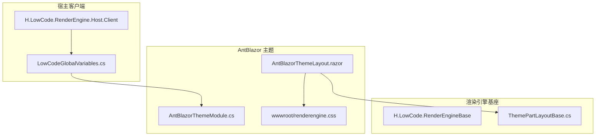
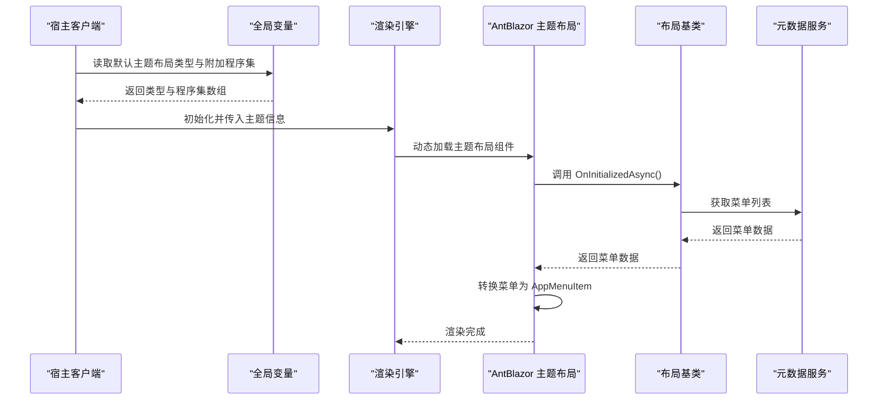
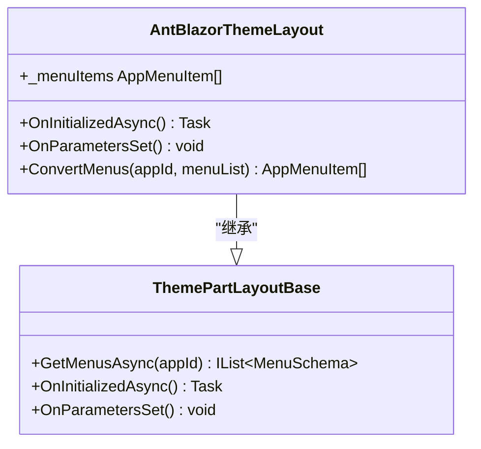
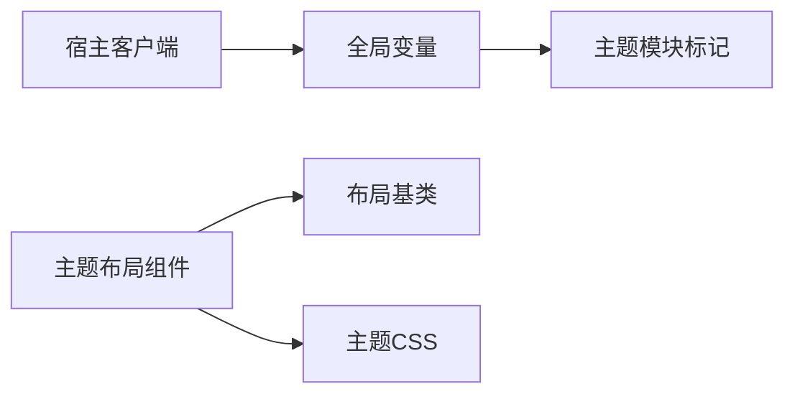

# 主题系统

<cite>
**本文引用的文件**   
- [AntBlazorThemeModule.cs](file://src/LowCode/RenderEngine/H.LowCode.Themes.AntBlazor/AntBlazorThemeModule.cs)
- [AntBlazorThemeLayout.razor](file://src/LowCode/RenderEngine/H.LowCode.Themes.AntBlazor/Layout/AntBlazorThemeLayout.razor)
- [renderengine.css](file://src/LowCode/RenderEngine/H.LowCode.Themes.AntBlazor/wwwroot/renderengine.css)
- [LowCodeGlobalVariables.cs](file://src/Host/RenderEngine/H.LowCode.RenderEngine.Host.Client/LowCodeGlobalVariables.cs)
- [ThemePartLayoutBase.cs](file://src/LowCode/RenderEngine/H.LowCode.RenderEngineBase/Layout/ThemePartLayoutBase.cs)
</cite>

## 目录
1. [简介](#简介)
2. [项目结构](#项目结构)
3. [核心组件](#核心组件)
4. [架构总览](#架构总览)
5. [详细组件分析](#详细组件分析)
6. [依赖关系分析](#依赖关系分析)
7. [性能考虑](#性能考虑)
8. [故障排查指南](#故障排查指南)
9. [结论](#结论)
10. [附录：主题定制与迁移指南](#附录主题定制与迁移指南)

## 简介
本文件为 AppLab 的主题系统提供系统化文档，重点围绕 AntBlazor 主题的集成、定制与切换机制。内容涵盖 CSS 变量覆盖、样式优先级控制、主题切换流程、自定义主题创建（颜色方案、字体配置、间距规范、组件样式覆盖）、响应式设计（断点设置、移动端适配、屏幕尺寸检测）、样式隔离与命名空间管理、最佳实践与调试技巧，以及完整的主题定制示例与迁移指南。读者无需深入前端底层知识即可理解并落地实施。

## 项目结构
AppLab 将“渲染引擎”与“主题实现”解耦，通过模块标记类与全局变量装配默认主题；布局层负责加载主题资源与菜单数据；CSS 资源集中管理，便于覆盖与扩展。

图表来源 
- [LowCodeGlobalVariables.cs:1-14](file://src/Host/RenderEngine/H.LowCode.RenderEngine.Host.Client/LowCodeGlobalVariables.cs#L1-L14)
- [AntBlazorThemeModule.cs:1-9](file://src/LowCode/RenderEngine/H.LowCode.Themes.AntBlazor/AntBlazorThemeModule.cs#L1-L9)
- [AntBlazorThemeLayout.razor:1-60](file://src/LowCode/RenderEngine/H.LowCode.Themes.AntBlazor/Layout/AntBlazorThemeLayout.razor#L1-L60)
- [ThemePartLayoutBase.cs:1-44](file://src/LowCode/RenderEngine/H.LowCode.RenderEngineBase/Layout/ThemePartLayoutBase.cs#L1-L44)

章节来源
- [LowCodeGlobalVariables.cs:1-14](file://src/Host/RenderEngine/H.LowCode.RenderEngine.Host.Client/LowCodeGlobalVariables.cs#L1-L14)
- [AntBlazorThemeModule.cs:1-9](file://src/LowCode/RenderEngine/H.LowCode.Themes.AntBlazor/AntBlazorThemeModule.cs#L1-L9)
- [AntBlazorThemeLayout.razor:1-60](file://src/LowCode/RenderEngine/H.LowCode.Themes.AntBlazor/Layout/AntBlazorThemeLayout.razor#L1-L60)
- [ThemePartLayoutBase.cs:1-44](file://src/LowCode/RenderEngine/H.LowCode.RenderEngineBase/Layout/ThemePartLayoutBase.cs#L1-L44)

## 核心组件
- 主题模块标记类：用于标识 AntBlazor 主题模块，供宿主侧发现与装配。
- 主题布局组件：继承自通用布局基类，负责引入主题 CSS、渲染默认布局与菜单转换。
- 布局基类：提供菜单获取、导航与配置注入等通用能力。
- 全局变量：定义默认主题布局类型与额外程序集集合，驱动运行时选择主题。

章节来源
- [AntBlazorThemeModule.cs:1-9](file://src/LowCode/RenderEngine/H.LowCode.Themes.AntBlazor/AntBlazorThemeModule.cs#L1-L9)
- [AntBlazorThemeLayout.razor:1-60](file://src/LowCode/RenderEngine/H.LowCode.Themes.AntBlazor/Layout/AntBlazorThemeLayout.razor#L1-L60)
- [ThemePartLayoutBase.cs:1-44](file://src/LowCode/RenderEngine/H.LowCode.RenderEngineBase/Layout/ThemePartLayoutBase.cs#L1-L44)
- [LowCodeGlobalVariables.cs:1-14](file://src/Host/RenderEngine/H.LowCode.RenderEngine.Host.Client/LowCodeGlobalVariables.cs#L1-L14)

## 架构总览
主题系统在启动时由宿主客户端通过全局变量指定默认主题布局类型与附加程序集；渲染引擎在初始化时根据该配置动态加载对应主题布局组件，并引入主题 CSS。布局组件从元数据服务获取菜单数据，转换为应用菜单模型后渲染到默认布局中。

图表来源 
- [LowCodeGlobalVariables.cs:1-14](file://src/Host/RenderEngine/H.LowCode.RenderEngine.Host.Client/LowCodeGlobalVariables.cs#L1-L14)
- [AntBlazorThemeLayout.razor:1-60](file://src/LowCode/RenderEngine/H.LowCode.Themes.AntBlazor/Layout/AntBlazorThemeLayout.razor#L1-L60)
- [ThemePartLayoutBase.cs:1-44](file://src/LowCode/RenderEngine/H.LowCode.RenderEngineBase/Layout/ThemePartLayoutBase.cs#L1-L44)

## 详细组件分析

### AntBlazor 主题模块标记类
- 作用：作为主题模块的标记，便于宿主侧通过反射或约定发现主题程序集。
- 设计要点：保持轻量，仅作为命名空间与程序集的标识。

章节来源
- [AntBlazorThemeModule.cs:1-9](file://src/LowCode/RenderEngine/H.LowCode.Themes.AntBlazor/AntBlazorThemeModule.cs#L1-L9)

### 主题布局组件（AntBlazorThemeLayout）
- 职责：
  - 引入主题 CSS 资源（_content/H.LowCode.Themes.AntBlazor/renderengine.css）。
  - 继承布局基类，获取并转换菜单数据。
  - 使用默认布局组件渲染页面框架。
- 关键点：
  - 生命周期中调用基类方法获取菜单，并在参数更新时恢复错误边界状态。
  - 将 MenuSchema 转换为 AppMenuItem，支持多级菜单。

图表来源 
- [ThemePartLayoutBase.cs:1-44](file://src/LowCode/RenderEngine/H.LowCode.RenderEngineBase/Layout/ThemePartLayoutBase.cs#L1-L44)
- [AntBlazorThemeLayout.razor:1-60](file://src/LowCode/RenderEngine/H.LowCode.Themes.AntBlazor/Layout/AntBlazorThemeLayout.razor#L1-L60)

章节来源
- [AntBlazorThemeLayout.razor:1-60](file://src/LowCode/RenderEngine/H.LowCode.Themes.AntBlazor/Layout/AntBlazorThemeLayout.razor#L1-L60)
- [ThemePartLayoutBase.cs:1-44](file://src/LowCode/RenderEngine/H.LowCode.RenderEngineBase/Layout/ThemePartLayoutBase.cs#L1-L44)

### 布局基类（ThemePartLayoutBase）
- 职责：
  - 注入元数据服务、导航与配置。
  - 提供菜单获取与首页菜单插入逻辑。
- 关键点：
  - 若菜单不包含首页，则自动插入默认首页项。
  - 统一菜单数据结构，便于上层布局组件消费。

章节来源
- [ThemePartLayoutBase.cs:1-44](file://src/LowCode/RenderEngine/H.LowCode.RenderEngineBase/Layout/ThemePartLayoutBase.cs#L1-L44)

### 全局变量（LowCodeGlobalVariables）
- 职责：
  - 定义默认主题布局类型（AntBlazorThemeLayout）。
  - 声明附加程序集数组，包含主题 _Imports 所在程序集，确保按需加载。
- 关键点：
  - 通过类型引用与程序集数组，使渲染引擎在运行时动态发现并加载主题。

章节来源
- [LowCodeGlobalVariables.cs:1-14](file://src/Host/RenderEngine/H.LowCode.RenderEngine.Host.Client/LowCodeGlobalVariables.cs#L1-L14)

## 依赖关系分析
- 宿主客户端依赖全局变量以决定默认主题。
- 主题布局依赖布局基类提供的菜单与导航能力。
- 主题 CSS 通过 _content 路径被布局组件引入，形成资源依赖。

图表来源 
- [LowCodeGlobalVariables.cs:1-14](file://src/Host/RenderEngine/H.LowCode.RenderEngine.Host.Client/LowCodeGlobalVariables.cs#L1-L14)
- [AntBlazorThemeLayout.razor:1-60](file://src/LowCode/RenderEngine/H.LowCode.Themes.AntBlazor/Layout/AntBlazorThemeLayout.razor#L1-L60)
- [ThemePartLayoutBase.cs:1-44](file://src/LowCode/RenderEngine/H.LowCode.RenderEngineBase/Layout/ThemePartLayoutBase.cs#L1-L44)

章节来源
- [LowCodeGlobalVariables.cs:1-14](file://src/Host/RenderEngine/H.LowCode.RenderEngine.Host.Client/LowCodeGlobalVariables.cs#L1-L14)
- [AntBlazorThemeLayout.razor:1-60](file://src/LowCode/RenderEngine/H.LowCode.Themes.AntBlazor/Layout/AntBlazorThemeLayout.razor#L1-L60)
- [ThemePartLayoutBase.cs:1-44](file://src/LowCode/RenderEngine/H.LowCode.RenderEngineBase/Layout/ThemePartLayoutBase.cs#L1-L44)

## 性能考虑
- 资源加载：主题 CSS 通过 _content 路径按需引入，避免不必要的体积。
- 菜单数据：仅在初始化时拉取一次，减少重复请求。
- 错误边界：在参数更新时恢复错误边界，提升稳定性与用户体验。
- 建议：
  - 对大型主题 CSS 进行拆分与懒加载。
  - 菜单数据可结合缓存策略降低网络开销。

[本节为通用指导，不直接分析具体文件]

## 故障排查指南
- 主题未生效：
  - 检查全局变量是否正确指向 AntBlazorThemeLayout。
  - 确认附加程序集包含主题 _Imports 所在程序集。
- 菜单缺失：
  - 验证元数据服务是否返回有效菜单数据。
  - 检查首页菜单是否被自动插入。
- 样式冲突：
  - 审查 renderengine.css 的优先级与作用域。
  - 使用浏览器开发者工具定位样式覆盖问题。

章节来源
- [LowCodeGlobalVariables.cs:1-14](file://src/Host/RenderEngine/H.LowCode.RenderEngine.Host.Client/LowCodeGlobalVariables.cs#L1-L14)
- [AntBlazorThemeLayout.razor:1-60](file://src/LowCode/RenderEngine/H.LowCode.Themes.AntBlazor/Layout/AntBlazorThemeLayout.razor#L1-L60)
- [ThemePartLayoutBase.cs:1-44](file://src/LowCode/RenderEngine/H.LowCode.RenderEngineBase/Layout/ThemePartLayoutBase.cs#L1-L44)

## 结论
AppLab 的主题系统通过清晰的模块标记、布局基类与全局变量装配，实现了 AntBlazor 主题的灵活集成与可扩展性。借助 CSS 资源管理与菜单数据转换，主题可在不同宿主环境中快速切换与定制。遵循本文的最佳实践与调试技巧，可高效构建与维护企业级主题体系。

[本节为总结性内容，不直接分析具体文件]

## 附录：主题定制与迁移指南

### 自定义主题创建步骤
- 新建主题程序集与模块标记类（参考 AntBlazorThemeModule）。
- 创建主题布局组件，继承布局基类并引入主题 CSS。
- 在全局变量中替换默认主题布局类型与附加程序集。
- 在主题 CSS 中定义颜色变量、字体与间距规范，并通过 CSS 变量覆盖组件样式。

章节来源
- [AntBlazorThemeModule.cs:1-9](file://src/LowCode/RenderEngine/H.LowCode.Themes.AntBlazor/AntBlazorThemeModule.cs#L1-L9)
- [AntBlazorThemeLayout.razor:1-60](file://src/LowCode/RenderEngine/H.LowCode.Themes.AntBlazor/Layout/AntBlazorThemeLayout.razor#L1-L60)
- [LowCodeGlobalVariables.cs:1-14](file://src/Host/RenderEngine/H.LowCode.RenderEngine.Host.Client/LowCodeGlobalVariables.cs#L1-L14)

### 颜色方案与字体配置
- 在主题 CSS 中定义 CSS 变量（如颜色、字体族、字号），并在组件样式中引用。
- 使用媒体查询实现断点与响应式调整。
- 建议在布局基类或主题布局中提供统一的样式入口，便于集中管理。

章节来源
- [renderengine.css](file://src/LowCode/RenderEngine/H.LowCode.Themes.AntBlazor/wwwroot/renderengine.css)

### 响应式设计实现
- 断点设置：在 CSS 中使用媒体查询定义常见断点（如手机、平板、桌面）。
- 移动端适配：针对小屏设备优化布局与交互，确保触控友好。
- 屏幕尺寸检测：在 Blazor 组件中可通过 JavaScript 桥接或内置 API 获取屏幕尺寸，动态调整 UI。

章节来源
- [renderengine.css](file://src/LowCode/RenderEngine/H.LowCode.Themes.AntBlazor/wwwroot/renderengine.css)

### 样式隔离与命名空间管理
- 使用 Blazor 组件的作用域 CSS 避免样式泄漏。
- 通过 _content 路径组织主题资源，确保多主题共存时的资源隔离。
- 在主题布局中显式引入 CSS，避免全局污染。

章节来源
- [AntBlazorThemeLayout.razor:1-60](file://src/LowCode/RenderEngine/H.LowCode.Themes.AntBlazor/Layout/AntBlazorThemeLayout.razor#L1-L60)

### 主题切换机制
- 通过修改全局变量中的默认主题布局类型，实现运行时切换。
- 如需动态切换，可在宿主侧维护主题配置并提供切换接口，重新初始化渲染引擎。

章节来源
- [LowCodeGlobalVariables.cs:1-14](file://src/Host/RenderEngine/H.LowCode.RenderEngine.Host.Client/LowCodeGlobalVariables.cs#L1-L14)

### 最佳实践与调试技巧
- 优先使用 CSS 变量管理主题色与字体，便于统一替换。
- 使用浏览器开发者工具检查样式优先级与作用域。
- 在布局基类中集中处理菜单与导航逻辑，减少重复代码。
- 对主题 CSS 进行模块化拆分，按功能或组件划分文件。

[本节为通用指导，不直接分析具体文件]

### 迁移指南
- 从旧主题迁移到新主题：
  - 复制现有 CSS 变量与样式规则到新主题 CSS。
  - 更新全局变量以指向新主题布局。
  - 验证菜单渲染与错误边界行为。
- 回滚策略：保留旧主题程序集与配置，以便快速回退。

章节来源
- [AntBlazorThemeLayout.razor:1-60](file://src/LowCode/RenderEngine/H.LowCode.Themes.AntBlazor/Layout/AntBlazorThemeLayout.razor#L1-L60)
- [LowCodeGlobalVariables.cs:1-14](file://src/Host/RenderEngine/H.LowCode.RenderEngine.Host.Client/LowCodeGlobalVariables.cs#L1-L14)