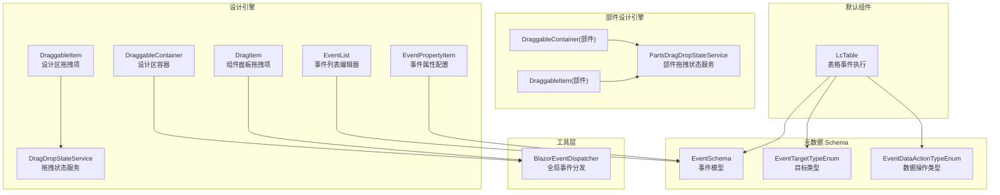
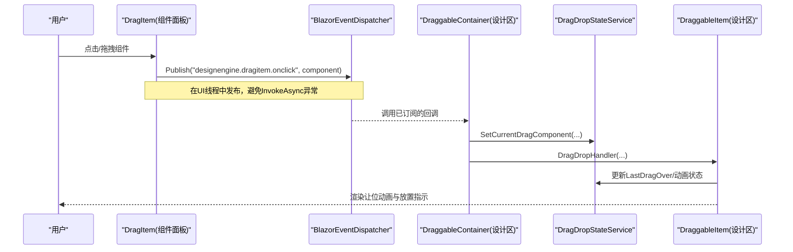
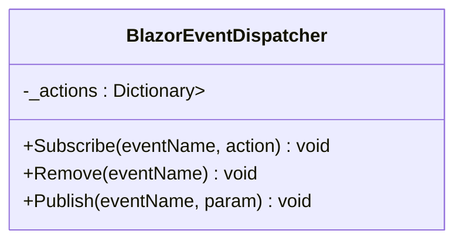
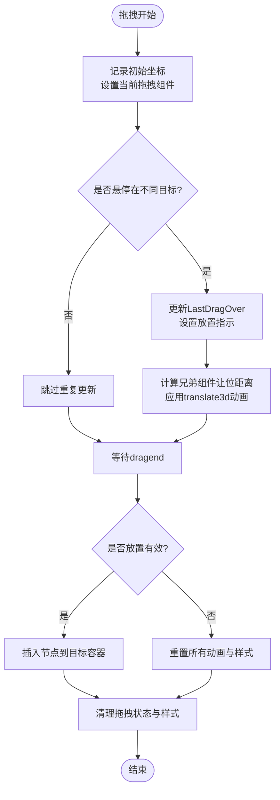
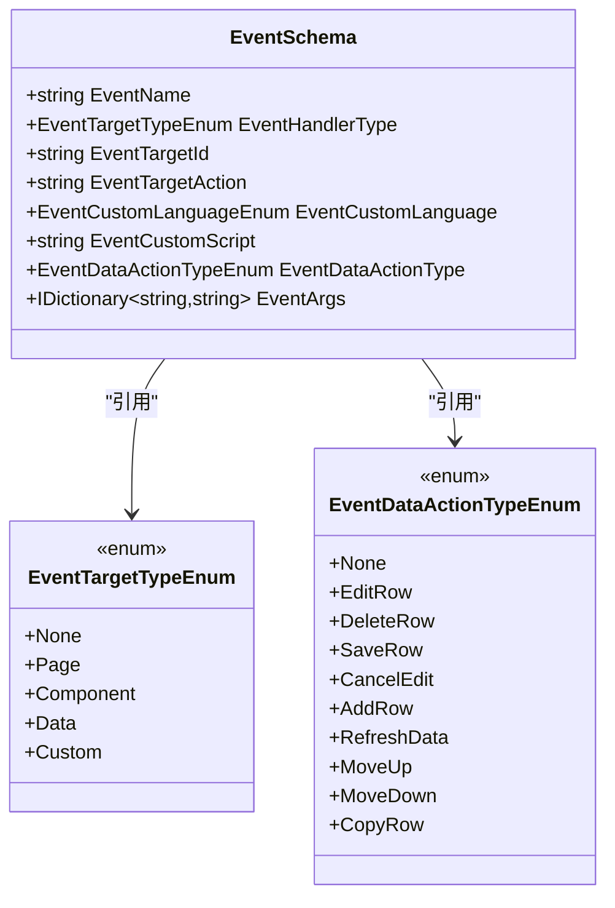
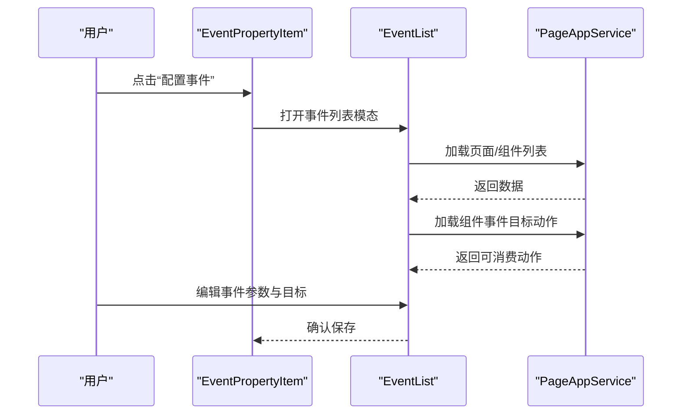
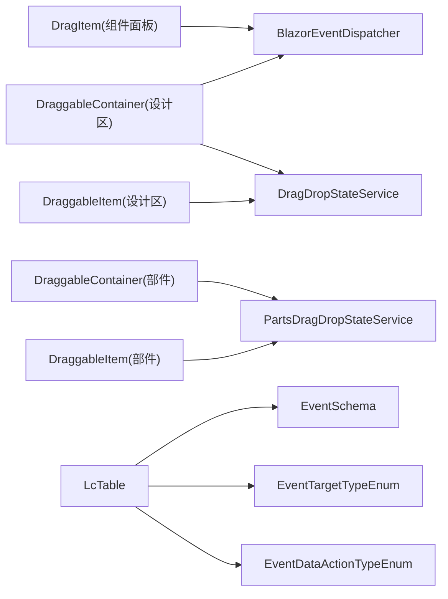

# 事件系统

<cite>
**本文引用的文件**   
- [BlazorEventDispatcher.cs](file://src/Utils/H.Util.Blazor/BlazorEventDispatcher.cs)
- [DragItem.razor](file://src/LowCode/DesignEngine/H.LowCode.DesignEngine/ComponentPanel/DragItem.razor)
- [DraggableContainer.razor（设计引擎）](file://src/LowCode/DesignEngine/H.LowCode.DesignEngine/DraggableComponents/DraggableContainer.razor)
- [DraggableItem.razor（设计引擎）](file://src/LowCode/DesignEngine/H.LowCode.DesignEngine/DraggableComponents/DraggableItem.razor)
- [DragDropStateService.cs（设计引擎）](file://src/LowCode/DesignEngine/H.LowCode.DesignEngine/Services/DragDropStateService.cs)
- [PartsDragDropStateService.cs（部件设计引擎）](file://src/LowCode/DesignEngine/H.LowCode.PartsDesignEngine/Services/PartsDragDropStateService.cs)
- [DraggableContainer.razor（部件设计引擎）](file://src/LowCode/DesignEngine/H.LowCode.PartsDesignEngine/DraggableComponents/DraggableContainer.razor)
- [DraggableItem.razor（部件设计引擎）](file://src/LowCode/DesignEngine/H.LowCode.PartsDesignEngine/DraggableComponents/DraggableItem.razor)
- [EventSchema.cs](file://src/LowCode/Common/H.LowCode.MetaSchema/PropertySchemas/EventSchema.cs)
- [EventTargetTypeEnum.cs](file://src/LowCode/Common/H.LowCode.MetaSchema/Enums/EventTargetTypeEnum.cs)
- [EventDataActionTypeEnum.cs](file://src/LowCode/Common/H.LowCode.MetaSchema/Enums/EventDataActionTypeEnum.cs)
- [LcTable.razor](file://src/LowCode/Common/H.LowCode.Components/Components/LcTable.razor)
- [EventList.razor（事件列表）](file://src/LowCode/DesignEngine/H.LowCode.DesignEngineBase/Components/Events/EventList.razor)
- [EventPropertyItem.razor（设计引擎）](file://src/LowCode/DesignEngine/H.LowCode.DesignEngine/SettingPanel/PropertySettingItems/EventPropertyItem.razor)
- [EventPropertyItem.razor（部件设计引擎）](file://src/LowCode/DesignEngine/H.LowCode.PartsDesignEngine/SettingPanel/PropertySettingItems/EventPropertyItem.razor)
</cite>

## 目录
1. [简介](#简介)
2. [项目结构](#项目结构)
3. [核心组件](#核心组件)
4. [架构总览](#架构总览)
5. [详细组件分析](#详细组件分析)
6. [依赖关系分析](#依赖关系分析)
7. [性能考量](#性能考量)
8. [故障排查指南](#故障排查指南)
9. [结论](#结论)
10. [附录](#附录)

## 简介
本文件为 AppLab 低代码平台的事件系统提供系统化文档，覆盖 Blazor 事件处理机制、自定义事件实现、全局事件分发器 BlazorEventDispatcher 的工作原理与使用方式、低代码引擎中的事件 Schema 定义与运行时处理、以及拖拽事件系统的状态管理与跨组件通信。同时给出复杂交互场景的最佳实践、调试技巧与性能优化建议。

## 项目结构
事件系统主要分布在以下模块：
- 工具层：BlazorEventDispatcher 全局事件分发器
- 设计引擎：组件面板、拖拽项、容器、设置面板与事件配置 UI
- 部件设计引擎：与页面设计引擎类似，但作用于部件库
- 元数据 Schema：事件类型、目标类型、数据操作类型等枚举与模型
- 默认组件：如表格组件的事件执行逻辑

图表来源
- [BlazorEventDispatcher.cs:1-51](file://src/Utils/H.Util.Blazor/BlazorEventDispatcher.cs#L1-L51)
- [DragItem.razor:1-44](file://src/LowCode/DesignEngine/H.LowCode.DesignEngine/ComponentPanel/DragItem.razor#L1-L44)
- [DraggableContainer.razor（设计引擎）:44-88](file://src/LowCode/DesignEngine/H.LowCode.DesignEngine/DraggableComponents/DraggableContainer.razor#L44-L88)
- [DragDropStateService.cs:1-244](file://src/LowCode/DesignEngine/H.LowCode.DesignEngine/Services/DragDropStateService.cs#L1-L244)
- [PartsDragDropStateService.cs:1-246](file://src/LowCode/DesignEngine/H.LowCode.PartsDesignEngine/Services/PartsDragDropStateService.cs#L1-L246)
- [EventSchema.cs:1-54](file://src/LowCode/Common/H.LowCode.MetaSchema/PropertySchemas/EventSchema.cs#L1-L54)
- [EventTargetTypeEnum.cs:1-29](file://src/LowCode/Common/H.LowCode.MetaSchema/Enums/EventTargetTypeEnum.cs#L1-L29)
- [EventDataActionTypeEnum.cs:1-19](file://src/LowCode/Common/H.LowCode.MetaSchema/Enums/EventDataActionTypeEnum.cs#L1-L19)
- [LcTable.razor:243-277](file://src/LowCode/Common/H.LowCode.Components/Components/LcTable.razor#L243-L277)

章节来源
- [BlazorEventDispatcher.cs:1-51](file://src/Utils/H.Util.Blazor/BlazorEventDispatcher.cs#L1-L51)
- [DragItem.razor:1-44](file://src/LowCode/DesignEngine/H.LowCode.DesignEngine/ComponentPanel/DragItem.razor#L1-L44)
- [DraggableContainer.razor（设计引擎）:44-88](file://src/LowCode/DesignEngine/H.LowCode.DesignEngine/DraggableComponents/DraggableContainer.razor#L44-L88)
- [DragDropStateService.cs:1-244](file://src/LowCode/DesignEngine/H.LowCode.DesignEngine/Services/DragDropStateService.cs#L1-L244)
- [PartsDragDropStateService.cs:1-246](file://src/LowCode/DesignEngine/H.LowCode.PartsDesignEngine/Services/PartsDragDropStateService.cs#L1-L246)
- [EventSchema.cs:1-54](file://src/LowCode/Common/H.LowCode.MetaSchema/PropertySchemas/EventSchema.cs#L1-L54)
- [EventTargetTypeEnum.cs:1-29](file://src/LowCode/Common/H.LowCode.MetaSchema/Enums/EventTargetTypeEnum.cs#L1-L29)
- [EventDataActionTypeEnum.cs:1-19](file://src/LowCode/Common/H.LowCode.MetaSchema/Enums/EventDataActionTypeEnum.cs#L1-L19)
- [LcTable.razor:243-277](file://src/LowCode/Common/H.LowCode.Components/Components/LcTable.razor#L243-L277)

## 核心组件
- BlazorEventDispatcher：静态全局事件总线，支持按字符串键订阅、发布与移除；用于跨组件解耦通信。
- 拖拽状态服务：DragDropStateService 与 PartsDragDropStateService，维护当前拖拽对象、最后悬停对象、根组件、选择状态等，并提供样式重置方法。
- 事件 Schema：EventSchema 描述事件名称、目标类型、目标动作、自定义脚本语言与内容、数据操作类型及参数字典。
- 默认组件事件执行：LcTable 根据 EventSchema 的处理器类型执行页面跳转、弹窗、当前页刷新或自定义脚本、数据操作等。

章节来源
- [BlazorEventDispatcher.cs:1-51](file://src/Utils/H.Util.Blazor/BlazorEventDispatcher.cs#L1-L51)
- [DragDropStateService.cs:1-244](file://src/LowCode/DesignEngine/H.LowCode.DesignEngine/Services/DragDropStateService.cs#L1-L244)
- [PartsDragDropStateService.cs:1-246](file://src/LowCode/DesignEngine/H.LowCode.PartsDesignEngine/Services/PartsDragDropStateService.cs#L1-L246)
- [EventSchema.cs:1-54](file://src/LowCode/Common/H.LowCode.MetaSchema/PropertySchemas/EventSchema.cs#L1-L54)
- [LcTable.razor:243-277](file://src/LowCode/Common/H.LowCode.Components/Components/LcTable.razor#L243-L277)

## 架构总览
下图展示从用户交互到事件分发的关键路径：组件面板点击触发全局事件，设计区容器订阅并处理，拖拽过程中通过状态服务协调兄弟组件动画与放置指示。

图表来源
- [DragItem.razor:1-44](file://src/LowCode/DesignEngine/H.LowCode.DesignEngine/ComponentPanel/DragItem.razor#L1-L44)
- [BlazorEventDispatcher.cs:1-51](file://src/Utils/H.Util.Blazor/BlazorEventDispatcher.cs#L1-L51)
- [DraggableContainer.razor（设计引擎）:44-88](file://src/LowCode/DesignEngine/H.LowCode.DesignEngine/DraggableComponents/DraggableContainer.razor#L44-L88)
- [DragDropStateService.cs:1-244](file://src/LowCode/DesignEngine/H.LowCode.DesignEngine/Services/DragDropStateService.cs#L1-L244)
- [DraggableItem.razor（设计引擎）:172-382](file://src/LowCode/DesignEngine/H.LowCode.DesignEngine/DraggableComponents/DraggableItem.razor#L172-L382)

## 详细组件分析

### BlazorEventDispatcher 全局事件分发器
- 功能要点
  - 以字符串键管理 Action<object?> 委托集合，支持多订阅者。
  - Subscribe 追加委托；Remove 移除整个事件键；Publish 查找并调用委托链。
  - 未找到事件键时抛出异常，便于快速定位问题。
- 使用建议
  - 事件名采用小写命名规范，建议格式：{组件库}.{组件}.{事件}，例如 designengine.dragitem.onclick。
  - 在组件生命周期中订阅与移除，避免内存泄漏。
  - 在非 UI 线程发布时，应在组件内使用 InvokeAsync 确保后续 Blazor 更新在正确上下文执行。

图表来源
- [BlazorEventDispatcher.cs:1-51](file://src/Utils/H.Util.Blazor/BlazorEventDispatcher.cs#L1-L51)

章节来源
- [BlazorEventDispatcher.cs:1-51](file://src/Utils/H.Util.Blazor/BlazorEventDispatcher.cs#L1-L51)

### 拖拽事件系统与状态管理
- 组件面板 DragItem
  - 点击时通过 BlazorEventDispatcher.Publish 将组件实例发送到全局事件通道。
  - 拖拽开始时记录初始坐标并设置当前拖拽组件到状态服务。
- 设计区 DraggableContainer
  - 在首次渲染后订阅全局事件，收到组件后调用 DragDropHandler 插入到容器节点树。
- 设计区 DraggableItem
  - 处理 dragstart/dragenter/dragover/drag/dragend 等原生事件，更新 LastDragOver、计算让位动画、清理样式与状态。
  - 使用 translate3d 与 GPU 加速优化动画性能。
- 状态服务 DragDropStateService / PartsDragDropStateService
  - 维护 RootComponent、CurrentDragComponent、LastDragOverComponent、LastDropComponent、LastSelectedComponent 等。
  - 提供 ResetDragStyle 统一清理动画与选中态。

图表来源
- [DraggableItem.razor（设计引擎）:172-382](file://src/LowCode/DesignEngine/H.LowCode.DesignEngine/DraggableComponents/DraggableItem.razor#L172-L382)
- [DragDropStateService.cs:1-244](file://src/LowCode/DesignEngine/H.LowCode.DesignEngine/Services/DragDropStateService.cs#L1-L244)
- [PartsDragDropStateService.cs:1-246](file://src/LowCode/DesignEngine/H.LowCode.PartsDesignEngine/Services/PartsDragDropStateService.cs#L1-L246)

章节来源
- [DragItem.razor:1-44](file://src/LowCode/DesignEngine/H.LowCode.DesignEngine/ComponentPanel/DragItem.razor#L1-L44)
- [DraggableContainer.razor（设计引擎）:44-88](file://src/LowCode/DesignEngine/H.LowCode.DesignEngine/DraggableComponents/DraggableContainer.razor#L44-L88)
- [DraggableItem.razor（设计引擎）:172-382](file://src/LowCode/DesignEngine/H.LowCode.DesignEngine/DraggableComponents/DraggableItem.razor#L172-L382)
- [DragDropStateService.cs:1-244](file://src/LowCode/DesignEngine/H.LowCode.DesignEngine/Services/DragDropStateService.cs#L1-L244)
- [PartsDragDropStateService.cs:1-246](file://src/LowCode/DesignEngine/H.LowCode.PartsDesignEngine/Services/PartsDragDropStateService.cs#L1-L246)

### 低代码事件 Schema 与运行时处理
- EventSchema 字段说明
  - EventName：事件名称
  - EventHandlerType：目标类型（页面、组件、数据、自定义）
  - EventTargetId/EventTargetAction：目标标识与动作
  - EventCustomLanguage/EventCustomScript：自定义脚本语言与内容
  - EventDataActionType：数据操作类型（编辑行、删除行、保存行、取消编辑、添加行、刷新数据、上移、下移、复制行）
  - EventArgs：事件参数字典
- 运行时执行（以 LcTable 为例）
  - 若为目标类型为页面：根据处理器类型执行刷新、弹窗、当前页或空白页跳转。
  - 若为目标类型为自定义：通过 JS.InvokeVoidAsync 执行脚本。
  - 若为目标类型为数据：根据数据操作类型调用相应处理方法。

图表来源
- [EventSchema.cs:1-54](file://src/LowCode/Common/H.LowCode.MetaSchema/PropertySchemas/EventSchema.cs#L1-L54)
- [EventTargetTypeEnum.cs:1-29](file://src/LowCode/Common/H.LowCode.MetaSchema/Enums/EventTargetTypeEnum.cs#L1-L29)
- [EventDataActionTypeEnum.cs:1-19](file://src/LowCode/Common/H.LowCode.MetaSchema/Enums/EventDataActionTypeEnum.cs#L1-L19)

章节来源
- [EventSchema.cs:1-54](file://src/LowCode/Common/H.LowCode.MetaSchema/PropertySchemas/EventSchema.cs#L1-L54)
- [EventTargetTypeEnum.cs:1-29](file://src/LowCode/Common/H.LowCode.MetaSchema/Enums/EventTargetTypeEnum.cs#L1-L29)
- [EventDataActionTypeEnum.cs:1-19](file://src/LowCode/Common/H.LowCode.MetaSchema/Enums/EventDataActionTypeEnum.cs#L1-L19)
- [LcTable.razor:243-277](file://src/LowCode/Common/H.LowCode.Components/Components/LcTable.razor#L243-L277)

### 事件配置与订阅模式
- 事件属性配置 UI
  - 设计引擎与部件设计引擎均提供“配置事件”按钮，打开模态框显示事件列表。
  - 自动合并组件支持的事件与已配置事件，去重后展示。
- 事件列表编辑器
  - 加载页面与组件列表，动态加载组件可消费的事件目标动作。
  - 支持添加事件参数映射，将行数据字段映射为 URL 参数或事件参数。

图表来源
- [EventPropertyItem.razor（设计引擎）:1-40](file://src/LowCode/DesignEngine/H.LowCode.DesignEngine/SettingPanel/PropertySettingItems/EventPropertyItem.razor#L1-L40)
- [EventPropertyItem.razor（部件设计引擎）:1-40](file://src/LowCode/DesignEngine/H.LowCode.PartsDesignEngine/SettingPanel/PropertySettingItems/EventPropertyItem.razor#L1-L40)
- [EventList.razor（事件列表）:168-209](file://src/LowCode/DesignEngine/H.LowCode.DesignEngineBase/Components/Events/EventList.razor#L168-L209)

章节来源
- [EventPropertyItem.razor（设计引擎）:1-40](file://src/LowCode/DesignEngine/H.LowCode.DesignEngine/SettingPanel/PropertySettingItems/EventPropertyItem.razor#L1-L40)
- [EventPropertyItem.razor（部件设计引擎）:1-40](file://src/LowCode/DesignEngine/H.LowCode.PartsDesignEngine/SettingPanel/PropertySettingItems/EventPropertyItem.razor#L1-L40)
- [EventList.razor（事件列表）:168-209](file://src/LowCode/DesignEngine/H.LowCode.DesignEngineBase/Components/Events/EventList.razor#L168-L209)

## 依赖关系分析
- 组件面板 DragItem 依赖 BlazorEventDispatcher 进行跨组件通信。
- 设计区容器 DraggableContainer 订阅全局事件并调用状态服务。
- 设计区拖拽项 DraggableItem 依赖 DragDropStateService 维护拖拽状态与动画。
- 部件设计引擎对应组件依赖 PartsDragDropStateService。
- 默认组件 LcTable 依赖 EventSchema 与相关枚举执行事件逻辑。

图表来源
- [DragItem.razor:1-44](file://src/LowCode/DesignEngine/H.LowCode.DesignEngine/ComponentPanel/DragItem.razor#L1-L44)
- [BlazorEventDispatcher.cs:1-51](file://src/Utils/H.Util.Blazor/BlazorEventDispatcher.cs#L1-L51)
- [DraggableContainer.razor（设计引擎）:44-88](file://src/LowCode/DesignEngine/H.LowCode.DesignEngine/DraggableComponents/DraggableContainer.razor#L44-L88)
- [DragDropStateService.cs:1-244](file://src/LowCode/DesignEngine/H.LowCode.DesignEngine/Services/DragDropStateService.cs#L1-L244)
- [PartsDragDropStateService.cs:1-246](file://src/LowCode/DesignEngine/H.LowCode.PartsDesignEngine/Services/PartsDragDropStateService.cs#L1-L246)
- [LcTable.razor:243-277](file://src/LowCode/Common/H.LowCode.Components/Components/LcTable.razor#L243-L277)

章节来源
- [DragItem.razor:1-44](file://src/LowCode/DesignEngine/H.LowCode.DesignEngine/ComponentPanel/DragItem.razor#L1-L44)
- [BlazorEventDispatcher.cs:1-51](file://src/Utils/H.Util.Blazor/BlazorEventDispatcher.cs#L1-L51)
- [DraggableContainer.razor（设计引擎）:44-88](file://src/LowCode/DesignEngine/H.LowCode.DesignEngine/DraggableComponents/DraggableContainer.razor#L44-L88)
- [DragDropStateService.cs:1-244](file://src/LowCode/DesignEngine/H.LowCode.DesignEngine/Services/DragDropStateService.cs#L1-L244)
- [PartsDragDropStateService.cs:1-246](file://src/LowCode/DesignEngine/H.LowCode.PartsDesignEngine/Services/PartsDragDropStateService.cs#L1-L246)
- [LcTable.razor:243-277](file://src/LowCode/Common/H.LowCode.Components/Components/LcTable.razor#L243-L277)

## 性能考量
- 拖拽动画优化
  - 使用 translate3d 与 GPU 加速减少重排与重绘。
  - 仅在偏移量变化超过阈值时更新状态，降低不必要的渲染。
- 事件发布时机
  - 在组件渲染线程中使用 InvokeAsync 发布事件，避免跨线程调用导致的异常。
- 状态重置
  - 统一通过 ResetDragStyle 清理动画与选中态，避免残留样式影响用户体验。
- 订阅与释放
  - 在组件销毁时移除订阅，防止内存泄漏与意外回调。

[本节为通用指导，不直接分析具体文件]

## 故障排查指南
- 常见问题
  - 事件名不存在：Publish 时会抛出异常，检查事件名是否正确且已订阅。
  - 非 UI 线程调用：在组件外发布事件后需使用 InvokeAsync 确保 Blazor 更新在 UI 线程执行。
  - 拖拽中断：避免在 dragstart 阶段修改源节点样式，延迟至首个 drag 事件再置位 isDragging。
  - 动画闪烁：拖拽开始前清理兄弟组件残留动画，避免初始闪烁。
- 调试技巧
  - 在关键事件处理处输出日志（如 OnDragStart、OnDragOver、OnDrop）。
  - 使用浏览器开发者工具观察 DOM 变换与样式变化。
  - 检查状态服务中的 CurrentDragComponent、LastDragOverComponent 是否符合预期。

章节来源
- [BlazorEventDispatcher.cs:1-51](file://src/Utils/H.Util.Blazor/BlazorEventDispatcher.cs#L1-L51)
- [DraggableItem.razor（设计引擎）:172-382](file://src/LowCode/DesignEngine/H.LowCode.DesignEngine/DraggableComponents/DraggableItem.razor#L172-L382)
- [DragDropStateService.cs:1-244](file://src/LowCode/DesignEngine/H.LowCode.DesignEngine/Services/DragDropStateService.cs#L1-L244)

## 结论
AppLab 的事件系统通过 BlazorEventDispatcher 实现了跨组件解耦的全局事件分发，结合拖拽状态服务与事件 Schema，形成了完整的设计期交互与运行时事件执行体系。遵循本文档的模式与实践，可在复杂低代码场景中构建稳定、高性能且易维护的事件处理方案。

[本节为总结性内容，不直接分析具体文件]

## 附录
- 最佳实践
  - 事件命名规范：小写、分层清晰，便于检索与维护。
  - 异步处理：优先使用异步方法与 await，避免阻塞 UI。
  - 错误边界：对异常进行捕获与友好提示，保障用户体验。
  - 资源释放：在组件销毁时及时移除订阅与清理状态。

[本节为通用指导，不直接分析具体文件]