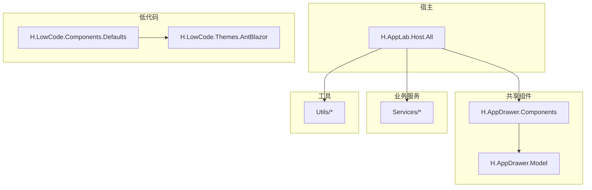
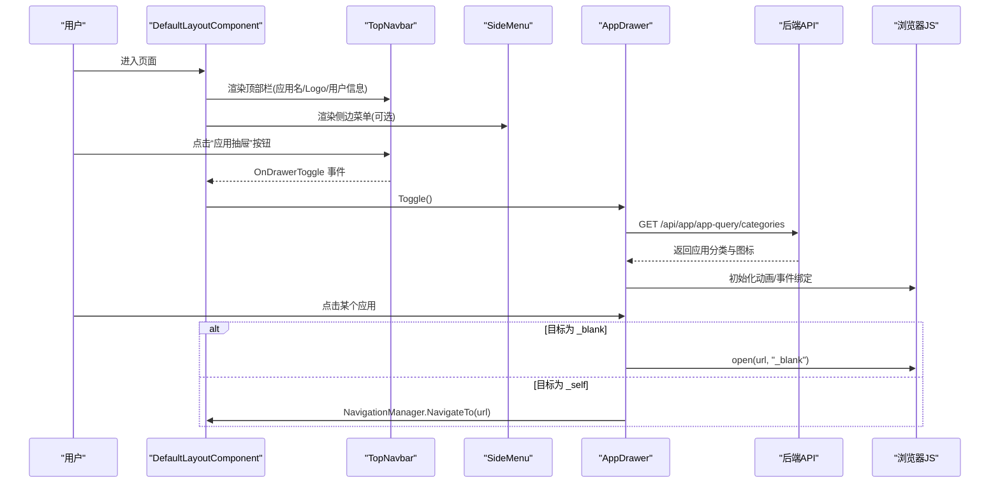
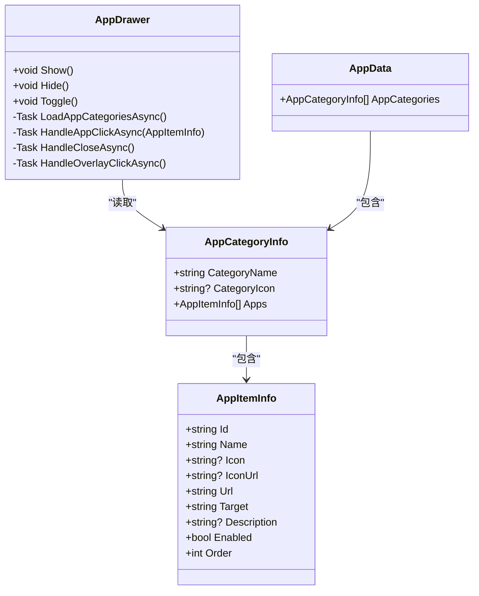
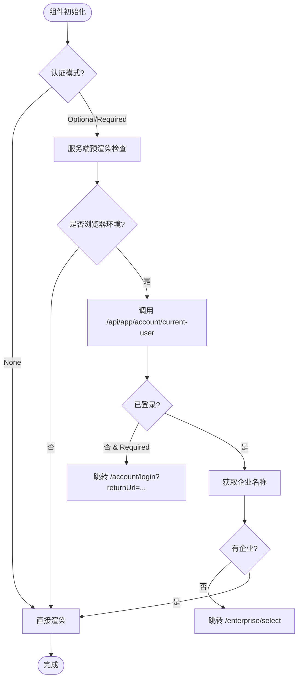
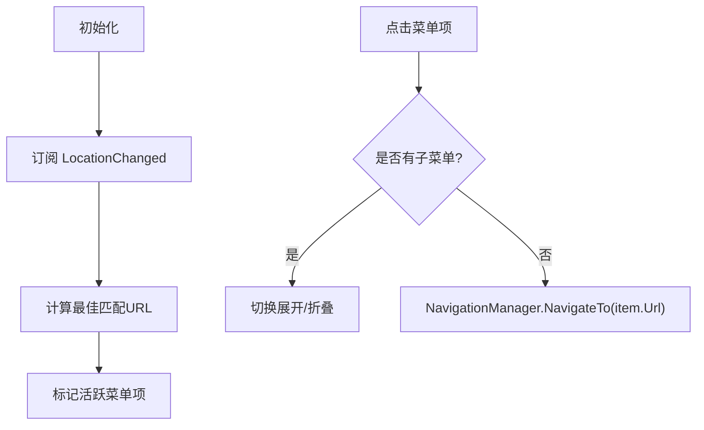
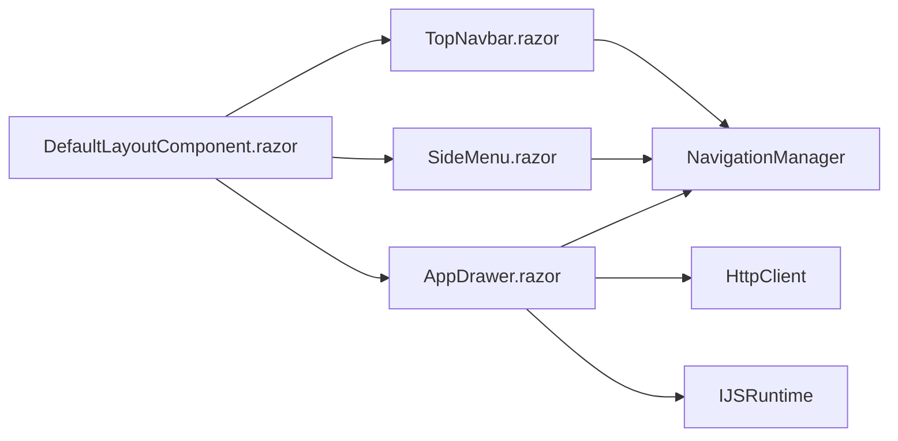

# 前端架构

<cite>
**本文引用的文件**   
- [README.md](file://README.md)
- [AppDrawer.razor](file://src/Components/AppDrawer/H.AppDrawer.Components/Components/AppDrawer.razor)
- [DefaultLayoutComponent.razor](file://src/Components/AppDrawer/H.AppDrawer.Components/Components/DefaultLayoutComponent.razor)
- [SideMenu.razor](file://src/Components/AppDrawer/H.AppDrawer.Components/Components/SideMenu.razor)
- [TopNavbar.razor](file://src/Components/AppDrawer/H.AppDrawer.Components/Components/TopNavbar.razor)
- [AppDrawer.css](file://src/Components/AppDrawer/H.AppDrawer.Components/wwwroot/css/AppDrawer.css)
- [AppData.cs](file://src/Components/AppDrawer/H.AppDrawer.Model/AppData.cs)
- [AppDrawerModels.cs](file://src/Components/AppDrawer/H.AppDrawer.Model/AppDrawerModels.cs)
- [AppMenuItem.cs](file://src/Components/AppDrawer/H.AppDrawer.Model/AppMenuItem.cs)
- [AuthenticationMode.cs](file://src/Components/AppDrawer/H.AppDrawer.Model/AuthenticationMode.cs)
- [MenuPosition.cs](file://src/Components/AppDrawer/H.AppDrawer.Model/MenuPosition.cs)
- [_Imports.razor](file://src/LowCode/Common/H.LowCode.Components.Defaults/_Imports.razor)
</cite>

## 目录
1. [简介](#简介)
2. [项目结构](#项目结构)
3. [核心组件](#核心组件)
4. [架构总览](#架构总览)
5. [详细组件分析](#详细组件分析)
6. [依赖关系分析](#依赖关系分析)
7. [性能考虑](#性能考虑)
8. [故障排查指南](#故障排查指南)
9. [结论](#结论)
10. [附录](#附录)

## 简介
本文件面向 AppLab 前端架构，聚焦基于 Blazor 的技术栈与组件化设计。文档重点阐述应用抽屉（AppDrawer）组件的布局与交互、默认组件库的使用方式、主题系统与样式覆盖机制，以及路由导航、状态管理、事件处理等前端核心能力，并提供响应式设计与可访问性实践建议。

## 项目结构
- Host：宿主程序，仅做服务注册与启动，支持单体与按服务独立部署；采用 Blazor Web App（Server + WebAssembly Client）。
- Components：共享 UI 组件，其中 AppDrawer 提供统一顶部导航、侧边菜单与应用抽屉面板，供各应用复用。
- LowCode：低代码核心，包含元数据 Schema、组件基类、默认组件库、渲染引擎与主题（Ant Design Blazor）。
- Services：企业级基础服务，按限界上下文划分，遵循 Application.Contracts / Application / EntityFrameworkCore / Web 分层。
- System：系统级应用（Enterprise、SystemPortal），面向平台运营侧。
- Tools：数据库迁移工具。
- Utils：通用工具库（ABP 契约、HttpClient 动态代理、Blazor 工具、ID 生成等）。

**图表来源** 
- [README.md:1-74](file://README.md#L1-L74)

**章节来源**
- [README.md:1-74](file://README.md#L1-L74)

## 核心组件
- 应用抽屉（AppDrawer）：以侧滑面板形式展示“应用分类-应用项”列表，支持点击打开新标签页或当前页跳转，并集成“系统后台”快捷入口。
- 默认布局（DefaultLayoutComponent）：组合 TopNavbar、SideMenu/TopMenu、内容区与 AppDrawer，统一页面骨架与认证流程。
- 顶部导航（TopNavbar）：应用名、Logo、用户头像与下拉菜单、登录按钮、组织切换入口。
- 侧边菜单（SideMenu）：递归渲染多级菜单，自动高亮当前路由，支持展开/折叠。

**章节来源**
- [AppDrawer.razor:1-252](file://src/Components/AppDrawer/H.AppDrawer.Components/Components/AppDrawer.razor#L1-L252)
- [DefaultLayoutComponent.razor:1-270](file://src/Components/AppDrawer/H.AppDrawer.Components/Components/DefaultLayoutComponent.razor#L1-L270)
- [TopNavbar.razor:1-203](file://src/Components/AppDrawer/H.AppDrawer.Components/Components/TopNavbar.razor#L1-L203)
- [SideMenu.razor:1-172](file://src/Components/AppDrawer/H.AppDrawer.Components/Components/SideMenu.razor#L1-L172)

## 架构总览
AppDrawer 作为共享布局与导航组件，被 DefaultLayoutComponent 组合使用；TopNavbar 与 SideMenu 分别负责顶部与左侧导航；AppDrawer 通过 HTTP 调用后端接口获取应用分类与图标信息，结合 JS 实现打开新标签页与动画效果。整体遵循 Blazor 组件化与参数驱动渲染模式。

**图表来源** 
- [DefaultLayoutComponent.razor:1-270](file://src/Components/AppDrawer/H.AppDrawer.Components/Components/DefaultLayoutComponent.razor#L1-L270)
- [TopNavbar.razor:1-203](file://src/Components/AppDrawer/H.AppDrawer.Components/Components/TopNavbar.razor#L1-L203)
- [SideMenu.razor:1-172](file://src/Components/AppDrawer/H.AppDrawer.Components/Components/SideMenu.razor#L1-L172)
- [AppDrawer.razor:1-252](file://src/Components/AppDrawer/H.AppDrawer.Components/Components/AppDrawer.razor#L1-L252)

## 详细组件分析

### 应用抽屉（AppDrawer）
- 功能要点
  - 显示/隐藏：Show()/Hide()/Toggle() 控制可见性。
  - 数据加载：OnInitializedAsync 中调用 /api/app/app-query/categories 获取分类与应用列表。
  - 交互行为：点击遮罩关闭、点击应用根据 Target 决定在新标签页或当前页打开。
  - JS 集成：通过 DotNetObjectReference 暴露 HandleClose/HandleOverlayClick/HandleAppClickById 给 JS 调用。
- 数据结构
  - AppCategoryInfo：分类名称、图标、应用列表。
  - AppItemInfo：应用 Id、名称、图标/图标URL、Url、Target、描述、Enabled、Order。
  - AppData：用于 JSON 反序列化的根对象（包含 AppCategories）。
- 样式与响应式
  - CSS 定义抽屉容器、遮罩、头部、内容区、滚动条、空状态、移动端适配等。

**图表来源** 
- [AppDrawerModels.cs:1-74](file://src/Components/AppDrawer/H.AppDrawer.Model/AppDrawerModels.cs#L1-L74)
- [AppData.cs:1-10](file://src/Components/AppDrawer/H.AppDrawer.Model/AppData.cs#L1-L10)
- [AppDrawer.razor:1-252](file://src/Components/AppDrawer/H.AppDrawer.Components/Components/AppDrawer.razor#L1-L252)

**章节来源**
- [AppDrawer.razor:1-252](file://src/Components/AppDrawer/H.AppDrawer.Components/Components/AppDrawer.razor#L1-L252)
- [AppDrawerModels.cs:1-74](file://src/Components/AppDrawer/H.AppDrawer.Model/AppDrawerModels.cs#L1-L74)
- [AppData.cs:1-10](file://src/Components/AppDrawer/H.AppDrawer.Model/AppData.cs#L1-L10)
- [AppDrawer.css:1-233](file://src/Components/AppDrawer/H.AppDrawer.Components/wwwroot/css/AppDrawer.css#L1-L233)

### 默认布局（DefaultLayoutComponent）
- 功能要点
  - 组合 TopNavbar、SideMenu/TopMenu、内容区与 AppDrawer。
  - 认证流程：服务端预渲染通过 HttpContext 快速判断；WASM 环境通过 /api/app/account/current-user 校验 Cookie 并解析用户名与企业信息；未登录强制跳转登录页；无企业时重定向到企业选择页。
  - 退出登录：跳转到 /account/logout。
- 参数配置
  - AppName、Logo、MenuItems、MenuPosition、LoginUrl、AuthMode、ChildContent。

**图表来源** 
- [DefaultLayoutComponent.razor:1-270](file://src/Components/AppDrawer/H.AppDrawer.Components/Components/DefaultLayoutComponent.razor#L1-L270)

**章节来源**
- [DefaultLayoutComponent.razor:1-270](file://src/Components/AppDrawer/H.AppDrawer.Components/Components/DefaultLayoutComponent.razor#L1-L270)

### 顶部导航（TopNavbar）
- 功能要点
  - 应用名、Logo、中间插槽（通常放置 TopMenu）。
  - 用户头像与下拉菜单：个人设置、退出登录、组织切换。
  - 未登录显示登录按钮，携带 returnUrl。
- 事件与参数
  - OnDrawerToggle：触发抽屉开关。
  - UserName、IsLoggedIn、LoginUrl、ProfileUrl、EnterpriseName、OnLogout。

**章节来源**
- [TopNavbar.razor:1-203](file://src/Components/AppDrawer/H.AppDrawer.Components/Components/TopNavbar.razor#L1-L203)

### 侧边菜单（SideMenu）
- 功能要点
  - 递归渲染多级菜单项，支持展开/折叠。
  - 基于 NavigationManager.LocationChanged 监听路由变化，计算最佳匹配 URL 并高亮当前菜单。
  - 点击子菜单项进行路由跳转。
- 数据结构
  - AppMenuItem：Name、Url、Icon、Key、Children。

**图表来源** 
- [SideMenu.razor:1-172](file://src/Components/AppDrawer/H.AppDrawer.Components/Components/SideMenu.razor#L1-L172)

**章节来源**
- [SideMenu.razor:1-172](file://src/Components/AppDrawer/H.AppDrawer.Components/Components/SideMenu.razor#L1-L172)
- [AppMenuItem.cs:1-22](file://src/Components/AppDrawer/H.AppDrawer.Model/AppMenuItem.cs#L1-L22)

### 主题系统与样式覆盖
- 默认组件库
  - H.LowCode.Components.Defaults 提供基础组件集合，_Imports.razor 集中引入常用命名空间与公共类型。
- 主题
  - 渲染引擎主题基于 Ant Design Blazor（H.LowCode.Themes.AntBlazor），可通过自定义 CSS 变量与覆盖类名实现主题定制。
- 样式覆盖机制
  - AppDrawer.css 定义了抽屉相关样式，可通过在宿主项目中引入同名样式或使用更高优先级的选择器进行覆盖。
  - 利用 CSS 变量（如 --h-bg-page、--h-primary 等）统一色彩与间距，便于全局主题切换。

**章节来源**
- [_Imports.razor:1-10](file://src/LowCode/Common/H.LowCode.Components.Defaults/_Imports.razor#L1-L10)
- [AppDrawer.css:1-233](file://src/Components/AppDrawer/H.AppDrawer.Components/wwwroot/css/AppDrawer.css#L1-L233)

## 依赖关系分析
- 组件内依赖
  - AppDrawer 依赖 HttpClient、NavigationManager、IJSRuntime。
  - DefaultLayoutComponent 依赖 NavigationManager、IServiceProvider、HttpClient，并通过组合引用 TopNavbar、SideMenu、AppDrawer。
  - TopNavbar 依赖 NavigationManager。
  - SideMenu 依赖 NavigationManager 并订阅 LocationChanged。
- 外部依赖
  - ABP 约定路由：/api/{service}/{method-simplified}。
  - JS 桥接：DotNetObjectReference 暴露 C# 方法给 JS 调用。
  - 主题与样式：CSS 变量与 Ant Design Blazor 主题体系。

**图表来源** 
- [AppDrawer.razor:1-252](file://src/Components/AppDrawer/H.AppDrawer.Components/Components/AppDrawer.razor#L1-L252)
- [DefaultLayoutComponent.razor:1-270](file://src/Components/AppDrawer/H.AppDrawer.Components/Components/DefaultLayoutComponent.razor#L1-L270)
- [TopNavbar.razor:1-203](file://src/Components/AppDrawer/H.AppDrawer.Components/Components/TopNavbar.razor#L1-L203)
- [SideMenu.razor:1-172](file://src/Components/AppDrawer/H.AppDrawer.Components/Components/SideMenu.razor#L1-L172)

**章节来源**
- [AppDrawer.razor:1-252](file://src/Components/AppDrawer/H.AppDrawer.Components/Components/AppDrawer.razor#L1-L252)
- [DefaultLayoutComponent.razor:1-270](file://src/Components/AppDrawer/H.AppDrawer.Components/Components/DefaultLayoutComponent.razor#L1-L270)
- [TopNavbar.razor:1-203](file://src/Components/AppDrawer/H.AppDrawer.Components/Components/TopNavbar.razor#L1-L203)
- [SideMenu.razor:1-172](file://src/Components/AppDrawer/H.AppDrawer.Components/Components/SideMenu.razor#L1-L172)

## 性能考虑
- 懒加载与 AOT
  - 首页仅加载必要程序集，其余模块按需下载；Release 模式启用 AOT 与裁剪以减少体积。
- 渲染优化
  - 首次渲染后异步检查认证状态，避免阻塞首屏。
  - 菜单高亮计算缓存最佳匹配 URL，减少重复计算。
- 网络请求
  - 应用分类数据仅在抽屉显示时加载，降低初始负载。

[本节为通用指导，不直接分析具体文件]

## 故障排查指南
- 抽屉无法显示
  - 确认 Visible 状态与 StateHasChanged 调用；检查 OnAfterRenderAsync 中 JS 初始化是否成功。
- 应用点击无效
  - 检查 app.Url 是否为空；Target 是否正确；JS open 调用是否被拦截。
- 认证失败或循环跳转
  - 确认 /api/app/account/current-user 返回格式兼容最小格式或 ABP UserDto；检查 returnUrl 编码。
- 菜单高亮异常
  - 检查 NormalizePath 与 IsMatch 逻辑；确保路由路径规范（去除查询参数与前导斜杠）。

**章节来源**
- [AppDrawer.razor:1-252](file://src/Components/AppDrawer/H.AppDrawer.Components/Components/AppDrawer.razor#L1-L252)
- [DefaultLayoutComponent.razor:1-270](file://src/Components/AppDrawer/H.AppDrawer.Components/Components/DefaultLayoutComponent.razor#L1-L270)
- [SideMenu.razor:1-172](file://src/Components/AppDrawer/H.AppDrawer.Components/Components/SideMenu.razor#L1-L172)

## 结论
AppDrawer 组件为 AppLab 提供了统一的导航与布局能力，结合 DefaultLayoutComponent 实现了认证、组织切换与内容区布局的一体化方案。通过模块化与参数化设计，各宿主只需注入菜单与应用数据即可获得一致的体验。配合低代码默认组件库与 Ant Design Blazor 主题，可实现灵活的样式定制与主题切换。

[本节为总结，不直接分析具体文件]

## 附录
- 认证模式
  - AuthenticationMode：None（不检测）、Optional（允许匿名）、Required（强制登录）。
- 菜单位置
  - MenuPosition：Left（左侧）、Top（顶部）。

**章节来源**
- [AuthenticationMode.cs:1-23](file://src/Components/AppDrawer/H.AppDrawer.Model/AuthenticationMode.cs#L1-L23)
- [MenuPosition.cs:1-18](file://src/Components/AppDrawer/H.AppDrawer.Model/MenuPosition.cs#L1-L18)