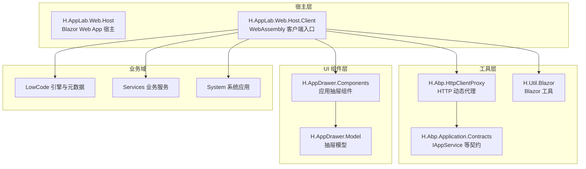
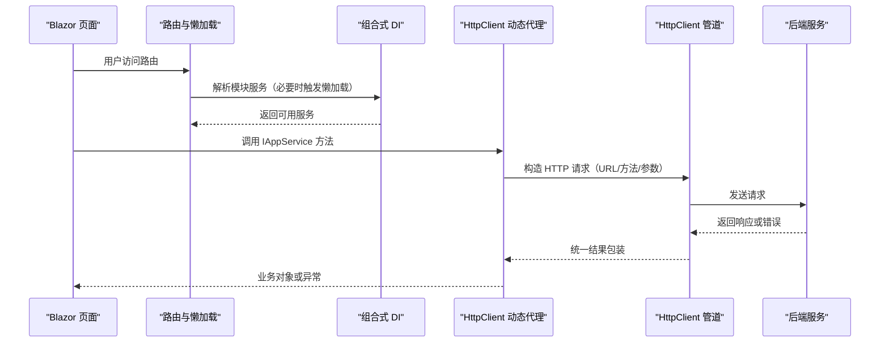
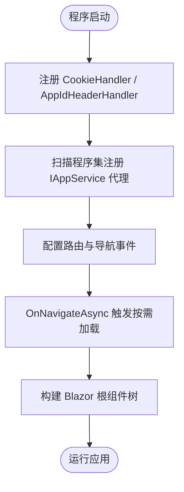
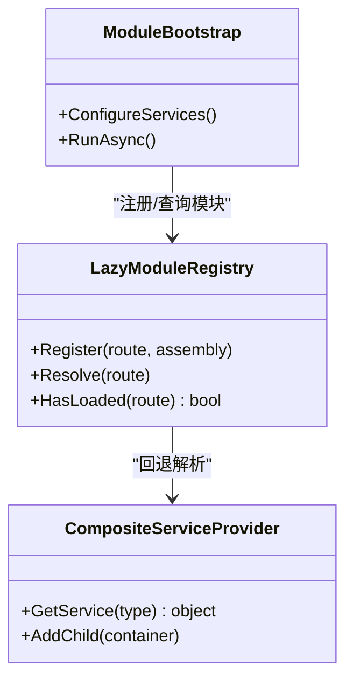
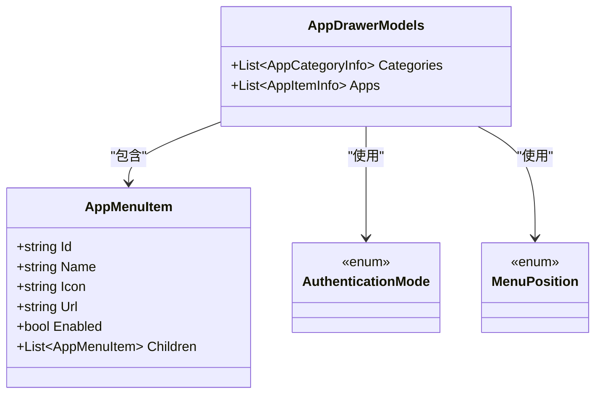
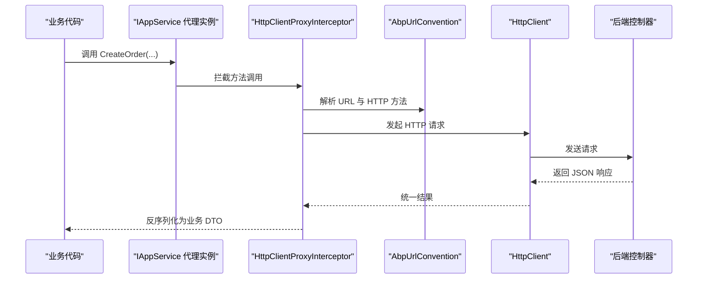
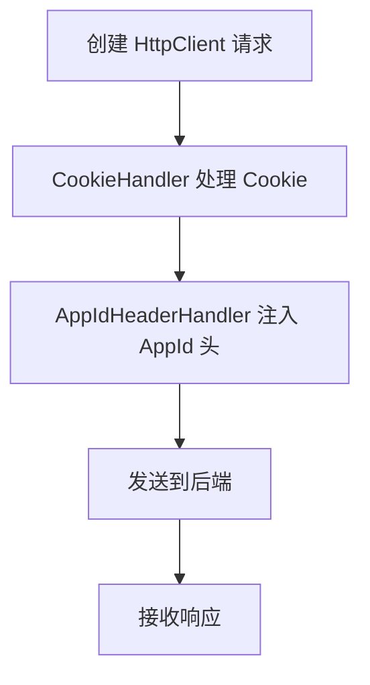
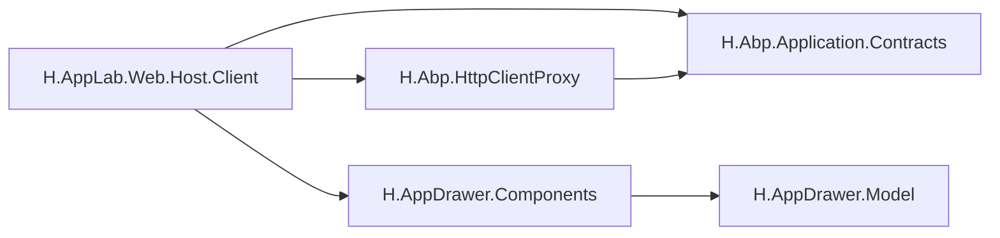

# 前端架构

<cite>
**本文引用的文件**   
- [README.md](file://README.md)
- [Program.cs](file://src/Host/H.AppLab.Web.Host/H.AppLab.Web.Host.Client/Program.cs)
- [LazyModuleServices.cs](file://src/Host/H.AppLab.Web.Host/H.AppLab.Web.Host.Client/LazyModuleServices.cs)
- [CookieHandler.cs](file://src/Host/H.AppLab.Web.Host/H.AppLab.Web.Host.Client/CookieHandler.cs)
- [AppIdHeaderHandler.cs](file://src/Host/H.AppLab.Web.Host/H.AppLab.Web.Host.Client/AppIdHeaderHandler.cs)
- [AbpUrlConvention.cs](file://src/Utils/H.Abp.HttpClientProxy/AbpUrlConvention.cs)
- [HttpClientProxyInterceptor.cs](file://src/Utils/H.Abp.HttpClientProxy/HttpClientProxyInterceptor.cs)
- [RemoteServiceOptions.cs](file://src/Utils/H.Abp.HttpClientProxy/RemoteServiceOptions.cs)
- [ServiceCollectionExtensions.cs](file://src/Utils/H.Abp.HttpClientProxy/ServiceCollectionExtensions.cs)
- [IAppService.cs](file://src/Utils/H.Abp.Application.Contracts/IAppService.cs)
- [H.AppDrawer.Components.csproj](file://src/Components/AppDrawer/H.AppDrawer.Components/H.AppDrawer.Components.csproj)
- [AppMenuItem.cs](file://src/Components/AppDrawer/H.AppDrawer.Model/AppMenuItem.cs)
- [AppDrawerModels.cs](file://src/Components/AppDrawer/H.AppDrawer.Model/AppDrawerModels.cs)
- [AuthenticationMode.cs](file://src/Components/AppDrawer/H.AppDrawer.Model/AuthenticationMode.cs)
- [MenuPosition.cs](file://src/Components/AppDrawer/H.AppDrawer.Model/MenuPosition.cs)
</cite>

## 目录
1. [引言](#引言)
2. [项目结构](#项目结构)
3. [核心组件](#核心组件)
4. [架构总览](#架构总览)
5. [详细组件分析](#详细组件分析)
6. [依赖关系分析](#依赖关系分析)
7. [性能考虑](#性能考虑)
8. [故障排查指南](#故障排查指南)
9. [结论](#结论)
10. [附录](#附录)

## 引言
本技术文档面向 H.AppLab 的前端架构，聚焦于基于 Blazor WebAssembly 的客户端组织、路由懒加载机制与状态管理；应用抽屉组件的菜单配置、应用切换与主题定制能力；以及基于 IAppService 的 HTTP 动态代理实现。文档旨在帮助开发者快速理解系统整体设计，并在实际开发中遵循统一的组件规范、样式管理与国际化实践。

## 项目结构
从仓库根目录看，前端相关代码主要分布在以下区域：
- Host：Blazor Web App 宿主（Server + WebAssembly Client），负责服务注册、模块装配与客户端入口。
- Utils：工具类库，包含 ABP 风格的应用契约与 HttpClient 动态代理实现。
- Components：可复用的 UI 组件，重点为 AppDrawer 应用抽屉。
- LowCode：低代码引擎与应用元数据。
- Services/System：企业级服务与系统应用，提供业务领域能力。
- Tools：数据库迁移工具。

```mermaid
graph TB
    subgraph "宿主层"
        Host["H.AppLab.Web.Host<br/>Blazor Web App 宿主"]
        Client["H.AppLab.Web.Host.Client<br/>WebAssembly 客户端入口"]
    end

    subgraph "工具层"
        Contracts["H.Abp.Application.Contracts<br/>IAppService 等契约"]
        Proxy["H.Abp.HttpClientProxy<br/>HTTP 动态代理"]
        UtilBlazor["H.Util.Blazor<br/>Blazor 工具"]
    end

    subgraph "UI 组件层"
        DrawerComp["H.AppDrawer.Components<br/>应用抽屉组件"]
        DrawerModel["H.AppDrawer.Model<br/>抽屉模型"]
    end

    subgraph "业务域"
        LowCode["LowCode 引擎与元数据"]
        Services["Services 业务服务"]
        SystemApps["System 系统应用"]
    end

    Client --> Proxy
    Client --> DrawerComp
    Client --> UtilBlazor
    Proxy --> Contracts
    DrawerComp --> DrawerModel
    Client --> LowCode
    Client --> Services
    Client --> SystemApps
```

图示来源
- [README.md:1-73](file://README.md#L1-L73)
- [Program.cs](file://src/Host/H.AppLab.Web.Host/H.AppLab.Web.Host.Client/Program.cs)
- [ServiceCollectionExtensions.cs](file://src/Utils/H.Abp.HttpClientProxy/ServiceCollectionExtensions.cs)
- [H.AppDrawer.Components.csproj](file://src/Components/AppDrawer/H.AppDrawer.Components/H.AppDrawer.Components.csproj)

章节来源
- [README.md:1-73](file://README.md#L1-L73)

## 核心组件
本节概述前端的关键基础设施：
- Blazor WebAssembly 客户端程序集与启动管线，负责 DI 容器初始化、HttpClient 管道装配、路由与懒加载策略。
- 应用抽屉组件体系，提供统一的导航布局、菜单配置、应用切换与主题扩展点。
- HTTP 动态代理，将 IAppService 接口调用自动转换为 HTTP 请求，屏蔽底层网络细节。
- 懒加载模块与服务注册机制，支持按路由按需加载程序集并延迟注册模块服务。

章节来源
- [README.md:1-73](file://README.md#L1-L73)
- [Program.cs](file://src/Host/H.AppLab.Web.Host/H.AppLab.Web.Host.Client/Program.cs)
- [LazyModuleServices.cs](file://src/Host/H.AppLab.Web.Host/H.AppLab.Web.Host.Client/LazyModuleServices.cs)
- [ServiceCollectionExtensions.cs](file://src/Utils/H.Abp.HttpClientProxy/ServiceCollectionExtensions.cs)

## 架构总览
H.AppLab 的前端采用 Blazor Web App 模式（Server + WebAssembly Client）。客户端通过 HttpClient 管道与后端通信，服务端以 ABP 风格的服务契约暴露 API。动态代理在客户端侧根据 IAppService 接口生成具体调用，结合 URL 约定与拦截器完成请求构建、认证头注入与错误处理。

```mermaid
sequenceDiagram
    participant UI as "Blazor 页面"
    participant Router as "路由与懒加载"
    participant DI as "组合式 DI"
    participant Proxy as "HttpClient 动态代理"
    participant Http as "HttpClient 管道"
    participant Server as "后端服务"

    UI->>Router: 用户访问路由
    Router->>DI: 解析模块服务（必要时触发懒加载）
    DI-->>Router: 返回可用服务
    UI->>Proxy: 调用 IAppService 方法
    Proxy->>Http: 构造 HTTP 请求（URL/方法/参数）
    Http->>Server: 发送请求
    Server-->>Http: 返回响应或错误
    Http-->>Proxy: 统一结果包装
    Proxy-->>UI: 业务对象或异常
```

图示来源
- [Program.cs](file://src/Host/H.AppLab.Web.Host/H.AppLab.Web.Host.Client/Program.cs)
- [HttpClientProxyInterceptor.cs](file://src/Utils/H.Abp.HttpClientProxy/HttpClientProxyInterceptor.cs)
- [AbpUrlConvention.cs](file://src/Utils/H.Abp.HttpClientProxy/AbpUrlConvention.cs)
- [ServiceCollectionExtensions.cs](file://src/Utils/H.Abp.HttpClientProxy/ServiceCollectionExtensions.cs)

## 详细组件分析

### Blazor WebAssembly 客户端与启动管线
客户端入口负责：
- 注册 HttpClient 管道处理器（Cookie 处理、应用标识头注入等）。
- 扫描并注册 IAppService 动态代理。
- 初始化路由与懒加载模块服务。
- 挂载 Blazor 根组件与全局资源。

```mermaid
flowchart TD
    Start(["程序启动"]) --> RegisterHandlers["注册 CookieHandler / AppIdHeaderHandler"]
    RegisterHandlers --> RegisterProxies["扫描程序集注册 IAppService 代理"]
    RegisterProxies --> SetupRouter["配置路由与导航事件"]
    SetupRouter --> LazyLoad["OnNavigateAsync 触发按需加载"]
    LazyLoad --> BuildRoot["构建 Blazor 根组件树"]
    BuildRoot --> Run(["运行应用"])
```

图示来源
- [Program.cs](file://src/Host/H.AppLab.Web.Host/H.AppLab.Web.Host.Client/Program.cs)
- [ServiceCollectionExtensions.cs](file://src/Utils/H.Abp.HttpClientProxy/ServiceCollectionExtensions.cs)

章节来源
- [Program.cs](file://src/Host/H.AppLab.Web.Host/H.AppLab.Web.Host.Client/Program.cs)
- [ServiceCollectionExtensions.cs](file://src/Utils/H.Abp.HttpClientProxy/ServiceCollectionExtensions.cs)

### 路由懒加载与组合式 DI
懒加载机制围绕两个关键点：
- 在 Routes.razor 的 OnNavigateAsync 中按路由判断是否需要下载目标程序集。
- 使用 LazyModuleRegistry 与 CompositeServiceProvider 维护“根容器 → 模块容器”的层级解析，确保模块程序集加载后能够注册自身服务并被正确解析。

```mermaid
classDiagram
    class LazyModuleRegistry {
        +Register(route, assembly)
        +Resolve(route)
        +HasLoaded(route) bool
    }
    class CompositeServiceProvider {
        +GetService(type) object
        +AddChild(container)
    }
    class ModuleBootstrap {
        +ConfigureServices()
        +RunAsync()
    }

    LazyModuleRegistry --> CompositeServiceProvider : "回退解析"
    ModuleBootstrap --> LazyModuleRegistry : "注册/查询模块"
```

图示来源
- [LazyModuleServices.cs](file://src/Host/H.AppLab.Web.Host/H.AppLab.Web.Host.Client/LazyModuleServices.cs)

章节来源
- [LazyModuleServices.cs](file://src/Host/H.AppLab.Web.Host/H.AppLab.Web.Host.Client/LazyModuleServices.cs)
- [README.md:1-73](file://README.md#L1-L73)

### 应用抽屉组件（AppDrawer）
AppDrawer 提供统一的顶部导航、侧边菜单与应用切换面板。其核心由模型与组件两部分组成：
- 模型层（H.AppDrawer.Model）定义菜单项、抽屉模型、认证模式、菜单位置等。
- 组件层（H.AppDrawer.Components）封装布局、交互与主题扩展点，供各宿主与业务应用复用。

```mermaid
classDiagram
    class AppMenuItem {
        +string Id
        +string Name
        +string Icon
        +string Url
        +bool Enabled
        +List~AppMenuItem~ Children
    }
    class AppDrawerModels {
        +List~AppCategoryInfo~ Categories
        +List~AppItemInfo~ Apps
    }
    class AuthenticationMode {
        <<enum>>
    }
    class MenuPosition {
        <<enum>>
    }

    AppDrawerModels --> AppMenuItem : "包含"
    AppDrawerModels --> AuthenticationMode : "使用"
    AppDrawerModels --> MenuPosition : "使用"
```

图示来源
- [AppMenuItem.cs](file://src/Components/AppDrawer/H.AppDrawer.Model/AppMenuItem.cs)
- [AppDrawerModels.cs](file://src/Components/AppDrawer/H.AppDrawer.Model/AppDrawerModels.cs)
- [AuthenticationMode.cs](file://src/Components/AppDrawer/H.AppDrawer.Model/AuthenticationMode.cs)
- [MenuPosition.cs](file://src/Components/AppDrawer/H.AppDrawer.Model/MenuPosition.cs)

章节来源
- [H.AppDrawer.Components.csproj](file://src/Components/AppDrawer/H.AppDrawer.Components/H.AppDrawer.Components.csproj)
- [AppMenuItem.cs](file://src/Components/AppDrawer/H.AppDrawer.Model/AppMenuItem.cs)
- [AppDrawerModels.cs](file://src/Components/AppDrawer/H.AppDrawer.Model/AppDrawerModels.cs)
- [AuthenticationMode.cs](file://src/Components/AppDrawer/H.AppDrawer.Model/AuthenticationMode.cs)
- [MenuPosition.cs](file://src/Components/AppDrawer/H.AppDrawer.Model/MenuPosition.cs)
- [README.md:1-73](file://README.md#L1-L73)

### HTTP 动态代理（IAppService 自动代理）
动态代理基于 ABP 约定，将 IAppService 接口方法映射到 HTTP 请求：
- AbpUrlConvention：根据接口名与方法名生成 URL（如 GetXxx → GET，CreateXxx → POST）。
- HttpClientProxyInterceptor：拦截接口调用，序列化参数、填充路径与查询参数、处理响应与错误。
- ServiceCollectionExtensions：提供 AddHttpClientProxies 扩展方法，扫描程序集中所有 IAppService 并批量注册代理。
- RemoteServiceOptions：集中管理远程服务地址与基础路径。

```mermaid
sequenceDiagram
    participant Caller as "业务代码"
    participant Proxy as "IAppService 代理实例"
    participant Interceptor as "HttpClientProxyInterceptor"
    participant Convention as "AbpUrlConvention"
    participant Http as "HttpClient"
    participant Server as "后端控制器"

    Caller->>Proxy: 调用 CreateOrder(...)
    Proxy->>Interceptor: 拦截方法调用
    Interceptor->>Convention: 解析 URL 与 HTTP 方法
    Interceptor->>Http: 发起 HTTP 请求
    Http->>Server: 发送请求
    Server-->>Http: 返回 JSON 响应
    Http-->>Interceptor: 统一结果
    Interceptor-->>Caller: 反序列化为业务 DTO
```

图示来源
- [HttpClientProxyInterceptor.cs](file://src/Utils/H.Abp.HttpClientProxy/HttpClientProxyInterceptor.cs)
- [AbpUrlConvention.cs](file://src/Utils/H.Abp.HttpClientProxy/AbpUrlConvention.cs)
- [ServiceCollectionExtensions.cs](file://src/Utils/H.Abp.HttpClientProxy/ServiceCollectionExtensions.cs)
- [RemoteServiceOptions.cs](file://src/Utils/H.Abp.HttpClientProxy/RemoteServiceOptions.cs)
- [IAppService.cs](file://src/Utils/H.Abp.Application.Contracts/IAppService.cs)

章节来源
- [HttpClientProxyInterceptor.cs](file://src/Utils/H.Abp.HttpClientProxy/HttpClientProxyInterceptor.cs)
- [AbpUrlConvention.cs](file://src/Utils/H.Abp.HttpClientProxy/AbpUrlConvention.cs)
- [ServiceCollectionExtensions.cs](file://src/Utils/H.Abp.HttpClientProxy/ServiceCollectionExtensions.cs)
- [RemoteServiceOptions.cs](file://src/Utils/H.Abp.HttpClientProxy/RemoteServiceOptions.cs)
- [IAppService.cs](file://src/Utils/H.Abp.Application.Contracts/IAppService.cs)

### 客户端 HTTP 管道与上下文注入
客户端通过自定义 DelegatingHandler 增强请求上下文：
- CookieHandler：处理 Cookie 会话，保证跨请求携带身份与会话信息。
- AppIdHeaderHandler：为每个请求附加当前应用标识头，便于服务端识别来源应用。

```mermaid
flowchart TD
    Request["创建 HttpClient 请求"] --> CookieHandler["CookieHandler 处理 Cookie"]
    CookieHandler --> AppIdHandler["AppIdHeaderHandler 注入 AppId 头"]
    AppIdHandler --> Send["发送到后端"]
    Send --> Response["接收响应"]
```

图示来源
- [CookieHandler.cs](file://src/Host/H.AppLab.Web.Host/H.AppLab.Web.Host.Client/CookieHandler.cs)
- [AppIdHeaderHandler.cs](file://src/Host/H.AppLab.Web.Host/H.AppLab.Web.Host.Client/AppIdHeaderHandler.cs)

章节来源
- [CookieHandler.cs](file://src/Host/H.AppLab.Web.Host/H.AppLab.Web.Host.Client/CookieHandler.cs)
- [AppIdHeaderHandler.cs](file://src/Host/H.AppLab.Web.Host/H.AppLab.Web.Host.Client/AppIdHeaderHandler.cs)

## 依赖关系分析
前端依赖关系呈现分层解耦：
- 客户端程序集仅依赖契约层（IAppService 等）与工具层（HttpClientProxy、Blazor 工具）。
- 动态代理依赖 ABP 约定与选项配置，不感知具体后端实现。
- AppDrawer 组件与模型分离，便于多宿主复用与主题扩展。

```mermaid
graph LR
    Client["H.AppLab.Web.Host.Client"] --> Contracts["H.Abp.Application.Contracts"]
    Client --> ProxyLib["H.Abp.HttpClientProxy"]
    Client --> DrawerComp["H.AppDrawer.Components"]
    DrawerComp --> DrawerModel["H.AppDrawer.Model"]
    ProxyLib --> Contracts
```

图示来源
- [ServiceCollectionExtensions.cs](file://src/Utils/H.Abp.HttpClientProxy/ServiceCollectionExtensions.cs)
- [H.AppDrawer.Components.csproj](file://src/Components/AppDrawer/H.AppDrawer.Components/H.AppDrawer.Components.csproj)

章节来源
- [ServiceCollectionExtensions.cs](file://src/Utils/H.Abp.HttpClientProxy/ServiceCollectionExtensions.cs)
- [H.AppDrawer.Components.csproj](file://src/Components/AppDrawer/H.AppDrawer.Components/H.AppDrawer.Components.csproj)

## 性能考虑
- 首次加载体积优化：首页仅加载必要程序集（Portal、AppDrawer 及少量契约/工具库），其余应用在导航时按需下载。
- 模块懒加载：Routes.razor 的 OnNavigateAsync 控制程序集加载时机，避免一次性下载全部依赖。
- AOT 与裁剪：Release 模式下启用 AOT 与 Trimming，进一步减少包体大小；Debug 模式额外加载 .pdb 以支持调试。
- 代理开销：动态代理会在运行时反射与序列化，建议对高频接口进行参数精简与分页策略优化。

章节来源
- [README.md:1-73](file://README.md#L1-L73)

## 故障排查指南
常见问题与定位要点：
- 动态代理未生效：确认已调用 AddHttpClientProxies 扫描正确的程序集；检查 IAppService 命名与远程服务地址配置。
- 请求缺少身份或应用标识：检查 CookieHandler 与 AppIdHeaderHandler 是否注册；确认服务端允许跨域并读取对应头。
- 懒加载失败：核对 Routes.razor 中的 OnNavigateAsync 逻辑；确保目标程序集已在 csproj 中声明为 BlazorWebAssemblyLazyLoad。
- 组合式 DI 解析失败：确认 LazyModuleRegistry 已注册对应模块；CompositeServiceProvider 需具备子容器回退能力。

章节来源
- [LazyModuleServices.cs](file://src/Host/H.AppLab.Web.Host/H.AppLab.Web.Host.Client/LazyModuleServices.cs)
- [CookieHandler.cs](file://src/Host/H.AppLab.Web.Host/H.AppLab.Web.Host.Client/CookieHandler.cs)
- [AppIdHeaderHandler.cs](file://src/Host/H.AppLab.Web.Host/H.AppLab.Web.Host.Client/AppIdHeaderHandler.cs)
- [ServiceCollectionExtensions.cs](file://src/Utils/H.Abp.HttpClientProxy/ServiceCollectionExtensions.cs)

## 结论
H.AppLab 前端以 Blazor WebAssembly 为基础，通过模块化与懒加载提升首屏性能；以 IAppService 动态代理统一前后端交互契约；以 AppDrawer 组件提供一致的导航与主题体验。该架构在保证可扩展性的同时，降低了重复开发与维护成本，适合在多业务域与多宿主场景下持续演进。

## 附录
- 开发规范建议：
  - 组件设计：保持单一职责，使用参数驱动渲染，避免直接操作 DOM。
  - 样式管理：优先使用 CSS 变量与主题扩展点，确保与 AppDrawer 主题一致。
  - 国际化：通过统一的本地化键值表与资源文件管理文案，避免硬编码字符串。
  - 错误处理：统一捕获网络与业务异常，展示友好提示并记录日志。