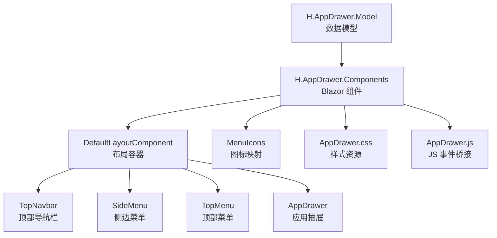
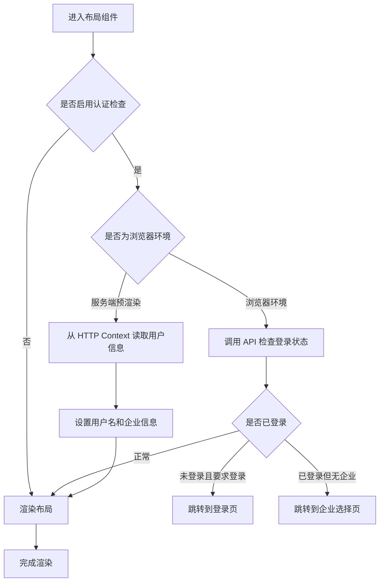
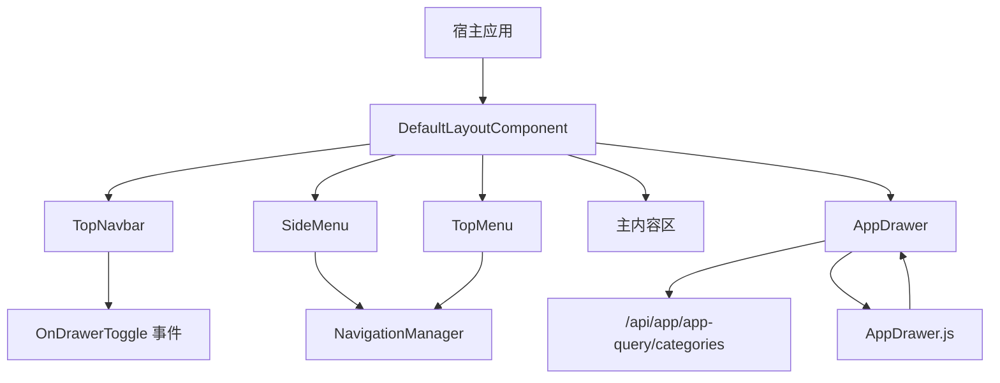
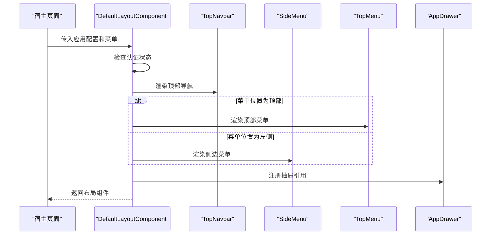
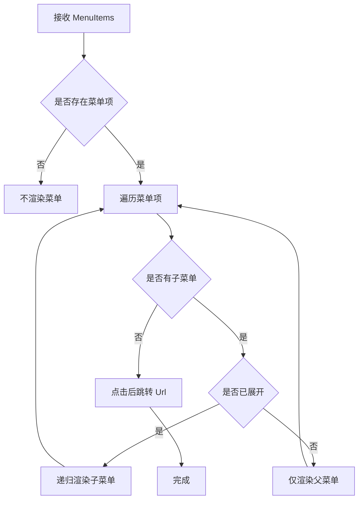
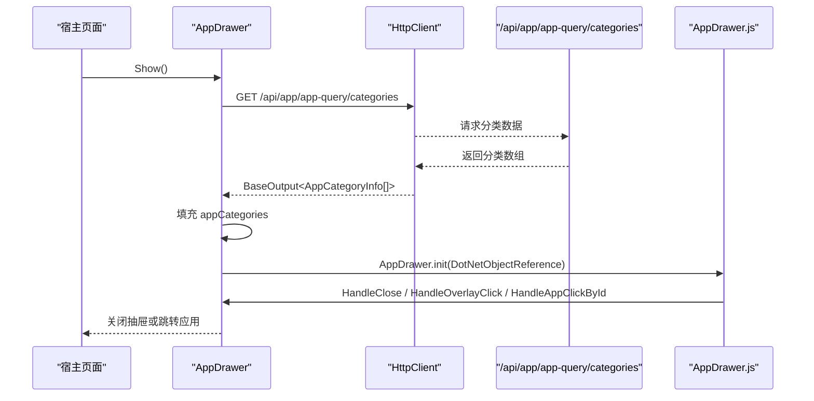
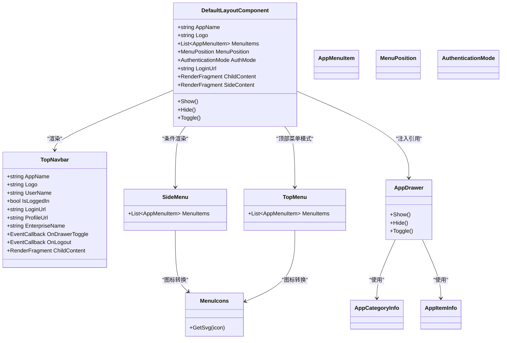

# 应用抽屉组件

<cite>
**本文引用的文件**   
- [AppDrawer.razor](file://src/Components/AppDrawer/H.AppDrawer.Components/Components/AppDrawer.razor)
- [TopNavbar.razor](file://src/Components/AppDrawer/H.AppDrawer.Components/Components/TopNavbar.razor)
- [SideMenu.razor](file://src/Components/AppDrawer/H.AppDrawer.Components/Components/SideMenu.razor)
- [DefaultLayoutComponent.razor](file://src/Components/AppDrawer/H.AppDrawer.Components/Components/DefaultLayoutComponent.razor)
- [TopMenu.razor](file://src/Components/AppDrawer/H.AppDrawer.Components/Components/TopMenu.razor)
- [MenuIcons.cs](file://src/Components/AppDrawer/H.AppDrawer.Components/Components/MenuIcons.cs)
- [AppDrawer.css](file://src/Components/AppDrawer/H.AppDrawer.Components/wwwroot/css/AppDrawer.css)
- [AppDrawer.js](file://src/Components/AppDrawer/H.AppDrawer.Components/wwwroot/js/AppDrawer.js)
- [AppMenuItem.cs](file://src/Components/AppDrawer/H.AppDrawer.Model/AppMenuItem.cs)
- [AppDrawerModels.cs](file://src/Components/AppDrawer/H.AppDrawer.Model/AppDrawerModels.cs)
- [AppData.cs](file://src/Components/AppDrawer/H.AppDrawer.Model/AppData.cs)
- [MenuPosition.cs](file://src/Components/AppDrawer/H.AppDrawer.Model/MenuPosition.cs)
- [AuthenticationMode.cs](file://src/Components/AppDrawer/H.AppDrawer.Model/AuthenticationMode.cs)
</cite>

## 目录

1. [简介](#简介)
2. [项目结构](#项目结构)
3. [核心组件总览](#核心组件总览)
4. [架构概览](#架构概览)
5. [菜单数据模型](#菜单数据模型)
6. [布局与渲染流程](#布局与渲染流程)
7. [用户交互行为](#用户交互行为)
8. [配置选项与扩展点](#配置选项与扩展点)
9. [依赖关系分析](#依赖关系分析)
10. [性能与可维护性](#性能与可维护性)
11. [自定义与插件集成指南](#自定义与插件集成指南)
12. [常见问题排查](#常见问题排查)
13. [最佳实践建议](#最佳实践建议)
14. [结论](#结论)

## 简介

H.AppLab 的应用抽屉组件是一套基于 Blazor 的前端导航与入口体系，用于在 Web 应用中提供：

- 顶部导航栏，承载应用名称、Logo、用户信息和登录状态。
- 左侧或顶部菜单，支持层级展开、路由高亮和跳转。
- 应用抽屉，用于展示应用分类和应用入口卡片，支持当前页打开或新标签页打开。
- 统一布局容器，将侧边菜单、主内容区和抽屉组合为完整应用外壳。

该组件以“菜单数据模型 + 组件树 + CSS 主题变量”的方式组织，既适合直接作为 H.AppLab 的默认外壳使用，也可以被宿主应用替换部分子组件实现品牌化定制。

## 项目结构

应用抽屉相关代码分布在两个主要工程中：

| 工程 | 职责 | 关键文件 |
|---|---|---|
| `H.AppDrawer.Model` | 定义菜单项、应用分类、菜单位置、认证模式等共享数据模型 | `AppMenuItem.cs`、`AppDrawerModels.cs`、`AppData.cs`、`MenuPosition.cs`、`AuthenticationMode.cs` |
| `H.AppDrawer.Components` | 实现 Blazor 组件、样式和 JavaScript 事件桥接 | `AppDrawer.razor`、`TopNavbar.razor`、`SideMenu.razor`、`DefaultLayoutComponent.razor`、`TopMenu.razor`、`MenuIcons.cs`、`AppDrawer.css`、`AppDrawer.js` |



**图表来源**
- [DefaultLayoutComponent.razor:1-60](file://src/Components/AppDrawer/H.AppDrawer.Components/Components/DefaultLayoutComponent.razor#L1-L60)
- [TopNavbar.razor:1-60](file://src/Components/AppDrawer/H.AppDrawer.Components/Components/TopNavbar.razor#L1-L60)
- [SideMenu.razor:1-40](file://src/Components/AppDrawer/H.AppDrawer.Components/Components/SideMenu.razor#L1-L40)
- [TopMenu.razor:1-35](file://src/Components/AppDrawer/H.AppDrawer.Components/Components/TopMenu.razor#L1-L35)
- [AppDrawer.razor:1-40](file://src/Components/AppDrawer/H.AppDrawer.Components/Components/AppDrawer.razor#L1-L40)

**章节来源**
- [AppMenuItem.cs:1-21](file://src/Components/AppDrawer/H.AppDrawer.Model/AppMenuItem.cs#L1-L21)
- [AppDrawerModels.cs:1-73](file://src/Components/AppDrawer/H.AppDrawer.Model/AppDrawerModels.cs#L1-L73)
- [AppData.cs:1-9](file://src/Components/AppDrawer/H.AppDrawer.Model/AppData.cs#L1-L9)
- [MenuPosition.cs:1-17](file://src/Components/AppDrawer/H.AppDrawer.Model/MenuPosition.cs#L1-L17)
- [AuthenticationMode.cs:1-22](file://src/Components/AppDrawer/H.AppDrawer.Model/AuthenticationMode.cs#L1-L22)
- [AppDrawer.razor:1-40](file://src/Components/AppDrawer/H.AppDrawer.Components/Components/AppDrawer.razor#L1-L40)
- [TopNavbar.razor:1-60](file://src/Components/AppDrawer/H.AppDrawer.Components/Components/TopNavbar.razor#L1-L60)
- [SideMenu.razor:1-40](file://src/Components/AppDrawer/H.AppDrawer.Components/Components/SideMenu.razor#L1-L40)
- [DefaultLayoutComponent.razor:1-60](file://src/Components/AppDrawer/H.AppDrawer.Components/Components/DefaultLayoutComponent.razor#L1-L60)
- [TopMenu.razor:1-35](file://src/Components/AppDrawer/H.AppDrawer.Components/Components/TopMenu.razor#L1-L35)
- [MenuIcons.cs:1-20](file://src/Components/AppDrawer/H.AppDrawer.Components/Components/MenuIcons.cs#L1-L20)
- [AppDrawer.css:1-40](file://src/Components/AppDrawer/H.AppDrawer.Components/wwwroot/css/AppDrawer.css#L1-L40)
- [AppDrawer.js:1-20](file://src/Components/AppDrawer/H.AppDrawer.Components/wwwroot/js/AppDrawer.js#L1-L20)

## 核心组件总览

### DefaultLayoutComponent：布局容器

`DefaultLayoutComponent` 是应用抽屉体系的入口布局组件，负责：

- 渲染 `TopNavbar`。
- 根据 `MenuPosition` 决定渲染 `SideMenu` 还是 `TopMenu`。
- 渲染主内容区 `ChildContent`。
- 注入并持有 `AppDrawer` 实例，供外部调用显示或隐藏。
- 处理认证状态检测、用户信息获取、企业切换引导和强制登录跳转。

其布局结构可以理解为：



**图表来源**
- [DefaultLayoutComponent.razor:1-120](file://src/Components/AppDrawer/H.AppDrawer.Components/Components/DefaultLayoutComponent.razor#L1-L120)
- [DefaultLayoutComponent.razor:120-220](file://src/Components/AppDrawer/H.AppDrawer.Components/Components/DefaultLayoutComponent.razor#L120-L220)

### TopNavbar：顶部导航栏

`TopNavbar` 负责展示应用头部区域，包括：

- 抽屉开关按钮。
- Logo 和应用名称。
- 中间插槽 `ChildContent`，用于在顶部菜单模式下嵌入 `TopMenu`。
- 用户头像、用户名、下拉菜单。
- 登录按钮或未登录时的退出登录回调。

它不直接管理业务菜单，而是通过 `OnDrawerToggle` 把抽屉开关事件交给父级布局或页面。

### SideMenu：侧边菜单

`SideMenu` 负责渲染嵌套菜单，核心能力包括：

- 递归渲染 `AppMenuItem` 列表。
- 根据当前路由自动匹配激活菜单项。
- 按 `Key` 管理展开收起状态。
- 首次加载时自动展开当前激活路径的祖先节点。
- 点击叶子菜单项时执行路由跳转。

### TopMenu：顶部菜单

`TopMenu` 主要用于 `MenuPosition.Top` 场景，把一级菜单渲染成顶部横向导航。它只做扁平化处理，不递归展开二级菜单。

### AppDrawer：应用抽屉

`AppDrawer` 是一个独立的应用入口抽屉，不是传统意义上的侧边抽屉，而是：

- 固定定位的右侧面板。
- 通过遮罩层关闭。
- 从后端 `/api/app/app-query/categories` 拉取应用分类。
- 支持 Emoji 图标或图片图标。
- 支持 `_self` 当前页跳转和 `_blank` 新标签页跳转。
- 通过 JavaScript 绑定 DOM 事件，再桥接到 C# 方法。

## 架构概览



**图表来源**
- [DefaultLayoutComponent.razor:1-60](file://src/Components/AppDrawer/H.AppDrawer.Components/Components/DefaultLayoutComponent.razor#L1-L60)
- [AppDrawer.razor:1-40](file://src/Components/AppDrawer/H.AppDrawer.Components/Components/AppDrawer.razor#L1-L40)
- [AppDrawer.razor:120-180](file://src/Components/AppDrawer/H.AppDrawer.Components/Components/AppDrawer.razor#L120-L180)
- [AppDrawer.js:1-45](file://src/Components/AppDrawer/H.AppDrawer.Components/wwwroot/js/AppDrawer.js#L1-L45)

## 菜单数据模型

### AppMenuItem：菜单项

`AppMenuItem` 是侧边菜单和顶部菜单的核心数据结构，属性如下：

| 属性 | 类型 | 含义 |
|---|---|---|
| `Name` | `string` | 菜单显示名称 |
| `Url` | `string` | 菜单跳转地址 |
| `Icon` | `string` | 图标标识，如 `home`、`dashboard`、`setting`；也支持 Emoji 文本 |
| `Key` | `string?` | 菜单唯一标识，用于展开收起状态跟踪 |
| `Children` | `List<AppMenuItem>?` | 子菜单列表，形成层级结构 |

时间复杂度方面，`SideMenu` 在每次路由变化时会对菜单树进行扫描，因此菜单层级越深、分支越多，计算激活路径和自动展开祖先链的成本越高。对于典型后台管理系统，菜单数量通常在几十到几百之间，性能影响较小。

### AppCategoryInfo 和 AppItemInfo：应用分类与应用项

这两个模型主要用于 `AppDrawer` 的应用卡片展示：

| 类 | 属性 | 含义 |
|---|---|---|
| `AppCategoryInfo` | `CategoryName` | 分类名称 |
| `AppCategoryInfo` | `CategoryIcon` | 分类图标（可选） |
| `AppCategoryInfo` | `Apps` | 应用列表 |
| `AppItemInfo` | `Id` | 应用唯一标识 |
| `AppItemInfo` | `Name` | 应用名称 |
| `AppItemInfo` | `Icon` | Emoji 或 Unicode 图标 |
| `AppItemInfo` | `IconUrl` | 图片图标地址 |
| `AppItemInfo` | `Url` | 应用跳转地址 |
| `AppItemInfo` | `Target` | `_self` 或 `_blank` |
| `AppItemInfo` | `Description` | 应用描述 |
| `AppItemInfo` | `Enabled` | 是否启用 |
| `AppItemInfo` | `Order` | 排序号 |

### AppData：JSON 反序列化根对象

`AppData` 是用于 JSON 反序列化的根类型，包含 `AppCategories` 列表。虽然 `AppDrawer` 当前直接从 `/api/app/app-query/categories` 读取 `AppCategoryInfo[]`，但该类型仍保留，便于未来对接统一应用清单接口。

### MenuPosition：菜单位置

| 值 | 含义 |
|---|---|
| `Left` | 左侧菜单，同时显示侧边菜单 |
| `Top` | 顶部菜单，隐藏侧边菜单，改用 `TopMenu` |

### AuthenticationMode：认证模式

| 值 | 含义 |
|---|---|
| `None` | 不检测认证状态 |
| `Optional` | 检测认证状态，允许匿名访问 |
| `Required` | 强制认证，未登录跳转到登录页 |

**章节来源**
- [AppMenuItem.cs:1-21](file://src/Components/AppDrawer/H.AppDrawer.Model/AppMenuItem.cs#L1-L21)
- [AppDrawerModels.cs:1-73](file://src/Components/AppDrawer/H.AppDrawer.Model/AppDrawerModels.cs#L1-L73)
- [AppData.cs:1-9](file://src/Components/AppDrawer/H.AppDrawer.Model/AppData.cs#L1-L9)
- [MenuPosition.cs:1-17](file://src/Components/AppDrawer/H.AppDrawer.Model/MenuPosition.cs#L1-L17)
- [AuthenticationMode.cs:1-22](file://src/Components/AppDrawer/H.AppDrawer.Model/AuthenticationMode.cs#L1-L22)

## 布局与渲染流程

### 布局组件渲染顺序

`DefaultLayoutComponent` 的渲染逻辑大致如下：

1. 接收 `AppName`、`Logo`、`MenuItems`、`MenuPosition`、`LoginUrl`、`AuthMode` 等参数。
2. 在服务端预渲染阶段尝试从 `HttpContext` 读取用户信息。
3. 在浏览器环境首次渲染后调用认证检查 API。
4. 根据认证结果决定是否跳转登录页或企业选择页。
5. 渲染 `TopNavbar`，并在顶部菜单模式下插入 `TopMenu`。
6. 在非顶部菜单模式下渲染 `SideMenu`。
7. 渲染主内容区 `ChildContent`。
8. 渲染 `AppDrawer` 并暴露 `Show`、`Hide`、`Toggle` 方法。



**图表来源**
- [DefaultLayoutComponent.razor:1-60](file://src/Components/AppDrawer/H.AppDrawer.Components/Components/DefaultLayoutComponent.razor#L1-L60)

### 菜单渲染流程

`SideMenu` 使用递归方式渲染菜单：



**图表来源**
- [SideMenu.razor:1-120](file://src/Components/AppDrawer/H.AppDrawer.Components/Components/SideMenu.razor#L1-L120)
- [SideMenu.razor:120-213](file://src/Components/AppDrawer/H.AppDrawer.Components/Components/SideMenu.razor#L120-L213)

### 应用抽屉渲染流程

`AppDrawer` 在初始化时请求应用分类数据，并将自身作为 `.NET 对象引用` 传递给 JavaScript，由 JS 绑定关闭按钮、遮罩层和应用卡片点击事件。



**图表来源**
- [AppDrawer.razor:120-252](file://src/Components/AppDrawer/H.AppDrawer.Components/Components/AppDrawer.razor#L120-L252)
- [AppDrawer.js:1-45](file://src/Components/AppDrawer/H.AppDrawer.Components/wwwroot/js/AppDrawer.js#L1-L45)

## 用户交互行为

### 抽屉开关

- 用户在 `TopNavbar` 中点击汉堡按钮时，触发 `OnDrawerToggle`。
- 父级布局可以通过事件回调控制 `AppDrawer.Show()`、`Hide()` 或 `Toggle()`。
- `AppDrawer` 内部还维护一个私有 `Visible` 状态，并通过 `StateHasChanged()` 刷新 UI。

### 应用卡片点击

- 点击应用卡片时，先关闭抽屉。
- 等待短暂延迟以配合遮罩动画。
- 如果 `Target` 为 `_blank`，则通过 JavaScript 打开新标签页。
- 否则使用 `NavigationManager.NavigateTo` 在当前页跳转。

### 系统后台按钮

抽屉底部有一个系统后台按钮，点击后会关闭抽屉并以新标签页打开 `/system`。

### 菜单展开与收起

- 父菜单点击只切换展开状态，不跳转。
- 叶子菜单点击直接跳转 `Url`。
- 展开状态按 `Key` 存储；若未设置 `Key`，则回退到 `Name`。
- 首次进入页面时，会根据当前路由自动展开激活路径的祖先节点。

### 路由高亮

`SideMenu` 使用最长前缀匹配策略：

1. 将当前 URL 规范化为相对路径，去掉查询参数和前导斜杠。
2. 遍历菜单树，查找所有能匹配的菜单项。
3. 记录长度最长的匹配 URL 作为激活目标。
4. 父菜单只要任一子菜单匹配，即视为激活。

`TopMenu` 也有类似的高亮逻辑，并避免父级路由吞掉更精确的子级路由高亮。

### 搜索过滤

当前源码中没有实现抽屉内搜索过滤功能。如果需要，可在 `AppDrawer` 中增加本地过滤逻辑，按 `AppItemInfo.Name` 或 `Description` 过滤应用卡片。

**章节来源**
- [TopNavbar.razor:1-120](file://src/Components/AppDrawer/H.AppDrawer.Components/Components/TopNavbar.razor#L1-L120)
- [AppDrawer.razor:120-252](file://src/Components/AppDrawer/H.AppDrawer.Components/Components/AppDrawer.razor#L120-L252)
- [SideMenu.razor:60-213](file://src/Components/AppDrawer/H.AppDrawer.Components/Components/SideMenu.razor#L60-L213)
- [TopMenu.razor:35-95](file://src/Components/AppDrawer/H.AppDrawer.Components/Components/TopMenu.razor#L35-L95)

## 配置选项与扩展点

### DefaultLayoutComponent 配置

| 参数 | 类型 | 默认值 | 说明 |
|---|---|---|---|
| `AppName` | `string` | `"应用"` | 应用名称 |
| `Logo` | `string` | `"/favicon.png"` | Logo 图片路径 |
| `MenuItems` | `List<AppMenuItem>?` | 空 | 菜单列表；为空时不渲染菜单 |
| `SideContent` | `RenderFragment?` | 空 | 自定义侧栏内容；提供时替代 `SideMenu` |
| `MenuPosition` | `MenuPosition` | `Left` | 左侧菜单或顶部菜单 |
| `LoginUrl` | `string` | `"/account/login"` | 登录页地址 |
| `AuthMode` | `AuthenticationMode` | `Required` | 认证模式 |
| `ChildContent` | `RenderFragment?` | 空 | 主内容区 |

### TopNavbar 配置

| 参数 | 类型 | 默认值 | 说明 |
|---|---|---|---|
| `AppName` | `string` | `"应用"` | 应用名称 |
| `Logo` | `string?` | 空 | Logo 图片路径 |
| `UserName` | `string` | `"用户"` | 用户名 |
| `IsLoggedIn` | `bool` | `false` | 是否已登录 |
| `LoginUrl` | `string` | `"/account/login"` | 登录页地址 |
| `ProfileUrl` | `string` | `"/account/users"` | 个人资料地址 |
| `EnterpriseName` | `string?` | 空 | 当前企业名称 |
| `OnLogout` | `EventCallback` | 空 | 退出登录回调 |
| `OnDrawerToggle` | `EventCallback` | 空 | 抽屉开关回调 |
| `ChildContent` | `RenderFragment?` | 空 | 顶部中间插槽 |

### AppDrawer 公开方法

| 方法 | 作用 |
|---|---|
| `Show()` | 显示抽屉 |
| `Hide()` | 隐藏抽屉 |
| `Toggle()` | 切换抽屉显示状态 |

### 主题与样式扩展

组件使用 CSS 变量定义主题色，例如：

- `--h-primary`
- `--h-primary-hover`
- `--h-primary-soft`
- `--h-text`
- `--h-text-2`
- `--h-border-light`
- `--h-bg-page`

宿主应用可通过全局 CSS 覆盖这些变量来改变主题，无需修改组件源码。

### 国际化支持

当前组件没有内置多语言服务注入。界面文案以中文硬编码为主，例如“应用列表”“加载中”“暂无应用”“个人设置”“退出登录”等。若需要国际化，可在宿主层封装多语言服务，并通过参数或插槽替换这些文案。

**章节来源**
- [DefaultLayoutComponent.razor:1-120](file://src/Components/AppDrawer/H.AppDrawer.Components/Components/DefaultLayoutComponent.razor#L1-L120)
- [TopNavbar.razor:120-202](file://src/Components/AppDrawer/H.AppDrawer.Components/Components/TopNavbar.razor#L120-L202)
- [AppDrawer.razor:40-120](file://src/Components/AppDrawer/H.AppDrawer.Components/Components/AppDrawer.razor#L40-L120)
- [AppDrawer.css:1-231](file://src/Components/AppDrawer/H.AppDrawer.Components/wwwroot/css/AppDrawer.css#L1-L231)

## 依赖关系分析

### 组件依赖图



**图表来源**
- [DefaultLayoutComponent.razor:1-60](file://src/Components/AppDrawer/H.AppDrawer.Components/Components/DefaultLayoutComponent.razor#L1-L60)
- [TopNavbar.razor:120-202](file://src/Components/AppDrawer/H.AppDrawer.Components/Components/TopNavbar.razor#L120-L202)
- [SideMenu.razor:1-60](file://src/Components/AppDrawer/H.AppDrawer.Components/Components/SideMenu.razor#L1-L60)
- [TopMenu.razor:1-60](file://src/Components/AppDrawer/H.AppDrawer.Components/Components/TopMenu.razor#L1-L60)
- [AppDrawer.razor:1-60](file://src/Components/AppDrawer/H.AppDrawer.Components/Components/AppDrawer.razor#L1-L60)
- [MenuIcons.cs:1-54](file://src/Components/AppDrawer/H.AppDrawer.Components/Components/MenuIcons.cs#L1-L54)

### 外部依赖

| 依赖 | 用途 |
|---|---|
| `NavigationManager` | 客户端路由跳转 |
| `HttpClient` | 拉取应用分类数据、检查认证状态、获取企业信息 |
| `IJSRuntime` | 调用 JavaScript 打开新标签页、绑定 DOM 事件 |
| `DotNetObjectReference` | 从 JavaScript 反向调用 C# 方法 |
| `IHttpContextAccessor` | 服务端预渲染时读取当前用户身份 |
| `IServiceProvider` | 解析 `IHttpContextAccessor` |

**章节来源**
- [AppDrawer.razor:1-20](file://src/Components/AppDrawer/H.AppDrawer.Components/Components/AppDrawer.razor#L1-L20)
- [AppDrawer.razor:120-252](file://src/Components/AppDrawer/H.AppDrawer.Components/Components/AppDrawer.razor#L120-L252)
- [DefaultLayoutComponent.razor:60-120](file://src/Components/AppDrawer/H.AppDrawer.Components/Components/DefaultLayoutComponent.razor#L60-L120)
- [DefaultLayoutComponent.razor:120-220](file://src/Components/AppDrawer/H.AppDrawer.Components/Components/DefaultLayoutComponent.razor#L120-L220)

## 性能与可维护性

### 性能特点

- 菜单渲染采用递归渲染，适用于中小型菜单结构。
- 路由匹配在 `SideMenu` 中缓存 `_bestMatchUrl`，减少重复计算。
- 自动展开只记录 `_autoExpandedForUrl`，避免重复展开相同路径。
- 应用抽屉的数据加载在 `OnInitializedAsync` 中进行，避免首屏阻塞。
- 认证检查放在 `OnAfterRenderAsync`，防止 WASM 环境下认证失败导致白屏。
- 抽屉关闭动画使用短延迟，提升视觉过渡体验。

### 潜在优化点

- 如果菜单非常庞大，可为 `SideMenu` 引入虚拟滚动或懒加载。
- 应用抽屉可考虑分页加载应用分类，避免一次性渲染过多卡片。
- 路由匹配逻辑可抽取为纯函数，提高可测试性。
- 认证检查可加入重试和错误提示机制。
- 多语言文案应抽离为资源键，便于翻译和本地化。

**章节来源**
- [SideMenu.razor:60-180](file://src/Components/AppDrawer/H.AppDrawer.Components/Components/SideMenu.razor#L60-L180)
- [AppDrawer.razor:120-200](file://src/Components/AppDrawer/H.AppDrawer.Components/Components/AppDrawer.razor#L120-L200)
- [DefaultLayoutComponent.razor:120-220](file://src/Components/AppDrawer/H.AppDrawer.Components/Components/DefaultLayoutComponent.razor#L120-L220)

## 自定义与插件集成指南

### 样式覆盖

通过 CSS 变量覆盖主题：

```css
:root {
    --h-primary: #your-brand-color;
    --h-primary-hover: #your-brand-hover;
    --h-primary-soft: #your-brand-soft;
    --h-text: #your-text-color;
    --h-bg-page: #your-background;
}
```

也可以通过宿主应用的样式表覆盖 `.app-drawer-container`、`.menu-sidebar`、`.top-navbar` 等类名。

### 自定义侧栏

将 `DefaultLayoutComponent.SideContent` 设置为自定义 `RenderFragment`，即可完全替换默认 `SideMenu`。这种方式适合需要复杂侧栏逻辑的场景，比如动态权限菜单、组织架构菜单或第三方菜单组件。

### 自定义顶部中间内容

通过 `TopNavbar.ChildContent` 插入搜索框、面包屑、通知或其他顶部工具栏内容。

### 事件处理

- 使用 `TopNavbar.OnDrawerToggle` 控制抽屉显示。
- 使用 `TopNavbar.OnLogout` 处理退出登录逻辑。
- 在宿主页面中保存 `AppDrawer` 引用，调用 `Show()`、`Hide()`、`Toggle()`。

### 插件集成建议

- 将业务菜单构造成 `List<AppMenuItem>` 后传给 `DefaultLayoutComponent.MenuItems`。
- 将应用清单构建为 `List<AppCategoryInfo>` 后由后端 `/api/app/app-query/categories` 返回。
- 如需权限控制，建议在服务端过滤菜单和应用，而不是仅在客户端隐藏。
- 如需插件式应用，可将应用元数据抽象为独立模块，由宿主聚合后输出统一分类结构。

**章节来源**
- [DefaultLayoutComponent.razor:1-60](file://src/Components/AppDrawer/H.AppDrawer.Components/Components/DefaultLayoutComponent.razor#L1-L60)
- [TopNavbar.razor:120-202](file://src/Components/AppDrawer/H.AppDrawer.Components/Components/TopNavbar.razor#L120-L202)
- [AppDrawer.razor:40-120](file://src/Components/AppDrawer/H.AppDrawer.Components/Components/AppDrawer.razor#L40-L120)

## 常见问题排查

### 抽屉无法关闭

可能原因：

- JavaScript 未成功绑定事件。
- `AppDrawer.js` 未被加载。
- `AppDrawer.init` 未在可见状态下调用。
- 遮罩层或关闭按钮 DOM 尚未渲染。

排查建议：

- 确认 `AppDrawer` 已挂载且 `Visible` 为真。
- 检查浏览器控制台是否有 `AppDrawer: HandleClose failed` 等 JS 错误。
- 确认 `wwwroot/js/AppDrawer.js` 和 `wwwroot/css/AppDrawer.css` 已被静态资源托管。

### 应用卡片点击无效

可能原因：

- 应用 `Url` 为空。
- 后端 `/api/app/app-query/categories` 返回空数据。
- `BaseOutput<T>` 结构不符合预期。
- `_blank` 打开被浏览器拦截。

排查建议：

- 检查 API 响应是否包含有效 `AppItemInfo`。
- 确认 `Target` 字段是否正确。
- 检查浏览器弹窗拦截设置。

### 菜单高亮不正确

可能原因：

- 菜单 `Url` 与实际路由不一致。
- 路径包含查询参数导致匹配失败。
- 父级路由与子级路由冲突。

排查建议：

- 确保菜单 `Url` 与 `NavigationManager.Uri` 解析出的相对路径一致。
- 检查 `NormalizePath` 和 `IsMatch` 的行为是否符合预期。
- 对顶级路由使用更具体的子路由，避免被父级吞掉。

### 认证后立即跳转登录页

可能原因：

- `AuthMode` 设置为 `Required`。
- 认证 API 返回未登录。
- Cookie 或 Token 未携带。

排查建议：

- 临时改为 `AuthenticationMode.Optional` 验证是否因认证问题导致。
- 检查后端认证服务和 Cookie 配置。
- 查看 `DefaultLayoutComponent` 的认证检查逻辑是否进入强制跳转分支。

**章节来源**
- [AppDrawer.js:1-45](file://src/Components/AppDrawer/H.AppDrawer.Components/wwwroot/js/AppDrawer.js#L1-L45)
- [AppDrawer.razor:120-252](file://src/Components/AppDrawer/H.AppDrawer.Components/Components/AppDrawer.razor#L120-L252)
- [SideMenu.razor:60-180](file://src/Components/AppDrawer/H.AppDrawer.Components/Components/SideMenu.razor#L60-L180)
- [DefaultLayoutComponent.razor:120-220](file://src/Components/AppDrawer/H.AppDrawer.Components/Components/DefaultLayoutComponent.razor#L120-L220)

## 最佳实践建议

1. **优先在后端做权限过滤**  
   菜单和应用清单应由后端根据用户角色和权限生成，前端只负责展示。

2. **为菜单项设置稳定 Key**  
   如果菜单可能动态变化，务必为每个可展开菜单设置稳定的 `Key`，避免展开状态错乱。

3. **保持菜单 Url 与路由一致**  
   菜单 `Url` 应与实际 Blazor 路由一致，避免高亮异常和跳转异常。

4. **区分应用跳转方式**  
   外部系统使用 `_blank`，内部子系统使用 `_self`，避免用户误以为页面丢失。

5. **使用 CSS 变量做品牌定制**  
   不要直接复制组件样式文件进行修改，优先通过 CSS 变量覆盖主题。

6. **谨慎使用服务端预渲染身份**  
   服务端身份读取仅用于提升首屏体验，最终应以浏览器环境认证结果为准。

7. **为异步操作增加错误反馈**  
   当前抽屉加载和应用点击逻辑缺少明显错误提示，建议结合宿主 Toast 服务增加失败反馈。

8. **将文案抽离为多语言资源**  
   当前组件大量使用中文硬编码，长期维护时应迁移到资源键。

**章节来源**
- [AppDrawer.razor:120-252](file://src/Components/AppDrawer/H.AppDrawer.Components/Components/AppDrawer.razor#L120-L252)
- [SideMenu.razor:60-213](file://src/Components/AppDrawer/H.AppDrawer.Components/Components/SideMenu.razor#L60-L213)
- [TopNavbar.razor:120-202](file://src/Components/AppDrawer/H.AppDrawer.Components/Components/TopNavbar.razor#L120-L202)
- [DefaultLayoutComponent.razor:60-220](file://src/Components/AppDrawer/H.AppDrawer.Components/Components/DefaultLayoutComponent.razor#L60-L220)

## 结论

H.AppLab 的应用抽屉组件提供了一个结构清晰、可扩展的前端外壳方案。它以 `DefaultLayoutComponent` 为布局中枢，以 `TopNavbar`、`SideMenu`、`TopMenu` 和 `AppDrawer` 为功能单元，以 `AppMenuItem`、`AppCategoryInfo`、`AppItemInfo` 等模型为数据契约，并借助 `MenuIcons`、CSS 变量和 JavaScript 事件桥接完成图标、主题和交互闭环。

对于新项目，推荐直接使用 `DefaultLayoutComponent` 作为应用布局，并在宿主层注入菜单和应用清单。对于已有项目，可逐步替换现有外壳组件，复用本组件的认证流程、主题变量和导航行为，从而降低重复开发成本。