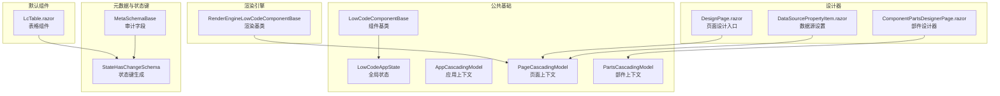
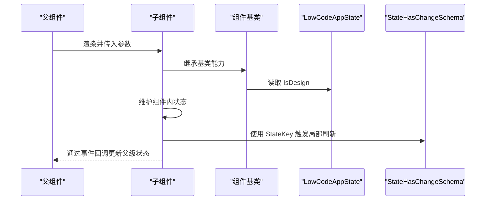
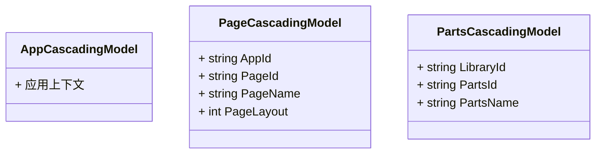
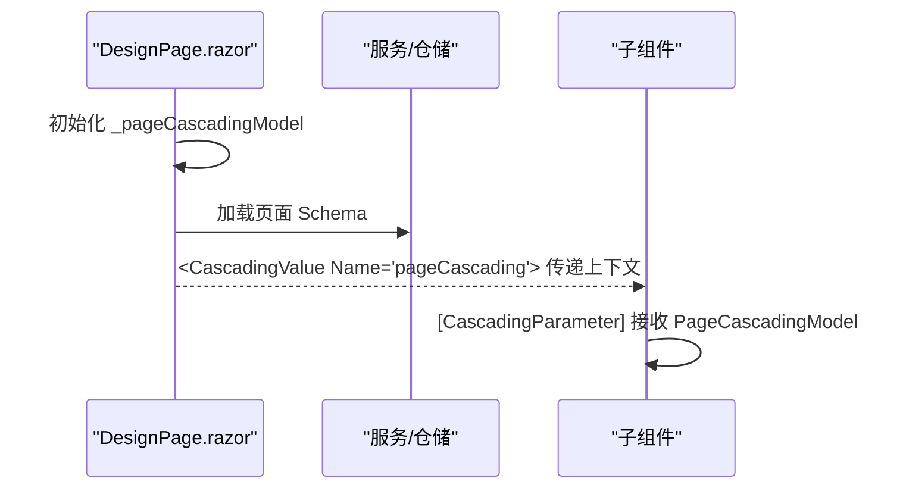
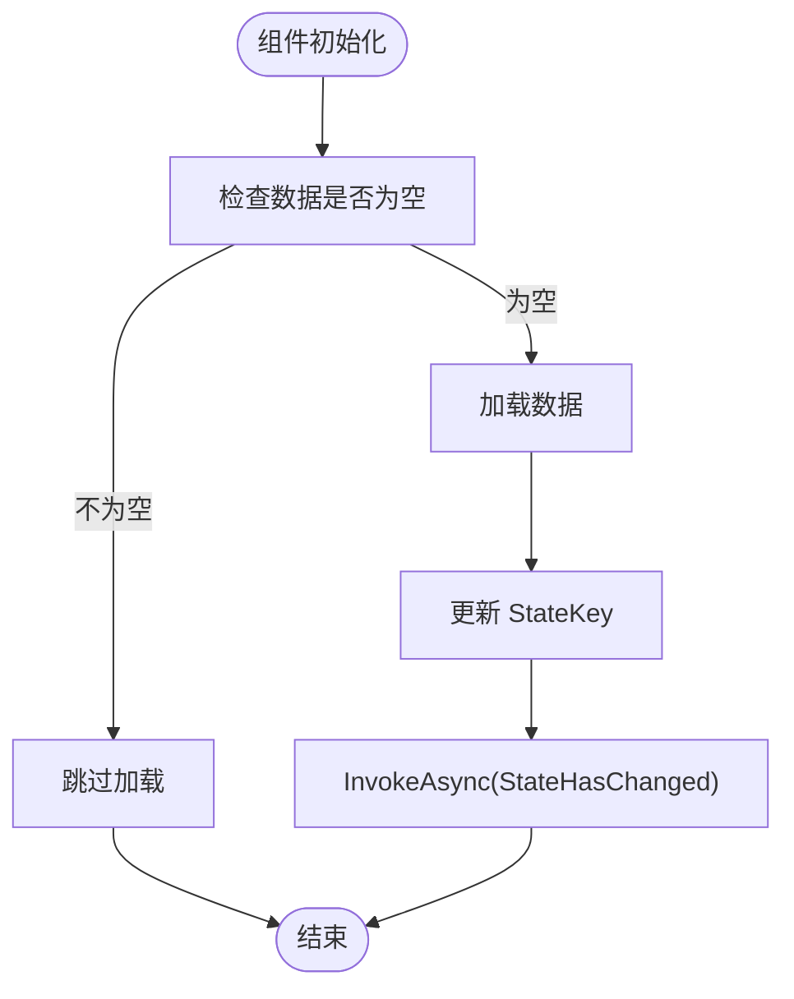
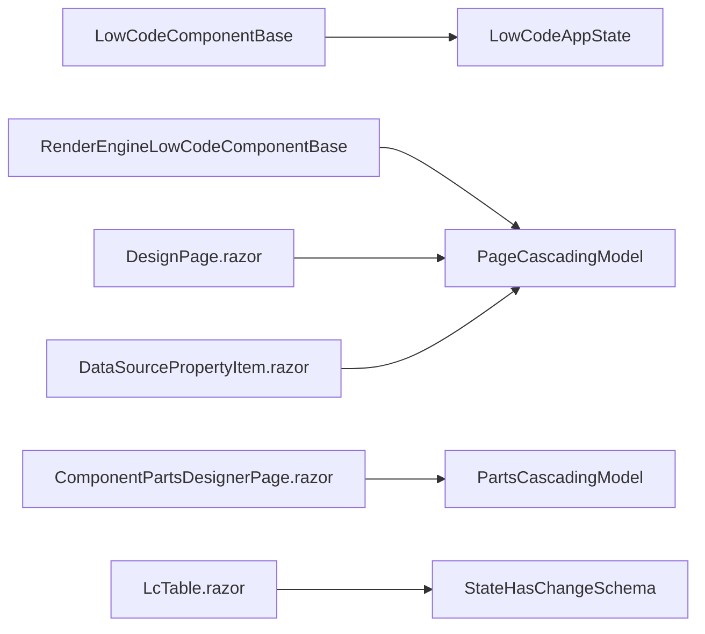

# 状态管理

<cite>
**本文引用的文件**   
- [LowCodeAppState.cs](file://src/LowCode/Common/H.LowCode.ComponentBase/LowCodeAppState.cs)
- [LowCodeComponentBase.cs](file://src/LowCode/Common/H.LowCode.ComponentBase/LowCodeComponentBase.cs)
- [AppCascadingModel.cs](file://src/LowCode/Common/H.LowCode.ComponentBase/CascadingModels/AppCascadingModel.cs)
- [PageCascadingModel.cs](file://src/LowCode/Common/H.LowCode.ComponentBase/CascadingModels/PageCascadingModel.cs)
- [PartsCascadingModel.cs](file://src/LowCode/Common/H.LowCode.ComponentBase/CascadingModels/PartsCascadingModel.cs)
- [StateHasChangeSchema.cs](file://src/LowCode/Common/H.LowCode.MetaSchema/StateHasChangeSchema.cs)
- [MetaSchemaBase.cs](file://src/LowCode/Common/H.LowCode.MetaSchema/MetaSchemaBase.cs)
- [RenderEngineLowCodeComponentBase.cs](file://src/LowCode/RenderEngine/H.LowCode.RenderEngineBase/RenderEngineLowCodeComponentBase.cs)
- [DesignPage.razor](file://src/LowCode/DesignEngine/H.LowCode.DesignEngine/Pages/DesignPage.razor)
- [DataSourcePropertyItem.razor](file://src/LowCode/DesignEngine/H.LowCode.DesignEngine/SettingPanel/PropertySettingItems/DataSourcePropertyItem.razor)
- [ComponentPartsDesignerPage.razor](file://src/LowCode/DesignEngine/H.LowCode.PartsDesignEngine/Pages/ComponentParts/ComponentPartsDesignerPage.razor)
- [LcTable.razor](file://src/LowCode/Common/H.LowCode.Components/Components/LcTable.razor)
</cite>

## 目录
1. [简介](#简介)
2. [项目结构](#项目结构)
3. [核心组件](#核心组件)
4. [架构总览](#架构总览)
5. [详细组件分析](#详细组件分析)
6. [依赖关系分析](#依赖关系分析)
7. [性能考虑](#性能考虑)
8. [故障排查指南](#故障排查指南)
9. [结论](#结论)
10. [附录](#附录)

## 简介
本文件面向 AppLab 的状态管理系统，系统性阐述 Blazor 组件状态管理的多种模式：组件内状态、CascadingParameters 级联参数、服务注入状态共享。重点解析 LowCodeAppState 全局状态管理器的设计和使用（状态定义、变更通知、持久化存储），以及 CascadingModels 级联模型的应用场景（应用上下文 AppCascadingModel、页面上下文 PageCascadingModel、部件上下文 PartsCascadingModel）。同时给出状态同步机制与数据一致性保证策略、复杂状态场景的解决方案、性能优化建议，以及状态调试与监控工具的使用方法。

## 项目结构
与状态管理相关的代码主要分布在以下模块：
- 公共基础能力：H.LowCode.ComponentBase（组件基类、全局状态、级联模型）
- 元数据与状态键：H.LowCode.MetaSchema（StateHasChangeSchema、MetaSchemaBase）
- 渲染引擎基类：H.LowCode.RenderEngineBase（渲染侧组件基类，接入页面级联）
- 设计器页面与设置面板：H.LowCode.DesignEngine、H.LowCode.PartsDesignEngine（使用级联参数传递上下文）
- 默认组件：H.LowCode.Components（如 LcTable，演示基于 StateKey 的局部刷新）

图表来源 
- [LowCodeComponentBase.cs:1-73](file://src/LowCode/Common/H.LowCode.ComponentBase/LowCodeComponentBase.cs#L1-L73)
- [LowCodeAppState.cs:1-21](file://src/LowCode/Common/H.LowCode.ComponentBase/LowCodeAppState.cs#L1-L21)
- [AppCascadingModel.cs:1-12](file://src/LowCode/Common/H.LowCode.ComponentBase/CascadingModels/AppCascadingModel.cs#L1-L12)
- [PageCascadingModel.cs:1-20](file://src/LowCode/Common/H.LowCode.ComponentBase/CascadingModels/PageCascadingModel.cs#L1-L20)
- [PartsCascadingModel.cs:1-13](file://src/LowCode/Common/H.LowCode.ComponentBase/CascadingModels/PartsCascadingModel.cs#L1-L13)
- [StateHasChangeSchema.cs:1-17](file://src/LowCode/Common/H.LowCode.MetaSchema/StateHasChangeSchema.cs#L1-L17)
- [MetaSchemaBase.cs:1-19](file://src/LowCode/Common/H.LowCode.MetaSchema/MetaSchemaBase.cs#L1-L19)
- [RenderEngineLowCodeComponentBase.cs:1-15](file://src/LowCode/RenderEngine/H.LowCode.RenderEngineBase/RenderEngineLowCodeComponentBase.cs#L1-L15)
- [DesignPage.razor:65-110](file://src/LowCode/DesignEngine/H.LowCode.DesignEngine/Pages/DesignPage.razor#L65-L110)
- [DataSourcePropertyItem.razor:61-112](file://src/LowCode/DesignEngine/H.LowCode.DesignEngine/SettingPanel/PropertySettingItems/DataSourcePropertyItem.razor#L61-L112)
- [ComponentPartsDesignerPage.razor:1-31](file://src/LowCode/DesignEngine/H.LowCode.PartsDesignEngine/Pages/ComponentParts/ComponentPartsDesignerPage.razor#L1-L31)
- [LcTable.razor:124-170](file://src/LowCode/Common/H.LowCode.Components/Components/LcTable.razor#L124-L170)

章节来源
- [LowCodeComponentBase.cs:1-73](file://src/LowCode/Common/H.LowCode.ComponentBase/LowCodeComponentBase.cs#L1-L73)
- [LowCodeAppState.cs:1-21](file://src/LowCode/Common/H.LowCode.ComponentBase/LowCodeAppState.cs#L1-L21)
- [StateHasChangeSchema.cs:1-17](file://src/LowCode/Common/H.LowCode.MetaSchema/StateHasChangeSchema.cs#L1-L17)
- [MetaSchemaBase.cs:1-19](file://src/LowCode/Common/H.LowCode.MetaSchema/MetaSchemaBase.cs#L1-L19)
- [RenderEngineLowCodeComponentBase.cs:1-15](file://src/LowCode/RenderEngine/H.LowCode.RenderEngineBase/RenderEngineLowCodeComponentBase.cs#L1-L15)
- [DesignPage.razor:65-110](file://src/LowCode/DesignEngine/H.LowCode.DesignEngine/Pages/DesignPage.razor#L65-L110)
- [DataSourcePropertyItem.razor:61-112](file://src/LowCode/DesignEngine/H.LowCode.DesignEngine/SettingPanel/PropertySettingItems/DataSourcePropertyItem.razor#L61-L112)
- [ComponentPartsDesignerPage.razor:1-31](file://src/LowCode/DesignEngine/H.LowCode.PartsDesignEngine/Pages/ComponentParts/ComponentPartsDesignerPage.razor#L1-L31)
- [LcTable.razor:124-170](file://src/LowCode/Common/H.LowCode.Components/Components/LcTable.razor#L124-L170)

## 核心组件
- LowCodeAppState：全局状态容器，提供“是否设计时”等应用级标志位，通过依赖注入在组件中访问。
- LowCodeComponentBase：组件基类，封装日志、导航、JS 消息、IsDesign 快捷属性、StateKey 标识等通用能力。
- CascadingModels：用于跨层级传递上下文信息，避免逐层传参：
  - AppCascadingModel：应用级上下文（当前可扩展为租户、主题、语言等）
  - PageCascadingModel：页面级上下文（AppId、PageId、PageName、PageLayout）
  - PartsCascadingModel：部件级上下文（LibraryId、PartsId、PartsName）
- StateHasChangeSchema / MetaSchemaBase：为元数据模型提供 StateKey 自动生成与变更方法，配合 ShouldRender 实现细粒度刷新；MetaSchemaBase 扩展审计字段。
- RenderEngineLowCodeComponentBase：渲染引擎侧组件基类，直接获取 PageCascadingModel，简化渲染组件对页面上下文的访问。

章节来源
- [LowCodeAppState.cs:1-21](file://src/LowCode/Common/H.LowCode.ComponentBase/LowCodeAppState.cs#L1-L21)
- [LowCodeComponentBase.cs:1-73](file://src/LowCode/Common/H.LowCode.ComponentBase/LowCodeComponentBase.cs#L1-L73)
- [AppCascadingModel.cs:1-12](file://src/LowCode/Common/H.LowCode.ComponentBase/CascadingModels/AppCascadingModel.cs#L1-L12)
- [PageCascadingModel.cs:1-20](file://src/LowCode/Common/H.LowCode.ComponentBase/CascadingModels/PageCascadingModel.cs#L1-L20)
- [PartsCascadingModel.cs:1-13](file://src/LowCode/Common/H.LowCode.ComponentBase/CascadingModels/PartsCascadingModel.cs#L1-L13)
- [StateHasChangeSchema.cs:1-17](file://src/LowCode/Common/H.LowCode.MetaSchema/StateHasChangeSchema.cs#L1-L17)
- [MetaSchemaBase.cs:1-19](file://src/LowCode/Common/H.LowCode.MetaSchema/MetaSchemaBase.cs#L1-L19)
- [RenderEngineLowCodeComponentBase.cs:1-15](file://src/LowCode/RenderEngine/H.LowCode.RenderEngineBase/RenderEngineLowCodeComponentBase.cs#L1-L15)

## 架构总览
Blazor 状态管理在本项目中采用“组合式”方案：
- 组件内状态：每个组件维护自身 UI 状态（如表单输入、分页、加载态）。
- 级联参数：通过 CascadingValue/CascadingParameter 自上而下传递上下文（应用、页面、部件），减少参数透传。
- 服务注入：通过 DI 注入全局状态（LowCodeAppState）或业务服务，实现跨组件共享。
- 元数据状态键：StateHasChangeSchema 提供 StateKey，结合 ShouldRender 控制局部刷新，提升性能。

图表来源 
- [LowCodeComponentBase.cs:1-73](file://src/LowCode/Common/H.LowCode.ComponentBase/LowCodeComponentBase.cs#L1-L73)
- [LowCodeAppState.cs:1-21](file://src/LowCode/Common/H.LowCode.ComponentBase/LowCodeAppState.cs#L1-L21)
- [StateHasChangeSchema.cs:1-17](file://src/LowCode/Common/H.LowCode.MetaSchema/StateHasChangeSchema.cs#L1-L17)

## 详细组件分析

### 全局状态管理器：LowCodeAppState
- 职责：承载应用级状态（例如是否处于设计时），供所有组件通过 DI 访问。
- 设计要点：
  - 构造时传入 isDesign，作为只读属性暴露。
  - 可通过扩展增加更多全局标志（如主题、租户、多语言）。
- 使用方式：在组件基类中注入，派生组件可直接使用 IsDesign 快捷属性。

章节来源
- [LowCodeAppState.cs:1-21](file://src/LowCode/Common/H.LowCode.ComponentBase/LowCodeAppState.cs#L1-L21)
- [LowCodeComponentBase.cs:1-73](file://src/LowCode/Common/H.LowCode.ComponentBase/LowCodeComponentBase.cs#L1-L73)

### 组件基类：LowCodeComponentBase
- 职责：统一注入常用服务（NavigationManager、IJSRuntime、ILoggerFactory）、提供日志、消息提示、导航、查询参数解析、IsDesign 快捷属性、StateKey 标识。
- 设计要点：
  - StateKey 用于 ShouldRender 判断，配合 StateHasChangeSchema 实现精准刷新。
  - Message 内部封装 JS 交互，便于统一提示风格。
- 使用方式：自定义组件继承该基类即可获得通用能力。

章节来源
- [LowCodeComponentBase.cs:1-73](file://src/LowCode/Common/H.LowCode.ComponentBase/LowCodeComponentBase.cs#L1-L73)

### 级联模型：CascadingModels
- AppCascadingModel：应用级上下文占位，可后续扩展（租户、主题、语言等）。
- PageCascadingModel：页面级上下文，包含 AppId、PageId、PageName、PageLayout，广泛用于数据绑定与布局控制。
- PartsCascadingModel：部件级上下文，包含 LibraryId、PartsId、PartsName，用于部件设计与预览。

图表来源 
- [AppCascadingModel.cs:1-12](file://src/LowCode/Common/H.LowCode.ComponentBase/CascadingModels/AppCascadingModel.cs#L1-L12)
- [PageCascadingModel.cs:1-20](file://src/LowCode/Common/H.LowCode.ComponentBase/CascadingModels/PageCascadingModel.cs#L1-L20)
- [PartsCascadingModel.cs:1-13](file://src/LowCode/Common/H.LowCode.ComponentBase/CascadingModels/PartsCascadingModel.cs#L1-L13)

章节来源
- [AppCascadingModel.cs:1-12](file://src/LowCode/Common/H.LowCode.ComponentBase/CascadingModels/AppCascadingModel.cs#L1-L12)
- [PageCascadingModel.cs:1-20](file://src/LowCode/Common/H.LowCode.ComponentBase/CascadingModels/PageCascadingModel.cs#L1-L20)
- [PartsCascadingModel.cs:1-13](file://src/LowCode/Common/H.LowCode.ComponentBase/CascadingModels/PartsCascadingModel.cs#L1-L13)

### 渲染引擎基类：RenderEngineLowCodeComponentBase
- 职责：在渲染引擎侧组件中直接获取 PageCascadingModel，简化页面上下文的使用。
- 使用方式：渲染组件继承该基类即可通过 PageCascading 属性访问页面上下文。

章节来源
- [RenderEngineLowCodeComponentBase.cs:1-15](file://src/LowCode/RenderEngine/H.LowCode.RenderEngineBase/RenderEngineLowCodeComponentBase.cs#L1-L15)

### 设计器中的级联参数使用
- DesignPage.razor：在页面初始化过程中设置 PageCascadingModel，并通过 CascadingValue 向下传递。
- DataSourcePropertyItem.razor：通过 [CascadingParameter(Name = "pageCascading")] 获取 PageCascadingModel，用于数据源配置。
- ComponentPartsDesignerPage.razor：在部件设计器中使用 PartsCascadingModel，并通过 CascadingValue 传递。

图表来源 
- [DesignPage.razor:65-110](file://src/LowCode/DesignEngine/H.LowCode.DesignEngine/Pages/DesignPage.razor#L65-L110)
- [DataSourcePropertyItem.razor:61-112](file://src/LowCode/DesignEngine/H.LowCode.DesignEngine/SettingPanel/PropertySettingItems/DataSourcePropertyItem.razor#L61-L112)
- [ComponentPartsDesignerPage.razor:1-31](file://src/LowCode/DesignEngine/H.LowCode.PartsDesignEngine/Pages/ComponentParts/ComponentPartsDesignerPage.razor#L1-L31)

章节来源
- [DesignPage.razor:65-110](file://src/LowCode/DesignEngine/H.LowCode.DesignEngine/Pages/DesignPage.razor#L65-L110)
- [DataSourcePropertyItem.razor:61-112](file://src/LowCode/DesignEngine/H.LowCode.DesignEngine/SettingPanel/PropertySettingItems/DataSourcePropertyItem.razor#L61-L112)
- [ComponentPartsDesignerPage.razor:1-31](file://src/LowCode/DesignEngine/H.LowCode.PartsDesignEngine/Pages/ComponentParts/ComponentPartsDesignerPage.razor#L1-L31)

### 状态键与局部刷新：StateHasChangeSchema 与 LcTable
- StateHasChangeSchema：为元数据模型提供 StateKey 自动生成与 ChangeStateKey 方法，用于触发 ShouldRender 的差异化判断。
- LcTable：在组件内维护 StateKey（来自 DataSource.StateKey），并在数据加载完成后调用 InvokeAsync(StateHasChanged) 触发局部刷新。

图表来源 
- [StateHasChangeSchema.cs:1-17](file://src/LowCode/Common/H.LowCode.MetaSchema/StateHasChangeSchema.cs#L1-L17)
- [LcTable.razor:124-170](file://src/LowCode/Common/H.LowCode.Components/Components/LcTable.razor#L124-L170)

章节来源
- [StateHasChangeSchema.cs:1-17](file://src/LowCode/Common/H.LowCode.MetaSchema/StateHasChangeSchema.cs#L1-L17)
- [LcTable.razor:124-170](file://src/LowCode/Common/H.LowCode.Components/Components/LcTable.razor#L124-L170)

## 依赖关系分析
- LowCodeComponentBase 依赖 LowCodeAppState（DI 注入），并提供 IsDesign 快捷属性。
- RenderEngineLowCodeComponentBase 依赖 PageCascadingModel（CascadingParameter）。
- 设计器页面与设置面板通过 CascadingValue/CascadingParameter 传递 PageCascadingModel 和 PartsCascadingModel。
- 元数据模型（StateHasChangeSchema、MetaSchemaBase）被组件与数据源配置使用，以支持 StateKey 与审计字段。

图表来源 
- [LowCodeComponentBase.cs:1-73](file://src/LowCode/Common/H.LowCode.ComponentBase/LowCodeComponentBase.cs#L1-L73)
- [LowCodeAppState.cs:1-21](file://src/LowCode/Common/H.LowCode.ComponentBase/LowCodeAppState.cs#L1-L21)
- [RenderEngineLowCodeComponentBase.cs:1-15](file://src/LowCode/RenderEngine/H.LowCode.RenderEngineBase/RenderEngineLowCodeComponentBase.cs#L1-L15)
- [DesignPage.razor:65-110](file://src/LowCode/DesignEngine/H.LowCode.DesignEngine/Pages/DesignPage.razor#L65-L110)
- [DataSourcePropertyItem.razor:61-112](file://src/LowCode/DesignEngine/H.LowCode.DesignEngine/SettingPanel/PropertySettingItems/DataSourcePropertyItem.razor#L61-L112)
- [ComponentPartsDesignerPage.razor:1-31](file://src/LowCode/DesignEngine/H.LowCode.PartsDesignEngine/Pages/ComponentParts/ComponentPartsDesignerPage.razor#L1-L31)
- [StateHasChangeSchema.cs:1-17](file://src/LowCode/Common/H.LowCode.MetaSchema/StateHasChangeSchema.cs#L1-L17)
- [LcTable.razor:124-170](file://src/LowCode/Common/H.LowCode.Components/Components/LcTable.razor#L124-L170)

章节来源
- [LowCodeComponentBase.cs:1-73](file://src/LowCode/Common/H.LowCode.ComponentBase/LowCodeComponentBase.cs#L1-L73)
- [LowCodeAppState.cs:1-21](file://src/LowCode/Common/H.LowCode.ComponentBase/LowCodeAppState.cs#L1-L21)
- [RenderEngineLowCodeComponentBase.cs:1-15](file://src/LowCode/RenderEngine/H.LowCode.RenderEngineBase/RenderEngineLowCodeComponentBase.cs#L1-L15)
- [DesignPage.razor:65-110](file://src/LowCode/DesignEngine/H.LowCode.DesignEngine/Pages/DesignPage.razor#L65-L110)
- [DataSourcePropertyItem.razor:61-112](file://src/LowCode/DesignEngine/H.LowCode.DesignEngine/SettingPanel/PropertySettingItems/DataSourcePropertyItem.razor#L61-L112)
- [ComponentPartsDesignerPage.razor:1-31](file://src/LowCode/DesignEngine/H.LowCode.PartsDesignEngine/Pages/ComponentParts/ComponentPartsDesignerPage.razor#L1-L31)
- [StateHasChangeSchema.cs:1-17](file://src/LowCode/Common/H.LowCode.MetaSchema/StateHasChangeSchema.cs#L1-L17)
- [LcTable.razor:124-170](file://src/LowCode/Common/H.LowCode.Components/Components/LcTable.razor#L124-L170)

## 性能考虑
- 使用 StateKey 与 ShouldRender：通过 StateHasChangeSchema 的 StateKey 变化精确触发局部刷新，避免全量重渲染。
- 合理拆分组件：将频繁变化的 UI 拆分为独立组件，降低无关渲染。
- 延迟加载与缓存：对大数据集（如表格）进行分页与缓存，避免重复请求。
- 最小化级联对象大小：仅传递必要字段，避免大对象频繁重建。
- 合理使用 DI 生命周期：全局状态（如 LowCodeAppState）建议使用单例，避免重复创建。

[本节为通用指导，不直接分析具体文件]

## 故障排查指南
- 级联参数未生效：检查 CascadingValue 的 Name 是否与 [CascadingParameter(Name = "...")] 一致。
- 组件未刷新：确认是否调用了 InvokeAsync(StateHasChanged)，或 StateKey 是否正确变更。
- 设计时标志异常：检查 LowCodeAppState.IsDesign 的注入与初始化是否正确。
- 数据加载重复：查看 LcTable 的数据加载逻辑，确保在已有数据时跳过加载。

章节来源
- [DataSourcePropertyItem.razor:61-112](file://src/LowCode/DesignEngine/H.LowCode.DesignEngine/SettingPanel/PropertySettingItems/DataSourcePropertyItem.razor#L61-L112)
- [LcTable.razor:124-170](file://src/LowCode/Common/H.LowCode.Components/Components/LcTable.razor#L124-L170)
- [LowCodeAppState.cs:1-21](file://src/LowCode/Common/H.LowCode.ComponentBase/LowCodeAppState.cs#L1-L21)

## 结论
AppLab 的状态管理采用“组件内状态 + 级联参数 + 服务注入”的组合模式，辅以 StateKey 驱动的局部刷新机制，既保证了灵活性又兼顾了性能。通过 LowCodeAppState 与 CascadingModels，实现了从应用到部件的多层次上下文传递；通过 StateHasChangeSchema 与 ShouldRender，实现了细粒度的渲染控制。建议在复杂场景中继续遵循这些原则，并结合缓存、懒加载与组件拆分等手段进一步优化性能。

[本节为总结性内容，不直接分析具体文件]

## 附录
- 最佳实践清单：
  - 优先使用组件内状态管理 UI 状态。
  - 使用 CascadingParameters 传递上下文，避免层层传参。
  - 通过 DI 注入全局状态或服务，实现跨组件共享。
  - 使用 StateKey 与 ShouldRender 控制局部刷新。
  - 对大数据集进行分页与缓存。
  - 保持级联对象精简，避免不必要的重建。

[本节为通用指导，不直接分析具体文件]