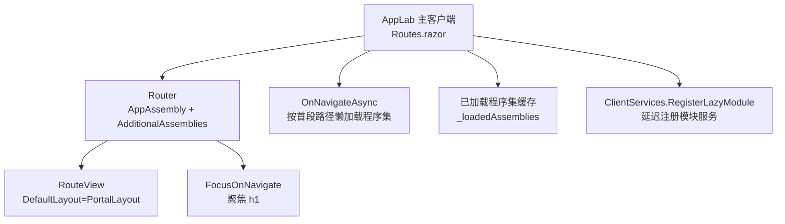
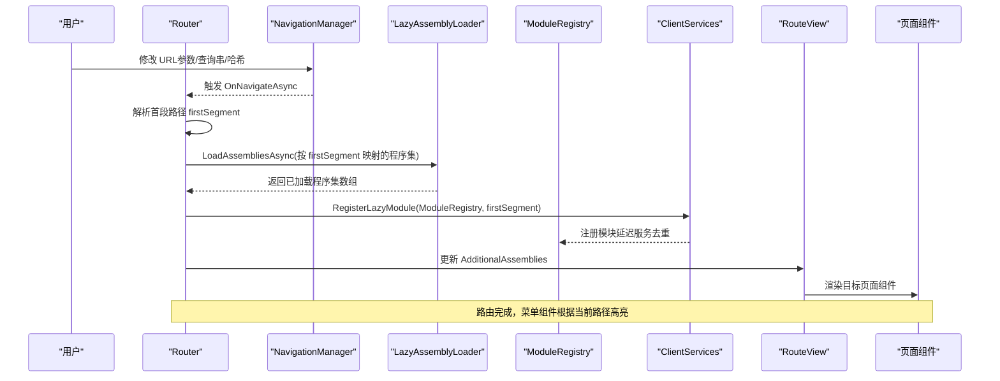
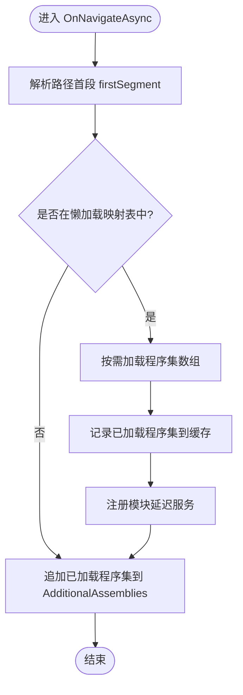
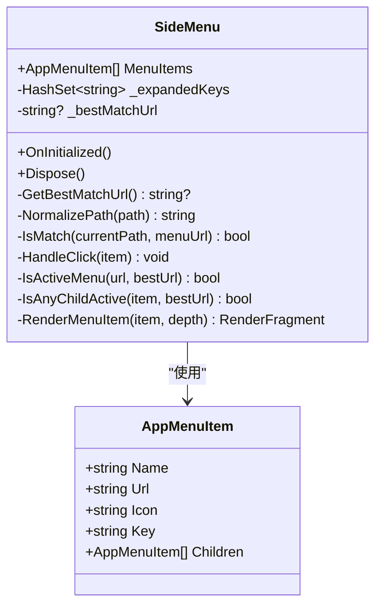
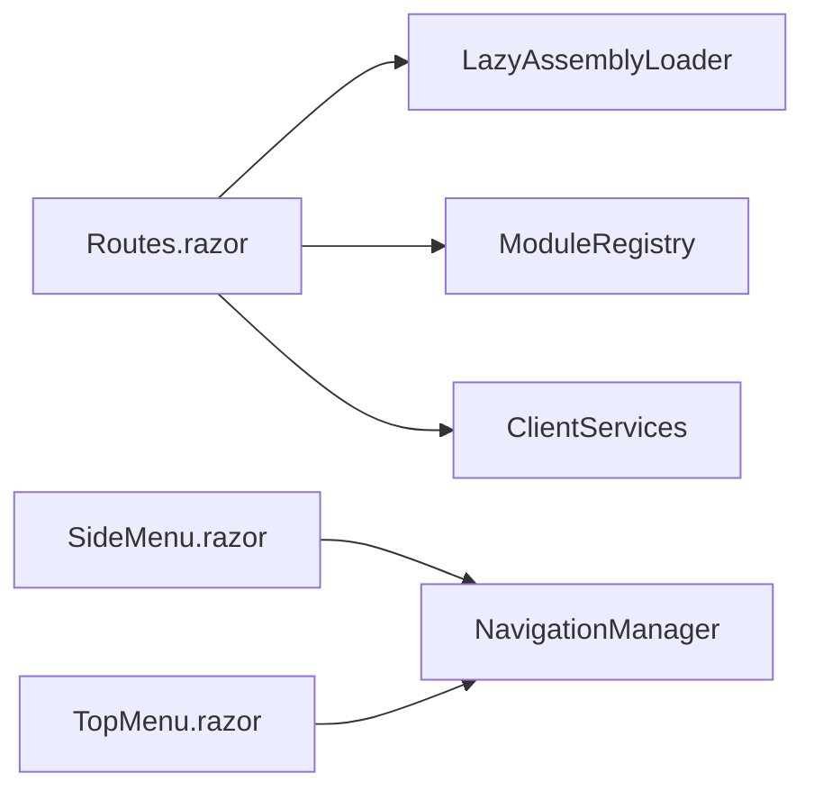

# 路由导航

<cite>
**本文引用的文件**   
- [Routes.razor](file://src/Host/H.AppLab.Host.All/H.AppLab.Host.All.Client/Routes.razor)
- [Routes.razor](file://src/Host/Account/H.Account.Host.Client/Routes.razor)
- [Routes.razor](file://src/Host/RenderEngine/H.LowCode.RenderEngine.Host.Client/Routes.razor)
- [SideMenu.razor](file://src/Components/AppDrawer/H.AppDrawer.Components/Components/SideMenu.razor)
- [TopMenu.razor](file://src/Components/AppDrawer/H.AppDrawer.Components/Components/TopMenu.razor)
- [AppMenuItem.cs](file://src/Components/AppDrawer/H.AppDrawer.Model/AppMenuItem.cs)
- [AppDrawerModels.cs](file://src/Components/AppDrawer/H.AppDrawer.Model/AppDrawerModels.cs)
- [AppData.cs](file://src/Components/AppDrawer/H.AppDrawer.Model/AppData.cs)
</cite>

## 目录
1. [简介](#简介)
2. [项目结构](#项目结构)
3. [核心组件](#核心组件)
4. [架构总览](#架构总览)
5. [详细组件分析](#详细组件分析)
6. [依赖关系分析](#依赖关系分析)
7. [性能考虑](#性能考虑)
8. [故障排查指南](#故障排查指南)
9. [结论](#结论)
10. [附录](#附录)

## 简介
本文件面向 AppLab 的 Blazor 路由与导航系统，系统性阐述以下主题：
- Blazor 路由配置与导航机制（含参数传递、查询字符串处理、路由守卫）
- 应用抽屉中的侧边菜单与顶部菜单实现原理（数据结构、动态生成、权限控制集成）
- 页面间导航最佳实践（懒加载、缓存策略、导航历史管理）
- 路由参数的验证与转换机制
- 嵌套路由、动态路由、条件路由的实现示例
- 路由性能优化与错误处理策略

## 项目结构
AppLab 采用多宿主客户端组织方式，每个宿主模块提供独立的 Router 配置与默认布局。核心路由入口位于各 Host 的 Routes.razor 中，并通过 AdditionalAssemblies 控制程序集加载范围；同时通过 OnNavigateAsync 实现按路径段懒加载模块程序集。

图示来源 
- [Routes.razor:1-125](file://src/Host/H.AppLab.Host.All/H.AppLab.Host.All.Client/Routes.razor#L1-L125)

章节来源
- [Routes.razor:1-125](file://src/Host/H.AppLab.Host.All/H.AppLab.Host.All.Client/Routes.razor#L1-L125)

## 核心组件
- 路由路由器与视图渲染
  - Router：定义 AppAssembly、NotFoundPage、AdditionalAssemblies、OnNavigateAsync
  - RouteView：根据 RouteData 渲染目标组件，并指定 DefaultLayout
  - FocusOnNavigate：路由切换后自动聚焦标题元素
- 懒加载与模块注册
  - LazyAssemblyLoader：按需加载模块程序集
  - ModuleRegistry：模块延迟服务注册中心
  - ClientServices.RegisterLazyModule：按模块 key 去重注册服务
- 菜单组件
  - SideMenu：侧边菜单，支持递归子菜单、激活态匹配、展开折叠
  - TopMenu：顶部菜单，支持激活态匹配与导航跳转
- 数据模型
  - AppMenuItem：菜单项（名称、URL、图标、Key、Children）
  - AppCategoryInfo / AppItemInfo / AppData：应用分类与应用项数据模型

章节来源
- [Routes.razor:1-125](file://src/Host/H.AppLab.Host.All/H.AppLab.Host.All.Client/Routes.razor#L1-L125)
- [SideMenu.razor:1-172](file://src/Components/AppDrawer/H.AppDrawer.Components/Components/SideMenu.razor#L1-L172)
- [TopMenu.razor:1-69](file://src/Components/AppDrawer/H.AppDrawer.Components/Components/TopMenu.razor#L1-L69)
- [AppMenuItem.cs:1-22](file://src/Components/AppDrawer/H.AppDrawer.Model/AppMenuItem.cs#L1-L22)
- [AppDrawerModels.cs:1-74](file://src/Components/AppDrawer/H.AppDrawer.Model/AppDrawerModels.cs#L1-L74)
- [AppData.cs:1-10](file://src/Components/AppDrawer/H.AppDrawer.Model/AppData.cs#L1-L10)

## 架构总览
下图展示了从浏览器 URL 变化到页面渲染的全链路流程，包括路由解析、程序集懒加载、模块服务注册、菜单激活态计算与导航跳转。

图示来源 
- [Routes.razor:1-125](file://src/Host/H.AppLab.Host.All/H.AppLab.Host.All.Client/Routes.razor#L1-L125)

章节来源
- [Routes.razor:1-125](file://src/Host/H.AppLab.Host.All/H.AppLab.Host.All.Client/Routes.razor#L1-L125)

## 详细组件分析

### 路由配置与导航机制（主客户端）
- 路由入口
  - Router 使用 Program 所在程序集作为 AppAssembly，并设置 NotFoundPage 与 DefaultLayout
  - AdditionalAssemblies 初始包含立即加载的程序集，后续在 OnNavigateAsync 中追加懒加载程序集
- 懒加载策略
  - 基于路径首段（如 organization、approval、system、designengine、app 等）精确匹配映射表
  - 首次访问某段路径时，仅下载所需 Web 与 Contracts 程序集，避免全量加载
  - 已加载程序集以 Dictionary 缓存，防止重复下载
- 模块服务注册
  - 程序集就绪后调用 ClientServices.RegisterLazyModule，确保页面渲染前依赖的服务可解析
- 导航钩子
  - OnNavigateAsync 是统一拦截点，可用于鉴权、埋点、预取资源等

图示来源 
- [Routes.razor:1-125](file://src/Host/H.AppLab.Host.All/H.AppLab.Host.All.Client/Routes.razor#L1-L125)

章节来源
- [Routes.razor:1-125](file://src/Host/H.AppLab.Host.All/H.AppLab.Host.All.Client/Routes.razor#L1-L125)

### 路由配置与导航机制（账户与渲染引擎宿主）
- 账户宿主
  - Router 直接注入 Assembly[]，仅包含 Account.Web 的 _Imports 程序集
  - 使用 AccountLayout 作为默认布局
- 渲染引擎宿主
  - Router 使用 LowCodeGlobalVariables 提供的 AdditionalAssemblies 与 DefaultLayout
  - 自定义 NotFound 输出友好提示

章节来源
- [Routes.razor:1-14](file://src/Host/Account/H.Account.Host.Client/Routes.razor#L1-L14)
- [Routes.razor:1-18](file://src/Host/RenderEngine/H.LowCode.RenderEngine.Host.Client/Routes.razor#L1-L18)

### 侧边菜单（SideMenu）实现原理
- 数据结构
  - MenuItems: List<AppMenuItem>，支持递归 Children
  - Key: 用于展开/折叠状态跟踪的唯一标识
- 激活态匹配
  - NormalizePath 去除查询参数与前导/尾部斜杠
  - GetBestMatchUrl 遍历所有菜单项，最长前缀匹配当前路径
  - IsAnyChildActive 递归判断子节点是否激活
- 交互逻辑
  - HandleClick：有子菜单则切换展开；无子菜单且存在 Url 则调用 NavigationManager.NavigateTo
- 生命周期
  - OnInitialized 订阅 LocationChanged，路由变化时刷新激活态
  - Dispose 取消订阅，避免内存泄漏

图示来源 
- [SideMenu.razor:1-172](file://src/Components/AppDrawer/H.AppDrawer.Components/Components/SideMenu.razor#L1-L172)
- [AppMenuItem.cs:1-22](file://src/Components/AppDrawer/H.AppDrawer.Model/AppMenuItem.cs#L1-L22)

章节来源
- [SideMenu.razor:1-172](file://src/Components/AppDrawer/H.AppDrawer.Components/Components/SideMenu.razor#L1-L172)
- [AppMenuItem.cs:1-22](file://src/Components/AppDrawer/H.AppDrawer.Model/AppMenuItem.cs#L1-L22)

### 顶部菜单（TopMenu）实现原理
- 激活态匹配
  - 使用 ToBaseRelativePath 获取相对路径，去除 query/hash 后与菜单 Url 比较
  - 支持前导斜杠统一处理
- 导航跳转
  - NavigateToMenuItem 调用 NavigationManager.NavigateTo，forceLoad=false 保持 SPA 体验

章节来源
- [TopMenu.razor:1-69](file://src/Components/AppDrawer/H.AppDrawer.Components/Components/TopMenu.razor#L1-L69)

### 菜单数据模型与动态生成
- 数据模型
  - AppData：根对象，包含 AppCategories
  - AppCategoryInfo：分类名、可选图标、Apps 列表
  - AppItemInfo：应用 Id、Name、Icon/IconUrl、Url、Target、Description、Enabled、Order
- 动态生成
  - 由后端或配置文件提供 JSON，反序列化为 AppData，再转换为 AppMenuItem 树
  - 可根据 Enabled、Order 进行过滤与排序

章节来源
- [AppData.cs:1-10](file://src/Components/AppDrawer/H.AppDrawer.Model/AppData.cs#L1-L10)
- [AppDrawerModels.cs:1-74](file://src/Components/AppDrawer/H.AppDrawer.Model/AppDrawerModels.cs#L1-L74)
- [AppMenuItem.cs:1-22](file://src/Components/AppDrawer/H.AppDrawer.Model/AppMenuItem.cs#L1-L22)

### 权限控制集成
- 菜单级权限
  - 在构建 AppMenuItem 树时，依据用户角色/权限过滤不可见菜单
  - 对需要鉴权的 Url，可在导航前检查权限，拒绝跳转或重定向至未授权页
- 路由级守卫
  - 在 OnNavigateAsync 中增加鉴权逻辑，必要时阻止导航或跳转到登录/未授权页
- 按钮级权限
  - 页面内组件根据权限决定是否渲染操作按钮

章节来源
- [Routes.razor:1-125](file://src/Host/H.AppLab.Host.All/H.AppLab.Host.All.Client/Routes.razor#L1-L125)
- [SideMenu.razor:1-172](file://src/Components/AppDrawer/H.AppDrawer.Components/Components/SideMenu.razor#L1-L172)
- [TopMenu.razor:1-69](file://src/Components/AppDrawer/H.AppDrawer.Components/Components/TopMenu.razor#L1-L69)

### 页面间导航最佳实践
- 路由懒加载
  - 按路径首段映射程序集，首次访问才下载，减少初始包体积
  - 使用 _loadedAssemblies 缓存已加载程序集，避免重复下载
- 缓存策略
  - 页面级缓存可通过组件状态或外部缓存服务实现
  - 对于只读数据，结合 HttpClient 缓存或内存缓存提升性能
- 导航历史管理
  - 利用 Blazor 内置 History API，避免强制刷新
  - 在需要时通过 NavigationManager.NavigateTo(historyMode: ...) 控制历史记录行为

章节来源
- [Routes.razor:1-125](file://src/Host/H.AppLab.Host.All/H.AppLab.Host.All.Client/Routes.razor#L1-L125)

### 路由参数的验证与转换机制
- 参数类型转换
  - Blazor 路由会自动将查询字符串与路径段转换为强类型参数（如 int、Guid、DateTime）
  - 若转换失败，应提供默认值或在组件内校验并提示
- 参数校验
  - 在组件初始化阶段对参数进行二次校验，确保业务一致性
  - 对非法参数，可重定向到错误页或空状态页
- 查询字符串处理
  - 使用 NavigationManager.Uri 解析查询参数，注意去除 hash 与编码问题

章节来源
- [SideMenu.razor:1-172](file://src/Components/AppDrawer/H.AppDrawer.Components/Components/SideMenu.razor#L1-L172)
- [TopMenu.razor:1-69](file://src/Components/AppDrawer/H.AppDrawer.Components/Components/TopMenu.razor#L1-L69)

### 嵌套路由、动态路由、条件路由示例
- 嵌套路由
  - 使用 @page 模板定义多级路由，父路由承载布局，子路由渲染内容
- 动态路由
  - 使用 {id} 等占位符，配合参数校验与加载逻辑
- 条件路由
  - 在 OnNavigateAsync 中根据用户权限或系统状态决定允许/拒绝导航

章节来源
- [Routes.razor:1-125](file://src/Host/H.AppLab.Host.All/H.AppLab.Host.All.Client/Routes.razor#L1-L125)

### 路由性能优化与错误处理策略
- 性能优化
  - 最小化 AdditionalAssemblies，仅包含必要程序集
  - 合并频繁访问的模块程序集，减少请求次数
  - 使用 CDN 或 HTTP/2 提升程序集下载速度
- 错误处理
  - NotFoundPage 提供友好的 404 页面
  - 在 OnNavigateAsync 中捕获异常并记录日志
  - 对懒加载失败进行重试或降级处理

章节来源
- [Routes.razor:1-125](file://src/Host/H.AppLab.Host.All/H.AppLab.Host.All.Client/Routes.razor#L1-L125)
- [Routes.razor:1-18](file://src/Host/RenderEngine/H.LowCode.RenderEngine.Host.Client/Routes.razor#L1-L18)

## 依赖关系分析
- 组件耦合
  - SideMenu/TopMenu 依赖 NavigationManager 进行导航
  - Routes.razor 依赖 LazyAssemblyLoader、ModuleRegistry、ClientServices
- 外部依赖
  - Blazor Router、NavigationManager、JSRuntime
  - ABP 模块系统（通过 ClientServices 与 ModuleRegistry 集成）

图示来源 
- [Routes.razor:1-125](file://src/Host/H.AppLab.Host.All/H.AppLab.Host.All.Client/Routes.razor#L1-L125)
- [SideMenu.razor:1-172](file://src/Components/AppDrawer/H.AppDrawer.Components/Components/SideMenu.razor#L1-L172)
- [TopMenu.razor:1-69](file://src/Components/AppDrawer/H.AppDrawer.Components/Components/TopMenu.razor#L1-L69)

章节来源
- [Routes.razor:1-125](file://src/Host/H.AppLab.Host.All/H.AppLab.Host.All.Client/Routes.razor#L1-L125)
- [SideMenu.razor:1-172](file://src/Components/AppDrawer/H.AppDrawer.Components/Components/SideMenu.razor#L1-L172)
- [TopMenu.razor:1-69](file://src/Components/AppDrawer/H.AppDrawer.Components/Components/TopMenu.razor#L1-L69)

## 性能考虑
- 程序集懒加载
  - 按路径首段精确映射，避免误匹配（如 /system 与 /systemmanagement）
  - 首次访问后才下载，显著降低首屏时间
- 缓存与去重
  - _loadedAssemblies 避免重复下载
  - ClientServices.RegisterLazyModule 按模块 key 去重注册服务
- 渲染优化
  - FocusOnNavigate 提升可访问性与用户体验
  - 合理拆分 DefaultLayout，减少不必要的重渲染

章节来源
- [Routes.razor:1-125](file://src/Host/H.AppLab.Host.All/H.AppLab.Host.All.Client/Routes.razor#L1-L125)

## 故障排查指南
- 常见问题
  - 404 页面未显示：检查 NotFoundPage 是否正确配置
  - 懒加载失败：确认 LazyAssemblies 映射表与实际程序集名称一致
  - 菜单激活态不正确：检查 NormalizePath 与 IsMatch 逻辑，确保路径格式一致
- 调试建议
  - 在 OnNavigateAsync 中打印 firstSegment 与 toLoad 数组
  - 在 SideMenu/TopMenu 中打印 currentPath 与 target 比较结果
  - 使用浏览器开发者工具查看网络请求与程序集加载情况

章节来源
- [Routes.razor:1-125](file://src/Host/H.AppLab.Host.All/H.AppLab.Host.All.Client/Routes.razor#L1-L125)
- [SideMenu.razor:1-172](file://src/Components/AppDrawer/H.AppDrawer.Components/Components/SideMenu.razor#L1-L172)
- [TopMenu.razor:1-69](file://src/Components/AppDrawer/H.AppDrawer.Components/Components/TopMenu.razor#L1-L69)

## 结论
AppLab 的路由导航系统以 Blazor Router 为核心，结合懒加载与模块注册机制，实现了高性能、可扩展的前端导航能力。侧边与顶部菜单通过统一的激活态匹配算法与导航接口，提供了良好的用户体验。通过合理的权限控制、参数校验与错误处理策略，系统具备健壮性与可维护性。

## 附录
- 术语
  - 路由守卫：在导航前后执行的鉴权或拦截逻辑
  - 懒加载：按需加载程序集或组件，减少初始包体积
  - 激活态：当前路由对应的菜单项高亮状态
- 参考文件
  - 路由配置：[Routes.razor:1-125](file://src/Host/H.AppLab.Host.All/H.AppLab.Host.All.Client/Routes.razor#L1-L125)
  - 侧边菜单：[SideMenu.razor:1-172](file://src/Components/AppDrawer/H.AppDrawer.Components/Components/SideMenu.razor#L1-L172)
  - 顶部菜单：[TopMenu.razor:1-69](file://src/Components/AppDrawer/H.AppDrawer.Components/Components/TopMenu.razor#L1-L69)
  - 数据模型：[AppMenuItem.cs:1-22](file://src/Components/AppDrawer/H.AppDrawer.Model/AppMenuItem.cs#L1-L22)、[AppDrawerModels.cs:1-74](file://src/Components/AppDrawer/H.AppDrawer.Model/AppDrawerModels.cs#L1-L74)、[AppData.cs:1-10](file://src/Components/AppDrawer/H.AppDrawer.Model/AppData.cs#L1-L10)