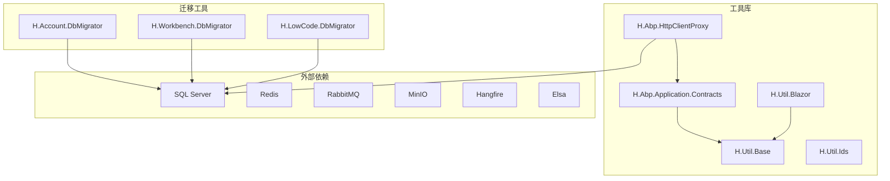
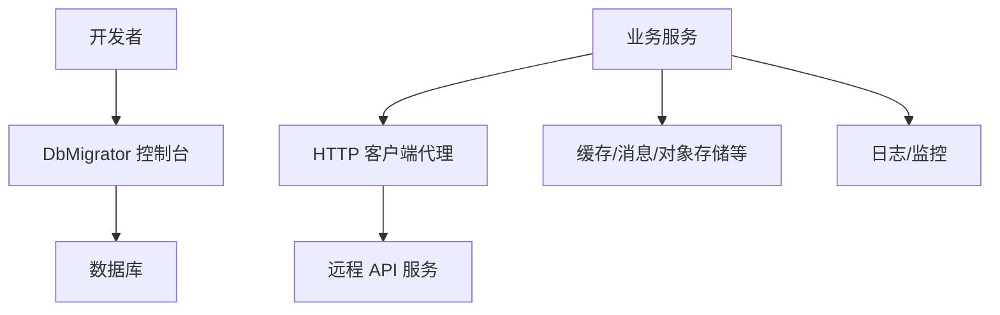
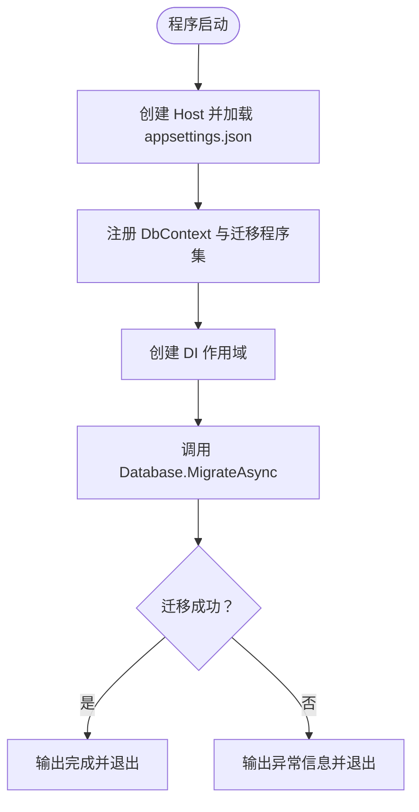
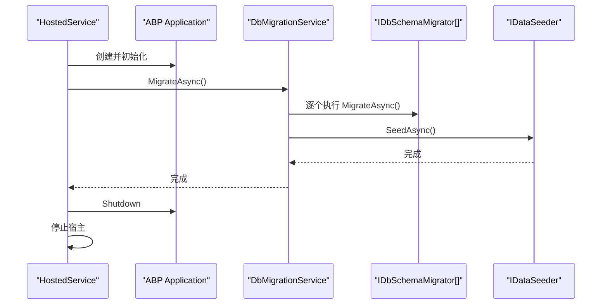
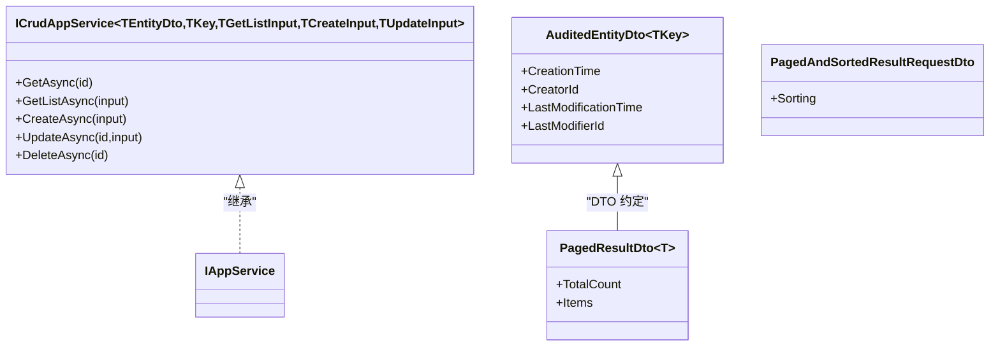
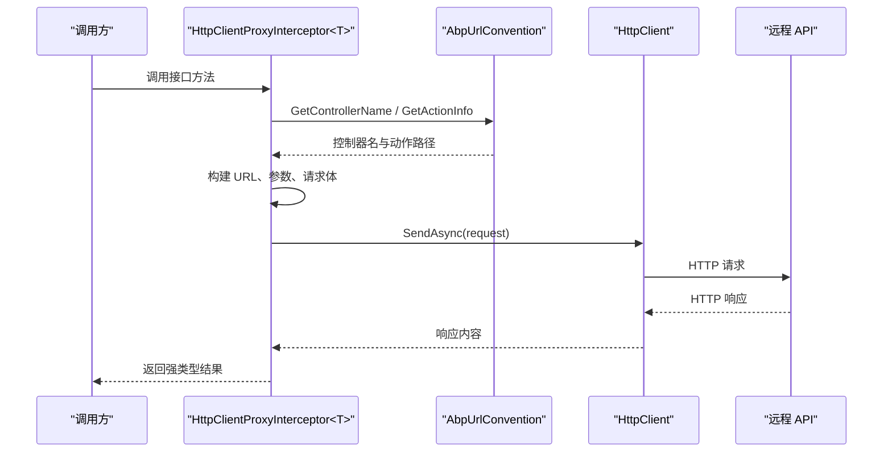
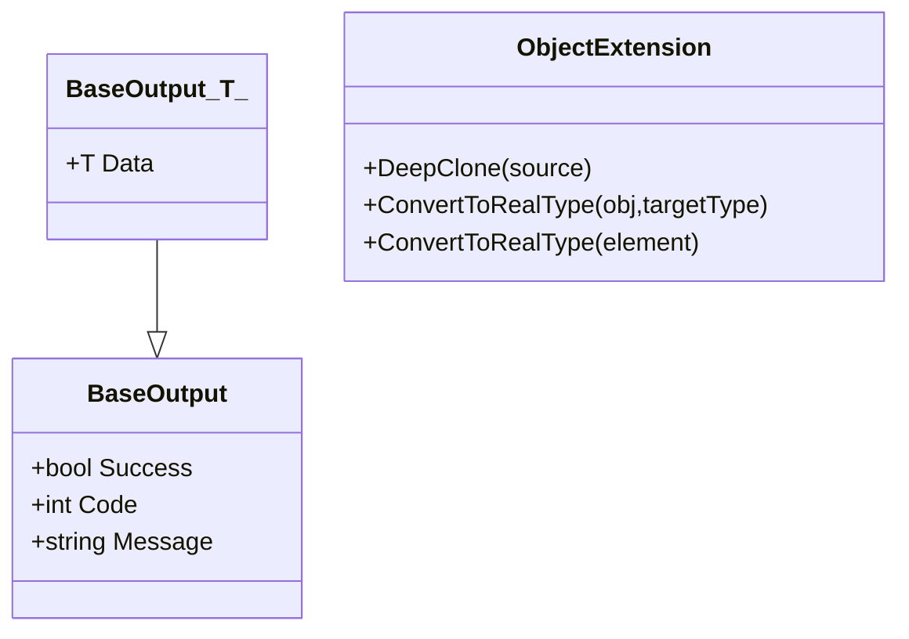
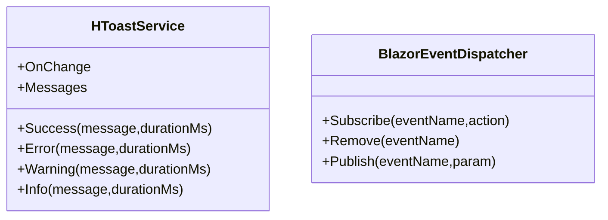
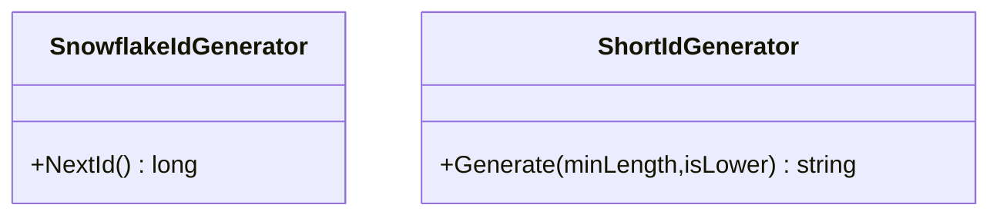
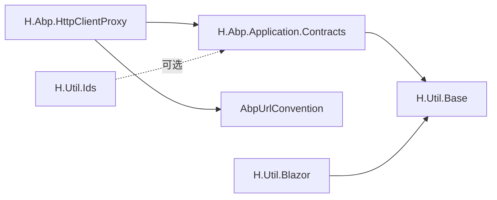

# 基础设施

<cite>
**本文引用的文件列表**   
- [H.Account.DbMigrator/Program.cs](file://src/Tools/H.Account.DbMigrator/Program.cs)
- [H.Account.DbMigrator/appsettings.json](file://src/Tools/H.Account.DbMigrator/appsettings.json)
- [H.Workbench.DbMigrator/Program.cs](file://src/Tools/H.Workbench.DbMigrator/Program.cs)
- [H.LowCode.DbMigrator/DbMigrationService.cs](file://src/Tools/H.LowCode.DbMigrator/DbMigrationService.cs)
- [H.LowCode.DbMigrator/HostedService.cs](file://src/Tools/H.LowCode.DbMigrator/HostedService.cs)
- [H.LowCode.DbMigrator/appsettings.json](file://src/Tools/H.LowCode.DbMigrator/appsettings.json)
- [IAppService.cs](file://src/Utils/H.Abp.Application.Contracts/IAppService.cs)
- [ICrudAppService.cs](file://src/Utils/H.Abp.Application.Contracts/ICrudAppService.cs)
- [AuditedEntityDto.cs](file://src/Utils/H.Abp.Application.Contracts/AuditedEntityDto.cs)
- [PagedResultDto.cs](file://src/Utils/H.Abp.Application.Contracts/PagedResultDto.cs)
- [PagedAndSortedResultRequestDto.cs](file://src/Utils/H.Abp.Application.Contracts/PagedAndSortedResultRequestDto.cs)
- [ServiceCollectionExtensions.cs](file://src/Utils/H.Abp.HttpClientProxy/ServiceCollectionExtensions.cs)
- [HttpClientProxyInterceptor.cs](file://src/Utils/H.Abp.HttpClientProxy/HttpClientProxyInterceptor.cs)
- [AbpUrlConvention.cs](file://src/Utils/H.Abp.HttpClientProxy/AbpUrlConvention.cs)
- [BaseOutput.cs](file://src/Utils/H.Util.Base/BaseOutput.cs)
- [ObjectExtension.cs](file://src/Utils/H.Util.Base/ObjectExtension.cs)
- [HToastService.cs](file://src/Utils/H.Util.Blazor/HToastService.cs)
- [BlazorEventDispatcher.cs](file://src/Utils/H.Util.Blazor/BlazorEventDispatcher.cs)
- [SnowflakeIdGenerator.cs](file://src/Utils/H.Util.Ids/SnowflakeIdGenerator.cs)
- [ShortIdGenerator.cs](file://src/Utils/H.Util.Ids/ShortIdGenerator.cs)
</cite>

## 目录
1. [引言](#引言)
2. [项目结构](#项目结构)
3. [核心组件](#核心组件)
4. [架构总览](#架构总览)
5. [详细组件分析](#详细组件分析)
6. [依赖关系分析](#依赖关系分析)
7. [性能与容量规划](#性能与容量规划)
8. [监控、日志与错误处理](#监控日志与错误处理)
9. [配置管理策略](#配置管理策略)
10. [故障排查指南](#故障排查指南)
11. [结论](#结论)

## 引言
本文件面向 AppLab 的基础设施层，重点说明以下内容：
- 数据库迁移工具链：各服务的 DbMigrator 控制台程序如何启动、读取配置、执行 EF Core 迁移。
- Utils 工具库的核心组件：通用 DTO 基类、HTTP 客户端代理、基础扩展方法、Blazor 辅助组件、ID 生成器。
- 外部依赖集成现状与可落地建议：Redis 分布式缓存、RabbitMQ 消息队列、MinIO 对象存储、Hangfire 后台任务调度、Elsa 工作流引擎。
- 配置管理策略：appsettings.json 的组织方式与敏感信息的安全处理建议。
- 横切关注点：监控、日志记录与错误处理的实现方式。
- 性能优化建议与容量规划指导。

## 项目结构
仓库以 src 为根组织多个领域服务与共享工具：
- Tools：每个业务域（Account、Approval、BackgroundTask、Enterprise、File、LowCode、Notification、Order、Organization、Setting、SupplyChain、Testing、Workbench）对应一个 DbMigrator 控制台程序，负责各自数据库的迁移与数据初始化。
- Utils：跨服务共享的通用能力，包括应用契约、HTTP 客户端代理、基础类型扩展、Blazor UI 辅助和 ID 生成。
- Services/LowCode/System/Agent/Host：业务模块与宿主入口，不在此文档展开细节。



图表来源
- [H.Account.DbMigrator/Program.cs:1-59](file://src/Tools/H.Account.DbMigrator/Program.cs#L1-L59)
- [H.Workbench.DbMigrator/Program.cs:1-57](file://src/Tools/H.Workbench.DbMigrator/Program.cs#L1-L57)
- [H.LowCode.DbMigrator/DbMigrationService.cs:1-58](file://src/Tools/H.LowCode.DbMigrator/DbMigrationService.cs#L1-L58)
- [ServiceCollectionExtensions.cs:1-63](file://src/Utils/H.Abp.HttpClientProxy/ServiceCollectionExtensions.cs#L1-L63)

章节来源
- [H.Account.DbMigrator/Program.cs:1-59](file://src/Tools/H.Account.DbMigrator/Program.cs#L1-L59)
- [H.Workbench.DbMigrator/Program.cs:1-57](file://src/Tools/H.Workbench.DbMigrator/Program.cs#L1-L57)
- [H.LowCode.DbMigrator/DbMigrationService.cs:1-58](file://src/Tools/H.LowCode.DbMigrator/DbMigrationService.cs#L1-L58)

## 核心组件
本节概述基础设施层的关键组成：
- 数据库迁移工具：每个域一个 DbMigrator 控制台程序，统一通过 Host 构建器加载 appsettings.json，注册 DbContext，并调用 Database.MigrateAsync 执行迁移；LowCode 版本基于 ABP 托管服务完成多应用的数据种子。
- 工具库：
  - H.Abp.Application.Contracts：定义 IAppService 标记接口、CRUD 应用服务接口及通用分页、审计 DTO。
  - H.Abp.HttpClientProxy：基于 DispatchProxy 的 HTTP 客户端代理，将 C# 接口映射到 ABP 风格的 REST API。
  - H.Util.Base：统一输出包装 BaseOutput<T>、对象序列化与类型转换扩展。
  - H.Util.Blazor：全局 Toast 提示服务和 Blazor 事件分发器。
  - H.Util.Ids：雪花 ID 生成器和短码 ID 生成器。

章节来源
- [IAppService.cs:1-8](file://src/Utils/H.Abp.Application.Contracts/IAppService.cs#L1-L8)
- [ICrudAppService.cs:1-15](file://src/Utils/H.Abp.Application.Contracts/ICrudAppService.cs#L1-L15)
- [BaseOutput.cs:1-52](file://src/Utils/H.Util.Base/BaseOutput.cs#L1-L52)
- [HToastService.cs:1-82](file://src/Utils/H.Util.Blazor/HToastService.cs#L1-L82)
- [SnowflakeIdGenerator.cs:1-90](file://src/Utils/H.Util.Ids/SnowflakeIdGenerator.cs#L1-L90)
- [ShortIdGenerator.cs:1-62](file://src/Utils/H.Util.Ids/ShortIdGenerator.cs#L1-L62)

## 架构总览
AppLab 的基础设施由“迁移工具 + 工具库 + 外部依赖”三部分构成。迁移工具在部署时独立运行，确保数据库结构与种子数据就绪；工具库被各服务引用，提供统一的 DTO、HTTP 客户端代理、UI 辅助和 ID 生成；外部依赖由服务运行时按需接入。



图表来源
- [H.Account.DbMigrator/Program.cs:1-59](file://src/Tools/H.Account.DbMigrator/Program.cs#L1-L59)
- [H.LowCode.DbMigrator/HostedService.cs:1-47](file://src/Tools/H.LowCode.DbMigrator/HostedService.cs#L1-L47)
- [ServiceCollectionExtensions.cs:1-63](file://src/Utils/H.Abp.HttpClientProxy/ServiceCollectionExtensions.cs#L1-L63)
- [HttpClientProxyInterceptor.cs:1-200](file://src/Utils/H.Abp.HttpClientProxy/HttpClientProxyInterceptor.cs#L1-L200)

## 详细组件分析

### 数据库迁移工具链

#### 简单模式：单服务迁移（Account、Workbench 等）
典型流程：
- 使用 Host.CreateDefaultBuilder 创建主机。
- 从当前目录加载 appsettings.json。
- 根据 ConnectionStrings 中的连接字符串注册 EF Core DbContext。
- 在作用域中获取 DbContext 并调用 Database.MigrateAsync。
- 捕获异常并通过 Console 输出成功或失败信息。



图表来源
- [H.Account.DbMigrator/Program.cs:1-59](file://src/Tools/H.Account.DbMigrator/Program.cs#L1-L59)
- [H.Workbench.DbMigrator/Program.cs:1-57](file://src/Tools/H.Workbench.DbMigrator/Program.cs#L1-L57)

关键要点
- Account 迁移器使用自定义 MigratorDbContext，避免 AbpDbContext 对 ABP 模块系统的依赖，适合在迁移阶段直接配置模型。
- Workbench 迁移器直接使用领域 DbContext，同样通过 MigrationsAssembly 指定迁移文件所在程序集。
- 所有简单迁移器都只执行架构迁移，不负责数据种子。

章节来源
- [H.Account.DbMigrator/Program.cs:1-59](file://src/Tools/H.Account.DbMigrator/Program.cs#L1-L59)
- [H.Workbench.DbMigrator/Program.cs:1-57](file://src/Tools/H.Workbench.DbMigrator/Program.cs#L1-L57)

#### 复杂模式：LowCode 多应用迁移与数据种子
LowCode 迁移器基于 ABP 框架，采用托管服务生命周期：
- HostedService.StartAsync 创建 AbpApplication，替换配置、添加 Serilog 日志、启用数据迁移环境。
- 初始化后解析 DbMigrationService 并执行 MigrateAsync。
- DbMigrationService 先遍历 IDbSchemaMigrator 执行架构迁移，再按应用逐个执行数据种子。
- 完成后关闭 ABP 应用并停止宿主。



图表来源
- [H.LowCode.DbMigrator/HostedService.cs:1-47](file://src/Tools/H.LowCode.DbMigrator/HostedService.cs#L1-L47)
- [H.LowCode.DbMigrator/DbMigrationService.cs:1-58](file://src/Tools/H.LowCode.DbMigrator/DbMigrationService.cs#L1-L58)

关键要点
- LowCode 迁移器同时承担架构迁移和数据种子职责，且支持多应用上下文。
- 使用 Serilog 作为日志后端，便于在生产环境中集中收集日志。
- 迁移顺序明确：先架构，后数据；多应用场景下依次处理。

章节来源
- [H.LowCode.DbMigrator/HostedService.cs:1-47](file://src/Tools/H.LowCode.DbMigrator/HostedService.cs#L1-L47)
- [H.LowCode.DbMigrator/DbMigrationService.cs:1-58](file://src/Tools/H.LowCode.DbMigrator/DbMigrationService.cs#L1-L58)

### 工具库：H.Abp.Application.Contracts
该库提供与 ABP 兼容的应用契约与 DTO，帮助前端或服务间保持一致的请求响应格式。

- IAppService：标记接口，用于标识可通过 HTTP 代理远程调用的服务接口。
- ICrudAppService<TEntityDto, TKey, TGetListInput, TCreateInput, TUpdateInput>：定义标准 CRUD 操作，返回 BaseOutput 包装结果。
- AuditedEntityDto<TKey>：继承 EntityDto<TKey>，增加创建时间、创建者、最后修改时间和最后修改者字段。
- PagedResultDto<T>：分页结果，包含 TotalCount 与 Items。
- PagedAndSortedResultRequestDto：分页排序请求 DTO。



图表来源
- [IAppService.cs:1-8](file://src/Utils/H.Abp.Application.Contracts/IAppService.cs#L1-L8)
- [ICrudAppService.cs:1-15](file://src/Utils/H.Abp.Application.Contracts/ICrudAppService.cs#L1-L15)
- [AuditedEntityDto.cs:1-9](file://src/Utils/H.Abp.Application.Contracts/AuditedEntityDto.cs#L1-L9)
- [PagedResultDto.cs:1-19](file://src/Utils/H.Abp.Application.Contracts/PagedResultDto.cs#L1-L19)
- [PagedAndSortedResultRequestDto.cs:1-9](file://src/Utils/H.Abp.Application.Contracts/PagedAndSortedResultRequestDto.cs#L1-L9)

章节来源
- [IAppService.cs:1-8](file://src/Utils/H.Abp.Application.Contracts/IAppService.cs#L1-L8)
- [ICrudAppService.cs:1-15](file://src/Utils/H.Abp.Application.Contracts/ICrudAppService.cs#L1-L15)
- [AuditedEntityDto.cs:1-9](file://src/Utils/H.Abp.Application.Contracts/AuditedEntityDto.cs#L1-L9)
- [PagedResultDto.cs:1-19](file://src/Utils/H.Abp.Application.Contracts/PagedResultDto.cs#L1-L19)
- [PagedAndSortedResultRequestDto.cs:1-9](file://src/Utils/H.Abp.Application.Contracts/PagedAndSortedResultRequestDto.cs#L1-L9)

### 工具库：H.Abp.HttpClientProxy
该库提供基于 C# 接口的 HTTP 客户端代理，自动将接口方法映射到 ABP 风格 URL，并序列化为 JSON。

- ServiceCollectionExtensions.AddRemoteServices：从 IConfiguration 的 RemoteServices 节点读取各远程服务的 BaseUrl。
- ServiceCollectionExtensions.AddHttpClientProxies：扫描程序集中继承 IAppService 的接口，注册代理实例。
- HttpClientProxyInterceptor：使用 DispatchProxy 拦截方法调用，构建 URL、参数、请求体，发送请求并反序列化响应。
- AbpUrlConvention：实现 ABP 路由约定，包括控制器名称、HTTP 动词和方法名映射。



图表来源
- [ServiceCollectionExtensions.cs:1-63](file://src/Utils/H.Abp.HttpClientProxy/ServiceCollectionExtensions.cs#L1-L63)
- [HttpClientProxyInterceptor.cs:1-200](file://src/Utils/H.Abp.HttpClientProxy/HttpClientProxyInterceptor.cs#L1-L200)
- [AbpUrlConvention.cs:1-86](file://src/Utils/H.Abp.HttpClientProxy/AbpUrlConvention.cs#L1-L86)

关键要点
- 远程服务配置集中在 RemoteServices 节点，便于按环境切换 BaseUrl。
- URL 生成遵循 ABP 约定：接口名转 kebab-case，方法名前缀决定 HTTP 动词。
- 参数处理区分简单类型与复杂类型：简单类型走查询字符串，复杂类型 POST/PUT 走请求体。
- 不支持非 Task 和非 Task<T> 的返回类型，需保持一致。

章节来源
- [ServiceCollectionExtensions.cs:1-63](file://src/Utils/H.Abp.HttpClientProxy/ServiceCollectionExtensions.cs#L1-L63)
- [HttpClientProxyInterceptor.cs:1-200](file://src/Utils/H.Abp.HttpClientProxy/HttpClientProxyInterceptor.cs#L1-L200)
- [AbpUrlConvention.cs:1-86](file://src/Utils/H.Abp.HttpClientProxy/AbpUrlConvention.cs#L1-L86)

### 工具库：H.Util.Base
- BaseOutput 与 BaseOutput<T>：统一 API 响应包装，包含 Success、Code、Message 以及可选 Data。
- ObjectExtension：提供深拷贝、JsonElement 到目标类型的转换、字典与列表递归转换等实用方法。



图表来源
- [BaseOutput.cs:1-52](file://src/Utils/H.Util.Base/BaseOutput.cs#L1-L52)
- [ObjectExtension.cs:1-105](file://src/Utils/H.Util.Base/ObjectExtension.cs#L1-L105)

章节来源
- [BaseOutput.cs:1-52](file://src/Utils/H.Util.Base/BaseOutput.cs#L1-L52)
- [ObjectExtension.cs:1-105](file://src/Utils/H.Util.Base/ObjectExtension.cs#L1-L105)

### 工具库：H.Util.Blazor
- HToastService：Scoped 生命周期的全局 Toast 提示服务，支持 Success/Error/Warning/Info，自动定时消失。
- BlazorEventDispatcher：静态事件总线，用于跨组件发布/订阅事件。



图表来源
- [HToastService.cs:1-82](file://src/Utils/H.Util.Blazor/HToastService.cs#L1-L82)
- [BlazorEventDispatcher.cs:1-47](file://src/Utils/H.Util.Blazor/BlazorEventDispatcher.cs#L1-L47)

章节来源
- [HToastService.cs:1-82](file://src/Utils/H.Util.Blazor/HToastService.cs#L1-L82)
- [BlazorEventDispatcher.cs:1-47](file://src/Utils/H.Util.Blazor/BlazorEventDispatcher.cs#L1-L47)

### 工具库：H.Util.Ids
- SnowflakeIdGenerator：分布式雪花 ID 生成器，使用时间戳、数据中心 ID、机器 ID 和序列号组合，保证单调递增且全局唯一。
- ShortIdGenerator：基于 Sqids 的短码 ID 生成器，适合对外暴露的可读 ID。



图表来源
- [SnowflakeIdGenerator.cs:1-90](file://src/Utils/H.Util.Ids/SnowflakeIdGenerator.cs#L1-L90)
- [ShortIdGenerator.cs:1-62](file://src/Utils/H.Util.Ids/ShortIdGenerator.cs#L1-L62)

章节来源
- [SnowflakeIdGenerator.cs:1-90](file://src/Utils/H.Util.Ids/SnowflakeIdGenerator.cs#L1-L90)
- [ShortIdGenerator.cs:1-62](file://src/Utils/H.Util.Ids/ShortIdGenerator.cs#L1-L62)

## 依赖关系分析
- 迁移工具依赖 SQL Server 与 EF Core；LowCode 迁移器额外依赖 ABP 数据迁移与数据种子机制。
- HTTP 客户端代理依赖 System.Net.Http 与 System.Text.Json，并通过反射动态生成代理实例。
- 工具库之间耦合度低：Application.Contracts 仅依赖 BaseOutput；HttpClientProxy 依赖 Application.Contracts 与 ABP URL 约定；Blazor 工具与 ID 生成器相互独立。



图表来源
- [ICrudAppService.cs:1-15](file://src/Utils/H.Abp.Application.Contracts/ICrudAppService.cs#L1-L15)
- [BaseOutput.cs:1-52](file://src/Utils/H.Util.Base/BaseOutput.cs#L1-L52)
- [ServiceCollectionExtensions.cs:1-63](file://src/Utils/H.Abp.HttpClientProxy/ServiceCollectionExtensions.cs#L1-L63)
- [AbpUrlConvention.cs:1-86](file://src/Utils/H.Abp.HttpClientProxy/AbpUrlConvention.cs#L1-L86)

章节来源
- [ICrudAppService.cs:1-15](file://src/Utils/H.Abp.Application.Contracts/ICrudAppService.cs#L1-L15)
- [ServiceCollectionExtensions.cs:1-63](file://src/Utils/H.Abp.HttpClientProxy/ServiceCollectionExtensions.cs#L1-L63)
- [AbpUrlConvention.cs:1-86](file://src/Utils/H.Abp.HttpClientProxy/AbpUrlConvention.cs#L1-L86)

## 性能与容量规划

### 数据库迁移
- 建议在部署流水线中先执行迁移，再启动服务，避免首次启动时的阻塞。
- 对于大表迁移，建议分批执行并在迁移前评估锁等待与 IO 压力。
- LowCode 多应用种子数据应分应用串行执行，避免并发竞争同一资源。

### HTTP 客户端代理
- 合理设置 HttpClientFactory 的连接池与超时，避免高并发下的连接耗尽。
- 对远程 API 调用增加重试与熔断策略，提升容错能力。
- 避免在高频路径中进行复杂参数展开，减少序列化开销。

### ID 生成
- 雪花 ID 生成器使用全局锁，单机并发受限于临界区；在高吞吐场景建议结合 Redis 序列或数据库自增键做水平扩展。
- 短码 ID 适用于对外展示，注意随机数范围与碰撞概率。

### 外部依赖容量规划
- Redis：根据缓存命中率与内存使用调整实例规格，热点键分区存储。
- RabbitMQ：按队列长度与消费延迟监控扩容节点，避免死信堆积。
- MinIO：根据对象大小与 QPS 选择合适副本与纠删码策略。
- Hangfire：按作业数量与执行时长规划 Worker 数量与持久化存储。
- Elsa：按流程实例数与活动复杂度规划 CPU 与内存。

[本节为通用建议，不直接分析具体文件]

## 监控、日志与错误处理

### 日志记录
- LowCode 迁移器已集成 Serilog，可在生产环境对接集中式日志平台。
- 其他迁移器使用 Console 输出，建议在生产容器化部署时将标准输出重定向到日志系统。

### 错误处理
- 迁移器统一捕获异常并输出堆栈，便于快速定位连接字符串、权限或迁移脚本问题。
- HTTP 客户端代理在响应失败时抛出异常，建议在上层增加统一错误处理与用户友好提示。

### 监控建议
- 对数据库连接池、迁移耗时、API 调用成功率与延迟进行指标采集。
- 对 Redis、RabbitMQ、MinIO、Hangfire、Elsa 分别建立健康检查与告警规则。

章节来源
- [H.LowCode.DbMigrator/HostedService.cs:1-47](file://src/Tools/H.LowCode.DbMigrator/HostedService.cs#L1-L47)
- [H.Account.DbMigrator/Program.cs:1-59](file://src/Tools/H.Account.DbMigrator/Program.cs#L1-L59)

## 配置管理策略

### appsettings.json 组织方式
- 各 DbMigrator 程序均从当前目录加载 appsettings.json，ConnectionStrings 节点存放数据库连接串。
- LowCode 迁移器额外使用 Meta.appsFilePath 指定低代码元数据目录，便于多应用数据种子。

```json
{
  "ConnectionStrings": {
    "AccountDb": "Server=(localdb)\\mssqllocaldb;Database=AccountDb;Trusted_Connection=true;"
  }
}
```

```json
{
  "ConnectionStrings": {
    "LowCodeDb": "Server=(localdb)\\MSSQLLocalDB;Database=H_LowCode;Trusted_Connection=True;TrustServerCertificate=True"
  },
  "Meta": {
    "appsFilePath": "../../LowCode/meta/apps"
  }
}
```

### 敏感信息安全处理
- 开发环境可使用本地连接串，生产环境建议使用环境变量或密钥管理服务注入 ConnectionStrings。
- RemoteServices.BaseUrl 应按环境区分，避免硬编码域名。
- 不建议将敏感信息提交至代码仓库，使用 .gitignore 与 CI/CD 安全策略保护。

章节来源
- [H.Account.DbMigrator/appsettings.json:1-5](file://src/Tools/H.Account.DbMigrator/appsettings.json#L1-L5)
- [H.LowCode.DbMigrator/appsettings.json:1-8](file://src/Tools/H.LowCode.DbMigrator/appsettings.json#L1-L8)

## 故障排查指南

### 迁移失败
- 检查 appsettings.json 中的 ConnectionStrings 是否正确。
- 确认数据库服务可达、账号具备建表与写入权限。
- 查看迁移程序集是否指向正确命名空间。
- 对 LowCode 迁移器，检查 ABP 模块初始化与 Serilog 配置是否正常。

### HTTP 代理异常
- 确认 RemoteServices 节点配置了正确的 BaseUrl。
- 检查接口方法名是否符合 ABP 约定，例如 GetList、GetAll、Get、Put、Update、Delete、Remove、Create、Add、Insert、Post、Patch。
- 验证返回类型是否为 Task 或 Task<T>。
- 检查复杂参数是否被正确放入请求体或查询字符串。

### Blazor 提示与事件
- HToastService 消息未显示时，检查组件是否正确订阅 OnChange 事件。
- BlazorEventDispatcher 发布事件时报不存在异常，需确认事件名一致且已订阅。

章节来源
- [H.Account.DbMigrator/Program.cs:1-59](file://src/Tools/H.Account.DbMigrator/Program.cs#L1-L59)
- [H.LowCode.DbMigrator/HostedService.cs:1-47](file://src/Tools/H.LowCode.DbMigrator/HostedService.cs#L1-L47)
- [ServiceCollectionExtensions.cs:1-63](file://src/Utils/H.Abp.HttpClientProxy/ServiceCollectionExtensions.cs#L1-L63)
- [AbpUrlConvention.cs:1-86](file://src/Utils/H.Abp.HttpClientProxy/AbpUrlConvention.cs#L1-L86)
- [HToastService.cs:1-82](file://src/Utils/H.Util.Blazor/HToastService.cs#L1-L82)
- [BlazorEventDispatcher.cs:1-47](file://src/Utils/H.Util.Blazor/BlazorEventDispatcher.cs#L1-L47)

## 结论
AppLab 的基础设施层以迁移工具与工具库为核心，提供统一的数据库迁移流程、标准化的应用契约、HTTP 客户端代理、基础扩展、Blazor 辅助与 ID 生成能力。当前仓库已具备清晰的迁移与工具链结构，外部依赖（Redis、RabbitMQ、MinIO、Hangfire、Elsa）可在服务运行时按需集成。建议在生产环境中完善配置安全管理、日志集中化与监控告警，并根据业务规模制定容量规划与性能优化策略。