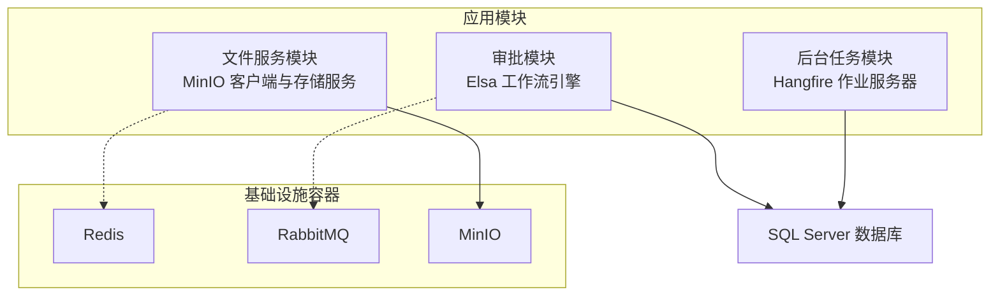
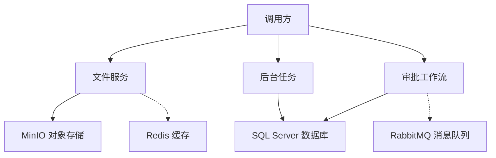
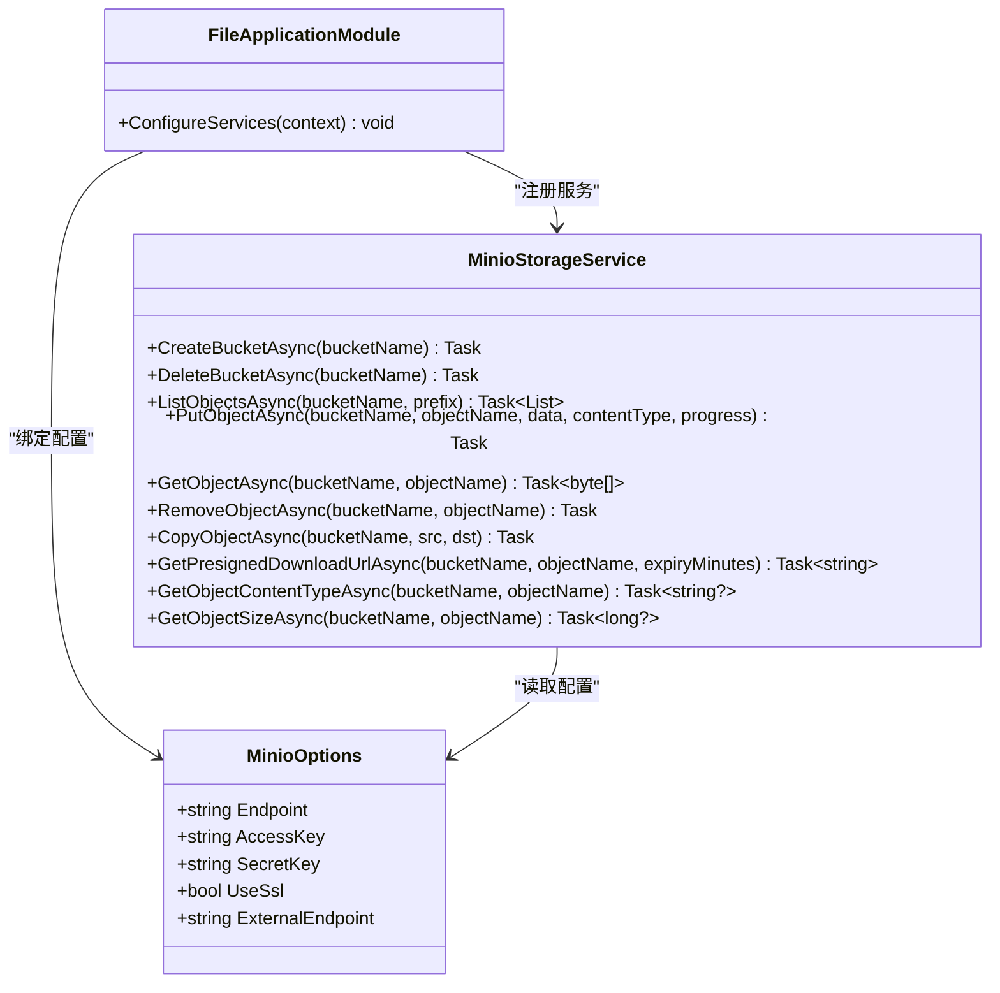
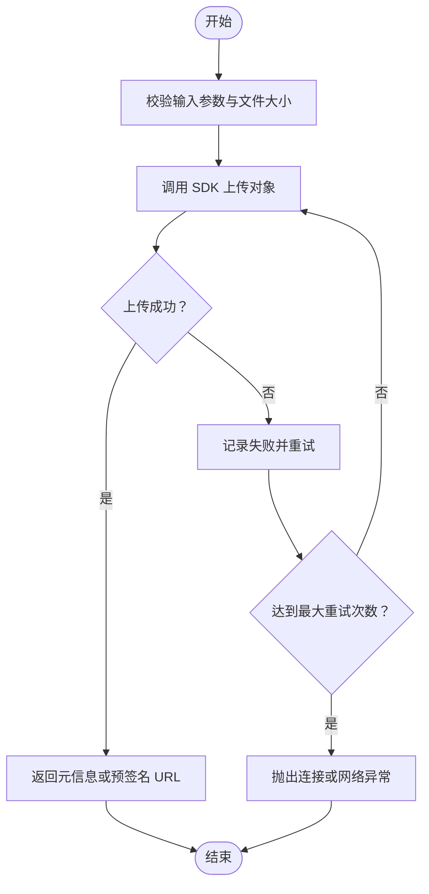
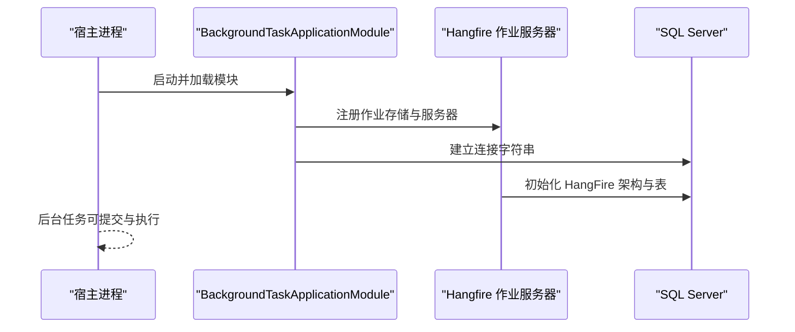
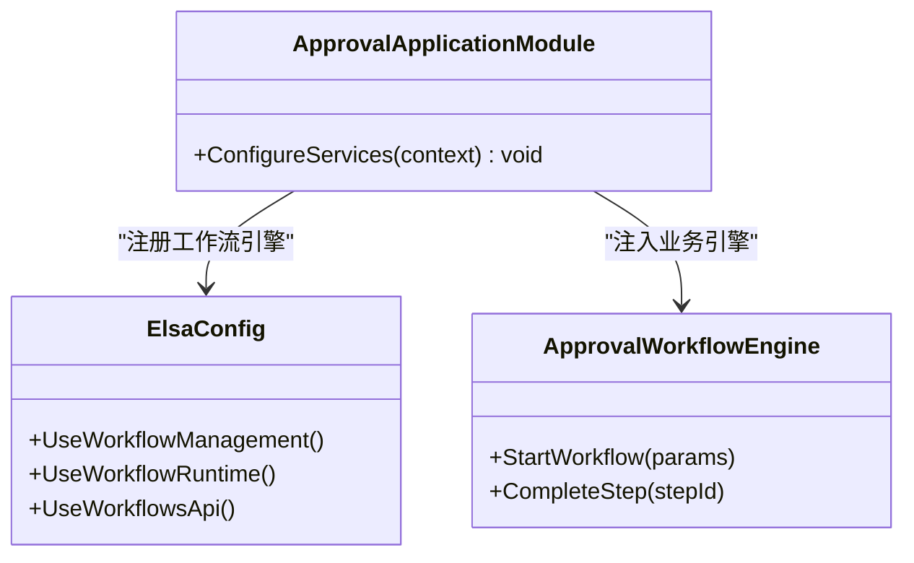
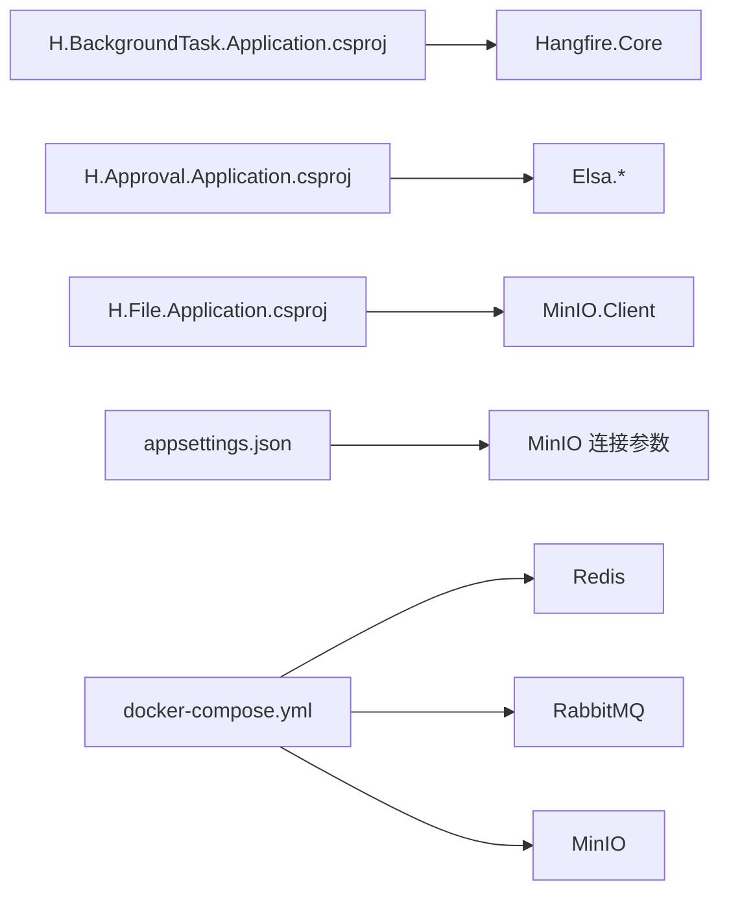

# 外部服务集成

<cite>
**本文引用的文件**
- [docker-compose.yml](file://cd/docker-compose.yml)
- [appsettings.json](file://src/Host/H.AppLab.Web.Host/H.AppLab.Web.Host/appsettings.json)
- [MinioOptions.cs](file://src/Services/File/H.File.Application/MinioOptions.cs)
- [FileApplicationModule.cs](file://src/Services/File/H.File.Application/FileApplicationModule.cs)
- [MinioStorageService.cs](file://src/Services/File/H.File.Application/Services/MinioStorageService.cs)
- [BackgroundTaskApplicationModule.cs](file://src/Services/BackgroundTask/H.BackgroundTask.Application/BackgroundTaskApplicationModule.cs)
- [ApprovalApplicationModule.cs](file://src/Services/Approval/H.Approval.Application/ApprovalApplicationModule.cs)
- [H.BackgroundTask.Application.csproj](file://src/Services/BackgroundTask/H.BackgroundTask.Application/H.BackgroundTask.Application.csproj)
- [H.Approval.Application.csproj](file://src/Services/Approval/H.Approval.Application/H.Approval.Application.csproj)
</cite>

## 目录
1. [简介](#简介)
2. [项目结构](#项目结构)
3. [核心组件](#核心组件)
4. [架构总览](#架构总览)
5. [详细组件分析](#详细组件分析)
6. [依赖关系分析](#依赖关系分析)
7. [性能与容量规划](#性能与容量规划)
8. [故障排查指南](#故障排查指南)
9. [结论](#结论)

## 简介
本文件面向 AppLab 的外部服务集成，覆盖以下方面：
- Redis 分布式缓存：连接参数、缓存策略、会话管理。
- RabbitMQ 消息队列：CAP 框架配置、发布订阅模式、死信队列处理。
- MinIO 对象存储：连接参数、桶策略、上传下载接口。
- Hangfire 后台任务调度：Dashboard、作业持久化、并发控制。
- Elsa 工作流引擎：流程定义、执行上下文、状态管理。
- Docker Compose 中依赖服务的端口映射、环境变量、数据卷挂载。
- 健康检查、监控指标、故障恢复策略。
- 连接失败的错误处理与重试机制示例。

注意：当前仓库已明确实现了 MinIO、Hangfire 和 Elsa 的集成；RabbitMQ 已在容器编排中提供，Redis 也在编排中存在，但应用层尚未出现 Redis 或 CAP/RabbitMQ 的直接引用代码。因此，本节对 Redis 与 RabbitMQ/CAP 的描述以“现状 + 建议实现”的方式给出，避免臆造现有实现细节。

## 项目结构
AppLab 使用 ABP 模块化架构，外部依赖通过各领域模块的 Application 层进行注册和装配：
- 文件服务模块负责 MinIO 客户端注册与存储封装。
- 后台任务模块负责 Hangfire 作业服务器与存储初始化。
- 审批模块负责 Elsa 工作流引擎注册与 EF Core 持久化。
- 宿主层 appsettings.json 提供 MinIO 连接参数等运行时配置。
- cd/docker-compose.yml 提供 Redis、RabbitMQ、MinIO 三个基础设施容器的运行环境。

图表来源
- [FileApplicationModule.cs:10-38](file://src/Services/File/H.File.Application/FileApplicationModule.cs#L10-L38)
- [BackgroundTaskApplicationModule.cs:12-55](file://src/Services/BackgroundTask/H.BackgroundTask.Application/BackgroundTaskApplicationModule.cs#L12-L55)
- [ApprovalApplicationModule.cs:10-36](file://src/Services/Approval/H.Approval.Application/ApprovalApplicationModule.cs#L10-L36)
- [docker-compose.yml:1-48](file://cd/docker-compose.yml#L1-L48)

章节来源
- [docker-compose.yml:1-48](file://cd/docker-compose.yml#L1-L48)
- [appsettings.json:1-147](file://src/Host/H.AppLab.Web.Host/H.AppLab.Web.Host/appsettings.json#L1-L147)

## 核心组件
- MinIO 对象存储：提供对象上传、下载、删除、复制、预签名 URL 生成、内容类型与大小查询等能力。
- Hangfire 后台任务：基于 SQL Server 的作业存储与内置作业服务器，支持超时、隔离级别与可见性超时配置。
- Elsa 工作流引擎：基于 EF Core 的流程管理与运行时持久化，并启用工作流 API。
- Redis 与 RabbitMQ：在 docker-compose 中已就绪，可作为缓存与会话后端、事件总线与消息中间件使用。

章节来源
- [MinioStorageService.cs:1-190](file://src/Services/File/H.File.Application/Services/MinioStorageService.cs#L1-L190)
- [BackgroundTaskApplicationModule.cs:12-55](file://src/Services/BackgroundTask/H.BackgroundTask.Application/BackgroundTaskApplicationModule.cs#L12-L55)
- [ApprovalApplicationModule.cs:10-36](file://src/Services/Approval/H.Approval.Application/ApprovalApplicationModule.cs#L10-L36)
- [docker-compose.yml:1-48](file://cd/docker-compose.yml#L1-L48)

## 架构总览
下图展示外部服务在 AppLab 中的集成位置与交互关系：

图表来源
- [FileApplicationModule.cs:10-38](file://src/Services/File/H.File.Application/FileApplicationModule.cs#L10-L38)
- [BackgroundTaskApplicationModule.cs:12-55](file://src/Services/BackgroundTask/H.BackgroundTask.Application/BackgroundTaskApplicationModule.cs#L12-L55)
- [ApprovalApplicationModule.cs:10-36](file://src/Services/Approval/H.Approval.Application/ApprovalApplicationModule.cs#L10-L36)
- [docker-compose.yml:1-48](file://cd/docker-compose.yml#L1-L48)

## 详细组件分析

### MinIO 对象存储
- 连接配置
  - 配置模型 MinioOptions 包含 Endpoint、AccessKey、SecretKey、UseSsl、ExternalEndpoint。
  - 宿主 appsettings.json 提供 Minio 节配置，包括 Endpoint、AccessKey、SecretKey、UseSsl、ExternalEndpoint。
- 客户端注册
  - FileApplicationModule 绑定 MinioOptions，并以单例方式注册 IMinioClient，按 UseSsl 决定是否启用 SSL。
- 存储服务
  - MinioStorageService 封装常见操作：创建/删除桶、列出对象、上传/下载/删除/复制对象、按前缀批量删除、预签名下载 URL、获取对象内容与类型。
- 桶策略与访问控制
  - 当前代码未显式设置桶策略；可在部署时通过 MinIO 控制台或 SDK 设置公开/私有策略，并结合 ExternalEndpoint 暴露给前端。
- 文件上传下载接口
  - 推荐通过文件服务的 API 层调用 MinioStorageService；上传大文件由 SDK 自动分片处理，下载可使用预签名 URL 直接访问 MinIO。

图表来源
- [MinioOptions.cs:1-14](file://src/Services/File/H.File.Application/MinioOptions.cs#L1-L14)
- [FileApplicationModule.cs:10-38](file://src/Services/File/H.File.Application/FileApplicationModule.cs#L10-L38)
- [MinioStorageService.cs:1-190](file://src/Services/File/H.File.Application/Services/MinioStorageService.cs#L1-L190)

章节来源
- [appsettings.json:140-147](file://src/Host/H.AppLab.Web.Host/H.AppLab.Web.Host/appsettings.json#L140-L147)
- [MinioOptions.cs:1-14](file://src/Services/File/H.File.Application/MinioOptions.cs#L1-L14)
- [FileApplicationModule.cs:10-38](file://src/Services/File/H.File.Application/FileApplicationModule.cs#L10-L38)
- [MinioStorageService.cs:1-190](file://src/Services/File/H.File.Application/Services/MinioStorageService.cs#L1-L190)

#### 上传流程图（概念）

[本图为概念流程图，不直接映射具体源码]

### Hangfire 后台任务调度
- 依赖与装配
  - BackgroundTaskApplicationModule 引用 Hangfire.Core，并通过 AddHangfire 注册作业存储与服务器。
- 作业持久化
  - 使用 BackgroundTaskDb 连接字符串作为 Hangfire 存储；首次启动会在数据库中创建 HangFire 架构及作业表。
- 关键配置
  - 兼容级别 Version_180。
  - 序列化器使用简单程序集名类型与推荐设置。
  - SqlServerStorageOptions 设置命令批处理超时、滑动不可见超时、轮询间隔为零、推荐隔离级别、禁用全局锁。
- Dashboard 与并发控制
  - 当前模块仅注册作业服务器，未显式启用 Dashboard 或限制并发 Worker 数量；可按需在后续扩展中添加 Dashboard 中间件与 Worker 数量配置。

图表来源
- [BackgroundTaskApplicationModule.cs:12-55](file://src/Services/BackgroundTask/H.BackgroundTask.Application/BackgroundTaskApplicationModule.cs#L12-L55)
- [H.BackgroundTask.Application.csproj:1-20](file://src/Services/BackgroundTask/H.BackgroundTask.Application/H.BackgroundTask.Application.csproj#L1-L20)

章节来源
- [BackgroundTaskApplicationModule.cs:12-55](file://src/Services/BackgroundTask/H.BackgroundTask.Application/BackgroundTaskApplicationModule.cs#L12-L55)
- [H.BackgroundTask.Application.csproj:1-20](file://src/Services/BackgroundTask/H.BackgroundTask.Application/H.BackgroundTask.Application.csproj#L1-L20)

### Elsa 工作流引擎
- 依赖与装配
  - ApprovalApplicationModule 引用 Elsa、Elsa.Workflows.Api、Elsa.Workflows.Core 以及 Elsa.Persistence.EFCore.SqlServer。
- 流程定义与持久化
  - 使用 ApprovalDb 连接字符串，分别配置流程管理（Management）与运行时（Runtime）的 EF Core 存储。
  - 启用工作流 API，便于通过 REST 接口管理流程。
- 执行上下文与状态管理
  - Elsa 将工作流定义与运行时状态持久化到 SQL Server；模块还注入自定义的 ApprovalWorkflowEngine，用于承载业务相关的流程编排。

图表来源
- [ApprovalApplicationModule.cs:10-36](file://src/Services/Approval/H.Approval.Application/ApprovalApplicationModule.cs#L10-L36)
- [H.Approval.Application.csproj:1-10](file://src/Services/Approval/H.Approval.Application/H.Approval.Application.csproj#L1-L10)

章节来源
- [ApprovalApplicationModule.cs:10-36](file://src/Services/Approval/H.Approval.Application/ApprovalApplicationModule.cs#L10-L36)
- [H.Approval.Application.csproj:1-10](file://src/Services/Approval/H.Approval.Application/H.Approval.Application.csproj#L1-L10)

### Redis 分布式缓存（现状与建议）
- 现状
  - docker-compose.yml 提供了 Redis 容器，但未在应用层发现 StackExchange.Redis 或 Volo.Abp.Caching.StackExchangeRedis 的直接引用。
  - appsettings.json 未提供 Redis 连接字符串。
- 建议实现要点
  - 连接字符串与环境变量：建议通过 appsettings 或环境变量注入 Redis 地址与密码，并在模块中注册 Redis 缓存。
  - 缓存策略：建议使用 ABP 缓存抽象，结合 TTL、键前缀、序列化器与回退策略。
  - 会话管理：若使用 ASP.NET Core 会话，建议将会话存储切换到 Redis，保证多实例共享会话。
  - 健康检查：为 Redis 添加健康检查端点，在网关或编排层判断可用性。
  - 重试机制：在网络抖动或认证失败时采用指数退避重试，避免雪崩。

[本节为概念性建议，未直接分析具体源码文件]

### RabbitMQ 与 CAP 消息队列（现状与建议）
- 现状
  - docker-compose.yml 提供 RabbitMQ 容器与端口映射；未发现 CAP 或 RabbitMQ 事件总线的直接代码引用。
- 建议实现要点
  - CAP 配置：在模块中启用 CAP with RabbitMQ，配置连接字符串、默认交换机、重试策略、持久化与死信队列。
  - 发布订阅：领域事件通过 CAP 发布，消费者在服务层订阅处理，确保幂等与事务一致性。
  - 死信队列：为失败消息配置重试上限与死信路由，便于人工介入与离线分析。
  - 监控与健康检查：暴露 RabbitMQ 队列长度、消费速率、失败率等指标，并接入日志与告警。
  - 重试机制：网络中断或认证失败时使用指数退避重试，必要时降级到本地队列或延迟重试。

[本节为概念性建议，未直接分析具体源码文件]

## 依赖关系分析
- 外部依赖包
  - Hangfire.Core：用于后台任务持久化与调度。
  - Elsa.*：用于工作流定义、运行时与 API。
  - MinIO.Client：用于对象存储客户端。
- 运行时配置
  - appsettings.json 提供 MinIO 连接参数；Hangfire 与 Elsa 使用各自的数据库连接字符串。
- 容器编排
  - docker-compose.yml 提供 Redis、RabbitMQ、MinIO 的端口映射、环境变量与数据卷挂载。

图表来源
- [H.BackgroundTask.Application.csproj:1-20](file://src/Services/BackgroundTask/H.BackgroundTask.Application/H.BackgroundTask.Application.csproj#L1-L20)
- [H.Approval.Application.csproj:1-10](file://src/Services/Approval/H.Approval.Application/H.Approval.Application.csproj#L1-L10)
- [appsettings.json:140-147](file://src/Host/H.AppLab.Web.Host/H.AppLab.Web.Host/appsettings.json#L140-L147)
- [docker-compose.yml:1-48](file://cd/docker-compose.yml#L1-L48)

章节来源
- [H.BackgroundTask.Application.csproj:1-20](file://src/Services/BackgroundTask/H.BackgroundTask.Application/H.BackgroundTask.Application.csproj#L1-L20)
- [H.Approval.Application.csproj:1-10](file://src/Services/Approval/H.Approval.Application/H.Approval.Application.csproj#L1-L10)
- [appsettings.json:140-147](file://src/Host/H.AppLab.Web.Host/H.AppLab.Web.Host/appsettings.json#L140-L147)
- [docker-compose.yml:1-48](file://cd/docker-compose.yml#L1-L48)

## 性能与容量规划
- MinIO
  - 大文件上传由 SDK 自动分片，建议根据带宽与对象大小调整并发与分片大小。
  - 使用 ExternalEndpoint 暴露直链下载，减轻应用服务器带宽压力。
  - 合理设置桶策略，避免全量公开导致安全风险。
- Hangfire
  - CommandBatchMaxTimeout 与 SlidingInvisibilityTimeout 影响长事务与作业可见性，需根据作业耗时调优。
  - QueuePollInterval 设为零表示尽可能立即拉取作业；在高吞吐场景下需评估数据库负载。
  - 如需 Dashboard，建议启用基本认证与反向代理保护。
- Elsa
  - 流程定义与运行时状态均落库，频繁流转的工作流应关注数据库索引与读写分离。
  - 工作流 API 暴露后建议启用鉴权与限流。
- Redis 与 RabbitMQ（建议）
  - Redis 缓存命中率与内存占用需要监控；会话过期时间应与业务登录策略一致。
  - RabbitMQ 队列深度、消费速率与失败率需纳入监控；死信队列用于追踪失败消息。

[本节为通用指导，未直接分析具体源码文件]

## 故障排查指南
- MinIO 连接失败
  - 检查 Endpoint、AccessKey、SecretKey、UseSsl 是否与容器与服务端一致。
  - 确认 ExternalEndpoint 是否可通过网络访问，避免内网地址被前端直链访问。
  - 参考 MinioStorageService 的错误路径：当 StatObject 失败会返回空值，建议在 API 层捕获并记录。
- Hangfire 作业无法执行
  - 检查 BackgroundTaskDb 连接字符串是否可用，数据库是否已创建 HangFire 架构与表。
  - 检查 CommandBatchMaxTimeout 与 SlidingInvisibilityTimeout 是否过短导致作业被误判失败。
  - 查看作业日志与数据库 HangFire 表状态。
- Elsa 工作流保存失败
  - 检查 ApprovalDb 连接字符串与工作流管理/运行时 EF Core 配置是否正确。
  - 检查工作流 API 是否启用的同时存在鉴权缺失导致的访问拒绝。
- Redis 与 RabbitMQ（建议）
  - Redis：验证端口、密码、SSL 设置；在应用层添加健康检查与重试逻辑。
  - RabbitMQ：验证用户权限、虚拟主机、队列声明与死信队列配置；观察队列积压与消费失败率。

章节来源
- [MinioStorageService.cs:120-190](file://src/Services/File/H.File.Application/Services/MinioStorageService.cs#L120-L190)
- [BackgroundTaskApplicationModule.cs:30-55](file://src/Services/BackgroundTask/H.BackgroundTask.Application/BackgroundTaskApplicationModule.cs#L30-L55)
- [ApprovalApplicationModule.cs:18-36](file://src/Services/Approval/H.Approval.Application/ApprovalApplicationModule.cs#L18-L36)

## 结论
- MinIO、Hangfire、Elsa 在当前仓库中已有明确实现，分别负责对象存储、后台任务与工作流引擎。
- Redis 与 RabbitMQ 在容器编排中已就绪，应用层尚未直接集成；建议按本文建议逐步引入缓存与会话、事件总线与消息队列能力。
- 生产部署应完善健康检查、监控指标、权限与限流，并为连接失败设计重试与降级策略。