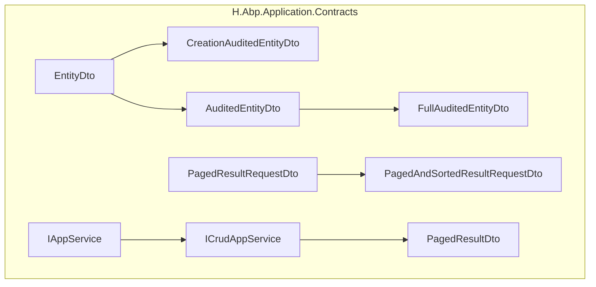
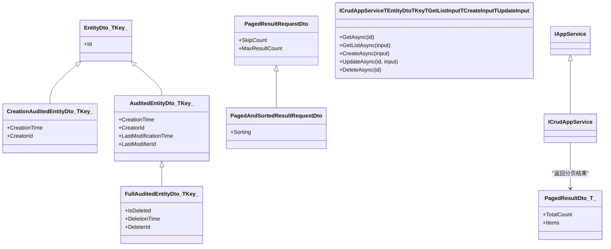
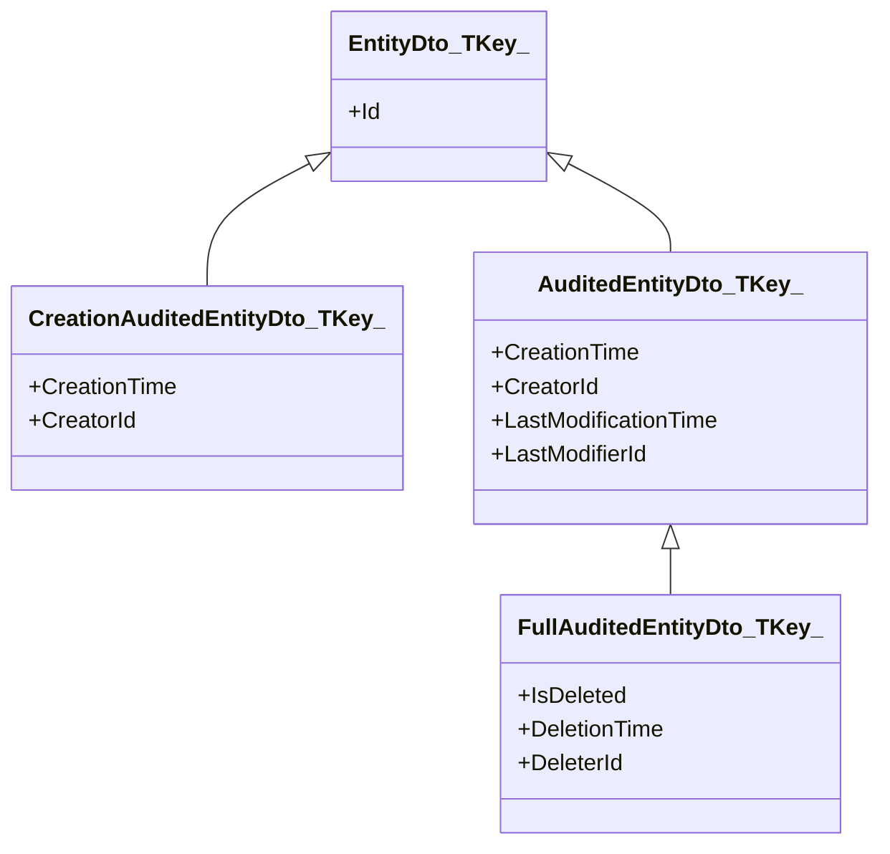
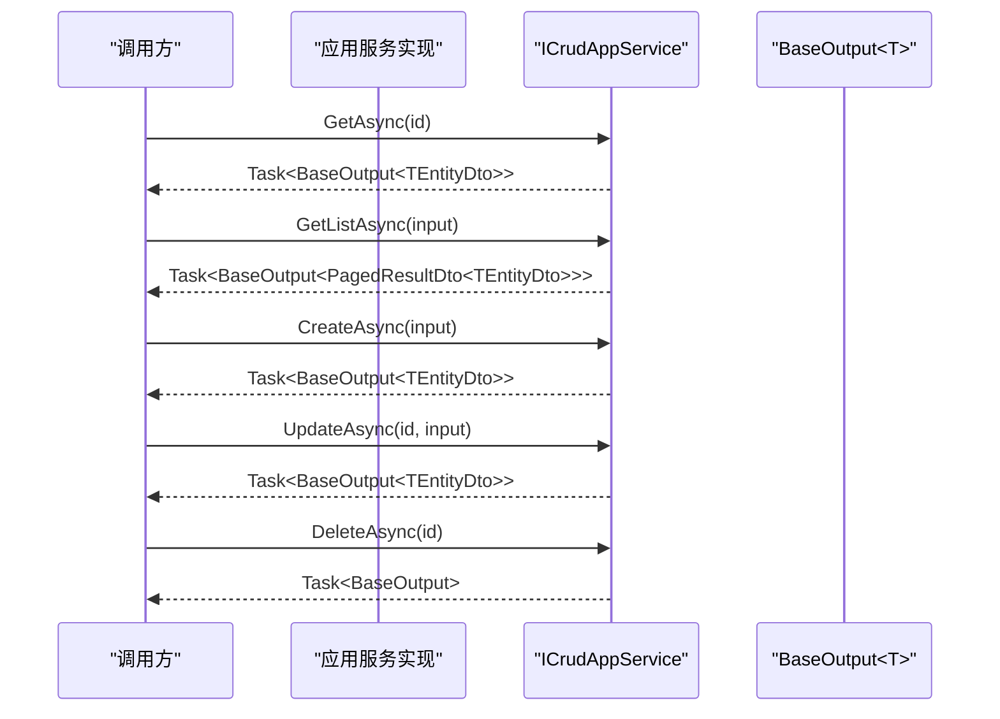
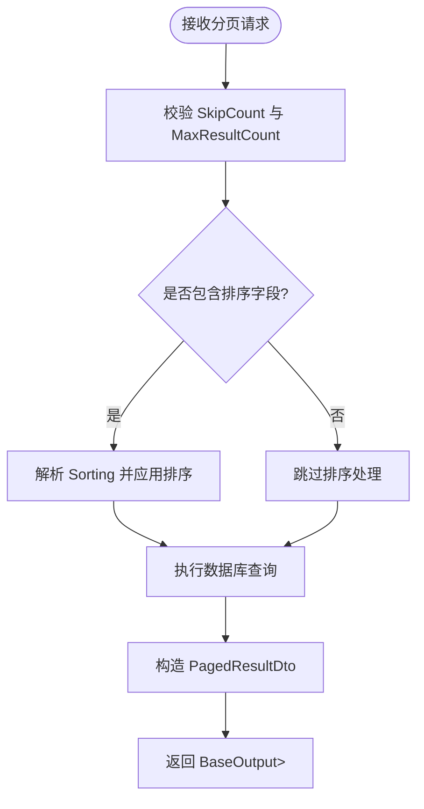
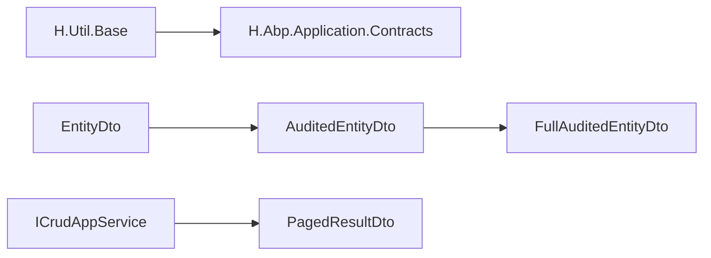

# H.Abp.Application.Contracts

<cite>
**本文引用的文件**   
- [EntityDto.cs](file://src/Utils/H.Abp.Application.Contracts/EntityDto.cs)
- [CreationAuditedEntityDto.cs](file://src/Utils/H.Abp.Application.Contracts/CreationAuditedEntityDto.cs)
- [AuditedEntityDto.cs](file://src/Utils/H.Abp.Application.Contracts/AuditedEntityDto.cs)
- [FullAuditedEntityDto.cs](file://src/Utils/H.Abp.Application.Contracts/FullAuditedEntityDto.cs)
- [IAppService.cs](file://src/Utils/H.Abp.Application.Contracts/IAppService.cs)
- [ICrudAppService.cs](file://src/Utils/H.Abp.Application.Contracts/ICrudAppService.cs)
- [PagedResultRequestDto.cs](file://src/Utils/H.Abp.Application.Contracts/PagedResultRequestDto.cs)
- [PagedAndSortedResultRequestDto.cs](file://src/Utils/H.Abp.Application.Contracts/PagedAndSortedResultRequestDto.cs)
- [PagedResultDto.cs](file://src/Utils/H.Abp.Application.Contracts/PagedResultDto.cs)
- [H.Abp.Application.Contracts.csproj](file://src/Utils/H.Abp.Application.Contracts/H.Abp.Application.Contracts.csproj)
</cite>

## 目录
1. [简介](#简介)
2. [项目结构](#项目结构)
3. [核心组件](#核心组件)
4. [架构总览](#架构总览)
5. [详细组件分析](#详细组件分析)
6. [依赖关系分析](#依赖关系分析)
7. [性能考虑](#性能考虑)
8. [故障排查指南](#故障排查指南)
9. [结论](#结论)
10. [附录：最佳实践与示例指引](#附录最佳实践与示例指引)

## 简介
H.Abp.Application.Contracts 是一个面向应用服务层的契约工具库，提供通用 DTO 基类、应用服务标记接口、标准 CRUD 服务契约以及统一的分页请求/响应模型。该库与 ABP 的对应类型在 JSON 序列化结构上保持一致，便于在现有生态中平滑复用和迁移。其职责边界清晰：定义跨层传输的数据契约和服务接口约定，不包含具体业务实现。

## 项目结构
该库为轻量级 .NET 类库，主要包含以下文件：
- DTO 基类：实体标识、基础审计、创建审计、完整审计
- 服务契约：IAppService、ICrudAppService
- 分页模型：PagedResultRequestDto、PagedAndSortedResultRequestDto、PagedResultDto
- 工程配置：csproj 引入基础工具库 H.Util.Base（BaseOutput 等）

**图表来源**
- [EntityDto.cs:1-6](file://src/Utils/H.Abp.Application.Contracts/EntityDto.cs#L1-L6)
- [CreationAuditedEntityDto.cs:1-7](file://src/Utils/H.Abp.Application.Contracts/CreationAuditedEntityDto.cs#L1-L7)
- [AuditedEntityDto.cs:1-9](file://src/Utils/H.Abp.Application.Contracts/AuditedEntityDto.cs#L1-L9)
- [FullAuditedEntityDto.cs:1-11](file://src/Utils/H.Abp.Application.Contracts/FullAuditedEntityDto.cs#L1-L11)
- [IAppService.cs:1-8](file://src/Utils/H.Abp.Application.Contracts/IAppService.cs#L1-L8)
- [ICrudAppService.cs:1-15](file://src/Utils/H.Abp.Application.Contracts/ICrudAppService.cs#L1-L15)
- [PagedResultRequestDto.cs:1-11](file://src/Utils/H.Abp.Application.Contracts/PagedResultRequestDto.cs#L1-L11)
- [PagedAndSortedResultRequestDto.cs:1-9](file://src/Utils/H.Abp.Application.Contracts/PagedAndSortedResultRequestDto.cs#L1-L9)
- [PagedResultDto.cs:1-19](file://src/Utils/H.Abp.Application.Contracts/PagedResultDto.cs#L1-L19)

**章节来源**
- [H.Abp.Application.Contracts.csproj:1-7](file://src/Utils/H.Abp.Application.Contracts/H.Abp.Application.Contracts.csproj#L1-L7)

## 核心组件
- 实体 DTO 继承层次：EntityDto → CreationAuditedEntityDto / AuditedEntityDto → FullAuditedEntityDto
- 应用服务契约：IAppService 作为可远程调用的服务标记；ICrudAppService 定义标准 CRUD 操作
- 分页模型：PagedResultRequestDto 表示分页参数，PagedAndSortedResultRequestDto 增加排序字段，PagedResultDto<T> 表示分页结果

这些组件共同构成应用服务层的数据契约与服务接口规范，确保客户端与服务端在数据结构和方法签名上的稳定一致。

**章节来源**
- [EntityDto.cs:1-6](file://src/Utils/H.Abp.Application.Contracts/EntityDto.cs#L1-L6)
- [CreationAuditedEntityDto.cs:1-7](file://src/Utils/H.Abp.Application.Contracts/CreationAuditedEntityDto.cs#L1-L7)
- [AuditedEntityDto.cs:1-9](file://src/Utils/H.Abp.Application.Contracts/AuditedEntityDto.cs#L1-L9)
- [FullAuditedEntityDto.cs:1-11](file://src/Utils/H.Abp.Application.Contracts/FullAuditedEntityDto.cs#L1-L11)
- [IAppService.cs:1-8](file://src/Utils/H.Abp.Application.Contracts/IAppService.cs#L1-L8)
- [ICrudAppService.cs:1-15](file://src/Utils/H.Abp.Application.Contracts/ICrudAppService.cs#L1-L15)
- [PagedResultRequestDto.cs:1-11](file://src/Utils/H.Abp.Application.Contracts/PagedResultRequestDto.cs#L1-L11)
- [PagedAndSortedResultRequestDto.cs:1-9](file://src/Utils/H.Abp.Application.Contracts/PagedAndSortedResultRequestDto.cs#L1-L9)
- [PagedResultDto.cs:1-19](file://src/Utils/H.Abp.Application.Contracts/PagedResultDto.cs#L1-L19)

## 架构总览
本库通过“接口 + DTO”的方式定义应用服务契约，强调：
- 泛型约束明确：实体类型、主键类型、查询输入、创建输入、更新输入分离
- 分页模型解耦：请求与响应各自独立，便于扩展排序、过滤、统计等能力
- 审计字段分层：从基础 ID 到完整审计信息逐步叠加，避免重复定义

**图表来源**
- [EntityDto.cs:1-6](file://src/Utils/H.Abp.Application.Contracts/EntityDto.cs#L1-L6)
- [CreationAuditedEntityDto.cs:1-7](file://src/Utils/H.Abp.Application.Contracts/CreationAuditedEntityDto.cs#L1-L7)
- [AuditedEntityDto.cs:1-9](file://src/Utils/H.Abp.Application.Contracts/AuditedEntityDto.cs#L1-L9)
- [FullAuditedEntityDto.cs:1-11](file://src/Utils/H.Abp.Application.Contracts/FullAuditedEntityDto.cs#L1-L11)
- [IAppService.cs:1-8](file://src/Utils/H.Abp.Application.Contracts/IAppService.cs#L1-L8)
- [ICrudAppService.cs:1-15](file://src/Utils/H.Abp.Application.Contracts/ICrudAppService.cs#L1-L15)
- [PagedResultRequestDto.cs:1-11](file://src/Utils/H.Abp.Application.Contracts/PagedResultRequestDto.cs#L1-L11)
- [PagedAndSortedResultRequestDto.cs:1-9](file://src/Utils/H.Abp.Application.Contracts/PagedAndSortedResultRequestDto.cs#L1-L9)
- [PagedResultDto.cs:1-19](file://src/Utils/H.Abp.Application.Contracts/PagedResultDto.cs#L1-L19)

## 详细组件分析

### 通用 DTO 基类设计体系
- EntityDto<TKey>：最基础的实体标识 DTO，仅暴露 Id 属性，用于所有实体的最小公共契约。
- CreationAuditedEntityDto<TKey>：在 EntityDto 基础上添加 CreationTime 与 CreatorId，表达“谁在何时创建”。
- AuditedEntityDto<TKey>：在 EntityDto 基础上添加 CreationTime、CreatorId、LastModificationTime、LastModifierId，表达完整的读写审计信息。
- FullAuditedEntityDto<TKey>：继承 AuditedEntityDto<TKey>，进一步加入 IsDeleted、DeletionTime、DeleterId，提供软删除与删除审计的统一结构。

该继承链以“组合而非复制”的方式累积字段，便于在不同业务实体间复用并减少维护成本。同时，JSON 序列化结构与 ABP 保持兼容，有利于与既有系统对接。

**图表来源**
- [EntityDto.cs:1-6](file://src/Utils/H.Abp.Application.Contracts/EntityDto.cs#L1-L6)
- [CreationAuditedEntityDto.cs:1-7](file://src/Utils/H.Abp.Application.Contracts/CreationAuditedEntityDto.cs#L1-L7)
- [AuditedEntityDto.cs:1-9](file://src/Utils/H.Abp.Application.Contracts/AuditedEntityDto.cs#L1-L9)
- [FullAuditedEntityDto.cs:1-11](file://src/Utils/H.Abp.Application.Contracts/FullAuditedEntityDto.cs#L1-L11)

**章节来源**
- [EntityDto.cs:1-6](file://src/Utils/H.Abp.Application.Contracts/EntityDto.cs#L1-L6)
- [CreationAuditedEntityDto.cs:1-7](file://src/Utils/H.Abp.Application.Contracts/CreationAuditedEntityDto.cs#L1-L7)
- [AuditedEntityDto.cs:1-9](file://src/Utils/H.Abp.Application.Contracts/AuditedEntityDto.cs#L1-L9)
- [FullAuditedEntityDto.cs:1-11](file://src/Utils/H.Abp.Application.Contracts/FullAuditedEntityDto.cs#L1-L11)

### IAppService 与 ICrudAppService 契约设计
- IAppService：作为标记接口，用于标识可通过 HTTP 代理远程调用的应用服务。它本身不定义方法，只承担分类与发现用途。
- ICrudAppService<TEntityDto, in TKey, in TGetListInput, in TCreateInput, in TUpdateInput>：定义标准 CRUD 操作的异步契约，包括：
  - GetAsync：按主键获取单条记录
  - GetListAsync：分页查询列表
  - CreateAsync：新增记录
  - UpdateAsync：按主键更新记录
  - DeleteAsync：按主键删除记录

该接口的关键设计点：
- 泛型参数分离实体、主键、查询输入、创建输入、更新输入，提升接口表达能力与复用性
- 使用 in 约束 TKey、TGetListInput、TCreateInput、TUpdateInput，使接口可作为协变消费者被引用
- 返回值统一使用 BaseOutput<T>，便于上层封装成功/失败状态码与消息体（BaseOutput 来自 H.Util.Base）

**图表来源**
- [ICrudAppService.cs:1-15](file://src/Utils/H.Abp.Application.Contracts/ICrudAppService.cs#L1-L15)
- [IAppService.cs:1-8](file://src/Utils/H.Abp.Application.Contracts/IAppService.cs#L1-L8)

**章节来源**
- [IAppService.cs:1-8](file://src/Utils/H.Abp.Application.Contracts/IAppService.cs#L1-L8)
- [ICrudAppService.cs:1-15](file://src/Utils/H.Abp.Application.Contracts/ICrudAppService.cs#L1-L15)

### 分页请求与响应模型
- PagedResultRequestDto：分页请求参数，包含 SkipCount（跳过条数）与 MaxResultCount（最大返回条数，默认 10）
- PagedAndSortedResultRequestDto：在分页请求基础上增加 Sorting（排序字符串），支持按列或表达式排序
- PagedResultDto<T>：分页响应数据，包含 TotalCount（总记录数）与 Items（当前页数据集合）。构造函数允许直接传入总数与集合，便于在服务层快速构造返回对象

**图表来源**
- [PagedResultRequestDto.cs:1-11](file://src/Utils/H.Abp.Application.Contracts/PagedResultRequestDto.cs#L1-L11)
- [PagedAndSortedResultRequestDto.cs:1-9](file://src/Utils/H.Abp.Application.Contracts/PagedAndSortedResultRequestDto.cs#L1-L9)
- [PagedResultDto.cs:1-19](file://src/Utils/H.Abp.Application.Contracts/PagedResultDto.cs#L1-L19)

**章节来源**
- [PagedResultRequestDto.cs:1-11](file://src/Utils/H.Abp.Application.Contracts/PagedResultRequestDto.cs#L1-L11)
- [PagedAndSortedResultRequestDto.cs:1-9](file://src/Utils/H.Abp.Application.Contracts/PagedAndSortedResultRequestDto.cs#L1-L9)
- [PagedResultDto.cs:1-19](file://src/Utils/H.Abp.Application.Contracts/PagedResultDto.cs#L1-L19)

## 依赖关系分析
- H.Abp.Application.Contracts 依赖 H.Util.Base，主要用于 BaseOutput 等基础输出类型
- DTO 基类之间通过继承形成紧密耦合，但职责单一、层次清晰
- ICrudAppService 对 PagedResultDto 存在引用关系，体现“服务契约 → 分页响应”的单向依赖

**图表来源**
- [H.Abp.Application.Contracts.csproj:1-7](file://src/Utils/H.Abp.Application.Contracts/H.Abp.Application.Contracts.csproj#L1-L7)
- [EntityDto.cs:1-6](file://src/Utils/H.Abp.Application.Contracts/EntityDto.cs#L1-L6)
- [AuditedEntityDto.cs:1-9](file://src/Utils/H.Abp.Application.Contracts/AuditedEntityDto.cs#L1-L9)
- [FullAuditedEntityDto.cs:1-11](file://src/Utils/H.Abp.Application.Contracts/FullAuditedEntityDto.cs#L1-L11)
- [ICrudAppService.cs:1-15](file://src/Utils/H.Abp.Application.Contracts/ICrudAppService.cs#L1-L15)
- [PagedResultDto.cs:1-19](file://src/Utils/H.Abp.Application.Contracts/PagedResultDto.cs#L1-L19)

**章节来源**
- [H.Abp.Application.Contracts.csproj:1-7](file://src/Utils/H.Abp.Application.Contracts/H.Abp.Application.Contracts.csproj#L1-L7)

## 性能考虑
- 分页参数控制网络与数据库压力：合理设置 SkipCount 与 MaxResultCount，避免一次性拉取过多数据
- 排序字段解析应在服务端进行，优先利用数据库索引与排序能力，减少内存排序开销
- 返回空集合时使用 IReadOnlyList<T> 的空实例，避免频繁分配内存
- 使用异步 API（Task）提高并发吞吐，避免阻塞线程池
- 审计字段仅在必要时启用，减少不必要的写放大

[本节为通用指导，不直接分析具体文件]

## 故障排查指南
- 分页异常
  - 检查 SkipCount 与 MaxResultCount 是否为负数或超出预期范围
  - 确认 Sorting 格式是否符合后端期望，避免无法解析导致查询失败
- 审计字段缺失
  - 确认使用的 DTO 基类是否包含所需审计字段
  - 检查服务实现是否正确填充 CreationTime、CreatorId、LastModificationTime、LastModifierId
- 接口签名不一致
  - 确保 ICrudAppService 的实现与契约完全匹配，特别是泛型参数顺序与约束
  - 检查返回值是否使用 BaseOutput<T> 包装，以便统一错误处理
- 版本兼容性
  - 确保 DTO 的 JSON 结构与 ABP 保持兼容，避免因序列化差异导致前端解析失败

**章节来源**
- [PagedResultRequestDto.cs:1-11](file://src/Utils/H.Abp.Application.Contracts/PagedResultRequestDto.cs#L1-L11)
- [PagedAndSortedResultRequestDto.cs:1-9](file://src/Utils/H.Abp.Application.Contracts/PagedAndSortedResultRequestDto.cs#L1-L9)
- [ICrudAppService.cs:1-15](file://src/Utils/H.Abp.Application.Contracts/ICrudAppService.cs#L1-L15)

## 结论
H.Abp.Application.Contracts 通过清晰的 DTO 继承层次与标准化的应用服务契约，为业务服务提供了稳定、可扩展且与 ABP 兼容的数据模型与接口规范。配合统一的分页请求与响应模型，能够有效降低前后端与服务端的耦合度，提升代码复用率与可维护性。在实际使用中，建议严格遵循契约定义，结合合理的验证、错误处理与性能优化策略，构建高质量的应用服务层。

[本节为总结性内容，不直接分析具体文件]

## 附录：最佳实践与示例指引

- 如何定义业务实体 DTO
  - 选择合适的基础 DTO：仅需标识用 EntityDto<TKey>；需要创建审计用 CreationAuditedEntityDto<TKey>；需要读写审计用 AuditedEntityDto<TKey>；需要软删除与删除审计用 FullAuditedEntityDto<TKey>
  - 在 DTO 中添加业务字段，保持与领域模型的最小必要映射

- 如何实现 ICrudAppService
  - 在应用服务实现中继承 ICrudAppService<TEntityDto, TKey, TGetListInput, TCreateInput, TUpdateInput>
  - 实现 GetAsync、GetListAsync、CreateAsync、UpdateAsync、DeleteAsync，并在 GetListAsync 中返回 PagedResultDto<TEntityDto>
  - 将查询结果封装到 BaseOutput<TEntityDto> 中返回，统一成功/失败结构

- 如何处理分页与排序
  - 使用 PagedResultRequestDto 或 PagedAndSortedResultRequestDto 作为查询输入
  - 在服务层解析 Sorting，并应用到数据库查询
  - 计算 TotalCount 并构造 PagedResultDto<T>

- 数据验证与错误处理
  - 在服务入口对输入参数进行校验（如必填、长度、格式）
  - 捕获并转换底层异常为统一的 BaseOutput 失败响应
  - 对权限不足、资源不存在等场景给出明确的错误码与消息

- 性能优化建议
  - 分页查询尽量使用数据库原生分页与排序
  - 避免 N+1 查询，按需加载关联数据
  - 对高频读取数据使用合适的缓存策略
  - 合理使用异步 API，避免阻塞

[本节为概念性指导，不直接分析具体文件]