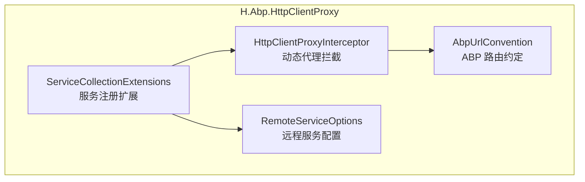
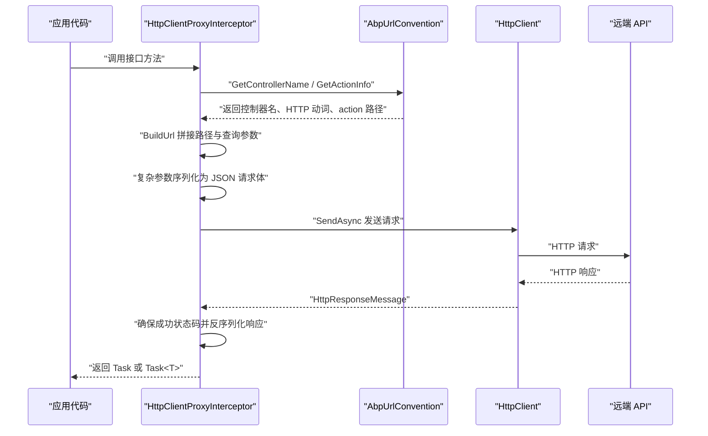
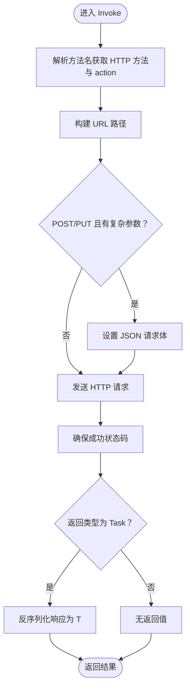
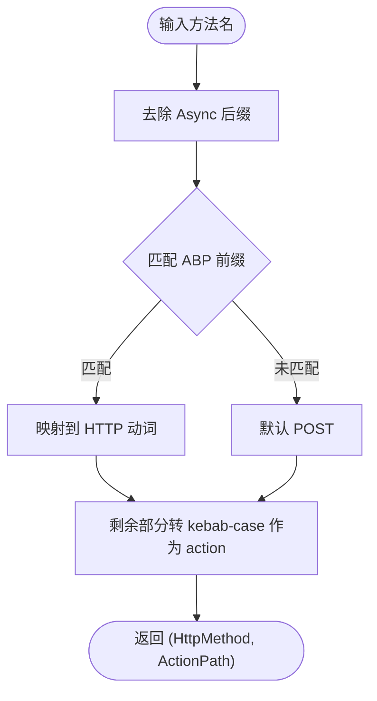
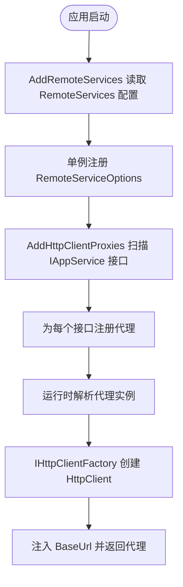
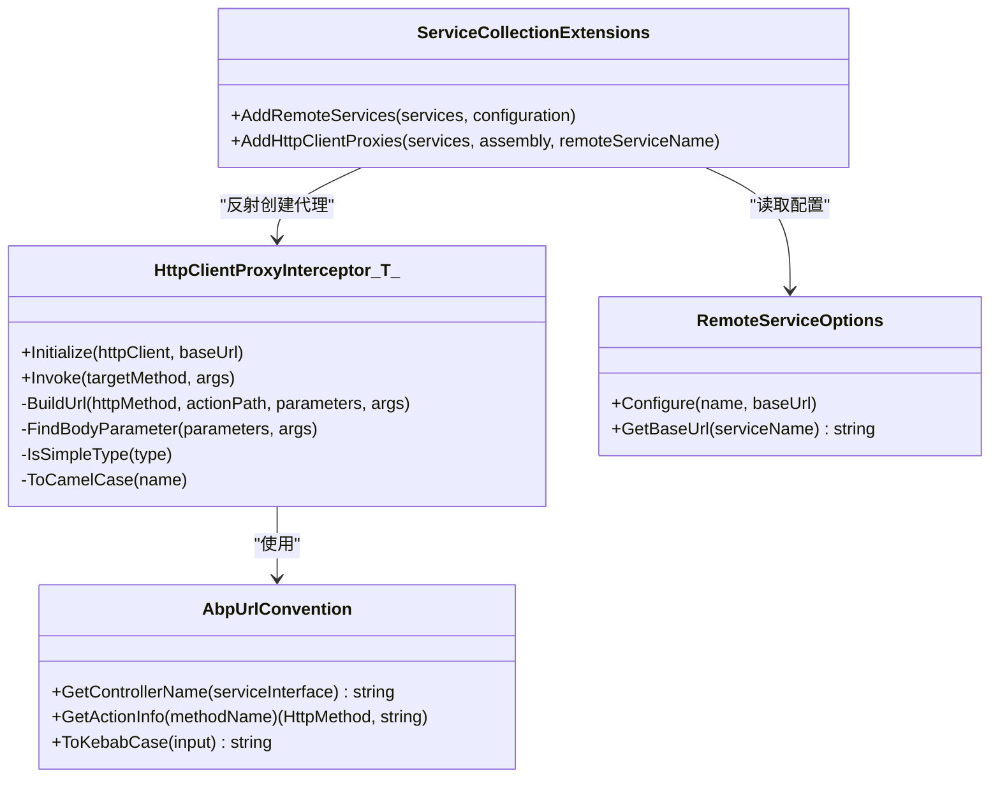

# H.Abp.HttpClientProxy

<cite>
**本文引用的文件**   
- [HttpClientProxyInterceptor.cs](file://src/Utils/H.Abp.HttpClientProxy/HttpClientProxyInterceptor.cs)
- [AbpUrlConvention.cs](file://src/Utils/H.Abp.HttpClientProxy/AbpUrlConvention.cs)
- [RemoteServiceOptions.cs](file://src/Utils/H.Abp.HttpClientProxy/RemoteServiceOptions.cs)
- [ServiceCollectionExtensions.cs](file://src/Utils/H.Abp.HttpClientProxy/ServiceCollectionExtensions.cs)
</cite>

## 目录
1. [引言](#引言)
2. [项目结构](#项目结构)
3. [核心组件](#核心组件)
4. [架构总览](#架构总览)
5. [详细组件分析](#详细组件分析)
6. [依赖关系分析](#依赖关系分析)
7. [性能与可维护性](#性能与可维护性)
8. [客户端调用示例](#客户端调用示例)
9. [故障排查指南](#故障排查指南)
10. [结论](#结论)

## 引言
H.Abp.HttpClientProxy 是一个面向 .NET 的动态 HTTP 代理库。它通过基于 System.Reflection.DispatchProxy 的拦截器，将继承 ABP IAppService 的接口直接映射为 RESTful HTTP 客户端，开发者只需声明接口，即可自动生成 HttpClient 调用、参数序列化、响应反序列化等能力。

该库的核心价值在于：
- 零手写 HTTP 调用代码：仅定义接口，由运行时生成代理对象。
- 兼容 ABP 服务端路由约定：方法名到 HTTP 动词和 URL action 的转换规则与服务端一致。
- 与 ASP.NET Core DI 集成：通过 IServiceCollection 扩展批量扫描并注册服务。
- 可扩展配置：支持基础地址、超时、认证头等常见 HttpClient 配置点（由宿主应用负责注入）。

## 项目结构
H.Abp.HttpClientProxy 位于 Utils 工具集中，包含四个关键文件：
- HttpClientProxyInterceptor.cs：动态代理实现，负责方法拦截、URL 构建、请求发送与响应处理。
- AbpUrlConvention.cs：ABP 风格的路由约定解析器，负责控制器名称与方法名到 HTTP 动词及 action 路径的转换。
- RemoteServiceOptions.cs：远程服务的基础地址配置容器。
- ServiceCollectionExtensions.cs：DI 容器扩展，加载配置并注册代理类型。

**图表来源**
- [HttpClientProxyInterceptor.cs:1-234](file://src/Utils/H.Abp.HttpClientProxy/HttpClientProxyInterceptor.cs#L1-L234)
- [AbpUrlConvention.cs:1-86](file://src/Utils/H.Abp.HttpClientProxy/AbpUrlConvention.cs#L1-L86)
- [RemoteServiceOptions.cs:1-33](file://src/Utils/H.Abp.HttpClientProxy/RemoteServiceOptions.cs#L1-L33)
- [ServiceCollectionExtensions.cs:1-63](file://src/Utils/H.Abp.HttpClientProxy/ServiceCollectionExtensions.cs#L1-L63)

**章节来源**
- [HttpClientProxyInterceptor.cs:1-234](file://src/Utils/H.Abp.HttpClientProxy/HttpClientProxyInterceptor.cs#L1-L234)
- [AbpUrlConvention.cs:1-86](file://src/Utils/H.Abp.HttpClientProxy/AbpUrlConvention.cs#L1-L86)
- [RemoteServiceOptions.cs:1-33](file://src/Utils/H.Abp.HttpClientProxy/RemoteServiceOptions.cs#L1-L33)
- [ServiceCollectionExtensions.cs:1-63](file://src/Utils/H.Abp.HttpClientProxy/ServiceCollectionExtensions.cs#L1-L63)

## 核心组件
- HttpClientProxyInterceptor<TService>：基于 DispatchProxy 的动态代理类。拦截 TService 接口的所有方法调用，将其转换为 HTTP 请求。
- AbpUrlConvention：静态约定工具，提供控制器名与方法名解析。
- RemoteServiceOptions：从配置中读取远程服务基础地址的字典式容器。
- ServiceCollectionExtensions：提供 AddRemoteServices 与 AddHttpClientProxies 两个扩展方法，完成配置加载与代理类型注册。

**章节来源**
- [HttpClientProxyInterceptor.cs:1-234](file://src/Utils/H.Abp.HttpClientProxy/HttpClientProxyInterceptor.cs#L1-L234)
- [AbpUrlConvention.cs:1-86](file://src/Utils/H.Abp.HttpClientProxy/AbpUrlConvention.cs#L1-L86)
- [RemoteServiceOptions.cs:1-33](file://src/Utils/H.Abp.HttpClientProxy/RemoteServiceOptions.cs#L1-L33)
- [ServiceCollectionExtensions.cs:1-63](file://src/Utils/H.Abp.HttpClientProxy/ServiceCollectionExtensions.cs#L1-L63)

## 架构总览
下图展示一次典型接口调用的端到端流程：应用代码调用接口 → DispatchProxy 拦截 → 构建 URL → 序列化请求体 → 发送 HTTP 请求 → 反序列化响应。

**图表来源**
- [HttpClientProxyInterceptor.cs:1-234](file://src/Utils/H.Abp.HttpClientProxy/HttpClientProxyInterceptor.cs#L1-L234)
- [AbpUrlConvention.cs:1-86](file://src/Utils/H.Abp.HttpClientProxy/AbpUrlConvention.cs#L1-L86)

## 详细组件分析

### HttpClientProxyInterceptor：动态代理与请求生命周期
该类继承 DispatchProxy，对 TService 接口进行运行时代理。其职责包括：
- 初始化阶段：持有 HttpClient、基础地址与控制器名。
- 方法拦截：解析方法名对应的 HTTP 动词与 action；根据参数构建 URL；选择请求体；发送请求；处理返回值。
- 参数绑定规则：
  - 名为 id 且为简单类型的参数作为路径段，放在 action 之前。
  - 恰好一个以 Id 结尾的非 id 参数作为第二段路径，放在 action 之后。
  - GET/DELETE 的复杂参数会展开属性到查询字符串。
  - POST/PUT 的第一个非简单类型参数会被放入 JSON 请求体。
- 返回值处理：仅支持 Task 与 Task<T>；Task<T> 会根据泛型参数反序列化响应体。

**图表来源**
- [HttpClientProxyInterceptor.cs:1-234](file://src/Utils/H.Abp.HttpClientProxy/HttpClientProxyInterceptor.cs#L1-L234)

关键点说明：
- 方法签名到 HTTP 动词的映射由 AbpUrlConvention.GetActionInfo 完成。
- URL 构建逻辑在 BuildUrl 中实现，遵循 ABP 约定：id 与 Id 后缀参数参与路径。
- 查询参数键使用驼峰命名（首字母小写），值经过 UrlEncode。
- JSON 序列化使用 System.Text.Json，采用驼峰命名策略，且忽略大小写。
- 异常处理依赖 response.EnsureSuccessStatusCode()，失败时抛出标准 HTTP 异常。

**章节来源**
- [HttpClientProxyInterceptor.cs:1-234](file://src/Utils/H.Abp.HttpClientProxy/HttpClientProxyInterceptor.cs#L1-L234)

### AbpUrlConvention：ABP 路由约定解析器
该静态类承担两项工作：
- 控制器名称解析：去掉 I 前缀与 AppService/ApplicationService 后缀，再转为 kebab-case。
- 方法名解析：按 ABP HttpMethodHelper 约定识别前缀，映射到 HTTP 动词，并将剩余部分转成 kebab-case 作为 action。

**图表来源**
- [AbpUrlConvention.cs:1-86](file://src/Utils/H.Abp.HttpClientProxy/AbpUrlConvention.cs#L1-L86)

重要规则：
- 前缀优先级：GetList、GetAll、Get、Put、Update、Delete、Remove、Create、Add、Insert、Post、Patch。
- 默认行为：无前缀则视为 POST，整个方法名转为 kebab-case。
- 控制器名转换：IPageAppService → page；IAppApplicationService → app-application。

**章节来源**
- [AbpUrlConvention.cs:1-86](file://src/Utils/H.Abp.HttpClientProxy/AbpUrlConvention.cs#L1-L86)

### RemoteServiceOptions：远程服务配置
RemoteServiceOptions 以不区分大小写的字典方式存储多个远程服务的 BaseUrl，并提供：
- Configure(name, baseUrl)：写入某个服务的基础地址。
- GetBaseUrl(serviceName)：读取某个服务的基础地址。
- RemoteServiceConfiguration：单个服务的配置项，当前只包含 BaseUrl。

注意：当前实现不包含超时、重试、认证头等高级配置；这些应由宿主应用在创建 HttpClient 时统一配置。

**章节来源**
- [RemoteServiceOptions.cs:1-33](file://src/Utils/H.Abp.HttpClientProxy/RemoteServiceOptions.cs#L1-L33)

### ServiceCollectionExtensions：服务注册与 DI 集成
扩展方法提供两步注册：
- AddRemoteServices(configuration)：从 IConfiguration 的 RemoteServices 节点加载每个子项的 BaseUrl，填充 RemoteServiceOptions 并单例注册。
- AddHttpClientProxies(assembly, remoteServiceName)：扫描程序集中所有继承 IAppService 的接口，为每个接口注册一个代理实例。代理实例通过 IHttpClientFactory.CreateClient(remoteServiceName) 获取 HttpClient，并从 RemoteServiceOptions 中取得对应 BaseUrl。

**图表来源**
- [ServiceCollectionExtensions.cs:1-63](file://src/Utils/H.Abp.HttpClientProxy/ServiceCollectionExtensions.cs#L1-L63)

要点：
- 配置节 RemoteServices 的子节点 Key 即为 remoteServiceName，用于区分不同远端服务。
- 代理类型通过反射构造：MakeGenericType + 调用 Create 静态方法（该方法由 HttpClientProxyInterceptor 暴露）。
- 代理生命周期为 Scoped，每次作用域内解析到的代理共享同一个 HttpClient 实例。

**章节来源**
- [ServiceCollectionExtensions.cs:1-63](file://src/Utils/H.Abp.HttpClientProxy/ServiceCollectionExtensions.cs#L1-L63)

## 依赖关系分析
- HttpClientProxyInterceptor 依赖：
  - System.Net.Http.HttpClient：实际发送 HTTP 请求。
  - System.Text.Json.JsonContent：序列化复杂参数为 JSON。
  - AbpUrlConvention：解析控制器名与方法名。
- ServiceCollectionExtensions 依赖：
  - Microsoft.Extensions.Configuration：读取 RemoteServices 配置。
  - Microsoft.Extensions.DependencyInjection：扩展 IServiceCollection。
  - H.Abp.Application.Contracts.IAppService：扫描目标接口。
- RemoteServiceOptions 无外部业务依赖，仅承载配置数据。

**图表来源**
- [HttpClientProxyInterceptor.cs:1-234](file://src/Utils/H.Abp.HttpClientProxy/HttpClientProxyInterceptor.cs#L1-L234)
- [AbpUrlConvention.cs:1-86](file://src/Utils/H.Abp.HttpClientProxy/AbpUrlConvention.cs#L1-L86)
- [RemoteServiceOptions.cs:1-33](file://src/Utils/H.Abp.HttpClientProxy/RemoteServiceOptions.cs#L1-L33)
- [ServiceCollectionExtensions.cs:1-63](file://src/Utils/H.Abp.HttpClientProxy/ServiceCollectionExtensions.cs#L1-L63)

**章节来源**
- [HttpClientProxyInterceptor.cs:1-234](file://src/Utils/H.Abp.HttpClientProxy/HttpClientProxyInterceptor.cs#L1-L234)
- [AbpUrlConvention.cs:1-86](file://src/Utils/H.Abp.HttpClientProxy/AbpUrlConvention.cs#L1-L86)
- [RemoteServiceOptions.cs:1-33](file://src/Utils/H.Abp.HttpClientProxy/RemoteServiceOptions.cs#L1-L33)
- [ServiceCollectionExtensions.cs:1-63](file://src/Utils/H.Abp.HttpClientProxy/ServiceCollectionExtensions.cs#L1-L63)

## 性能与可维护性
- 反射开销：
  - 首次代理实例化需要 MakeGenericType 与反射调用 Create 方法，属于一次性成本。
  - 方法签名解析在 Invoke 中执行，若需极致优化可在启动期缓存 MethodInfo 与参数元数据。
- JSON 序列化：
  - 使用 System.Text.Json 的共享 JsonSerializerOptions（驼峰命名、忽略大小写），减少重复分配。
- URL 构建：
  - 查询参数拼接与编码发生在每次调用；对于高频调用场景，可考虑参数校验与缓存策略。
- 可维护性：
  - ABP 路由约定集中在 AbpUrlConvention，便于对齐服务端行为。
  - 配置与注册逻辑分离，便于测试与扩展。

[本节为通用建议，无需具体文件引用]

## 客户端调用示例
以下示例展示如何通过简单的接口声明自动生成 HTTP 客户端，并覆盖异步调用、异常处理与扩展点。

- 定义接口：
  - 接口应继承 IAppService。
  - 方法名遵循 ABP 前缀约定，例如：GetById、Create、Update、Delete、GetList。
  - 参数 id 或 XxxId 自动参与 URL 路径；其他简单参数转为查询参数；复杂参数在 POST/PUT 中作为 JSON 请求体。

- 启动配置：
  - 在 Program.cs 或 Module 中调用 AddRemoteServices，从 appsettings.json 的 RemoteServices 节点读取基础地址。
  - 调用 AddHttpClientProxies，传入包含接口定义的程序集与 remoteServiceName。
  - 使用 IHttpClientFactory 为该 name 创建 HttpClient，并设置 BaseAddress、超时、认证头、重试策略等。

- 异步调用：
  - 直接调用接口方法，返回 Task 或 Task<T>。
  - 使用 await 等待结果，或使用 ContinueWith 处理回调。

- 异常处理：
  - 非 2xx 响应会触发 EnsureSuccessStatusCode 抛出的异常。
  - 建议在调用层捕获 HttpRequestException，并根据 StatusCode 做业务错误处理。

- 重试机制：
  - 推荐通过 Polly 与 IHttpClientFactory 在创建 HttpClient 时添加重试策略。
  - 针对幂等方法（GET、HEAD、OPTIONS）启用指数退避重试。

- 认证头配置：
  - 通过 DelegatingHandler 或 HttpClient.DefaultRequestHeaders 设置 Authorization、X-Correlation-Id 等头。
  - 如需动态令牌刷新，可使用自定义 DelegatingHandler。

[本节为概念性示例，不直接分析具体源码文件]

## 故障排查指南
常见问题与定位建议：
- 无法解析远程服务基础地址：
  - 检查 appsettings.json 的 RemoteServices 节点是否包含正确子节点与 BaseUrl。
  - 确认 AddRemoteServices 已调用，并且 remoteServiceName 与程序集中注册的名称一致。
- URL 路径不符合预期：
  - 核对方法名前缀是否符合 ABP 约定（Get/Create/Update/Delete 等）。
  - 检查是否存在多个 Id 后缀参数或 id 参数位置不当。
- 请求体为空：
  - POST/PUT 必须传递非简单类型参数才会被序列化到请求体。
  - 确保参数顺序与类型符合约定。
- 响应反序列化失败：
  - 确认服务端返回的 JSON 字段名与客户端模型字段名匹配（库使用驼峰命名策略）。
  - 检查响应状态码是否为 2xx，否则 EnsureSuccessStatusCode 会先抛出异常。
- 并发与连接池问题：
  - 避免频繁创建 HttpClient；使用 IHttpClientFactory 提供的命名客户端。
  - 合理设置超时时间，防止长时间阻塞。

**章节来源**
- [HttpClientProxyInterceptor.cs:1-234](file://src/Utils/H.Abp.HttpClientProxy/HttpClientProxyInterceptor.cs#L1-L234)
- [ServiceCollectionExtensions.cs:1-63](file://src/Utils/H.Abp.HttpClientProxy/ServiceCollectionExtensions.cs#L1-L63)

## 结论
H.Abp.HttpClientProxy 通过 DispatchProxy 与 ABP 路由约定，将接口声明转化为高效、一致的 HTTP 客户端。其设计聚焦于：
- 清晰的职责分离：约定解析、代理拦截、配置与注册各自独立。
- 低侵入接入：仅需声明 IAppService 接口并完成 DI 注册。
- 可扩展增强：结合 IHttpClientFactory 与 Polly 轻松实现超时、重试与认证。

在生产环境中，建议配合 IHttpClientFactory 的生命周期管理与 Polly 的重试策略，以获得更稳健的远程调用体验。