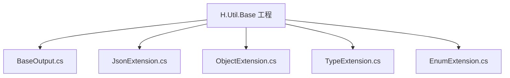
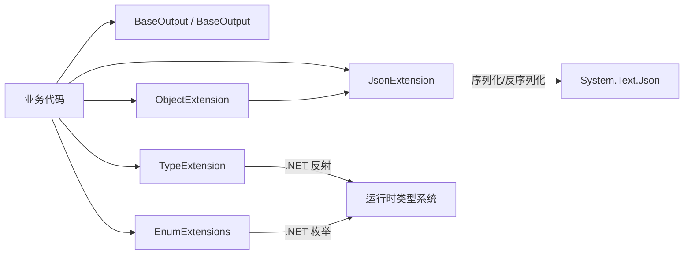
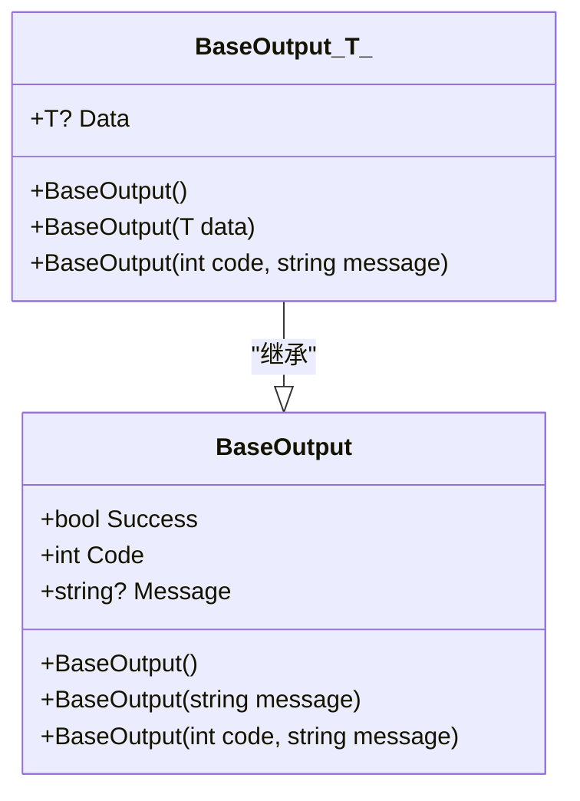
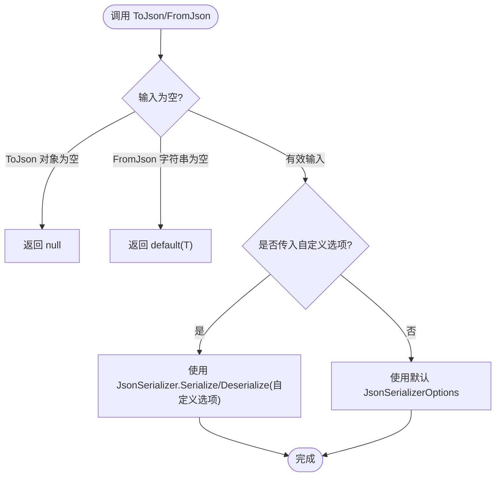
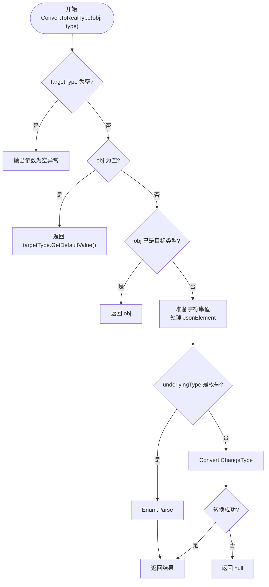
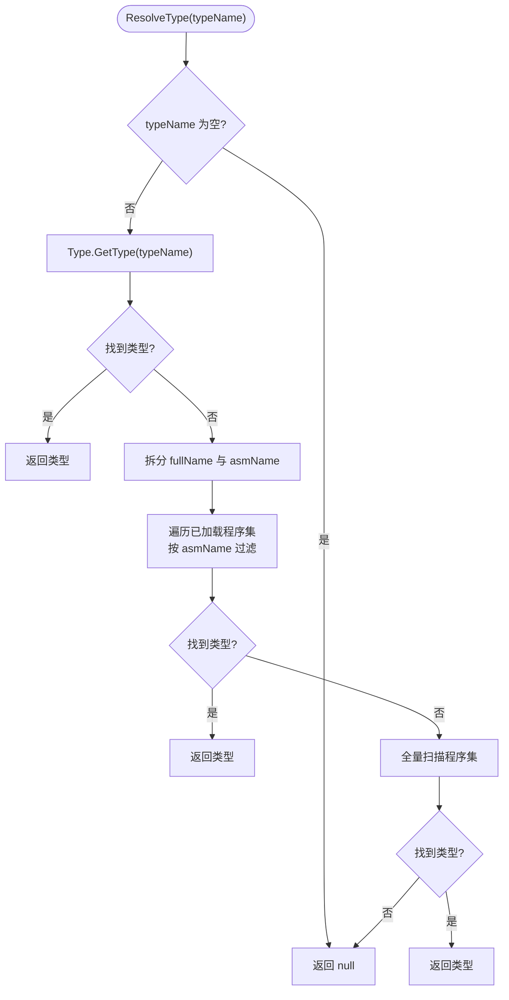
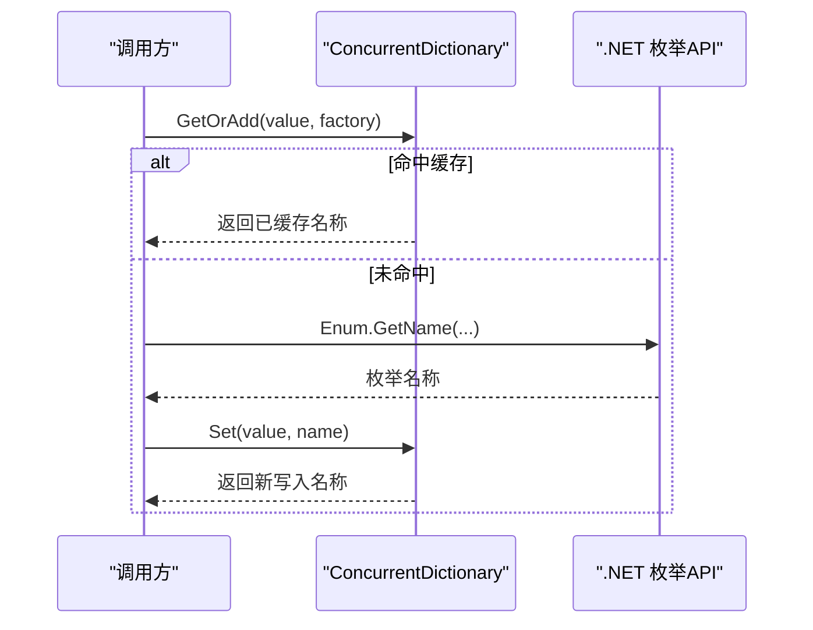
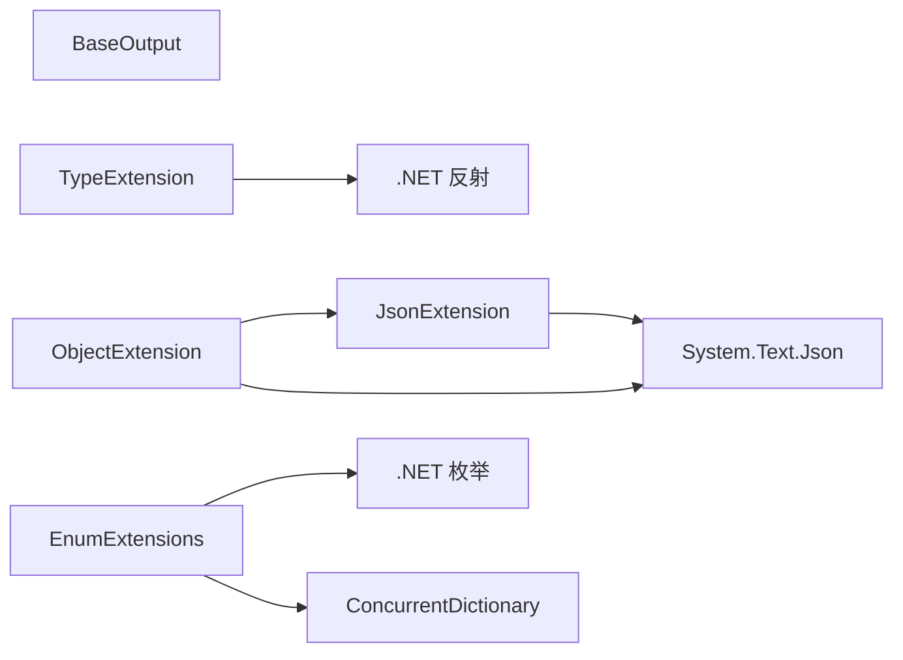

# H.Util.Base

<cite>
**本文引用的文件**   
- [BaseOutput.cs](file://src/Utils/H.Util.Base/BaseOutput.cs)
- [JsonExtension.cs](file://src/Utils/H.Util.Base/JsonExtension.cs)
- [ObjectExtension.cs](file://src/Utils/H.Util.Base/ObjectExtension.cs)
- [TypeExtension.cs](file://src/Utils/H.Util.Base/TypeExtension.cs)
- [EnumExtension.cs](file://src/Utils/H.Util.Base/EnumExtension.cs)
- [H.Util.Base.csproj](file://src/Utils/H.Util.Base/H.Util.Base.csproj)
</cite>

## 目录
1. [简介](#简介)
2. [项目结构](#项目结构)
3. [核心组件](#核心组件)
4. [架构总览](#架构总览)
5. [详细组件分析](#详细组件分析)
6. [依赖关系分析](#依赖关系分析)
7. [性能与优化建议](#性能与优化建议)
8. [故障排查指南](#故障排查指南)
9. [结论](#结论)
10. [附录：使用示例](#附录使用示例)

## 简介
H.Util.Base 是平台级基础工具库，提供统一输出响应模型、JSON 扩展、对象操作扩展、类型反射扩展和枚举处理扩展。该库以静态扩展方法和轻量泛型模型为主，面向业务服务层、应用服务层和基础设施层的通用能力复用。

## 项目结构
H.Util.Base 是一个小型 .NET SDK 工程，包含五个核心源文件和一个项目定义文件：
- BaseOutput.cs：统一输出响应模型
- JsonExtension.cs：System.Text.Json 的便捷扩展
- ObjectExtension.cs：对象深拷贝、类型转换与 JSON 元素解析
- TypeExtension.cs：类型默认值生成与程序集内类型解析
- EnumExtension.cs：枚举名称获取、整型/字符串到枚举的安全转换
- H.Util.Base.csproj：SDK 风格项目定义，引入公共构建属性

**图表来源**
- [H.Util.Base.csproj:1-3](file://src/Utils/H.Util.Base/H.Util.Base.csproj#L1-L3)

**章节来源**
- [H.Util.Base.csproj:1-3](file://src/Utils/H.Util.Base/H.Util.Base.csproj#L1-L3)

## 核心组件
- BaseOutput 与 BaseOutput<T>：统一的 API 返回模型，封装成功标志、状态码、消息和数据体。
- JsonExtension：为 object 与 string 提供 ToJson、FromJson 扩展，统一序列化配置并增强反序列化异常信息。
- ObjectExtension：提供 DeepClone、ConvertToRealType、JsonElement 强转等实用方法。
- TypeExtension：提供 GetDefaultValue、ResolveType 等方法，简化集合默认实例化与按名称解析类型。
- EnumExtensions：提供枚举名称缓存读取与安全转换方法，避免非法值导致异常。

**章节来源**
- [BaseOutput.cs:1-52](file://src/Utils/H.Util.Base/BaseOutput.cs#L1-L52)
- [JsonExtension.cs:1-45](file://src/Utils/H.Util.Base/JsonExtension.cs#L1-L45)
- [ObjectExtension.cs:1-105](file://src/Utils/H.Util.Base/ObjectExtension.cs#L1-L105)
- [TypeExtension.cs:1-78](file://src/Utils/H.Util.Base/TypeExtension.cs#L1-L78)
- [EnumExtension.cs:1-44](file://src/Utils/H.Util.Base/EnumExtension.cs#L1-L44)

## 架构总览
下图展示了各扩展之间的依赖关系以及它们如何被上层业务调用。所有扩展均为静态类或静态方法，不引入额外运行时依赖；JSON 能力基于 System.Text.Json，类型与枚举能力基于 .NET 标准反射与枚举 API。

**图表来源**
- [JsonExtension.cs:1-45](file://src/Utils/H.Util.Base/JsonExtension.cs#L1-L45)
- [ObjectExtension.cs:1-105](file://src/Utils/H.Util.Base/ObjectExtension.cs#L1-L105)
- [TypeExtension.cs:1-78](file://src/Utils/H.Util.Base/TypeExtension.cs#L1-L78)
- [EnumExtension.cs:1-44](file://src/Utils/H.Util.Base/EnumExtension.cs#L1-L44)

## 详细组件分析

### BaseOutput 统一输出响应模型
BaseOutput 定义了三层语义：
- Success：布尔值，表示整体是否成功。
- Code：整数状态码，约定 0 表示成功，非 0 表示失败。
- Message：可选的消息字段，用于承载错误描述或调试信息。

BaseOutput<T> 在基类基础上增加 Data 字段，承载业务数据。其构造器在传入 data 时自动设置 Success=true、Code=0，从而保证“有数据即成功”的默认语义；同时保留无参构造供外部填充。

**图表来源**
- [BaseOutput.cs:1-52](file://src/Utils/H.Util.Base/BaseOutput.cs#L1-L52)

设计要点
- 成功状态码约定：Code=0 且 Success=true 视为成功。
- 错误信息封装：通过 Message 携带人类可读提示，便于前端展示或日志记录。
- 数据包装：BaseOutput<T>.Data 承载领域对象、DTO 或原始数据。
- 构造器行为：有参构造根据 code 计算 Success，避免不一致状态。

典型用法
- 接口层直接返回 BaseOutput<T>，例如查询单条数据、保存结果等。
- 当需要区分不同错误场景时，使用自定义 Code 配合 Message。

**章节来源**
- [BaseOutput.cs:1-52](file://src/Utils/H.Util.Base/BaseOutput.cs#L1-L52)

### JsonExtension JSON 扩展方法
JsonExtension 提供了两个关键扩展：
- ToJson(object?): 将任意对象序列化为 JSON 字符串，空对象返回 null。
- FromJson<T>(string?): 将 JSON 字符串反序列化为指定引用类型，空串返回 default。

默认序列化选项
- 忽略默认值：WhenWritingDefault，减少无效字段体积。
- 宽松编码：UnsafeRelaxedJsonEscaping，提升兼容性。
- Web 默认配置：JsonSerializerDefaults.Web，适配常见 Web 场景。

异常处理
- 反序列化捕获 JsonException 与通用 Exception，封装 path、json 等上下文信息后重新抛出，便于定位问题。

**图表来源**
- [JsonExtension.cs:1-45](file://src/Utils/H.Util.Base/JsonExtension.cs#L1-L45)

最佳实践
- 优先使用 ToJson 进行对象序列化，避免重复配置 JsonSerializerOptions。
- 从外部来源（HTTP、消息队列）反序列化时使用 FromJson<T>，获得更清晰的异常信息。
- 若需自定义序列化策略，传入 options 覆盖默认行为。

**章节来源**
- [JsonExtension.cs:1-45](file://src/Utils/H.Util.Base/JsonExtension.cs#L1-L45)

### ObjectExtension 对象操作扩展
ObjectExtension 主要提供三类能力：
- 深拷贝：DeepClone<T> 通过 JSON 往返实现对象深拷贝。
- 目标类型转换：ConvertToRealType(object?, Type) 将任意对象转换为指定类型，支持可空类型、枚举、基本类型。
- JsonElement 解析：ConvertToRealType(JsonElement) 将 JSON 元素展开为原生类型、字典或列表。

核心流程（object? -> Type）
- 校验 targetType 是否为空。
- 若 obj 为空，返回 targetType.GetDefaultValue()。
- 若已为目标类型，直接返回。
- 特殊处理 JsonElement：提取字符串或数值文本。
- 若目标是枚举，使用 Enum.Parse 解析。
- 否则尝试 Convert.ChangeType 转换。
- 转换失败返回 null。

**图表来源**
- [ObjectExtension.cs:1-105](file://src/Utils/H.Util.Base/ObjectExtension.cs#L1-L105)
- [TypeExtension.cs:1-78](file://src/Utils/H.Util.Base/TypeExtension.cs#L1-L78)

JsonElement 解析
- 字符串、数字、布尔、null、未定义均映射为对应原生类型。
- 对象映射为 Dictionary<string, object?>。
- 数组映射为 List<object?>。
- 其他 ValueKind 抛出不支持异常。

使用建议
- DeepClone 适用于简单对象图；复杂循环引用需谨慎评估。
- ConvertToRealType 适合将外部 JSON 数据转为强类型实体。
- 对于大量 JSON 数据，优先考虑强类型 DTO 而非 Dictionary/List 动态结构。

**章节来源**
- [ObjectExtension.cs:1-105](file://src/Utils/H.Util.Base/ObjectExtension.cs#L1-L105)
- [TypeExtension.cs:1-78](file://src/Utils/H.Util.Base/TypeExtension.cs#L1-L78)

### TypeExtension 类型反射扩展
TypeExtension 提供两类常用能力：
- GetDefaultValue(Type): 根据类型返回合理的默认实例，包括数组、List<T>、Dictionary<TKey,TValue>、IList 子类型、值类型与非托管引用类型。
- ResolveType(string): 按“类型名[,程序集名]”格式解析类型，先在当前 AppDomain 中查找，再全量扫描已加载程序集。

类型解析流程
- 如果 typeName 为空则返回 null。
- 先尝试 Type.GetType 直接解析。
- 若包含逗号，拆分出 full name 与 assembly name。
- 优先匹配同名程序集，再回退到全程序集扫描。
- 全部失败返回 null。

**图表来源**
- [TypeExtension.cs:1-78](file://src/Utils/H.Util.Base/TypeExtension.cs#L1-L78)

注意事项
- ResolveType 依赖已加载的程序集，未加载的程序集不会被发现。
- 对大型程序集的全量扫描可能带来一定性能开销，建议在启动阶段预解析常用类型。

**章节来源**
- [TypeExtension.cs:1-78](file://src/Utils/H.Util.Base/TypeExtension.cs#L1-L78)

### EnumExtension 枚举处理扩展
EnumExtensions 聚焦于枚举名称获取与安全转换：
- GetEnumName<T>(value/int/string)：获取枚举的名称，内部使用 ConcurrentDictionary 缓存名称，避免重复反射。
- ToEnum<T>(int/ int?/ string, defaultValue)：安全地将整型、可空整型或字符串转换为枚举，失败时返回默认值。

性能特性
- 枚举名称缓存使用线程安全的并发字典，适合高并发环境。
- 转换方法使用 Enum.IsDefined 与 Enum.TryParse，避免异常驱动的性能损耗。

**图表来源**
- [EnumExtension.cs:1-44](file://src/Utils/H.Util.Base/EnumExtension.cs#L1-L44)

使用建议
- 对外暴露的枚举应保持稳定，避免频繁变更影响序列化与存储。
- 使用 ToEnum 的默认值参数，确保下游逻辑对非法值具有鲁棒性。

**章节来源**
- [EnumExtension.cs:1-44](file://src/Utils/H.Util.Base/EnumExtension.cs#L1-L44)

## 依赖关系分析
- BaseOutput：无外部依赖，纯数据模型。
- JsonExtension：依赖 System.Text.Json。
- ObjectExtension：依赖 JsonExtension（深拷贝）与 System.Text.Json（JsonElement）。
- TypeExtension：依赖 .NET 反射与 AppDomain。
- EnumExtensions：依赖 .NET 枚举与 System.Collections.Concurrent。

**图表来源**
- [JsonExtension.cs:1-45](file://src/Utils/H.Util.Base/JsonExtension.cs#L1-L45)
- [ObjectExtension.cs:1-105](file://src/Utils/H.Util.Base/ObjectExtension.cs#L1-L105)
- [TypeExtension.cs:1-78](file://src/Utils/H.Util.Base/TypeExtension.cs#L1-L78)
- [EnumExtension.cs:1-44](file://src/Utils/H.Util.Base/EnumExtension.cs#L1-L44)

**章节来源**
- [JsonExtension.cs:1-45](file://src/Utils/H.Util.Base/JsonExtension.cs#L1-L45)
- [ObjectExtension.cs:1-105](file://src/Utils/H.Util.Base/ObjectExtension.cs#L1-L105)
- [TypeExtension.cs:1-78](file://src/Utils/H.Util.Base/TypeExtension.cs#L1-L78)
- [EnumExtension.cs:1-44](file://src/Utils/H.Util.Base/EnumExtension.cs#L1-L44)

## 性能与优化建议
- 序列化与反序列化
  - 复用默认 JsonSerializerOptions，避免每次创建新的配置对象。
  - 大对象批量处理时考虑流式读写与分页，减少内存峰值。
- 深拷贝
  - DeepClone 通过 JSON 往返实现，适合中等复杂度对象；对高性能场景可使用专用克隆库或手动映射。
- 类型解析
  - ResolveType 在全量扫描程序集时可能产生开销，建议启动阶段缓存常用类型。
- 枚举操作
  - GetEnumName 已内置并发缓存，适合高频调用；ToEnum 使用 TryParse 与 IsDefined，避免异常路径。

[本节为通用性能建议，无需特定源码引用]

## 故障排查指南
- JSON 反序列化失败
  - 检查 FromJson<T> 抛出的异常信息，重点关注 path 与 json 片段，快速定位字段缺失或类型不匹配。
  - 确认服务端返回的 JSON 结构与目标类型一致，必要时使用 ToJson 调试中间态。
- 类型转换失败
  - ConvertToRealType 对非法转换返回 null，调用方需判断返回值是否为 null，再进行后续逻辑。
  - 枚举转换失败返回默认值，可通过日志记录原始值与目标枚举类型以便审计。
- 类型解析失败
  - ResolveType 返回 null 时，检查 typeName 格式是否正确，确认程序集是否已加载。
  - 对于跨程序集类型，确保 assembly name 正确并在 ResolveType 中使用完整命名。

**章节来源**
- [JsonExtension.cs:1-45](file://src/Utils/H.Util.Base/JsonExtension.cs#L1-L45)
- [ObjectExtension.cs:1-105](file://src/Utils/H.Util.Base/ObjectExtension.cs#L1-L105)
- [TypeExtension.cs:1-78](file://src/Utils/H.Util.Base/TypeExtension.cs#L1-L78)
- [EnumExtension.cs:1-44](file://src/Utils/H.Util.Base/EnumExtension.cs#L1-L44)

## 结论
H.Util.Base 通过统一输出模型与一组实用的扩展方法，为上层业务提供了稳定、简洁的基础能力。其设计强调易用性与健壮性：统一的成功/失败语义、安全的类型与枚举转换、完善的 JSON 扩展以及高效的枚举名称缓存。在实际项目中，推荐以 BaseOutput<T> 作为对外接口契约，并以 JsonExtension、ObjectExtension、TypeExtension、EnumExtensions 作为基础设施工具链，以提升代码的一致性与可维护性。

[本节为总结性内容，无需特定源码引用]

## 附录：使用示例
以下示例以步骤形式说明如何在业务代码中使用这些工具，避免直接粘贴代码。

- 统一返回模型
  - 查询接口返回 BaseOutput<T>，Success=true、Code=0、Data=实体对象。
  - 失败时设置 Code!=0 与 Message，保持前端一致的错误处理逻辑。
  - 参考：[BaseOutput.cs:1-52](file://src/Utils/H.Util.Base/BaseOutput.cs#L1-L52)

- JSON 序列化
  - 将业务对象序列化为 JSON：调用 ToJson，必要时传入自定义 JsonSerializerOptions。
  - 从 HTTP 响应反序列化为 DTO：调用 FromJson<T>，捕获异常并记录 path、json。
  - 参考：[JsonExtension.cs:1-45](file://src/Utils/H.Util.Base/JsonExtension.cs#L1-L45)

- 对象深拷贝与类型转换
  - 复制对象：调用 DeepClone<T>，注意循环引用风险。
  - 将任意对象转为目标类型：调用 ConvertToRealType(obj, targetType)，处理返回 null 的情况。
  - 将 JsonElement 转为原生类型：调用 ConvertToRealType(JsonElement)，注意不支持的 ValueKind。
  - 参考：[ObjectExtension.cs:1-105](file://src/Utils/H.Util.Base/ObjectExtension.cs#L1-L105)

- 类型默认值与类型解析
  - 获取集合默认实例：调用 GetDefaultValue(typeof(List<T>)) 或 typeof(Dictionary<,>)。
  - 按名称解析类型：调用 ResolveType("FullName,AssemblyName")，并处理返回 null 的情况。
  - 参考：[TypeExtension.cs:1-78](file://src/Utils/H.Util.Base/TypeExtension.cs#L1-L78)

- 枚举处理
  - 获取枚举名称：调用 GetEnumName<T>(value)，利用内部缓存提升性能。
  - 安全转换枚举：调用 ToEnum<T>(intValue, default)，或 ToEnum<T>(stringValue, default)。
  - 参考：[EnumExtension.cs:1-44](file://src/Utils/H.Util.Base/EnumExtension.cs#L1-L44)

[本节为使用说明，无需额外源码引用]