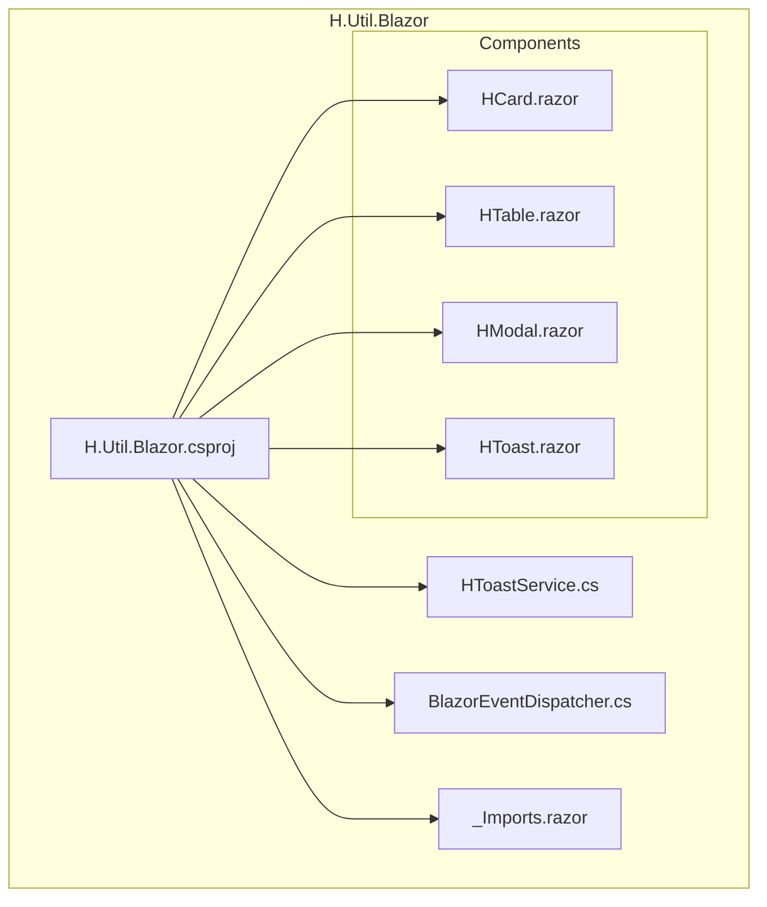
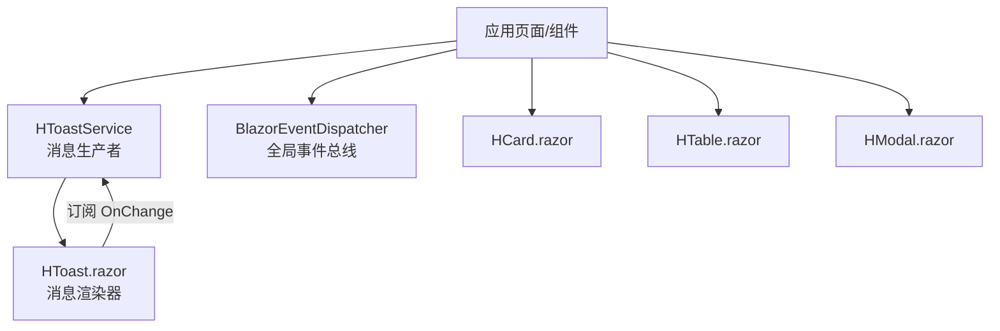
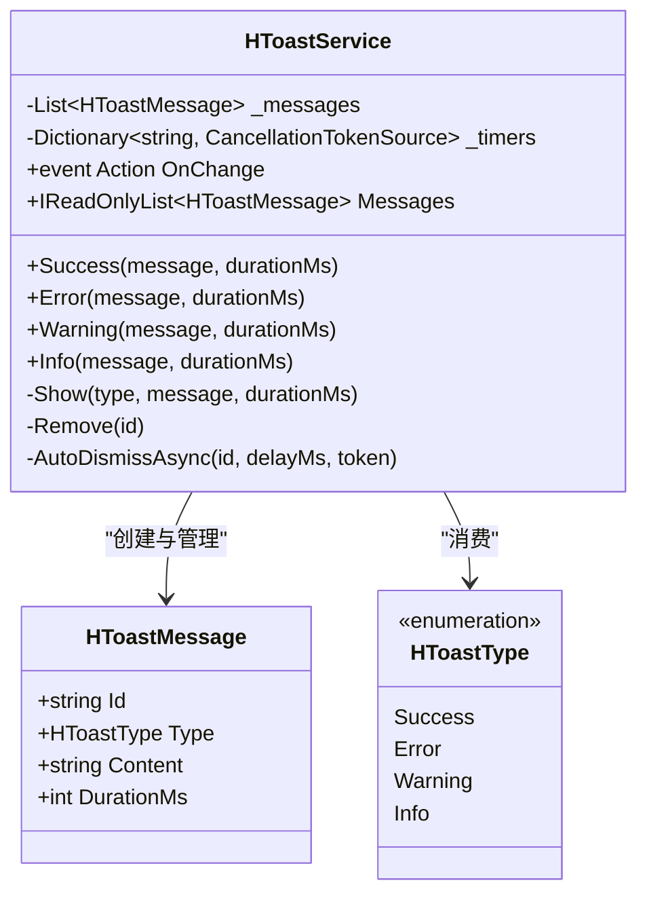
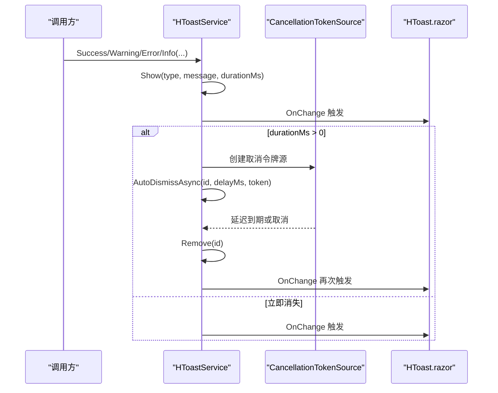
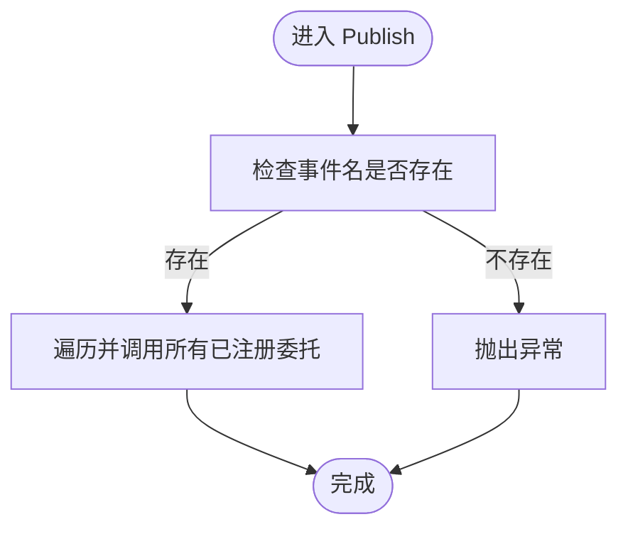
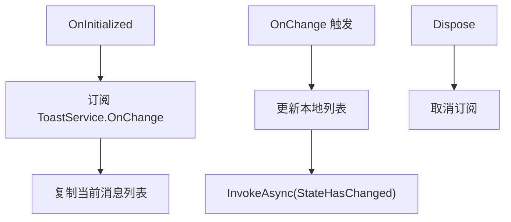
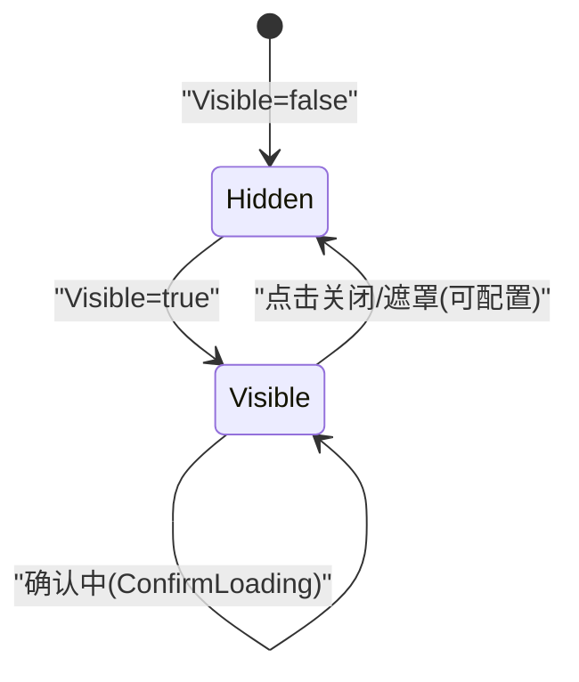
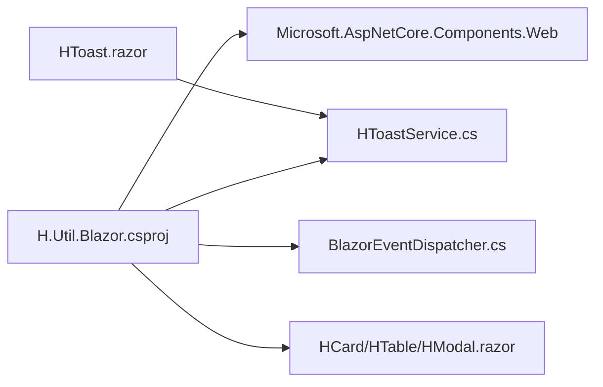

# H.Util.Blazor

<cite>
**本文引用的文件**   
- [H.Util.Blazor.csproj](file://src/Utils/H.Util.Blazor/H.Util.Blazor.csproj)
- [_Imports.razor](file://src/Utils/H.Util.Blazor/_Imports.razor)
- [HToastService.cs](file://src/Utils/H.Util.Blazor/HToastService.cs)
- [BlazorEventDispatcher.cs](file://src/Utils/H.Util.Blazor/BlazorEventDispatcher.cs)
- [HCard.razor](file://src/Utils/H.Util.Blazor/Components/HCard.razor)
- [HTable.razor](file://src/Utils/H.Util.Blazor/Components/HTable.razor)
- [HModal.razor](file://src/Utils/H.Util.Blazor/Components/HModal.razor)
- [HToast.razor](file://src/Utils/H.Util.Blazor/Components/HToast.razor)
</cite>

## 目录
1. [简介](#简介)
2. [项目结构](#项目结构)
3. [核心组件](#核心组件)
4. [架构总览](#架构总览)
5. [详细组件分析](#详细组件分析)
6. [依赖关系分析](#依赖关系分析)
7. [性能考虑](#性能考虑)
8. [故障排查指南](#故障排查指南)
9. [结论](#结论)
10. [附录：使用示例与最佳实践](#附录使用示例与最佳实践)

## 简介
H.Util.Blazor 是面向 Blazor 的轻量辅助工具库，提供以下能力：
- Toast 消息提示服务：统一的显示、样式、生命周期控制与多实例管理。
- 全局事件分发器：基于键值的事件订阅/发布机制，用于跨组件通信。
- 可复用 UI 组件：卡片、表格、模态框、Toast 展示容器等，支持属性绑定、事件回调、样式覆盖与基础国际化扩展点。
- _Imports.razor 自动导入：统一命名空间与常用 Web 组件类型，降低引用成本。

本库目标是在不引入重型框架的前提下，为应用提供一致的用户反馈、通用的组件基元与简单可靠的组件间通信方案。

## 项目结构
H.Util.Blazor 是一个 Razor Class Library（RCL），其核心目录如下：
- Components：可复用 Blazor 组件集合。
- HToastService.cs：Toast 服务实现与数据模型。
- BlazorEventDispatcher.cs：全局静态事件分发器。
- _Imports.razor：自动导入命名空间与常用类型。
- wwwroot：静态资源（如 CSS），供组件样式使用。

**图表来源**
- [H.Util.Blazor.csproj:1-9](file://src/Utils/H.Util.Blazor/H.Util.Blazor.csproj#L1-L9)

**章节来源**
- [H.Util.Blazor.csproj:1-9](file://src/Utils/H.Util.Blazor/H.Util.Blazor.csproj#L1-L9)

## 核心组件
本节聚焦三个关键能力：
- HToastService：Toast 消息的生产者，负责创建、显示、自动消失与通知更新。
- HToast.razor：Toast 消费者，订阅服务变更并渲染具体 UI。
- BlazorEventDispatcher：跨组件的全局事件总线，通过字符串键进行订阅与发布。

这些组件共同构成“消息提示 + 事件分发 + 通用 UI”的基础设施层。

**章节来源**
- [HToastService.cs:1-82](file://src/Utils/H.Util.Blazor/HToastService.cs#L1-L82)
- [HToast.razor:1-44](file://src/Utils/H.Util.Blazor/Components/HToast.razor#L1-L44)
- [BlazorEventDispatcher.cs:1-47](file://src/Utils/H.Util.Blazor/BlazorEventDispatcher.cs#L1-L47)

## 架构总览
下图展示了 H.Util.Blazor 的整体交互关系：应用页面或服务调用 HToastService 或 BlazorEventDispatcher；HToast.razor 订阅服务变更并渲染 UI；各 UI 组件暴露参数与事件回调，供上层组合使用。

**图表来源**
- [HToastService.cs:1-82](file://src/Utils/H.Util.Blazor/HToastService.cs#L1-L82)
- [HToast.razor:1-44](file://src/Utils/H.Util.Blazor/Components/HToast.razor#L1-L44)
- [BlazorEventDispatcher.cs:1-47](file://src/Utils/H.Util.Blazor/BlazorEventDispatcher.cs#L1-L47)
- [HCard.razor:1-33](file://src/Utils/H.Util.Blazor/Components/HCard.razor#L1-L33)
- [HTable.razor:1-34](file://src/Utils/H.Util.Blazor/Components/HTable.razor#L1-L34)
- [HModal.razor:1-69](file://src/Utils/H.Util.Blazor/Components/HModal.razor#L1-L69)

## 详细组件分析

### HToastService：消息提示服务
HToastService 提供成功、错误、警告、信息四类消息的统一入口，内部维护消息列表与定时任务字典，通过事件通知视图刷新，并通过 CancellationTokenSource 管理自动消失。

关键设计要点：
- 数据类型
  - HToastType：枚举，定义四种消息类型。
  - HToastMessage：单条消息，包含唯一 Id、类型、内容与持续时间。
- 显示控制
  - Success/Error/Warning/Info 方法封装 Show，便于调用方按语义选择。
  - Show 将消息加入列表，触发 OnChange，若 DurationMs > 0，则启动自动隐藏计时器。
- 生命周期管理
  - AutoDismissAsync 在延迟后移除消息；取消时捕获 TaskCanceledException 忽略异常。
  - Remove 会清理消息、取消并释放对应 CancellationTokenSource，再触发 OnChange。
- 多实例管理
  - 通过 Guid 生成的 Id 区分消息，避免重复与覆盖。
  - 每个消息独立计时，互不影响。
- 线程安全与并发
  - 当前实现未显式加锁，适用于单 Blazor 上下文下的典型场景；高并发写入需由宿主保证顺序或在外部加锁。

**图表来源**
- [HToastService.cs:1-82](file://src/Utils/H.Util.Blazor/HToastService.cs#L1-L82)

**章节来源**
- [HToastService.cs:1-82](file://src/Utils/H.Util.Blazor/HToastService.cs#L1-L82)

#### Toast 显示流程时序

**图表来源**
- [HToastService.cs:1-82](file://src/Utils/H.Util.Blazor/HToastService.cs#L1-L82)
- [HToast.razor:1-44](file://src/Utils/H.Util.Blazor/Components/HToast.razor#L1-L44)

### BlazorEventDispatcher：事件分发机制
BlazorEventDispatcher 是一个静态类，维护一个以事件名为键、委托聚合值为值的字典，提供 Subscribe/Publish/Remove 接口。

特性说明：
- 组件间通信
  - 任意组件可订阅同一 eventName，发布者 Publish 时会依次执行所有已注册委托。
- 异步事件处理
  - 当前委托类型为 Action<object?>，不包含异步能力；如需异步，请在订阅端自行包装 Task.Run 或使用 async Action 变体。
- 事件冒泡
  - 未实现冒泡语义；可通过约定命名空间（如 designengine.dragitem.onclick）组织事件名，由业务逻辑模拟层级传播。
- 健壮性
  - Publish 在未找到事件名时抛出异常，便于快速发现拼写或订阅遗漏问题。
- 内存与泄漏
  - Remove(eventName) 会删除整个事件名的全部订阅；若需要细粒度注销，建议扩展为弱引用或多订阅者集合。

**图表来源**
- [BlazorEventDispatcher.cs:1-47](file://src/Utils/H.Util.Blazor/BlazorEventDispatcher.cs#L1-L47)

**章节来源**
- [BlazorEventDispatcher.cs:1-47](file://src/Utils/H.Util.Blazor/BlazorEventDispatcher.cs#L1-L47)

### HToast.razor：Toast 渲染组件
HToast.razor 作为视图层，负责：
- 注入 HToastService 实例。
- 初始化时订阅 OnChange，复制当前消息列表。
- 收到变更时更新本地列表并触发 StateHasChanged。
- 根据消息类型渲染图标与内容。
- 实现 IDisposable，在组件销毁时解绑事件。

**图表来源**
- [HToast.razor:1-44](file://src/Utils/H.Util.Blazor/Components/HToast.razor#L1-L44)
- [HToastService.cs:1-82](file://src/Utils/H.Util.Blazor/HToastService.cs#L1-L82)

**章节来源**
- [HToast.razor:1-44](file://src/Utils/H.Util.Blazor/Components/HToast.razor#L1-L44)

### HCard.razor：卡片组件
HCard 提供结构化卡片布局，支持标题、额外区域、描述与子内容，同时允许外部传入 Class 与 Style 以便样式覆盖。

- 属性绑定
  - Title、Description：文本型属性。
  - Extra、ChildContent：RenderFragment，用于插入复杂内容。
  - Class、Style：CSS 类与行内样式。
- 样式覆盖
  - 外层容器默认类 h-card，结合传入 Class 与 Style 可实现主题定制。
- 可扩展性
  - 通过 ChildContent 承载任意嵌套组件，适合表单、图表等复杂场景。

**章节来源**
- [HCard.razor:1-33](file://src/Utils/H.Util.Blazor/Components/HCard.razor#L1-L33)

### HTable.razor：表格容器组件
HTable 提供表格外壳，包括加载中状态、空数据占位与插槽内容。

- 加载态
  - Loading 为 true 时显示加载指示器与文案。
- 空数据
  - ShowEmpty 为 true 且无数据时显示空状态模板；支持 EmptyTemplate 自定义。
- 插槽
  - ChildContent 承载 table 内部结构，便于集成第三方表格或自研表格组件。

**章节来源**
- [HTable.razor:1-34](file://src/Utils/H.Util.Blazor/Components/HTable.razor#L1-L34)

### HModal.razor：模态框组件
HModal 提供模态窗口，支持标题、关闭按钮、确定/取消按钮、遮罩点击关闭、确认加载态与行内样式。

- 可见性双向绑定
  - Visible 与 VisibleChanged 配合，实现父组件可控显示。
- 行为回调
  - OnOk、OnCancel 分别对应确定与取消操作。
- 交互细节
  - MaskClosable 控制遮罩点击是否关闭。
  - ConfirmLoading 禁用确定按钮并显示加载指示。

**图表来源**
- [HModal.razor:1-69](file://src/Utils/H.Util.Blazor/Components/HModal.razor#L1-L69)

**章节来源**
- [HModal.razor:1-69](file://src/Utils/H.Util.Blazor/Components/HModal.razor#L1-L69)

## 依赖关系分析
- 项目依赖
  - Microsoft.AspNetCore.Components.Web：提供 Blazor Web 组件运行时类型。
- 组件依赖
  - HToast.razor 依赖 HToastService。
  - HToastService 不依赖其他 Blazor 组件，仅依赖 .NET 运行时。
  - BlazorEventDispatcher 为纯静态工具，不依赖 Blazor 运行时。
- 命名空间
  - _Imports.razor 将命名空间设置为 H.Util.Blazor，并引入 Microsoft.AspNetCore.Components.Web，减少在各组件中的重复 using。

**图表来源**
- [H.Util.Blazor.csproj:1-9](file://src/Utils/H.Util.Blazor/H.Util.Blazor.csproj#L1-L9)
- [HToast.razor:1-44](file://src/Utils/H.Util.Blazor/Components/HToast.razor#L1-L44)
- [HToastService.cs:1-82](file://src/Utils/H.Util.Blazor/HToastService.cs#L1-L82)
- [BlazorEventDispatcher.cs:1-47](file://src/Utils/H.Util.Blazor/BlazorEventDispatcher.cs#L1-L47)
- [HCard.razor:1-33](file://src/Utils/H.Util.Blazor/Components/HCard.razor#L1-L33)
- [HTable.razor:1-34](file://src/Utils/H.Util.Blazor/Components/HTable.razor#L1-L34)
- [HModal.razor:1-69](file://src/Utils/H.Util.Blazor/Components/HModal.razor#L1-L69)

**章节来源**
- [H.Util.Blazor.csproj:1-9](file://src/Utils/H.Util.Blazor/H.Util.Blazor.csproj#L1-L9)
- [_Imports.razor:1-2](file://src/Utils/H.Util.Blazor/_Imports.razor#L1-L2)

## 性能考虑
- Toast 自动消失
  - 每条消息使用独立的 Task.Delay 与 CancellationTokenSource，避免相互干扰；大量短时消息可能产生较多定时器对象，应合理设置 DurationMs 并在必要时合并提示。
- 事件分发
  - BlazorEventDispatcher 的 Publish 为同步调用，若订阅端处理耗时，会阻塞发布者；建议在订阅端做异步处理与异常隔离。
- 渲染更新
  - HToast.razor 每次变更都会复制消息列表并触发 StateHasChanged；在高频率更新场景下，可考虑批量更新或节流策略。
- 内存管理
  - HToast.razor 实现了 IDisposable，确保解绑事件；对于长驻组件，注意及时销毁以避免事件泄漏。
  - BlazorEventDispatcher 的 Remove 会删除整组订阅，若需细粒度回收，应扩展订阅数据结构。

[本节为通用指导，无需特定源码引用]

## 故障排查指南
常见问题与定位思路：
- Toast 不显示或闪烁
  - 检查 HToast.razor 是否在页面或根布局中渲染。
  - 确认 HToastService 已正确注入（Blazor RCL 通常自动可用）。
  - 查看 DurationMs 是否过短导致瞬间消失。
- Toast 数量过多或内存增长
  - 检查是否频繁创建短寿命消息；考虑合并同类消息或延长间隔。
  - 确认 HToast.razor 未被意外多次实例化，导致重复订阅。
- 事件分发抛出异常
  - 确认事件名是否正确，且在发布前已订阅。
  - 检查订阅端是否有未处理的异常，必要时包裹 try/catch。
- 模态框无法关闭
  - 检查 Visible 绑定是否正确更新。
  - 确认 MaskClosable 与 HandleCancel 逻辑是否符合预期。

**章节来源**
- [HToastService.cs:1-82](file://src/Utils/H.Util.Blazor/HToastService.cs#L1-L82)
- [HToast.razor:1-44](file://src/Utils/H.Util.Blazor/Components/HToast.razor#L1-L44)
- [BlazorEventDispatcher.cs:1-47](file://src/Utils/H.Util.Blazor/BlazorEventDispatcher.cs#L1-L47)
- [HModal.razor:1-69](file://src/Utils/H.Util.Blazor/Components/HModal.razor#L1-L69)

## 结论
H.Util.Blazor 以最小依赖提供了实用的 Blazor 基础设施：
- HToastService 与 HToast.razor 协作，实现可配置、可管理、可样式化的消息提示系统。
- BlazorEventDispatcher 提供简单可靠的全局事件通道，适合轻量级组件通信。
- HCard、HTable、HModal 等组件具备良好的参数与事件扩展点，便于构建一致的界面风格。
- _Imports.razor 简化了命名空间与常用类型的引入，提升开发效率。

在更复杂的场景中，可将该库作为底层支撑，向上扩展业务组件与领域服务。

[本节为总结性内容，无需特定源码引用]

## 附录：使用示例与最佳实践

### 在 Blazor 页面中集成 Toast
- 在服务侧或组件中调用 HToastService 的 Success/Error/Warning/Info 方法显示消息。
- 在页面或布局中放置 <HToast /> 组件，使其订阅服务变更并渲染提示。
- 通过设置 DurationMs 控制显示时长；对关键操作建议使用较长的显示时间。

参考实现路径：
- [HToastService.cs:1-82](file://src/Utils/H.Util.Blazor/HToastService.cs#L1-L82)
- [HToast.razor:1-44](file://src/Utils/H.Util.Blazor/Components/HToast.razor#L1-L44)

### 实现组件间通信
- 在需要接收事件的组件中调用 BlazorEventDispatcher.Subscribe(eventName, handler)。
- 在需要发送事件的组件中调用 BlazorEventDispatcher.Publish(eventName, param)。
- 组件卸载时调用 Remove(eventName) 或按需保留；为避免内存泄漏，建议在合适的生命周期解绑。

参考实现路径：
- [BlazorEventDispatcher.cs:1-47](file://src/Utils/H.Util.Blazor/BlazorEventDispatcher.cs#L1-L47)

### 自定义组件样式与行为
- 对 HCard：通过 Class 与 Style 传入 CSS 类与行内样式；使用 Extra 与 ChildContent 插入复杂内容。
- 对 HTable：设置 Loading 与 ShowEmpty，并使用 EmptyTemplate 自定义空状态。
- 对 HModal：使用 Visible/VisibleChanged 控制显示；使用 OnOk/OnCancel 处理用户操作；MaskClosable 控制遮罩关闭；ConfirmLoading 表示确认中。

参考实现路径：
- [HCard.razor:1-33](file://src/Utils/H.Util.Blazor/Components/HCard.razor#L1-L33)
- [HTable.razor:1-34](file://src/Utils/H.Util.Blazor/Components/HTable.razor#L1-L34)
- [HModal.razor:1-69](file://src/Utils/H.Util.Blazor/Components/HModal.razor#L1-L69)

### 国际化支持建议
- 当前组件文案部分硬编码（如“加载中...”、“暂无数据”、“确定”、“取消”）。
- 推荐做法：
  - 在组件参数中增加 TextKey 或 Localizer 注入点，从资源文件中读取文案。
  - 对 HTable 的“加载中...”和“暂无数据”，以及 HModal 的“确定”“取消”，均提供可替换的文本参数或资源键。
- 这样可在不修改组件逻辑的情况下，切换不同语言环境。

[本节为概念性指导，无需特定源码引用]