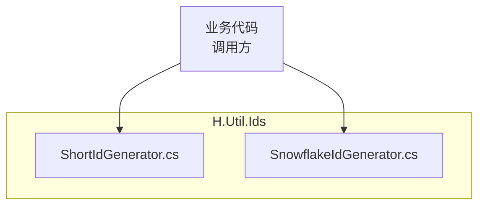
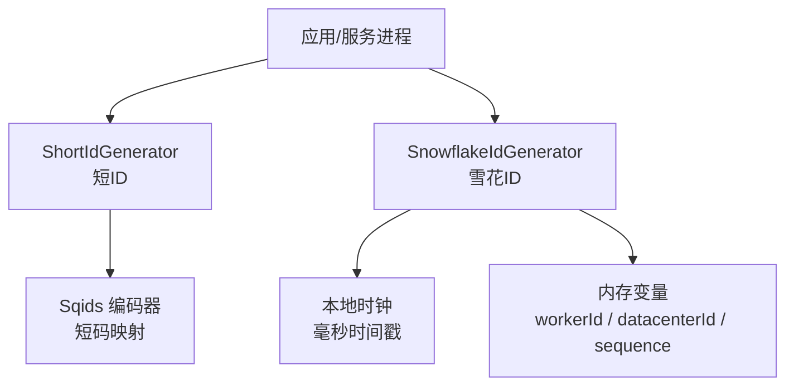
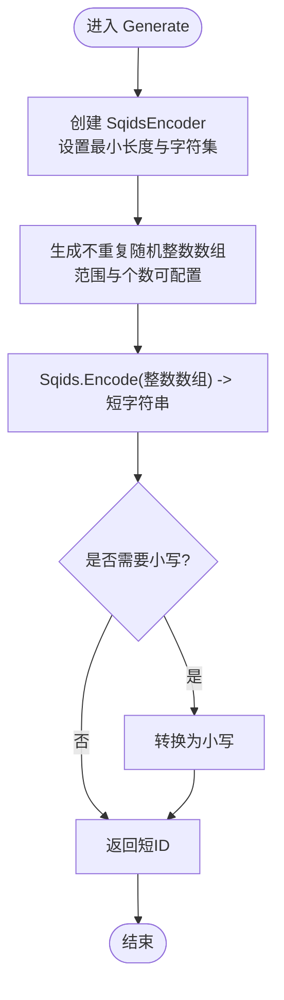
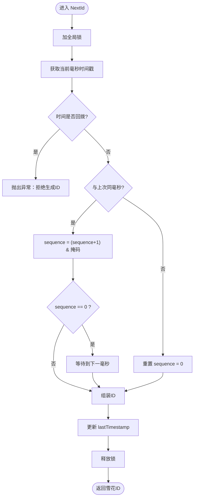
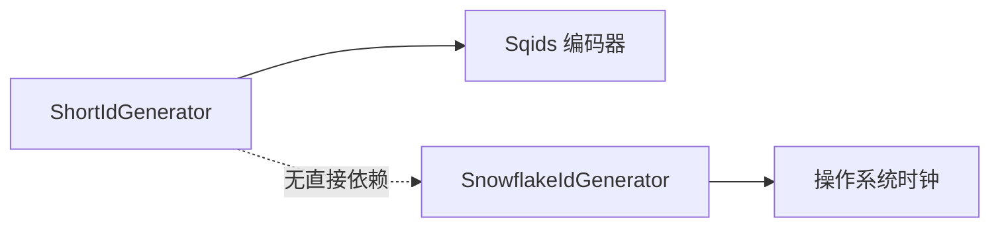

# H.Util.Ids

<cite>
**本文引用的文件**   
- [ShortIdGenerator.cs](file://src/Utils/H.Util.Ids/ShortIdGenerator.cs)
- [SnowflakeIdGenerator.cs](file://src/Utils/H.Util.Ids/SnowflakeIdGenerator.cs)
</cite>

## 目录
1. [引言](#引言)
2. [项目结构](#项目结构)
3. [核心组件](#核心组件)
4. [架构总览](#架构总览)
5. [详细组件分析](#详细组件分析)
6. [依赖与耦合分析](#依赖与耦合分析)
7. [性能考量](#性能考量)
8. [使用示例与最佳实践](#使用示例与最佳实践)
9. [故障排查指南](#故障排查指南)
10. [结论](#结论)

## 引言
H.Util.Ids 是一个轻量级 ID 生成工具库，提供两类 ID 生成策略：
- ShortIdGenerator：基于短码编码的短 ID 生成器，适合对外展示、链接、缓存键等需要简洁可读的场景。
- SnowflakeIdGenerator：雪花算法分布式 ID 生成器，适合数据库主键、事件流水号、日志追踪等需要有序性与分布式唯一性的场景。

本技术文档面向开发者，深入对比两种实现差异、适用场景，并给出在数据库索引、缓存键设计、日志追踪等常见业务中的选型建议与最佳实践。

## 项目结构
H.Util.Ids 由两个核心源文件组成，分别对应两种 ID 生成策略：
- ShortIdGenerator.cs：短 ID 生成逻辑与随机数生成辅助方法。
- SnowflakeIdGenerator.cs：雪花算法 ID 生成逻辑，包含时间戳、机器 ID、数据中心 ID、序列号组合与并发控制。

图示为概念性结构图，用于说明两个组件被同一业务模块共同消费。

## 核心组件
- ShortIdGenerator：静态类，暴露 Generate 方法，内部使用第三方 Sqids 编码器将一组随机整数映射为短字符串；同时内置随机不重复数组生成逻辑，降低冲突概率。
- SnowflakeIdGenerator：静态类，实现标准雪花算法（时间戳 + 数据中心 ID + 机器 ID + 序列号），保证分布式环境下的高吞吐、近似有序、全局唯一。

**章节来源**
- [ShortIdGenerator.cs:1-62](file://src/Utils/H.Util.Ids/ShortIdGenerator.cs#L1-L62)
- [SnowflakeIdGenerator.cs:1-90](file://src/Utils/H.Util.Ids/SnowflakeIdGenerator.cs#L1-L90)

## 架构总览
从系统角度看，H.Util.Ids 是“无状态工具层”，不提供持久化、配置中心或协调服务，所有决策都在本地完成。两种生成器职责清晰、互不依赖，可按需引入。

- ShortIdGenerator 依赖外部 Sqids 库进行短码编码。
- SnowflakeIdGenerator 依赖本地高精度时钟和线程安全锁。

**图示来源**
- [ShortIdGenerator.cs:1-62](file://src/Utils/H.Util.Ids/ShortIdGenerator.cs#L1-L62)
- [SnowflakeIdGenerator.cs:1-90](file://src/Utils/H.Util.Ids/SnowflakeIdGenerator.cs#L1-L90)

## 详细组件分析

### ShortIdGenerator 短 ID 生成器
ShortIdGenerator.Generate(minLength, isLower) 的核心流程如下：

- 字符集选择：使用固定字母数字混合字符集，避免易混淆字符，提升可读性。
- 随机性保证：通过自定义 GenerateUniqueRandom 生成不重复随机整数，再交由 Sqids 编码为短字符串。
- 冲突避免机制：
  - 多整数编码：一次生成多个随机数，使输出空间更大。
  - 固定字符集与最小长度：缩短长度会增大碰撞风险，默认 minLength=8。
  - 大小写转换：isLower=false 时保留原始大小写，增加字符空间。
- 性能优化策略：
  - 每次调用都新建 SqidsEncoder，避免跨请求共享状态。
  - 随机数组生成采用原地交换法减少额外分配。
  - 不使用全局随机单例，避免多线程竞争 Random 的内部锁。

复杂度分析：
- GenerateUniqueRandom：时间 O(n)，空间 O(max-min+2)。
- Sqids.Encode：取决于输入数组长度与编码表，整体近似线性。

适用场景：
- 对外链接、短链、分享码、订单编号展示。
- 缓存键、消息主题名等需要简短且人类可读的标识。
- 不需要强有序、但希望更紧凑的用户可见 ID。

潜在注意点：
- 非严格单调，不能直接作为排序键。
- 极端高并发下仍可能碰撞，应结合业务重试或去重。

**章节来源**
- [ShortIdGenerator.cs:1-62](file://src/Utils/H.Util.Ids/ShortIdGenerator.cs#L1-L62)

### SnowflakeIdGenerator 雪花算法实现
SnowflakeIdGenerator.NextId() 的核心流程如下：

核心原理要点：
- 时间戳分配：使用 Unix 毫秒时间戳减去起始纪元 Twepoch，左移至高位，确保 ID 随时间大致递增。
- 机器 ID 配置：WorkerIdBits=5，最大 WorkerId=31。
- 数据中心 ID 配置：DatacenterIdBits=5，最大 DatacenterId=31。
- 序列号生成：SequenceBits=12，每毫秒最多 4096 个 ID；若序列溢出则阻塞等待下一毫秒。
- 分布式唯一性保证：
  - 不同 workerId/datacenterId 组合保证跨进程/节点唯一。
  - 同节点内通过 sequence 保证同一毫秒内唯一。
  - 时钟回拨保护：检测到时间回拨立即抛错，防止生成重复 ID。
- 并发控制：使用全局 lock 保证原子性，牺牲一定吞吐换取简单可靠。

参数与位布局：
- 时间戳部分：64 位整型中取高位存储相对时间。
- 数据中心 ID：5 位。
- 机器 ID：5 位。
- 序列号：12 位。

适用场景：
- 数据库自增替代键，尤其分库分表环境。
- 事件流、日志追踪、任务流水号等需要近似有序的全局唯一 ID。
- 对时序敏感的业务，如审计、计费、风控。

潜在注意点：
- 全局锁在高并发下可能成为瓶颈，生产环境需评估 QPS。
- 机器 ID 与数据中心 ID 目前硬编码为 1，部署前应按节点规划。
- 不支持时间回拨容忍，出现 NTP 同步或手动调时会抛错。

**章节来源**
- [SnowflakeIdGenerator.cs:1-90](file://src/Utils/H.Util.Ids/SnowflakeIdGenerator.cs#L1-L90)

## 依赖与耦合分析
- ShortIdGenerator 依赖 Sqids 编码器，属于外部库依赖，但仅用于短码编码，与业务解耦良好。
- SnowflakeIdGenerator 依赖本地时间与线程同步原语，无外部库依赖，便于嵌入任意 .NET 进程。
- 两者之间无相互引用，耦合度低，可独立演进与测试。

**图示来源**
- [ShortIdGenerator.cs:1-62](file://src/Utils/H.Util.Ids/ShortIdGenerator.cs#L1-L62)
- [SnowflakeIdGenerator.cs:1-90](file://src/Utils/H.Util.Ids/SnowflakeIdGenerator.cs#L1-L90)

## 性能考量
- ShortIdGenerator：
  - 优点：短字符串体积小，传输与存储成本低；对用户友好。
  - 缺点：每次生成需构建编码器与随机数组，高 QPS 下 GC 压力略增。
  - 优化方向：可考虑缓存编码器实例（注意线程安全）或批量预生成。
- SnowflakeIdGenerator：
  - 优点：数值型 ID，比较与索引高效；近似单调递增，利于聚簇索引。
  - 缺点：全局锁限制单机并发；每毫秒上限 4096。
  - 优化方向：按 workerId 拆分生成器实例或使用无锁队列批处理；合理配置位数以平衡时间、机器与序列号空间。

[本节为通用性能讨论，不直接分析具体代码行]

## 使用示例与最佳实践

### 如何选择 ID 生成策略
- 优先选 SnowflakeIdGenerator 的场景：
  - 数据库主键、分片键、事件流水号、审计记录。
  - 需要按时间顺序查询、聚合或回放。
  - 分布式部署且需要稳定增长的全局唯一键。
- 优先选 ShortIdGenerator 的场景：
  - 对外展示编号、分享链接、邀请码、短链。
  - 缓存键、消息路由键等需要简洁可读的标识。
  - 用户界面展示与分享，强调可读性与体积。

### 数据库索引优化
- 使用 SnowflakeIdGenerator 作为主键：
  - 利用近似单调性减少页分裂，提高写入性能。
  - 建议配合聚簇索引或按时间分区。
- 使用 ShortIdGenerator 作为业务编号字段：
  - 不宜作为排序键或范围查询条件。
  - 可在外层建立独立自增或雪花 ID 做物理主键。

### 缓存键设计
- ShortIdGenerator：
  - 适合作为短键，节省 Redis/Memcached 键空间。
  - 注意大小写与分隔符一致性。
- SnowflakeIdGenerator：
  - 适合作为对象主键的缓存键，如 user:123456。
  - 可与过期策略、版本号结合。

### 日志追踪
- SnowflakeIdGenerator：
  - 作为 traceId 或 spanId 的基础，便于关联同一请求的日志。
  - 结合上游链路上下文扩展。
- ShortIdGenerator：
  - 可作为用户可见的交易号或工单号，方便人工核对。

### 典型用法示意（步骤式）
- 生成雪花 ID 并入库：
  1) 调用 SnowflakeIdGenerator.NextId() 获取 long 类型 ID。
  2) 将 ID 写入实体主键字段。
  3) 提交事务，由数据库索引优化读取性能。
- 生成短 ID 并分享：
  1) 调用 ShortIdGenerator.Generate(minLength=8, isLower=true)。
  2) 将结果存入业务编号字段并对外暴露。
  3) 前端渲染短链或分享卡片。

[本节为通用实践指导，不直接分析具体代码行]

## 故障排查指南
- SnowflakeIdGenerator 抛出“时钟回拨”异常：
  - 原因：系统时间被回拨（NTP 同步、手动调整）。
  - 处理：校准系统时间，必要时重启服务；如需容错，应在上层封装降级策略。
- SnowflakeIdGenerator 生成速率不足：
  - 现象：频繁等待下一毫秒，QPS 上不去。
  - 处理：确认单机并发模型；考虑按 workerId 拆分实例或引入批处理。
- ShortIdGenerator 出现短 ID 重复：
  - 原因：minLength 过小或 isLower=false 未充分利用字符空间。
  - 处理：增大 minLength、启用小写、或在应用层增加去重与重试。
- 短 ID 可读性问题：
  - 原因：字符集中存在易混淆字符。
  - 处理：校验字符集配置，避免歧义字符。

**章节来源**
- [SnowflakeIdGenerator.cs:33-66](file://src/Utils/H.Util.Ids/SnowflakeIdGenerator.cs#L33-L66)
- [ShortIdGenerator.cs:7-24](file://src/Utils/H.Util.Ids/ShortIdGenerator.cs#L7-L24)

## 结论
- ShortIdGenerator 的优势在于短小、可读、便于分享；适用于对外标识与缓存键等场景。
- SnowflakeIdGenerator 的优势在于有序、分布式唯一、数值型高效；适用于数据库主键、事件流水与日志追踪。
- 实际项目中可组合使用：用 SnowflakeIdGenerator 作为内部主键，用 ShortIdGenerator 生成对外业务编号，兼顾性能与体验。