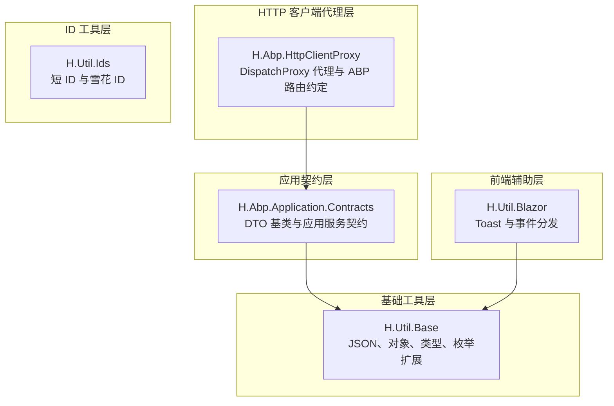
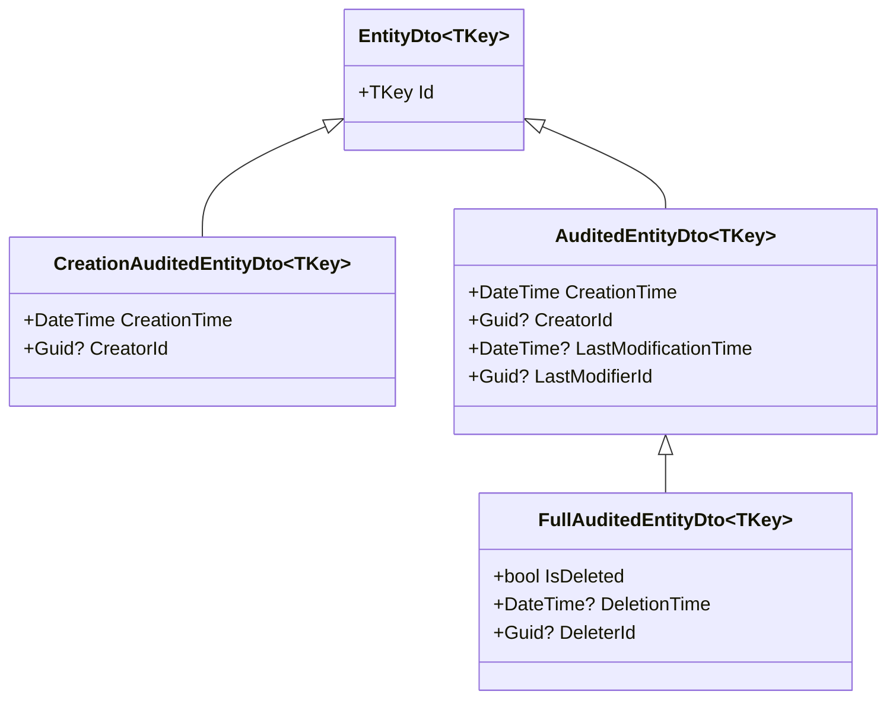
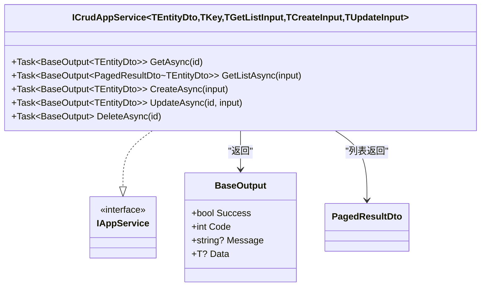
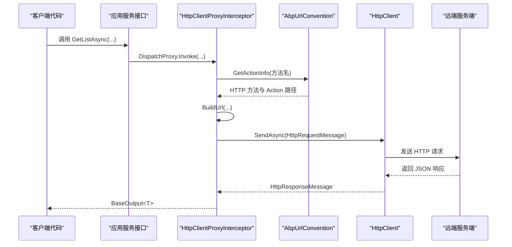
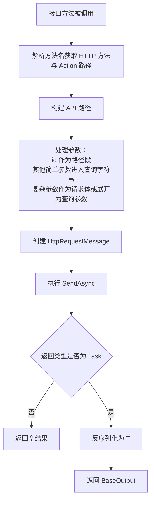
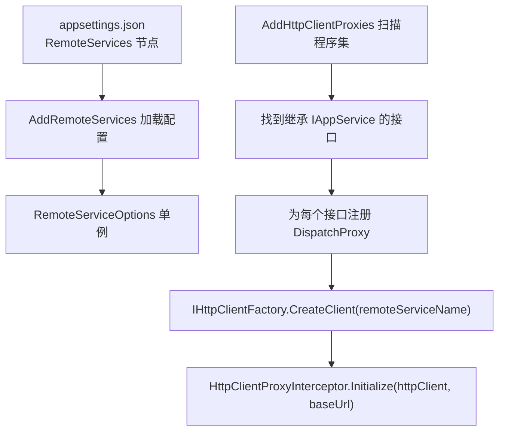
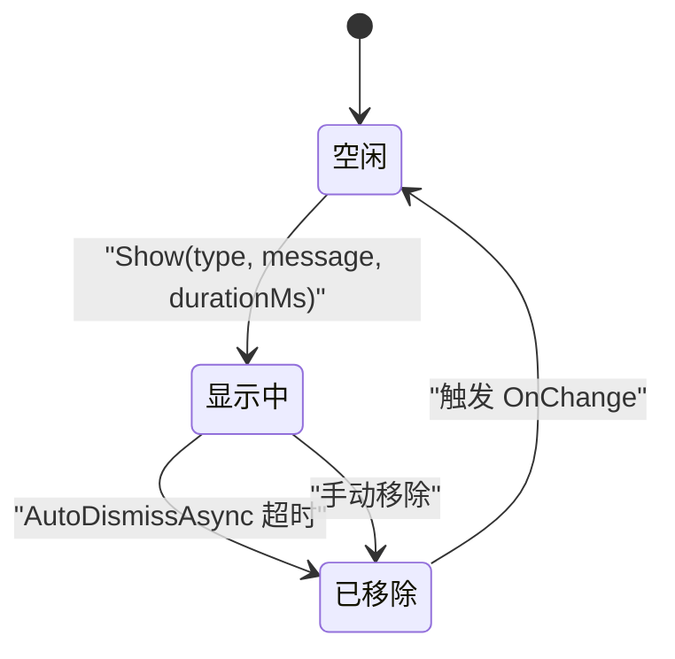
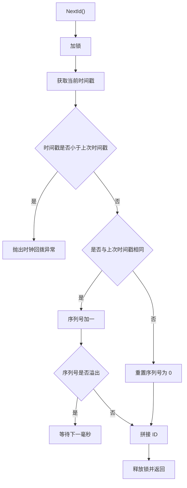
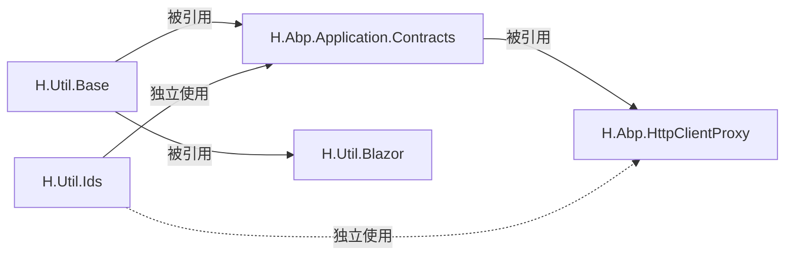

# 工具类库

<cite>
**本文引用的文件**   
- [H.Abp.Application.Contracts.csproj](file://src/Utils/H.Abp.Application.Contracts/H.Abp.Application.Contracts.csproj)
- [EntityDto.cs](file://src/Utils/H.Abp.Application.Contracts/EntityDto.cs)
- [AuditedEntityDto.cs](file://src/Utils/H.Abp.Application.Contracts/AuditedEntityDto.cs)
- [CreationAuditedEntityDto.cs](file://src/Utils/H.Abp.Application.Contracts/CreationAuditedEntityDto.cs)
- [FullAuditedEntityDto.cs](file://src/Utils/H.Abp.Application.Contracts/FullAuditedEntityDto.cs)
- [IAppService.cs](file://src/Utils/H.Abp.Application.Contracts/IAppService.cs)
- [ICrudAppService.cs](file://src/Utils/H.Abp.Application.Contracts/ICrudAppService.cs)
- [PagedResultRequestDto.cs](file://src/Utils/H.Abp.Application.Contracts/PagedResultRequestDto.cs)
- [PagedAndSortedResultRequestDto.cs](file://src/Utils/H.Abp.Application.Contracts/PagedAndSortedResultRequestDto.cs)
- [PagedResultDto.cs](file://src/Utils/H.Abp.Application.Contracts/PagedResultDto.cs)
- [H.Abp.HttpClientProxy.csproj](file://src/Utils/H.Abp.HttpClientProxy/H.Abp.HttpClientProxy.csproj)
- [HttpClientProxyInterceptor.cs](file://src/Utils/H.Abp.HttpClientProxy/HttpClientProxyInterceptor.cs)
- [AbpUrlConvention.cs](file://src/Utils/H.Abp.HttpClientProxy/AbpUrlConvention.cs)
- [RemoteServiceOptions.cs](file://src/Utils/H.Abp.HttpClientProxy/RemoteServiceOptions.cs)
- [ServiceCollectionExtensions.cs](file://src/Utils/H.Abp.HttpClientProxy/ServiceCollectionExtensions.cs)
- [H.Util.Base.csproj](file://src/Utils/H.Util.Base/H.Util.Base.csproj)
- [JsonExtension.cs](file://src/Utils/H.Util.Base/JsonExtension.cs)
- [ObjectExtension.cs](file://src/Utils/H.Util.Base/ObjectExtension.cs)
- [TypeExtension.cs](file://src/Utils/H.Util.Base/TypeExtension.cs)
- [EnumExtension.cs](file://src/Utils/H.Util.Base/EnumExtension.cs)
- [BaseOutput.cs](file://src/Utils/H.Util.Base/BaseOutput.cs)
- [H.Util.Blazor.csproj](file://src/Utils/H.Util.Blazor/H.Util.Blazor.csproj)
- [HToastService.cs](file://src/Utils/H.Util.Blazor/HToastService.cs)
- [BlazorEventDispatcher.cs](file://src/Utils/H.Util.Blazor/BlazorEventDispatcher.cs)
- [H.Util.Ids.csproj](file://src/Utils/H.Util.Ids/H.Util.Ids.csproj)
- [ShortIdGenerator.cs](file://src/Utils/H.Util.Ids/ShortIdGenerator.cs)
- [SnowflakeIdGenerator.cs](file://src/Utils/H.Util.Ids/SnowflakeIdGenerator.cs)
</cite>

## 目录

1. [引言](#引言)
2. [项目结构](#项目结构)
3. [核心组件](#核心组件)
4. [架构总览](#架构总览)
5. [详细组件分析](#详细组件分析)
6. [依赖关系分析](#依赖关系分析)
7. [性能考虑](#性能考虑)
8. [故障排查指南](#故障排查指南)
9. [结论](#结论)
10. [附录：使用示例与最佳实践](#附录使用示例与最佳实践)

## 引言

本仓库中的 AppLab 工具类库由五个相互协作的 .NET 子库组成，分别面向应用契约、HTTP 客户端动态代理、基础扩展方法、Blazor 前端辅助以及 ID 生成策略。它们共同服务于前后端分离或微服务化场景：

- **H.Abp.Application.Contracts**：定义通用 DTO 基类和标准应用服务接口约定，便于跨语言、跨进程的数据契约和 CRUD 能力抽象。
- **H.Abp.HttpClientProxy**：基于 `DispatchProxy` 的动态 HTTP 代理，将 C# 接口调用转换为 ABP 风格 REST 请求。
- **H.Util.Base**：提供 JSON 序列化、对象深拷贝、类型反射、枚举处理等基础扩展方法，以及统一输出包装。
- **H.Util.Blazor**：为 Blazor 应用提供 Toast 消息服务和轻量级事件分发机制。
- **H.Util.Ids**：提供短 ID 与雪花 ID 两种分布式 ID 生成策略。

该文档从系统架构、数据流、关键算法到部署配置逐步展开，帮助初学者快速理解整体设计，同时为有经验的开发者提供实现细节和优化建议。

## 项目结构

工具类库按职责划分为以下五个项目：

| 项目 | 主要职责 | 典型文件 |
|---|---|---|
| H.Abp.Application.Contracts | 应用层 DTO 与接口契约 | EntityDto、ICrudAppService、PagedResultDto |
| H.Abp.HttpClientProxy | HTTP 客户端动态代理与路由约定 | HttpClientProxyInterceptor、AbpUrlConvention |
| H.Util.Base | JSON、对象、类型、枚举扩展与统一输出 | JsonExtension、BaseOutput |
| H.Util.Blazor | Blazor 消息提示与事件总线 | HToastService、BlazorEventDispatcher |
| H.Util.Ids | 短 ID 与雪花 ID 生成器 | ShortIdGenerator、SnowflakeIdGenerator |



**图表来源**
- [H.Abp.Application.Contracts.csproj:1-7](file://src/Utils/H.Abp.Application.Contracts/H.Abp.Application.Contracts.csproj#L1-L7)
- [H.Abp.HttpClientProxy.csproj:1-11](file://src/Utils/H.Abp.HttpClientProxy/H.Abp.HttpClientProxy.csproj#L1-L11)
- [H.Util.Base.csproj:1-3](file://src/Utils/H.Util.Base/H.Util.Base.csproj#L1-L3)
- [H.Util.Blazor.csproj:1-9](file://src/Utils/H.Util.Blazor/H.Util.Blazor.csproj#L1-L9)
- [H.Util.Ids.csproj:1-6](file://src/Utils/H.Util.Ids/H.Util.Ids.csproj#L1-L6)

**章节来源**
- [H.Abp.Application.Contracts.csproj:1-7](file://src/Utils/H.Abp.Application.Contracts/H.Abp.Application.Contracts.csproj#L1-L7)
- [H.Abp.HttpClientProxy.csproj:1-11](file://src/Utils/H.Abp.HttpClientProxy/H.Abp.HttpClientProxy.csproj#L1-L11)
- [H.Util.Base.csproj:1-3](file://src/Utils/H.Util.Base/H.Util.Base.csproj#L1-L3)
- [H.Util.Blazor.csproj:1-9](file://src/Utils/H.Util.Blazor/H.Util.Blazor.csproj#L1-L9)
- [H.Util.Ids.csproj:1-6](file://src/Utils/H.Util.Ids/H.Util.Ids.csproj#L1-L6)

## 核心组件

### 通用 DTO 基类

通用 DTO 基类采用分层继承结构，逐步叠加审计信息：

- **EntityDto<TKey>**：最基础的实体标识 DTO，仅包含主键字段。
- **CreationAuditedEntityDto<TKey>**：在实体基础上增加创建时间和创建者。
- **AuditedEntityDto<TKey>**：在创建审计基础上增加最后修改时间和最后修改者。
- **FullAuditedEntityDto<TKey>**：在完整审计基础上增加软删除相关字段。



**图表来源**
- [EntityDto.cs:1-6](file://src/Utils/H.Abp.Application.Contracts/EntityDto.cs#L1-L6)
- [CreationAuditedEntityDto.cs:1-7](file://src/Utils/H.Abp.Application.Contracts/CreationAuditedEntityDto.cs#L1-L7)
- [AuditedEntityDto.cs:1-9](file://src/Utils/H.Abp.Application.Contracts/AuditedEntityDto.cs#L1-L9)
- [FullAuditedEntityDto.cs:1-11](file://src/Utils/H.Abp.Application.Contracts/FullAuditedEntityDto.cs#L1-L11)

#### 使用场景建议

| DTO 基类 | 适用场景 | 推荐字段组合 |
|---|---|---|
| EntityDto | 只读展示、简单查询结果 | Id |
| CreationAuditedEntityDto | 需要记录创建信息的业务实体 | Id、CreationTime、CreatorId |
| AuditedEntityDto | 需要追踪创建和修改历史 | Id、CreationTime、CreatorId、LastModificationTime、LastModifierId |
| FullAuditedEntityDto | 需要支持软删除和完整审计 | Id、CreationTime、CreatorId、LastModificationTime、LastModifierId、IsDeleted、DeletionTime、DeleterId |

**章节来源**
- [EntityDto.cs:1-6](file://src/Utils/H.Abp.Application.Contracts/EntityDto.cs#L1-L6)
- [CreationAuditedEntityDto.cs:1-7](file://src/Utils/H.Abp.Application.Contracts/CreationAuditedEntityDto.cs#L1-L7)
- [AuditedEntityDto.cs:1-9](file://src/Utils/H.Abp.Application.Contracts/AuditedEntityDto.cs#L1-L9)
- [FullAuditedEntityDto.cs:1-11](file://src/Utils/H.Abp.Application.Contracts/FullAuditedEntityDto.cs#L1-L11)

### 应用服务接口约定

#### IAppService

`IAppService` 是一个标记接口，用于标识可通过 HTTP 代理远程调用的服务接口。它本身不定义任何方法，而是作为扫描和注册规则的基础。

#### ICrudAppService

`ICrudAppService<TEntityDto, TKey, TGetListInput, TCreateInput, TUpdateInput>` 定义了标准 CRUD 操作，返回统一的 `BaseOutput<T>` 包装结果。其设计目标是：

- 提供 Get、GetList、Create、Update、Delete 五种标准操作。
- 使用泛型约束输入输出类型，使不同业务实体复用同一套契约。
- 通过 `IAppService` 标记，被 HTTP 代理自动发现并注册。



**图表来源**
- [IAppService.cs:1-8](file://src/Utils/H.Abp.Application.Contracts/IAppService.cs#L1-L8)
- [ICrudAppService.cs:1-15](file://src/Utils/H.Abp.Application.Contracts/ICrudAppService.cs#L1-L15)
- [BaseOutput.cs:1-52](file://src/Utils/H.Util.Base/BaseOutput.cs#L1-L52)
- [PagedResultDto.cs:1-19](file://src/Utils/H.Abp.Application.Contracts/PagedResultDto.cs#L1-L19)

**章节来源**
- [IAppService.cs:1-8](file://src/Utils/H.Abp.Application.Contracts/IAppService.cs#L1-L8)
- [ICrudAppService.cs:1-15](file://src/Utils/H.Abp.Application.Contracts/ICrudAppService.cs#L1-L15)
- [BaseOutput.cs:1-52](file://src/Utils/H.Util.Base/BaseOutput.cs#L1-L52)

## 架构总览

下图展示了客户端调用接口时，动态代理如何将方法调用转化为 HTTP 请求，并最终返回结构化响应。



**图表来源**
- [HttpClientProxyInterceptor.cs:1-200](file://src/Utils/H.Abp.HttpClientProxy/HttpClientProxyInterceptor.cs#L1-L200)
- [AbpUrlConvention.cs:1-86](file://src/Utils/H.Abp.HttpClientProxy/AbpUrlConvention.cs#L1-L86)

## 详细组件分析

### H.Abp.Application.Contracts：通用 DTO 与分页模型

#### DTO 继承链

DTO 基类的继承链是典型的“审计能力递增”模式：

1. `EntityDto<TKey>` 提供唯一标识。
2. `CreationAuditedEntityDto<TKey>` 增加创建审计。
3. `AuditedEntityDto<TKey>` 增加修改审计。
4. `FullAuditedEntityDto<TKey>` 增加软删除审计。

这种设计让业务 DTO 按需选择审计粒度，避免所有实体都携带不必要的审计字段。

#### 分页请求与结果

| 类型 | 字段 | 用途 |
|---|---|---|
| PagedResultRequestDto | SkipCount、MaxResultCount | 分页请求基础参数 |
| PagedAndSortedResultRequestDto | Sorting | 在分页基础上增加排序字段 |
| PagedResultDto<T> | TotalCount、Items | 分页结果，包含总数和当前页数据 |

#### 设计要点

- DTO 命名与结构尽量与 ABP 保持兼容，降低前后端集成成本。
- 分页结果使用 `long TotalCount`，避免整数溢出。
- 列表数据使用 `IReadOnlyList<T>`，体现不可变语义。

**章节来源**
- [EntityDto.cs:1-6](file://src/Utils/H.Abp.Application.Contracts/EntityDto.cs#L1-L6)
- [AuditedEntityDto.cs:1-9](file://src/Utils/H.Abp.Application.Contracts/AuditedEntityDto.cs#L1-L9)
- [CreationAuditedEntityDto.cs:1-7](file://src/Utils/H.Abp.Application.Contracts/CreationAuditedEntityDto.cs#L1-L7)
- [FullAuditedEntityDto.cs:1-11](file://src/Utils/H.Abp.Application.Contracts/FullAuditedEntityDto.cs#L1-L11)
- [PagedResultRequestDto.cs:1-11](file://src/Utils/H.Abp.Application.Contracts/PagedResultRequestDto.cs#L1-L11)
- [PagedAndSortedResultRequestDto.cs:1-9](file://src/Utils/H.Abp.Application.Contracts/PagedAndSortedResultRequestDto.cs#L1-L9)
- [PagedResultDto.cs:1-19](file://src/Utils/H.Abp.Application.Contracts/PagedResultDto.cs#L1-L19)

### H.Abp.HttpClientProxy：动态代理与 ABP 路由约定

#### HttpClientProxyInterceptor：DispatchProxy 实现原理

`HttpClientProxyInterceptor<TService>` 继承自 `DispatchProxy`，核心流程如下：

1. 通过 `Initialize` 注入 `HttpClient`、基础 URL 和服务控制器名称。
2. 拦截接口方法调用，解析目标 HTTP 方法和 action 路径。
3. 构建 URL，包括路径段、查询参数和请求体。
4. 根据返回值类型决定无返回、`Task` 还是 `Task<T>`。
5. 使用 `HttpClient.SendAsync` 发起真实 HTTP 请求。



**图表来源**
- [HttpClientProxyInterceptor.cs:1-200](file://src/Utils/H.Abp.HttpClientProxy/HttpClientProxyInterceptor.cs#L1-L200)

#### AbpUrlConvention：路由解析逻辑

`AbpUrlConvention` 负责把 C# 接口和方法名映射到 ABP 风格的 URL：

- **控制器名称**：去掉 `I` 前缀，去掉 `AppService` 或 `ApplicationService` 后缀，再转为 kebab-case。
- **动作路径**：识别 `GetList`、`GetAll`、`Get`、`Put`、`Update`、`Delete`、`Remove`、`Create`、`Add`、`Insert`、`Post`、`Patch` 等前缀。
- **驼峰转短横线**：先转为 camelCase，再在小写字母或数字与大写字母之间插入连字符。

| 方法名 | HTTP 方法 | Action 路径 |
|---|---|---|
| GetListAsync | GET | get-list |
| GetAllAsync | GET | get-all |
| GetAsync | GET | get |
| UpdateAsync | PUT | update |
| PutAsync | PUT | put |
| DeleteAsync | DELETE | delete |
| RemoveAsync | DELETE | remove |
| CreateAsync | POST | create |
| AddAsync | POST | add |
| InsertAsync | POST | insert |
| PostAsync | POST | post |
| PatchAsync | PATCH | patch |

#### RemoteServiceOptions：配置选项

`RemoteServiceConfiguration` 表示单个远程服务的配置，目前至少包含 `BaseUrl`。`RemoteServiceOptions` 则维护一个可忽略大小写的服务名到配置的字典，并提供索引器、配置写入和读取方法。

#### ServiceCollectionExtensions：服务注册

扩展方法提供两个核心功能：

1. `AddRemoteServices`：从 `IConfiguration` 的 `RemoteServices` 节点加载配置。
2. `AddHttpClientProxies`：扫描指定程序集中所有继承 `IAppService` 的接口，并为每个接口注册 `DispatchProxy` 实现。



**图表来源**
- [ServiceCollectionExtensions.cs:1-63](file://src/Utils/H.Abp.HttpClientProxy/ServiceCollectionExtensions.cs#L1-L63)
- [RemoteServiceOptions.cs:1-33](file://src/Utils/H.Abp.HttpClientProxy/RemoteServiceOptions.cs#L1-L33)

**章节来源**
- [HttpClientProxyInterceptor.cs:1-200](file://src/Utils/H.Abp.HttpClientProxy/HttpClientProxyInterceptor.cs#L1-L200)
- [AbpUrlConvention.cs:1-86](file://src/Utils/H.Abp.HttpClientProxy/AbpUrlConvention.cs#L1-L86)
- [RemoteServiceOptions.cs:1-33](file://src/Utils/H.Abp.HttpClientProxy/RemoteServiceOptions.cs#L1-L33)
- [ServiceCollectionExtensions.cs:1-63](file://src/Utils/H.Abp.HttpClientProxy/ServiceCollectionExtensions.cs#L1-L63)

### H.Util.Base：基础扩展方法

#### JsonExtension：JSON 处理

`JsonExtension` 提供两个扩展方法：

- `ToJson`：将对象序列化为 JSON 字符串。
- `FromJson<T>`：将 JSON 字符串反序列化为对象。

默认序列化选项开启 Web 风格默认值、忽略默认值、并使用宽松 JavaScript 编码器。反序列化失败时会抛出带有原始 JSON 信息的 `JsonException`。

#### ObjectExtension：对象操作

`ObjectExtension` 提供三类能力：

1. **深拷贝**：通过 JSON 序列化与反序列化实现浅层深拷贝。
2. **类型转换**：将任意对象或 `JsonElement` 转换为目标类型，支持枚举、基本类型、字典、数组等。
3. **JSON 元素解析**：将 `JsonElement` 递归解析为原生对象结构。

#### TypeExtension：类型反射

`TypeExtension` 提供：

- `GetDefaultValue`：为给定类型生成合理默认值，包括数组、List、Dictionary、集合接口、值类型和引用类型。
- `ResolveType`：通过程序集内搜索解析类型名称，支持带程序集名的完整类型名。

#### EnumExtension：枚举处理

`EnumExtensions` 提供枚举名称获取与多种形式的枚举转换：

- 从枚举值、整型、字符串获取枚举名称。
- 从整型或字符串安全转换为枚举，支持默认值回退。

内部使用 `ConcurrentDictionary` 缓存枚举名称，提升重复调用性能。

#### BaseOutput：统一输出包装

`BaseOutput` 是所有 API 响应的统一包装：

- `Success`：表示是否成功。
- `Code`：业务状态码，0 通常表示成功。
- `Message`：可选提示信息。
- `BaseOutput<T>`：在基础输出上增加 `Data` 字段承载业务数据。

**章节来源**
- [JsonExtension.cs:1-45](file://src/Utils/H.Util.Base/JsonExtension.cs#L1-L45)
- [ObjectExtension.cs:1-105](file://src/Utils/H.Util.Base/ObjectExtension.cs#L1-L105)
- [TypeExtension.cs:1-78](file://src/Utils/H.Util.Base/TypeExtension.cs#L1-L78)
- [EnumExtension.cs:1-44](file://src/Utils/H.Util.Base/EnumExtension.cs#L1-L44)
- [BaseOutput.cs:1-52](file://src/Utils/H.Util.Base/BaseOutput.cs#L1-L52)

### H.Util.Blazor：Blazor 辅助组件

#### HToastService：消息提示服务

`HToastService` 是一个基于作用域生命周期的全局 Toast 服务，核心特性：

- 提供 `Success`、`Error`、`Warning`、`Info` 四种消息类型。
- 每条消息拥有唯一 ID、内容、持续时间和自动消失定时器。
- 通过 `OnChange` 事件通知 UI 刷新消息列表。
- 使用 `CancellationTokenSource` 管理自动消失定时器，避免内存泄漏。



**图表来源**
- [HToastService.cs:1-82](file://src/Utils/H.Util.Blazor/HToastService.cs#L1-L82)

#### BlazorEventDispatcher：事件分发机制

`BlazorEventDispatcher` 是一个静态事件总线：

- `Subscribe`：订阅某个事件名称对应的回调。
- `Remove`：移除某个事件的所有订阅。
- `Publish`：发布事件并传递参数。如果事件不存在，会抛出异常。

注意：该实现使用静态字典，适合轻量级跨组件通信，但不适合长时间运行且频繁订阅释放的场景；若需要更严谨的生命周期管理，应结合 Blazor 组件生命周期或 DI 容器进行优化。

**章节来源**
- [HToastService.cs:1-82](file://src/Utils/H.Util.Blazor/HToastService.cs#L1-L82)
- [BlazorEventDispatcher.cs:1-47](file://src/Utils/H.Util.Blazor/BlazorEventDispatcher.cs#L1-L47)

### H.Util.Ids：ID 生成策略

#### ShortIdGenerator：短 ID 生成器

`ShortIdGenerator.Generate` 基于第三方库 `Sqids`，核心流程：

1. 生成一组随机整数。
2. 使用 Sqids 编码为短字符串。
3. 可选择是否转为小写。

该方案适合生成人类可读、较短且不连续的业务 ID，例如订单号片段、分享链接 ID 等。

#### SnowflakeIdGenerator：雪花 ID 生成器

`SnowflakeIdGenerator` 是线程安全的分布式 ID 生成器，核心字段布局：

| 位段 | 含义 |
|---|---|
| 时间戳 | 距离固定起始时间的毫秒数 |
| 数据中心 ID | 数据中心标识 |
| 机器 ID | 机器标识 |
| 序列号 | 同毫秒内的递增序号 |

关键行为：

- 如果时钟回拨，直接抛出异常。
- 同一毫秒内通过序列号保证唯一性。
- 序列号用尽时等待下一毫秒。



**图表来源**
- [SnowflakeIdGenerator.cs:1-90](file://src/Utils/H.Util.Ids/SnowflakeIdGenerator.cs#L1-L90)

#### 适用场景对比

| 生成器 | 特点 | 适用场景 |
|---|---|---|
| ShortIdGenerator | 短字符串、可读性较好、非单调 | 对外暴露的短链接、分享 ID、临时令牌片段 |
| SnowflakeIdGenerator | 长整型、分布式有序、高性能 | 数据库主键、日志流水号、分布式任务编号 |

**章节来源**
- [ShortIdGenerator.cs:1-62](file://src/Utils/H.Util.Ids/ShortIdGenerator.cs#L1-L62)
- [SnowflakeIdGenerator.cs:1-90](file://src/Utils/H.Util.Ids/SnowflakeIdGenerator.cs#L1-L90)

## 依赖关系分析

各工具库之间的依赖关系如下：



- `H.Util.Base` 是最底层工具库，被多个上层库引用。
- `H.Abp.Application.Contracts` 依赖 `H.Util.Base`，因为 `ICrudAppService` 返回 `BaseOutput<T>`。
- `H.Abp.HttpClientProxy` 依赖 `H.Abp.Application.Contracts`，用于扫描 `IAppService` 接口。
- `H.Util.Blazor` 依赖 `H.Util.Base`，主要用于 JSON 和类型扩展。
- `H.Util.Ids` 相对独立，可被任意层引用。

**章节来源**
- [H.Abp.Application.Contracts.csproj:1-7](file://src/Utils/H.Abp.Application.Contracts/H.Abp.Application.Contracts.csproj#L1-L7)
- [H.Abp.HttpClientProxy.csproj:1-11](file://src/Utils/H.Abp.HttpClientProxy/H.Abp.HttpClientProxy.csproj#L1-L11)
- [H.Util.Base.csproj:1-3](file://src/Utils/H.Util.Base/H.Util.Base.csproj#L1-L3)
- [H.Util.Blazor.csproj:1-9](file://src/Utils/H.Util.Blazor/H.Util.Blazor.csproj#L1-L9)
- [H.Util.Ids.csproj:1-6](file://src/Utils/H.Util.Ids/H.Util.Ids.csproj#L1-L6)

## 性能考虑

### DTO 设计

- 避免在无必要的情况下使用 `FullAuditedEntityDto`，以减少网络传输和序列化开销。
- 分页结果使用 `IReadOnlyList<T>`，避免客户端误修改服务端返回集合。

### HTTP 代理

- 动态代理会增加一次反射调用和一次 JSON 序列化开销，不适合极高吞吐的内部热点路径；更适合对外 API 网关或服务间调用。
- URL 构建时对复杂参数展开为查询参数时，会遍历属性并反射取值，大量嵌套对象可能带来额外 CPU 消耗。
- `HttpClientProxyInterceptor` 内部使用静态 `JsonSerializerOptions`，有利于减少重复分配。

### JSON 处理

- `JsonExtension.FromJson` 在反序列化失败时会包裹原始 JSON，调试友好但会产生额外字符串构造开销。
- `ObjectExtension.DeepClone` 基于 JSON 序列化实现深拷贝，对大型对象树而言不如对象图克隆更高效。

### 事件分发

- `BlazorEventDispatcher` 使用静态字典，订阅过多或未及时清理可能导致内存占用增长。
- `HToastService` 使用定时器自动移除消息，需注意大量短时消息场景下的 GC 压力。

### ID 生成

- `ShortIdGenerator` 每次生成都会创建随机数和 Sqids 编码器，高频调用时可考虑缓存编码器实例。
- `SnowflakeIdGenerator` 使用全局锁保证线程安全，在高并发下可能成为瓶颈；多机部署时应确保机器 ID 和数据中心 ID 不冲突。

## 故障排查指南

### HTTP 代理无法访问远端服务

常见原因：

1. 未调用 `AddRemoteServices` 加载 `RemoteServices` 配置。
2. 未调用 `AddHttpClientProxies` 扫描包含 `IAppService` 的程序集。
3. `IHttpClientFactory` 未正确注册。
4. 远端服务地址不正确，或未启用 HTTPS。

排查步骤：

- 检查 `appsettings.json` 中是否存在 `RemoteServices` 节点。
- 确认服务注册顺序：先 `AddRemoteServices`，再 `AddHttpClientProxies`。
- 检查 `HttpClientProxyInterceptor.Initialize` 是否正确注入 `httpClient` 和 `baseUrl`。

**章节来源**
- [ServiceCollectionExtensions.cs:1-63](file://src/Utils/H.Abp.HttpClientProxy/ServiceCollectionExtensions.cs#L1-L63)
- [RemoteServiceOptions.cs:1-33](file://src/Utils/H.Abp.HttpClientProxy/RemoteServiceOptions.cs#L1-L33)

### 接口方法映射不到预期 URL

常见原因：

1. 方法名没有匹配 ABP 约定的前缀。
2. 控制器名称不符合 `I*AppService` 或 `I*ApplicationService` 命名规范。
3. 参数名不是 `id` 或没有以 `Id` 结尾。
4. 复杂参数被当作请求体，而不是查询参数。

排查步骤：

- 查看 `AbpUrlConvention.GetControllerName` 和 `GetActionInfo` 的输出。
- 检查方法名是否以 `Get`、`Create`、`Update`、`Delete` 等前缀开头。
- 检查参数名是否符合 ABP 路径参数约定。

**章节来源**
- [AbpUrlConvention.cs:1-86](file://src/Utils/H.Abp.HttpClientProxy/AbpUrlConvention.cs#L1-L86)
- [HttpClientProxyInterceptor.cs:1-200](file://src/Utils/H.Abp.HttpClientProxy/HttpClientProxyInterceptor.cs#L1-L200)

### JSON 反序列化失败

常见原因：

1. 远端返回 JSON 结构与目标类型不一致。
2. 日期格式、枚举值、布尔值大小写不一致。
3. 传入的 JSON 为空或格式非法。

排查步骤：

- 检查 `JsonExtension.FromJson` 抛出的 `JsonException` 中的 message、path 和 json 字段。
- 确认 DTO 字段命名策略与远端一致。
- 对不确定格式的输入使用 `ObjectExtension.ConvertToRealType` 做弹性解析。

**章节来源**
- [JsonExtension.cs:1-45](file://src/Utils/H.Util.Base/JsonExtension.cs#L1-L45)
- [ObjectExtension.cs:1-105](file://src/Utils/H.Util.Base/ObjectExtension.cs#L1-L105)

### Blazor 事件未触发

常见原因：

1. 事件名拼写不一致。
2. 先调用 `Publish` 再调用 `Subscribe`。
3. 组件销毁后仍持有旧订阅引用。

排查步骤：

- 检查事件名是否符合 `{组件库名称}.{组件名称}.{事件名称}` 命名约定。
- 确认订阅发生在发布之前。
- 在组件销毁时调用 `BlazorEventDispatcher.Remove` 清理事件。

**章节来源**
- [BlazorEventDispatcher.cs:1-47](file://src/Utils/H.Util.Blazor/BlazorEventDispatcher.cs#L1-L47)

### 雪花 ID 时钟回拨

当系统时间回拨时，`SnowflakeIdGenerator` 会抛出异常。这通常是 NTP 同步或虚拟机时间调整导致。

处理建议：

- 生产环境禁用手动时间调整。
- 虚拟化环境中确保宿主机时间稳定。
- 如需容忍轻微回拨，可在外层封装重试或降级逻辑，但需评估重复 ID 风险。

**章节来源**
- [SnowflakeIdGenerator.cs:1-90](file://src/Utils/H.Util.Ids/SnowflakeIdGenerator.cs#L1-L90)

## 结论

AppLab 工具类库围绕“契约清晰、代理透明、基础稳固、前端易用、ID 可控”五个方向构建了完整的基础设施：

- `H.Abp.Application.Contracts` 提供了稳定的 DTO 和应用服务契约。
- `H.Abp.HttpClientProxy` 用动态代理屏蔽了 HTTP 调用细节。
- `H.Util.Base` 提供了可靠的 JSON、对象、类型和枚举工具。
- `H.Util.Blazor` 简化了 Blazor 的消息提示和事件通信。
- `H.Util.Ids` 提供了短 ID 和雪花 ID 两种常用分布式 ID 策略。

在实际项目中，建议优先明确 API 契约和 DTO 设计，再基于 `ICrudAppService` 和 `DispatchProxy` 快速搭建客户端调用层，配合统一输出包装和错误提示，形成一致的端到端体验。

## 附录：使用示例与最佳实践

以下示例以说明性方式描述用法，不直接粘贴源代码。

### 定义业务 DTO

推荐使用继承链中最接近需求的基类：

- 只读展示：继承 `EntityDto<long>`。
- 需要创建审计：继承 `CreationAuditedEntityDto<long>`。
- 需要完整审计：继承 `AuditedEntityDto<long>`。
- 需要软删除：继承 `FullAuditedEntityDto<long>`。

参考实现位置：

- [EntityDto.cs:1-6](file://src/Utils/H.Abp.Application.Contracts/EntityDto.cs#L1-L6)
- [AuditedEntityDto.cs:1-9](file://src/Utils/H.Abp.Application.Contracts/AuditedEntityDto.cs#L1-L9)
- [CreationAuditedEntityDto.cs:1-7](file://src/Utils/H.Abp.Application.Contracts/CreationAuditedEntityDto.cs#L1-L7)
- [FullAuditedEntityDto.cs:1-11](file://src/Utils/H.Abp.Application.Contracts/FullAuditedEntityDto.cs#L1-L11)

### 定义应用服务接口

```csharp
public interface IOrderAppService : IAppService
{
    Task<BaseOutput<OrderDto>> GetAsync(long id);
    Task<BaseOutput<PagedResultDto<OrderDto>>> GetListAsync(PagedAndSortedResultRequestDto input);
    Task<BaseOutput<OrderDto>> CreateAsync(CreateOrderInput input);
    Task<BaseOutput<OrderDto>> UpdateAsync(long id, UpdateOrderInput input);
    Task<BaseOutput> DeleteAsync(long id);
}
```

参考实现位置：

- [IAppService.cs:1-8](file://src/Utils/H.Abp.Application.Contracts/IAppService.cs#L1-L8)
- [ICrudAppService.cs:1-15](file://src/Utils/H.Abp.Application.Contracts/ICrudAppService.cs#L1-L15)
- [BaseOutput.cs:1-52](file://src/Utils/H.Util.Base/BaseOutput.cs#L1-L52)
- [PagedResultDto.cs:1-19](file://src/Utils/H.Abp.Application.Contracts/PagedResultDto.cs#L1-L19)

### 注册 HTTP 客户端代理

在程序启动时：

1. 加载远程服务配置。
2. 扫描包含应用服务接口的程序集。
3. 通过依赖注入获取代理实例并调用。

参考实现位置：

- [ServiceCollectionExtensions.cs:1-63](file://src/Utils/H.Abp.HttpClientProxy/ServiceCollectionExtensions.cs#L1-L63)
- [RemoteServiceOptions.cs:1-33](file://src/Utils/H.Abp.HttpClientProxy/RemoteServiceOptions.cs#L1-L33)

### 使用 JSON 扩展

- 将对象序列化为 JSON：调用 `obj.ToJson()`。
- 将 JSON 反序列化为对象：调用 `json.FromJson<MyDto>()`。
- 将 `JsonElement` 转为原生对象：调用 `element.ConvertToRealType()`。

参考实现位置：

- [JsonExtension.cs:1-45](file://src/Utils/H.Util.Base/JsonExtension.cs#L1-L45)
- [ObjectExtension.cs:1-105](file://src/Utils/H.Util.Base/ObjectExtension.cs#L1-L105)

### 使用 Blazor Toast 服务

在服务注册阶段注册 `HToastService`，然后在 Blazor 组件中：

- 调用 `Success`、`Error`、`Warning`、`Info` 显示消息。
- 订阅 `OnChange` 事件刷新 UI。
- 使用 `Messages` 集合渲染消息列表。

参考实现位置：

- [HToastService.cs:1-82](file://src/Utils/H.Util.Blazor/HToastService.cs#L1-L82)

### 使用 Blazor 事件分发

- 订阅事件：`BlazorEventDispatcher.Subscribe("designengine.dragitem.onclick", handler)`。
- 发布事件：`BlazorEventDispatcher.Publish("designengine.dragitem.onclick", data)`。
- 取消订阅：`BlazorEventDispatcher.Remove("designengine.dragitem.onclick")`。

参考实现位置：

- [BlazorEventDispatcher.cs:1-47](file://src/Utils/H.Util.Blazor/BlazorEventDispatcher.cs#L1-L47)

### 生成短 ID 与雪花 ID

- 短 ID：`ShortIdGenerator.Generate(minLength: 8, isLower: true)`。
- 雪花 ID：`SnowflakeIdGenerator.NextId()`。

参考实现位置：

- [ShortIdGenerator.cs:1-62](file://src/Utils/H.Util.Ids/ShortIdGenerator.cs#L1-L62)
- [SnowflakeIdGenerator.cs:1-90](file://src/Utils/H.Util.Ids/SnowflakeIdGenerator.cs#L1-L90)