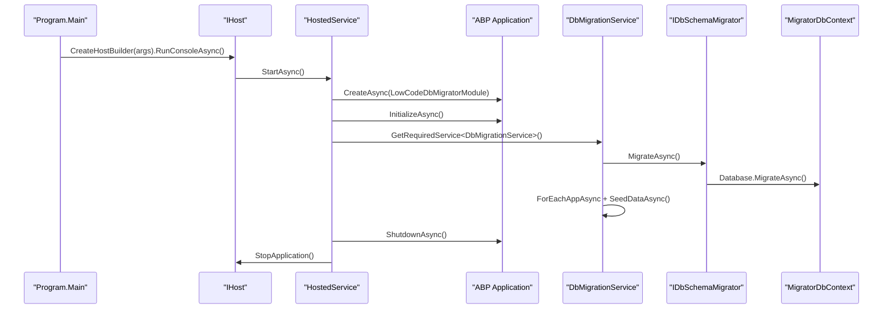
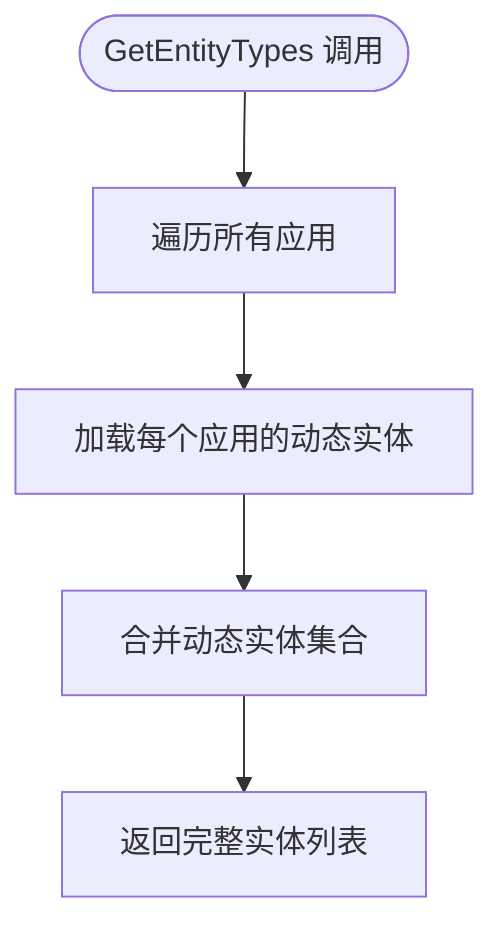
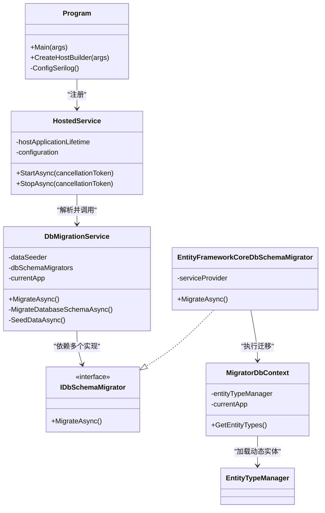

# 数据库迁移工具

<cite>
**本文引用的文件**   
- [Program.cs](file://src/Tools/H.LowCode.DbMigrator/Program.cs)
- [appsettings.json](file://src/Tools/H.LowCode.DbMigrator/appsettings.json)
- [appsettings.serilog.json](file://src/Tools/H.LowCode.DbMigrator/appsettings.serilog.json)
- [LowCodeDbMigratorModule.cs](file://src/Tools/H.LowCode.DbMigrator/LowCodeDbMigratorModule.cs)
- [DbMigrationService.cs](file://src/Tools/H.LowCode.DbMigrator/DbMigrationService.cs)
- [HostedService.cs](file://src/Tools/H.LowCode.DbMigrator/HostedService.cs)
- [IDbSchemaMigrator.cs](file://src/Tools/H.LowCode.DbMigrator/MigrationServices/IDbSchemaMigrator.cs)
- [EntityFrameworkCoreDbSchemaMigrator.cs](file://src/Tools/H.LowCode.DbMigrator/MigrationServices/EntityFrameworkCoreDbSchemaMigrator.cs)
- [MigratorDbContext.cs](file://src/Tools/H.LowCode.DbMigrator/MigrationServices/MigratorDbContext.cs)
- [MigratorDbContextFactory.cs](file://src/Tools/H.LowCode.DbMigrator/MigrationGenerator/MigratorDbContextFactory.cs)
- [20251116160054_Init.cs](file://src/Tools/H.LowCode.DbMigrator/Migrations/20251116160054_Init.cs)
- [20251123125049_Attendance.cs](file://src/Tools/H.LowCode.DbMigrator/Migrations/20251123125049_Attendance.cs)
- [Account Program.cs](file://src/Tools/H.Account.DbMigrator/Program.cs)
- [Account appsettings.json](file://src/Tools/H.Account.DbMigrator/appsettings.json)
- [Account MigratorDbContext.cs](file://src/Tools/H.Account.DbMigrator/MigratorDbContext.cs)
- [Account AccountDbContextFactory.cs](file://src/Tools/H.Account.DbMigrator/AccountDbContextFactory.cs)
- [Workbench Program.cs](file://src/Tools/H.Workbench.DbMigrator/Program.cs)
- [Workbench appsettings.json](file://src/Tools/H.Workbench.DbMigrator/appsettings.json)
- [Workbench WorkbenchDbContextFactory.cs](file://src/Tools/H.Workbench.DbMigrator/WorkbenchDbContextFactory.cs)
- [BackgroundTask Program.cs](file://src/Tools/H.BackgroundTask.DbMigrator/Program.cs)
- [BackgroundTask appsettings.json](file://src/Tools/H.BackgroundTask.DbMigrator/appsettings.json)
</cite>

## 目录
1. [简介](#简介)
2. [项目结构](#项目结构)
3. [核心组件](#核心组件)
4. [架构总览](#架构总览)
5. [详细组件分析](#详细组件分析)
6. [依赖关系分析](#依赖关系分析)
7. [迁移命令与使用示例](#迁移命令与使用示例)
8. [多租户迁移策略](#多租户迁移策略)
9. [性能考虑](#性能考虑)
10. [故障排查指南](#故障排查指南)
11. [结论](#结论)

## 简介
本文件面向 AppLab 的数据库迁移工具链，重点解释各服务的 DbMigrator 控制台程序的架构、启动流程与 EF Core 迁移管理策略。文档以 H.LowCode.DbMigrator 为核心，同时覆盖 H.Account.DbMigrator、H.Workbench.DbMigrator、H.BackgroundTask.DbMigrator 等通用模式。目标是帮助开发者理解：
- 控制台入口如何初始化宿主、配置日志与依赖注入
- DbContextFactory 在运行时与开发时分别承担的职责
- appsettings.json 的配置组织方式
- EF Core 迁移文件的命名、版本控制与回滚机制
- H.LowCode.DbMigrator 的动态迁移生成器、DbMigrationService 与模块注册
- 首次初始化、增量更新、回滚命令
- 多租户环境下的迁移策略与数据隔离方案
- 常见问题的定位与解决方法

## 项目结构
每个业务域服务都对应一个独立的 DbMigrator 控制台项目，典型结构如下：
- Program.cs：控制台入口，负责创建宿主、加载配置、注册日志和服务
- appsettings.json：连接字符串和领域特定配置
- MigrationServices：封装迁移执行逻辑（低代码场景）
- MigrationGenerator：设计时工厂，供 dotnet ef tools 生成迁移脚本
- Migrations：EF Core 迁移文件
- 其他辅助类：如模块注册、服务实现、托管服务等

```mermaid
graph TB
    subgraph "低代码迁移工具"
        LC_Program["Program.cs"]
        LC_Module["LowCodeDbMigratorModule.cs"]
        LC_Hosted["HostedService.cs"]
        LC_Service["DbMigrationService.cs"]
        LC_Schema["EntityFrameworkCoreDbSchemaMigrator.cs"]
        LC_Context["MigratorDbContext.cs"]
        LC_Design["MigratorDbContextFactory.cs"]
        LC_Mig["Migrations/*"]
    end

    subgraph "账户迁移工具"
        AC_Program["Program.cs"]
        AC_Factory["AccountDbContextFactory.cs"]
        AC_Context["MigratorDbContext.cs"]
    end

    subgraph "工作台迁移工具"
        WB_Program["Program.cs"]
        WB_Factory["WorkbenchDbContextFactory.cs"]
    end

    subgraph "后台任务迁移工具"
        BT_Program["Program.cs"]
    end

    LC_Program --> LC_Module
    LC_Program --> LC_Hosted
    LC_Hosted --> LC_Service
    LC_Service --> LC_Schema
    LC_Schema --> LC_Context
    LC_Design --> LC_Context
    LC_Context --> LC_Mig

    AC_Program --> AC_Factory
    AC_Program --> AC_Context
    WB_Program --> WB_Factory
    BT_Program --> BT_Program
```

**图示来源**
- [Program.cs:1-38](file://src/Tools/H.LowCode.DbMigrator/Program.cs#L1-L38)
- [LowCodeDbMigratorModule.cs:1-40](file://src/Tools/H.LowCode.DbMigrator/LowCodeDbMigratorModule.cs#L1-L40)
- [HostedService.cs:1-47](file://src/Tools/H.LowCode.DbMigrator/HostedService.cs#L1-L47)
- [DbMigrationService.cs:1-58](file://src/Tools/H.LowCode.DbMigrator/DbMigrationService.cs#L1-L58)
- [EntityFrameworkCoreDbSchemaMigrator.cs:1-23](file://src/Tools/H.LowCode.DbMigrator/MigrationServices/EntityFrameworkCoreDbSchemaMigrator.cs#L1-L23)
- [MigratorDbContext.cs:1-36](file://src/Tools/H.LowCode.DbMigrator/MigrationServices/MigratorDbContext.cs#L1-L36)
- [MigratorDbContextFactory.cs:1-37](file://src/Tools/H.LowCode.DbMigrator/MigrationGenerator/MigratorDbContextFactory.cs#L1-L37)
- [Account Program.cs:1-59](file://src/Tools/H.Account.DbMigrator/Program.cs#L1-L59)
- [Account AccountDbContextFactory.cs:1-28](file://src/Tools/H.Account.DbMigrator/AccountDbContextFactory.cs#L1-L28)
- [Workbench Program.cs:1-57](file://src/Tools/H.Workbench.DbMigrator/Program.cs#L1-L57)
- [Workbench WorkbenchDbContextFactory.cs:1-28](file://src/Tools/H.Workbench.DbMigrator/WorkbenchDbContextFactory.cs#L1-L28)
- [BackgroundTask Program.cs:1-55](file://src/Tools/H.BackgroundTask.DbMigrator/Program.cs#L1-L55)

**章节来源**
- [Program.cs:1-38](file://src/Tools/H.LowCode.DbMigrator/Program.cs#L1-L38)
- [Account Program.cs:1-59](file://src/Tools/H.Account.DbMigrator/Program.cs#L1-L59)
- [Workbench Program.cs:1-57](file://src/Tools/H.Workbench.DbMigrator/Program.cs#L1-L57)
- [BackgroundTask Program.cs:1-55](file://src/Tools/H.BackgroundTask.DbMigrator/Program.cs#L1-L55)

## 核心组件
- 控制台入口 Program.cs：
  - 低代码迁移工具使用 Host.CreateDefaultBuilder 构建 IHost，并注册 HostedService；通过 Serilog 读取 appsettings.json 与可选的 appsettings.serilog.json。
  - 账户、工作台、后台任务迁移工具采用更简洁的模式：直接创建宿主作用域，解析 DbContext 并调用 Database.MigrateAsync。
- DbContextFactory：
  - 低代码场景的 MigratorDbContextFactory 提供 IDesignTimeDbContextFactory<MigratorDbContext>，用于 dotnet ef 工具生成迁移脚本。
  - 账户和工作台分别提供 AccountDbContextFactory 和 WorkbenchDbContextFactory，指定 MigrationsAssembly 为当前程序集，确保生成的迁移文件位于 DbMigrator 项目。
- 配置 appsettings.json：
  - 统一在 ConnectionStrings 中定义数据库连接串，低代码工具还包含 Meta.appsFilePath 等扩展配置。
- 低代码迁移服务：
  - LowCodeDbMigratorModule 注册 Abp 模块、IDataSeeder、IDbSchemaMigrator、MigrationCurrentApp 以及 MigratorDbContext，并指定 MigrationsAssembly。
  - DbMigrationService 编排数据库架构迁移与应用数据种子。
  - EntityFrameworkCoreDbSchemaMigrator 通过 MigratorDbContext.Database.MigrateAsync 执行迁移。
  - MigratorDbContext 继承 DesignEngineDbContext，动态加载所有应用的实体类型，使迁移能感知低代码模型。

**章节来源**
- [Program.cs:1-38](file://src/Tools/H.LowCode.DbMigrator/Program.cs#L1-L38)
- [appsettings.json:1-8](file://src/Tools/H.LowCode.DbMigrator/appsettings.json#L1-L8)
- [LowCodeDbMigratorModule.cs:1-40](file://src/Tools/H.LowCode.DbMigrator/LowCodeDbMigratorModule.cs#L1-L40)
- [DbMigrationService.cs:1-58](file://src/Tools/H.LowCode.DbMigrator/DbMigrationService.cs#L1-L58)
- [EntityFrameworkCoreDbSchemaMigrator.cs:1-23](file://src/Tools/H.LowCode.DbMigrator/MigrationServices/EntityFrameworkCoreDbSchemaMigrator.cs#L1-L23)
- [MigratorDbContext.cs:1-36](file://src/Tools/H.LowCode.DbMigrator/MigrationServices/MigratorDbContext.cs#L1-L36)
- [MigratorDbContextFactory.cs:1-37](file://src/Tools/H.LowCode.DbMigrator/MigrationGenerator/MigratorDbContextFactory.cs#L1-L37)
- [Account Program.cs:1-59](file://src/Tools/H.Account.DbMigrator/Program.cs#L1-L59)
- [Account AccountDbContextFactory.cs:1-28](file://src/Tools/H.Account.DbMigrator/AccountDbContextFactory.cs#L1-L28)
- [Workbench Program.cs:1-57](file://src/Tools/H.Workbench.DbMigrator/Program.cs#L1-L57)
- [Workbench WorkbenchDbContextFactory.cs:1-28](file://src/Tools/H.Workbench.DbMigrator/WorkbenchDbContextFactory.cs#L1-L28)
- [BackgroundTask Program.cs:1-55](file://src/Tools/H.BackgroundTask.DbMigrator/Program.cs#L1-L55)

## 架构总览
低代码迁移工具的启动流程如下：
- Program.Main 初始化 Serilog，创建宿主并运行控制台应用
- HostedService.StartAsync 创建 ABP 应用实例，替换配置、启用日志和数据迁移环境
- 从服务容器中获取 DbMigrationService 并执行 MigrateAsync
- DbMigrationService 先执行数据库架构迁移，再遍历应用进行数据种子
- 架构迁移由 IDbSchemaMigrator 实现类委托给 EF Core 的 MigratorDbContext.Database.MigrateAsync

**图示来源**
- [Program.cs:1-38](file://src/Tools/H.LowCode.DbMigrator/Program.cs#L1-L38)
- [HostedService.cs:1-47](file://src/Tools/H.LowCode.DbMigrator/HostedService.cs#L1-L47)
- [DbMigrationService.cs:1-58](file://src/Tools/H.LowCode.DbMigrator/DbMigrationService.cs#L1-L58)
- [EntityFrameworkCoreDbSchemaMigrator.cs:1-23](file://src/Tools/H.LowCode.DbMigrator/MigrationServices/EntityFrameworkCoreDbSchemaMigrator.cs#L1-L23)
- [MigratorDbContext.cs:1-36](file://src/Tools/H.LowCode.DbMigrator/MigrationServices/MigratorDbContext.cs#L1-L36)

## 详细组件分析

### Program.cs 入口点（低代码迁移工具）
- 职责：
  - 初始化 Serilog 日志，读取 appsettings.json 与可选的 appsettings.serilog.json
  - 构建默认宿主，清空日志提供者后重新注入 Serilog
  - 注册 HostedService 作为后台托管服务
- 关键点：
  - 不使用 Console.WriteLine 做主要输出，而是通过 Serilog 记录结构化日志
  - RunConsoleAsync 使得应用以控制台形式运行并在完成后退出

**章节来源**
- [Program.cs:1-38](file://src/Tools/H.LowCode.DbMigrator/Program.cs#L1-L38)
- [appsettings.serilog.json:1-41](file://src/Tools/H.LowCode.DbMigrator/appsettings.serilog.json#L1-L41)

### DbContextFactory 的作用
- 低代码场景：
  - MigratorDbContextFactory 实现 IDesignTimeDbContextFactory<MigratorDbContext>，在 dotnet ef 工具中构造 MigratorDbContext
  - 设置连接字符串与 MigrationsAssembly 指向当前程序集，避免把迁移文件生成到主项目
  - 通过 ServiceCollection 注册 LowCodeDbMigratorModule 与 DesignEngineJsonFileRepositoryModule，以加载 EntityTypeManager 与 MigrationCurrentApp
- 账户与工作台的工厂：
  - AccountDbContextFactory 与 WorkbenchDbContextFactory 同样指定 MigrationsAssembly 为各自程序集，保证迁移文件与迁移工具项目绑定

**章节来源**
- [MigratorDbContextFactory.cs:1-37](file://src/Tools/H.LowCode.DbMigrator/MigrationGenerator/MigratorDbContextFactory.cs#L1-L37)
- [Account AccountDbContextFactory.cs:1-28](file://src/Tools/H.Account.DbMigrator/AccountDbContextFactory.cs#L1-L28)
- [Workbench WorkbenchDbContextFactory.cs:1-28](file://src/Tools/H.Workbench.DbMigrator/WorkbenchDbContextFactory.cs#L1-L28)

### appsettings.json 配置文件组织
- ConnectionStrings：
  - 低代码工具使用 LowCodeDb
  - 账户工具使用 AccountDb
  - 工作台工具使用 WorkbenchDb
  - 后台任务工具使用 BackgroundTaskDb
- 低代码工具额外配置：
  - Meta.appsFilePath 指向低代码元数据目录，供动态实体发现使用

**章节来源**
- [appsettings.json:1-8](file://src/Tools/H.LowCode.DbMigrator/appsettings.json#L1-L8)
- [Account appsettings.json:1-5](file://src/Tools/H.Account.DbMigrator/appsettings.json#L1-L5)
- [Workbench appsettings.json:1-5](file://src/Tools/H.Workbench.DbMigrator/appsettings.json#L1-L5)
- [BackgroundTask appsettings.json:1-5](file://src/Tools/H.BackgroundTask.DbMigrator/appsettings.json#L1-L5)

### EF Core 迁移的管理与维护策略
- 迁移文件位置：
  - 低代码工具迁移文件位于 src/Tools/H.LowCode.DbMigrator/Migrations
  - 账户与工作台的迁移文件分别位于各自程序集名称对应的 Migrations 目录
- 命名规范：
  - 时间戳前缀 + 描述性名称，例如 20251116160054_Init、20251123125049_Attendance
- 版本控制：
  - 每次模型变更后，通过 dotnet ef migrations add 生成新迁移
  - 通过 git 提交迁移文件，形成可追踪的版本历史
- 回滚机制：
  - 迁移文件通常包含 Up 与 Down 方法，Down 用于撤销变更
  - 生产环境谨慎使用回滚，优先通过正向迁移修复问题

**章节来源**
- [20251116160054_Init.cs:1-116](file://src/Tools/H.LowCode.DbMigrator/Migrations/20251116160054_Init.cs#L1-L116)
- [20251123125049_Attendance.cs:1-81](file://src/Tools/H.LowCode.DbMigrator/Migrations/20251123125049_Attendance.cs#L1-L81)

### H.LowCode.DbMigrator 的特殊性

#### 动态迁移生成器（MigrationGenerator）
- 通过 MigratorDbContextFactory 提供设计时上下文，dotnet ef 工具能够基于当前已加载的低代码实体生成迁移脚本
- 关键要点：
  - 必须显式指定 --context MigratorDbContext
  - 需要正确配置连接字符串与 MigrationsAssembly

**章节来源**
- [MigratorDbContextFactory.cs:1-37](file://src/Tools/H.LowCode.DbMigrator/MigrationGenerator/MigratorDbContextFactory.cs#L1-L37)

#### DbMigrationService 服务实现
- 职责：
  - 执行数据库架构迁移
  - 遍历所有应用并执行数据种子
- 行为特征：
  - 使用 ILogger 记录开始、结束与每个应用的数据种子过程
  - 依赖 IDataSeeder 与 IDbSchemaMigrator 接口，解耦具体实现

**章节来源**
- [DbMigrationService.cs:1-58](file://src/Tools/H.LowCode.DbMigrator/DbMigrationService.cs#L1-L58)

#### LowCodeDbMigratorModule 模块注册
- 注册内容：
  - IDataSeeder 的具体实现
  - IDbSchemaMigrator 的 EF Core 实现
  - MigrationCurrentApp，用于按应用维度操作
  - MigratorDbContext，指定 UseSqlServer 与 MigrationsAssembly
  - 忽略 PendingModelChangesWarning，避免在迁移阶段因模型差异产生警告
- 依赖模块：
  - DesignEngineJsonFileRepositoryModule
  - DesignEngineEntityFrameworkCoreModule
  - DesignEngineApplicationModule

**章节来源**
- [LowCodeDbMigratorModule.cs:1-40](file://src/Tools/H.LowCode.DbMigrator/LowCodeDbMigratorModule.cs#L1-L40)

#### MigratorDbContext 动态实体加载
- 继承自 DesignEngineDbContext
- 重写 GetEntityTypes，聚合所有应用的 DynamicEntityInfo，使 EF Core 能感知低代码模型
- 通过 MigrationCurrentApp 枚举应用，EntityTypeManager.LoadDynamicEntities 加载实体

**图示来源**
- [MigratorDbContext.cs:1-36](file://src/Tools/H.LowCode.DbMigrator/MigrationServices/MigratorDbContext.cs#L1-L36)

**章节来源**
- [MigratorDbContext.cs:1-36](file://src/Tools/H.LowCode.DbMigrator/MigrationServices/MigratorDbContext.cs#L1-L36)

### 其他 DbMigrator 控制台程序
- 账户迁移工具：
  - Program 直接解析 AccountDbContext 或 MigratorDbContext，调用 Database.MigrateAsync
  - 使用 AccountDbContextFactory 设计时工厂生成迁移文件
- 工作台迁移工具：
  - Program 解析 WorkbenchDbContext，执行迁移
  - 使用 WorkbenchDbContextFactory 设计时工厂生成迁移文件
- 后台任务迁移工具：
  - Program 解析 BackgroundTaskDbContext，执行迁移

**章节来源**
- [Account Program.cs:1-59](file://src/Tools/H.Account.DbMigrator/Program.cs#L1-L59)
- [Account MigratorDbContext.cs:1-22](file://src/Tools/H.Account.DbMigrator/MigratorDbContext.cs#L1-L22)
- [Workbench Program.cs:1-57](file://src/Tools/H.Workbench.DbMigrator/Program.cs#L1-L57)
- [BackgroundTask Program.cs:1-55](file://src/Tools/H.BackgroundTask.DbMigrator/Program.cs#L1-L55)

## 依赖关系分析
低代码迁移工具内部依赖关系如下：
- Program 依赖 HostedService
- HostedService 依赖 ABP ApplicationFactory、Configuration、Serilog
- HostedService 通过服务容器获取 DbMigrationService
- DbMigrationService 依赖 IDataSeeder、IEnumerable<IDbSchemaMigrator>、MigrationCurrentApp
- EntityFrameworkCoreDbSchemaMigrator 依赖 IServiceProvider，进而解析 MigratorDbContext
- MigratorDbContext 依赖 EntityTypeManager、MigrationCurrentApp

**图示来源**
- [Program.cs:1-38](file://src/Tools/H.LowCode.DbMigrator/Program.cs#L1-L38)
- [HostedService.cs:1-47](file://src/Tools/H.LowCode.DbMigrator/HostedService.cs#L1-L47)
- [DbMigrationService.cs:1-58](file://src/Tools/H.LowCode.DbMigrator/DbMigrationService.cs#L1-L58)
- [IDbSchemaMigrator.cs:1-6](file://src/Tools/H.LowCode.DbMigrator/MigrationServices/IDbSchemaMigrator.cs#L1-L6)
- [EntityFrameworkCoreDbSchemaMigrator.cs:1-23](file://src/Tools/H.LowCode.DbMigrator/MigrationServices/EntityFrameworkCoreDbSchemaMigrator.cs#L1-L23)
- [MigratorDbContext.cs:1-36](file://src/Tools/H.LowCode.DbMigrator/MigrationServices/MigratorDbContext.cs#L1-L36)

## 迁移命令与使用示例
以下为常用命令示例，请根据实际项目路径与数据库连接调整：

- 首次初始化
  - 低代码工具：
    - 确保 appsettings.json 中的 LowCodeDb 连接串正确
    - 运行：`dotnet run --project src/Tools/H.LowCode.DbMigrator`
  - 账户工具：
    - 确保 appsettings.json 中的 AccountDb 连接串正确
    - 运行：`dotnet run --project src/Tools/H.Account.DbMigrator`
  - 工作台工具：
    - 确保 appsettings.json 中的 WorkbenchDb 连接串正确
    - 运行：`dotnet run --project src/Tools/H.Workbench.DbMigrator`
  - 后台任务工具：
    - 确保 appsettings.json 中的 BackgroundTaskDb 连接串正确
    - 运行：`dotnet run --project src/Tools/H.BackgroundTask.DbMigrator`

- 增量更新（生成迁移文件）
  - 低代码工具：
    - `dotnet ef migrations add <MigrationName> --context MigratorDbContext --project src/Tools/H.LowCode.DbMigrator`
  - 账户工具：
    - `dotnet ef migrations add <MigrationName> --project src/Tools/H.Account.DbMigrator`
  - 工作台工具：
    - `dotnet ef migrations add <MigrationName> --project src/Tools/H.Workbench.DbMigrator`

- 查看待应用迁移
  - `dotnet ef migrations list --project src/Tools/H.<Domain>.DbMigrator`

- 应用迁移
  - 低代码工具：
    - `dotnet run --project src/Tools/H.LowCode.DbMigrator`
  - 其他工具：
    - `dotnet run --project src/Tools/H.<Domain>.DbMigrator`

- 回滚迁移（谨慎使用）
  - 回滚到上一个迁移：
    - `dotnet ef migrations remove --project src/Tools/H.<Domain>.DbMigrator`
  - 回滚到指定迁移：
    - `dotnet ef database update <MigrationName> --project src/Tools/H.<Domain>.DbMigrator`

说明：
- 低代码工具的设计时工厂要求显式指定 --context MigratorDbContext，因为 MigratorDbContext 是迁移专用的上下文
- 所有工具的 MigrationsAssembly 均指向各自程序集，因此迁移文件会生成在对应 DbMigrator 项目中

**章节来源**
- [MigratorDbContextFactory.cs:1-37](file://src/Tools/H.LowCode.DbMigrator/MigrationGenerator/MigratorDbContextFactory.cs#L1-L37)
- [Account AccountDbContextFactory.cs:1-28](file://src/Tools/H.Account.DbMigrator/AccountDbContextFactory.cs#L1-L28)
- [Workbench WorkbenchDbContextFactory.cs:1-28](file://src/Tools/H.Workbench.DbMigrator/WorkbenchDbContextFactory.cs#L1-L28)

## 多租户迁移策略
- 低代码工具的动态实体机制：
  - MigratorDbContext 通过 MigrationCurrentApp.ForEachAppAsync 遍历所有应用，并调用 EntityTypeManager.LoadDynamicEntities 加载每个应用的动态实体
  - 这使得迁移可以感知不同应用的实体结构变化，从而生成正确的数据库架构
- 数据种子：
  - DbMigrationService 在架构迁移完成后，对每个应用执行数据种子
  - 通过 IDataSeeder.SeedAsync 注入领域数据，确保每个应用具备基础数据
- 数据隔离建议：
  - 若多租户共享单库，可在实体层面增加租户标识字段（如 tenant_id），并通过查询过滤实现行级隔离
  - 若多租户使用独立数据库，则每个租户数据库单独执行对应 DbMigrator 程序，确保迁移与数据种子在租户数据库上生效

**章节来源**
- [MigratorDbContext.cs:1-36](file://src/Tools/H.LowCode.DbMigrator/MigrationServices/MigratorDbContext.cs#L1-L36)
- [DbMigrationService.cs:1-58](file://src/Tools/H.LowCode.DbMigrator/DbMigrationService.cs#L1-L58)

## 性能考虑
- 日志开销：
  - 低代码工具使用 Serilog，支持异步文件写入与滚动策略，避免阻塞主流程
- 迁移批处理：
  - EF Core 的 Database.MigrateAsync 会在单个事务内应用未应用的迁移，尽量减少多次往返数据库
- 动态实体加载：
  - 在迁移阶段，动态实体加载可能涉及多个应用的扫描，建议在迁移前确保应用元数据目录可用且配置正确

[本节为一般性指导，不直接分析具体文件]

## 故障排查指南
- 连接字符串错误：
  - 检查 appsettings.json 中 ConnectionStrings 的名称是否与程序读取的一致
  - 低代码工具读取 LowCodeDb，账户工具读取 AccountDb，工作台工具读取 WorkbenchDb，后台任务工具读取 BackgroundTaskDb
- 迁移程序集配置错误：
  - 确认 IDesignTimeDbContextFactory 与 Program 中的 MigrationsAssembly 指向 DbMigrator 程序集
  - 低代码工具需确保 --context MigratorDbContext
- 动态实体未加载：
  - 检查 Meta.appsFilePath 是否正确指向低代码元数据目录
  - 确认 EntityTypeManager 与 MigrationCurrentApp 在服务容器中可用
- 日志无输出或输出不全：
  - 检查 appsettings.serilog.json 是否存在且路径有效
  - 确认 Serilog 的 WriteTo.File 路径权限与滚动策略
- 迁移失败：
  - 查看控制台输出或日志文件，定位异常信息
  - 必要时先执行 dotnet ef migrations list 查看待应用迁移
  - 对于破坏性变更，优先考虑新增正向迁移而非回滚

**章节来源**
- [appsettings.json:1-8](file://src/Tools/H.LowCode.DbMigrator/appsettings.json#L1-L8)
- [appsettings.serilog.json:1-41](file://src/Tools/H.LowCode.DbMigrator/appsettings.serilog.json#L1-L41)
- [MigratorDbContextFactory.cs:1-37](file://src/Tools/H.LowCode.DbMigrator/MigrationGenerator/MigratorDbContextFactory.cs#L1-L37)

## 结论
AppLab 的数据库迁移工具链采用“每域一迁移工具”的清晰架构：
- 控制台入口负责宿主与日志初始化
- DbContextFactory 区分运行时与开发时职责
- appsettings.json 集中管理连接串与领域配置
- EF Core 迁移通过时间戳命名与版本化控制，配合 Up/Down 实现可回滚的变更
- H.LowCode.DbMigrator 通过动态实体加载与多应用数据种子，满足低代码平台的复杂需求
- 多租户场景可通过行级隔离或多库策略实现数据隔离

遵循本文的命令与最佳实践，可以有效降低迁移风险，提升发布稳定性。