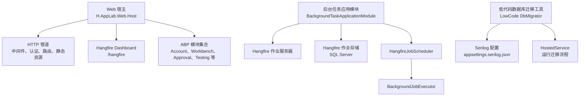
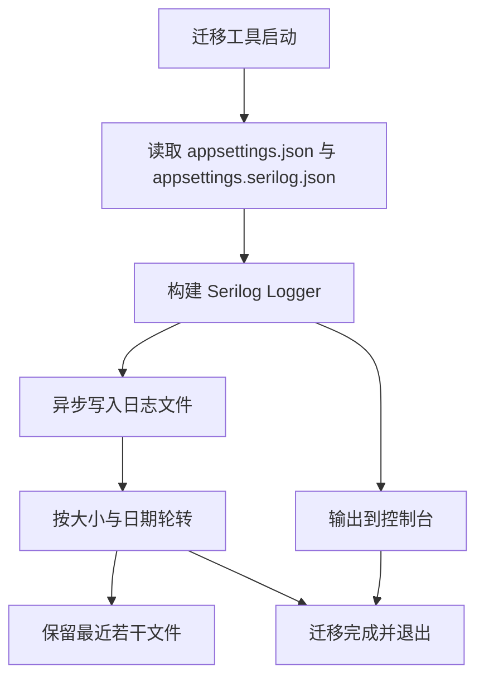
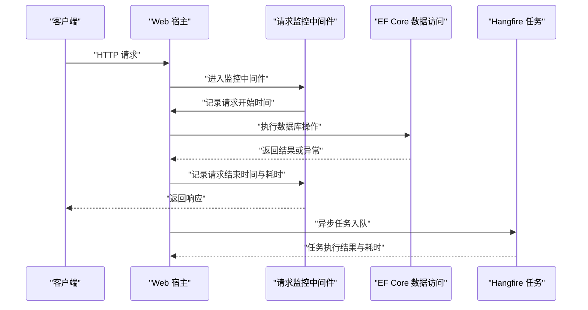
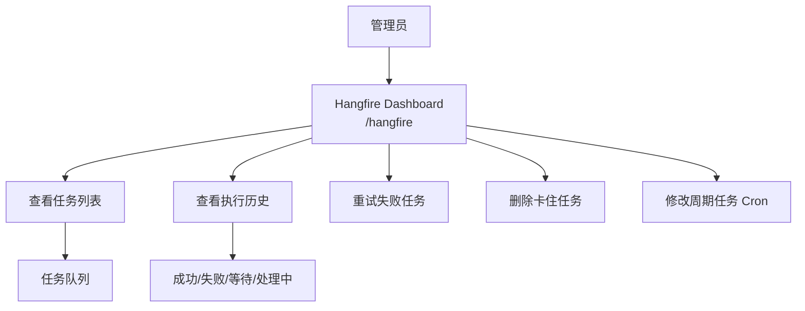
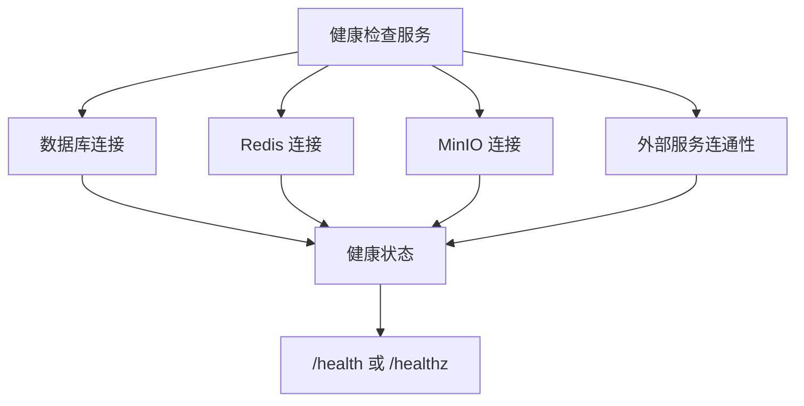
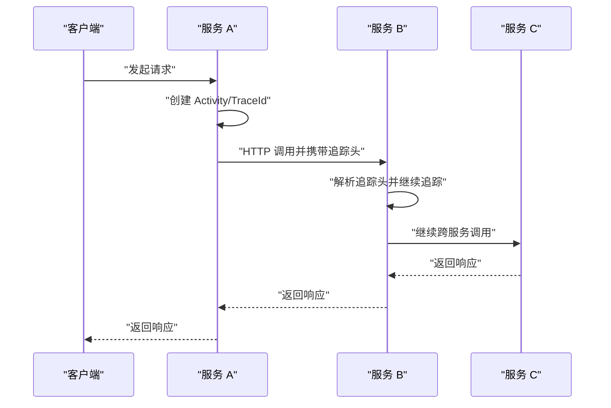
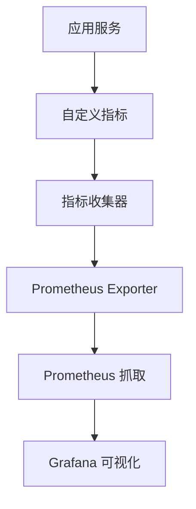
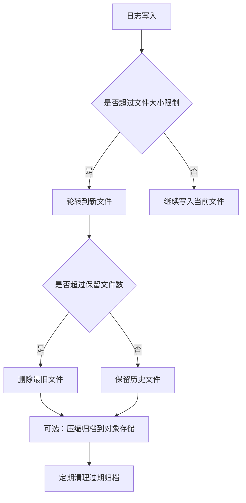
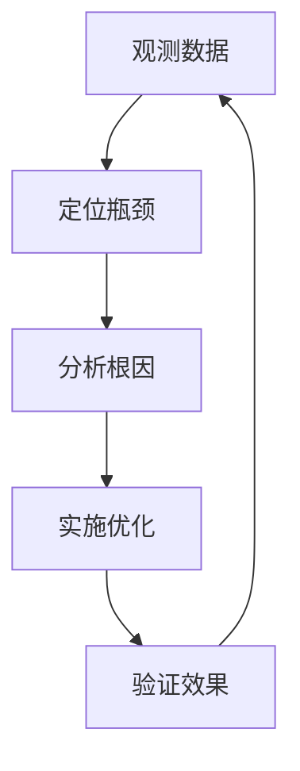
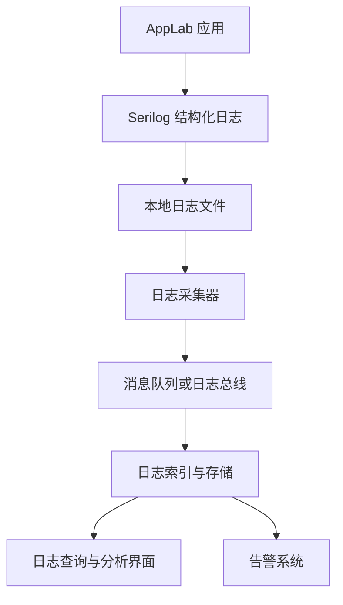

# 监控与日志

<cite>
**本文引用的文件**
- [Program.cs](file://src/Host/H.AppLab.Web.Host/H.AppLab.Web.Host/Program.cs)
- [HostAllModule.cs](file://src/Host/H.AppLab.Web.Host/H.AppLab.Web.Host/HostAllModule.cs)
- [BackgroundTaskApplicationModule.cs](file://src/Services/BackgroundTask/H.BackgroundTask.Application/BackgroundTaskApplicationModule.cs)
- [HangfireJobScheduler.cs](file://src/Services/BackgroundTask/H.BackgroundTask.Application/Services/HangfireJobScheduler.cs)
- [appsettings.serilog.json](file://src/Tools/H.LowCode.DbMigrator/appsettings.serilog.json)
- [Program.cs](file://src/Tools/H.LowCode.DbMigrator/Program.cs)
- [HostedService.cs](file://src/Tools/H.LowCode.DbMigrator/HostedService.cs)
</cite>

## 目录
1. [简介](#简介)
2. [项目结构中的监控与日志位置](#项目结构中的监控与日志位置)
3. [Serilog 日志框架配置](#serilog-日志框架配置)
4. [性能监控现状与扩展建议](#性能监控现状与扩展建议)
5. [Hangfire Dashboard 监控功能](#hangfire-dashboard-监控功能)
6. [应用健康检查端点现状与扩展建议](#应用健康检查端点现状与扩展建议)
7. [分布式追踪现状与扩展建议](#分布式追踪现状与扩展建议)
8. [自定义指标与 Prometheus 集成方案](#自定义指标与-prometheus-集成方案)
9. [日志轮转、归档策略与磁盘空间管理](#日志轮转归档策略与磁盘空间管理)
10. [常见性能瓶颈识别与优化建议](#常见性能瓶颈识别与优化建议)
11. [生产环境日志收集与分析平台集成方案](#生产环境日志收集与分析平台集成方案)
12. [结论](#结论)

## 简介
本文面向 AppLab 的监控与日志体系，重点说明仓库中已实现的 Hangfire 后台任务监控、Serilog 在迁移工具中的日志配置，以及当前 Web 宿主中尚未显式配置的监控能力。文档同时给出可落地的扩展方案，包括请求跟踪、慢查询检测、内存使用监控、健康检查、分布式追踪、Prometheus 指标采集、日志轮转与归档策略、磁盘空间管理、常见性能瓶颈排查方法，以及生产环境日志平台集成思路。

## 项目结构中的监控与日志位置
AppLab 是一个多模块 .NET 应用，监控相关代码主要分布在以下位置：

- Web 宿主入口：负责 HTTP 管道、SignalR、Blazor、Hangfire Dashboard 挂载等。
- 后台任务应用模块：注册 Hangfire 作业存储、作业服务器和调度器。
- Hangfire 任务调度实现：封装一次性任务、定时任务和手动触发逻辑。
- 低代码数据库迁移工具：独立进程，使用 Serilog 输出结构化日志到文件和控制台。

**图示来源**
- [Program.cs:1-113](file://src/Host/H.AppLab.Web.Host/H.AppLab.Web.Host/Program.cs#L1-L113)
- [BackgroundTaskApplicationModule.cs:1-55](file://src/Services/BackgroundTask/H.BackgroundTask.Application/BackgroundTaskApplicationModule.cs#L1-L55)
- [HangfireJobScheduler.cs:1-89](file://src/Services/BackgroundTask/H.BackgroundTask.Application/Services/HangfireJobScheduler.cs#L1-L89)
- [Program.cs:1-38](file://src/Tools/H.LowCode.DbMigrator/Program.cs#L1-L38)
- [HostedService.cs:1-47](file://src/Tools/H.LowCode.DbMigrator/HostedService.cs#L1-L47)

**章节来源**
- [Program.cs:1-113](file://src/Host/H.AppLab.Web.Host/H.AppLab.Web.Host/Program.cs#L1-L113)
- [BackgroundTaskApplicationModule.cs:1-55](file://src/Services/BackgroundTask/H.BackgroundTask.Application/BackgroundTaskApplicationModule.cs#L1-L55)
- [HangfireJobScheduler.cs:1-89](file://src/Services/BackgroundTask/H.BackgroundTask.Application/Services/HangfireJobScheduler.cs#L1-L89)
- [Program.cs:1-38](file://src/Tools/H.LowCode.DbMigrator/Program.cs#L1-L38)
- [HostedService.cs:1-47](file://src/Tools/H.LowCode.DbMigrator/HostedService.cs#L1-L47)

## Serilog 日志框架配置
仓库中 Serilog 的配置明确出现在低代码数据库迁移工具中，用于结构化日志输出、日志级别控制、文件轮转和控制台输出。该模式可作为其他宿主或工具的参考。

### 关键配置要点
- **程序集依赖**：启用 `Serilog.Sinks.File`、`Serilog.Sinks.Async`、`Serilog.Sinks.Console`。
- **最小日志级别**：默认 `Information`；对 `System`、`Microsoft`、`Microsoft.EntityFrameworkCore` 进行覆盖。
- **异步文件输出**：通过 `Async` 包装 `File` sink，避免同步写入阻塞。
- **文件路径模板**：`../Logs/log_.txt`，便于按时间滚动生成文件。
- **输出模板**：包含时间戳、级别、来源上下文、事件 ID、消息和异常信息。
- **轮转策略**：按文件大小限制、保留文件数量、按天滚动。
- **控制台输出**：过滤最低级别，使用灰度主题。

**图示来源**
- [appsettings.serilog.json:1-41](file://src/Tools/H.LowCode.DbMigrator/appsettings.serilog.json#L1-L41)
- [Program.cs:1-38](file://src/Tools/H.LowCode.DbMigrator/Program.cs#L1-L38)
- [HostedService.cs:1-47](file://src/Tools/H.LowCode.DbMigrator/HostedService.cs#L1-L47)

**章节来源**
- [appsettings.serilog.json:1-41](file://src/Tools/H.LowCode.DbMigrator/appsettings.serilog.json#L1-L41)
- [Program.cs:1-38](file://src/Tools/H.LowCode.DbMigrator/Program.cs#L1-L38)
- [HostedService.cs:1-47](file://src/Tools/H.LowCode.DbMigrator/HostedService.cs#L1-L47)

## 性能监控现状与扩展建议
### 现状
- Web 宿主 `Program.cs` 中未显式启用 ASP.NET Core 内置的性能诊断中间件（如响应时间、请求计数、慢请求）。
- 未看到针对 EF Core 慢查询拦截器的集中配置。
- 未看到托管内存、GC 统计、线程池等运行时指标的主动采集。
- Hangfire Dashboard 提供了后台任务的执行状态、重试、失败历史等运维能力。

### 建议的扩展方向
- **请求跟踪**：在 Web 管道中添加请求计时中间件，记录每个请求的开始时间、结束时间、耗时、HTTP 方法、URL、用户标识、租户标识、响应码、异常。
- **慢查询检测**：为 EF Core 配置慢查询阈值，当查询超过阈值时输出警告日志，附带 SQL、参数摘要、耗时、调用栈。
- **内存使用监控**：采集托管堆大小、GC 次数、对象分配速率、线程池工作队列长度，结合业务场景设置告警阈值。
- **Hangfire 任务性能**：在 `BackgroundJobExecutor` 中记录任务开始、结束、耗时、输入参数摘要、异常堆栈。

**图示来源**
- [Program.cs:1-113](file://src/Host/H.AppLab.Web.Host/H.AppLab.Web.Host/Program.cs#L1-L113)
- [BackgroundTaskApplicationModule.cs:1-55](file://src/Services/BackgroundTask/H.BackgroundTask.Application/BackgroundTaskApplicationModule.cs#L1-L55)
- [HangfireJobScheduler.cs:1-89](file://src/Services/BackgroundTask/H.BackgroundTask.Application/Services/HangfireJobScheduler.cs#L1-L89)

**章节来源**
- [Program.cs:1-113](file://src/Host/H.AppLab.Web.Host/H.AppLab.Web.Host/Program.cs#L1-L113)
- [BackgroundTaskApplicationModule.cs:1-55](file://src/Services/BackgroundTask/H.BackgroundTask.Application/BackgroundTaskApplicationModule.cs#L1-L55)
- [HangfireJobScheduler.cs:1-89](file://src/Services/BackgroundTask/H.BackgroundTask.Application/Services/HangfireJobScheduler.cs#L1-L89)

## Hangfire Dashboard 监控功能
### 已实现能力
- **Dashboard 路由**：在 Web 宿主中启用 `/hangfire`。
- **作业存储**：使用 SQL Server 作为 Hangfire 作业存储。
- **作业服务器**：随宿主启动 Hangfire 作业服务器。
- **任务调度**：支持一次性任务、周期任务、立即入队、手动触发。

### 运维价值
- **任务执行历史**：查看任务排队、执行、成功、失败状态。
- **失败重试**：Hangfire 自带重试机制，可通过 Dashboard 重试失败任务。
- **手动干预**：管理员可在 Dashboard 上重新执行失败任务、删除卡住任务、调整 Cron 表达式。

**图示来源**
- [Program.cs:1-113](file://src/Host/H.AppLab.Web.Host/H.AppLab.Web.Host/Program.cs#L1-L113)
- [BackgroundTaskApplicationModule.cs:1-55](file://src/Services/BackgroundTask/H.BackgroundTask.Application/BackgroundTaskApplicationModule.cs#L1-L55)
- [HangfireJobScheduler.cs:1-89](file://src/Services/BackgroundTask/H.BackgroundTask.Application/Services/HangfireJobScheduler.cs#L1-L89)

**章节来源**
- [Program.cs:1-113](file://src/Host/H.AppLab.Web.Host/H.AppLab.Web.Host/Program.cs#L1-L113)
- [BackgroundTaskApplicationModule.cs:1-55](file://src/Services/BackgroundTask/H.BackgroundTask.Application/BackgroundTaskApplicationModule.cs#L1-L55)
- [HangfireJobScheduler.cs:1-89](file://src/Services/BackgroundTask/H.BackgroundTask.Application/Services/HangfireJobScheduler.cs#L1-L89)

## 应用健康检查端点现状与扩展建议
### 现状
- 仓库中未找到显式的健康检查服务注册或 `/health`、`/healthz` 等端点映射。
- Web 宿主使用了 ABP 多租户、认证、授权、异常处理等中间件，但没有直接暴露健康检查接口。

### 建议的健康检查项
- **数据库连接**：尝试连接主库，验证连接字符串、权限、表结构可用性。
- **Redis 连接**：若使用 Redis 做缓存或分布式锁，应测试连接与基本读写。
- **MinIO 连接**：若使用 MinIO 做对象存储，应测试连接与桶存在性。
- **外部服务**：根据业务需要增加第三方 API、消息队列、认证服务的连通性检查。
- **组合健康检查**：将多个依赖检查结果聚合，区分“就绪”和“存活”。

**图示来源**
- [Program.cs:1-113](file://src/Host/H.AppLab.Web.Host/H.AppLab.Web.Host/Program.cs#L1-L113)
- [HostAllModule.cs:1-200](file://src/Host/H.AppLab.Web.Host/H.AppLab.Web.Host/HostAllModule.cs#L1-L200)

**章节来源**
- [Program.cs:1-113](file://src/Host/H.AppLab.Web.Host/H.AppLab.Web.Host/Program.cs#L1-L113)
- [HostAllModule.cs:1-200](file://src/Host/H.AppLab.Web.Host/H.AppLab.Web.Host/HostAllModule.cs#L1-L200)

## 分布式追踪现状与扩展建议
### 现状
- 未在仓库中看到显式的 `ActivitySource`、`DiagnosticSource`、OpenTelemetry 或 Jaeger/Zipkin 集成。
- 这表示当前没有跨服务调用的分布式链路追踪能力。

### 建议的分布式追踪方案
- **统一 TraceId**：为每个 HTTP 请求生成 `TraceId`，并在日志中输出。
- **活动传播**：使用 `ActivitySource` 或 OpenTelemetry 自动传播 `CorrelationId`、`TraceId`、`SpanId`。
- **跨服务调用**：在 HttpClient 代理中注入追踪头，下游服务解析并继续追踪。
- **可视化链路**：接入 Jaeger、Zipkin 或云厂商 APM 平台，展示请求链路、依赖关系、耗时分布。
- **业务埋点**：在关键业务流程（审批、测试执行、渲染、设计）添加 Span，标注业务语义。

**图示来源**
- [Program.cs:1-113](file://src/Host/H.AppLab.Web.Host/H.AppLab.Web.Host/Program.cs#L1-L113)
- [HostAllModule.cs:1-200](file://src/Host/H.AppLab.Web.Host/H.AppLab.Web.Host/HostAllModule.cs#L1-L200)

**章节来源**
- [Program.cs:1-113](file://src/Host/H.AppLab.Web.Host/H.AppLab.Web.Host/Program.cs#L1-L113)
- [HostAllModule.cs:1-200](file://src/Host/H.AppLab.Web.Host/H.AppLab.Web.Host/HostAllModule.cs#L1-L200)

## 自定义指标与 Prometheus 集成方案
### 建议采集的指标
- **HTTP 指标**：请求总数、成功率、延迟百分位、错误率、并发数。
- **Hangfire 指标**：排队任务数、正在执行任务数、失败任务数、平均执行时长。
- **数据库指标**：连接数、慢查询数、事务数、锁等待。
- **运行时指标**：CPU、内存、GC 次数、线程池大小、异常数。
- **业务指标**：任务执行成功率、审批通过率、渲染成功率、文件上传成功率。

### 集成步骤
1. 引入 Prometheus .NET 客户端。
2. 在 Web 管道中添加 `/metrics` 端点。
3. 注册自定义计数器、直方图、仪表盘指标。
4. 在请求中间件、Hangfire 任务、数据库访问层埋点。
5. 由 Prometheus 抓取指标，Grafana 展示图表与告警。

**图示来源**
- [Program.cs:1-113](file://src/Host/H.AppLab.Web.Host/H.AppLab.Web.Host/Program.cs#L1-L113)
- [BackgroundTaskApplicationModule.cs:1-55](file://src/Services/BackgroundTask/H.BackgroundTask.Application/BackgroundTaskApplicationModule.cs#L1-L55)

**章节来源**
- [Program.cs:1-113](file://src/Host/H.AppLab.Web.Host/H.AppLab.Web.Host/Program.cs#L1-L113)
- [BackgroundTaskApplicationModule.cs:1-55](file://src/Services/BackgroundTask/H.BackgroundTask.Application/BackgroundTaskApplicationModule.cs#L1-L55)

## 日志轮转、归档策略与磁盘空间管理
### 当前轮转策略
- **按文件大小限制**：单个日志文件达到上限后轮转。
- **保留文件数量**：最多保留指定数量的历史文件。
- **按天滚动**：每天生成新文件，便于按时间归档。
- **异步写入**：减少 I/O 对业务线程的干扰。

### 磁盘空间管理建议
- **总大小限制**：在容器或操作系统层面限制日志目录最大占用空间。
- **清理策略**：定期删除超过保留期的日志，或压缩归档到对象存储。
- **告警机制**：当磁盘使用率达到阈值时发出告警。
- **分离日志与数据**：确保日志盘与数据库盘分开，避免互相影响。

**图示来源**
- [appsettings.serilog.json:1-41](file://src/Tools/H.LowCode.DbMigrator/appsettings.serilog.json#L1-L41)

**章节来源**
- [appsettings.serilog.json:1-41](file://src/Tools/H.LowCode.DbMigrator/appsettings.serilog.json#L1-L41)

## 常见性能瓶颈识别与优化建议
### 识别方法
- **请求耗时分布**：观察 P50、P90、P99 延迟，定位慢接口。
- **数据库慢查询**：分析执行计划、索引缺失、全表扫描。
- **Hangfire 任务堆积**：观察排队任务增长、执行失败率、单任务耗时。
- **内存泄漏**：观察托管堆持续增长、GC 频率升高。
- **线程阻塞**：观察线程池工作队列、等待锁、I/O 阻塞。

### 优化建议
- **接口层**：增加缓存、分页、批量操作、超时控制。
- **数据层**：添加合适索引、拆分复杂查询、使用异步 IO。
- **任务层**：调整 Hangfire 并发度、拆分大任务、增加重试退避。
- **资源层**：扩容 CPU/内存、优化 GC 参数、调整连接池大小。
- **可观测性**：补充指标、日志、追踪，形成闭环监控。

**图示来源**
- [Program.cs:1-113](file://src/Host/H.AppLab.Web.Host/H.AppLab.Web.Host/Program.cs#L1-L113)
- [BackgroundTaskApplicationModule.cs:1-55](file://src/Services/BackgroundTask/H.BackgroundTask.Application/BackgroundTaskApplicationModule.cs#L1-L55)
- [HangfireJobScheduler.cs:1-89](file://src/Services/BackgroundTask/H.BackgroundTask.Application/Services/HangfireJobScheduler.cs#L1-L89)

**章节来源**
- [Program.cs:1-113](file://src/Host/H.AppLab.Web.Host/H.AppLab.Web.Host/Program.cs#L1-L113)
- [BackgroundTaskApplicationModule.cs:1-55](file://src/Services/BackgroundTask/H.BackgroundTask.Application/BackgroundTaskApplicationModule.cs#L1-L55)
- [HangfireJobScheduler.cs:1-89](file://src/Services/BackgroundTask/H.BackgroundTask.Application/Services/HangfireJobScheduler.cs#L1-L89)

## 生产环境日志收集与分析平台集成方案
### 推荐架构
- **应用侧**：使用 Serilog 输出结构化 JSON 日志。
- **采集侧**：使用 Fluent Bit、Filebeat 或 Vector 采集本地日志文件。
- **传输侧**：将日志发送到 Kafka、ES、OpenSearch 或云日志服务。
- **分析侧**：使用 Elasticsearch/Kibana、OpenSearch/Dashboards、Splunk、ELK Stack。
- **告警侧**：基于日志规则或指标阈值触发告警，通知到企业微信、钉钉、邮件。

**图示来源**
- [appsettings.serilog.json:1-41](file://src/Tools/H.LowCode.DbMigrator/appsettings.serilog.json#L1-L41)
- [Program.cs:1-38](file://src/Tools/H.LowCode.DbMigrator/Program.cs#L1-L38)

**章节来源**
- [appsettings.serilog.json:1-41](file://src/Tools/H.LowCode.DbMigrator/appsettings.serilog.json#L1-L41)
- [Program.cs:1-38](file://src/Tools/H.LowCode.DbMigrator/Program.cs#L1-L38)

## 结论
AppLab 当前已在 Web 宿主中启用 Hangfire Dashboard，并在低代码数据库迁移工具中使用 Serilog 输出结构化日志。对于更完整的监控体系，建议在 Web 宿主中补充请求跟踪、慢查询检测、内存监控、健康检查、分布式追踪与 Prometheus 指标采集，并结合生产环境的日志采集与分析平台，形成可观测性闭环。Hangfire Dashboard 可作为后台任务运维的核心入口，配合日志、指标与追踪，帮助快速定位问题并提升系统稳定性。