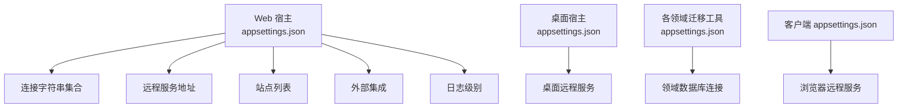
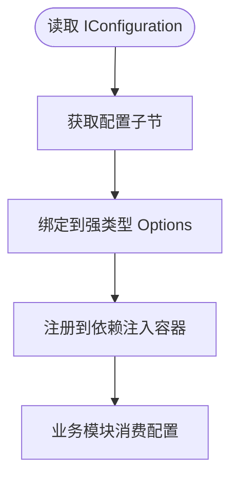
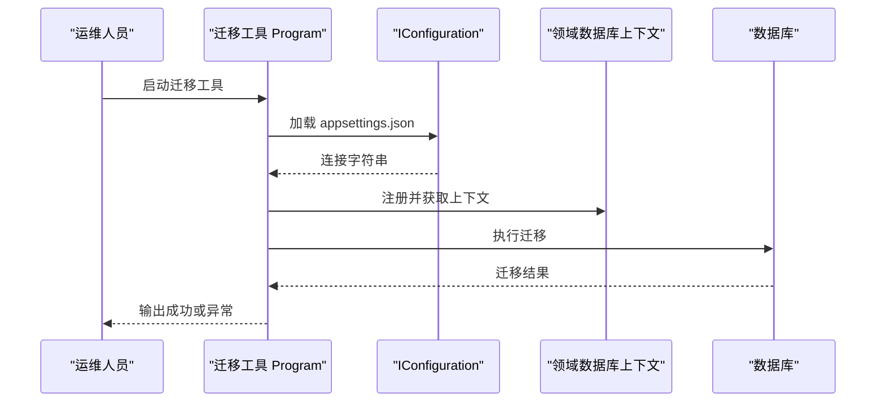
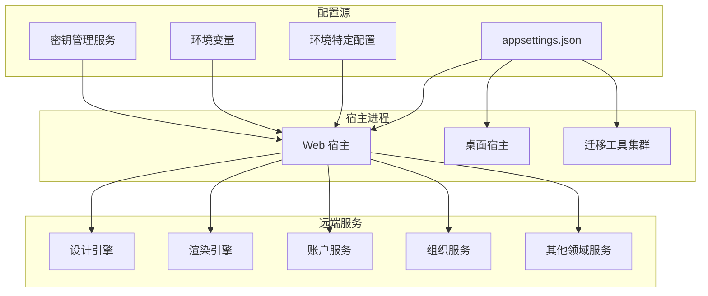
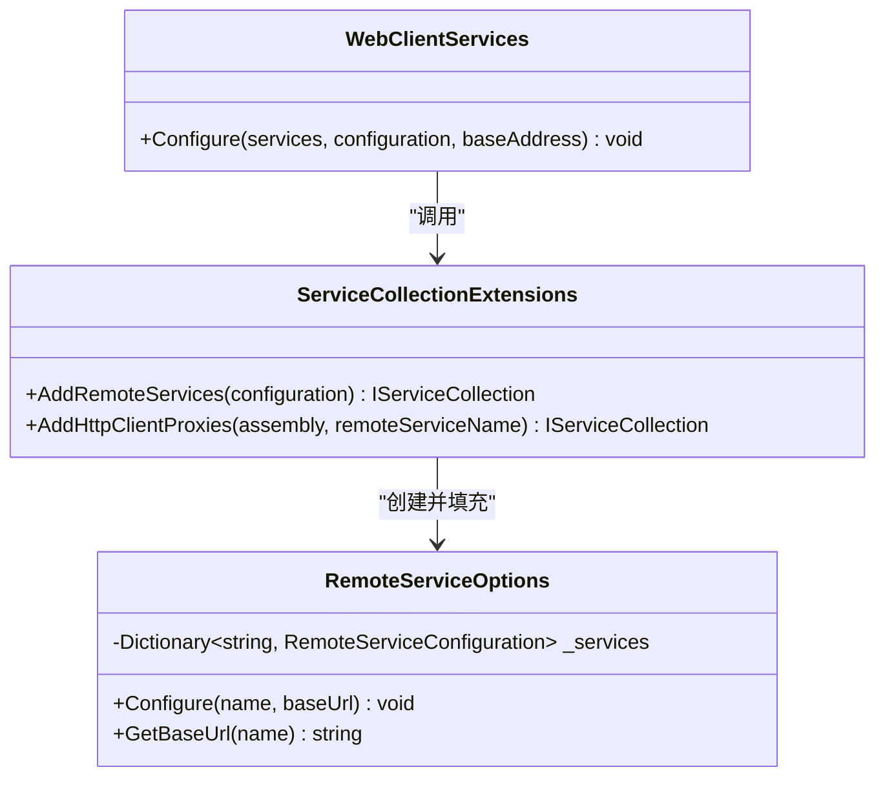
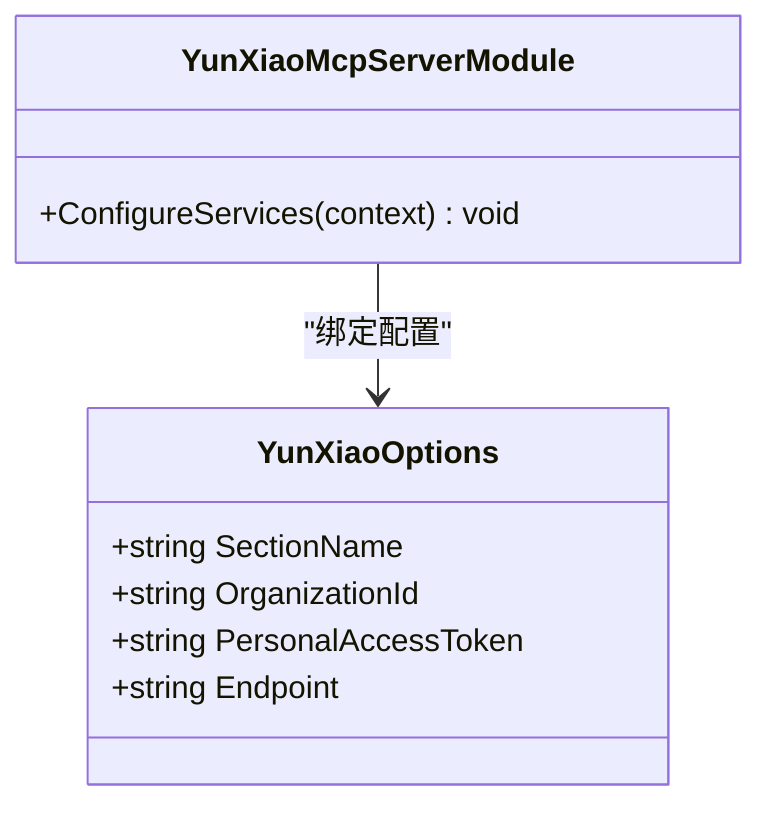
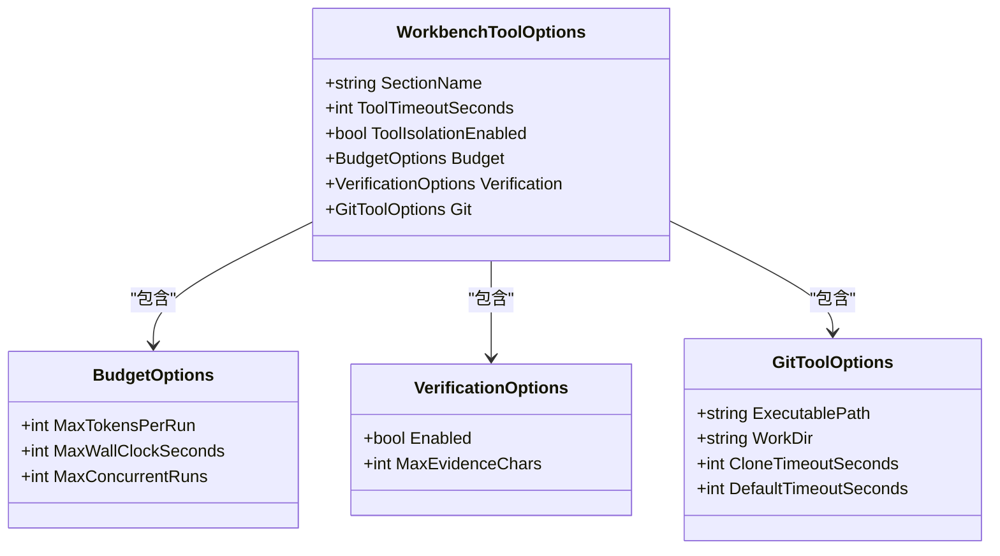
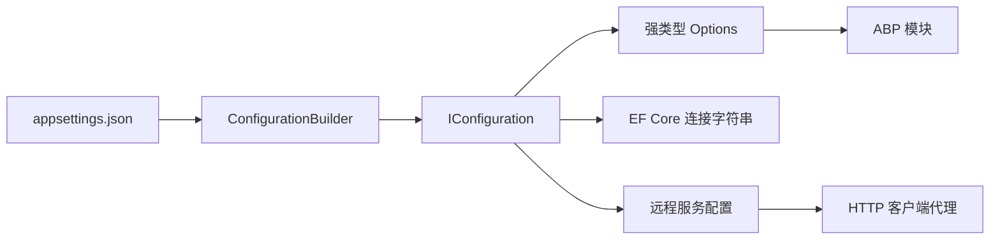
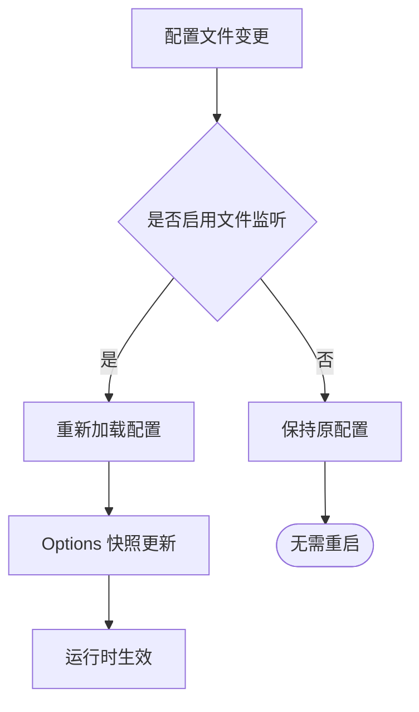

# 配置管理

<cite>
**本文引用的文件**   
- [appsettings.json（Web 宿主）](file://src/Host/H.AppLab.Web.Host/H.AppLab.Web.Host/appsettings.json)
- [appsettings.json（桌面宿主）](file://src/Host/H.AppLab.Desktop/appsettings.json)
- [appsettings.json（低代码迁移工具）](file://src/Tools/H.LowCode.DbMigrator/appsettings.json)
- [appsettings.serilog.json（低代码迁移工具日志）](file://src/Tools/H.LowCode.DbMigrator/appsettings.serilog.json)
- [appsettings.json（工作流迁移工具）](file://src/Tools/H.Workbench.DbMigrator/appsettings.json)
- [Program.cs（Web 宿主）](file://src/Host/H.AppLab.Web.Host/H.AppLab.Web.Host/Program.cs)
- [Program.cs（桌面宿主）](file://src/Host/H.AppLab.Desktop/Program.cs)
- [Program.cs（工作流迁移工具）](file://src/Tools/H.Workbench.DbMigrator/Program.cs)
- [Program.cs（低代码迁移工具）](file://src/Tools/H.LowCode.DbMigrator/Program.cs)
- [WorkbenchDbContextFactory.cs（工作流迁移工具）](file://src/Tools/H.Workbench.DbMigrator/WorkbenchDbContextFactory.cs)
- [HostServices.cs（桌面宿主服务）](file://src/Host/H.AppLab.Desktop/HostServices.cs)
- [ServiceCollectionExtensions.cs（远程服务扩展）](file://src/Utils/H.Abp.HttpClientProxy/ServiceCollectionExtensions.cs)
- [RemoteServiceOptions.cs（远程服务选项）](file://src/Utils/H.Abp.HttpClientProxy/RemoteServiceOptions.cs)
- [YunXiaoOptions.cs（云效选项）](file://src/Agent/McpServers/H.Mcp.YunXiao/YunXiaoOptions.cs)
- [YunXiaoMcpServerModule.cs（云效模块）](file://src/Agent/McpServers/H.Mcp.YunXiao/YunXiaoMcpServerModule.cs)
- [WorkbenchToolOptions.cs（工作台工具选项）](file://src/Agent/Workbench/H.Workbench.Core/WorkbenchToolOptions.cs)
- [WorkbenchCoreModule.cs（工作台核心模块）](file://src/Agent/Workbench/H.Workbench.Core/WorkbenchCoreModule.cs)
- [ClientServices.cs（Web 客户端远程服务配置）](file://src/Host/H.AppLab.Web.Host/H.AppLab.Web.Host.Client/ClientServices.cs)
- [ClientServices.cs（渲染引擎客户端远程服务配置）](file://src/Host/RenderEngine/H.LowCode.RenderEngine.Host.Client/ClientServices.cs)
- [appsettings.json（Web 客户端）](file://src/Host/H.AppLab.Web.Host/H.AppLab.Web.Host.Client/wwwroot/appsettings.json)
- [appsettings.json（账户客户端）](file://src/Host/Account/H.Account.Host.Client/wwwroot/appsettings.json)
- [appsettings.json（渲染引擎客户端）](file://src/Host/RenderEngine/H.LowCode.RenderEngine.Host.Client/wwwroot/appsettings.json)
</cite>

## 目录

1. [引言](#引言)
2. [项目结构](#项目结构)
3. [核心组件](#核心组件)
4. [架构总览](#架构总览)
5. [详细组件分析](#详细组件分析)
6. [依赖关系分析](#依赖关系分析)
7. [性能与热重载](#性能与热重载)
8. [故障排查指南](#故障排查指南)
9. [结论](#结论)

## 引言

AppLab 的配置管理系统围绕 .NET 的 `IConfiguration` 抽象展开，采用“基础配置 + 环境特定配置 + 敏感信息分离”的分层策略。不同宿主承担不同的职责：

- **Web 宿主**：承载 Blazor、SignalR、Hangfire、远端服务代理和站点路由，同时维护多数据库连接字符串、外部系统集成、对象存储和第三方登录等运行配置。
- **桌面宿主**：使用 Avalonia 启动统一外壳，从可执行目录加载最小化配置，并注入插件应用的服务。
- **DbMigrator 工具**：是独立控制台进程，重点在迁移目标数据库连接、迁移程序集、Serilog 日志以及运行时参数。

本仓库中多个子域（账户、审批、组织、订单、设置、供应链、测试、后台任务、文件、通知、企业、系统门户、工作流、低代码设计引擎、渲染引擎）各自拥有 DbMigrator 程序集，每个都通过自己的 `appsettings.json` 提供连接字符串和领域元数据。

## 项目结构

配置相关的关键文件分布在三类位置：

| 类别 | 典型路径 | 作用 |
|---|---|---|
| Web 宿主配置 | `src/Host/H.AppLab.Web.Host/H.AppLab.Web.Host/appsettings.json` | 全局连接字符串、远程服务地址、站点列表、外部集成、日志级别、MinIO、云效令牌占位等 |
| 桌面宿主配置 | `src/Host/H.AppLab.Desktop/appsettings.json` | 桌面端远程服务基地址、HTTP 证书校验开关 |
| 迁移工具配置 | `src/Tools/*/appsettings.json` | 单个领域的数据库连接和少量领域元数据 |
| Serilog 配置 | `src/Tools/H.LowCode.DbMigrator/appsettings.serilog.json` | 低代码迁移工具的日志输出、滚动策略和级别覆盖 |
| 客户端配置 | `src/Host/*/wwwroot/appsettings.json` | 浏览器侧可用的远程服务基地址、前端日志级别 |

**图表来源**
- [appsettings.json（Web 宿主）:1-147](file://src/Host/H.AppLab.Web.Host/H.AppLab.Web.Host/appsettings.json#L1-L147)
- [appsettings.json（桌面宿主）:1-10](file://src/Host/H.AppLab.Desktop/appsettings.json#L1-L10)
- [appsettings.json（低代码迁移工具）:1-8](file://src/Tools/H.LowCode.DbMigrator/appsettings.json#L1-L8)
- [appsettings.json（工作流迁移工具）:1-5](file://src/Tools/H.Workbench.DbMigrator/appsettings.json#L1-L5)
- [appsettings.json（Web 客户端）:1-52](file://src/Host/H.AppLab.Web.Host/H.AppLab.Web.Host.Client/wwwroot/appsettings.json#L1-L52)

**章节来源**
- [appsettings.json（Web 宿主）:1-147](file://src/Host/H.AppLab.Web.Host/H.AppLab.Web.Host/appsettings.json#L1-L147)
- [appsettings.json（桌面宿主）:1-10](file://src/Host/H.AppLab.Desktop/appsettings.json#L1-L10)
- [appsettings.json（低代码迁移工具）:1-8](file://src/Tools/H.LowCode.DbMigrator/appsettings.json#L1-L8)
- [appsettings.json（工作流迁移工具）:1-5](file://src/Tools/H.Workbench.DbMigrator/appsettings.json#L1-L5)

## 核心组件

### 分层配置策略

当前仓库采用的分层方式如下：

| 层级 | 说明 | 仓库现状 |
|---|---|---|
| 基础配置 | 默认值、公共结构、非敏感业务参数 | `appsettings.json` |
| 环境特定配置 | 开发、预发、生产差异 | 存在 `.Development.json` 模板文件；Web 宿主未显式添加 `AddJsonFile("appsettings.{Environment}.json")` |
| 敏感信息 | 令牌、密钥、访问凭证 | 以明文占位或默认值形式存在于 `appsettings.json`；未实现环境变量注入、用户机密或密钥管理服务 |
| 客户端可见配置 | 仅浏览器需要读取的值 | `wwwroot/appsettings.json` |

**推荐规则：**

1. 将连接字符串、第三方 API 密钥、OAuth 客户端密钥、MinIO 凭据、云效令牌等敏感字段移出源码库。
2. 在部署时通过环境变量、容器 Secret、Azure Key Vault、HashiCorp Vault 或操作系统安全配置覆盖。
3. 保留 `appsettings.json` 作为结构文档和默认值参考，但不在版本控制中提交真实敏感值。
4. 对可在浏览器暴露的字段做白名单过滤，不要把后端专用配置直接复制到客户端配置。

**章节来源**
- [appsettings.json（Web 宿主）:1-147](file://src/Host/H.AppLab.Web.Host/H.AppLab.Web.Host/appsettings.json#L1-L147)
- [appsettings.json（Web 客户端）:1-52](file://src/Host/H.AppLab.Web.Host/H.AppLab.Web.Host.Client/wwwroot/appsettings.json#L1-L52)

### IConfiguration 的使用方式

项目中主要通过以下方式使用配置：

| 使用方式 | 说明 | 对应代码 |
|---|---|---|
| 直接注入 `IConfiguration` | 在模块、服务、布局类中读取配置 | `WorkbenchCoreModule.cs`、`ThemePartLayoutBase.cs` |
| 使用 `GetSection` 获取子节点 | 绑定到自定义 Options 类型 | `YunXiaoMcpServerModule.cs`、`WorkbenchCoreModule.cs` |
| 使用 `Configure<T>()` 绑定 Options | 把配置节映射为强类型对象 | `YunXiaoMcpServerModule.cs`、`WorkbenchCoreModule.cs` |
| 手动构建 `ConfigurationBuilder` | 控制台工具和桌面宿主场景 | `HostServices.cs`、`WorkbenchDbContextFactory.cs`、`Program.cs` |
| 从 `ConnectionStrings` 取连接字符串 | EF Core 迁移和数据库上下文 | `Program.cs`（迁移工具） |
| 从 `RemoteServices` 动态注册 HTTP 客户端 | 远端服务代理 | `ServiceCollectionExtensions.cs` |

**章节来源**
- [YunXiaoMcpServerModule.cs:12-16](file://src/Agent/McpServers/H.Mcp.YunXiao/YunXiaoMcpServerModule.cs#L12-L16)
- [WorkbenchCoreModule.cs:10-14](file://src/Agent/Workbench/H.Workbench.Core/WorkbenchCoreModule.cs#L10-L14)
- [ServiceCollectionExtensions.cs:14-21](file://src/Utils/H.Abp.HttpClientProxy/ServiceCollectionExtensions.cs#L14-L21)
- [HostServices.cs:23-29](file://src/Host/H.AppLab.Desktop/HostServices.cs#L23-L29)
- [Program.cs（工作流迁移工具）:41-47](file://src/Tools/H.Workbench.DbMigrator/Program.cs#L41-L47)

### 配置绑定与验证

项目中主要使用 `IConfiguration.GetSection()` 配合 `Configure<T>()` 进行配置绑定，典型模式包括：

- **YunXiao 配置**：通过 `YunXiaoOptions.SectionName = "YunXiao"` 定位配置节，并将 `OrganizationId`、`PersonalAccessToken`、`Endpoint` 绑定到强类型选项。
- **Workbench 工具配置**：通过 `WorkbenchToolOptions.SectionName = "Workbench"` 绑定工作台工具运行时参数。
- **Meta 配置**：渲染引擎和低代码仓库模块中使用 `MetaOption.SectionName` 绑定元数据路径。

**图表来源**
- [YunXiaoMcpServerModule.cs:12-16](file://src/Agent/McpServers/H.Mcp.YunXiao/YunXiaoMcpServerModule.cs#L12-L16)
- [YunXiaoOptions.cs:1-21](file://src/Agent/McpServers/H.Mcp.YunXiao/YunXiaoOptions.cs#L1-L21)
- [WorkbenchCoreModule.cs:10-14](file://src/Agent/Workbench/H.Workbench.Core/WorkbenchCoreModule.cs#L10-L14)
- [WorkbenchToolOptions.cs:1-166](file://src/Agent/Workbench/H.Workbench.Core/WorkbenchToolOptions.cs#L1-L166)

当前代码没有显式调用 `ValidateOnStart()`，也没有看到基于 `IValidatableObject` 或 `DataAnnotations` 的统一配置验证。这意味着：

- 缺失必填字段不会在启动阶段抛出明确错误。
- 非法数值可能延迟到实际使用时才失败。
- 建议新增集中验证逻辑，尤其针对连接字符串、外部 API 地址、令牌、超时和配额。

**章节来源**
- [YunXiaoOptions.cs:1-21](file://src/Agent/McpServers/H.Mcp.YunXiao/YunXiaoOptions.cs#L1-L21)
- [YunXiaoMcpServerModule.cs:12-16](file://src/Agent/McpServers/H.Mcp.YunXiao/YunXiaoMcpServerModule.cs#L12-L16)
- [WorkbenchToolOptions.cs:1-166](file://src/Agent/Workbench/H.Workbench.Core/WorkbenchToolOptions.cs#L1-L166)
- [WorkbenchCoreModule.cs:10-14](file://src/Agent/Workbench/H.Workbench.Core/WorkbenchCoreModule.cs#L10-L14)

### 敏感信息处理现状

Web 宿主的 `appsettings.json` 包含以下敏感或潜在敏感字段：

| 配置项 | 风险 | 建议 |
|---|---|---|
| `ConnectionStrings.*` | 数据库连接字符串可能包含凭据 | 使用环境变量或密钥管理服务注入 |
| `YunXiao.PersonalAccessToken` | 云效个人访问令牌 | 必须从环境变量或密钥服务注入 |
| `ExternalLogin.*.ClientId` / `ClientSecret` | OAuth 客户端密钥 | 不提交到源码库 |
| `Minio.AccessKey` / `Minio.SecretKey` | 对象存储密钥 | 使用部署平台 Secret |
| `Sites[*].SiteUrl` | 站点地址属于运行期信息 | 按环境区分，避免泄露内部拓扑 |

当前仓库没有发现以下能力：

- 没有使用 `AddUserSecrets()`。
- 没有使用 `AddEnvironmentVariables()`。
- 没有使用 Azure Key Vault、AWS Secrets Manager、HashiCorp Vault 等密钥管理服务。
- 没有配置文件加密机制。
- 没有统一的敏感字段掩码或脱敏日志。

**章节来源**
- [appsettings.json（Web 宿主）:1-147](file://src/Host/H.AppLab.Web.Host/H.AppLab.Web.Host/appsettings.json#L1-L147)
- [YunXiaoOptions.cs:1-21](file://src/Agent/McpServers/H.Mcp.YunXiao/YunXiaoOptions.cs#L1-L21)

### 不同宿主环境的配置重点

#### Web 宿主

Web 宿主使用 `WebApplication.CreateBuilder`，并通过 Autofac 扩展、ABP 模块、SignalR、响应压缩、静态资源、认证授权、Hangfire 仪表盘等能力组合应用。其配置重点是：

- 多领域数据库连接字符串。
- 远端服务 BaseUrl。
- 站点路由和静态资源缓存策略。
- Hangfire 仪表盘。
- 外部集成（云效、微信、钉钉、MinIO）。

**章节来源**
- [Program.cs（Web 宿主）:1-113](file://src/Host/H.AppLab.Web.Host/H.AppLab.Web.Host/Program.cs#L1-L113)
- [appsettings.json（Web 宿主）:1-147](file://src/Host/H.AppLab.Web.Host/H.AppLab.Web.Host/appsettings.json#L1-L147)

#### 桌面宿主

桌面宿主入口非常精简，真正加载配置的是 `HostServices.Build()`：

- 从 `AppContext.BaseDirectory` 读取 `appsettings.json`。
- 将 `IConfiguration` 注册为单例。
- 遍历已注册的插件应用并调用各自的 `ConfigureServices`。
- 当前只注册了 Workbench 应用。

**章节来源**
- [Program.cs（桌面宿主）:1-19](file://src/Host/H.AppLab.Desktop/Program.cs#L1-L19)
- [HostServices.cs:1-47](file://src/Host/H.AppLab.Desktop/HostServices.cs#L1-L47)
- [appsettings.json（桌面宿主）:1-10](file://src/Host/H.AppLab.Desktop/appsettings.json#L1-L10)

#### DbMigrator 工具

迁移工具是独立控制台进程，配置重点集中在：

- 指定基础路径为当前工作目录。
- 加载 `appsettings.json`。
- 读取 `ConnectionStrings` 中的目标数据库连接。
- 注册 EF Core 上下文并执行迁移。
- 低代码迁移工具额外加载 `appsettings.serilog.json` 配置 Serilog。

**图表来源**
- [Program.cs（工作流迁移工具）:1-57](file://src/Tools/H.Workbench.DbMigrator/Program.cs#L1-L57)
- [WorkbenchDbContextFactory.cs:16-20](file://src/Tools/H.Workbench.DbMigrator/WorkbenchDbContextFactory.cs#L16-L20)
- [Program.cs（低代码迁移工具）:1-38](file://src/Tools/H.LowCode.DbMigrator/Program.cs#L1-L38)
- [appsettings.serilog.json:1-41](file://src/Tools/H.LowCode.DbMigrator/appsettings.serilog.json#L1-L41)

**章节来源**
- [Program.cs（工作流迁移工具）:1-57](file://src/Tools/H.Workbench.DbMigrator/Program.cs#L1-L57)
- [Program.cs（低代码迁移工具）:1-38](file://src/Tools/H.LowCode.DbMigrator/Program.cs#L1-L38)
- [appsettings.json（低代码迁移工具）:1-8](file://src/Tools/H.LowCode.DbMigrator/appsettings.json#L1-L8)
- [appsettings.json（工作流迁移工具）:1-5](file://src/Tools/H.Workbench.DbMigrator/appsettings.json#L1-L5)
- [appsettings.serilog.json:1-41](file://src/Tools/H.LowCode.DbMigrator/appsettings.serilog.json#L1-L41)

## 架构总览

**图表来源**
- [Program.cs（Web 宿主）:1-113](file://src/Host/H.AppLab.Web.Host/H.AppLab.Web.Host/Program.cs#L1-L113)
- [HostServices.cs:23-29](file://src/Host/H.AppLab.Desktop/HostServices.cs#L23-L29)
- [Program.cs（工作流迁移工具）:41-47](file://src/Tools/H.Workbench.DbMigrator/Program.cs#L41-L47)
- [ServiceCollectionExtensions.cs:14-21](file://src/Utils/H.Abp.HttpClientProxy/ServiceCollectionExtensions.cs#L14-L21)

## 详细组件分析

### 远程服务配置体系

远程服务配置通过 `RemoteServices` 节点统一管理，所有远端服务的 BaseUrl 集中声明，再由 HTTP 客户端代理扫描并注册。

**图表来源**
- [ServiceCollectionExtensions.cs:14-63](file://src/Utils/H.Abp.HttpClientProxy/ServiceCollectionExtensions.cs#L14-L63)
- [RemoteServiceOptions.cs:12-14](file://src/Utils/H.Abp.HttpClientProxy/RemoteServiceOptions.cs#L12-L14)
- [ClientServices.cs（Web 客户端）:47-51](file://src/Host/H.AppLab.Web.Host/H.AppLab.Web.Host.Client/ClientServices.cs#L47-L51)
- [ClientServices.cs（渲染引擎客户端）:14-18](file://src/Host/RenderEngine/H.LowCode.RenderEngine.Host.Client/ClientServices.cs#L14-L18)

**行为说明：**

1. 配置从 `RemoteServices` 节点读取。
2. 遍历每个子节点，读取 `BaseUrl`。
3. 忽略空 BaseUrl。
4. 将服务名和 BaseUrl 存入 `RemoteServiceOptions`。
5. HTTP 客户端代理根据服务名创建 HttpClient 并拼接 BaseUrl。

**章节来源**
- [ServiceCollectionExtensions.cs:14-63](file://src/Utils/H.Abp.HttpClientProxy/ServiceCollectionExtensions.cs#L14-L63)
- [appsettings.json（Web 宿主）:1-147](file://src/Host/H.AppLab.Web.Host/H.AppLab.Web.Host/appsettings.json#L1-L147)
- [appsettings.json（Web 客户端）:1-52](file://src/Host/H.AppLab.Web.Host/H.AppLab.Web.Host.Client/wwwroot/appsettings.json#L1-L52)

### 云效配置模型

云效配置是一个典型的强类型 Options：

**图表来源**
- [YunXiaoOptions.cs:1-21](file://src/Agent/McpServers/H.Mcp.YunXiao/YunXiaoOptions.cs#L1-L21)
- [YunXiaoMcpServerModule.cs:12-16](file://src/Agent/McpServers/H.Mcp.YunXiao/YunXiaoMcpServerModule.cs#L12-L16)

**章节来源**
- [YunXiaoOptions.cs:1-21](file://src/Agent/McpServers/H.Mcp.YunXiao/YunXiaoOptions.cs#L1-L21)
- [YunXiaoMcpServerModule.cs:12-16](file://src/Agent/McpServers/H.Mcp.YunXiao/YunXiaoMcpServerModule.cs#L12-L16)
- [appsettings.json（Web 宿主）:1-147](file://src/Host/H.AppLab.Web.Host/H.AppLab.Web.Host/appsettings.json#L1-L147)

### 工作台工具配置模型

工作台工具配置集中在 `WorkbenchToolOptions` 及其嵌套选项中，涵盖：

- 工具超时。
- 工具隔离开关。
- AI 调用预算。
- 验收开关。
- Git 可执行文件和仓库路径。
- 数据源、审批门、Shell 工具、执行轨迹等。

**图表来源**
- [WorkbenchToolOptions.cs:1-166](file://src/Agent/Workbench/H.Workbench.Core/WorkbenchToolOptions.cs#L1-L166)
- [appsettings.json（Web 宿主）:1-147](file://src/Host/H.AppLab.Web.Host/H.AppLab.Web.Host/appsettings.json#L1-L147)

**章节来源**
- [WorkbenchToolOptions.cs:1-166](file://src/Agent/Workbench/H.Workbench.Core/WorkbenchToolOptions.cs#L1-L166)
- [WorkbenchCoreModule.cs:10-14](file://src/Agent/Workbench/H.Workbench.Core/WorkbenchCoreModule.cs#L10-L14)
- [appsettings.json（Web 宿主）:1-147](file://src/Host/H.AppLab.Web.Host/H.AppLab.Web.Host/appsettings.json#L1-L147)

### 客户端配置差异

客户端 `appsettings.json` 通常只包含浏览器需要的配置：

| 客户端 | 主要配置内容 |
|---|---|
| Web 宿主客户端 | 所有远端服务 BaseUrl |
| 账户客户端 | 日志级别、账户服务 BaseUrl |
| 渲染引擎客户端 | 日志级别、遥测开关、Serilog 控制台输出、渲染引擎 BaseUrl |

需要注意：客户端配置会随应用发布到浏览器，因此不能存放敏感信息。

**章节来源**
- [appsettings.json（Web 客户端）:1-52](file://src/Host/H.AppLab.Web.Host/H.AppLab.Web.Host.Client/wwwroot/appsettings.json#L1-L52)
- [appsettings.json（账户客户端）:1-13](file://src/Host/Account/H.Account.Host.Client/wwwroot/appsettings.json#L1-L13)
- [appsettings.json（渲染引擎客户端）:1-40](file://src/Host/RenderEngine/H.LowCode.RenderEngine.Host.Client/wwwroot/appsettings.json#L1-L40)

## 依赖关系分析

配置相关的主要依赖关系如下：

**图表来源**
- [HostServices.cs:23-29](file://src/Host/H.AppLab.Desktop/HostServices.cs#L23-L29)
- [Program.cs（工作流迁移工具）:41-47](file://src/Tools/H.Workbench.DbMigrator/Program.cs#L41-L47)
- [ServiceCollectionExtensions.cs:14-63](file://src/Utils/H.Abp.HttpClientProxy/ServiceCollectionExtensions.cs#L14-L63)
- [YunXiaoMcpServerModule.cs:12-16](file://src/Agent/McpServers/H.Mcp.YunXiao/YunXiaoMcpServerModule.cs#L12-L16)

**耦合性分析：**

- 配置与业务模块之间存在松耦合：模块通过 `IConfiguration` 或 Options 消费配置。
- 远程服务配置与 HTTP 客户端代理耦合较紧：新增服务需要在配置和客户端注册两侧保持一致。
- 迁移工具与具体数据库上下文耦合：每个领域都有独立的迁移程序和上下文工厂。
- 当前缺少统一的配置验证层，导致配置错误可能在运行时才暴露。

**章节来源**
- [ServiceCollectionExtensions.cs:14-63](file://src/Utils/H.Abp.HttpClientProxy/ServiceCollectionExtensions.cs#L14-L63)
- [YunXiaoMcpServerModule.cs:12-16](file://src/Agent/McpServers/H.Mcp.YunXiao/YunXiaoMcpServerModule.cs#L12-L16)
- [Program.cs（工作流迁移工具）:41-47](file://src/Tools/H.Workbench.DbMigrator/Program.cs#L41-L47)

## 性能与热重载

### 当前热重载行为

| 宿主或工具 | 是否启用热重载 | 说明 |
|---|---:|---|
| 工作流迁移工具 | 是 | `reloadOnChange: true` |
| 测试迁移工具 | 是 | `reloadOnChange: true` |
| 桌面宿主 | 否 | `reloadOnChange: false` |
| Web 宿主 | 未显式加载 JSON 配置 | 由 ABP 框架和宿主基础设施负责 |
| 迁移工具上下文工厂 | 否 | 仅读取一次配置 |

**图表来源**
- [Program.cs（工作流迁移工具）:43-46](file://src/Tools/H.Workbench.DbMigrator/Program.cs#L43-L46)
- [HostServices.cs:23-25](file://src/Host/H.AppLab.Desktop/HostServices.cs#L23-L25)

### 热重载最佳实践

1. **不要把所有配置都设为热重载。** 连接字符串、证书、密钥等敏感配置适合进程启动时加载。
2. **对频繁变更的非敏感配置启用热重载。** 例如日志级别、功能开关、远端服务地址。
3. **使用 `IOptionsMonitor<T>` 或 `IOptionsSnapshot<T>` 获取最新值。** 当前项目更多是直接注入 Options，需要注意生命周期。
4. **避免在热重载回调中执行昂贵操作。** 应使用增量更新或防抖。
5. **对异步初始化配置增加重试和降级。** 如果远端配置服务不可用，不应阻塞应用启动。
6. **在单元测试中显式替换 `IConfiguration`。** 不要依赖磁盘上的 `appsettings.json`。

**章节来源**
- [Program.cs（工作流迁移工具）:43-46](file://src/Tools/H.Workbench.DbMigrator/Program.cs#L43-L46)
- [HostServices.cs:23-25](file://src/Host/H.AppLab.Desktop/HostServices.cs#L23-L25)

## 故障排查指南

### 常见配置错误

| 现象 | 可能原因 | 排查方法 |
|---|---|---|
| 迁移工具无法连接数据库 | `appsettings.json` 中连接字符串错误或工作目录不正确 | 检查 `ConnectionStrings` 和目标数据库实例 |
| 远端服务调用失败 | `RemoteServices` 中 BaseUrl 写错或网络不可达 | 核对 Web 宿主和客户端配置中的 BaseUrl |
| 云效接口鉴权失败 | `YunXiao.PersonalAccessToken` 为空或过期 | 检查环境变量或部署 Secret 是否注入 |
| 客户端无法加载配置 | 浏览器请求 `appsettings.json` 返回 404 | 确认 wwwroot 下配置已发布 |
| 桌面应用找不到配置 | 可执行目录不是预期路径 | 检查 `AppContext.BaseDirectory` 和 `appsettings.json` 部署位置 |
| 日志级别不符合预期 | Serilog 配置被覆盖或日志提供者未正确初始化 | 检查 `appsettings.serilog.json` 和 `Serilog` 节点 |
| 配置修改未生效 | 未启用热重载或使用了固定生命周期的 Options | 确认 `reloadOnChange` 和 Options 生命周期 |

### 调试技巧

1. **打印最终配置树：** 在模块启动时遍历 `IConfiguration`，确认值来自哪个文件。
2. **优先检查基础路径：** 迁移工具使用 `Directory.GetCurrentDirectory()`，桌面宿主使用 `AppContext.BaseDirectory`。
3. **区分服务端和客户端配置：** 浏览器只能读取 `wwwroot/appsettings.json`。
4. **检查 ABP 模块注册顺序：** 先注册配置，再消费配置。
5. **使用结构化日志：** 低代码迁移工具已经使用 Serilog，可继续推广到 Web 宿主和桌面宿主。
6. **对外部依赖加超时和熔断：** 远端服务 BaseUrl 变化时，避免无限重试。

**章节来源**
- [Program.cs（工作流迁移工具）:41-47](file://src/Tools/H.Workbench.DbMigrator/Program.cs#L41-L47)
- [HostServices.cs:23-29](file://src/Host/H.AppLab.Desktop/HostServices.cs#L23-L29)
- [Program.cs（低代码迁移工具）:24-37](file://src/Tools/H.LowCode.DbMigrator/Program.cs#L24-L37)
- [appsettings.serilog.json:1-41](file://src/Tools/H.LowCode.DbMigrator/appsettings.serilog.json#L1-L41)

### 生产环境部署策略和安全加固

| 主题 | 建议措施 |
|---|---|
| 连接字符串 | 使用环境变量或密钥管理服务注入，不在源码库提交真实值 |
| 第三方密钥 | 使用 Azure Key Vault、AWS Secrets Manager、HashiCorp Vault 或平台 Secret |
| 配置文件 | 只保留结构和默认值；生产环境由部署平台生成或挂载配置 |
| 敏感字段 | 禁止写入客户端 `wwwroot/appsettings.json` |
| 日志 | 屏蔽令牌、密码、连接字符串、请求头中的敏感信息 |
| 配置审计 | 记录配置变更来源、时间、操作人，但不记录敏感值 |
| 热重载 | 生产环境谨慎开启，避免恶意配置注入 |
| 回滚 | 配置版本化，支持快速回滚到上一稳定版本 |
| 最小权限 | 应用只读访问密钥服务，且只访问必要资源 |
| 容器部署 | 使用 Kubernetes Secret、Docker Secret 或编排平台 Secret 卷 |
| 网络安全 | 远端服务使用 HTTPS，禁用弱协议，限制跨域和访问源 |
| 合规 | 符合企业内部安全策略和数据保护要求 |

当前仓库的生产部署尚未体现上述全部能力，建议在 CI/CD 和容器编排层面补齐。

**章节来源**
- [appsettings.json（Web 宿主）:1-147](file://src/Host/H.AppLab.Web.Host/H.AppLab.Web.Host/appsettings.json#L1-L147)
- [appsettings.json（Web 客户端）:1-52](file://src/Host/H.AppLab.Web.Host/H.AppLab.Web.Host.Client/wwwroot/appsettings.json#L1-L52)
- [appsettings.serilog.json:1-41](file://src/Tools/H.LowCode.DbMigrator/appsettings.serilog.json#L1-L41)

## 结论

AppLab 的配置系统以 `IConfiguration` 为核心，通过 `appsettings.json` 提供基础结构，并通过远端服务、模块选项和迁移工具形成多宿主、多领域的配置面。当前实现的优点是结构清晰、远端服务地址集中、迁移工具配置简洁；不足是敏感信息仍暴露在默认配置文件中，缺少统一的环境变量注入、密钥管理服务集成、配置验证和生产级安全加固。

下一步优化建议优先级如下：

1. 将连接字符串和所有密钥移入环境变量或密钥管理服务。
2. 增加配置验证启动钩子，对必填字段、URL 格式、超时范围进行检查。
3. 为 Web 宿主和桌面宿主增加环境特定配置加载。
4. 对高频变更配置引入 `IOptionsMonitor` 和受控热重载。
5. 建立客户端配置白名单，禁止敏感字段进入浏览器。
6. 完善 Serilog 在 Web 宿主和桌面宿主的配置，统一日志格式和脱敏策略。
7. 在 CI/CD 中加入配置安全检查，阻止含密钥的默认配置进入主分支。