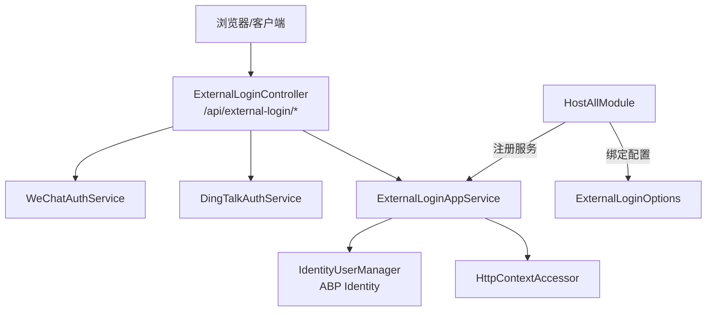
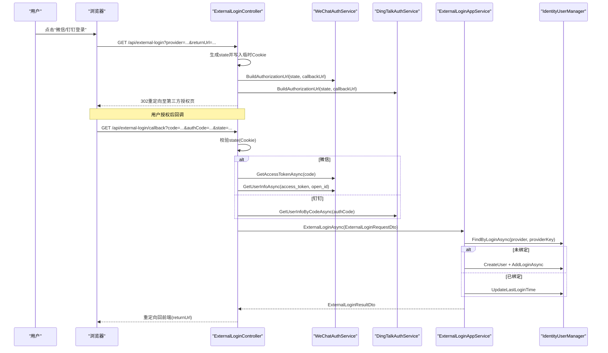
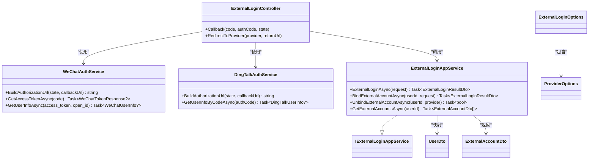

# 外部登录集成

<cite>
**本文引用的文件**   
- [ExternalLoginController.cs](file://src/Services/Account/H.Account.Application/ExternalLogin/ExternalLoginController.cs)
- [WeChatAuthService.cs](file://src/Services/Account/H.Account.Application/ExternalLogin/WeChatAuthService.cs)
- [DingTalkAuthService.cs](file://src/Services/Account/H.Account.Application/ExternalLogin/DingTalkAuthService.cs)
- [ExternalLoginAppService.cs](file://src/Services/Account/H.Account.Application/ExternalLogin/ExternalLoginAppService.cs)
- [IExternalLoginAppService.cs](file://src/Services/Account/H.Account.Application.Contracts/Services/IExternalLoginAppService.cs)
- [ExternalLoginDtos.cs](file://src/Services/Account/H.Account.Application.Contracts/Dtos/ExternalLoginDtos.cs)
- [ExternalLoginOptions.cs](file://src/Services/Account/H.Account.Application/ExternalLogin/ExternalLoginOptions.cs)
- [HostAllModule.cs](file://src/Host/H.AppLab.Host.All/H.AppLab.Host.All/HostAllModule.cs)
- [appsettings.json](file://src/Host/H.AppLab.Host.All/H.AppLab.Host.All/appsettings.json)
- [UserDetail.razor](file://src/System/SystemPortal/H.SystemPortal.Web/Pages/User/UserDetail.razor)
- [UsersList.razor](file://src/System/SystemPortal/H.SystemPortal.Web/Pages/User/UsersList.razor)
- [Profile.razor](file://src/Services/Account/H.Account.Web/Pages/Profile.razor)
</cite>

## 目录
1. [简介](#简介)
2. [项目结构](#项目结构)
3. [核心组件](#核心组件)
4. [架构总览](#架构总览)
5. [详细组件分析](#详细组件分析)
6. [依赖关系分析](#依赖关系分析)
7. [性能考虑](#性能考虑)
8. [故障排除指南](#故障排除指南)
9. [结论](#结论)
10. [附录：配置与示例](#附录配置与示例)

## 简介
本文件面向AppLab的外部登录集成功能，覆盖微信、钉钉等第三方平台的OAuth2.0集成、回调处理、用户信息映射、账户关联（同一用户绑定多个外部账号）、服务注册与配置、具体平台配置示例与安全最佳实践。读者可据此完成从配置到上线的完整流程。

## 项目结构
外部登录相关代码集中在Account应用层与宿主模块中：
- 控制器与回调入口：ExternalLoginController
- 第三方认证封装：WeChatAuthService、DingTalkAuthService
- 应用服务与业务逻辑：ExternalLoginAppService
- DTO与接口定义：ExternalLoginDtos、IExternalLoginAppService
- 配置模型与选项：ExternalLoginOptions
- 服务注册与配置绑定：HostAllModule
- 运行时配置：appsettings.json
- 前端展示与管理界面：UserDetail.razor、UsersList.razor、Profile.razor

图表来源
- [ExternalLoginController.cs:1-203](file://src/Services/Account/H.Account.Application/ExternalLogin/ExternalLoginController.cs#L1-L203)
- [WeChatAuthService.cs:1-119](file://src/Services/Account/H.Account.Application/ExternalLogin/WeChatAuthService.cs#L1-L119)
- [DingTalkAuthService.cs:1-43](file://src/Services/Account/H.Account.Application/ExternalLogin/DingTalkAuthService.cs#L1-L43)
- [ExternalLoginAppService.cs:1-236](file://src/Services/Account/H.Account.Application/ExternalLogin/ExternalLoginAppService.cs#L1-L236)
- [HostAllModule.cs:139-169](file://src/Host/H.AppLab.Host.All/H.AppLab.Host.All/HostAllModule.cs#L139-L169)

章节来源
- [ExternalLoginController.cs:1-203](file://src/Services/Account/H.Account.Application/ExternalLogin/ExternalLoginController.cs#L1-L203)
- [HostAllModule.cs:139-169](file://src/Host/H.AppLab.Host.All/H.AppLab.Host.All/HostAllModule.cs#L139-L169)

## 核心组件
- ExternalLoginController：负责发起授权跳转与处理回调，校验state、调用第三方API获取用户信息，并委托应用服务完成登录或自动注册。
- WeChatAuthService：实现微信开放平台扫码登录的授权URL构建、code换取access_token/openid、以及根据token拉取用户信息。
- DingTalkAuthService：实现钉钉新版OAuth2扫码登录的授权URL构建与通过authCode获取用户信息。
- ExternalLoginAppService：核心业务逻辑，包括查找已绑定用户、未绑定时自动创建用户并绑定、更新最后登录时间、写入Cookie认证、支持多外部账号绑定/解绑/查询。
- IExternalLoginAppService：对外暴露的应用服务接口。
- ExternalLoginDtos：请求与结果DTO，承载Provider、ProviderKey、DisplayName、AvatarUrl、UnionId等信息。
- ExternalLoginOptions：外部登录配置模型，包含各提供者的Enabled、ClientId、ClientSecret、CallbackPath。
- HostAllModule：在宿主中绑定ExternalLogin配置并注册WeChatAuthService、DingTalkAuthService。

章节来源
- [ExternalLoginController.cs:1-203](file://src/Services/Account/H.Account.Application/ExternalLogin/ExternalLoginController.cs#L1-L203)
- [WeChatAuthService.cs:1-119](file://src/Services/Account/H.Account.Application/ExternalLogin/WeChatAuthService.cs#L1-L119)
- [DingTalkAuthService.cs:1-43](file://src/Services/Account/H.Account.Application/ExternalLogin/DingTalkAuthService.cs#L1-L43)
- [ExternalLoginAppService.cs:1-236](file://src/Services/Account/H.Account.Application/ExternalLogin/ExternalLoginAppService.cs#L1-L236)
- [IExternalLoginAppService.cs:1-30](file://src/Services/Account/H.Account.Application.Contracts/Services/IExternalLoginAppService.cs#L1-L30)
- [ExternalLoginDtos.cs:1-50](file://src/Services/Account/H.Account.Application.Contracts/Dtos/ExternalLoginDtos.cs#L1-L50)
- [ExternalLoginOptions.cs:1-21](file://src/Services/Account/H.Account.Application/ExternalLogin/ExternalLoginOptions.cs#L1-L21)
- [HostAllModule.cs:139-169](file://src/Host/H.AppLab.Host.All/H.AppLab.Host.All/HostAllModule.cs#L139-L169)

## 架构总览
外部登录采用“控制器+服务”的分层设计：
- 控制器仅做协议编排与参数校验，将业务交给应用服务。
- 应用服务基于ABP Identity进行用户查找/创建、绑定外部账号、签发Cookie。
- 第三方认证服务封装HTTP调用，屏蔽不同平台的差异。

图表来源
- [ExternalLoginController.cs:1-203](file://src/Services/Account/H.Account.Application/ExternalLogin/ExternalLoginController.cs#L1-L203)
- [WeChatAuthService.cs:1-119](file://src/Services/Account/H.Account.Application/ExternalLogin/WeChatAuthService.cs#L1-L119)
- [DingTalkAuthService.cs:1-43](file://src/Services/Account/H.Account.Application/ExternalLogin/DingTalkAuthService.cs#L1-L43)
- [ExternalLoginAppService.cs:1-236](file://src/Services/Account/H.Account.Application/ExternalLogin/ExternalLoginAppService.cs#L1-L236)

## 详细组件分析

### 外部登录控制器（ExternalLoginController）
- 职责
  - 发起授权跳转：生成state并写入临时Cookie，构造第三方授权URL并重定向。
  - 处理回调：读取并校验state，按提供者分支获取用户信息，组装ExternalLoginRequestDto并调用应用服务。
  - 错误处理：状态过期、数据无效、不支持的提供者、网络异常等均返回登录页带错误信息。
- 关键流程
  - 授权跳转：根据provider选择WeChat或DingTalk的BuildAuthorizationUrl。
  - 回调处理：微信使用code换access_token再拉用户信息；钉钉使用authCode直接获取用户信息。
  - 登录处理：调用ExternalLoginAppService.ExternalLoginAsync，成功后重定向回前端并携带isNewUser标识。

章节来源
- [ExternalLoginController.cs:1-203](file://src/Services/Account/H.Account.Application/ExternalLogin/ExternalLoginController.cs#L1-L203)

### 微信认证服务（WeChatAuthService）
- 能力
  - 构建微信开放平台扫码授权URL（需以#wechat_redirect结尾）。
  - code换取access_token与openid。
  - 使用access_token与openid拉取用户信息（昵称、头像、unionid等）。
- 数据结构
  - WeChatTokenResponse：access_token、openid、unionid、expires_in、errcode、errmsg。
  - WeChatUserInfo：openid、nickname、headimgurl、unionid。

章节来源
- [WeChatAuthService.cs:1-119](file://src/Services/Account/H.Account.Application/ExternalLogin/WeChatAuthService.cs#L1-L119)

### 钉钉认证服务（DingTalkAuthService）
- 能力
  - 构建钉钉新版OAuth2扫码授权URL（login.dingtalk.com）。
  - 通过authCode获取用户信息（OpenId、Nick、AvatarUrl、UnionId等）。
- 配置
  - 使用ProviderOptions中的ClientId等参数构建授权URL。

章节来源
- [DingTalkAuthService.cs:1-43](file://src/Services/Account/H.Account.Application/ExternalLogin/DingTalkAuthService.cs#L1-L43)

### 外部登录应用服务（ExternalLoginAppService）
- 核心功能
  - ExternalLoginAsync：查找已绑定用户；未绑定时自动创建用户并绑定外部账号；更新最后登录时间；写入Cookie认证；返回结果（含是否新用户）。
  - BindExternalAccountAsync：为已登录用户绑定新的外部账号，防止重复绑定与跨用户冲突。
  - UnbindExternalAccountAsync：解绑外部账号，确保至少保留一种登录方式（密码或其他外部账号）。
  - GetExternalAccountsAsync：获取用户已绑定的外部账号列表。
- 安全与健壮性
  - 用户名清洗：SanitizeUserName移除非法字符，保证唯一性。
  - 状态检查：禁用账户拒绝登录。
  - 防误删：当无密码且仅有一个外部账号时禁止解绑。
- 数据映射
  - MapToUserDto：将IdentityUser映射为UserDto，包含基础信息与状态字段。

章节来源
- [ExternalLoginAppService.cs:1-236](file://src/Services/Account/H.Account.Application/ExternalLogin/ExternalLoginAppService.cs#L1-L236)

### 接口与DTO
- IExternalLoginAppService：定义外部登录、绑定、解绑、查询接口。
- ExternalLoginDtos：
  - ExternalLoginRequestDto：Provider、ProviderKey、DisplayName、AvatarUrl、UnionId。
  - ExternalLoginResultDto：Success、Message、IsNewUser、User。

章节来源
- [IExternalLoginAppService.cs:1-30](file://src/Services/Account/H.Account.Application.Contracts/Services/IExternalLoginAppService.cs#L1-L30)
- [ExternalLoginDtos.cs:1-50](file://src/Services/Account/H.Account.Application.Contracts/Dtos/ExternalLoginDtos.cs#L1-L50)

### 配置与服务注册
- 配置模型
  - ExternalLoginOptions：WeChat、DingTalk两个ProviderOptions。
  - ProviderOptions：Enabled、ClientId、ClientSecret、CallbackPath。
- 服务注册
  - HostAllModule中绑定ExternalLogin配置节，并注册WeChatAuthService、DingTalkAuthService。
- 运行时配置
  - appsettings.json中ExternalLogin节用于启用/关闭各平台与填写凭据。

章节来源
- [ExternalLoginOptions.cs:1-21](file://src/Services/Account/H.Account.Application/ExternalLogin/ExternalLoginOptions.cs#L1-L21)
- [HostAllModule.cs:139-169](file://src/Host/H.AppLab.Host.All/H.AppLab.Host.All/HostAllModule.cs#L139-L169)
- [appsettings.json:100-114](file://src/Host/H.AppLab.Host.All/H.AppLab.Host.All/appsettings.json#L100-L114)

### 前端展示与管理
- 用户详情页面（UserDetail.razor）：展示已绑定的第三方账号列表，支持解绑操作。
- 用户列表页面（UsersList.razor）：显示用户绑定的第三方账号图标。
- 个人资料页面（Profile.razor）：当前用户可查看已绑定的第三方账号及绑定时间。

章节来源
- [UserDetail.razor:69-107](file://src/System/SystemPortal/H.SystemPortal.Web/Pages/User/UserDetail.razor#L69-L107)
- [UsersList.razor:30-65](file://src/System/SystemPortal/H.SystemPortal.Web/Pages/User/UsersList.razor#L30-L65)
- [Profile.razor:126-173](file://src/Services/Account/H.Account.Web/Pages/Profile.razor#L126-L173)

## 依赖关系分析
- 控制器依赖第三方认证服务与应用服务。
- 应用服务依赖ABP Identity的用户管理与上下文访问器。
- 宿主模块负责配置绑定与第三方服务注册。
- 前端页面通过API调用应用服务接口，展示绑定状态。

图表来源
- [ExternalLoginController.cs:1-203](file://src/Services/Account/H.Account.Application/ExternalLogin/ExternalLoginController.cs#L1-L203)
- [WeChatAuthService.cs:1-119](file://src/Services/Account/H.Account.Application/ExternalLogin/WeChatAuthService.cs#L1-L119)
- [DingTalkAuthService.cs:1-43](file://src/Services/Account/H.Account.Application/ExternalLogin/DingTalkAuthService.cs#L1-L43)
- [ExternalLoginAppService.cs:1-236](file://src/Services/Account/H.Account.Application/ExternalLogin/ExternalLoginAppService.cs#L1-L236)
- [IExternalLoginAppService.cs:1-30](file://src/Services/Account/H.Account.Application.Contracts/Services/IExternalLoginAppService.cs#L1-L30)
- [ExternalLoginOptions.cs:1-21](file://src/Services/Account/H.Account.Application/ExternalLogin/ExternalLoginOptions.cs#L1-L21)
- [ExternalLoginDtos.cs:1-50](file://src/Services/Account/H.Account.Application.Contracts/Dtos/ExternalLoginDtos.cs#L1-L50)

## 性能考虑
- HTTP客户端复用：WeChatAuthService与DingTalkAuthService注入HttpClient，建议全局复用避免频繁握手开销。
- 异步IO：所有第三方API调用均为异步，避免阻塞线程池。
- 最小化数据传递：仅传递必要字段（如ProviderKey、DisplayName），减少序列化与传输成本。
- Cookie有效期：默认7天持久化，可根据业务调整以减少频繁重登。

[本节为通用指导，不直接分析具体文件]

## 故障排除指南
- 状态过期或无效
  - 现象：回调后提示“登录状态已过期/无效”。
  - 排查：确认临时Cookie是否被浏览器清理或跨域丢失；检查state生成与存储逻辑。
- 授权信息不完整
  - 现象：微信回调提示“授权信息不完整”。
  - 排查：检查code是否正确传递；确认WeChatAccessToken与OpenId是否返回；核对scope与redirect_uri。
- 钉钉授权失败
  - 现象：回调提示“钉钉授权失败”。
  - 排查：确认authCode有效；检查ClientSecret与权限范围；查看第三方返回的错误码。
- 外部账号已被其他用户绑定
  - 现象：绑定时报错“该外部账号已被其他用户绑定”。
  - 排查：确认ProviderKey唯一性；必要时合并或迁移绑定关系。
- 无法解绑唯一登录方式
  - 现象：解绑失败，提示不能解绑唯一登录方式。
  - 排查：先添加密码或其他外部账号后再解绑。
- 网络异常或超时
  - 现象：登录处理失败，抛出异常。
  - 排查：检查第三方API可达性与限流策略；增加重试与超时配置。

章节来源
- [ExternalLoginController.cs:1-203](file://src/Services/Account/H.Account.Application/ExternalLogin/ExternalLoginController.cs#L1-L203)
- [ExternalLoginAppService.cs:1-236](file://src/Services/Account/H.Account.Application/ExternalLogin/ExternalLoginAppService.cs#L1-L236)

## 结论
AppLab的外部登录集成通过清晰的控制器-服务分层、标准化的OAuth2.0流程与灵活的配置模型，实现了微信、钉钉等多平台统一接入。系统支持自动注册、多外部账号绑定/解绑、Cookie认证与前端管理界面，具备较好的可扩展性与安全性。生产环境应严格配置凭据、启用HTTPS、限制回调域名，并结合日志与监控快速定位问题。

[本节为总结，不直接分析具体文件]

## 附录：配置与示例

### 配置步骤
- 在appsettings.json的ExternalLogin节中启用所需平台并填写ClientId、ClientSecret、CallbackPath。
- 确保HostAllModule已绑定ExternalLogin配置并注册第三方服务。
- 在第三方平台后台配置回调地址（通常为/api/external-login/callback）。

章节来源
- [appsettings.json:100-114](file://src/Host/H.AppLab.Host.All/H.AppLab.Host.All/appsettings.json#L100-L114)
- [HostAllModule.cs:139-169](file://src/Host/H.AppLab.Host.All/H.AppLab.Host.All/HostAllModule.cs#L139-L169)

### 微信配置示例
- Enabled：true/false
- ClientId：微信开放平台AppID
- ClientSecret：微信开放平台AppSecret
- CallbackPath：/signin-wechat（实际回调路径由控制器固定为/api/external-login/callback）

章节来源
- [ExternalLoginOptions.cs:1-21](file://src/Services/Account/H.Account.Application/ExternalLogin/ExternalLoginOptions.cs#L1-L21)
- [WeChatAuthService.cs:1-119](file://src/Services/Account/H.Account.Application/ExternalLogin/WeChatAuthService.cs#L1-L119)

### 钉钉配置示例
- Enabled：true/false
- ClientId：钉钉企业应用ClientID
- ClientSecret：钉钉企业应用ClientSecret
- CallbackPath：/signin-dingtalk（实际回调路径由控制器固定为/api/external-login/callback）

章节来源
- [ExternalLoginOptions.cs:1-21](file://src/Services/Account/H.Account.Application/ExternalLogin/ExternalLoginOptions.cs#L1-L21)
- [DingTalkAuthService.cs:1-43](file://src/Services/Account/H.Account.Application/ExternalLogin/DingTalkAuthService.cs#L1-L43)

### 用户账户关联机制
- 同一用户可绑定多个外部账号（微信、钉钉等）。
- 绑定前检查：
  - 外部账号是否已被其他用户绑定。
  - 当前用户是否已绑定同类型外部账号。
- 解绑保护：若用户仅有单一登录方式（无密码且仅一个外部账号），则禁止解绑。

章节来源
- [ExternalLoginAppService.cs:134-187](file://src/Services/Account/H.Account.Application/ExternalLogin/ExternalLoginAppService.cs#L134-L187)

### 安全考虑与最佳实践
- 强制HTTPS：所有回调与第三方API通信必须使用HTTPS。
- 最小权限：第三方平台仅申请必要scope（如openid）。
- State校验：使用一次性state与临时Cookie，防止CSRF攻击。
- 凭据管理：ClientSecret等敏感信息通过环境变量或密钥管理服务注入，避免硬编码。
- 日志与审计：记录登录尝试、错误码与异常堆栈，便于追踪与合规审计。
- 速率限制：对第三方API调用设置合理超时与重试策略，避免雪崩。

[本节为通用指导，不直接分析具体文件]