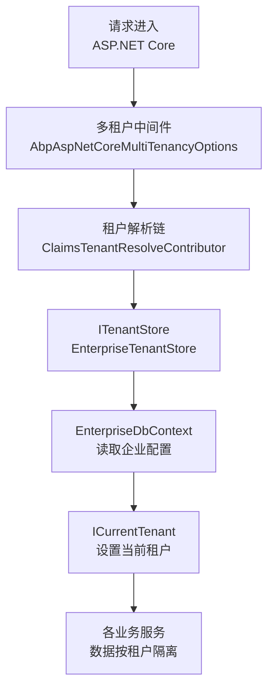
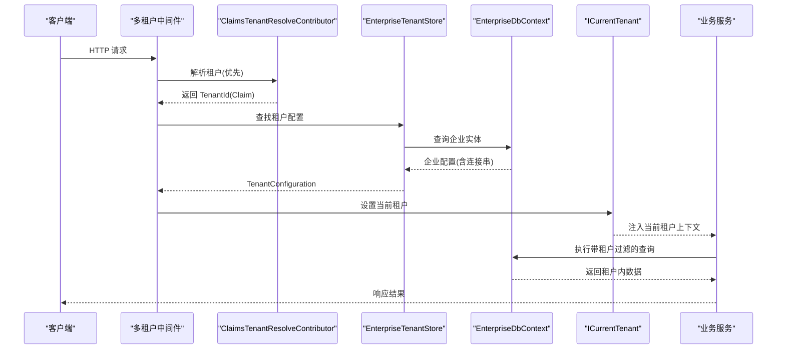
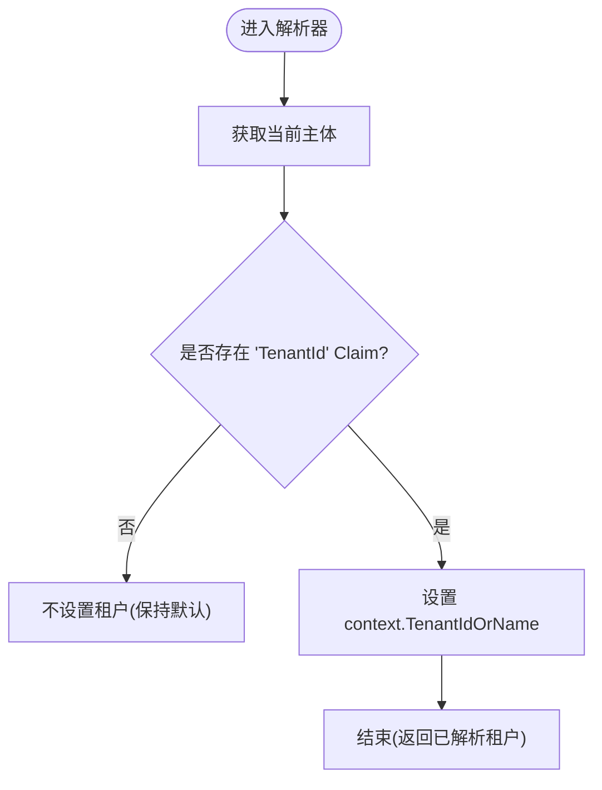
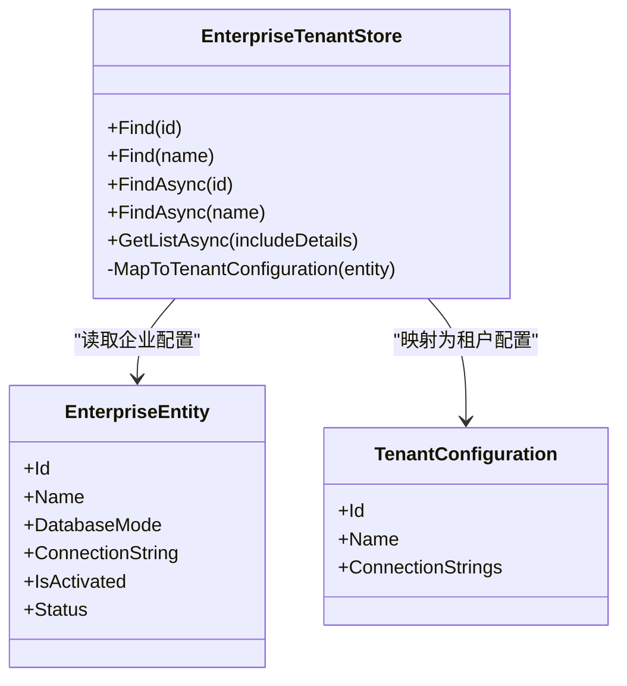
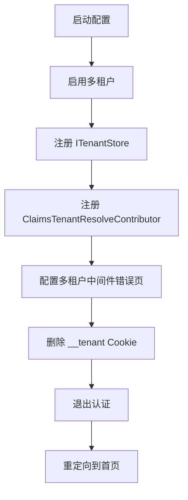
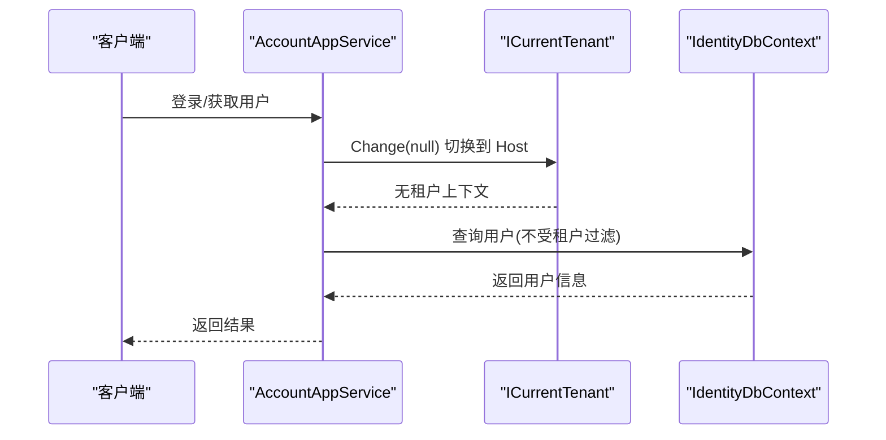
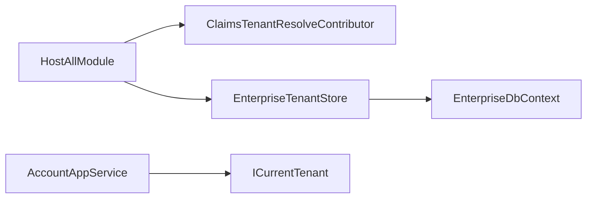

# 多租户安全隔离

<cite>
**本文引用的文件**   
- [ClaimsTenantResolveContributor.cs](file://src/Host/H.AppLab.Host.All/H.AppLab.Host.All/ClaimsTenantResolveContributor.cs)
- [HostAllModule.cs](file://src/Host/H.AppLab.Host.All/H.AppLab.Host.All/HostAllModule.cs)
- [EnterpriseTenantStore.cs](file://src/System/Enterprise/H.Enterprise.EntityFrameworkCore/EnterpriseTenantStore.cs)
- [EnterpriseEntity.cs](file://src/System/Enterprise/H.Enterprise.EntityFrameworkCore/Entities/EnterpriseEntity.cs)
- [Enums.cs](file://src/System/Enterprise/H.Enterprise.EntityFrameworkCore/Entities/Enums.cs)
- [AccountAppService.cs](file://src/Services/Account/H.Account.Application/Services/AccountAppService.cs)
</cite>

## 目录
1. [简介](#简介)
2. [项目结构](#项目结构)
3. [核心组件](#核心组件)
4. [架构总览](#架构总览)
5. [详细组件分析](#详细组件分析)
6. [依赖关系分析](#依赖关系分析)
7. [性能考虑](#性能考虑)
8. [故障排查指南](#故障排查指南)
9. [结论](#结论)
10. [附录](#附录)

## 简介
本文件面向 AppLab 平台的多租户安全隔离机制，围绕基于 Claim 的租户解析、企业级租户存储（从数据库动态加载）、数据隔离策略、租户上下文生命周期管理以及部署与优化建议进行系统化说明。目标是帮助开发者与运维人员理解并正确落地“按企业隔离”的多租户方案，确保跨租户访问的安全性与一致性。

## 项目结构
多租户相关的关键代码分布在 Host 层与 System/Enterprise 域：
- Host 层负责启用多租户、注册自定义租户解析器与租户存储，并在中间件异常时清理无效 Cookie。
- Enterprise 域提供企业实体与 ITenantStore 实现，用于从数据库读取租户配置与连接字符串。
- Account 服务在登录流程中处理认证与跨租户上下文切换，保证全局用户查询不受租户过滤影响。

**图表来源** 
- [HostAllModule.cs:171-203](file://src/Host/H.AppLab.Host.All/H.AppLab.Host.All/HostAllModule.cs#L171-L203)
- [ClaimsTenantResolveContributor.cs:12-30](file://src/Host/H.AppLab.Host.All/H.AppLab.Host.All/ClaimsTenantResolveContributor.cs#L12-L30)
- [EnterpriseTenantStore.cs:12-86](file://src/System/Enterprise/H.Enterprise.EntityFrameworkCore/EnterpriseTenantStore.cs#L12-L86)

**章节来源**
- [HostAllModule.cs:171-203](file://src/Host/H.AppLab.Host.All/H.AppLab.Host.All/HostAllModule.cs#L171-L203)
- [ClaimsTenantResolveContributor.cs:12-30](file://src/Host/H.AppLab.Host.All/H.AppLab.Host.All/ClaimsTenantResolveContributor.cs#L12-L30)
- [EnterpriseTenantStore.cs:12-86](file://src/System/Enterprise/H.Enterprise.EntityFrameworkCore/EnterpriseTenantStore.cs#L12-L86)

## 核心组件
- 基于 Claim 的租户解析器：从认证主体中提取 "TenantId" Claim，作为当前租户标识。
- 企业级租户存储：通过 ITenantStore 从 EnterpriseDbContext 读取企业状态与连接字符串，支持共享库与独立库两种模式。
- 多租户配置与错误处理：启用多租户、注册解析器与存储，并在租户无效时清理 Cookie 并重定向。
- 账户服务中的上下文切换：在需要跨租户查询的场景使用 ICurrentTenant.Change(null) 切换到 Host 上下文。

**章节来源**
- [ClaimsTenantResolveContributor.cs:12-30](file://src/Host/H.AppLab.Host.All/H.AppLab.Host.All/ClaimsTenantResolveContributor.cs#L12-L30)
- [EnterpriseTenantStore.cs:12-86](file://src/System/Enterprise/H.Enterprise.EntityFrameworkCore/EnterpriseTenantStore.cs#L12-L86)
- [HostAllModule.cs:171-203](file://src/Host/H.AppLab.Host.All/H.AppLab.Host.All/HostAllModule.cs#L171-L203)
- [AccountAppService.cs:120-139](file://src/Services/Account/H.Account.Application/Services/AccountAppService.cs#L120-L139)

## 架构总览
下图展示了从请求进入到数据访问的全链路：Claim 解析 → 租户存储 → 当前租户设置 → EF Core 查询过滤。

**图表来源** 
- [HostAllModule.cs:171-203](file://src/Host/H.AppLab.Host.All/H.AppLab.Host.All/HostAllModule.cs#L171-L203)
- [ClaimsTenantResolveContributor.cs:18-29](file://src/Host/H.AppLab.Host.All/H.AppLab.Host.All/ClaimsTenantResolveContributor.cs#L18-L29)
- [EnterpriseTenantStore.cs:21-55](file://src/System/Enterprise/H.Enterprise.EntityFrameworkCore/EnterpriseTenantStore.cs#L21-L55)

## 详细组件分析

### 基于 Claim 的租户解析器
- 作用：从认证主体的 "TenantId" Claim 提取租户标识，写入租户解析上下文。
- 优先级：在解析链首位插入，优先于内置解析器生效。
- 安全性：仅当 Claim 存在且非空时才设置租户，避免默认或空租户污染。

**图表来源** 
- [ClaimsTenantResolveContributor.cs:18-29](file://src/Host/H.AppLab.Host.All/H.AppLab.Host.All/ClaimsTenantResolveContributor.cs#L18-L29)

**章节来源**
- [ClaimsTenantResolveContributor.cs:12-30](file://src/Host/H.AppLab.Host.All/H.AppLab.Host.All/ClaimsTenantResolveContributor.cs#L12-L30)
- [HostAllModule.cs:183-187](file://src/Host/H.AppLab.Host.All/H.AppLab.Host.All/HostAllModule.cs#L183-L187)

### 企业级租户存储（ITenantStore）
- 作用：根据租户 ID 或名称从 EnterpriseDbContext 读取企业配置，包括激活状态、数据库模式与连接字符串。
- 模式支持：
  - Shared：共享数据库，逻辑隔离（通过 TenantId）。
  - Independent：独立数据库，为每个企业设置独立的连接字符串。
- 映射：将企业实体映射为 ABP 的 TenantConfiguration，供框架驱动连接选择与数据隔离。

**图表来源** 
- [EnterpriseTenantStore.cs:12-86](file://src/System/Enterprise/H.Enterprise.EntityFrameworkCore/EnterpriseTenantStore.cs#L12-L86)
- [EnterpriseEntity.cs:1-108](file://src/System/Enterprise/H.Enterprise.EntityFrameworkCore/Entities/EnterpriseEntity.cs#L1-L108)

**章节来源**
- [EnterpriseTenantStore.cs:21-86](file://src/System/Enterprise/H.Enterprise.EntityFrameworkCore/EnterpriseTenantStore.cs#L21-L86)
- [EnterpriseEntity.cs:55-62](file://src/System/Enterprise/H.Enterprise.EntityFrameworkCore/Entities/EnterpriseEntity.cs#L55-L62)
- [Enums.cs:27-38](file://src/System/Enterprise/H.Enterprise.EntityFrameworkCore/Entities/Enums.cs#L27-L38)

### 多租户配置与错误处理
- 启用多租户：通过 AbpMultiTenancyOptions 启用。
- 注册租户存储：将 EnterpriseTenantStore 注册为 ITenantStore。
- 注册解析器：将 ClaimsTenantResolveContributor 插入解析链首位。
- 错误处理：当租户无效（如陈旧 __tenant Cookie）时，删除 Cookie、退出认证并重定向首页，避免 404 阻断。

**图表来源** 
- [HostAllModule.cs:171-203](file://src/Host/H.AppLab.Host.All/H.AppLab.Host.All/HostAllModule.cs#L171-L203)

**章节来源**
- [HostAllModule.cs:171-203](file://src/Host/H.AppLab.Host.All/H.AppLab.Host.All/HostAllModule.cs#L171-L203)

### 账户服务中的上下文切换
- 登录与用户查询：Account 服务为全局跨租户数据，需在 Host 上下文执行，避免被租户过滤拦截。
- 切换方式：使用 _currentTenant.Change(null) 临时切换到无租户上下文。
- 典型场景：登录验证、获取当前用户、跨租户用户查找等。

**图表来源** 
- [AccountAppService.cs:120-139](file://src/Services/Account/H.Account.Application/Services/AccountAppService.cs#L120-L139)
- [AccountAppService.cs:214-220](file://src/Services/Account/H.Account.Application/Services/AccountAppService.cs#L214-L220)
- [AccountAppService.cs:269-279](file://src/Services/Account/H.Account.Application/Services/AccountAppService.cs#L269-L279)

**章节来源**
- [AccountAppService.cs:120-139](file://src/Services/Account/H.Account.Application/Services/AccountAppService.cs#L120-L139)
- [AccountAppService.cs:214-220](file://src/Services/Account/H.Account.Application/Services/AccountAppService.cs#L214-L220)
- [AccountAppService.cs:269-279](file://src/Services/Account/H.Account.Application/Services/AccountAppService.cs#L269-L279)

## 依赖关系分析
- HostAllModule 依赖 ClaimsTenantResolveContributor 与 EnterpriseTenantStore。
- EnterpriseTenantStore 依赖 EnterpriseDbContext 与企业实体。
- AccountAppService 依赖 ICurrentTenant 以控制上下文切换。

**图表来源** 
- [HostAllModule.cs:171-203](file://src/Host/H.AppLab.Host.All/H.AppLab.Host.All/HostAllModule.cs#L171-L203)
- [EnterpriseTenantStore.cs:12-19](file://src/System/Enterprise/H.Enterprise.EntityFrameworkCore/EnterpriseTenantStore.cs#L12-L19)
- [AccountAppService.cs:26-39](file://src/Services/Account/H.Account.Application/Services/AccountAppService.cs#L26-L39)

**章节来源**
- [HostAllModule.cs:171-203](file://src/Host/H.AppLab.Host.All/H.AppLab.Host.All/HostAllModule.cs#L171-L203)
- [EnterpriseTenantStore.cs:12-19](file://src/System/Enterprise/H.Enterprise.EntityFrameworkCore/EnterpriseTenantStore.cs#L12-L19)
- [AccountAppService.cs:26-39](file://src/Services/Account/H.Account.Application/Services/AccountAppService.cs#L26-L39)

## 性能考虑
- 租户解析缓存：对频繁访问的企业配置可引入内存缓存（如 IMemoryCache），减少数据库查询压力。
- AsNoTracking：在只读查询中使用 AsNoTracking，降低跟踪开销（已在 EnterpriseTenantStore 中使用）。
- 连接池与超时：独立数据库模式下，合理配置连接池大小与超时，避免并发瓶颈。
- 异步化：所有数据库操作采用异步方法，提升吞吐能力（EnterpriseTenantStore 已实现异步接口）。
- 最小权限：仅暴露必要的 Claim 与租户信息，减少不必要的数据传输与计算。

[本节为通用指导，无需特定文件引用]

## 故障排查指南
- 现象：登录后仍无法访问企业数据或出现 404。
  - 检查是否设置了 "TenantId" Claim；确认 ClaimsTenantResolveContributor 已插入解析链首位。
  - 查看 EnterpriseTenantStore 是否能找到激活状态的企业记录。
  - 若使用独立数据库模式，确认连接字符串是否正确并可连通。
- 现象：切换企业后数据仍显示旧租户。
  - 检查前端是否正确更新 Cookie 与 Claim；必要时清除 __tenant Cookie 并重新登录。
- 现象：全局用户查询失败。
  - 确认 Account 服务中使用了 _currentTenant.Change(null) 切换到 Host 上下文。
- 现象：多租户中间件报错导致请求中断。
  - 检查 HostAllModule 的错误页配置，确保会清理 Cookie、退出认证并重定向首页。

**章节来源**
- [HostAllModule.cs:189-203](file://src/Host/H.AppLab.Host.All/H.AppLab.Host.All/HostAllModule.cs#L189-L203)
- [ClaimsTenantResolveContributor.cs:18-29](file://src/Host/H.AppLab.Host.All/H.AppLab.Host.All/ClaimsTenantResolveContributor.cs#L18-L29)
- [EnterpriseTenantStore.cs:21-55](file://src/System/Enterprise/H.Enterprise.EntityFrameworkCore/EnterpriseTenantStore.cs#L21-L55)
- [AccountAppService.cs:120-139](file://src/Services/Account/H.Account.Application/Services/AccountAppService.cs#L120-L139)

## 结论
AppLab 的多租户安全隔离通过 Claim 解析与企业级租户存储实现了灵活、可扩展的按企业隔离方案。结合上下文切换与错误处理机制，既保证了跨租户数据的正确性，也提升了系统的健壮性与可维护性。建议在部署时关注连接池、缓存与异步化等性能要点，并通过完善的故障排查流程保障线上稳定性。

[本节为总结性内容，无需特定文件引用]

## 附录
- 关键枚举与实体字段：
  - EnterpriseStatus：Pending、Active、Disabled。
  - DatabaseMode：Shared、Independent。
  - EnterpriseEntity 包含 Id、Name、Code、Description、Logo、Contact*、Status、DatabaseMode、ConnectionString、IsActivated、ActivatedAt、ActivatedBy、审计字段等。
- 部署建议：
  - 独立数据库模式需提前创建数据库并执行迁移（TODO 标记处）。
  - 生产环境应启用 HTTPS、严格 Cookie 安全属性与最小权限原则。
  - 监控与日志：记录租户解析失败、数据库连接异常与错误页触发情况。

**章节来源**
- [Enums.cs:6-22](file://src/System/Enterprise/H.Enterprise.EntityFrameworkCore/Entities/Enums.cs#L6-L22)
- [Enums.cs:27-38](file://src/System/Enterprise/H.Enterprise.EntityFrameworkCore/Entities/Enums.cs#L27-L38)
- [EnterpriseEntity.cs:1-108](file://src/System/Enterprise/H.Enterprise.EntityFrameworkCore/Entities/EnterpriseEntity.cs#L1-L108)