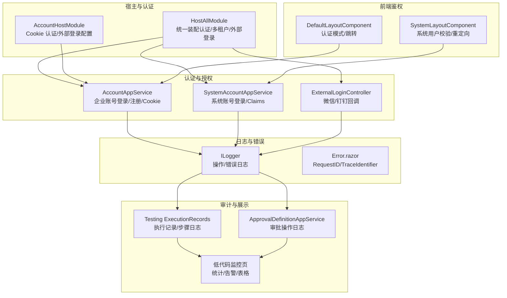
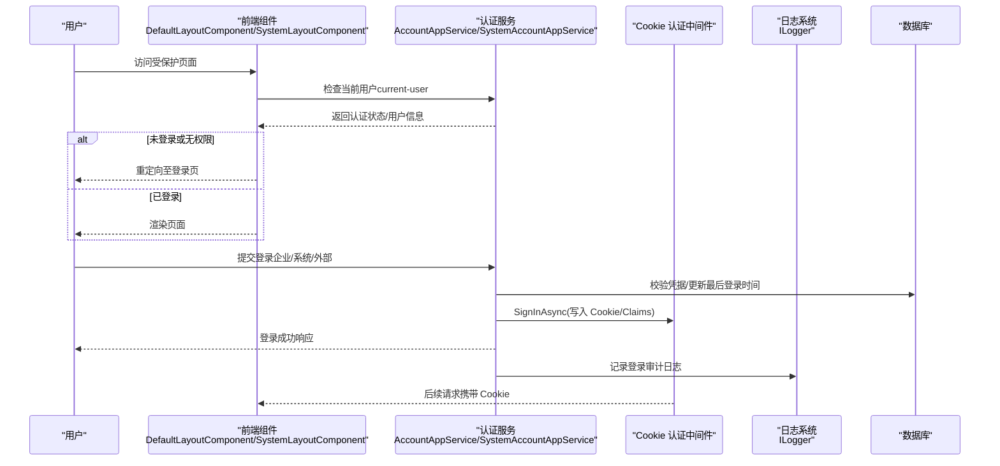
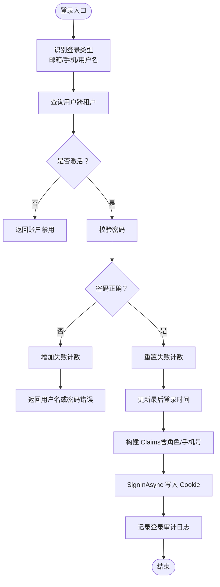
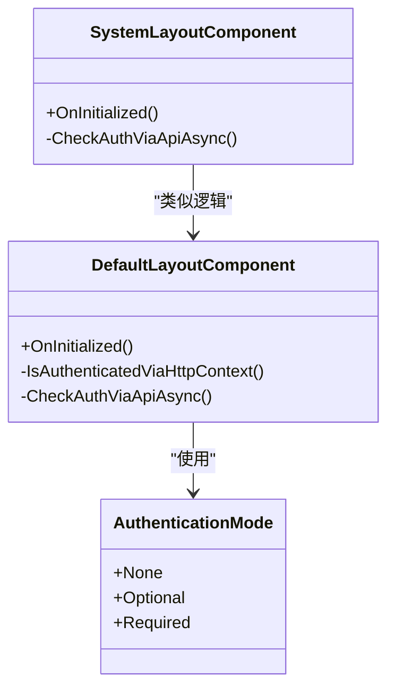
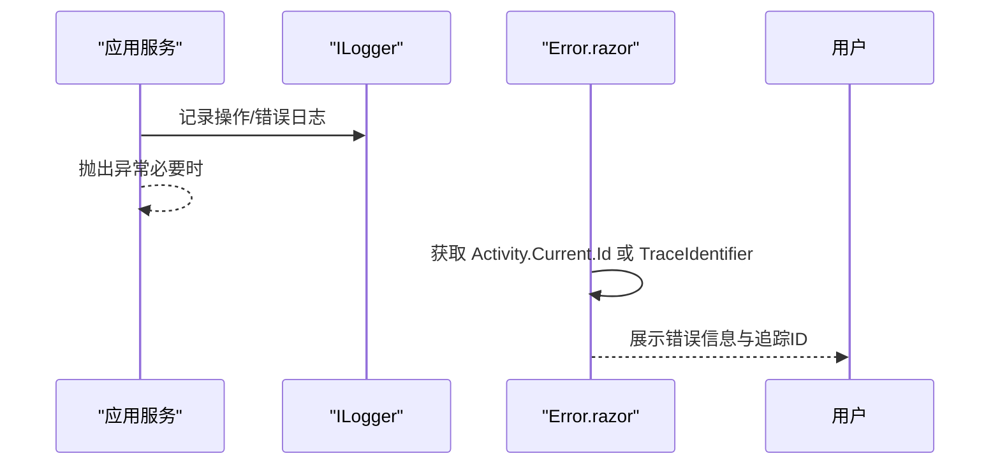
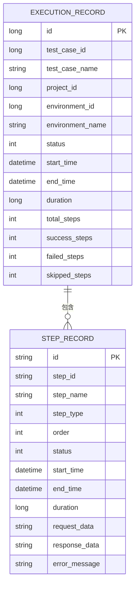
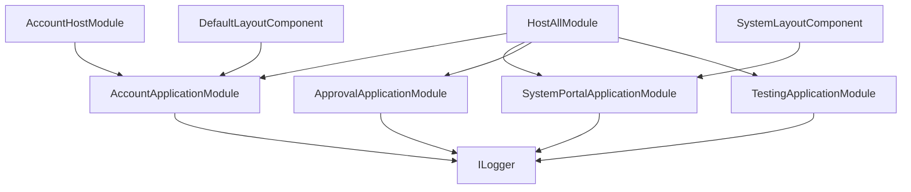

# 安全审计与监控

<cite>
**本文引用的文件**   
- [HostAllModule.cs](file://src/Host/H.AppLab.Host.All/H.AppLab.Host.All/HostAllModule.cs)
- [AccountHostModule.cs](file://src/Host/Account/H.Account.Host/AccountHostModule.cs)
- [SystemAccountAppService.cs](file://src/System/SystemPortal/H.SystemPortal.Application/Services/SystemAccountAppService.cs)
- [AccountAppService.cs](file://src/Services/Account/H.Account.Application/Services/AccountAppService.cs)
- [ExternalLoginController.cs](file://src/Services/Account/H.Account.Application/ExternalLogin/ExternalLoginController.cs)
- [AuthenticationMode.cs](file://src/Components/AppDrawer/H.AppDrawer.Model/AuthenticationMode.cs)
- [DefaultLayoutComponent.razor](file://src/Components/AppDrawer/H.AppDrawer.Components/Components/DefaultLayoutComponent.razor)
- [SystemLayoutComponent.razor](file://src/System/SystemPortal/H.SystemPortal.Web/Components/SystemLayoutComponent.razor)
- [Error.razor（统一宿主）](file://src/Host/H.AppLab.Host.All/H.AppLab.Host.All/Components/Pages/Error.razor)
- [appsettings.json（账户宿主）](file://src/Host/Account/H.Account.Host/appsettings.json)
- [README.md（账户服务说明）](file://src/Services/Account/README.md)
- [ApprovalDefinitionAppService.cs](file://src/Services/Approval/H.Approval.Application/Services/ApprovalDefinitionAppService.cs)
- [TaskAppService.cs](file://src/Agent/Assistant/H.Assistant.Application/Services/TaskAppService.cs)
- [ExecutionRecordDto.cs](file://src/Services/Testing/H.Testing.Application.Contracts/Dtos/ExecutionRecordDto.cs)
- [execution-records.json](file://src/Services/Testing/data/catering/execution-records.json)
</cite>

## 目录
1. [简介](#简介)
2. [项目结构](#项目结构)
3. [核心组件](#核心组件)
4. [架构总览](#架构总览)
5. [详细组件分析](#详细组件分析)
6. [依赖关系分析](#依赖关系分析)
7. [性能考虑](#性能考虑)
8. [故障排查指南](#故障排查指南)
9. [结论](#结论)
10. [附录](#附录)

## 简介
本文件面向 AppLab 的安全审计与监控能力，围绕以下目标展开：
- 安全日志记录机制：用户登录审计、操作日志、错误日志等。
- 安全事件检测与告警：异常登录、权限滥用等威胁的实时监控。
- 审计数据存储与分析：合规性报告生成方法。
- 安全扫描工具集成：依赖漏洞扫描、代码安全分析。
- 安全监控仪表板：配置与使用指南。
- 安全事件响应流程与应急预案。

本项目采用 ASP.NET Core + Blazor + ABP 模块化架构，认证以 Cookie 为主，支持系统账号与企业账号双通道；通过模块化的 HostAllModule 统一装配认证、多租户、外部登录等能力；在应用层通过 ILogger 输出结构化日志，结合测试执行记录与低代码监控页面，形成“采集—存储—展示—告警—处置”的闭环。

## 项目结构
从安全与审计视角，关键目录与职责如下：
- 宿主与认证装配：HostAllModule、AccountHostModule 负责认证中间件、Cookie Scheme、CSRF 策略、外部登录配置。
- 认证与授权：AccountAppService、SystemAccountAppService、ExternalLoginController 实现登录、令牌/Claims 写入、外部登录回调。
- 前端鉴权与导航：DefaultLayoutComponent、SystemLayoutComponent 根据认证模式进行访问控制与重定向。
- 日志与错误：各应用服务通过 ILogger 输出操作与错误日志；Error.razor 提供请求追踪 ID。
- 审计数据与展示：ApprovalDefinitionAppService 记录审批操作；Testing 模块记录执行结果；低代码监控页用于可视化。

**图表来源** 
- [HostAllModule.cs:81-133](file://src/Host/H.AppLab.Host.All/H.AppLab.Host.All/HostAllModule.cs#L81-L133)
- [AccountHostModule.cs:53-84](file://src/Host/Account/H.Account.Host/AccountHostModule.cs#L53-L84)
- [AccountAppService.cs:114-200](file://src/Services/Account/H.Account.Application/Services/AccountAppService.cs#L114-L200)
- [SystemAccountAppService.cs:24-104](file://src/System/SystemPortal/H.SystemPortal.Application/Services/SystemAccountAppService.cs#L24-L104)
- [ExternalLoginController.cs:1-41](file://src/Services/Account/H.Account.Application/ExternalLogin/ExternalLoginController.cs#L1-L41)
- [DefaultLayoutComponent.razor:106-126](file://src/Components/AppDrawer/H.AppDrawer.Components/Components/DefaultLayoutComponent.razor#L106-L126)
- [SystemLayoutComponent.razor:139-176](file://src/System/SystemPortal/H.SystemPortal.Web/Components/SystemLayoutComponent.razor#L139-L176)
- [Error.razor（统一宿主）:27-36](file://src/Host/H.AppLab.Host.All/H.AppLab.Host.All/Components/Pages/Error.razor#L27-L36)

**章节来源**
- [HostAllModule.cs:81-133](file://src/Host/H.AppLab.Host.All/H.AppLab.Host.All/HostAllModule.cs#L81-L133)
- [AccountHostModule.cs:53-84](file://src/Host/Account/H.Account.Host/AccountHostModule.cs#L53-L84)

## 核心组件
- 认证与授权
  - Cookie 认证与多 Scheme：默认企业账号 Cookie 与 SystemCookies 双通道，分别配置登录路径、过期时间、滑动过期。
  - 登录流程：企业账号通过 AccountAppService 完成密码校验、失败计数重置、最后登录时间更新、Claims 构建与 SignInAsync。
  - 系统账号通过 SystemAccountAppService 完成凭据校验、角色 Claims 注入与 Cookie 签发。
  - 外部登录：ExternalLoginController 处理微信/钉钉授权跳转与回调，写入临时 State Cookie 并回写认证 Cookie。
- 前端鉴权
  - DefaultLayoutComponent 支持三种认证模式（None/Optional/Required），在服务端预渲染时快速判断身份，WASM 环境通过 API 精确校验并重定向。
  - SystemLayoutComponent 针对系统用户调用 /api/app/system-account/current-user 校验，未登录自动跳转登录页。
- 日志与错误
  - 各服务通过 ILogger 输出结构化日志（如审批定义启用/禁用、任务执行成功/失败）。
  - Error.razor 显示 RequestId/TraceIdentifier，便于跨链路追踪。
- 审计与展示
  - ApprovalDefinitionAppService 对关键操作记录日志。
  - Testing 模块记录执行结果与步骤日志，包含请求/响应摘要与错误信息。
  - 低代码监控页提供统计卡片、告警提示与表格展示，可作为安全指标看板的基础。

**章节来源**
- [AccountAppService.cs:114-200](file://src/Services/Account/H.Account.Application/Services/AccountAppService.cs#L114-L200)
- [SystemAccountAppService.cs:24-104](file://src/System/SystemPortal/H.SystemPortal.Application/Services/SystemAccountAppService.cs#L24-L104)
- [ExternalLoginController.cs:1-41](file://src/Services/Account/H.Account.Application/ExternalLogin/ExternalLoginController.cs#L1-L41)
- [AuthenticationMode.cs:1-22](file://src/Components/AppDrawer/H.AppDrawer.Model/AuthenticationMode.cs#L1-L22)
- [DefaultLayoutComponent.razor:106-126](file://src/Components/AppDrawer/H.AppDrawer.Components/Components/DefaultLayoutComponent.razor#L106-L126)
- [SystemLayoutComponent.razor:139-176](file://src/System/SystemPortal/H.SystemPortal.Web/Components/SystemLayoutComponent.razor#L139-L176)
- [ApprovalDefinitionAppService.cs:105-128](file://src/Services/Approval/H.Approval.Application/Services/ApprovalDefinitionAppService.cs#L105-L128)
- [TaskAppService.cs:232-291](file://src/Agent/Assistant/H.Assistant.Application/Services/TaskAppService.cs#L232-L291)
- [Error.razor（统一宿主）:27-36](file://src/Host/H.AppLab.Host.All/H.AppLab.Host.All/Components/Pages/Error.razor#L27-L36)

## 架构总览
下图展示了从登录到审计记录的端到端流程，以及前端鉴权与错误追踪的交互。

**图表来源** 
- [AccountAppService.cs:114-200](file://src/Services/Account/H.Account.Application/Services/AccountAppService.cs#L114-L200)
- [SystemAccountAppService.cs:24-104](file://src/System/SystemPortal/H.SystemPortal.Application/Services/SystemAccountAppService.cs#L24-L104)
- [ExternalLoginController.cs:1-41](file://src/Services/Account/H.Account.Application/ExternalLogin/ExternalLoginController.cs#L1-L41)
- [DefaultLayoutComponent.razor:106-126](file://src/Components/AppDrawer/H.AppDrawer.Components/Components/DefaultLayoutComponent.razor#L106-L126)
- [SystemLayoutComponent.razor:139-176](file://src/System/SystemPortal/H.SystemPortal.Web/Components/SystemLayoutComponent.razor#L139-L176)

## 详细组件分析

### 认证与登录审计
- 企业账号登录
  - 输入类型自动识别（邮箱/手机号/用户名），跨租户查找用户，校验激活状态与密码。
  - 失败次数处理与重置，更新最后登录时间，构建 Claims（含手机号可选），设置 Cookie 过期与滑动过期。
  - 审计点：登录成功/失败、账户禁用、密码错误、失败计数重置。
- 系统账号登录
  - 凭据校验后写入 SystemCookies，Claims 包含角色，便于系统级权限控制。
  - 审计点：登录成功/失败、角色注入。
- 外部登录
  - 生成 state 并写入临时 Cookie，构造第三方授权 URL，回调后绑定账号并写入认证 Cookie。
  - 审计点：第三方登录回调、账号绑定、新注册用户标记。

**图表来源** 
- [AccountAppService.cs:114-200](file://src/Services/Account/H.Account.Application/Services/AccountAppService.cs#L114-L200)
- [SystemAccountAppService.cs:24-104](file://src/System/SystemPortal/H.SystemPortal.Application/Services/SystemAccountAppService.cs#L24-L104)

**章节来源**
- [AccountAppService.cs:114-200](file://src/Services/Account/H.Account.Application/Services/AccountAppService.cs#L114-L200)
- [SystemAccountAppService.cs:24-104](file://src/System/SystemPortal/H.SystemPortal.Application/Services/SystemAccountAppService.cs#L24-L104)
- [ExternalLoginController.cs:1-41](file://src/Services/Account/H.Account.Application/ExternalLogin/ExternalLoginController.cs#L1-L41)

### 前端鉴权与访问控制
- 认证模式枚举（None/Optional/Required）决定页面是否强制登录。
- 服务端预渲染通过 HttpContext 快速判断身份，WASM 环境通过 current-user API 精确校验，未登录自动跳转。
- 系统布局组件调用 system-account 的 current-user 接口，区分系统用户与普通用户。

**图表来源** 
- [AuthenticationMode.cs:1-22](file://src/Components/AppDrawer/H.AppDrawer.Model/AuthenticationMode.cs#L1-L22)
- [DefaultLayoutComponent.razor:106-126](file://src/Components/AppDrawer/H.AppDrawer.Components/Components/DefaultLayoutComponent.razor#L106-L126)
- [SystemLayoutComponent.razor:139-176](file://src/System/SystemPortal/H.SystemPortal.Web/Components/SystemLayoutComponent.razor#L139-L176)

**章节来源**
- [AuthenticationMode.cs:1-22](file://src/Components/AppDrawer/H.AppDrawer.Model/AuthenticationMode.cs#L1-L22)
- [DefaultLayoutComponent.razor:106-126](file://src/Components/AppDrawer/H.AppDrawer.Components/Components/DefaultLayoutComponent.razor#L106-L126)
- [SystemLayoutComponent.razor:139-176](file://src/System/SystemPortal/H.SystemPortal.Web/Components/SystemLayoutComponent.razor#L139-L176)

### 日志与错误追踪
- 操作日志：审批定义启用/禁用、任务执行成功/失败等通过 ILogger 记录，包含关键参数与上下文。
- 错误日志：捕获异常并记录堆栈，便于定位问题。
- 错误页：Error.razor 显示 RequestId/TraceIdentifier，配合日志系统进行链路追踪。

**图表来源** 
- [ApprovalDefinitionAppService.cs:105-128](file://src/Services/Approval/H.Approval.Application/Services/ApprovalDefinitionAppService.cs#L105-L128)
- [TaskAppService.cs:232-291](file://src/Agent/Assistant/H.Assistant.Application/Services/TaskAppService.cs#L232-L291)
- [Error.razor（统一宿主）:27-36](file://src/Host/H.AppLab.Host.All/H.AppLab.Host.All/Components/Pages/Error.razor#L27-L36)

**章节来源**
- [ApprovalDefinitionAppService.cs:105-128](file://src/Services/Approval/H.Approval.Application/Services/ApprovalDefinitionAppService.cs#L105-L128)
- [TaskAppService.cs:232-291](file://src/Agent/Assistant/H.Assistant.Application/Services/TaskAppService.cs#L232-L291)
- [Error.razor（统一宿主）:27-36](file://src/Host/H.AppLab.Host.All/H.AppLab.Host.All/Components/Pages/Error.razor#L27-L36)

### 审计数据存储与分析
- 测试执行记录：ExecutionRecordDto 定义执行状态、耗时、步骤记录等；execution-records.json 保存历史执行快照，包含请求/响应摘要与错误信息。
- 审批操作日志：ApprovalDefinitionAppService 对关键操作进行日志记录，可用于审计报表。
- 低代码监控页：通过统计卡片、告警组件与表格展示，可承载安全指标（如登录失败率、敏感操作频率）。

**图表来源** 
- [ExecutionRecordDto.cs:1-50](file://src/Services/Testing/H.Testing.Application.Contracts/Dtos/ExecutionRecordDto.cs#L1-L50)
- [execution-records.json:1522-1535](file://src/Services/Testing/data/catering/execution-records.json#L1522-L1535)

**章节来源**
- [ExecutionRecordDto.cs:1-50](file://src/Services/Testing/H.Testing.Application.Contracts/Dtos/ExecutionRecordDto.cs#L1-L50)
- [execution-records.json:1522-1535](file://src/Services/Testing/data/catering/execution-records.json#L1522-L1535)

### 安全扫描工具集成（建议）
- 依赖漏洞扫描：在 CI/CD 中集成 .NET 依赖扫描（如 Microsoft Dependency Review、OWASP Dependency-Check），对 NuGet 包进行漏洞检测。
- 代码安全分析：引入静态分析工具（如 SonarQube、CodeQL），对 C# 代码进行安全规则检查（SQL 注入、XSS、硬编码密钥等）。
- 容器镜像扫描：对 Docker 镜像进行漏洞扫描（如 Trivy、Clair），确保运行环境安全。
- 集成方式：在构建阶段触发扫描，失败则阻断发布；将扫描结果导出为报告，纳入合规审计。

[本节为通用指导，不直接分析具体文件]

### 安全监控仪表板配置与使用（建议）
- 数据来源：聚合 ILogger 日志、测试执行记录、审批操作日志、认证失败计数等。
- 展示组件：统计卡片（CPU/内存/在线服务）、告警组件（超时/失败阈值）、表格（服务列表/审计事件）。
- 配置要点：
  - 指标采集：定时拉取日志索引或数据库视图，计算失败率、延迟分布。
  - 告警规则：基于阈值（如登录失败 > N 次/分钟）触发告警。
  - 权限控制：仅管理员可查看敏感指标，遵循最小权限原则。
- 使用流程：进入监控页 → 选择时间范围 → 查看指标趋势 → 点击告警查看详情 → 跳转到审计日志或错误详情。

[本节为通用指导，不直接分析具体文件]

### 安全事件响应流程与应急预案（建议）
- 事件分类：异常登录（异地/高频失败）、权限滥用（越权访问）、敏感操作（批量删除/导出）、外部攻击（注入/XSS）。
- 响应流程：
  - 检测：监控规则触发告警。
  - 确认：安全团队复核告警真实性与影响面。
  - 处置：临时封禁账号、限制 IP、下线受影响功能。
  - 复盘：收集日志与证据，定位根因，修复漏洞。
  - 报告：生成合规报告，归档审计记录。
- 预案要点：明确责任人、沟通渠道、恢复时间目标（RTO/RPO）、演练计划。

[本节为通用指导，不直接分析具体文件]

## 依赖关系分析
- 宿主模块依赖：HostAllModule 依赖多个应用模块（Account、SystemPortal、Approval、Testing 等），统一装配认证、多租户、外部登录。
- 认证中间件：AccountHostModule 与 HostAllModule 均配置 Cookie 认证与 SystemCookies，确保双通道登录。
- 前端组件依赖：DefaultLayoutComponent 与 SystemLayoutComponent 依赖认证服务接口，实现访问控制。
- 日志依赖：各服务依赖 ILogger，统一输出结构化日志。

**图表来源** 
- [HostAllModule.cs:135-156](file://src/Host/H.AppLab.Host.All/H.AppLab.Host.All/HostAllModule.cs#L135-L156)
- [AccountHostModule.cs:43-49](file://src/Host/Account/H.Account.Host/AccountHostModule.cs#L43-L49)

**章节来源**
- [HostAllModule.cs:135-156](file://src/Host/H.AppLab.Host.All/H.AppLab.Host.All/HostAllModule.cs#L135-L156)
- [AccountHostModule.cs:43-49](file://src/Host/Account/H.Account.Host/AccountHostModule.cs#L43-L49)

## 性能考虑
- 认证性能：Cookie 认证开销较低，注意滑动过期与持久化选项对会话长度的影响。
- 日志性能：在高并发场景下，建议使用异步日志与批处理写入，避免阻塞主线程。
- 数据库查询：登录与用户查询需优化索引，避免全表扫描；跨租户查询需谨慎设计。
- 前端鉴权：减少不必要的 current-user 调用，缓存认证状态，降低网络开销。

[本节为通用指导，不直接分析具体文件]

## 故障排查指南
- 登录失败：检查密码错误、账户禁用、失败计数；查看 ILogger 中的登录失败日志。
- 权限不足：确认 Claims 中角色是否正确注入；检查 SystemCookies 与企业 Cookie 的路径与域名配置。
- 外部登录异常：核对 ExternalLoginOptions 配置（ClientId/Secret/CallbackPath）；检查临时 State Cookie 是否生效。
- 错误追踪：通过 Error.razor 的 RequestId/TraceIdentifier 关联日志，定位异常堆栈。
- 审计缺失：确认各服务是否记录关键操作日志；检查日志输出级别与目标存储。

**章节来源**
- [AccountAppService.cs:114-200](file://src/Services/Account/H.Account.Application/Services/AccountAppService.cs#L114-L200)
- [SystemAccountAppService.cs:24-104](file://src/System/SystemPortal/H.SystemPortal.Application/Services/SystemAccountAppService.cs#L24-L104)
- [ExternalLoginController.cs:1-41](file://src/Services/Account/H.Account.Application/ExternalLogin/ExternalLoginController.cs#L1-L41)
- [Error.razor（统一宿主）:27-36](file://src/Host/H.AppLab.Host.All/H.AppLab.Host.All/Components/Pages/Error.razor#L27-L36)
- [appsettings.json（账户宿主）:1-32](file://src/Host/Account/H.Account.Host/appsettings.json#L1-L32)

## 结论
AppLab 的安全审计与监控体系以 Cookie 认证为核心，结合模块化宿主装配、前端鉴权、结构化日志与测试执行记录，形成了完整的“采集—存储—展示—告警—处置”闭环。通过低代码监控页与审计日志，可实现对异常登录、权限滥用等安全事件的实时监控与合规报告生成。建议进一步集成依赖漏洞扫描与代码安全分析，完善安全治理体系。

## 附录
- 认证配置参考：appsettings.json 中的 Logging/JWT/ExternalLogin 配置项。
- 账户服务说明：README.md 描述了认证与用户管理的功能边界与 API 接口。

**章节来源**
- [appsettings.json（账户宿主）:1-32](file://src/Host/Account/H.Account.Host/appsettings.json#L1-L32)
- [README.md（账户服务说明）:1-100](file://src/Services/Account/README.md#L1-L100)