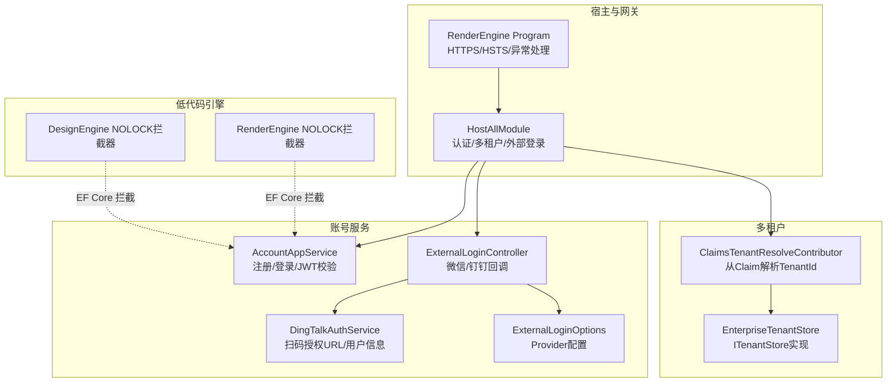
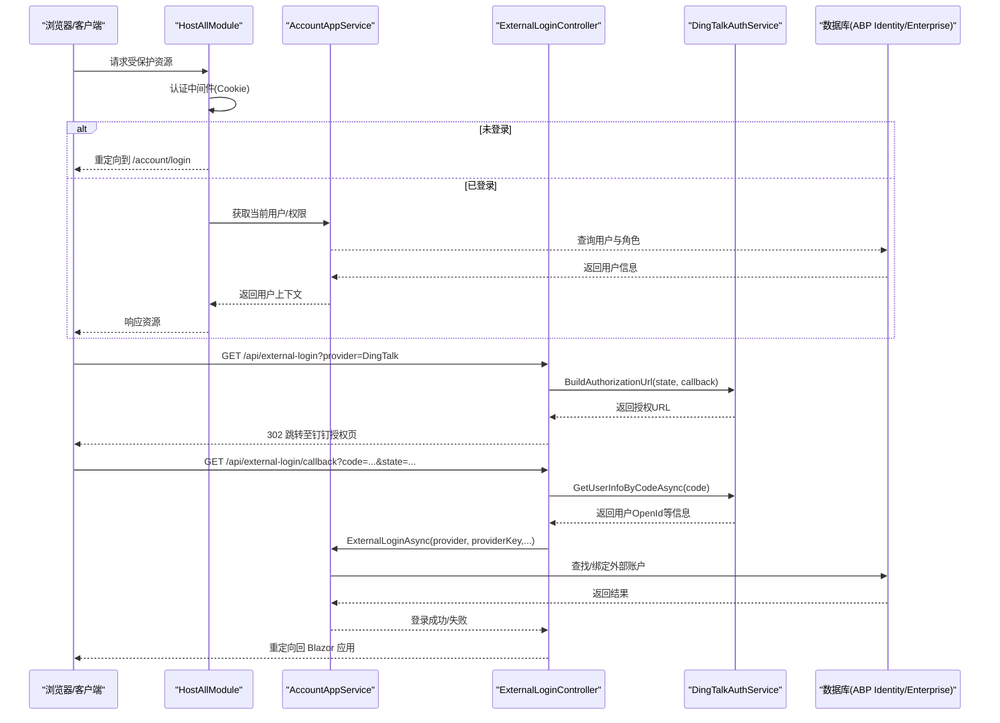
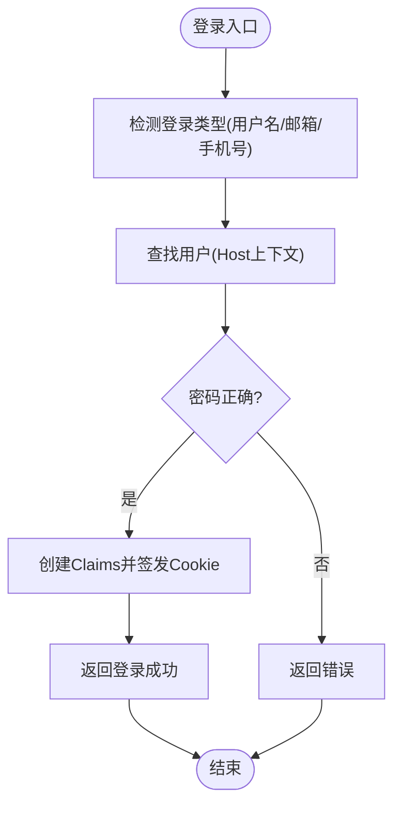
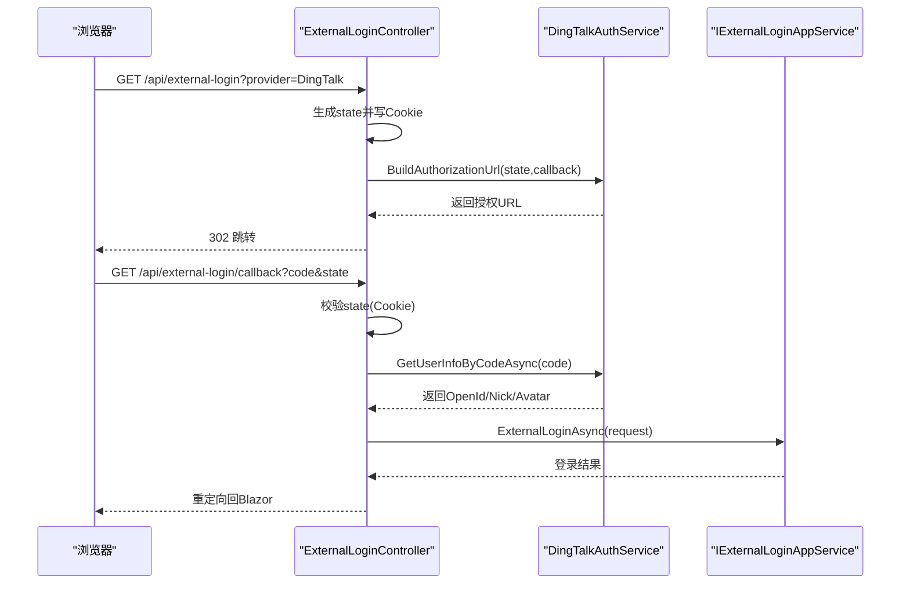
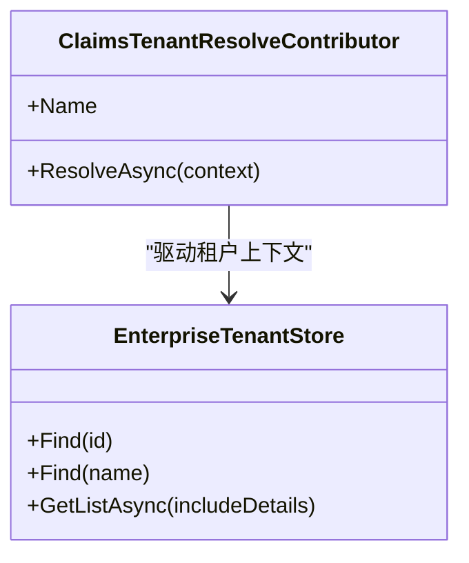
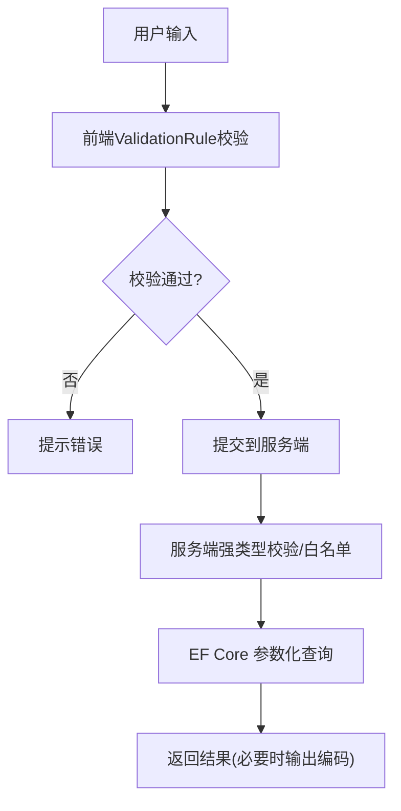
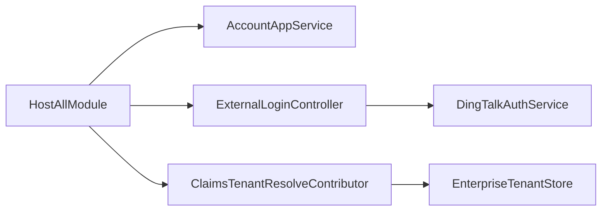

# 安全架构

<cite>
**本文引用的文件**   
- [src/Services/Account/README.md](file://src/Services/Account/README.md)
- [src/Services/Account/H.Account.Application/Services/AccountAppService.cs](file://src/Services/Account/H.Account.Application/Services/AccountAppService.cs)
- [src/Services/Account/H.Account.Application/ExternalLogin/ExternalLoginController.cs](file://src/Services/Account/H.Account.Application/ExternalLogin/ExternalLoginController.cs)
- [src/Services/Account/H.Account.Application/ExternalLogin/ExternalLoginOptions.cs](file://src/Services/Account/H.Account.Application/ExternalLogin/ExternalLoginOptions.cs)
- [src/Services/Account/H.Account.Application/ExternalLogin/DingTalkAuthService.cs](file://src/Services/Account/H.Account.Application/ExternalLogin/DingTalkAuthService.cs)
- [src/Host/H.AppLab.Host.All/H.AppLab.Host.All/HostAllModule.cs](file://src/Host/H.AppLab.Host.All/H.AppLab.Host.All/HostAllModule.cs)
- [src/Host/H.AppLab.Host.All/H.AppLab.Host.All/ClaimsTenantResolveContributor.cs](file://src/Host/H.AppLab.Host.All/H.AppLab.Host.All/ClaimsTenantResolveContributor.cs)
- [src/System/Enterprise/H.Enterprise.EntityFrameworkCore/EnterpriseTenantStore.cs](file://src/System/Enterprise/H.Enterprise.EntityFrameworkCore/EnterpriseTenantStore.cs)
- [src/Tools/H.Account.DbMigrator/Migrations/20260517144522_Init.cs](file://src/Tools/H.Account.DbMigrator/Migrations/20260517144522_Init.cs)
- [src/Host/H.AppLab.Host.All/H.AppLab.Host.All/appsettings.json](file://src/Host/H.AppLab.Host.All/H.AppLab.Host.All/appsettings.json)
- [src/Host/RenderEngine/H.LowCode.RenderEngine.Host/Program.cs](file://src/Host/RenderEngine/H.LowCode.RenderEngine.Host/Program.cs)
- [src/LowCode/DesignEngine/H.LowCode.DesignEngine.EntityFrameworkCore/EntityFrameworkCore/Extensions/QueryWithNoLockDbCommandInterceptor.cs](file://src/LowCode/DesignEngine/H.LowCode.DesignEngine.EntityFrameworkCore/EntityFrameworkCore/Extensions/QueryWithNoLockDbCommandInterceptor.cs)
- [src/LowCode/RenderEngine/H.LowCode.RenderEngine.EntityFrameworkCore/EntityFrameworkCore/Extensions/QueryWithNoLockDbCommandInterceptor.cs](file://src/LowCode/RenderEngine/H.LowCode.RenderEngine.EntityFrameworkCore/EntityFrameworkCore/Extensions/QueryWithNoLockDbCommandInterceptor.cs)
</cite>

## 目录
1. [引言](#引言)
2. [项目结构](#项目结构)
3. [核心组件](#核心组件)
4. [架构总览](#架构总览)
5. [详细组件分析](#详细组件分析)
6. [依赖关系分析](#依赖关系分析)
7. [性能与安全权衡](#性能与安全权衡)
8. [故障排查指南](#故障排查指南)
9. [结论](#结论)
10. [附录](#附录)

## 引言
本文件面向 AppLab 的安全架构，系统性阐述认证与授权、外部登录集成、多租户隔离、输入验证与防注入/XSS、网络安全配置（HTTPS/HSTS/CORS）、以及安全审计与漏洞扫描的实施要点。文档以仓库中的实际代码为依据，提供可追溯的源码路径与可视化图示，帮助读者快速理解并落地安全实践。

## 项目结构
- 宿主层：统一聚合各业务模块，集中配置认证、多租户、反伪造、路由等安全相关中间件。
- 账号服务：实现用户注册、登录、令牌校验、Cookie 会话管理，并提供外部登录控制器与第三方登录适配。
- 多租户：基于 ABP 的多租户框架，通过自定义 TenantStore 与 Claims 解析器实现企业级数据隔离。
- 低代码引擎：在 EF Core 层对 SQL 执行进行拦截（如 NOLOCK），同时提供前端输入校验规则定义能力。
- 部署与运行：包含 HTTPS 重定向、HSTS、异常处理、静态资源缓存等运行时安全策略。

**图表来源** 
- [src/Host/H.AppLab.Host.All/H.AppLab.Host.All/HostAllModule.cs:78-203](file://src/Host/H.AppLab.Host.All/H.AppLab.Host.All/HostAllModule.cs#L78-L203)
- [src/Host/RenderEngine/H.LowCode.RenderEngine.Host/Program.cs:44-79](file://src/Host/RenderEngine/H.LowCode.RenderEngine.Host/Program.cs#L44-L79)
- [src/Services/Account/H.Account.Application/Services/AccountAppService.cs:1-356](file://src/Services/Account/H.Account.Application/Services/AccountAppService.cs#L1-L356)
- [src/Services/Account/H.Account.Application/ExternalLogin/ExternalLoginController.cs:1-203](file://src/Services/Account/H.Account.Application/ExternalLogin/ExternalLoginController.cs#L1-L203)
- [src/Services/Account/H.Account.Application/ExternalLogin/DingTalkAuthService.cs:1-43](file://src/Services/Account/H.Account.Application/ExternalLogin/DingTalkAuthService.cs#L1-L43)
- [src/Services/Account/H.Account.Application/ExternalLogin/ExternalLoginOptions.cs:1-21](file://src/Services/Account/H.Account.Application/ExternalLogin/ExternalLoginOptions.cs#L1-L21)
- [src/Host/H.AppLab.Host.All/H.AppLab.Host.All/ClaimsTenantResolveContributor.cs:1-31](file://src/Host/H.AppLab.Host.All/H.AppLab.Host.All/ClaimsTenantResolveContributor.cs#L1-L31)
- [src/System/Enterprise/H.Enterprise.EntityFrameworkCore/EnterpriseTenantStore.cs:1-87](file://src/System/Enterprise/H.Enterprise.EntityFrameworkCore/EnterpriseTenantStore.cs#L1-L87)
- [src/LowCode/DesignEngine/H.LowCode.DesignEngine.EntityFrameworkCore/EntityFrameworkCore/Extensions/QueryWithNoLockDbCommandInterceptor.cs:1-36](file://src/LowCode/DesignEngine/H.LowCode.DesignEngine.EntityFrameworkCore/EntityFrameworkCore/Extensions/QueryWithNoLockDbCommandInterceptor.cs#L1-L36)
- [src/LowCode/RenderEngine/H.LowCode.RenderEngine.EntityFrameworkCore/EntityFrameworkCore/Extensions/QueryWithNoLockDbCommandInterceptor.cs:1-36](file://src/LowCode/RenderEngine/H.LowCode.RenderEngine.EntityFrameworkCore/EntityFrameworkCore/Extensions/QueryWithNoLockDbCommandInterceptor.cs#L1-L36)

**章节来源**
- [src/Host/H.AppLab.Host.All/H.AppLab.Host.All/HostAllModule.cs:78-203](file://src/Host/H.AppLab.Host.All/H.AppLab.Host.All/HostAllModule.cs#L78-L203)
- [src/Host/RenderEngine/H.LowCode.RenderEngine.Host/Program.cs:44-79](file://src/Host/RenderEngine/H.LowCode.RenderEngine.Host/Program.cs#L44-L79)

## 核心组件
- 认证与会话
  - Cookie 认证：统一使用 CookieAuthenticationDefaults.AuthenticationScheme，支持滑动过期与持久化登录。
  - JWT 令牌：提供生成与校验逻辑，用于跨系统调用或客户端鉴权场景。
  - 注销：清除 Cookie 会话。
- 外部登录集成
  - 微信、钉钉 OAuth2 流程：构建授权 URL、回调处理、state 校验、换取用户信息、绑定本地账户。
  - 配置项：ExternalLoginOptions 支持按 Provider 启用/禁用与凭据配置。
- 多租户隔离
  - Claims 解析：从认证 Cookie 的 TenantId Claim 解析当前租户。
  - ITenantStore：从 Enterprise 数据库读取租户配置，支持独立库模式连接字符串覆盖。
- 输入验证与 SQL 防护
  - 前端：设计器提供多种 ValidationRule 类型（必填、长度、数值范围、正则、邮箱、手机、URL、自定义）。
  - 后端：EF Core 命令拦截器（NOLOCK）提升读性能；建议配合参数化查询与严格输入校验防止注入。
- 网络安全
  - HTTPS 重定向、HSTS、异常处理页面、静态资源缓存控制。
  - 反伪造：WASM 场景关闭自动验证，依赖 SameSite Cookie 保护 CSRF。

**章节来源**
- [src/Services/Account/README.md:17-64](file://src/Services/Account/README.md#L17-L64)
- [src/Services/Account/H.Account.Application/Services/AccountAppService.cs:114-210](file://src/Services/Account/H.Account.Application/Services/AccountAppService.cs#L114-L210)
- [src/Services/Account/H.Account.Application/Services/AccountAppService.cs:222-247](file://src/Services/Account/H.Account.Application/Services/AccountAppService.cs#L222-L247)
- [src/Services/Account/H.Account.Application/ExternalLogin/ExternalLoginController.cs:14-203](file://src/Services/Account/H.Account.Application/ExternalLogin/ExternalLoginController.cs#L14-L203)
- [src/Services/Account/H.Account.Application/ExternalLogin/ExternalLoginOptions.cs:1-21](file://src/Services/Account/H.Account.Application/ExternalLogin/ExternalLoginOptions.cs#L1-L21)
- [src/Host/H.AppLab.Host.All/H.AppLab.Host.All/HostAllModule.cs:115-133](file://src/Host/H.AppLab.Host.All/H.AppLab.Host.All/HostAllModule.cs#L115-L133)
- [src/Host/H.AppLab.Host.All/H.AppLab.Host.All/HostAllModule.cs:171-201](file://src/Host/H.AppLab.Host.All/H.AppLab.Host.All/HostAllModule.cs#L171-L201)
- [src/Host/H.AppLab.Host.All/H.AppLab.Host.All/ClaimsTenantResolveContributor.cs:1-31](file://src/Host/H.AppLab.Host.All/H.AppLab.Host.All/ClaimsTenantResolveContributor.cs#L1-L31)
- [src/System/Enterprise/H.Enterprise.EntityFrameworkCore/EnterpriseTenantStore.cs:1-87](file://src/System/Enterprise/H.Enterprise.EntityFrameworkCore/EnterpriseTenantStore.cs#L1-L87)
- [src/LowCode/DesignEngine/H.LowCode.DesignEngine.EntityFrameworkCore/EntityFrameworkCore/Extensions/QueryWithNoLockDbCommandInterceptor.cs:1-36](file://src/LowCode/DesignEngine/H.LowCode.DesignEngine.EntityFrameworkCore/EntityFrameworkCore/Extensions/QueryWithNoLockDbCommandInterceptor.cs#L1-L36)
- [src/LowCode/RenderEngine/H.LowCode.RenderEngine.EntityFrameworkCore/EntityFrameworkCore/Extensions/QueryWithNoLockDbCommandInterceptor.cs:1-36](file://src/LowCode/RenderEngine/H.LowCode.RenderEngine.EntityFrameworkCore/EntityFrameworkCore/Extensions/QueryWithNoLockDbCommandInterceptor.cs#L1-L36)
- [src/Host/RenderEngine/H.LowCode.RenderEngine.Host/Program.cs:44-79](file://src/Host/RenderEngine/H.LowCode.RenderEngine.Host/Program.cs#L44-L79)

## 架构总览
下图展示认证、外部登录、多租户与数据库访问的关键交互。

**图表来源** 
- [src/Host/H.AppLab.Host.All/H.AppLab.Host.All/HostAllModule.cs:115-133](file://src/Host/H.AppLab.Host.All/H.AppLab.Host.All/HostAllModule.cs#L115-L133)
- [src/Services/Account/H.Account.Application/Services/AccountAppService.cs:114-210](file://src/Services/Account/H.Account.Application/Services/AccountAppService.cs#L114-L210)
- [src/Services/Account/H.Account.Application/ExternalLogin/ExternalLoginController.cs:14-203](file://src/Services/Account/H.Account.Application/ExternalLogin/ExternalLoginController.cs#L14-L203)
- [src/Services/Account/H.Account.Application/ExternalLogin/DingTalkAuthService.cs:1-43](file://src/Services/Account/H.Account.Application/ExternalLogin/DingTalkAuthService.cs#L1-L43)

## 详细组件分析

### 认证与授权（JWT + Cookie）
- Cookie 认证
  - 统一 Scheme：默认 CookieAuthenticationDefaults.AuthenticationScheme，支持滑动过期与持久化登录。
  - 登录流程：校验密码成功后写入 Claims 并签发 Cookie。
  - 注销：调用 SignOutAsync 清除 Cookie。
- JWT 令牌
  - 生成：根据用户 Claims 构造 Token，设置 Issuer/Audience/Expiration，使用对称密钥签名。
  - 校验：ValidateToken 严格校验签名、发行者、受众、有效期，ClockSkew 设为零。
- 授权策略
  - 基于 ABP Identity 的用户/角色模型，结合 Claims 与策略注解实现接口级权限控制。
  - 账号 README 中定义了 Admin/SuperAdmin 策略思路。

**图表来源** 
- [src/Services/Account/H.Account.Application/Services/AccountAppService.cs:114-210](file://src/Services/Account/H.Account.Application/Services/AccountAppService.cs#L114-L210)
- [src/Services/Account/H.Account.Application/Services/AccountAppService.cs:222-247](file://src/Services/Account/H.Account.Application/Services/AccountAppService.cs#L222-L247)

**章节来源**
- [src/Services/Account/README.md:17-64](file://src/Services/Account/README.md#L17-L64)
- [src/Services/Account/H.Account.Application/Services/AccountAppService.cs:114-210](file://src/Services/Account/H.Account.Application/Services/AccountAppService.cs#L114-L210)
- [src/Services/Account/H.Account.Application/Services/AccountAppService.cs:222-247](file://src/Services/Account/H.Account.Application/Services/AccountAppService.cs#L222-L247)

### 外部登录集成（微信、钉钉）
- 控制器
  - 发起授权：生成 state 并写入临时 Cookie，根据 provider 构建授权 URL 并 302 跳转。
  - 回调处理：校验 state、换取用户信息、调用应用服务完成登录或绑定。
- 钉钉适配
  - 构建新版扫码授权 URL（login.dingtalk.com），支持 scope 与 prompt 参数。
  - 通过 code 换取用户 OpenId 与昵称、头像等。
- 配置
  - ExternalLoginOptions 提供 WeChat/DingTalk 的 Enabled、ClientId、ClientSecret、CallbackPath。

**图表来源** 
- [src/Services/Account/H.Account.Application/ExternalLogin/ExternalLoginController.cs:14-203](file://src/Services/Account/H.Account.Application/ExternalLogin/ExternalLoginController.cs#L14-L203)
- [src/Services/Account/H.Account.Application/ExternalLogin/DingTalkAuthService.cs:1-43](file://src/Services/Account/H.Account.Application/ExternalLogin/DingTalkAuthService.cs#L1-L43)
- [src/Services/Account/H.Account.Application/ExternalLogin/ExternalLoginOptions.cs:1-21](file://src/Services/Account/H.Account.Application/ExternalLogin/ExternalLoginOptions.cs#L1-L21)

**章节来源**
- [src/Services/Account/H.Account.Application/ExternalLogin/ExternalLoginController.cs:1-203](file://src/Services/Account/H.Account.Application/ExternalLogin/ExternalLoginController.cs#L1-L203)
- [src/Services/Account/H.Account.Application/ExternalLogin/DingTalkAuthService.cs:1-43](file://src/Services/Account/H.Account.Application/ExternalLogin/DingTalkAuthService.cs#L1-L43)
- [src/Services/Account/H.Account.Application/ExternalLogin/ExternalLoginOptions.cs:1-21](file://src/Services/Account/H.Account.Application/ExternalLogin/ExternalLoginOptions.cs#L1-L21)

### 多租户安全隔离
- 解析器
  - ClaimsTenantResolveContributor：从认证 Cookie 的 TenantId Claim 解析当前租户，优先于内置解析器。
- 存储
  - EnterpriseTenantStore：从 Enterprise 数据库读取租户配置，支持独立库模式覆盖连接字符串。
- 错误处理
  - 当租户无效时清理 __tenant Cookie 并重定向首页，避免阻断所有请求。

**图表来源** 
- [src/Host/H.AppLab.Host.All/H.AppLab.Host.All/ClaimsTenantResolveContributor.cs:1-31](file://src/Host/H.AppLab.Host.All/H.AppLab.Host.All/ClaimsTenantResolveContributor.cs#L1-L31)
- [src/System/Enterprise/H.Enterprise.EntityFrameworkCore/EnterpriseTenantStore.cs:1-87](file://src/System/Enterprise/H.Enterprise.EntityFrameworkCore/EnterpriseTenantStore.cs#L1-L87)

**章节来源**
- [src/Host/H.AppLab.Host.All/H.AppLab.Host.All/HostAllModule.cs:171-201](file://src/Host/H.AppLab.Host.All/H.AppLab.Host.All/HostAllModule.cs#L171-L201)
- [src/Host/H.AppLab.Host.All/H.AppLab.Host.All/ClaimsTenantResolveContributor.cs:1-31](file://src/Host/H.AppLab.Host.All/H.AppLab.Host.All/ClaimsTenantResolveContributor.cs#L1-L31)
- [src/System/Enterprise/H.Enterprise.EntityFrameworkCore/EnterpriseTenantStore.cs:1-87](file://src/System/Enterprise/H.Enterprise.EntityFrameworkCore/EnterpriseTenantStore.cs#L1-L87)

### 输入验证与防注入/XSS
- 前端验证
  - 设计器提供 ValidationRule 类型：Required、MinLength、MaxLength、MinValue、MaxValue、Pattern、Email、Phone、Url、Custom。
  - 错误消息可配置，触发时机支持“输入时”等。
- 后端防护
  - EF Core 命令拦截器：为读操作追加 WITH (NOLOCK)，提高并发读性能。
  - 建议：始终使用参数化查询、服务端强类型校验、输出编码与 CSP 策略防范 XSS。

**图表来源** 
- [src/LowCode/DesignEngine/H.LowCode.DesignEngine.EntityFrameworkCore/EntityFrameworkCore/Extensions/QueryWithNoLockDbCommandInterceptor.cs:1-36](file://src/LowCode/DesignEngine/H.LowCode.DesignEngine.EntityFrameworkCore/EntityFrameworkCore/Extensions/QueryWithNoLockDbCommandInterceptor.cs#L1-L36)
- [src/LowCode/RenderEngine/H.LowCode.RenderEngine.EntityFrameworkCore/EntityFrameworkCore/Extensions/QueryWithNoLockDbCommandInterceptor.cs:1-36](file://src/LowCode/RenderEngine/H.LowCode.RenderEngine.EntityFrameworkCore/EntityFrameworkCore/Extensions/QueryWithNoLockDbCommandInterceptor.cs#L1-L36)

**章节来源**
- [src/LowCode/DesignEngine/H.LowCode.DesignEngine.EntityFrameworkCore/EntityFrameworkCore/Extensions/QueryWithNoLockDbCommandInterceptor.cs:1-36](file://src/LowCode/DesignEngine/H.LowCode.DesignEngine.EntityFrameworkCore/EntityFrameworkCore/Extensions/QueryWithNoLockDbCommandInterceptor.cs#L1-L36)
- [src/LowCode/RenderEngine/H.LowCode.RenderEngine.EntityFrameworkCore/EntityFrameworkCore/Extensions/QueryWithNoLockDbCommandInterceptor.cs:1-36](file://src/LowCode/RenderEngine/H.LowCode.RenderEngine.EntityFrameworkCore/EntityFrameworkCore/Extensions/QueryWithNoLockDbCommandInterceptor.cs#L1-L36)

### 网络安全配置（HTTPS/HSTS/CORS）
- 管道顺序
  - UseExceptionHandler、UseHsts、UseHttpsRedirection、UseStaticFiles、UseRouting、UseAuthentication、UseAuthorization、UseAntiforgery。
- 静态资源
  - 设置 Cache-Control 头，平衡缓存与更新。
- CORS
  - 建议在反向代理或网关层限制允许的源、方法与头部，避免在服务端过度放宽。

**章节来源**
- [src/Host/RenderEngine/H.LowCode.RenderEngine.Host/Program.cs:44-79](file://src/Host/RenderEngine/H.LowCode.RenderEngine.Host/Program.cs#L44-L79)

## 依赖关系分析
- 宿主模块依赖多个应用模块，集中注册认证、多租户、外部登录与 MVC 控制器。
- 账号服务依赖 ABP Identity、Configuration、HttpContextAccessor、CurrentTenant。
- 外部登录控制器依赖 IExternalLoginAppService 与各 Provider 适配器（微信/钉钉）。
- 多租户依赖 ABP MultiTenancy 与自定义 EnterpriseTenantStore。

**图表来源** 
- [src/Host/H.AppLab.Host.All/H.AppLab.Host.All/HostAllModule.cs:78-203](file://src/Host/H.AppLab.Host.All/H.AppLab.Host.All/HostAllModule.cs#L78-L203)
- [src/Services/Account/H.Account.Application/Services/AccountAppService.cs:1-356](file://src/Services/Account/H.Account.Application/Services/AccountAppService.cs#L1-L356)
- [src/Services/Account/H.Account.Application/ExternalLogin/ExternalLoginController.cs:1-203](file://src/Services/Account/H.Account.Application/ExternalLogin/ExternalLoginController.cs#L1-L203)
- [src/Services/Account/H.Account.Application/ExternalLogin/DingTalkAuthService.cs:1-43](file://src/Services/Account/H.Account.Application/ExternalLogin/DingTalkAuthService.cs#L1-L43)
- [src/Host/H.AppLab.Host.All/H.AppLab.Host.All/ClaimsTenantResolveContributor.cs:1-31](file://src/Host/H.AppLab.Host.All/H.AppLab.Host.All/ClaimsTenantResolveContributor.cs#L1-L31)
- [src/System/Enterprise/H.Enterprise.EntityFrameworkCore/EnterpriseTenantStore.cs:1-87](file://src/System/Enterprise/H.Enterprise.EntityFrameworkCore/EnterpriseTenantStore.cs#L1-L87)

**章节来源**
- [src/Host/H.AppLab.Host.All/H.AppLab.Host.All/HostAllModule.cs:78-203](file://src/Host/H.AppLab.Host.All/H.AppLab.Host.All/HostAllModule.cs#L78-L203)

## 性能与安全权衡
- NOLOCK 读优化
  - 通过 EF Core 拦截器为读语句追加 WITH (NOLOCK)，减少锁竞争，提升吞吐。
  - 注意：可能读到脏数据，仅适用于允许最终一致性的报表/列表场景。
- Cookie 与 JWT
  - Cookie 适合浏览器内会话，滑动过期提升体验；JWT 适合无状态调用，需妥善管理密钥与过期时间。
- 反伪造
  - WASM 场景关闭自动验证，依赖 SameSite Cookie 与 HTTPS 保障 CSRF 安全。

**章节来源**
- [src/LowCode/DesignEngine/H.LowCode.DesignEngine.EntityFrameworkCore/EntityFrameworkCore/Extensions/QueryWithNoLockDbCommandInterceptor.cs:1-36](file://src/LowCode/DesignEngine/H.LowCode.DesignEngine.EntityFrameworkCore/EntityFrameworkCore/Extensions/QueryWithNoLockDbCommandInterceptor.cs#L1-L36)
- [src/LowCode/RenderEngine/H.LowCode.RenderEngine.EntityFrameworkCore/EntityFrameworkCore/Extensions/QueryWithNoLockDbCommandInterceptor.cs:1-36](file://src/LowCode/RenderEngine/H.LowCode.RenderEngine.EntityFrameworkCore/EntityFrameworkCore/Extensions/QueryWithNoLockDbCommandInterceptor.cs#L1-L36)
- [src/Host/H.AppLab.Host.All/H.AppLab.Host.All/HostAllModule.cs:105-111](file://src/Host/H.AppLab.Host.All/H.AppLab.Host.All/HostAllModule.cs#L105-L111)

## 故障排查指南
- 登录失败
  - 检查密码校验与锁定计数；确认用户是否被禁用。
  - 查看 Cookie 是否过期或 SameSite 策略导致跨站失效。
- 外部登录回调失败
  - 校验 state Cookie 是否存在且有效；检查 Provider 回调地址与配置。
  - 核对 code 换取用户信息的网络连通性与签名。
- 多租户问题
  - 检查 TenantId Claim 是否正确写入；确认 EnterpriseTenantStore 能查到激活状态的租户。
  - 若 __tenant Cookie 指向已删除租户，将触发清理并重定向。
- 数据库访问异常
  - 关注 NOLOCK 带来的不可重复读现象；必要时调整事务隔离级别或移除 NOLOCK。
- 安全日志
  - ABP 安全日志表 AbpSecurityLogs 记录身份、动作、IP 等，便于审计与回溯。

**章节来源**
- [src/Services/Account/H.Account.Application/Services/AccountAppService.cs:114-210](file://src/Services/Account/H.Account.Application/Services/AccountAppService.cs#L114-L210)
- [src/Services/Account/H.Account.Application/ExternalLogin/ExternalLoginController.cs:14-203](file://src/Services/Account/H.Account.Application/ExternalLogin/ExternalLoginController.cs#L14-L203)
- [src/Host/H.AppLab.Host.All/H.AppLab.Host.All/HostAllModule.cs:171-201](file://src/Host/H.AppLab.Host.All/H.AppLab.Host.All/HostAllModule.cs#L171-L201)
- [src/Tools/H.Account.DbMigrator/Migrations/20260517144522_Init.cs:90-110](file://src/Tools/H.Account.DbMigrator/Migrations/20260517144522_Init.cs#L90-L110)

## 结论
AppLab 的安全架构围绕 Cookie/JWT 认证、外部登录集成、多租户隔离、输入验证与数据库防护、以及 HTTPS/HSTS 等关键维度展开。通过宿主层集中配置与模块化扩展，既保证了安全性，也兼顾了可扩展性与性能。建议在生产环境持续完善 CORS、CSP、密钥管理与安全审计策略，并结合漏洞扫描与渗透测试形成闭环。

## 附录
- 配置参考
  - appsettings.json 中 ConnectionStrings 与 AllowedHosts 等基础配置。
- 安全审计与漏洞扫描实施指南（通用建议）
  - 开启 ABP 安全日志与结构化日志（Serilog），集中收集到日志平台。
  - 定期执行依赖包漏洞扫描（如 NuGet Audit、Snyk、Dependabot）。
  - 引入 SAST/DAST（如 SonarQube、OWASP ZAP）进行代码与运行时扫描。
  - 建立变更审批与基线对比机制，确保最小权限与最小暴露面。

**章节来源**
- [src/Host/H.AppLab.Host.All/H.AppLab.Host.All/appsettings.json:1-18](file://src/Host/H.AppLab.Host.All/H.AppLab.Host.All/appsettings.json#L1-L18)