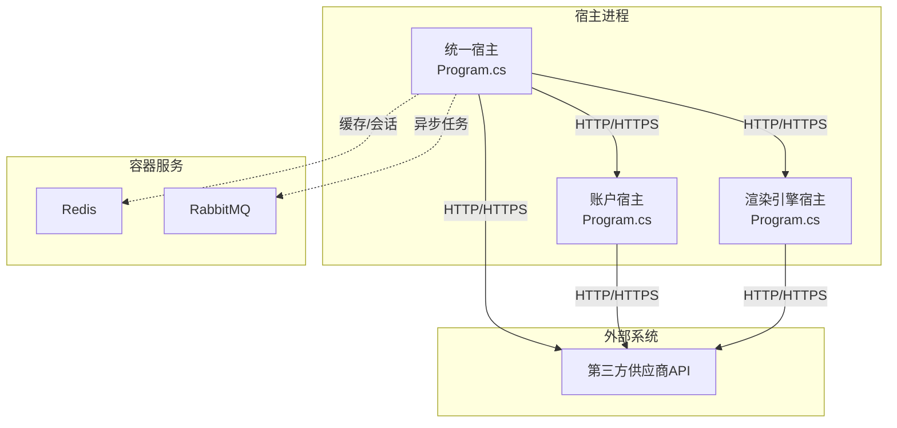
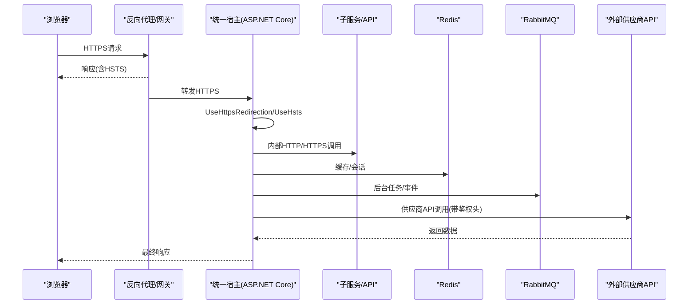
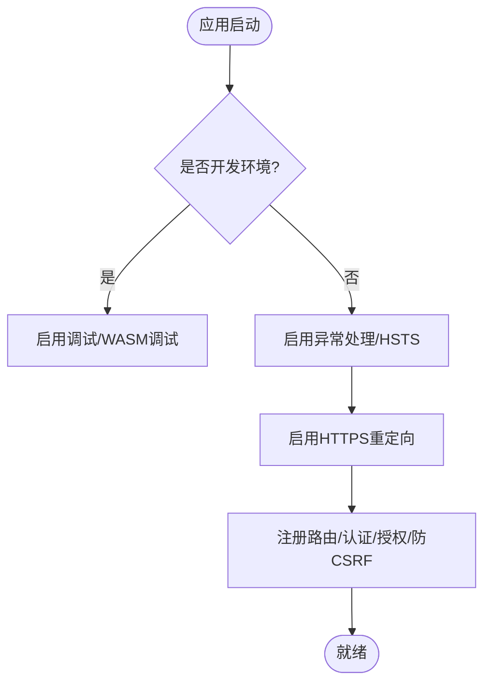
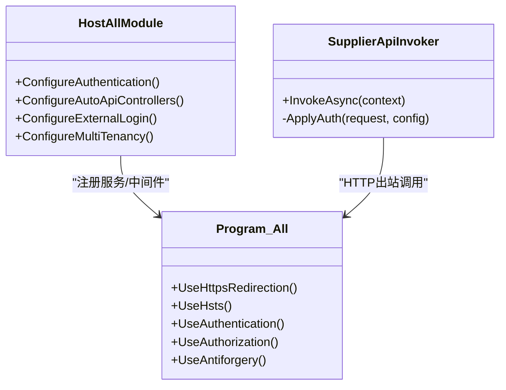
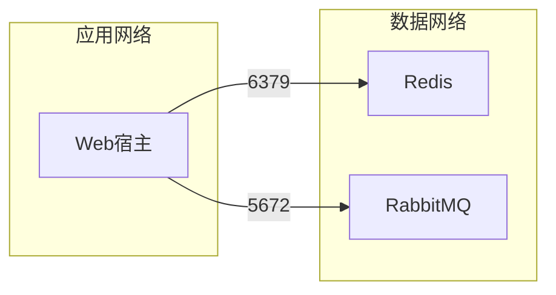
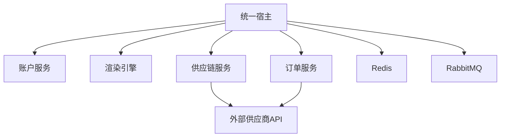

# 网络安全配置

<cite>
**本文档引用的文件**   
- [docker-compose.yml](file://cd/docker-compose.yml)
- [Program.cs（统一宿主）](file://src/Host/H.AppLab.Host.All/H.AppLab.Host.All/Program.cs)
- [appsettings.json（统一宿主）](file://src/Host/H.AppLab.Host.All/H.AppLab.Host.All/appsettings.json)
- [HostAllModule.cs（统一宿主模块）](file://src/Host/H.AppLab.Host.All/H.AppLab.Host.All/HostAllModule.cs)
- [Program.cs（账户宿主）](file://src/Host/Account/H.Account.Host/Program.cs)
- [appsettings.json（账户宿主）](file://src/Host/Account/H.Account.Host/appsettings.json)
- [Program.cs（渲染引擎宿主）](file://src/Host/RenderEngine/H.LowCode.RenderEngine.Host/Program.cs)
- [SupplierApiInvokers.cs（HTTP供应商调用）](file://src/Services/SupplyChain/H.SupplyChain.Application/Services/SupplierApiInvokers.cs)
- [SupplierClients.cs（订单供应商客户端）](file://src/Services/Order/H.Order.Application/Services/SupplierClients.cs)
</cite>

## 目录
1. [简介](#简介)
2. [项目结构](#项目结构)
3. [核心组件](#核心组件)
4. [架构总览](#架构总览)
5. [详细组件分析](#详细组件分析)
6. [依赖关系分析](#依赖关系分析)
7. [性能与安全注意事项](#性能与安全注意事项)
8. [故障排查指南](#故障排查指南)
9. [结论](#结论)
10. [附录](#附录)

## 简介
本文件面向AppLab的网络安全配置，覆盖HTTPS与SSL证书管理、CORS跨域策略、API安全（频率限制、IP白名单、请求体大小）、Docker容器网络隔离、生产最佳实践与监控告警，以及常见攻击防护与排障。文档基于仓库中宿主程序、配置与容器编排文件的实际实现进行说明，并提供可操作的落地建议。

## 项目结构
- 多宿主应用：统一宿主（H.AppLab.Host.All）、账户宿主（H.Account.Host）、渲染引擎宿主（H.LowCode.RenderEngine.Host）。
- 容器编排：Redis与RabbitMQ通过docker-compose启动，提供缓存与消息队列能力。
- 外部服务调用：供应链与订单模块包含HTTP供应商调用器，支持多种认证方式。

**图表来源** 
- [Program.cs（统一宿主）:1-115](file://src/Host/H.AppLab.Host.All/H.AppLab.Host.All/Program.cs#L1-L115)
- [Program.cs（账户宿主）:1-49](file://src/Host/Account/H.Account.Host/Program.cs#L1-L49)
- [Program.cs（渲染引擎宿主）:1-80](file://src/Host/RenderEngine/H.LowCode.RenderEngine.Host/Program.cs#L1-L80)
- [docker-compose.yml:1-32](file://cd/docker-compose.yml#L1-L32)

**章节来源**
- [Program.cs（统一宿主）:1-115](file://src/Host/H.AppLab.Host.All/H.AppLab.Host.All/Program.cs#L1-L115)
- [Program.cs（账户宿主）:1-49](file://src/Host/Account/H.Account.Host/Program.cs#L1-L49)
- [Program.cs（渲染引擎宿主）:1-80](file://src/Host/RenderEngine/H.LowCode.RenderEngine.Host/Program.cs#L1-L80)
- [docker-compose.yml:1-32](file://cd/docker-compose.yml#L1-L32)

## 核心组件
- HTTPS与TLS：各宿主均启用UseHttpsRedirection与UseHsts（非开发环境），确保强制HTTPS与HSTS头。
- 认证与会话：统一宿主使用Cookie认证，并配置双Scheme（用户与系统），过期时间与滑动过期已设置；账户宿主提供JWT相关配置项。
- 反CSRF：统一宿主关闭自动验证（WASM场景由SameSite Cookie保护），同时启用Antiforgery中间件。
- 压缩与静态资源：启用Brotli/Gzip压缩，MapStaticAssets处理WASM资源缓存语义。
- 外部调用安全：供应商调用器支持ApiKey/Header/Basic/Bearer等认证注入。

**章节来源**
- [Program.cs（统一宿主）:58-88](file://src/Host/H.AppLab.Host.All/H.AppLab.Host.All/Program.cs#L58-L88)
- [HostAllModule.cs（统一宿主模块）:115-133](file://src/Host/H.AppLab.Host.All/H.AppLab.Host.All/HostAllModule.cs#L115-L133)
- [appsettings.json（账户宿主）:12-17](file://src/Host/Account/H.Account.Host/appsettings.json#L12-L17)
- [SupplierApiInvokers.cs（HTTP供应商调用）:1-248](file://src/Services/SupplyChain/H.SupplyChain.Application/Services/SupplierApiInvokers.cs#L1-L248)
- [SupplierClients.cs（订单供应商客户端）:100-130](file://src/Services/Order/H.Order.Application/Services/SupplierClients.cs#L100-L130)

## 架构总览
下图展示从浏览器到后端宿主的请求链路，以及容器化基础设施与外部系统的交互。

**图表来源** 
- [Program.cs（统一宿主）:58-88](file://src/Host/H.AppLab.Host.All/H.AppLab.Host.All/Program.cs#L58-L88)
- [Program.cs（渲染引擎宿主）:42-71](file://src/Host/RenderEngine/H.LowCode.RenderEngine.Host/Program.cs#L42-L71)
- [docker-compose.yml:1-32](file://cd/docker-compose.yml#L1-L32)

## 详细组件分析

### HTTPS与SSL证书管理
- 强制HTTPS：所有宿主在非开发环境启用UseHttpsRedirection，将HTTP重定向至HTTPS。
- HSTS：非开发环境启用UseHsts，提升传输层安全性。
- 证书来源：
  - 自签名证书：适用于内网或测试环境，需将根CA加入受信任存储。
  - CA证书：生产建议使用权威CA签发的证书，并通过反向代理（如Nginx/Traefik/Azure App Service）终止TLS，后端仅接收HTTPS或内部明文（内网可信）。
- 连接字符串中的TrustServerCertificate：当前配置包含该选项，便于本地开发；生产应禁用并使用受信任CA。

**图表来源** 
- [Program.cs（统一宿主）:58-88](file://src/Host/H.AppLab.Host.All/H.AppLab.Host.All/Program.cs#L58-L88)
- [Program.cs（账户宿主）:20-31](file://src/Host/Account/H.Account.Host/Program.cs#L20-L31)
- [Program.cs（渲染引擎宿主）:42-55](file://src/Host/RenderEngine/H.LowCode.RenderEngine.Host/Program.cs#L42-L55)

**章节来源**
- [Program.cs（统一宿主）:58-88](file://src/Host/H.AppLab.Host.All/H.AppLab.Host.All/Program.cs#L58-L88)
- [Program.cs（账户宿主）:20-31](file://src/Host/Account/H.Account.Host/Program.cs#L20-L31)
- [Program.cs（渲染引擎宿主）:42-55](file://src/Host/RenderEngine/H.LowCode.RenderEngine.Host/Program.cs#L42-L55)
- [appsettings.json（统一宿主）:1-17](file://src/Host/H.AppLab.Host.All/H.AppLab.Host.All/appsettings.json#L1-L17)

### CORS跨域资源共享
- 现状：代码中未显式配置CORS中间件。前后端分离部署时，需在反向代理或应用层开启CORS，并严格限定源、方法与头部。
- 建议：
  - 在反向代理层（Nginx/网关）集中配置CORS，避免在各宿主重复配置。
  - 仅允许必要的Origin、Methods、Headers；禁止通配符*在生产环境。
  - 对敏感接口启用预检请求与最小权限原则。

[本节为概念性说明，不直接分析具体文件]

### API安全配置
- 请求频率限制：项目中引用了RateLimiting包，但未见运行时启用。建议在网关或应用层启用基于IP/用户的限流策略。
- IP白名单：可在反向代理或防火墙层实现，限制访问来源。
- 请求体大小限制：SignalR已设置MaximumReceiveMessageSize；JSON序列化策略已配置。建议在全局增加最大请求体大小限制（Kestrel/反向代理）。
- 认证与授权：统一宿主使用Cookie认证，支持双Scheme；对外部登录集成微信/钉钉；JWT配置位于账户宿主配置中。

**图表来源** 
- [HostAllModule.cs（统一宿主模块）:115-133](file://src/Host/H.AppLab.Host.All/H.AppLab.Host.All/HostAllModule.cs#L115-L133)
- [Program.cs（统一宿主）:68-88](file://src/Host/H.AppLab.Host.All/H.AppLab.Host.All/Program.cs#L68-L88)
- [SupplierApiInvokers.cs（HTTP供应商调用）:1-248](file://src/Services/SupplyChain/H.SupplyChain.Application/Services/SupplierApiInvokers.cs#L1-L248)

**章节来源**
- [Program.cs（统一宿主）:15-25](file://src/Host/H.AppLab.Host.All/H.AppLab.Host.All/Program.cs#L15-L25)
- [HostAllModule.cs（统一宿主模块）:115-133](file://src/Host/H.AppLab.Host.All/H.AppLab.Host.All/HostAllModule.cs#L115-L133)
- [SupplierApiInvokers.cs（HTTP供应商调用）:1-248](file://src/Services/SupplyChain/H.SupplyChain.Application/Services/SupplierApiInvokers.cs#L1-L248)
- [SupplierClients.cs（订单供应商客户端）:100-130](file://src/Services/Order/H.Order.Application/Services/SupplierClients.cs#L100-L130)

### Docker容器网络的安全配置与隔离
- Redis：通过环境变量与命令设置密码，端口映射到宿主机。建议：
  - 仅暴露必要端口，必要时绑定127.0.0.1或使用内部网络。
  - 使用独立Docker网络隔离业务容器与数据库容器。
- RabbitMQ：默认账号密码与Management端口暴露。建议：
  - 修改默认凭据，限制Management端口访问。
  - 使用内部网络与只读卷持久化数据。
- 网络隔离：将Web宿主、Redis、RabbitMQ置于不同网络段，仅开放必要通信路径。

**图表来源** 
- [docker-compose.yml:1-32](file://cd/docker-compose.yml#L1-L32)

**章节来源**
- [docker-compose.yml:1-32](file://cd/docker-compose.yml#L1-L32)

### 生产环境最佳实践与监控告警
- TLS与证书：
  - 生产使用权威CA证书，反向代理终止TLS，后端仅接收HTTPS。
  - 定期轮换证书，自动化续期（ACME/Let’s Encrypt）。
- 访问控制：
  - 启用HSTS、强加密套件、禁用不安全协议。
  - 在网关层实施IP白名单、速率限制、WAF规则。
- 输入校验与限制：
  - 全局限制请求体大小、超时时间、并发数。
  - 对所有外部输入进行白名单校验与长度限制。
- 日志与审计：
  - 结构化日志，脱敏敏感信息，集中收集（ELK/云日志）。
  - 关键操作审计（登录、权限变更、数据导出）。
- 监控告警：
  - 指标采集（请求量、错误率、延迟、资源使用）。
  - 告警阈值（错误率突增、证书即将过期、磁盘不足）。

[本节为通用指导，不直接分析具体文件]

### 常见网络攻击防护与排障
- 防护要点：
  - CSRF：WASM场景使用SameSite Cookie与禁用自动验证；仍建议对敏感操作启用额外令牌校验。
  - XSS：输出编码、CSP策略、最小权限脚本加载。
  - 暴力破解：登录失败锁定、验证码、速率限制。
  - 注入：参数化查询、严格类型校验、最小权限数据库账户。
- 排障步骤：
  - 检查UseHttpsRedirection与UseHsts是否生效。
  - 核对CORS配置（源、方法、头部）与反向代理转发头。
  - 查看认证Cookie与Token签发/校验流程。
  - 检查供应商调用器的认证头注入是否正确。

**章节来源**
- [HostAllModule.cs（统一宿主模块）:105-111](file://src/Host/H.AppLab.Host.All/H.AppLab.Host.All/HostAllModule.cs#L105-L111)
- [Program.cs（统一宿主）:68-88](file://src/Host/H.AppLab.Host.All/H.AppLab.Host.All/Program.cs#L68-L88)
- [SupplierApiInvokers.cs（HTTP供应商调用）:1-248](file://src/Services/SupplyChain/H.SupplyChain.Application/Services/SupplierApiInvokers.cs#L1-L248)

## 依赖关系分析
- 宿主间依赖：统一宿主聚合多个Web模块，通过HttpClient与远程服务通信。
- 外部依赖：Redis、RabbitMQ用于缓存与异步任务；第三方供应商API通过HTTP调用。
- 安全相关依赖：RateLimiting包存在但未启用；认证采用Cookie/JWT混合模式。

**图表来源** 
- [Program.cs（统一宿主）:93-112](file://src/Host/H.AppLab.Host.All/H.AppLab.Host.All/Program.cs#L93-L112)
- [docker-compose.yml:1-32](file://cd/docker-compose.yml#L1-L32)
- [SupplierApiInvokers.cs（HTTP供应商调用）:1-248](file://src/Services/SupplyChain/H.SupplyChain.Application/Services/SupplierApiInvokers.cs#L1-L248)

**章节来源**
- [Program.cs（统一宿主）:93-112](file://src/Host/H.AppLab.Host.All/H.AppLab.Host.All/Program.cs#L93-L112)
- [docker-compose.yml:1-32](file://cd/docker-compose.yml#L1-L32)

## 性能与安全注意事项
- 压缩：启用Brotli/Gzip以减少WASM体积，注意CPU开销与兼容性。
- 静态资源缓存：MapStaticAssets正确处理指纹化与boot manifest，避免缓存失效问题。
- 信号量与并发：合理设置MaximumReceiveMessageSize与超时，防止大消息阻塞。
- 密钥管理：避免硬编码密钥，使用环境变量或密钥管理服务。

**章节来源**
- [Program.cs（统一宿主）:27-46](file://src/Host/H.AppLab.Host.All/H.AppLab.Host.All/Program.cs#L27-L46)
- [Program.cs（渲染引擎宿主）:21-29](file://src/Host/RenderEngine/H.LowCode.RenderEngine.Host/Program.cs#L21-L29)

## 故障排查指南
- HTTPS无法访问：
  - 检查UseHttpsRedirection与UseHsts是否启用。
  - 确认反向代理证书与端口映射正确。
- CORS报错：
  - 核对Origin、Method、Header配置，确保与前端一致。
  - 检查预检请求是否被拦截。
- 认证失败：
  - 检查Cookie域名、路径、SameSite设置。
  - 核对JWT配置（Issuer/Audience/Secret）。
- 供应商调用失败：
  - 检查认证头注入逻辑（ApiKey/Header/Basic/Bearer）。
  - 确认Endpoint与超时配置。

**章节来源**
- [Program.cs（统一宿主）:58-88](file://src/Host/H.AppLab.Host.All/H.AppLab.Host.All/Program.cs#L58-L88)
- [appsettings.json（账户宿主）:12-17](file://src/Host/Account/H.Account.Host/appsettings.json#L12-L17)
- [SupplierApiInvokers.cs（HTTP供应商调用）:1-248](file://src/Services/SupplyChain/H.SupplyChain.Application/Services/SupplierApiInvokers.cs#L1-L248)

## 结论
AppLab在多宿主架构下已具备基础的HTTPS、认证与压缩能力。生产环境需完善CORS、速率限制、IP白名单、请求体限制与监控告警，并通过反向代理与容器网络隔离强化边界安全。供应商调用器支持多种认证方式，应结合企业密钥管理与审计要求落地。

## 附录
- 参考配置位置：
  - 统一宿主：Program.cs、appsettings.json、HostAllModule.cs
  - 账户宿主：Program.cs、appsettings.json
  - 渲染引擎宿主：Program.cs
  - 容器编排：docker-compose.yml
  - 外部调用：SupplierApiInvokers.cs、SupplierClients.cs

[本节为索引性内容，不直接分析具体文件]