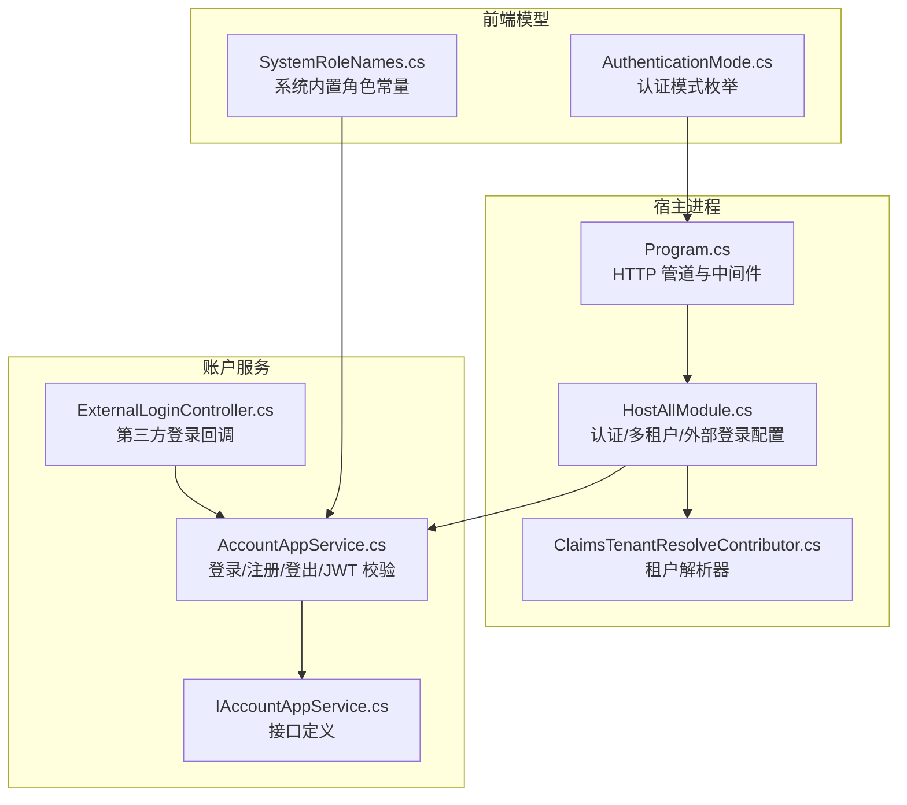
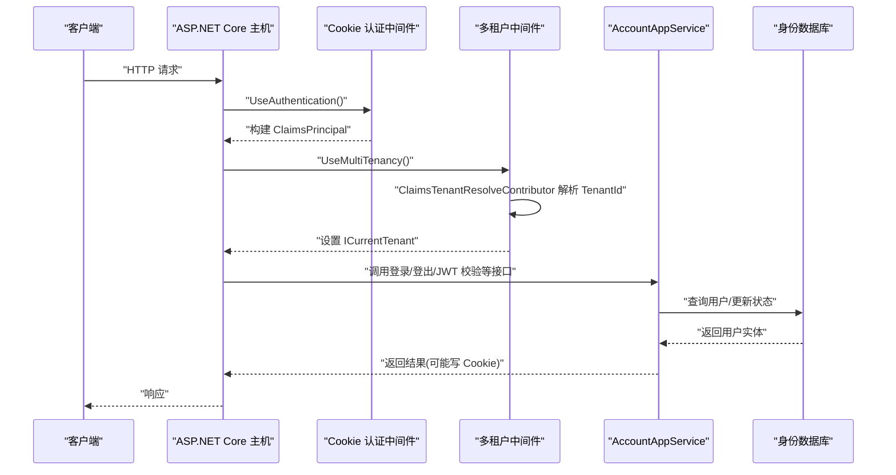
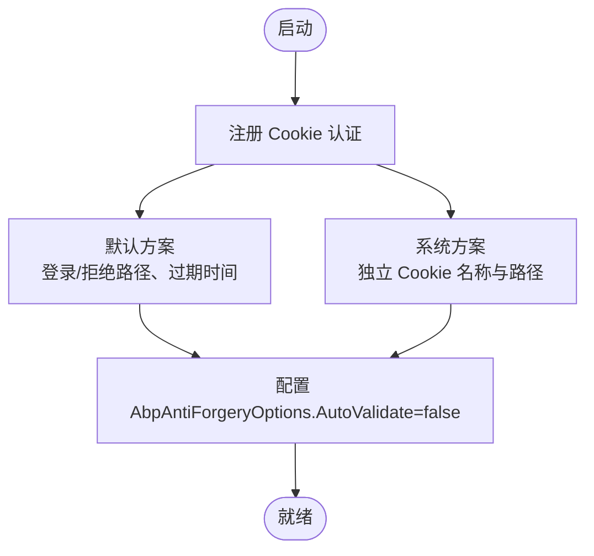
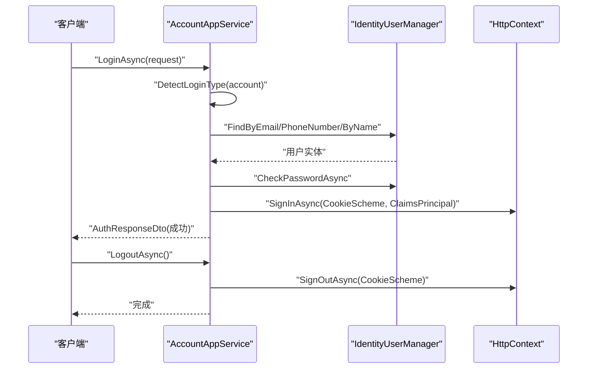
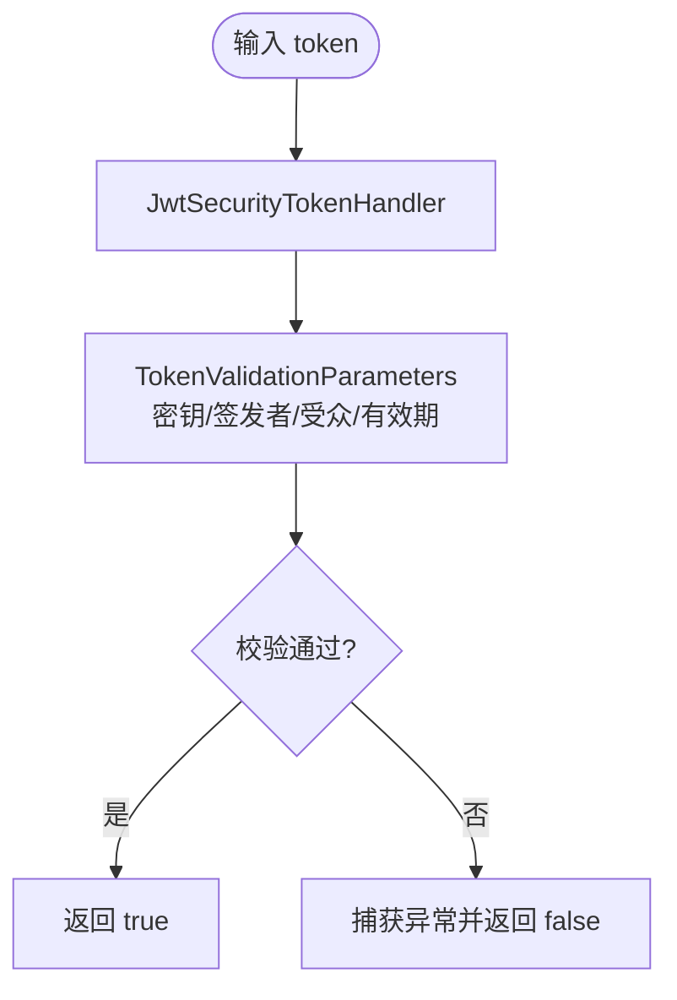
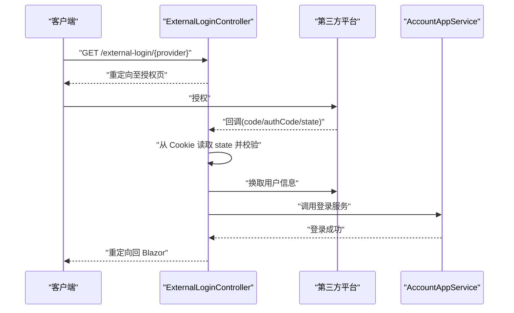
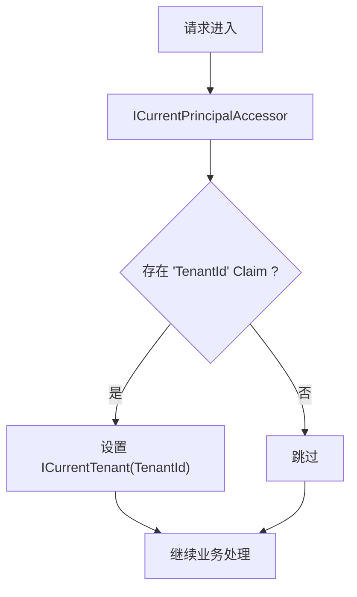
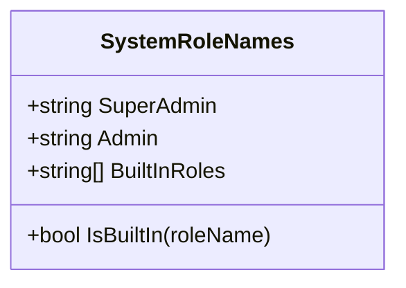
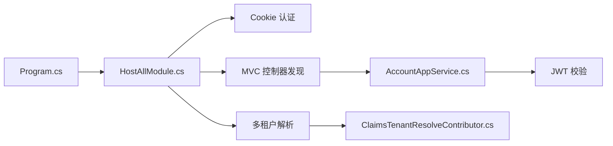

# 认证授权机制

<cite>
**本文引用的文件**   
- [Program.cs](file://src/Host/H.AppLab.Host.All/H.AppLab.Host.All/Program.cs)
- [HostAllModule.cs](file://src/Host/H.AppLab.Host.All/H.AppLab.Host.All/HostAllModule.cs)
- [AccountAppService.cs](file://src/Services/Account/H.Account.Application/Services/AccountAppService.cs)
- [IAccountAppService.cs](file://src/Services/Account/H.Account.Application.Contracts/Services/IAccountAppService.cs)
- [ExternalLoginController.cs](file://src/Services/Account/H.Account.Application/ExternalLogin/ExternalLoginController.cs)
- [ClaimsTenantResolveContributor.cs](file://src/Host/H.AppLab.Host.All/H.AppLab.Host.All/ClaimsTenantResolveContributor.cs)
- [AuthenticationMode.cs](file://src/Components/AppDrawer/H.AppDrawer.Model/AuthenticationMode.cs)
- [SystemRoleNames.cs](file://src/System/SystemPortal/H.SystemPortal.Application.Contracts/Constants/SystemRoleNames.cs)
</cite>

## 目录
1. [简介](#简介)
2. [项目结构](#项目结构)
3. [核心组件](#核心组件)
4. [架构总览](#架构总览)
5. [详细组件分析](#详细组件分析)
6. [依赖关系分析](#依赖关系分析)
7. [性能考虑](#性能考虑)
8. [故障排查指南](#故障排查指南)
9. [结论](#结论)
10. [附录](#附录)

## 简介
本文件面向 AppLab 的认证与授权机制，系统性说明基于 ABP 框架的 Cookie 认证、JWT 令牌校验、外部登录回调流程、角色权限体系以及多租户上下文解析。文档同时给出中间件配置要点、自定义策略与权限检查器的开发指引，并提供流程图与时序图帮助理解关键路径。

## 项目结构
AppLab 采用模块化架构，认证相关能力集中在宿主模块与账户服务中：
- 宿主层负责 HTTP 管道、认证中间件、多租户解析、反 CSRF 等全局配置
- 账户应用服务提供注册、登录、登出、当前用户获取、JWT 校验等能力
- 外部登录控制器处理第三方平台回调并落库后重定向回前端
- 多租户通过 Claims 解析器从认证主体中提取 TenantId，驱动数据隔离

图表来源 
- [Program.cs:1-115](file://src/Host/H.AppLab.Host.All/H.AppLab.Host.All/Program.cs#L1-L115)
- [HostAllModule.cs:1-203](file://src/Host/H.AppLab.Host.All/H.AppLab.Host.All/HostAllModule.cs#L1-L203)
- [ClaimsTenantResolveContributor.cs:1-31](file://src/Host/H.AppLab.Host.All/H.AppLab.Host.All/ClaimsTenantResolveContributor.cs#L1-L31)
- [AccountAppService.cs:1-356](file://src/Services/Account/H.Account.Application/Services/AccountAppService.cs#L1-L356)
- [IAccountAppService.cs:1-18](file://src/Services/Account/H.Account.Application.Contracts/Services/IAccountAppService.cs#L1-L18)
- [ExternalLoginController.cs:74-112](file://src/Services/Account/H.Account.Application/ExternalLogin/ExternalLoginController.cs#L74-L112)
- [AuthenticationMode.cs:1-23](file://src/Components/AppDrawer/H.AppDrawer.Model/AuthenticationMode.cs#L1-L23)
- [SystemRoleNames.cs:1-30](file://src/System/SystemPortal/H.SystemPortal.Application.Contracts/Constants/SystemRoleNames.cs#L1-L30)

章节来源
- [Program.cs:1-115](file://src/Host/H.AppLab.Host.All/H.AppLab.Host.All/Program.cs#L1-L115)
- [HostAllModule.cs:1-203](file://src/Host/H.AppLab.Host.All/H.AppLab.Host.All/HostAllModule.cs#L1-L203)

## 核心组件
- 认证中间件与 Cookie 方案
  - 默认使用 Cookie 认证，支持滑动过期与持久化；另配置独立 SystemCookies 方案用于系统级登录
  - 未认证访问统一重定向到 /account/login 或 /system/login
- 账户应用服务
  - 登录：自动识别邮箱/手机号/用户名，验证密码后写入 Cookie（含 NameIdentifier、Name、Email、MobilePhone）
  - 登出：清除 Cookie 会话
  - JWT 校验：读取配置中的 SecretKey、Issuer、Audience，进行签名与时效校验
- 外部登录
  - 生成授权链接，回调时校验 state，换取用户信息后调用内部服务完成登录并重定向
- 多租户解析
  - 从 Claims 中的 TenantId 解析当前租户，优先于 ABP 内置解析器
- 前端认证模式
  - 提供 None/Optional/Required 三种模式控制页面是否强制登录

章节来源
- [HostAllModule.cs:115-133](file://src/Host/H.AppLab.Host.All/H.AppLab.Host.All/HostAllModule.cs#L115-L133)
- [AccountAppService.cs:115-210](file://src/Services/Account/H.Account.Application/Services/AccountAppService.cs#L115-L210)
- [AccountAppService.cs:222-247](file://src/Services/Account/H.Account.Application/Services/AccountAppService.cs#L222-L247)
- [ExternalLoginController.cs:74-112](file://src/Services/Account/H.Account.Application/ExternalLogin/ExternalLoginController.cs#L74-L112)
- [ClaimsTenantResolveContributor.cs:1-31](file://src/Host/H.AppLab.Host.All/H.AppLab.Host.All/ClaimsTenantResolveContributor.cs#L1-L31)
- [AuthenticationMode.cs:1-23](file://src/Components/AppDrawer/H.AppDrawer.Model/AuthenticationMode.cs#L1-L23)

## 架构总览
下图展示请求进入 ASP.NET Core 管道后的认证与授权流程，以及多租户解析如何影响后续业务逻辑。

图表来源 
- [Program.cs:81-85](file://src/Host/H.AppLab.Host.All/H.AppLab.Host.All/Program.cs#L81-L85)
- [HostAllModule.cs:115-133](file://src/Host/H.AppLab.Host.All/H.AppLab.Host.All/HostAllModule.cs#L115-L133)
- [ClaimsTenantResolveContributor.cs:18-29](file://src/Host/H.AppLab.Host.All/H.AppLab.Host.All/ClaimsTenantResolveContributor.cs#L18-L29)
- [AccountAppService.cs:115-210](file://src/Services/Account/H.Account.Application/Services/AccountAppService.cs#L115-L210)

## 详细组件分析

### 组件A：Cookie 认证与中间件配置
- 默认 Cookie 方案
  - 登录/拒绝路径、过期时间、滑动过期
- 系统级 Cookie 方案
  - 独立 Cookie 名称与登录路径，便于区分系统管理员与企业用户
- 反 CSRF
  - WASM 场景关闭自动验证，依赖 SameSite 保护

图表来源 
- [HostAllModule.cs:115-133](file://src/Host/H.AppLab.Host.All/H.AppLab.Host.All/HostAllModule.cs#L115-L133)
- [HostAllModule.cs:107-111](file://src/Host/H.AppLab.Host.All/H.AppLab.Host.All/HostAllModule.cs#L107-L111)

章节来源
- [HostAllModule.cs:115-133](file://src/Host/H.AppLab.Host.All/H.AppLab.Host.All/HostAllModule.cs#L115-L133)
- [HostAllModule.cs:107-111](file://src/Host/H.AppLab.Host.All/H.AppLab.Host.All/HostAllModule.cs#L107-L111)

### 组件B：登录与登出流程（Cookie）
- 登录
  - 自动识别账号类型（邮箱/手机号/用户名）
  - 在 Host 上下文跨租户查找用户
  - 校验密码、重置失败次数、更新最后登录时间
  - 写入 Cookie（包含 NameIdentifier、Name、Email、MobilePhone）
- 登出
  - 调用 SignOutAsync 清除 Cookie

图表来源 
- [AccountAppService.cs:115-210](file://src/Services/Account/H.Account.Application/Services/AccountAppService.cs#L115-L210)
- [AccountAppService.cs:249-257](file://src/Services/Account/H.Account.Application/Services/AccountAppService.cs#L249-L257)

章节来源
- [AccountAppService.cs:115-210](file://src/Services/Account/H.Account.Application/Services/AccountAppService.cs#L115-L210)
- [AccountAppService.cs:249-257](file://src/Services/Account/H.Account.Application/Services/AccountAppService.cs#L249-L257)

### 组件C：JWT 令牌校验
- 校验参数
  - IssuerSigningKey、ValidIssuer、ValidAudience、ValidateLifetime、ClockSkew=0
- 用途
  - 服务端对传入的 JWT 进行合法性校验，确保来源与受众正确且未过期

图表来源 
- [AccountAppService.cs:222-247](file://src/Services/Account/H.Account.Application/Services/AccountAppService.cs#L222-L247)

章节来源
- [AccountAppService.cs:222-247](file://src/Services/Account/H.Account.Application/Services/AccountAppService.cs#L222-L247)

### 组件D：外部登录回调
- 流程
  - 生成授权链接（微信/钉钉）
  - 回调时从 Cookie 读取 state 并校验
  - 换取用户信息后调用内部服务完成登录并重定向回 Blazor

图表来源 
- [ExternalLoginController.cs:74-112](file://src/Services/Account/H.Account.Application/ExternalLogin/ExternalLoginController.cs#L74-L112)

章节来源
- [ExternalLoginController.cs:74-112](file://src/Services/Account/H.Account.Application/ExternalLogin/ExternalLoginController.cs#L74-L112)

### 组件E：多租户解析（Claims）
- 解析器
  - 从 ClaimsPrincipal 中读取 "TenantId" Claim
  - 插入到 ABP 租户解析链首位，优先生效
- 作用
  - 企业用户选择企业后，所有后续请求按该租户过滤数据

图表来源 
- [ClaimsTenantResolveContributor.cs:18-29](file://src/Host/H.AppLab.Host.All/H.AppLab.Host.All/ClaimsTenantResolveContributor.cs#L18-L29)

章节来源
- [ClaimsTenantResolveContributor.cs:18-29](file://src/Host/H.AppLab.Host.All/H.AppLab.Host.All/ClaimsTenantResolveContributor.cs#L18-L29)

### 组件F：角色与权限（ABP Identity）
- 内置角色常量
  - SuperAdmin、Admin 等，提供 IsBuiltIn 判断
- 数据模型
  - 用户-角色、角色-声明、组织单元-角色等表结构由 ABP Identity 提供
- 使用建议
  - 在控制器或服务方法上使用 [Authorize] 指定角色或策略
  - 结合 ABP 的 Permission 系统进行细粒度授权

图表来源 
- [SystemRoleNames.cs:1-30](file://src/System/SystemPortal/H.SystemPortal.Application.Contracts/Constants/SystemRoleNames.cs#L1-L30)

章节来源
- [SystemRoleNames.cs:1-30](file://src/System/SystemPortal/H.SystemPortal.Application.Contracts/Constants/SystemRoleNames.cs#L1-L30)

### 组件G：前端认证模式
- 模式
  - None：不检测
  - Optional：可选，未登录仅展示状态
  - Required：强制登录，未登录跳转

章节来源
- [AuthenticationMode.cs:1-23](file://src/Components/AppDrawer/H.AppDrawer.Model/AuthenticationMode.cs#L1-L23)

## 依赖关系分析
- Program.cs 负责启用认证、多租户、授权、反 CSRF 中间件
- HostAllModule.cs 集中配置 Cookie 认证、外部登录、多租户解析与 MVC 控制器发现
- AccountAppService.cs 实现登录/登出、JWT 校验、当前用户获取
- ClaimsTenantResolveContributor.cs 作为 ABP 租户解析贡献者注入解析链

图表来源 
- [Program.cs:81-85](file://src/Host/H.AppLab.Host.All/H.AppLab.Host.All/Program.cs#L81-L85)
- [HostAllModule.cs:135-156](file://src/Host/H.AppLab.Host.All/H.AppLab.Host.All/HostAllModule.cs#L135-L156)
- [AccountAppService.cs:222-247](file://src/Services/Account/H.Account.Application/Services/AccountAppService.cs#L222-L247)
- [ClaimsTenantResolveContributor.cs:18-29](file://src/Host/H.AppLab.Host.All/H.AppLab.Host.All/ClaimsTenantResolveContributor.cs#L18-L29)

章节来源
- [Program.cs:81-85](file://src/Host/H.AppLab.Host.All/H.AppLab.Host.All/Program.cs#L81-L85)
- [HostAllModule.cs:135-156](file://src/Host/H.AppLab.Host.All/H.AppLab.Host.All/HostAllModule.cs#L135-L156)

## 性能考虑
- Cookie 认证开销低，适合浏览器端会话管理
- JWT 校验为无状态校验，避免额外存储查询，但需保证密钥安全与算法强度
- 多租户解析基于 Claims，解析成本极低
- 反 CSRF 在 WASM 场景关闭自动验证，减少不必要的校验开销，依赖 SameSite Cookie 防护

[本节为通用指导，无需引用具体文件]

## 故障排查指南
- 登录后仍被重定向到登录页
  - 检查 Cookie 是否写入成功、是否设置了正确的 Scheme 与路径
  - 确认 UseAuthentication 已加入管道且在 UseAuthorization 之前
- JWT 校验失败
  - 核对 SecretKey、Issuer、Audience 是否与签发一致
  - 检查 ClockSkew 与过期时间设置
- 多租户数据为空
  - 确认 Claims 中存在 "TenantId"
  - 检查 ClaimsTenantResolveContributor 是否注册在解析链首位
- 外部登录回调失败
  - 校验 state 是否存在且有效
  - 确认第三方平台回调地址与配置一致

章节来源
- [Program.cs:81-85](file://src/Host/H.AppLab.Host.All/H.AppLab.Host.All/Program.cs#L81-L85)
- [AccountAppService.cs:222-247](file://src/Services/Account/H.Account.Application/Services/AccountAppService.cs#L222-L247)
- [ClaimsTenantResolveContributor.cs:18-29](file://src/Host/H.AppLab.Host.All/H.AppLab.Host.All/ClaimsTenantResolveContributor.cs#L18-L29)
- [ExternalLoginController.cs:74-112](file://src/Services/Account/H.Account.Application/ExternalLogin/ExternalLoginController.cs#L74-L112)

## 结论
AppLab 的认证授权以 ABP 为核心，采用 Cookie 为主、JWT 为辅的策略，配合 Claims 多租户解析与外部登录回调，形成完整的企业级身份与权限体系。通过清晰的中间件配置与模块化设计，开发者可快速扩展自定义认证策略与权限检查器，满足复杂业务需求。

[本节为总结性内容，无需引用具体文件]

## 附录

### ABP 中间件配置与使用要点
- 启用顺序
  - UseRouting -> UseAuthentication -> UseMultiTenancy -> UseAuthorization -> UseAntiforgery
- Cookie 方案
  - 默认方案与系统方案分离，便于不同角色的登录入口与生命周期管理
- 多租户
  - 自定义解析器优先于内置解析器，确保企业选择后的数据隔离

章节来源
- [Program.cs:81-85](file://src/Host/H.AppLab.Host.All/H.AppLab.Host.All/Program.cs#L81-L85)
- [HostAllModule.cs:115-133](file://src/Host/H.AppLab.Host.All/H.AppLab.Host.All/HostAllModule.cs#L115-L133)
- [HostAllModule.cs:171-201](file://src/Host/H.AppLab.Host.All/H.AppLab.Host.All/HostAllModule.cs#L171-L201)

### 自定义认证策略与权限检查器开发指南
- 自定义认证策略
  - 在 HostAllModule 中通过 AddAuthentication 扩展新的 Scheme，并在管道中启用
  - 若需要 Bearer 令牌，可添加 JwtBearer 方案并配置 TokenValidationParameters
- 权限检查器
  - 继承 ABP 的 IPermissionChecker 或基于 Authorize 特性组合 Role/Policy
  - 将自定义策略注册到 AuthorizationOptions，并在控制器或服务上标注
- 最佳实践
  - 将敏感配置（如 SecretKey、Issuer、Audience）放入环境变量或密钥管理服务
  - 对登录接口禁用反 CSRF，对外部回调严格校验 state
  - 使用 ICurrentTenant.Change(null) 在跨租户场景中访问全局数据（如用户）

[本节为通用指导，无需引用具体文件]