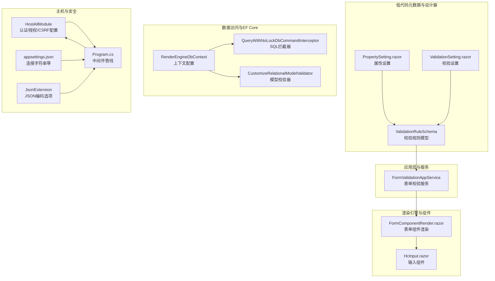
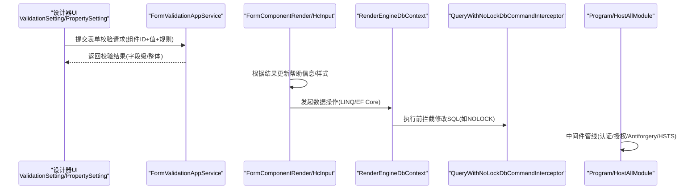
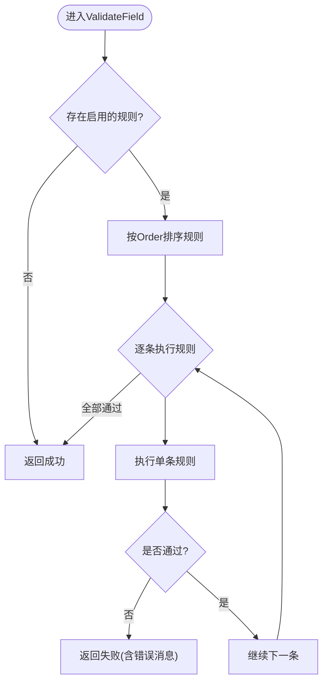
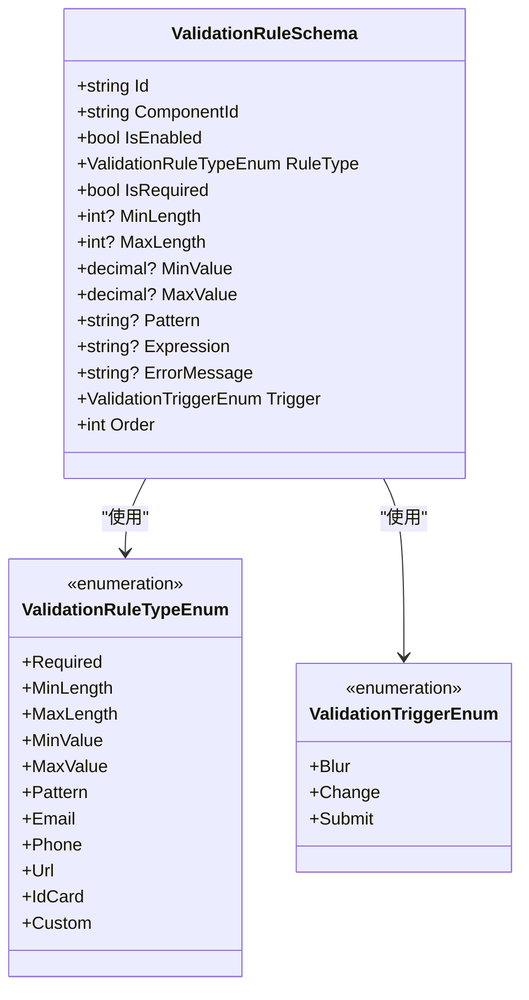
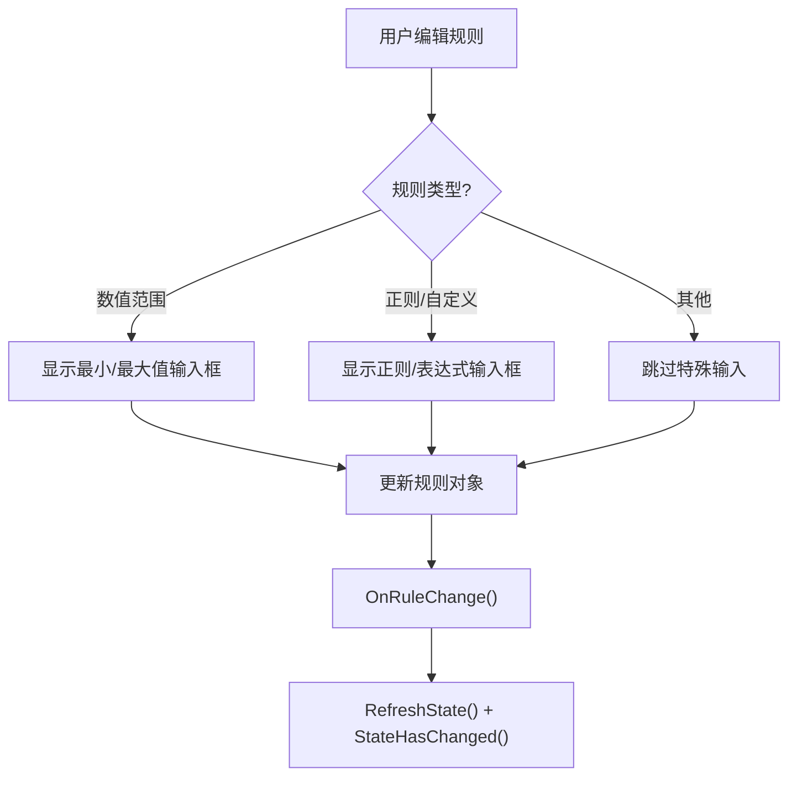
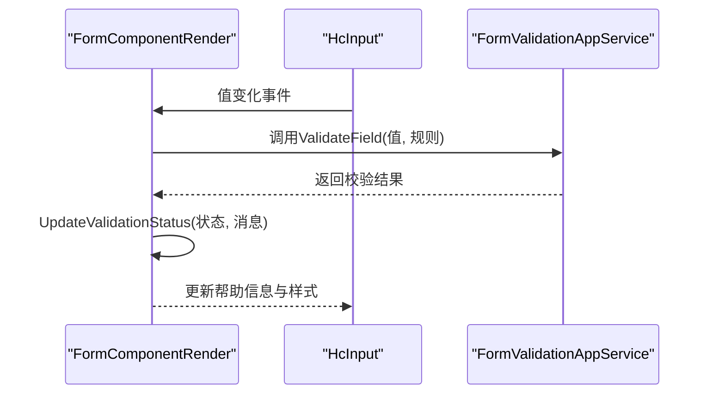
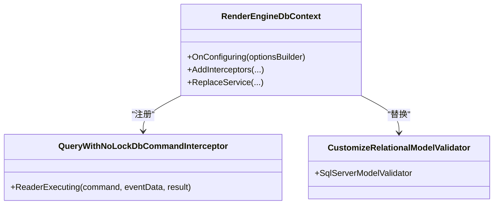
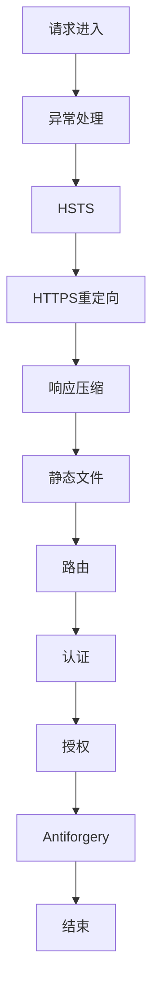
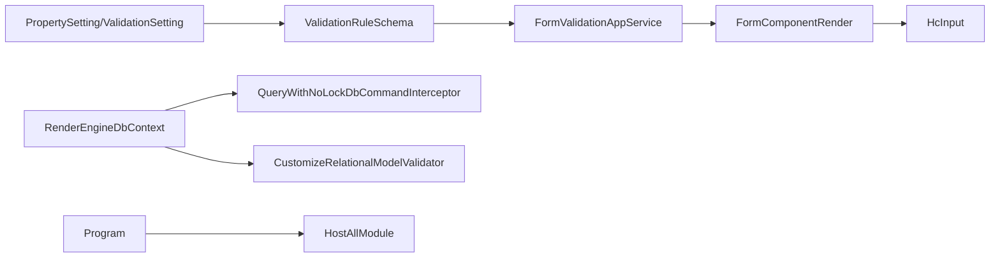

# 输入验证与防护

<cite>
**本文引用的文件**   
- [FormValidationAppService.cs](file://src/LowCode/Common/H.LowCode.Application/Services/FormValidationAppService.cs)
- [ValidationRuleSchema.cs](file://src/LowCode/Common/H.LowCode.MetaSchema/PropertySchemas/ValidationRuleSchema.cs)
- [PropertySetting.razor（PartsDesignEngine）](file://src/LowCode/DesignEngine/H.LowCode.PartsDesignEngine/SettingPanel/PropertySetting.razor)
- [PropertySetting.razor（DesignEngine）](file://src/LowCode/DesignEngine/H.LowCode.DesignEngine/SettingPanel/PropertySetting.razor)
- [ValidationSetting.razor](file://src/LowCode/DesignEngine/H.LowCode.DesignEngine/SettingPanel/ValidationSetting.razor)
- [FormComponentRender.razor](file://src/LowCode/RenderEngine/H.LowCode.Themes.AntBlazor/ComponentRender/FormComponentRender.razor)
- [HcInput.razor](file://src/LowCode/Common/H.LowCode.Components.Defaults/Components/HcInput.razor)
- [QueryWithNoLockDbCommandInterceptor.cs（RenderEngine）](file://src/LowCode/RenderEngine/H.LowCode.RenderEngine.EntityFrameworkCore/Extensions/QueryWithNoLockDbCommandInterceptor.cs)
- [QueryWithNoLockDbCommandInterceptor.cs（DesignEngine）](file://src/LowCode/DesignEngine/H.LowCode.DesignEngine.EntityFrameworkCore/Extensions/QueryWithNoLockDbCommandInterceptor.cs)
- [RenderEngineDbContext.cs](file://src/LowCode/RenderEngine/H.LowCode.RenderEngine.EntityFrameworkCore/EntityFrameworkCore/RenderEngineDbContext.cs)
- [CustomizeRelationalModelValidator.cs（RenderEngine）](file://src/LowCode/RenderEngine/H.LowCode.RenderEngine.EntityFrameworkCore/Extensions/CustomizeRelationalModelValidator.cs)
- [CustomizeRelationalModelValidator.cs（DesignEngine）](file://src/LowCode/DesignEngine/H.LowCode.DesignEngine.EntityFrameworkCore/Extensions/CustomizeRelationalModelValidator.cs)
- [HostAllModule.cs](file://src/Host/H.AppLab.Host.All/H.AppLab.Host.All/HostAllModule.cs)
- [Program.cs（RenderEngine Host）](file://src/Host/RenderEngine/H.LowCode.RenderEngine.Host/Program.cs)
- [Program.cs（Account Host）](file://src/Host/Account/H.Account.Host/Program.cs)
- [appsettings.json（Host All）](file://src/Host/H.AppLab.Host.All/H.AppLab.Host.All/appsettings.json)
- [JsonExtension.cs](file://src/Utils/H.Extensions.System/JsonExtension.cs)
- [AccountAppService.cs](file://src/Services/Account/H.Account.Application/Services/AccountAppService.cs)
</cite>

## 目录
1. [简介](#简介)
2. [项目结构](#项目结构)
3. [核心组件](#核心组件)
4. [架构总览](#架构总览)
5. [详细组件分析](#详细组件分析)
6. [依赖关系分析](#依赖关系分析)
7. [性能考虑](#性能考虑)
8. [故障排查指南](#故障排查指南)
9. [结论](#结论)
10. [附录：最佳实践与安全编码规范](#附录最佳实践与安全编码规范)

## 简介
本文件聚焦 AppLab 的输入验证与安全防护，覆盖以下方面：
- 模型验证实现：基于规则驱动的表单校验（DataAnnotations 风格）、自定义表达式扩展点、前端触发时机与错误提示。
- SQL 注入防护：EF Core 参数化查询、数据库命令拦截器、只读模式保护等。
- XSS 防护：输出编码策略、CSP/HSTS 配置建议、静态资源安全响应头。
- CSRF 防护：SameSite Cookie、Antiforgery 中间件与 WASM 场景下的策略取舍。
- 常见漏洞预防与检测方法。

## 项目结构
围绕输入验证与安全的代码主要分布在低代码元数据、渲染引擎、主机程序与通用工具中：
- 低代码元数据与校验规则定义：ValidationRuleSchema、设计器中的规则编辑 UI。
- 表单校验服务：服务端统一校验逻辑，按优先级执行规则。
- 渲染引擎与组件：表单组件渲染、校验状态更新。
- EF Core 安全配置：命令拦截器、只写保护、模型校验器替换。
- 主机程序：认证、授权、CSRF、HSTS、压缩与静态资源安全头。
- 通用工具：JSON 序列化与编码选项。

**图表来源** 
- [ValidationRuleSchema.cs:1-178](file://src/LowCode/Common/H.LowCode.MetaSchema/PropertySchemas/ValidationRuleSchema.cs#L1-L178)
- [PropertySetting.razor（PartsDesignEngine）:94-113](file://src/LowCode/DesignEngine/H.LowCode.PartsDesignEngine/SettingPanel/PropertySetting.razor#L94-L113)
- [PropertySetting.razor（DesignEngine）:94-113](file://src/LowCode/DesignEngine/H.LowCode.DesignEngine/SettingPanel/PropertySetting.razor#L94-L113)
- [ValidationSetting.razor:64-234](file://src/LowCode/DesignEngine/H.LowCode.DesignEngine/SettingPanel/ValidationSetting.razor#L64-L234)
- [FormValidationAppService.cs:1-252](file://src/LowCode/Common/H.LowCode.Application/Services/FormValidationAppService.cs#L1-L252)
- [FormComponentRender.razor:76-90](file://src/LowCode/RenderEngine/H.LowCode.Themes.AntBlazor/ComponentRender/FormComponentRender.razor#L76-L90)
- [HcInput.razor:1-38](file://src/LowCode/Common/H.LowCode.Components.Defaults/Components/HcInput.razor#L1-L38)
- [QueryWithNoLockDbCommandInterceptor.cs（RenderEngine）:1-36](file://src/LowCode/RenderEngine/H.LowCode.RenderEngine.EntityFrameworkCore/Extensions/QueryWithNoLockDbCommandInterceptor.cs#L1-L36)
- [QueryWithNoLockDbCommandInterceptor.cs（DesignEngine）:1-36](file://src/LowCode/DesignEngine/H.LowCode.DesignEngine.EntityFrameworkCore/Extensions/QueryWithNoLockDbCommandInterceptor.cs#L1-L36)
- [RenderEngineDbContext.cs:174-207](file://src/LowCode/RenderEngine/H.LowCode.RenderEngine.EntityFrameworkCore/EntityFrameworkCore/RenderEngineDbContext.cs#L174-L207)
- [CustomizeRelationalModelValidator.cs（RenderEngine）:1-33](file://src/LowCode/RenderEngine/H.LowCode.RenderEngine.EntityFrameworkCore/Extensions/CustomizeRelationalModelValidator.cs#L1-L33)
- [CustomizeRelationalModelValidator.cs（DesignEngine）:1-33](file://src/LowCode/DesignEngine/H.LowCode.DesignEngine.EntityFrameworkCore/Extensions/CustomizeRelationalModelValidator.cs#L1-L33)
- [HostAllModule.cs:78-117](file://src/Host/H.AppLab.Host.All/H.AppLab.Host.All/HostAllModule.cs#L78-L117)
- [Program.cs（RenderEngine Host）:44-79](file://src/Host/RenderEngine/H.LowCode.RenderEngine.Host/Program.cs#L44-L79)
- [appsettings.json（Host All）:1-18](file://src/Host/H.AppLab.Host.All/H.AppLab.Host.All/appsettings.json#L1-L18)
- [JsonExtension.cs:1-45](file://src/Utils/H.Extensions.System/JsonExtension.cs#L1-L45)

**章节来源**
- [ValidationRuleSchema.cs:1-178](file://src/LowCode/Common/H.LowCode.MetaSchema/PropertySchemas/ValidationRuleSchema.cs#L1-L178)
- [FormValidationAppService.cs:1-252](file://src/LowCode/Common/H.LowCode.Application/Services/FormValidationAppService.cs#L1-L252)
- [RenderEngineDbContext.cs:174-207](file://src/LowCode/RenderEngine/H.LowCode.RenderEngine.EntityFrameworkCore/EntityFrameworkCore/RenderEngineDbContext.cs#L174-L207)
- [Program.cs（RenderEngine Host）:44-79](file://src/Host/RenderEngine/H.LowCode.RenderEngine.Host/Program.cs#L44-L79)
- [HostAllModule.cs:78-117](file://src/Host/H.AppLab.Host.All/H.AppLab.Host.All/HostAllModule.cs#L78-L117)

## 核心组件
- 表单校验服务（服务端）：集中式规则驱动校验，支持必填、长度、数值范围、正则、邮箱、手机、URL、自定义表达式等；按 Order 排序并短路返回首个失败结果。
- 校验规则模型：以 JSON 字段映射描述规则类型、阈值、触发时机、错误消息等，便于设计器可视化配置与持久化。
- 设计器 UI：提供规则编辑界面，支持最小/最大长度、数值范围、正则/自定义表达式、错误消息与触发时机选择。
- 渲染组件：表单组件在渲染时根据校验结果更新帮助信息与样式，异步刷新避免堆栈问题。
- EF Core 安全：通过 DbCommandInterceptor 对 SQL 进行拦截（如添加 NOLOCK），并通过 DbContext 注册只写保护与模型校验器替换。
- 主机安全：启用 HSTS、HTTPS 重定向、异常处理、认证与授权、Antiforgery；WASM 场景下关闭自动验证但依赖 SameSite Cookie 提供 CSRF 保护。

**章节来源**
- [FormValidationAppService.cs:1-252](file://src/LowCode/Common/H.LowCode.Application/Services/FormValidationAppService.cs#L1-L252)
- [ValidationRuleSchema.cs:1-178](file://src/LowCode/Common/H.LowCode.MetaSchema/PropertySchemas/ValidationRuleSchema.cs#L1-L178)
- [ValidationSetting.razor:64-234](file://src/LowCode/DesignEngine/H.LowCode.DesignEngine/SettingPanel/ValidationSetting.razor#L64-L234)
- [PropertySetting.razor（DesignEngine）:94-113](file://src/LowCode/DesignEngine/H.LowCode.DesignEngine/SettingPanel/PropertySetting.razor#L94-L113)
- [FormComponentRender.razor:76-90](file://src/LowCode/RenderEngine/H.LowCode.Themes.AntBlazor/ComponentRender/FormComponentRender.razor#L76-L90)
- [RenderEngineDbContext.cs:174-207](file://src/LowCode/RenderEngine/H.LowCode.RenderEngine.EntityFrameworkCore/EntityFrameworkCore/RenderEngineDbContext.cs#L174-L207)
- [Program.cs（RenderEngine Host）:44-79](file://src/Host/RenderEngine/H.LowCode.RenderEngine.Host/Program.cs#L44-L79)

## 架构总览
下图展示从设计器到渲染引擎再到数据访问的完整流程，以及安全相关中间件的介入点。

**图表来源** 
- [ValidationSetting.razor:64-234](file://src/LowCode/DesignEngine/H.LowCode.DesignEngine/SettingPanel/ValidationSetting.razor#L64-L234)
- [PropertySetting.razor（DesignEngine）:94-113](file://src/LowCode/DesignEngine/H.LowCode.DesignEngine/SettingPanel/PropertySetting.razor#L94-L113)
- [FormValidationAppService.cs:1-252](file://src/LowCode/Common/H.LowCode.Application/Services/FormValidationAppService.cs#L1-L252)
- [FormComponentRender.razor:76-90](file://src/LowCode/RenderEngine/H.LowCode.Themes.AntBlazor/ComponentRender/FormComponentRender.razor#L76-L90)
- [RenderEngineDbContext.cs:174-207](file://src/LowCode/RenderEngine/H.LowCode.RenderEngine.EntityFrameworkCore/EntityFrameworkCore/RenderEngineDbContext.cs#L174-L207)
- [QueryWithNoLockDbCommandInterceptor.cs（RenderEngine）:1-36](file://src/LowCode/RenderEngine/H.LowCode.RenderEngine.EntityFrameworkCore/Extensions/QueryWithNoLockDbCommandInterceptor.cs#L1-L36)
- [Program.cs（RenderEngine Host）:44-79](file://src/Host/RenderEngine/H.LowCode.RenderEngine.Host/Program.cs#L44-L79)
- [HostAllModule.cs:78-117](file://src/Host/H.AppLab.Host.All/H.AppLab.Host.All/HostAllModule.cs#L78-L117)

## 详细组件分析

### 表单校验服务（服务端）
- 功能要点：
  - 按 IsEnabled 过滤并按 Order 排序规则，依次执行，短路返回首个失败结果。
  - 支持 Required、MinLength、MaxLength、MinValue、MaxValue、Pattern、Email、Phone、Url、Custom。
  - 自定义表达式预留扩展点（Expression），当前未实现具体解析。
  - 异常捕获并包装为失败结果，避免崩溃。
- 复杂度与优化：
  - 单次校验 O(n) 遍历规则；可缓存已编译的正则以提升 Pattern 性能。
  - 批量校验 ValidateForm 对组件集合迭代，适合分页或批量提交。
- 错误处理：
  - 每个规则失败返回对应 ErrorMessage，默认消息由枚举映射提供。

**图表来源** 
- [FormValidationAppService.cs:15-34](file://src/LowCode/Common/H.LowCode.Application/Services/FormValidationAppService.cs#L15-L34)
- [FormValidationAppService.cs:64-108](file://src/LowCode/Common/H.LowCode.Application/Services/FormValidationAppService.cs#L64-L108)

**章节来源**
- [FormValidationAppService.cs:1-252](file://src/LowCode/Common/H.LowCode.Application/Services/FormValidationAppService.cs#L1-L252)

### 校验规则模型（ValidationRuleSchema）
- 字段说明：
  - Id、ComponentId、IsEnabled、RuleType、IsRequired、MinLength、MaxLength、MinValue、MaxValue、Pattern、Expression、ErrorMessage、Trigger、Order。
- 枚举：
  - ValidationRuleTypeEnum：Required、MinLength、MaxLength、MinValue、MaxValue、Pattern、Email、Phone、Url、IdCard、Custom。
  - ValidationTriggerEnum：Blur、Change、Submit。
- 使用方式：
  - 设计器生成 JSON 配置，传输至服务端或服务端读取组件元数据进行校验。

**图表来源** 
- [ValidationRuleSchema.cs:1-178](file://src/LowCode/Common/H.LowCode.MetaSchema/PropertySchemas/ValidationRuleSchema.cs#L1-L178)

**章节来源**
- [ValidationRuleSchema.cs:1-178](file://src/LowCode/Common/H.LowCode.MetaSchema/PropertySchemas/ValidationRuleSchema.cs#L1-L178)

### 设计器校验设置 UI
- 能力：
  - 支持最小/最大长度、数值范围、正则/自定义表达式、错误消息、触发时机（输入时/失去焦点/提交）。
  - 动态显示不同规则对应的输入控件。
  - 维护规则顺序与刷新组件状态。
- 交互：
  - OnRuleChange 触发属性变更，调用 RefreshState 与 StateHasChanged 更新 UI。

**图表来源** 
- [ValidationSetting.razor:64-234](file://src/LowCode/DesignEngine/H.LowCode.DesignEngine/SettingPanel/ValidationSetting.razor#L64-L234)
- [PropertySetting.razor（DesignEngine）:94-113](file://src/LowCode/DesignEngine/H.LowCode.DesignEngine/SettingPanel/PropertySetting.razor#L94-L113)

**章节来源**
- [ValidationSetting.razor:64-234](file://src/LowCode/DesignEngine/H.LowCode.DesignEngine/SettingPanel/ValidationSetting.razor#L64-L234)
- [PropertySetting.razor（DesignEngine）:94-113](file://src/LowCode/DesignEngine/H.LowCode.DesignEngine/SettingPanel/PropertySetting.razor#L94-L113)

### 渲染组件与校验状态更新
- FormComponentRender：
  - 根据规则类型映射默认错误消息。
  - UpdateValidationStatus 异步触发 StateHasChanged，避免同步调用导致的堆栈问题。
- HcInput：
  - 基础输入组件，支持 Placeholder、Disabled、MaxLength、ReadOnly、AllowClear 等属性。
  - 事件绑定 oninput/onchange，用于双向绑定与即时反馈。

**图表来源** 
- [FormComponentRender.razor:76-90](file://src/LowCode/RenderEngine/H.LowCode.Themes.AntBlazor/ComponentRender/FormComponentRender.razor#L76-L90)
- [HcInput.razor:1-38](file://src/LowCode/Common/H.LowCode.Components.Defaults/Components/HcInput.razor#L1-L38)
- [FormValidationAppService.cs:15-34](file://src/LowCode/Common/H.LowCode.Application/Services/FormValidationAppService.cs#L15-L34)

**章节来源**
- [FormComponentRender.razor:76-90](file://src/LowCode/RenderEngine/H.LowCode.Themes.AntBlazor/ComponentRender/FormComponentRender.razor#L76-L90)
- [HcInput.razor:1-38](file://src/LowCode/Common/H.LowCode.Components.Defaults/Components/HcInput.razor#L1-L38)

### EF Core 安全配置与 SQL 注入防护
- 命令拦截器（QueryWithNoLockDbCommandInterceptor）：
  - 在执行 Reader 前拦截 SQL，匹配表别名并追加 WITH (NOLOCK)，提升并发读性能。
  - 注意：仅针对 SELECT 类查询，不改变参数化机制，不影响安全性。
- DbContext 配置（RenderEngineDbContext）：
  - 注册 ReadOnlySaveChangesInterceptor 防止误写。
  - 替换 IModelCacheKeyFactory 与 IModelValidator（CustomizeRelationalModelValidator）解决重复注册问题。
  - 注册 QueryWithNoLockDbCommandInterceptor。
- CustomizeRelationalModelValidator：
  - 继承 SqlServerModelValidator，重写校验逻辑确保表可重复注册。

**图表来源** 
- [RenderEngineDbContext.cs:174-207](file://src/LowCode/RenderEngine/H.LowCode.RenderEngine.EntityFrameworkCore/EntityFrameworkCore/RenderEngineDbContext.cs#L174-L207)
- [QueryWithNoLockDbCommandInterceptor.cs（RenderEngine）:1-36](file://src/LowCode/RenderEngine/H.LowCode.RenderEngine.EntityFrameworkCore/Extensions/QueryWithNoLockDbCommandInterceptor.cs#L1-L36)
- [CustomizeRelationalModelValidator.cs（RenderEngine）:1-33](file://src/LowCode/RenderEngine/H.LowCode.RenderEngine.EntityFrameworkCore/Extensions/CustomizeRelationalModelValidator.cs#L1-L33)

**章节来源**
- [RenderEngineDbContext.cs:174-207](file://src/LowCode/RenderEngine/H.LowCode.RenderEngine.EntityFrameworkCore/EntityFrameworkCore/RenderEngineDbContext.cs#L174-L207)
- [QueryWithNoLockDbCommandInterceptor.cs（RenderEngine）:1-36](file://src/LowCode/RenderEngine/H.LowCode.RenderEngine.EntityFrameworkCore/Extensions/QueryWithNoLockDbCommandInterceptor.cs#L1-L36)
- [CustomizeRelationalModelValidator.cs（RenderEngine）:1-33](file://src/LowCode/RenderEngine/H.LowCode.RenderEngine.EntityFrameworkCore/Extensions/CustomizeRelationalModelValidator.cs#L1-L33)

### 主机安全与 CSRF/XSS/HSTS
- Program 中间件管线：
  - UseExceptionHandler、UseHsts、UseHttpsRedirection、UseResponseCompression、UseStaticFiles、UseRouting、UseAuthentication、UseAuthorization、UseAntiforgery。
- HostAllModule：
  - 配置 Cookie 认证（双 Scheme）、多租户、外部登录。
  - AbpAntiForgeryOptions.AutoValidate=false（WASM 场景依赖 SameSite Cookie 提供 CSRF 保护）。
- appsettings.json：
  - 连接字符串配置（Trusted_Connection=True;TrustServerCertificate=True），生产环境建议使用证书与加密连接。
- JsonExtension：
  - 使用 UnsafeRelaxedJsonEscaping 编码器，需注意输出编码策略以避免 XSS。

**图表来源** 
- [Program.cs（RenderEngine Host）:44-79](file://src/Host/RenderEngine/H.LowCode.RenderEngine.Host/Program.cs#L44-L79)
- [Program.cs（Account Host）:1-48](file://src/Host/Account/H.Account.Host/Program.cs#L1-L48)
- [HostAllModule.cs:78-117](file://src/Host/H.AppLab.Host.All/H.AppLab.Host.All/HostAllModule.cs#L78-L117)
- [appsettings.json（Host All）:1-18](file://src/Host/H.AppLab.Host.All/H.AppLab.Host.All/appsettings.json#L1-L18)
- [JsonExtension.cs:1-45](file://src/Utils/H.Extensions.System/JsonExtension.cs#L1-L45)

**章节来源**
- [Program.cs（RenderEngine Host）:44-79](file://src/Host/RenderEngine/H.LowCode.RenderEngine.Host/Program.cs#L44-L79)
- [Program.cs（Account Host）:1-48](file://src/Host/Account/H.Account.Host/Program.cs#L1-L48)
- [HostAllModule.cs:78-117](file://src/Host/H.AppLab.Host.All/H.AppLab.Host.All/HostAllModule.cs#L78-L117)
- [appsettings.json（Host All）:1-18](file://src/Host/H.AppLab.Host.All/H.AppLab.Host.All/appsettings.json#L1-L18)
- [JsonExtension.cs:1-45](file://src/Utils/H.Extensions.System/JsonExtension.cs#L1-L45)

## 依赖关系分析
- 低代码元数据与校验服务强耦合于 ValidationRuleSchema，设计器 UI 直接编辑该模型。
- 渲染组件依赖 FormValidationAppService 进行服务端校验，同时本地 UI 更新通过异步刷新。
- EF Core 上下文依赖拦截器与模型校验器，保证只读与并发读优化。
- 主机中间件依赖认证与授权模块，WASM 场景下关闭自动验证但依赖 SameSite Cookie。

**图表来源** 
- [ValidationRuleSchema.cs:1-178](file://src/LowCode/Common/H.LowCode.MetaSchema/PropertySchemas/ValidationRuleSchema.cs#L1-L178)
- [FormValidationAppService.cs:1-252](file://src/LowCode/Common/H.LowCode.Application/Services/FormValidationAppService.cs#L1-L252)
- [PropertySetting.razor（DesignEngine）:94-113](file://src/LowCode/DesignEngine/H.LowCode.DesignEngine/SettingPanel/PropertySetting.razor#L94-L113)
- [ValidationSetting.razor:64-234](file://src/LowCode/DesignEngine/H.LowCode.DesignEngine/SettingPanel/ValidationSetting.razor#L64-L234)
- [FormComponentRender.razor:76-90](file://src/LowCode/RenderEngine/H.LowCode.Themes.AntBlazor/ComponentRender/FormComponentRender.razor#L76-L90)
- [HcInput.razor:1-38](file://src/LowCode/Common/H.LowCode.Components.Defaults/Components/HcInput.razor#L1-L38)
- [RenderEngineDbContext.cs:174-207](file://src/LowCode/RenderEngine/H.LowCode.RenderEngine.EntityFrameworkCore/EntityFrameworkCore/RenderEngineDbContext.cs#L174-L207)
- [QueryWithNoLockDbCommandInterceptor.cs（RenderEngine）:1-36](file://src/LowCode/RenderEngine/H.LowCode.RenderEngine.EntityFrameworkCore/Extensions/QueryWithNoLockDbCommandInterceptor.cs#L1-L36)
- [CustomizeRelationalModelValidator.cs（RenderEngine）:1-33](file://src/LowCode/RenderEngine/H.LowCode.RenderEngine.EntityFrameworkCore/Extensions/CustomizeRelationalModelValidator.cs#L1-L33)
- [Program.cs（RenderEngine Host）:44-79](file://src/Host/RenderEngine/H.LowCode.RenderEngine.Host/Program.cs#L44-L79)
- [HostAllModule.cs:78-117](file://src/Host/H.AppLab.Host.All/H.AppLab.Host.All/HostAllModule.cs#L78-L117)

**章节来源**
- [ValidationRuleSchema.cs:1-178](file://src/LowCode/Common/H.LowCode.MetaSchema/PropertySchemas/ValidationRuleSchema.cs#L1-L178)
- [FormValidationAppService.cs:1-252](file://src/LowCode/Common/H.LowCode.Application/Services/FormValidationAppService.cs#L1-L252)
- [RenderEngineDbContext.cs:174-207](file://src/LowCode/RenderEngine/H.LowCode.RenderEngine.EntityFrameworkCore/EntityFrameworkCore/RenderEngineDbContext.cs#L174-L207)
- [Program.cs（RenderEngine Host）:44-79](file://src/Host/RenderEngine/H.LowCode.RenderEngine.Host/Program.cs#L44-L79)
- [HostAllModule.cs:78-117](file://src/Host/H.AppLab.Host.All/H.AppLab.Host.All/HostAllModule.cs#L78-L117)

## 性能考虑
- 正则表达式缓存：Pattern 校验每次创建 Regex 可能带来开销，建议预编译或缓存。
- 批量校验：ValidateForm 对组件集合迭代，建议在提交前合并校验以减少往返。
- EF Core 拦截器：WITH (NOLOCK) 提升读性能，但需评估脏读风险。
- 响应压缩：Brotli/Gzip 减少 WASM 资源体积，提高加载速度。

[本节为通用指导，无需特定文件引用]

## 故障排查指南
- 校验失败定位：
  - 检查 ValidationRuleSchema 的 IsEnabled、Order、RuleType 与阈值是否正确。
  - 查看 FormValidationAppService 的错误消息映射与异常捕获。
- 渲染状态未更新：
  - 确认 FormComponentRender.UpdateValidationStatus 是否异步调用 StateHasChanged。
- EF Core 只写保护：
  - 若出现意外写入，检查 ReadOnlySaveChangesInterceptor 是否生效。
- CSRF 相关问题：
  - WASM 场景下 AutoValidate=false，确认 SameSite Cookie 配置与跨域策略。
- JSON 编码问题：
  - JsonExtension 使用 UnsafeRelaxedJsonEscaping，输出包含脚本时需额外编码。

**章节来源**
- [FormValidationAppService.cs:104-108](file://src/LowCode/Common/H.LowCode.Application/Services/FormValidationAppService.cs#L104-L108)
- [FormComponentRender.razor:84-90](file://src/LowCode/RenderEngine/H.LowCode.Themes.AntBlazor/ComponentRender/FormComponentRender.razor#L84-L90)
- [RenderEngineDbContext.cs:182-190](file://src/LowCode/RenderEngine/H.LowCode.RenderEngine.EntityFrameworkCore/EntityFrameworkCore/RenderEngineDbContext.cs#L182-L190)
- [HostAllModule.cs:105-111](file://src/Host/H.AppLab.Host.All/H.AppLab.Host.All/HostAllModule.cs#L105-L111)
- [JsonExtension.cs:1-45](file://src/Utils/H.Extensions.System/JsonExtension.cs#L1-L45)

## 结论
AppLab 在输入验证与安全防护方面采用“规则驱动 + 服务端集中校验 + EF Core 安全配置 + 主机中间件”的多层防御体系。设计器提供可视化规则配置，渲染组件负责即时反馈，EF Core 拦截器保障并发与只读安全，主机中间件提供认证、授权、CSRF 与 HSTS 等基础安全能力。建议在生产环境中进一步收紧 JSON 编码策略、启用严格 CSP、完善日志审计与入侵检测。

[本节为总结性内容，无需特定文件引用]

## 附录：最佳实践与安全编码规范
- 输入验证最佳实践
  - 始终在服务端执行校验，前端仅作用户体验增强。
  - 使用白名单与严格格式校验（邮箱、手机号、URL、正则）。
  - 限制长度与数值范围，避免缓冲区溢出与拒绝服务。
  - 自定义表达式需谨慎实现，避免执行不可信代码。
- SQL 注入防护
  - 使用 EF Core 参数化查询，禁止拼接 SQL。
  - 使用 DbCommandInterceptor 进行只读优化，不改变参数化机制。
  - 启用只写保护，防止误写。
- XSS 防护
  - 输出编码：对动态内容进行 HTML/JS/CSS 编码，避免直接插入 DOM。
  - CSP：配置 Content-Security-Policy 限制脚本来源与内联脚本。
  - HSTS：强制 HTTPS，防止降级攻击。
- CSRF 防护
  - 使用 SameSite Cookie 与 Antiforgery 令牌。
  - WASM 场景可关闭自动验证，但需确保 SameSite 与跨域策略正确。
- 常见漏洞预防与检测
  - 定期扫描依赖库漏洞（SAST/DAST）。
  - 审计敏感操作日志与异常堆栈。
  - 对第三方输入进行严格校验与转义。

[本节为通用指导，无需特定文件引用]